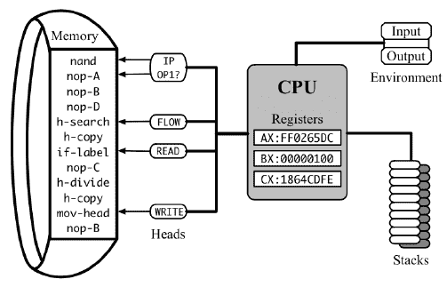
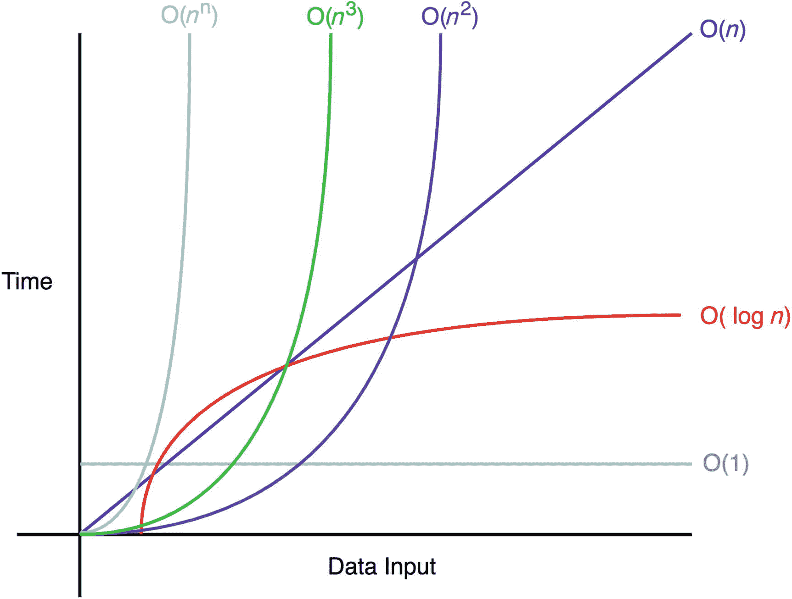

# 复杂性模型

> [`en.algorithmica.org/hpc/complexity/`](https://en.algorithmica.org/hpc/complexity/)

如果你曾经打开过一本计算机科学教科书，它可能在非常开头的地方介绍了*计算复杂性*。简单来说，它是在计算过程中执行的总数*基本操作*（加法、乘法、读取、写入等），这些操作可以按其*成本*进行加权。

复杂性是一个古老的概念。它在 20 世纪 60 年代初被[系统地阐述](http://www.cs.albany.edu/~res/comp_complexity_ams_1965.pdf)，自那时起，它一直被普遍用作设计算法的成本函数。这个模型之所以能迅速被采纳，是因为它很好地近似了当时计算机的工作方式。

### 经典复杂性理论

CPU 的“基本操作”被称为*指令*，它们的“成本”被称为*延迟*。指令存储在*内存*中，并由处理器逐个执行，处理器在多个*寄存器*中存储一些内部*状态*。这些寄存器之一是*指令指针*，它指示下一个要读取和执行的指令的地址。每个指令以某种方式改变处理器的状态（包括移动指令指针），可能修改主内存，并在下一个指令可以开始之前需要不同数量的*CPU 周期*来完成。

为了估计程序的真正运行时间，你需要将其执行指令的所有延迟相加，然后除以*时钟频率*，即特定 CPU 每秒完成的周期数。

时钟频率是一个波动且往往未知变量，它取决于 CPU 型号、操作系统设置、当前微芯片温度、其他组件的功耗以及许多其他因素。相比之下，指令延迟是静态的，甚至在不同的 CPU 中，当以时钟周期表示时，它们甚至有一定的稳定性，因此计数它们对于分析目的来说更有用。

例如，按定义的矩阵乘法算法需要总共 $n² \cdot (n + n - 1)$ 次算术运算：具体来说，$n³$ 次乘法和 $n² \cdot (n - 1)$ 次加法。如果我们查阅这些指令的延迟（在称为*指令表*的特殊文档中，如[这个](https://www.agner.org/optimize/instruction_tables.pdf)），我们可以发现，例如，乘法需要 3 个周期，而加法需要 1 个周期，因此整个计算需要总共 $3 \cdot n³ + n² \cdot (n - 1) = 4 \cdot n³ - n²$ 个时钟周期（粗略地忽略所有其他需要完成以“喂”这些指令正确数据的操作）。

类似于如何使用指令延迟的总和作为总执行时间的时钟无关的代理，计算复杂度可以用来量化抽象算法的内在时间需求，而不依赖于特定计算机的选择。

### 渐进复杂度

将执行时间表示为输入大小的函数的想法现在看起来很显然，但在 20 世纪 60 年代并不是这样。当时，[典型计算机](https://en.wikipedia.org/wiki/CDC_1604)价值数百万美元，如此之大以至于需要单独的房间，时钟速度以千赫兹为单位。它们被用于手头的实际任务，如预测天气，将火箭送入太空，或计算出苏联核导弹从古巴海岸飞行的距离——所有这些都是有限长度的问题。那个时代的工程师主要关心的是如何乘以$3 \times 3$矩阵，而不是$n \times n$矩阵。

导致这种转变的原因是计算机科学家们获得的信心，即计算机将继续变得更快——事实上也是如此。随着时间的推移，人们停止了计算执行时间，然后停止了计算周期，甚至停止了精确计算操作，用*估计*来代替，在足够大的输入下，这个估计只会比常数因子多。在*渐进复杂度*下，冗长的“$4 \cdot n³ - n²$操作”变成了简单的“$\Theta(n³)$”，在“大 O”符号中隐藏了单个操作的初始成本，以及所有其他硬件的复杂性。

我们使用渐进复杂度的原因是它提供了简洁性，同时仍然足够精确，可以产生关于相对算法性能在大数据集上的有用结果。在承诺计算机最终将足够快，能够在合理的时间内处理任何*足够大的*输入的情况下，渐进更快的算法在实时情况下也将更快，无论隐藏的常数是多少。

但这个承诺最终证明是不真实的——至少在时钟速度和指令延迟方面不是——在这一章中，我们将尝试解释为什么以及如何处理这个问题。

[现代硬件 →](https://en.algorithmica.org/hpc/complexity/hardware/)

[../计算机体系结构 →](https://en.algorithmica.org/hpc/architecture/)
