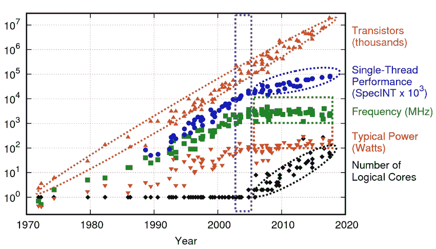
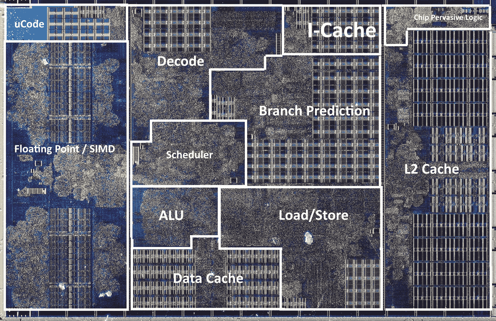

# 现代硬件

> 原文：[`en.algorithmica.org/hpc/complexity/hardware/`](https://en.algorithmica.org/hpc/complexity/hardware/)

20 世纪 60 年代超级计算机的主要缺点并不是它们运行缓慢——相对而言，它们并不慢——而是它们体积庞大，使用复杂，价格昂贵，只有世界超级大国的政府才能负担得起。它们的体积是它们如此昂贵的原因：它们需要大量的定制组件，这些组件必须在宏观世界中由持有高级电气工程学位的人非常仔细地组装，这个过程无法扩大到大规模生产。

转折点是**微芯片**——单个、微小、完整的电路——的发展，它彻底改变了行业，并最终可能是 20 世纪最重要的发明。1965 年价值数百万美元的计算机设备到了 1975 年可以装在一个[4mm × 4mm 的硅片](https://en.wikipedia.org/wiki/MOS_Technology_6502)^(1)上，你只需花 25 美元就能买到。这种显著的成本降低在接下来的十年中开始了家用计算机革命，像 Apple II、Atari 2600、Commodore 64 和 IBM PC 这样的计算机开始进入大众市场。

### [#](https://en.algorithmica.org/hpc/complexity/hardware/#how-microchips-are-made)微芯片的制作过程

微芯片是通过一种称为[光刻](https://en.wikipedia.org/wiki/Photolithography)的过程“打印”在晶圆上的，这个过程涉及

1.  培育并切割[非常纯净的硅晶圆](https://en.wikipedia.org/wiki/Wafer_(electronics))，

1.  在其上覆盖一层[当光子击中时会溶解的物质](https://en.wikipedia.org/wiki/Photoresist)，

1.  以特定的模式用光子击中它，

1.  化学性地[蚀刻](https://en.wikipedia.org/wiki/Etching_(microfabrication))现在暴露的部分，

1.  移除剩余的光刻胶，

…然后在接下来的几个月内再进行 40-50 步，以完成 CPU 的其余部分。

现在考虑“用光子击中它”的部分。为此，我们可以使用一个镜头系统，将图案投射到一个更小的区域，从而有效地制作一个具有所有所需特性的微小电路。这样，20 世纪 70 年代的光学技术能够在指甲盖大小的地方容纳几千个晶体管，这为微芯片提供了几个关键优势，而宏观世界的计算机则没有这些优势：

+   更高的时钟频率（以前受光速的限制）；

+   能够扩大生产规模；

+   更低的材料和能源消耗，从而降低了每单位成本。

除了这些直接的好处之外，光刻技术还开辟了一条清晰的道路来进一步提高性能：你只需使镜头更强，这反过来又会以相对较小的努力创造出更小但功能相同的设备。

### [#](https://en.algorithmica.org/hpc/complexity/hardware/#dennard-scaling)Dennard Scaling

考虑一下当我们缩小微芯片时会发生什么。较小的电路需要成比例地减少材料，较小的晶体管切换所需的时间更短（以及芯片中所有其他物理过程），这允许降低电压并提高时钟频率。

一个更详细的观察，被称为*Dennard 缩放*，表明通过减少 30%的晶体管尺寸

+   将晶体管密度翻倍 ($0.7² \approx 0.5$)

+   将时钟速度提高了 40% ($\frac{1}{0.7} \approx 1.4$)

+   并且保持了整体*功率密度*不变。

由于单位制造成本是面积的一个函数，而利用成本主要是电力成本^(2)，每一代新产品应该大致具有相同的总成本，但时钟频率提高 40%，晶体管数量增加一倍，可以迅速用于添加新指令或增加字长——以跟上内存微芯片中发生的相同小型化。

由于在设计过程中可以在能量和性能之间进行权衡，因此制造过程本身的保真度，例如“180nm”或“65nm”，直接转化为晶体管的密度，成为了 CPU 效率的标志^(3)。

在计算历史的大部分时间里，光学缩小是性能提升的主要驱动力。英特尔前首席执行官戈登·摩尔在 1975 年预测，微处理器的晶体管数量每两年将翻一番。他的预测一直持续到今天，并被称为*摩尔定律*。

Dennard 缩放和摩尔定律都不是物理定律，而只是精明的工程师做出的观察。它们都注定会在某个时刻停止，因为基本的物理限制，最终限制是硅原子的尺寸。事实上，Dennard 缩放已经停止了——由于电力问题。

从热力学角度来看，计算机只是一个非常高效的将电能转换为热能的设备。这些热量最终需要被移除，并且从毫米级晶体中散发的功率有一个物理极限。计算机工程师为了最大化性能，实际上只是选择了可能的最大时钟频率，以保持整体功耗不变。如果晶体管变得更小，它们具有更小的电容，这意味着翻转它们所需的电压更低，这反过来又允许提高时钟频率。

大约在 2005-2007 年，这种策略因为*漏电*效应而停止工作：电路特征变得如此之小，以至于它们的磁场开始使邻近电路中的电子以它们不应该的方向移动，造成不必要的加热和偶尔的位翻转。

减缓这一趋势的唯一方法是增加电压；为了平衡功耗，需要降低时钟频率，这反过来使得随着晶体管密度的增加，整个过程越来越不盈利。在某个时刻，通过缩放无法再增加时钟频率，微型化趋势开始放缓。

### [#](https://en.algorithmica.org/hpc/complexity/hardware/#modern-computing)现代计算

Dennard 缩放已经结束，但摩尔定律尚未死亡。

时钟频率达到了平台期，但晶体管数量仍在增加，这允许创建新的、*并行*硬件。不再追求更快的周期，CPU 设计开始专注于在一个周期内完成更多有用的事情。晶体管不再变小，而是改变了形状。

这导致了越来越复杂的架构，每个周期能够执行数十、数百甚至数千种不同的操作。

AMD Zen CPU 核心的晶圆切片（约 1,400,000,000 个晶体管）

这里有一些核心方法利用更多可用的晶体管，这些方法正在推动最近的计算机设计：

+   通过重叠指令的执行，使 CPU 的不同部分保持忙碌（流水线）；

+   在不必要等待前一个操作完成的情况下执行操作（推测性和乱序执行）；

+   向处理器中添加多个执行单元以同时处理独立操作（超标量处理器）；

+   增加机器字长，达到可以执行 128 位、256 位或 512 位数据块的操作指令（分组 SIMD）；

+   在芯片上添加缓存层以加快 RAM 和外部内存的访问时间（内存并不完全遵循硅缩放定律）；

+   在芯片上添加多个相同的核心（并行计算，GPU）；

+   在主板中使用多个芯片以及在数据中心使用多个更便宜的计算机（分布式计算）；

+   使用定制硬件解决特定问题，以实现更好的芯片利用率（ASICs，FPGAs）。

对于现代计算机，预测算法性能的“让我们计算所有操作”(let’s count all operations)方法不仅稍微错误，而且误差几个数量级。这需要新的计算模型和评估算法性能的其他方法。

* * *

1.  由于电源管理、散热和需要将其插入主板而不过度咒骂，CPU 的实际尺寸大约是厘米级的。 ↩︎

1.  运行繁忙的服务器 2-3 年的电力成本大致等于制造芯片本身的成本。 ↩︎

1.  在某个时刻，随着摩尔定律开始放缓，芯片制造商停止通过其组件的大小来界定他们的芯片——现在这更像是一个营销术语。[一个特别委员会](https://en.wikipedia.org/wiki/International_Technology_Roadmap_for_Semiconductors)每两年举行一次会议，他们在会上取前一个节点的名称，除以 2 的平方根，四舍五入到最接近的整数，宣布结果为新的节点名称，然后喝很多酒。“nm”不再意味着纳米。↑ [← 复杂性模型](https://en.algorithmica.org/hpc/complexity/)[编程语言 →](https://en.algorithmica.org/hpc/complexity/languages/)
