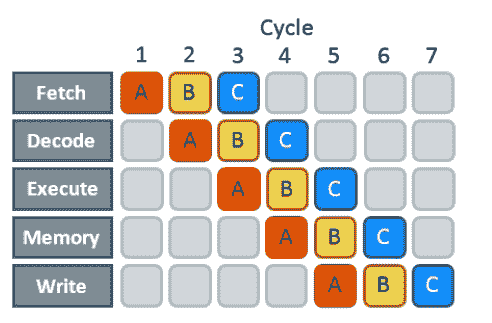

# 指令级并行性

> 原文：[`en.algorithmica.org/hpc/pipelining/`](https://en.algorithmica.org/hpc/pipelining/)

当程序员听到*并行性*这个词时，他们主要想到的是*多核并行性*，这是一种将计算显式地分割成半独立的*线程*，这些线程共同工作来解决共同问题的实践。

这种类型的并行性主要是为了减少*延迟*和实现*可扩展性*，而不是提高*效率*。你可以用并行算法解决十倍大的问题，但至少需要十倍的计算资源。尽管并行硬件变得越来越丰富且并行算法设计正变得越来越重要的领域，但到目前为止，我们将仅限于考虑单个 CPU 核心。

但还有其他类型的并行性，已经存在于 CPU 核心内部，你可以免费使用。

### 指令流水线

要执行*任何*指令，处理器首先需要做大量的准备工作，这包括：

+   **从内存中**获取一段机器代码，

+   **解码**它并将其拆分为指令，

+   **执行**这些指令，这可能涉及一些**内存**操作，以及

+   **将结果写回寄存器**。

整个操作序列非常长。即使是像将两个寄存器存储的值相加这样简单的操作，也需要 15-20 个 CPU 周期。为了隐藏这种延迟，现代 CPU 使用*流水线*：一旦一个指令通过了第一个阶段，它们就会立即开始处理下一个指令，而不必等待前一个指令完全完成。

流水线并不减少*实际*延迟，但功能上使其看起来就像它只由执行和内存阶段组成。你仍然需要支付这些 15-20 个周期，但一旦你找到了将要执行的指令序列，你只需要做一次。

考虑到这一点，硬件制造商更喜欢使用*每条指令周期数*（CPI）而不是像“平均指令延迟”这样的指标作为 CPU 设计的性能指标。如果我们只考虑*有用的*指令，它也是算法设计的一个相当好的指标。

完美流水线处理器的 CPI 应该接近于 1，但如果我们通过复制每个流水线阶段使其“更宽”，那么一次可以处理多个指令，这样实际上 CPI 甚至可以更低。由于缓存和大多数 ALU 可以共享，这最终比添加一个完全独立的内核更便宜。这种每周期可以执行多个指令的架构被称为*超标量*，而大多数现代 CPU 都是这样的。

只有当指令流包含逻辑上独立的操作组，这些操作可以单独处理时，你才能利用超标量处理。指令不一定总是以最方便的顺序到达，因此，当可能时，现代 CPU 可以以乱序执行它们，以提高整体利用率和最小化流水线停顿。这种魔法是如何工作的，是一个更高级讨论的话题，但到目前为止，你可以假设 CPU 维护一个未来某个距离的待处理指令缓冲区，一旦其操作数的值被计算出来并且有可用的执行单元，就立即执行这些指令。

### 教育类比

考虑一下我们的教育系统是如何运作的：

1.  课程内容是以小组形式教授给学生，而不是个人，因为一次性向所有人广播相同的内容更有效率。

1.  学生入学后被分成由不同教师领导的小组；作业和其他课程材料在小组之间共享。

1.  每年都会对新一届学生教授相同的课程，这样教师就能保持忙碌。

这些创新大大提高了整个系统的*吞吐量*，尽管*延迟*（特定学生的毕业时间）保持不变（并且可能略有增加，因为个性化辅导更有效）。

你可以在现代 CPU 中找到许多类比：

1.  CPU 使用单指令多数据（SIMD）并行性在数据块的不同数据点上执行相同的操作（由 16、32 或 64 字节组成）。

1.  有多个执行单元可以同时处理这些指令，同时共享其他 CPU 资源（通常为 2-4 个执行单元）。

1.  指令以流水线方式处理（节省的周期数大致等于从幼儿园到博士之间的年数）。

此外，还有其他几个方面也相匹配：

+   随着时间的推移，执行路径变得更加分歧，需要不同的执行单元。

+   一些指令可能由于各种原因而停滞。

+   一些指令甚至被预测（提前执行），但随后被丢弃。

+   一些指令可能被分成几个不同的微操作，这些微操作可以独立进行。

编程流水线和超标量处理器有其自身的挑战，我们将在本章中解决这些问题。

[← 机器代码布局](https://en.algorithmica.org/hpc/architecture/layout/)

[← ../计算机架构](https://en.algorithmica.org/hpc/architecture/)[流水线冒险 →](https://en.algorithmica.org/hpc/pipelining/hazards/)

[../编译 →](https://en.algorithmica.org/hpc/compilation/)
