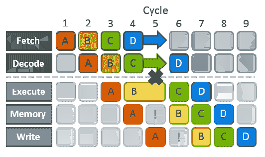

# 管道风险

> [`en.algorithmica.org/hpc/pipelining/hazards/`](https://en.algorithmica.org/hpc/pipelining/hazards/)

管道化让你可以通过并行运行指令来隐藏指令的延迟，但同时也创造了它自己的潜在障碍——通常称为*管道风险*，即下一个指令不能在下一个时钟周期上执行的情况。

这可能以多种方式发生：

+   当两个或更多指令需要 CPU 的同一部分（例如，一个执行单元）时，会发生*结构风险*。

+   当你必须等待一个操作数从之前的步骤计算出来时，会发生*数据风险*。

+   当 CPU 无法确定它需要执行下一个指令时，会发生*控制风险*。

解决风险的唯一方法是有一个*管道停顿*：停止所有之前步骤的进展，直到拥堵的原因消失。这会在管道中产生*气泡*——类似于流体管道中的气泡——一个执行单元空闲且没有进行有用工作的传播条件。

执行阶段的管道停顿

不同的风险有不同的惩罚：

+   在结构风险中，你必须等待（通常多一个周期）直到执行单元准备好。它们是性能的基本瓶颈，无法避免——你必须围绕它们进行设计。

+   在数据风险中，你必须等待所需的数据被计算出来（*关键路径*的延迟）。数据风险通过重新结构化计算来解决，使关键路径变短。

+   在控制风险中，你通常必须清空整个管道并重新开始，浪费了整整 15-20 个周期。它们通过完全移除分支或使它们可预测来解决，这样 CPU 就可以有效地*推测*下一个要执行的操作。

由于它们对性能的影响非常不同，我们将按照相反的顺序进行，从更严重的问题开始。

[← ../指令级并行](https://en.algorithmica.org/hpc/pipelining/)[分支的成本 →](https://en.algorithmica.org/hpc/pipelining/branching/)
