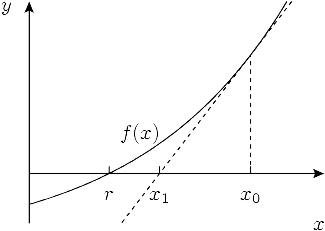

# 牛顿法

> [`en.algorithmica.org/hpc/arithmetic/newton/`](https://en.algorithmica.org/hpc/arithmetic/newton/)

对于实际算法来说，很少需要达到最大可能的精度。在现实世界的数据中，建模和测量误差通常比来自舍入浮点数等的误差大几个数量级，我们通常对选择一个以速度换取精度的近似方法感到非常满意。

在本节中，我们介绍这类近似数值算法中最重要构建块之一：*牛顿法*。

## [#](https://en.algorithmica.org/hpc/arithmetic/newton/#newtons-method) 牛顿法

牛顿法是一种简单但非常强大的算法，用于寻找实值函数的近似根，即以下通用方程的解：

$$ f(x) = 0 $$

关于函数 $f$ 的唯一假设是至少存在一个根，并且 $f(x)$ 在搜索区间上是连续且可微的。还有一些[无聊的边界情况](https://en.wikipedia.org/wiki/Newton%27s_method#Failure_analysis)，但在实际中它们几乎从未发生，所以我们只是非正式地说函数是“好的”。

算法的主要思想是从某个初始近似 $x_0$ 开始，然后通过在 $x = x_i$ 处绘制函数的切线并设置下一个近似 $x_{i+1}$ 等于其与 $x$ 轴的交点的 $x$ 坐标来迭代地改进它。直观上，如果函数 $f$ 是“[好的](https://en.wikipedia.org/wiki/Smoothness)”并且 $x_i$ 已经足够接近根，那么 $x_{i+1}$ 将会更接近。



要获得 $x_n$ 的交点，我们需要将其切线函数设为零：

$$ 0 = f(x_i) + (x_{i+1} - x_i) f'(x_i) $$ 从中我们推导出 $$ x_{i+1} = x_i - \frac{f(x_i)}{f'(x_i)} $$

牛顿法非常重要：它是科学和工程中广泛使用的优化求解器的基础。

### [#](https://en.algorithmica.org/hpc/arithmetic/newton/#square-root) 平方根

作为简单的例子，让我们推导出求解平方根问题的算法：

$$ x = \sqrt n \iff x² = n \iff f(x) = x² - n = 0 $$ 如果我们将 $f(x) = x² - n$ 代入上述通用公式，我们可以得到以下更新规则：$$ x_{i+1} = x_i - \frac{x_i² - n}{2 x_i} = \frac{x_i + n / x_i}{2} $$

在实践中，我们也希望一旦它足够接近正确答案就停止它，这我们可以在每次迭代后简单地检查：

```cpp
const double EPS = 1e-9;   double sqrt(double n) {  double x = 1; while (abs(x * x - n) > eps) x = (x + n / x) / 2; return x; } 
```

该算法对许多函数都收敛，尽管它只对它们的一定子集（例如凸函数）可靠且可证明地收敛。另一个问题是如果发生收敛，收敛速度有多快。

### [#](https://en.algorithmica.org/hpc/arithmetic/newton/#rate-of-convergence) 收敛速度

让我们运行几次牛顿法来找到 $2$ 的平方根，起始值为 $x_0 = 1$，并检查每次迭代后有多少位是正确的：

```cpp
1.0000000000000000000000000000000000000000000000000000000000000
1.5000000000000000000000000000000000000000000000000000000000000
1.4166666666666666666666666666666666666666666666666666666666675
1.4142156862745098039215686274509803921568627450980392156862745
1.4142135623746899106262955788901349101165596221157440445849057
1.4142135623730950488016896235025302436149819257761974284982890
1.4142135623730950488016887242096980785696718753772340015610125
1.4142135623730950488016887242096980785696718753769480731766796

```

仔细观察，我们可以看到每次迭代的准确数字数量大约翻倍。这种惊人的收敛速度并非巧合。

为了定量分析收敛速度，我们需要考虑第 $i$ 次迭代的微小相对误差 $\delta_i$，并确定下一次迭代的误差 $\delta_{i+1}$ 有多小：

$$ |\delta_i| = \frac{|x_n - x|}{x} $$ 我们可以将 $x_i$ 表示为 $x \cdot (1 + \delta_i)$。将其代入牛顿迭代公式，并将两边除以 $x$，我们得到 $$ 1 + \delta_{i+1} = \frac{1}{2} (1 + \delta_i + \frac{1}{1 + \delta_i}) = \frac{1}{2} (1 + \delta_i + 1 - \delta_i + \delta_i² + o(\delta_i²)) = 1 + \frac{\delta_i²}{2} + o(\delta_i²) $$

在这里，我们使用误差 $d_i$ 很小的假设（由于序列收敛，对于足够大的 $n$，$d_i \ll 1$）在 $0$ 处对 $(1 + \delta_i)^{-1}$ 进行泰勒展开。

对 $\delta_{i+1}$ 进行重新排列，我们得到

$$ \delta_{i+1} = \frac{\delta_i²}{2} + o(\delta_i²) $$

这意味着一旦我们接近解，误差大致平方（并减半）。由于对数 $(- \log_{10} \delta_i)$ 大约是答案 $x_i$ 中的有效数字的数量，平方相对误差正好对应于我们观察到的有效数字数量的加倍。

这被称为**二次收敛**，实际上，这不仅仅限于求平方根。详细的证明留给读者作为练习，可以证明，在一般情况下

$$ |\delta_{i+1}| = \frac{|f''(x_i)|}{2 \cdot |f'(x_n)|} \cdot \delta_i² $$

这在几个额外的假设下至少导致二次收敛，即 $f’(x)$ 不等于 $0$，且 $f’’(x)$ 是连续的。

## [#](https://en.algorithmica.org/hpc/arithmetic/newton/#further-reading)进一步阅读

[MIT 的数值方法介绍](https://ocw.mit.edu/courses/mathematics/18-330-introduction-to-numerical-analysis-spring-2012/lecture-notes/MIT18_330S12_Chapter4.pdf). [←舍入误差](https://en.algorithmica.org/hpc/arithmetic/errors/)[快速逆平方根→](https://en.algorithmica.org/hpc/arithmetic/rsqrt/)
