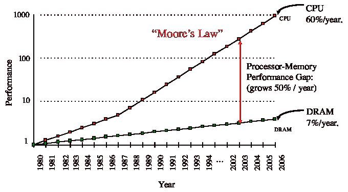

# 外部内存

> 原文：[`en.algorithmica.org/hpc/external-memory/`](https://en.algorithmica.org/hpc/external-memory/)

添加两个数字需要多长时间？作为最常用的指令之一，`add`本身只需要一个周期来执行。所以，如果数据已经加载到寄存器中，它只需要一个周期。

但在一般情况（`*c = *a + *b`）下，我们首先需要从内存中检索其操作数：

```cpp
mov eax, DWORD PTR [rsi] add eax, DWORD PTR [rdi] mov DWORD PTR [rdx], eax 
```

当你从内存中检索任何内容时，数据到达之前总会有一些延迟。此外，请求不会直接发送到其最终存储位置，而是首先通过一个复杂的地址转换单元和缓存层系统，这个系统旨在帮助内存管理并减少延迟。

因此，对这个问题的唯一正确答案是“这取决于”——主要取决于操作数存储的位置：

+   如果数据存储在主内存（RAM）中，检索它将需要大约~100ns，或者大约 200 个周期，然后还需要 200 个周期来将其写回。

+   如果它最近被访问过，它可能已经被*缓存*，并且检索它所需的时间将少于那个时间，这取决于它最后一次被访问的时间——对于最慢的缓存层可能是大约 50 个周期，对于最快的缓存层可能是大约 4-5 个周期。

+   但它也可能存储在某种类型的*外部内存*上，例如硬盘，在这种情况下，访问它将需要大约 5 毫秒，或者大约$10⁷$个周期（！）。

这种内存性能的高变异性是由内存硬件不遵循与 CPU 芯片相同的硅缩放定律这一事实造成的。内存仍在通过其他方式不断改进，但如果 50 年前内存的定时与指令延迟大致在同一规模，那么现在它们落后得远。



为了减少限制因素，现代内存系统正变得越来越分层，其中较高层通过减少一些容量来降低延迟。由于这些特性可能在层之间以数量级的方式变化——特别是在外部内存类型的情况下——对于许多内存密集型算法来说，在所有其他操作之前优化它们的 I/O 操作变得至关重要。

这促使创建了一个新的成本模型，称为*外部内存模型*，其唯一的原始操作是块读取和写入，只要它只涉及存储在有限大小的本地内存中的数据，其他所有操作的成本都是零。它催生了一个令人兴奋的新领域，即*外部内存算法*，我们将在本章中研究。

[← Montgomery Multiplication](https://en.algorithmica.org/hpc/number-theory/montgomery/)

[← ../Number Theory](https://en.algorithmica.org/hpc/number-theory/)[Memory Hierarchy →](https://en.algorithmica.org/hpc/external-memory/hierarchy/)

[../RAM & CPU Caches →](https://en.algorithmica.org/hpc/cpu-cache/)
