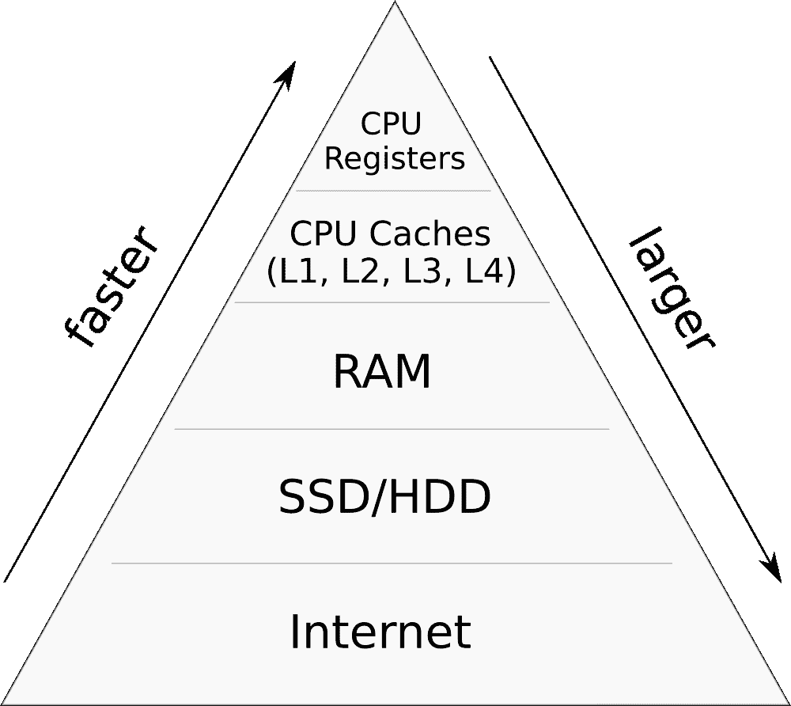

# 存储层次结构

> 原文：[`en.algorithmica.org/hpc/external-memory/hierarchy/`](https://en.algorithmica.org/hpc/external-memory/hierarchy/)

现代计算机内存高度分层。它由多个速度和大小不同的缓存层组成，其中*较高*的层次通常存储从*较低*层次频繁访问的数据以减少延迟：每个下一级通常快一个数量级，但也更小和/或更贵。

抽象地说，各种内存设备可以被描述为具有一定存储容量 $M$ 的模块，可以以块 $B$（而不是单个字节！）的形式读取或写入数据，并花费固定的时间完成。

从这个角度来看，每种类型的内存都有几个重要的特性：

+   *总大小* $M$；

+   *块大小* $B$；

+   *延迟*，即获取一个字节所需的时间；

+   *带宽*，可能高于仅仅是块大小乘以延迟，这意味着 I/O 操作可以“重叠”；

+   *成本*在摊销意义上的，包括芯片价格、能源需求、维护等。

下面是 2021 年商品硬件的大致比较表：

| 类型 | $M$ | $B$ | 延迟 | 带宽 | $/GB/mo^(1)$ |
| --- | --- | --- | --- | --- | --- |
| L1 | 10K | 64B | 2ns | 80G/s | - |
| L2 | 100K | 64B | 5ns | 40G/s | - |
| L3 | 1M/core | 64B | 20ns | 20G/s | - |
| RAM | GBs | 64B | 100ns | 10G/s | 1.5 |
| SSD | TBs | 4K | 0.1ms | 5G/s | 0.17 |
| HDD | TBs | - | 10ms | 1G/s | 0.04 |
| S3 | $\infty$ | - | 150ms | $\infty$ | 0.02^(2)$ |

在现实中，每种类型的存储器都有许多具体细节，我们现在将逐一介绍。

### [#](https://en.algorithmica.org/hpc/external-memory/hierarchy/#volatile-memory)易失性存储器

到 RAM 级别的一切都称为*易失性存储器*，因为它在电源短缺和其他灾难情况下不会持久化数据。它速度快，这就是为什么它在计算机供电时用于存储临时数据。

从快到慢：

+   **CPU 寄存器**，CPU 使用这些零时间访问的数据单元来存储所有中间值，也可以被视为一种内存类型。它们的数量有限（例如，只有 16 个“通用”寄存器），在某些情况下，你可能出于性能原因想要使用它们全部。

+   **CPU 缓存**。现代 CPU 有多个缓存层（L1、L2，通常是 L3，很少是 L4）。最底层是核心间共享的，通常与核心数量成比例（例如，一个 10 核心的 CPU 应该有大约 10M 的 L3 缓存）。

+   **随机存取存储器**，这是第一种可扩展的存储类型：如今你可以在公共云上租用拥有半太字节 RAM 的机器。这是你大部分工作数据应该存储的地方。

CPU 缓存系统有一个重要的概念，即 *缓存行*，它是 CPU 和 RAM 之间数据传输的基本单位。在大多数架构中，缓存行的大小为 64 字节，这意味着所有主内存都被划分为 64 字节的块，无论你是否需要，每次请求（读取或写入）单个字节时，你都会获取其所有 63 个缓存行邻居。

CPU 级别的缓存是基于缓存行的最后访问时间自动发生的。当访问时，缓存行的内容会被放置到最低的缓存层，然后逐渐被移除到更高层，除非在规定时间内再次访问。程序员无法显式控制这个过程，但研究其工作原理是值得的，我们将在下一章中介绍 CPU 缓存。

### [非易失性存储器](https://en.algorithmica.org/hpc/external-memory/hierarchy/#non-volatile-memory)

虽然 CPU 缓存和 RAM 中的数据单元只存储少量电子（这些电子会周期性地泄漏并需要定期刷新），但 *非易失性存储器* 类型的数据单元存储了数百个电子。这使得数据在没有电源的情况下可以持续较长时间，但这也带来了性能和耐用性的代价——因为电子越多，它们与硅原子碰撞的机会也越多。

存储数据的方式有很多种，但从程序员的角度来看，这些是主要的几种：

+   **固态硬盘**。这些硬盘的延迟相对较低，大约为 0.1ms（$10⁵$ ns），但它们的价格也相对较高，因为每个单元只能写入有限次数，这限制了它们的寿命。这就是为什么移动设备和大多数笔记本电脑使用它们的原因，因为它们体积小，没有移动部件。

+   **硬盘驱动器**是非同寻常的，因为它们实际上是带有读写头的旋转物理磁盘[旋转物理磁盘](https://www.youtube.com/watch?v=3owqvmMf6No&feature=emb_title)。要读取内存位置，你需要等待磁盘旋转到正确的位置，然后非常精确地将头移动到那里。这导致了一些非常奇怪的访问模式，随机读取一个字节可能需要的时间与读取下一个 1MB 的数据所需的时间相同——这通常在毫秒级别。由于这是计算机中唯一具有机械移动部件的部分（除了冷却系统），硬盘经常损坏（数据中心 HDD 的平均寿命约为 3 年）。

+   **网络附加存储**，即使用其他网络设备来存储数据的做法。它有两种独特的类型。第一种是网络文件系统（NFS），它是一种通过网络挂载另一台计算机文件系统的协议。另一种是基于 API 的分布式存储系统，最著名的是[Amazon S3](https://aws.amazon.com/s3/)，它由公共云中一队经过优化的存储机器支持，通常使用廉价的 HDD 或一些[更复杂的](https://aws.amazon.com/storagegateway/vtl/)存储类型。虽然如果 NFS 位于同一数据中心，它有时甚至可以比 HDD 运行得更快，但公共云中的对象存储通常有 50-100 毫秒的延迟。它们通常是高度分布和复制的，以提高可用性。

由于 SDD/HDD 的读写速度明显慢于 RAM，因此在这个级别或以下的所有内容通常被称为*外部存储*。

与 CPU 缓存不同，外部存储可以明确控制。这在许多情况下很有用，但大多数程序员只想将其抽象化，并将其用作主内存的扩展，操作系统通过虚拟内存的方式具有这样做的能力。

* * *

1.  定价信息来自[Google Cloud Platform](https://cloud.google.com/products/calculator?skip_cache=true)。↩︎

1.  云存储通常有[多个层级](https://aws.amazon.com/s3/storage-classes/)，如果你访问数据的频率较低，成本会逐渐降低。↩︎ [← ../外部存储](https://en.algorithmica.org/hpc/external-memory/)[虚拟内存 →](https://en.algorithmica.org/hpc/external-memory/virtual/)
