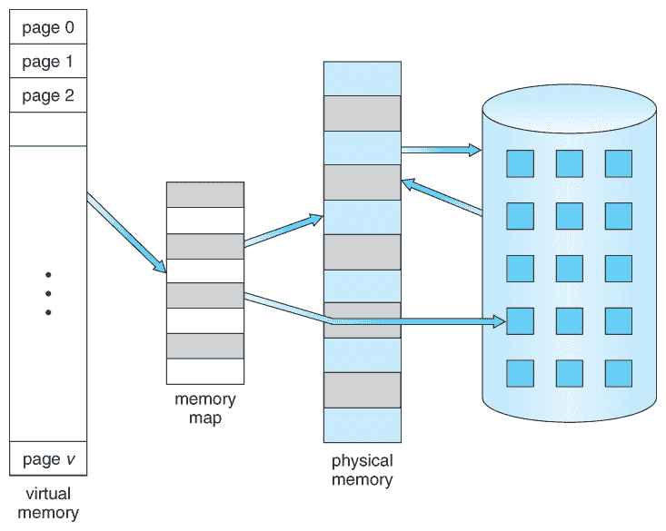

# 虚拟内存

> 原文：[`en.algorithmica.org/hpc/external-memory/virtual/`](https://en.algorithmica.org/hpc/external-memory/virtual/)

早期的操作系统赋予每个进程读取和修改任何所需内存区域的自由，包括为其他进程分配的内存区域。虽然这样做使事情变得简单，但也带来了一些问题：

+   如果其中一个进程有 bug 或恶意行为怎么办？我们如何防止它修改为其他进程分配的内存，同时仍然通过内存保持进程间通信？

+   我们如何处理内存碎片化？比如说，我们有 4MB 的内存，进程 A 为自己分配了前 1MB，然后进程 B 声称下 2MB，接着 A 终止并释放了其内存，然后进程 C 来请求一个连续的 2MB 区域——但它无法得到，因为我们只有两个独立的 1MB 片段。重启进程 B 或以某种方式停止它，并将所有数据和指针移动一个兆字节，似乎不是一个好办法。

+   我们如何访问非 RAM 内存类型？我们如何连接一个闪存驱动器并从中读取特定文件？

对于一些专门的计算机系统，如 GPU，这些问题并不那么关键，因为通常一次只解决一个任务，并且对计算有完全的控制权，但对于现代多任务操作系统来说，这些问题绝对是必不可少的——它们通过一种称为*虚拟内存*的技术解决了所有这些问题。

### [#](https://en.algorithmica.org/hpc/external-memory/virtual/#memory-paging)内存分页

虚拟内存给每个进程一种完全控制连续内存区域的印象，而实际上这些区域可能映射到物理内存的多个较小的块——这包括主内存（RAM）和外存（HDD，SSD）。



为了实现这一点，内存地址空间被划分为*页面*（通常大小为 4KB），这是程序可以从操作系统请求的内存的基本单位。内存系统维护一个特殊硬件数据结构，称为*页面表*，它包含虚拟页面地址到物理地址的映射。当进程使用其虚拟内存地址访问数据时，内存系统计算其页面号（如果页面大小为 4096=2¹²，则通过右移 12 位），在页面表中查找其物理地址，并将读或写请求转发到实际存储数据的位置。

由于每个内存请求都需要进行地址转换，并且内存页的数量本身可能很大（例如，16G RAM / 4K 页面大小 = 4M 页面），地址转换本身就是一个难题。加快其速度的一种方法是为页面表本身使用一个特殊的缓存，称为*转换后备缓冲区*（TLB），另一种方法是增加页面大小，以减少内存页的总数，代价是降低了粒度。

### [#](https://en.algorithmica.org/hpc/external-memory/virtual/#mapping-external-memory)映射外部内存

虚拟内存的机制还允许透明地使用外部内存类型。现代操作系统支持[内存映射](https://en.wikipedia.org/wiki/Mmap)，这允许你打开一个文件，并像它们在主内存中一样使用其内容：

```cpp
// open a file containing 1024 random integers for reading and writing
int fd = open("input.bin", O_RDWR);
// map it into memory      size  allow reads and writes  write changes back to the file
int* data = (int*) mmap(0, 4096, PROT_READ | PROT_WRITE, MAP_SHARED, fd, 0);
// sort it like if it was a normal integer array
std::sort(data, data + 1024);
// changes are eventually propagated to the file 
```

在这里，我们映射一个 4K 文件，它可以完全适应单个内存页面，但是当我们请求某个页面时，其读取将延迟执行，而其写入将被缓冲，并在操作系统决定时提交到文件系统（通常在程序终止或系统内存不足时）。

具有相同操作原理但相反意图的技术是*交换文件*，它允许操作系统在真实 RAM 不足时自动将 SSD 或 HDD 的部分空间作为主内存的扩展。这使得内存不足的系统只是经历严重的速度下降，而不是崩溃。

主内存和外部内存的无缝集成本质上将 RAM 变成了外部内存的“L4 缓存”，从算法设计角度来看，这是一种方便的思考方式。[← 存储层次](https://en.algorithmica.org/hpc/external-memory/hierarchy/)[外部内存模型 →](https://en.algorithmica.org/hpc/external-memory/model/)
