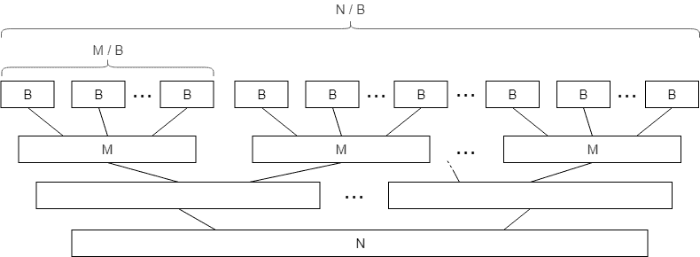

# 外部排序

> 原文：[`en.algorithmica.org/hpc/external-memory/sorting/`](https://en.algorithmica.org/hpc/external-memory/sorting/)

现在，让我们尝试为新的 外部存储模型 设计一些真正有用的算法。本节的目标是逐步构建更复杂的东西，并最终达到 *外部排序* 及其有趣的应用。

该算法将基于标准的归并排序算法，因此我们首先需要推导出其主要原语。

### [#](https://en.algorithmica.org/hpc/external-memory/sorting/#merge)归并

**问题。** 给定两个长度为 $N$ 和 $M$ 的已排序数组 $a$ 和 $b$，生成一个包含所有元素的长度为 $N + M$ 的单个已排序数组 $c$。

合并排序数组的标准双指针技术看起来是这样的：

```cpp
void merge(int *a, int *b, int *c, int n, int m) {
    int i = 0, j = 0;
    for (int k = 0; k < n + m; k++) {
        if (i < n && (j == m || a[i] < b[j]))
            c[k] = a[i++];
        else
            c[k] = b[j++];
    }
} 
```

在内存操作方面，我们只是线性地读取 $a$ 和 $b$ 的所有元素，并线性地写入 $c$ 的所有元素。由于这些读取和写入可以缓冲，它可以在 $SCAN(N+M)$ I/O 操作中工作。

到目前为止的例子都很简单，它们的分析并没有太多区别于 RAM 模型，除了我们需要将最终答案除以块大小 $B$。但这里有一个情况，这并不如此。

**$k$-路归并。** 考虑这种算法的修改，我们需要合并的不仅仅是两个数组，而是总大小为 $N$ 的 $k$ 个数组——通过类似地查看 $k$ 个值，选择它们之间的最小值，将其写入 $c$，并递增一个迭代器。

在标准的 RAM 模型中，渐近复杂度会乘以 $k$，因为我们需要执行 $O(k)$ 次比较来填充每个下一个元素。但在外部存储模型中，由于我们在内存中做的所有事情都不需要我们付出任何代价，只要我们可以在内存中容纳 $(k+1)$ 个完整的块，即如果 $k = O(\frac{M}{B})$，其渐近复杂度就不会改变。

记得我们介绍计算模型时提到的 $$M \gg B$$ 假设 吗？如果我们有 $M \geq B^{1+ε}$ 对于 $\epsilon > 0$，那么我们可以将任何次多项式数量的块放入内存中，当然包括 $O(\frac{M}{B})$。这个条件被称为 *高缓存假设*，它在许多其他外部存储算法中通常都是必需的。

### [#](https://en.algorithmica.org/hpc/external-memory/sorting/#merge-sorting)归并排序

标准归并排序算法的正常复杂度是 $O(N \log_2 N)$：在其 $O(\log_2 N)$ 的“层”中，算法需要遍历总共 $N$ 个元素并将它们合并成线性时间。

在外部存储模型中，当我们读取一个大小为 $M$ 的块时，我们可以“免费”地对它的元素进行排序，因为它们已经在内存中了。这样我们可以将数组分成 $O(\frac{N}{M})$ 个连续元素的块，并分别对它们进行排序作为基本步骤，然后才合并它们。



这实际上意味着，在 I/O 操作方面，归并排序的前$O(\log M)$层是免费的，并且只有$O(\log_2 \frac{N}{M})$非零成本的层，每层可以在$O(\frac{N}{B})$ IOPS 下合并。这使总的 I/O 复杂度达到

$$ O\left(\frac{N}{B} \log_2 \frac{N}{M}\right) $$

这相当快。如果我们有 1GB 的内存和 10GB 的数据，这实际上意味着我们只需要比读取数据排序多出一点点的努力。有趣的是，我们可以做得更好。

### [#](https://en.algorithmica.org/hpc/external-memory/sorting/#k-way-mergesort)$k$-路归并排序

在前一页的一半，我们了解到在外部内存模型中，我们可以像合并两个数组一样轻松地合并$k$个数组——代价是读取它们。为什么我们在这里不应用这个事实呢？

让我们像之前一样，在内存中对大小为$M$的每个块进行排序，但在每个合并阶段，我们将排序好的块分成要合并的成对块，同时在一个$k$路合并过程中，尽可能多地取我们内存中能容纳的块。这样，合并树的高度将大大降低，而每一层仍然会在$O(\frac{N}{B})$ IOPS 下完成。

我们可以一次性合并多少个排序数组？正好是$k = \frac{M}{B}$，因为我们需要为每个数组保留一个块的内存。由于总的层数将减少到$\log_{\frac{M}{B}} \frac{N}{M}$，总的复杂度将减少到

$$ SORT(N) \stackrel{\text{def}}{=} O\left(\frac{N}{B} \log_{\frac{M}{B}} \frac{N}{M} \right) $$

注意，在我们的例子中，我们有 10GB 的数据，1GB 的内存，对于硬盘来说，块大小大约是 1MB。这使得$\frac{M}{B} = 1000$和$\frac{N}{M} = 10$，因此对数小于 1（即，$\log_{1000} 10 = \frac{1}{3}$）。当然，我们无法比读取数据更快地排序数组，因此这种分析适用于我们拥有非常大的数据集、较小的内存和/或较大的块大小的情况，这在当今现实生活中很少发生。

### [#](https://en.algorithmica.org/hpc/external-memory/sorting/#practical-implementation)实际实现

在更现实的约束条件下，我们不需要使用$\log_{\frac{M}{B}} \frac{N}{M}$层，而只需要两层：一层用于对$M$个元素的块进行排序，另一层用于一次性合并所有这些块。这样，从 I/O 操作的角度来看，我们只需对数据集进行两次循环。如果拥有 1GB 的 RAM 和 1MB 的块大小，这种方法可以排序高达 1TB 大小的数组。

下面是第一阶段在 C++中的样子。这个程序打开一个包含未排序整数的多吉字节二进制文件，以 256MB 的块读取它，在内存中对它们进行排序，然后以`part-000.bin`、`part-001.bin`、`part-002.bin`等命名的文件将它们写回：

```cpp
const int B = (1<<20) / 4; // 1 MB blocks of integers
const int M = (1<<28) / 4; // available memory

FILE *input = fopen("input.bin", "rb");
std::vector<FILE*> parts;

while (true) {
    static int part[M]; // better delete it right after
    int n = fread(part, 4, M, input);

    if (n == 0)
        break;

    // sort a block in-memory
    std::sort(part, part + n);

    char fpart[sizeof "part-999.bin"];
    sprintf(fpart, "part-%03d.bin", parts.size());

    printf("Writing %d elements into %s...\n", n, fpart);

    FILE *file = fopen(fpart, "wb");
    fwrite(part, 4, n, file);
    fclose(file);

    file = fopen(fpart, "rb");
    parts.push_back(file);
}

fclose(input); 
```

现在剩下的是将它们合并在一起。现代硬盘的带宽可以相当高，可能有很多部分需要合并，因此这一阶段的 I/O 效率并不是我们唯一关心的问题：我们还需要一种比通过 $O(k)$ 次比较找到最小值更快的方式来合并 $k$ 个数组。如果我们为这些 $k$ 个元素维护一个最小堆，就可以在几乎与堆排序相同的方式中以 $O(\log k)$ 每个元素的时间复杂度完成。

下面是如何实现它的方法。首先，我们需要一个堆（C++中的 `priority_queue`）：

```cpp
struct Pointer {
    int key, part; // the element itself and the number of its part

    bool operator<(const Pointer& other) const {
        return key > other.key; // std::priority_queue is a max-heap by default
    }
};

std::priority_queue<Pointer> q; 
```

然后，我们需要分配和填充缓冲区：

```cpp
const int nparts = parts.size();

auto buffers = new int[nparts][B]; // buffers for each part
int *l = new int[nparts],          // # of already processed buffer elements
    *r = new int[nparts];          // buffer size (in case it isn't full)

// now we add fill the buffer for each part and add their elements to the heap
for (int part = 0; part < nparts; part++) {
    l[part] = 1; // if the element is in the heap, we also consider it "processed"
    r[part] = fread(buffers[part], 4, B, parts[part]);
    q.push({buffers[part][0], part});
} 
```

现在，我们只需要从堆中弹出元素到结果文件，直到它为空，小心地在批量中写入和读取元素：

```cpp
FILE *output = fopen("output.bin", "w");

int outbuffer[B]; // the output buffer
int buffered = 0; // number of elements in it

while (!q.empty()) {
    auto [key, part] = q.top();
    q.pop();

    // write the minimum to the output buffer
    outbuffer[buffered++] = key;
    // check if it needs to be committed to the file
    if (buffered == B) {
        fwrite(outbuffer, 4, B, output);
        buffered = 0;
    }

    // fetch a new block of that part if needed
    if (l[part] == r[part]) {
        r[part] = fread(buffers[part], 4, B, parts[part]);
        l[part] = 0;
    }

    // read a new element from that part unless we've already processed all of it
    if (l[part] < r[part]) {
        q.push({buffers[part][l[part]], part});
        l[part]++;
    }
}

// write what's left of the output buffer
fwrite(outbuffer, 4, buffered, output);

//clean up
delete[] buffers;
for (FILE *file : parts)
    fclose(file);
fclose(output); 
```

这个实现并不特别有效或看起来安全（好吧，这基本上是纯 C），但它是一个很好的教育示例，说明了如何与低级内存 API 一起工作。

### [#](https://en.algorithmica.org/hpc/external-memory/sorting/#joining) 合并

排序主要用于不是本身，而是作为其他操作的中间步骤。外部排序的一个重要实际用例是合并（如在“SQL join”中），用于数据库和其他数据处理应用程序。

**问题。**给定两个元组列表 $(x_i, a_{x_i})$ 和 $(y_i, b_{y_i})$，输出一个列表 $(k, a_{x_k}, b_{y_k})$ 使得 $x_k = y_k$

最佳解决方案是对两个列表进行排序，然后使用标准的双指针技术合并它们。这里的 I/O 复杂度将与排序相同，如果数组已经排序，则为 $O(\frac{N}{B})$。这就是为什么大多数数据处理应用程序（数据库、MapReduce 系统）喜欢至少部分保持它们的表排序。

**其他方法。**请注意，此分析仅适用于外部内存设置——也就是说，如果你没有足够的内存来读取整个数据集。在现实世界中，其他方法可能更快。

其中最简单的是可能是 *哈希连接*，其过程如下：

```cpp
def join(a, b):
    d = dict(a)
    for x, y in b:
        if x in d:
            yield d[x] 
```

在外部内存中，使用哈希表合并两个列表是不切实际的，因为它将涉及进行 $O(M)$ 块读取，尽管每个列表中只使用了一个元素。

另一种方法是使用替代的排序算法，例如基数排序。特别是，如果足够内存来维护所有可能的键的缓冲区，基数排序在 $O(\frac{N}{B} \cdot w)$ 块读取中工作，并且在键较小且数据集较大的情况下可能会更快。[← 外部内存模型](https://en.algorithmica.org/hpc/external-memory/model/)[列表排序 →](https://en.algorithmica.org/hpc/external-memory/list-ranking/)
