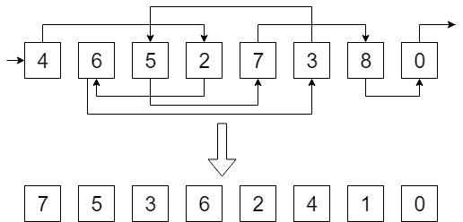

# 列表排名

> 原文：[`en.algorithmica.org/hpc/external-memory/list-ranking/`](https://en.algorithmica.org/hpc/external-memory/list-ranking/)

在本节中，我们将应用 外部排序 和 连接 来解决一个表面上看似无用的但实际是大量外部内存和并行算法中使用的关键原语的问题。

**问题**。给定一个单链表，计算每个元素的 *排名*，等于其从 *最后一个* 元素的距离。

列表排名问题的示例输入和输出

在 RAM 模型中，这个问题可以轻易解决：你只需遍历整个列表并使用计数器。但在外部内存设置中，这种方法不会很好工作，因为列表节点是任意存储的，在最坏的情况下，读取每个新节点可能需要读取一个新的块。

### [#](https://en.algorithmica.org/hpc/external-memory/list-ranking/#algorithm)算法

考虑这个问题的一个稍微更一般的形式。现在，每个元素都有一个 *权重* $w_i$，并且对于每个元素，我们需要计算其所有先前元素权重的总和，而不仅仅是它的排名。为了解决初始问题，我们可以将所有权重都设置为 1。

算法的核心思想是移除一些元素的一部分，递归地解决问题，然后使用这些权重-排名来重建初始问题的答案——这是难点所在。

考虑一些连续的三个元素 $x$，$y$ 和 $z$。假设我们删除了 $y$，并解决了剩余列表的问题，该列表包括 $x$ 和 $z$，现在我们需要恢复原始三元组的答案。$x$ 的权重是正确的，但我们需要计算 $y$ 的答案并调整 $z$，即：

+   $w_y’ = w_y + w_x$

+   $w_z’ = w_z + w_y + w_x$

现在，我们只需删除，比如说，第一个元素，递归地解决问题，然后重新计算原始数组的权重。但不幸的是，这将在二次时间内完成，因为为了进行更新，我们需要知道其邻居的位置，而且由于我们无法在内存中保留整个数组，我们每次都需要扫描它。

因此，在每一步，我们希望尽可能多地移除元素。但我们还有一个约束：我们不能移除两个连续的元素，因为那样合并结果就不会那么简单了。

理想情况下，我们希望将我们的列表分为偶数和奇数元素，但这样做并不比初始问题简单。一种解决方案是随机选择元素：为每个元素抛硬币，然后在出现“尾”之后移除所有“头”。这样就不会有两个连续的元素被选中，并且平均来说，我们可以去掉当前列表的四分之一。这个解决方案的算术复杂度仍然是线性的，因为

$$ T(N) = T\left(\frac{3}{4} N\right) = O(N) $$

这里唯一棘手的部分是如何在外部内存中实现合并步骤。为了有效地做到这一点，我们需要以以下形式维护我们的列表：

+   元组$(i, j)$的列表，表示元素$j$在元素$i$之后

+   元素$i$当前具有权重$w_i$的元组$(i, w_i)$的列表

+   被删除元素的列表

现在，为了在随机删除一些元素并递归解决更小的问题后恢复答案，我们需要使用三个指针遍历所有列表，寻找被删除的元素。对于每个这样的元素，我们将$(j, w_i)$写入一个单独的表，这表示在递归步骤之前我们需要将$w_i$加到$j$上。然后我们可以将这个新表与初始权重连接起来，将这些额外的权重加到它们上面。

在递归返回后，我们需要更新被删除元素的权重，我们可以使用相同的技术，通过迭代反向连接而不是直接连接来实现。

该算法的 I/O 复杂度将与连接相同，即$SORT(N) = O\left(\frac{N}{B} \log_{\frac{M}{B}} \frac{N}{M} \right)$。

### [#](https://en.algorithmica.org/hpc/external-memory/list-ranking/#applications) 应用

列表排序在图算法中特别有用。

例如，我们可以通过从对应于其欧拉遍历的树构造一个链表来在外部内存中获取树的欧拉遍历，然后应用列表排序算法——每个节点的排名将与它在欧拉遍历中的索引$tin_v$相同。为了构建这个列表，我们需要：

+   将每条无向边分成两条有向边；

+   对于每个向上边（因为列表节点只能有一个入边，但我们访问一些顶点多次）复制父节点；

+   将每个这样的节点路由到“下一个兄弟”，如果有的话，否则路由到其自己的父节点；

+   然后在根节点处最终断开形成的循环。

这种通用技术被称为*树收缩*，它是大量树算法的基础。

同样的方法可以应用于并行算法，我们将在第二部分更深入地探讨这一点。[← 外部排序](https://en.algorithmica.org/hpc/external-memory/sorting/)[驱逐策略 →](https://en.algorithmica.org/hpc/external-memory/policies/)
