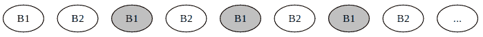

# 驱逐策略

> 原文：[`en.algorithmica.org/hpc/external-memory/policies/`](https://en.algorithmica.org/hpc/external-memory/policies/)

你可以手动控制程序的数据输入/输出操作，但大多数时候人们只是依赖于自动缓冲和缓存，要么是因为懒惰，要么是因为计算环境限制。

但自动缓存也带来了自己的挑战。当程序耗尽工作内存来存储其中间数据时，它需要移除一个块来为新块腾出空间。在冲突情况下决定保留缓存中哪些数据的具体规则称为*驱逐策略*。

这条规则可以是任意的，但有几个流行的选择：

+   先进先出（FIFO）：简单地移除最早添加的块，不考虑它之前被访问的频率（与 FIFO 队列相同的方式）。

+   最近最少使用（LRU）：移除最长时间未被访问的块。

+   后进先出（LIFO）和最近最少使用（MRU）：与前两种策略相反。删除最热块似乎是有害的，但在某些场景中，这些策略是最佳的，例如在循环中反复遍历文件。

+   最少使用（LFU）：统计每个块被请求的频率，并丢弃使用最少的块。一些变体还考虑了随时间变化的访问模式，例如使用时间窗口只考虑最近的$n$次访问或使用指数平均给最近访问更多的权重。

+   随机替换（RR）：随机丢弃一个块。其优点是不需要维护任何包含块信息的结构。

驱逐策略的准确性与其实现复杂性的额外开销之间存在自然权衡。对于 CPU 缓存，你需要一个简单到可以在硬件中轻松实现且延迟接近零的策略，而在更慢速和可计划的设置中，例如 Netflix 决定在哪些数据中心存储他们的电影或 Google Drive 优化用户数据存储的位置，使用更复杂的策略是有意义的，可能涉及一些机器学习来预测数据何时将被下一次访问。

### [#](https://en.algorithmica.org/hpc/external-memory/policies/#optimal-caching)最优缓存

除了上述策略之外，还存在一个理论上的*最优策略*，表示为$OPT$或$MIN$，它确定对于给定的查询序列，应该保留哪些块以最小化总的缓存未命中数。

这些决策可以通过一种简单的贪婪方法，称为*Bélády 算法*来做出：我们只需保留*最近使用过的*块，并且可以通过反证法证明这样做总是最优解之一。这种方法的不利之处在于，你可能需要提前有这些查询，或者以某种方式预测未来。

好事是，从渐近复杂性的角度来看，实际上并不重要使用哪种特定的方法。[Sleator & Tarjan 证明了](https://www.cs.cmu.edu/~sleator/papers/amortized-efficiency.pdf)，在大多数情况下，流行的策略如 LRU 的性能与 OPT 只相差一个常数因子。

**定理。**设$LRU_M$和$OPT_M$分别表示具有$M$内部内存的计算机在执行相同算法时，遵循最少最近使用缓存替换策略和理论最小值所需的块数。那么：

$$ LRU_M \leq 2 \cdot OPT_{M/2} $$

证明的主要思想是考虑最坏的情况。对于 LRU 来说，将是重复的$\frac{M}{B}$个不同块的序列：每个块都是新的，因此 LRU 有 100%的缓存未命中。同时，$OPT_{M/2}$能够缓存其中的一半（但不能更多，因为它只有一半的内存）。因此，$LRU_M$需要获取的块数是$OPT_{M/2}$的两倍，这正是不等式所表达的内容，对于 LRU 来说，任何更好的方法只会削弱它。

被 OPT（但不是 LRU）缓存的块被暗淡显示

这是一个非常令人欣慰的结果。这意味着，至少在渐近 I/O 复杂性的意义上，你只需假设驱逐策略是 LRU 或 OPT——哪个对你来说更容易——用它来做复杂度分析，你得到的结果通常可以转移到任何其他合理的缓存替换策略上。

### [#](https://en.algorithmica.org/hpc/external-memory/policies/#implementing-caching) 实现缓存

在合理的时间内找到正确的块进行驱逐并不是一件简单的事情。虽然 CPU 缓存是在硬件中实现的（通常是 LRU 的一些变体），但更高级别的驱逐策略必须依赖于软件来存储有关块的某些统计信息，并在其之上维护数据结构以加快处理过程。

让我们思考一下实现 LRU 缓存需要什么。假设我们正在存储一些中等大小的对象——比如说，我们需要为数据库开发一个缓存，其中请求和回复都是某种 SQL 方言中的中等大小的字符串，因此我们结构的开销很小但并非微不足道。

首先，我们需要一个哈希表来找到数据本身。由于我们正在处理大型的可变长度字符串，使用查询的哈希值作为键，并将指向堆分配的结果字符串的指针作为值是有意义的。

要实现 LRU 逻辑，最简单的方法是创建一个队列，我们在访问对象时将当前时间和对象的 ID/键放入队列中，并存储每个对象最后访问的时间（不一定是时间戳——任何递增计数器都足够）。

现在，当我们需要释放空间时，我们可以通过从队列前端弹出元素来找到最近最少使用的对象。我们不能简单地删除它们，因为它们可能自被添加到队列以来又被访问过。因此，我们需要检查我们将它们放入队列的时间是否与它们最后一次被访问的时间相匹配，然后才能释放内存。

这里唯一剩下的问题是，每次访问一个块时，我们都会向队列中添加一个条目，并且只有在发生缓存未命中并开始从队列前端弹出条目直到找到匹配项时才移除条目。这可能会导致队列溢出，为了减轻这种情况，我们可以在缓存命中时立即将条目移动到队列的末尾，而不是添加条目后忘记它。

为了支持这一点，我们需要在双链表上实现队列，并在哈希表中存储指向块节点的指针。然后，当我们发生缓存命中时，我们跟随指针并在常数时间内从链表中移除节点，并将一个较新的节点添加到队列的末尾。这样，在任何时候，队列中的节点数量将正好与我们拥有的对象数量相同，并且内存开销将保证每个缓存条目都是常数。

作为练习，尝试思考实现其他缓存策略的方法。[← 列表排名](https://en.algorithmica.org/hpc/external-memory/list-ranking/)[无缓存意识算法 →](https://en.algorithmica.org/hpc/external-memory/oblivious/)
