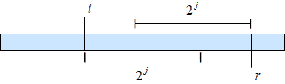

# 空间和时间局部性

> [原文链接](https://en.algorithmica.org/hpc/external-memory/locality/)

要精确评估算法在内存操作方面的性能，我们需要考虑缓存系统的多个特性：缓存层数量、每层的内存和块大小、每层用于缓存淘汰的确切策略，有时甚至包括内存分页机制的细节。

抽象掉所有这些细节对于算法设计的初期阶段非常有帮助。与其计算理论上的缓存命中率，不如从更定性的角度来推理缓存性能。

在这个背景下，我们可以主要从两个方面来讨论缓存复用的程度：

+   *时间局部性*指的是在相对较短的时间内重复访问相同的数据，这样数据很可能在请求之间仍然保留在缓存中。

+   *空间局部性*指的是使用在内存位置上相对接近的元素，这样它们很可能会被一起从同一内存块中加载。

换句话说，时间局部性是指这个相同的内存位置很快会被再次请求，而空间局部性是指紧随其后的很可能请求的是附近的位置。

在本节中，我们将进行一些案例研究，以展示这些高级概念如何有助于实际优化。

### [深度优先与广度优先](https://en.algorithmica.org/hpc/external-memory/locality/#depth-first-vs-breadth-first)

考虑一种分而治之的算法，比如归并排序。实现它的方法有两种：

+   我们可以递归地实现它，或者说是“深度优先”，这是它通常的实现方式：先对左半部分进行排序，然后对右半部分进行排序，最后合并结果。

+   我们可以迭代地实现它，或者说是“广度优先”：首先处理最低的“层”，遍历整个数据集，比较奇数元素和偶数元素，然后将前两个元素与后两个元素合并，第三个元素与第四个元素合并，依此类推。

第二种方法似乎更繁琐，但更快——因为递归总是很慢，对吧？

通常，递归确实很慢（/hpc/architecture/functions），但这种情况并不适用于这个和许多类似的分而治之算法。虽然迭代方法具有仅进行顺序 I/O 的优势，但递归方法具有更好的时间局部性：当一个段完全适合缓存时，它将保留在所有递归的较低层，从而在稍后获得更好的访问时间。

事实上，由于我们只需要将数组分割$O(\log \frac{N}{M})$次，我们总共只需要读取$O(\frac{N}{B} \log \frac{N}{M})$个块，而在迭代方法中，无论什么情况，整个数组都需要从头开始读取$O(\log N)$次。这导致速度提升为$O(\frac{\log N}{\log N - \log M})$，可能高达一个数量级。

在实践中，递归仍然有一些开销，因此使用混合算法是有意义的，在这种算法中，我们不会一直递归到基本情况，而是在递归的较低级别切换到迭代代码。

### [#](https://en.algorithmica.org/hpc/external-memory/locality/#dynamic-programming)动态规划

类似的推理可以应用于动态规划算法的实现，但会导致相反的结果。考虑经典的*背包问题*：给定$N$个具有正整数成本$c_i$的物品，选择一个物品子集，其总成本最大，不超过给定的常数$W$。

解决它的方法是引入*状态* $f[n, w]$，它对应于使用前$n$个物品所能达到的最大总成本，不超过$w$。如果考虑是否取第$n$个物品以及使用动态的先前状态来做出最优决策，这些值可以在$O(1)$时间内计算每个条目。

Python 有一个方便的`lru_cache`装饰器，可以用于实现带有记忆化递归的它：

```cpp
@lru_cache
def f(n, w):
    # check if we have no items to choose
    if n == 0:
        return 0

    # check if we can't pick the last item (note zero-based indexing)
    if c[n - 1] > w:
        return f(n - 1, w)

    # otherwise, we can either pick the last item or not
    return max(f(n - 1, w), c[n - 1] + f(n - 1, w - c[n - 1])) 
```

当计算$f[N, W]$时，递归可能访问多达$O(N \cdot W)$个不同的状态，这在渐近上是有效的，但在现实中相当慢。即使在消除了 Python 递归的开销以及 LRU 缓存工作所需的全部哈希表查询之后，它仍然会很慢，因为它在执行的大部分过程中都会进行随机的 I/O 操作。

我们可以做的另一件事是为动态创建一个二维数组，并用一个漂亮的嵌套循环替换递归，如下所示：

```cpp
int f[N + 1][W + 1] = {0}; // this zero-fills the array

for (int n = 1; n <= N; n++)
    for (int w = 0; w <= W; w++)
        f[n][w] = c[n - 1] > w ?
                  f[n - 1][w] :
                  max(f[n - 1][k], c[n - 1] + f[n - 1][w - c[n - 1]]); 
```

注意，我们只使用前一层动态来计算下一层。这意味着如果我们能在缓存中存储一层，我们只需要在外部内存中写入$O(\frac{N \cdot W}{B})$个块。

此外，如果我们只需要答案，实际上我们不需要存储整个二维数组，只需要存储最后一层。这使得我们只需通过维护一个包含$W$个值的单个数组来使用$O(W)$的内存。为了简化代码，我们可以稍微改变动态，以存储一个二进制值：是否可以使用我们已考虑的物品得到恰好$w$的和。这个动态计算得更快：

```cpp
bool f[W + 1] = {0};
f[0] = 1;
for (int n = 0; n < N; n++)
    for (int x = W - c[n]; x >= 0; x--)
        f[x + c[n]] |= f[x]; 
```

作为旁注，现在它只使用简单的位操作，可以通过使用 bitset 进一步优化：

```cpp
std::bitset<W + 1> b;
b[0] = 1;
for (int n = 0; n < N; n++)
    b |= b << c[n]; 
```

令人惊讶的是，仍有改进的空间，我们稍后会回到这个问题。

### [#](https://en.algorithmica.org/hpc/external-memory/locality/#sparse-table)稀疏表

*稀疏表*是一种*静态*数据结构，常用于解决*静态 RMQ*问题以及计算任何类似的*幂等范围缩减*。它可以正式定义为大小为$\log n \times n$的二维数组：

$$ t[k][i] = \min \{ a_i, a_{i+1}, \ldots, a_{i+2^k-1} \} $$

用简单的话说：我们在每个长度为 2 的幂的段上存储最小值。

这样的数组可以用于在常数时间内计算任意段的最小值，因为对于每个段，我们总能找到两个可能重叠的段，它们的尺寸是相同的 2 的幂，它们的并集给出了整个段。



这意味着我们可以直接取这两个预计算最小值中的最小值作为答案：

```cpp
int rmq(int l, int r) { // half-interval [l; r)
    int t = __lg(r - l);
    return min(mn[t][l], mn[t][r - (1 << t)]);
} 
```

`__lg`函数是 GCC 中可用的一个内建函数，用于计算一个数的二进制对数并向下取整。内部它使用`clz`（“计算最高位零”）指令，并从 32（针对 32 位整数）中减去这个计数，因此只需要几个周期。

我之所以在这篇文章中提到它，是因为它有多个替代构建方法，在内存操作效率方面有不同的表现。一般来说，稀疏表可以通过动态规划的方式在$O(n \log n)$时间内构建，通过按增加的$i$或$k$的顺序迭代，并应用以下恒等式：

$$ t[k][i] = \min(t[k-1][i], t[k-1][i+2^{k-1}]) $$

现在，有两个设计选择要做：是否将对数大小的$k$作为第一维或第二维，以及是否先迭代$k$然后迭代$i$或相反。这意味着有$2×2=4$种构建它的方法，这里是最优的一种：

```cpp
int mn[logn][maxn];

memcpy(mn[0], a, sizeof a);

for (int l = 0; l < logn - 1; l++)
    for (int i = 0; i + (2 << l) <= n; i++)
        mn[l + 1][i] = min(mn[l][i], mn[l][i + (1 << l)]); 
```

这是唯一一种内存布局和迭代顺序的组合，它会产生漂亮的线性遍历，速度大约快 3 倍。作为一个练习，考虑其他三种变体，并思考一下*为什么*它们会慢。

### [#](https://en.algorithmica.org/hpc/external-memory/locality/#array-of-structs-vs-struct-of-arrays)数组结构 vs. 结构数组

假设你想实现一个二叉树，并将它的字段存储在像这样的单独数组中：

```cpp
int left_child[maxn], right_child[maxn], key[maxn], size[maxn]; 
```

当我们将每个字段与其他字段分开存储时，这种内存布局被称为*数组结构*（SoA）。在大多数情况下，当实现树操作时，你会访问一个节点，然后很快就会访问其所有或大部分内部数据。如果这些字段是分开存储的，这意味着它们也位于不同的内存块中。如果请求的一些字段被缓存了，而其他字段没有被缓存，你仍然需要等待最慢的那个字段被读取。

相反，如果它被存储为结构数组（AoS），你将需要大约少 4 倍的块读取，因为一个节点的所有数据都存储在同一个块中，并且一次性读取：

```cpp
struct Node {
    int left_child, right_child, key, size;
};

Node t[maxn]; 
```

AoS 布局通常被用于数据结构，但 SoA 仍然有很好的用途：虽然它在搜索方面表现较差，但在线性扫描方面则要好得多。

这种设计上的差异在数据处理应用中非常重要。例如，数据库可以是*行导向*或*列导向*（也称为*列格式*）：

+   当你需要在大数据集中搜索有限数量的对象，并且/或者获取它们的所有或大部分字段时，会使用*行导向*的存储格式。例如：PostgreSQL, MongoDB。

+   *列导向*的存储格式用于大数据处理和分析，在这些情况下，你需要扫描所有内容来计算某些统计信息。例如：ClickHouse, Hbase。

列格式有额外的优势，即你只能读取你需要的字段，因为不同的字段存储在不同的外部内存区域中。[← 无缓存算法](https://en.algorithmica.org/hpc/external-memory/oblivious/)[../RAM & CPU Caches →](https://en.algorithmica.org/hpc/cpu-cache/)
