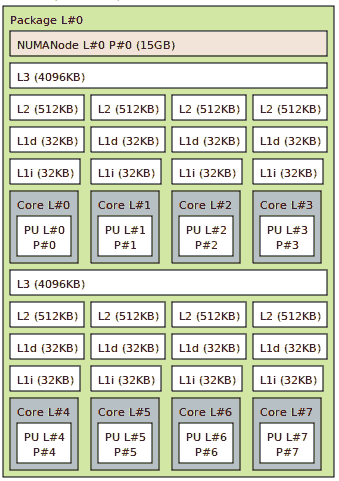

# 内存共享

> 原文：[`en.algorithmica.org/hpc/cpu-cache/sharing/`](https://en.algorithmica.org/hpc/cpu-cache/sharing/)

从层次结构的某个级别开始，缓存在不同核心之间变得*共享*。这减少了总的芯片面积，并允许你在单个芯片上添加更多核心，但同时也带来了一些“嘈杂邻居”问题，因为它限制了单个执行线程可用的有效缓存大小和带宽。

在大多数 CPU 上，只有最后一层缓存是共享的，并且不一定是以统一的方式。在我的机器上，有 8 个物理核心，L3 缓存的容量是 8M，但它被分成两半：两组 4 个核心可以访问它们自己的 4M L3 缓存区域，而不是全部。

存在一些更复杂的拓扑结构，访问内存的某些区域需要非恒定的时间，每个核心不同（这有时是不故意的[有时是不故意的](https://randomascii.wordpress.com/2022/01/12/5-5-mm-in-1-25-nanoseconds/)）。这种架构特性被称为*非一致性内存访问*（NUMA），对于安装了多个独立 CPU 芯片的多插槽系统来说，这种情况是存在的。

在 Linux 上，可以使用`lstopo`检索内存系统的拓扑结构：



由 lstopo 生成的 Ryzen 7 4700U 的缓存层次结构

这对并行算法有一些重要的含义：多线程内存访问的性能取决于哪些核心正在运行哪些执行线程。为了演示这一点，我们将并行运行带宽基准测试。

### [#](https://en.algorithmica.org/hpc/cpu-cache/sharing/#cpu-affinity)CPU 亲和力

我们不必修改源代码以在多个线程上运行，我们可以简单地运行多个相同的进程，使用[GNU parallel](https://www.gnu.org/software/parallel/)。为了控制哪些核心正在执行它们，我们使用`taskset`设置它们的*处理器亲和力*。这个组合命令运行 4 个进程，这些进程可以在 CPU 的第一个 4 个核心上运行：

```cpp
parallel taskset -c 0,1,2,3 ./run ::: {0..3} 
```

当我们改变同时运行的过程数量时，我们会得到以下结果：


你现在可以看到，当数组超过 L2 缓存（这是每个核心的私有缓存）时，随着核心开始竞争共享的 L3 缓存和 RAM，性能会下降。

我们特别将所有进程设置为在第一个 4 个核心上运行，因为它们有一个统一的 L3 缓存。如果一些进程被调度到核心的另一半，对 L3 缓存的竞争将会减少。操作系统不会监控此类活动——进程做什么是其自己的私事——因此默认情况下，它在执行期间任意地将线程分配给核心，而不关心缓存亲和力，只考虑核心负载。

让我们再运行另一个基准测试，但现在将进程固定到不同的 4 核心组，这些组不共享 L3 缓存：

```cpp
parallel taskset -c 0,1 ./run ::: {0..1}  # L3 cache sharing parallel taskset -c 0,4 ./run ::: {0..1}  # no L3 cache sharing 
```

它的表现更好——就好像有双倍的 L3 缓存和 RAM 带宽可用：


这些问题在基准测试时尤其棘手，并且在并行应用程序的计时中是巨大的噪声来源。

### [#](https://en.algorithmica.org/hpc/cpu-cache/sharing/#saturating-bandwidth) 满足带宽

当查看第一个图的 RAM 部分，可能会觉得随着核心数的增加，每个进程的吞吐量会减半、减到三分之一、减到四分之一等等，而总带宽保持不变。但这并不完全正确：竞争会损害性能，但单个 CPU 核心通常无法饱和所有的 RAM 带宽。

如果我们更仔细地绘制，我们会看到总带宽实际上随着核心数的增加而增加——尽管不是成比例的，并且最终接近其理论最大值约 ~42.4 GB/s：


注意，我们仍然指定处理器亲和性：$k$ 线程运行使用前 $k$ 个核心。这就是为什么从 4 个核心切换到 5 个核心时性能提升如此巨大：如果请求通过独立的 L3 缓存，你可以拥有更多的 RAM 带宽。

通常，为了实现最大带宽，你应该始终对称地分割应用程序的线程。[← 缓存行](https://en.algorithmica.org/hpc/cpu-cache/cache-lines/)[内存级并行处理 →](https://en.algorithmica.org/hpc/cpu-cache/mlp/)
