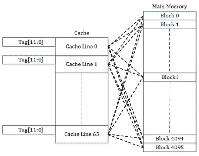
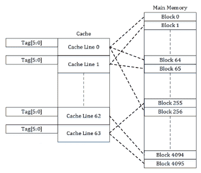
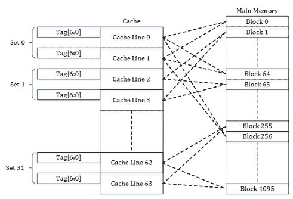
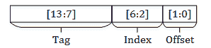

# 缓存关联性

> 原文：[`en.algorithmica.org/hpc/cpu-cache/associativity/`](https://en.algorithmica.org/hpc/cpu-cache/associativity/)

考虑一个大小为 $N=2^{21}$ 的数组上的步进增量循环，步长为 256：

```cpp
for (int i = 0; i < N; i += 256)
    a[i]++; 
```

然后这个，步长为 257：

```cpp
for (int i = 0; i < N; i += 257)
    a[i]++; 
```

哪个会更快完成？有几个考虑因素浮现在脑海中：

+   起初，你认为两者之间不会有太大差异，或者可能认为第二个循环比第一个快$\frac{257}{256}$倍左右，因为它总的迭代次数更少。

+   然后你回想起 256 是一个很好的整数，这可能和 SIMD 或内存系统有关，所以也许第一个更快。

但正确答案非常反直觉：第二个循环更快——并且快了 10 倍。

这不仅仅是一个单一的坏步长。对于所有是大型 2 的幂次倍数的索引，性能都会下降：


数组大小已标准化，以便总迭代次数保持不变

没有向量化或其他任何操作，这两个循环除了步长外，生成的汇编代码相同。这种效果仅归因于内存系统，特别是称为*缓存关联性*的特性，这是 CPU 缓存在硬件中实现的一个特殊产物。

### [#](https://en.algorithmica.org/hpc/cpu-cache/associativity/#hardware-caches)硬件缓存

当我们研究内存系统理论时，我们讨论了在软件中实现不同的缓存淘汰策略的方法。实现缓存淘汰策略。我们特别关注的一种策略是*最近最少使用*（LRU）策略，它简单有效，但仍需要一些非平凡的数据操作。

在硬件的背景下，这种方案被称为*全关联缓存*：我们有$M$个单元格，每个单元格都能容纳一个与$N$个总内存位置中的任何一个相对应的缓存行，在发生冲突的情况下，最长时间未被访问的那个被踢出，并用新的一个替换。



全关联缓存

全关联缓存的缺点是，在软件中实现“在数百万个缓存行中找到最旧的缓存行”的操作相当困难，在硬件中则完全不可行。你可以制作一个大约有 16 个条目的全关联缓存，但管理数百个缓存行已经变得要么过于昂贵，要么速度太慢，以至于不值得。

我们可以采取另一种更简单的方法：只需将 RAM 中的每个 64 字节块映射到一条单独的缓存行，它可以占用。比如说，如果我们有 4096 个内存块和 64 条缓存行，那么在任何时候，每条缓存行都存储着 64 个不同块中的内容，即 $\frac{4096}{64} = 64$。



直接映射缓存

直接映射缓存易于实现，不需要存储与缓存行相关联的任何其他元信息，除了标签（缓存的内存块的实际位置）。缺点是条目可能会被太快地踢出 — 例如，当在映射到同一缓存行的两个地址之间弹跳时 — 导致整体缓存利用率降低。

因此，我们选择了介于直接映射和完全相联缓存之间的方案：*组相联缓存*。它将地址空间分成相等的组，这些组分别作为小型完全相联缓存。



组相联缓存（2 路相联）

*相联性* 是这些组的大小，或者说，每个数据块可以映射到多少不同的缓存行。更高的相联性允许更有效地利用缓存，但也会增加成本。

例如，在我的[CPU](https://en.wikichip.org/wiki/amd/ryzen_7/4700u)上，L3 缓存是 16 路组相联的，每个核心有 4MB 可用。这意味着总共有 $\frac{2^{22}}{2^{6}} = 2^{16}$ 个缓存行，这些行被分成 $\frac{2^{16}}{16} = 2^{12}$ 组，每组作为一个完全相联的缓存，占其自身 RAM 的 $(\frac{1}{2^{12}})$ 部分。

大多数其他 CPU 缓存也是组相联的，包括非数据缓存，如指令缓存和 TLB。例外的是只有 64 个或更少条目的小型专用缓存 — 这些通常是完全相联的。

### [#](https://en.algorithmica.org/hpc/cpu-cache/associativity/#address-translation)地址转换

剩下的唯一歧义是缓存行映射的确切方式。

如果我们在软件中实现组相联缓存，我们将计算内存块地址的某些哈希函数，然后使用其值作为缓存行索引。在硬件中，我们实际上无法做到这一点，因为它太慢了：例如，对于 L1 缓存，延迟要求是 4 或 5 个周期，即使是取模也需要大约 10-15 个周期，更不用说更复杂的事情了。

相反，硬件采用懒惰的方法。它将需要访问的内存地址分成三部分 — 从低位到高位：

+   *偏移量* — 64B 缓存行中字节的索引（$\log_2 64 = 6$ 位）；

+   *索引* — 缓存行组的索引（由于 L3 缓存中有 $2^{12}$ 个缓存行，所以是下一个 $12$ 位）；

+   *标签* — 剩余的内存地址，用于区分存储在缓存行中的内存块。

换句话说，所有具有相同“中间”部分的内存地址都映射到同一个组。



64 条条目的 2 路组相联缓存的地址组成

这使得缓存系统更简单、更便宜，但同时也容易受到某些不良访问模式的影响。

### [#](https://en.algorithmica.org/hpc/cpu-cache/associativity/#pathological-mappings)病态映射

现在，我们刚才说到哪里了？哦，是的：迭代步长为 256 导致如此严重的减速的原因。

当我们跳过 256 个整数时，指针总是增加$1024 = 2^{10}$，而最后 10 位保持不变。由于缓存系统使用低 6 位作为偏移量，接下来 12 位作为缓存行索引，我们实际上只是在 L3 缓存中使用$2^{12 - (10 - 6)} = 2⁸$个不同的集合，而不是$2^{12}$，这相当于将我们的 L3 缓存缩小了$2⁴ = 16$倍。数组停止适合 L3 缓存（$N=2^{21}$）并溢出到速度慢一个数量级的 RAM，这导致性能下降。

由于多种原因，程序员在索引数组时特别喜欢使用 2 的幂次，因此由缓存关联性效应引起的性能问题在算法中出现的频率非常高：

+   如果多维数组的最后一个维度是 2 的幂次，计算多维数组访问的地址更容易，因为它只需要二进制移位而不是乘法。

+   计算对 2 的幂次的取模运算更容易，因为它可以通过单次位与运算来完成。

+   在分而治之算法中使用 2 的幂次问题规模既方便，有时甚至必要。

+   它是最小的整数指数，因此当基准测试内存绑定算法时，使用递增的 2 的幂次作为问题规模是一种流行的选择。

+   此外，由于传递性，十的幂次也可以被稍低一点的 2 的幂次整除。

这尤其适用于使用固定内存布局的隐式数据结构。例如，对大小为$2^{20}$的数组进行二分查找大约需要每个查询约 360ns，而搜索大小为$(2^{20} + 123)$的数组大约需要 300ns。当数组大小是某个大 2 的幂次的倍数时，"最热"的元素（我们可能在第一次 dozen 或多轮迭代中请求的元素）的索引也将能被某些大 2 的幂次整除，并映射到相同的缓存行——相互踢出，导致约 20%的性能下降。

幸运的是，这类问题更多的是异常而不是严重问题。解决方案通常很简单：避免以 2 的幂次迭代，使多维数组的最后一个维度具有稍不同的尺寸，或使用任何其他方法在内存布局中插入“空洞”，或者创建一些看似随机的双射，将数组索引与数据实际存储的位置相对应。[←指针替代](https://en.algorithmica.org/hpc/cpu-cache/pointers/)[内存分页→](https://en.algorithmica.org/hpc/cpu-cache/paging/)
