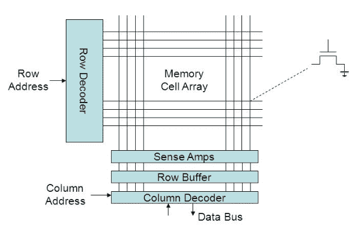

# AoS 和 SoA

> 原文：[`en.algorithmica.org/hpc/cpu-cache/aos-soa/`](https://en.algorithmica.org/hpc/cpu-cache/aos-soa/)

通常，将你需要同时获取的数据分组在一起是有益的：最好是放在相同的缓存行上，如果不可能，则放在相邻的缓存行上。这提高了你内存访问的 空间局部性，从而对内存密集型算法的性能产生积极影响。

为了展示这样做可能产生的潜在影响，我们修改了 指针追踪 基准测试，使其使用不是单个字段，而是一个可变数量的字段（$D$）来计算下一个指针。

### [#](https://en.algorithmica.org/hpc/cpu-cache/aos-soa/#experiment)实验

第一种方法将把这些字段定位在二维数组的行中。我们将把这个变体称为 *结构数组*（AoS）：

```cpp
const int M = N / D; // # of memory accesses
int p[M], q[M][D];

iota(p, p + M, 0);
random_shuffle(p, p + M);

int k = p[M - 1];

for (int i = 0; i < M; i++)
    q[k][0] = p[i];

    for (int j = 1; j < D; j++)
        q[i][0] ^= (q[j][i] = rand());

    k = q[k][0];
}

for (int i = 0; i < M; i++) {
    int x = 0;
    for (int j = 0; j < D; j++)
        x ^= q[k][j];
    k = x;
} 
```

在第二种方法中，我们将它们分别放置。这样做最懒惰的方式是将二维数组 `q` 转置，并在所有后续访问中交换索引：

```cpp
int q[D][M];
//    ^--^ 
```

通过类比，我们称这种变体为 *数组结构*（SoA）。显然，对于大的 $D$ 值，它的性能要差得多：


这两种变体的性能都随着 $D$ 线性增长，但 AoS 由于数据是顺序存储的，因此需要获取的总缓存行数最多减少 16 倍。即使当 $D=64$ 时，处理其他 63 个值所需的时间也少于第一次获取的延迟。

你也可以看到在二进制幂次的地方有尖峰。AoS 的性能略好，因为它可以使用 SIMD 更快地计算 水平异或和。相比之下，SoA 的性能要差得多，但这并不是关于 $D$，而是关于 $\lfloor N / D \rfloor$，即第二维的大小是一个大的二进制幂：这导致了一个相当复杂的 缓存关联性 影响。

### [#](https://en.algorithmica.org/hpc/cpu-cache/aos-soa/#temporary-storage-contention)临时存储竞争

起初，似乎不应该有任何缓存问题，因为 $N=2^{23}$，数组本身太大，根本无法放入最初的 L3 缓存。细微之处在于，为了并行处理来自不同内存位置的一组元素，你仍然需要一些空间来临时存储它们。你不能简单地使用寄存器，因为寄存器数量不足，所以它们需要存储在缓存中，即使在你只需要它们的一微秒内。

因此，当 `N / D` 是一个大的二进制幂时，并且我们正在按第一个索引迭代数组 `q[D][N / D]`，一些我们暂时需要的内存地址将映射到相同的缓存行——由于那里空间不足，其中许多将不得不从内存层次结构的上层重新获取。

这里还有一个令人困惑的问题：如果我们启用大页，它预期会使得大多数$D$值下的总延迟降低 10-15%，但对于$D=64$，它使得事情变得更糟十倍：


注意对数刻度

我怀疑即使是设计内存控制器的工程师也无法立即解释正在发生的事情。

简而言之，这种差异是因为，与每个核心私有的 L1/L2 缓存不同，L3 缓存必须使用*物理*内存地址而不是*虚拟*地址来在不同核心之间共享缓存时的同步。

当我们使用 4K 内存页面时，虚拟地址在物理内存中有些任意地分散，这使得缓存关联性问题不那么严重：物理地址将具有相同的余数（模 4K 字节），而不是虚拟地址的`N / D`。当我们特别需要大页时，这个最大对齐限制增加到 2M，缓存行面临更多的竞争。

这是我所知的唯一一个例子，当启用大页时，性能会变差，更不用说降低十倍了。

### [#](https://en.algorithmica.org/hpc/cpu-cache/aos-soa/#padded-aos)填充 AoS

只要我们获取相同数量的缓存行，它们的位置并不重要，对吧？让我们测试一下，并在 AoS 代码中切换到 padded 整数：

```cpp
struct padded_int {
    int val;
    int padding[15];
};

const int M = N / D / 16;
padded_int q[M][D]; 
```

除了这一点，我们仍在计算$D$填充整数的异或和。我们获取了正好$D$个缓存行，但这次是顺序的。运行时间不应该与 SoA 不同，但这并不是发生的情况：


当$D=63$时，运行时间大约降低了 1/3，但这仅适用于超出 L3 缓存的数组。如果我们固定$D$并改变$N$，你可以看到填充版本在较小的数组上表现略差，因为随机缓存共享的机会更少：


由于较小数组大小的性能不受影响，这显然与 RAM 的工作方式有关。

### [#](https://en.algorithmica.org/hpc/cpu-cache/aos-soa/#ram-specific-timings)RAM 特定时间

从性能分析的角度来看，RAM 中的所有数据都物理存储在一个由微小电容器细胞组成的二维数组中，该数组分为行和列。要读取或写入任何单元格，你需要执行一个、两个或三个操作：

1.  在*行缓冲区*中读取一行内容，这会暂时放电电容器。

1.  读取或写入此缓冲区中的特定单元格。

1.  将行缓冲区的内容写回电容器，以便保留数据，并且行缓冲区可以用于其他内存访问。

这里是关键点：你不需要在对应同一行的两次内存访问之间执行步骤 1 和 3——你只需将行缓冲区用作临时缓存。这三个动作所需的时间大致相同，因此这种优化使得长序列的行局部访问比分散的访问模式快三倍。



行的大小取决于硬件，但通常在 1024 到 8192 字节之间。因此，即使填充的 AoS 基准测试将每个元素放置在不同的缓存行中，它们仍然很可能位于同一 RAM 行上，整个读取序列大约需要 1/3 的时间加上第一次内存访问的延迟。[← 内存分页](https://en.algorithmica.org/hpc/cpu-cache/paging/)[→ SIMD 并行处理](https://en.algorithmica.org/hpc/simd/)
