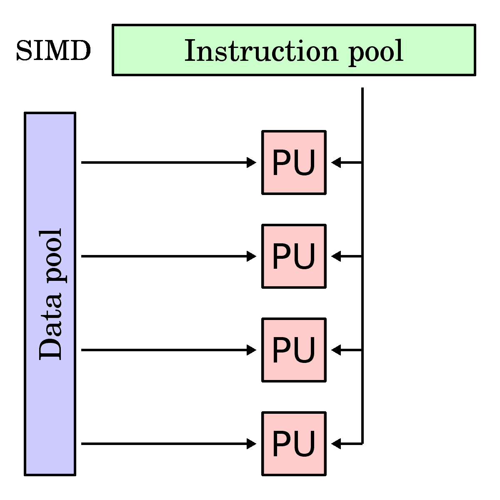
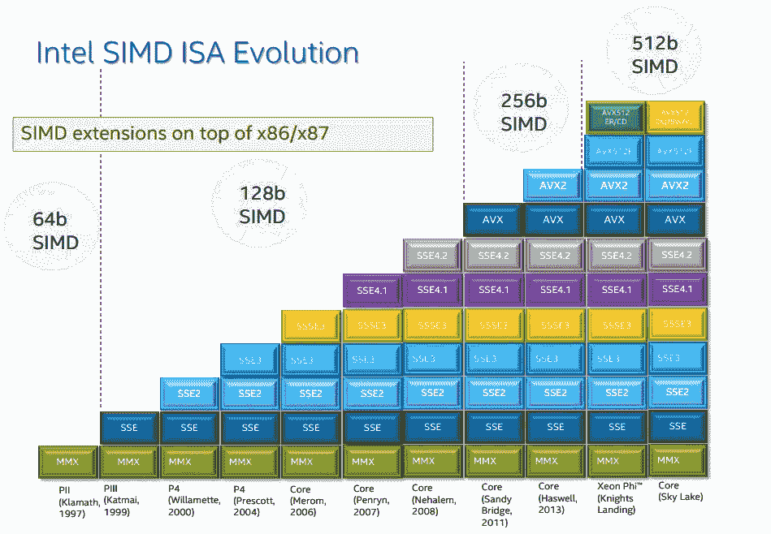

# SIMD 并行性

> 原文：[`en.algorithmica.org/hpc/simd/`](https://en.algorithmica.org/hpc/simd/)

考虑以下小程序，其中我们计算整数数组的和：

```cpp
const int n = 1e5;
int a[n], s = 0;

int main() {
    for (int t = 0; t < 100000; t++)
        for (int i = 0; i < n; i++)
            s += a[i];

    return 0;
} 
```

如果我们用普通的`g++ -O3`编译并运行，它将在 2.43 秒内完成。

现在，让我们在开头添加以下神奇指令：

```cpp
#pragma GCC target("avx2")
// ...the rest is the same as before 
```

在相同的环境下编译和运行，它将在 1.24 秒内完成。这几乎是两倍的速度，而我们没有更改任何代码行或优化级别。

发生在这里的是，我们提供了一些关于运行此代码的计算机的信息。具体来说，我们告诉编译器目标 CPU 支持 x86 指令集的扩展，称为“AVX2”。AVX2 是针对 x86 的许多所谓“SIMD 扩展”之一。这些扩展包括在特殊寄存器上操作的指令，这些寄存器能够使用“单指令，多数据”（SIMD）方法存储 128 位、256 位甚至 512 位的数据。与处理单个标量值不同，SIMD 指令将寄存器中的数据分成 8 位、16 位、32 位或 64 位的块，并并行地对它们执行相同的操作，从而在性能上实现成比例的提升^(1)。



这些扩展相对较新，它们在 CPU 中的支持是逐步实现的，同时保持向后兼容^(2)。除了添加更多专用指令外，它们之间最重要的区别是引入了越来越宽的寄存器。

特别是，AVX2 有用于处理 256 位寄存器的指令，而默认情况下，GCC 假设没有启用超过 128 位的 SSE2。因此，在告诉优化器它可以使用一次添加 8 个整数的指令而不是 4 个之后，性能翻倍。



编译器通常能够很好地重写使用 SIMD 指令的简单循环，就像上面的例子一样。这种优化称为自动向量化，它是使用 SIMD 最流行的方式。

问题在于它只适用于某些类型的循环，即使如此，它通常也只会产生次优结果。为了理解其局限性，我们需要深入挖掘并从更低层次探索这项技术，这正是本章将要做的。

* * *

1.  在某些 CPU 上，特别是重 SIMD 指令消耗更多能量，因此[需要降频](https://blog.cloudflare.com/on-the-dangers-of-intels-frequency-scaling/)来平衡总功耗，所以实际的加速并不总是成比例的。↩︎

1.  从 AVX512 开始，不再保持向后兼容：有许多不同的“风味”针对特定需求定制，如数据压缩、加密或机器学习。↩︎

[← AoS 和 SoA](https://en.algorithmica.org/hpc/cpu-cache/aos-soa/)

[← ../RAM & CPU 缓存](https://en.algorithmica.org/hpc/cpu-cache/)[内联函数和向量类型 →](https://en.algorithmica.org/hpc/simd/intrinsics/)

[../算法案例研究 →](https://en.algorithmica.org/hpc/algorithms/)
