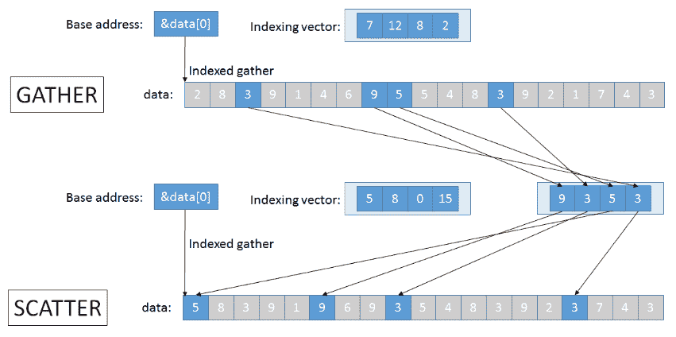

# 数据移动

> 原文：[`en.algorithmica.org/hpc/simd/moving/`](https://en.algorithmica.org/hpc/simd/moving/)

如果您花了一些时间研究[参考资料](https://software.intel.com/sites/landingpage/IntrinsicsGuide)，您可能会注意到，本质上存在两组主要的向量操作：

1.  执行某些逐元素操作（`+`、`*`、`<`、`acos`等）的指令。

1.  加载、存储、掩码、洗牌以及通常移动数据的指令。

虽然使用逐元素指令很简单，但 SIMD 最大的挑战是首先将数据放入向量寄存器中，并且开销足够低，以至于整个努力都是值得的。

### [#](https://en.algorithmica.org/hpc/simd/moving/#aligned-loads-and-stores)对齐加载和存储

将 SIMD 寄存器的内容读取和写入内存的操作有两个版本：`load` / `loadu`和`store` / `storeu`。这里的“u”代表“未对齐”。区别在于前者只有在读取/写入的块适合单个缓存行时才能正确工作（否则会崩溃），而后者无论哪种方式都可以工作，但如果块跨越了缓存行，会有轻微的性能损失。

有时，尤其是在“内部”操作非常轻量时，性能差异变得非常显著（至少因为您需要获取两条缓存行而不是一条）。作为一个极端的例子，这种将两个数组相加的方式：

```cpp
for (int i = 3; i + 7 < n; i += 8) {  __m256i x = _mm256_loadu_si256((__m256i*) &a[i]); __m256i y = _mm256_loadu_si256((__m256i*) &b[i]); __m256i z = _mm256_add_epi32(x, y); _mm256_storeu_si256((__m256i*) &c[i], z); } 
```

…比其对齐版本慢约 30%：

```cpp
for (int i = 0; i < n; i += 8) {  __m256i x = _mm256_load_si256((__m256i*) &a[i]); __m256i y = _mm256_load_si256((__m256i*) &b[i]); __m256i z = _mm256_add_epi32(x, y); _mm256_store_si256((__m256i*) &c[i], z); } 
```

在第一种版本中，假设数组`a`、`b`和`c`都是 64 字节对齐的（它们第一个元素地址能被 64 整除，因此它们从缓存行的开始处开始），大约一半的读取和写入将会是“坏”的，因为它们跨越了缓存行边界。

注意，性能差异是由缓存系统而不是指令本身引起的。在大多数现代架构上，如果块只跨越一个缓存行，`loadu` / `storeu`内联函数应该与`load` / `store`一样快。后者的优势是它们可以作为免费的运行时断言，确保所有读取和写入都是对齐的。

这使得在分配时正确对齐数组和其它数据变得很重要，这也是编译器不能总是高效地进行自动向量化的原因之一。对于大多数用途，我们只需要保证任何 32 字节 SIMD 块不会跨越缓存行边界，我们可以使用`alignas`指定符来指定这种对齐：

```cpp
alignas(32) float a[n];   for (int i = 0; i < n; i += 8) {  __m256 x = _mm256_load_ps(&a[i]); // ... } 
```

内置向量类型已经具有相应的对齐要求，并假设对齐的内存读取和写入——所以当分配`v8si`数组时，您总是安全的，但当你从`int*`转换它时，你必须确保它是对齐的。

类似于标量情况，许多算术指令将内存地址作为操作数——向量加法就是一个例子——尽管你不能显式地使用它作为内建函数，而必须依赖编译器。还有一些其他指令用于从内存中读取 SIMD 块，特别是非临时加载和存储操作，这些操作不会将访问的数据提升到缓存层次结构中。

### [#](https://en.algorithmica.org/hpc/simd/moving/#register-aliasing)寄存器别名

第一款 SIMD 扩展，MMX，开始时相当小。它只使用了 64 位向量，这些向量方便地别名为 80 位浮点数的尾数部分，因此不需要引入一组单独的寄存器。随着后续扩展中向量大小的增长，用于通用寄存器的相同寄存器别名机制被用于向量寄存器，以保持向后兼容性：`xmm0`是`ymm0`的第一个半部分（128 位），`xmm1`是`ymm1`的第一个半部分，依此类推。

这个特性，加上向量寄存器位于 FPU 的事实，使得在它们和通用寄存器之间移动数据变得稍微复杂一些。

### [#](https://en.algorithmica.org/hpc/simd/moving/#extract-and-insert)提取和插入

要从向量中*提取*特定值，你可以使用`_mm256_extract_epi32`和类似的内建函数。它将需要提取的整数的索引作为第二个参数，并根据其值生成不同的指令序列。

如果你需要提取第一个元素，它会生成`vmovd`指令（对于`xmm0`，向量的第一个半部分）：

```cpp
vmovd eax, xmm0 
```

对于 SSE 向量的其他元素，它生成可能稍微慢一点的`vpextrd`：

```cpp
vpextrd eax, xmm0, 1 
```

要从 AVX 向量的第二半部分提取任何内容，首先必须提取那个第二半部分，然后才是标量本身。例如，以下是提取最后一个（第八个）元素的方法，

```cpp
vextracti128 xmm0, ymm0, 0x1 vpextrd      eax, xmm0, 3 
```

有一个类似`_mm256_insert_epi32`的内建函数用于覆盖特定元素：

```cpp
mov          eax, 42   ; v = _mm256_insert_epi32(v, 42, 0); vpinsrd xmm2, xmm0, eax, 0 vinserti128     ymm0, ymm0, xmm2, 0x0   ; v = _mm256_insert_epi32(v, 42, 7); vextracti128 xmm1, ymm0, 0x1 vpinsrd      xmm2, xmm1, eax, 3 vinserti128  ymm0, ymm0, xmm2, 0x1 
```

总结：将标量数据移动到和从向量寄存器中是慢的，尤其是在这不是第一个元素的情况下。

### [#](https://en.algorithmica.org/hpc/simd/moving/#making-constants)创建常数

如果你需要填充的不仅仅是单个元素，而是整个向量，你可以使用`_mm256_setr_epi32`内建函数：

```cpp
__m256 iota = _mm256_setr_epi32(0, 1, 2, 3, 4, 5, 6, 7); 
```

这里的“r”代表“反向”——从 CPU 的角度来看，而不是对人类来说。还有一个`_mm256_set_epi32`（没有“r”），它从相反方向填充值。这两个函数主要用于创建编译时常数，然后通过块加载将它们加载到寄存器中。如果你的用例是填充一个零向量，请使用`_mm256_setzero_si256`，它会将寄存器与自身进行`xor`操作。

在内置向量类型中，你可以直接使用正常的括号初始化：

```cpp
vec zero = {}; vec iota = {0, 1, 2, 3, 4, 5, 6, 7}; 
```

### [#](https://en.algorithmica.org/hpc/simd/moving/#broadcast)广播

除了修改单个元素之外，你还可以将单个值*广播*到所有位置：

```cpp
; __m256i v = _mm256_set1_epi32(42); mov          eax, 42 vmovd        xmm0, eax vpbroadcastd ymm0, xmm0 
```

这是一个常用的操作，因此你也可以使用一个内存位置：

```cpp
; __m256 v = _mm256_broadcast_ss(&a[i]); vbroadcastss ymm0, DWORD PTR [rdi] 
```

当使用内置向量类型时，你可以创建一个零向量并将其与一个标量相加：

```cpp
vec v = 42 + vec{}; 
```

### [#](https://en.algorithmica.org/hpc/simd/moving/#mapping-to-arrays)映射到数组

如果你想避免所有这些复杂性，你只需将向量存储在内存中，并以标量的形式读取其值：

```cpp
void print(__m256i v) {  auto t = (unsigned*) &v; for (int i = 0; i < 8; i++) std::cout << std::bitset<32>(t[i]) << " "; std::cout << std::endl; } 
```

这可能不会很快或技术上合法（C++标准没有指定当你这样转换数据时会发生什么），但它很简单，我经常使用这段代码在调试期间打印向量的内容。

### [#](https://en.algorithmica.org/hpc/simd/moving/#non-contiguous-load)非连续加载

后续的 SIMD 扩展添加了特殊的“gather”和“scatter”指令，这些指令使用任意数组索引非顺序地读写数据。尽管它们不会快 8 倍，但通常受内存限制而不是 CPU 限制，但它们对于某些应用（如稀疏线性代数）仍然很有帮助。

`gather`自 AVX2 以来可用，而各种`scatter`指令自 AVX512 以来可用。



让我们看看它们是否比标量读取更快。首先，我们创建一个大小为 $N$ 和 $Q$ 的随机读取查询数组：

```cpp
int a[N], q[Q];   for (int i = 0; i < N; i++)  a[i] = rand();   for (int i = 0; i < Q; i++)  q[i] = rand() % N; 
```

在标量代码中，我们逐个将查询指定的元素添加到校验和中：

```cpp
int s = 0;   for (int i = 0; i < Q; i++)  s += a[q[i]]; 
```

在 SIMD 代码中，我们使用`gather`指令并行地对 8 个不同的索引进行操作：

```cpp
reg s = _mm256_setzero_si256();   for (int i = 0; i < Q; i += 8) {  reg idx = _mm256_load_si256( (reg*) &q[i] ); reg x = _mm256_i32gather_epi32(a, idx, 4); s = _mm256_add_epi32(s, x); } 
```

它们的性能大致相同，除非数组适合 L1 缓存：


`gather` 和 `scatter` 的目的不是使内存操作更快，而是将数据放入寄存器中，以便对它们进行大量计算。对于比仅仅一次加法更昂贵的操作，它们非常有优势。

缺乏（快速）`gather` 和 `scatter` 指令使得在 CPU 上使用 SIMD 编程与支持独立内存访问的正确并行计算环境大不相同。你必须始终围绕它进行设计，并采用各种方式组织你的数据，以便将其加载到寄存器中。[← 内置函数和向量类型](https://en.algorithmica.org/hpc/simd/intrinsics/)[减少 →](https://en.algorithmica.org/hpc/simd/reduction/)
