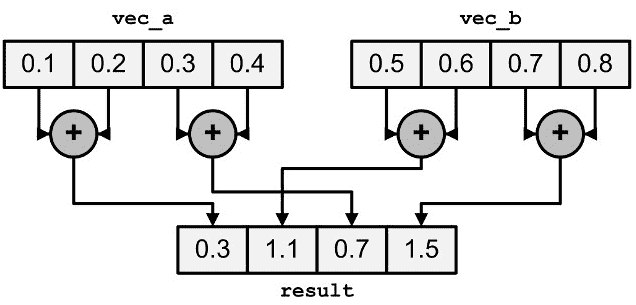

# 减少操作

> 原文：[`en.algorithmica.org/hpc/simd/reduction/`](https://en.algorithmica.org/hpc/simd/reduction/)

*减少操作*（在函数式编程中也称为*折叠*）是在任意元素范围内计算某些结合律和交换律操作（即，$(a \circ b) \circ c = a \circ (b \circ c)$和$a \circ b = b \circ a$）的值的行为。

最简单的减少操作示例是计算数组的和：

```cpp
int sum(int *a, int n) {  int s = 0; for (int i = 0; i < n; i++) s += a[i]; return s; } 
```

原始方法不太容易向量化，因为循环的状态（当前前缀上的和`s`）依赖于前一次迭代。克服这个问题的方法是，将单个标量累加器`s`分成 8 个独立的累加器，这样`s_i`就会包含原始数组每 8 个元素的和，并且每个`s_i`都向右移动了$i$位：

$$ s_i = \sum_{j=0}^{n / 8} a_{8 \cdot j + i } $$

如果我们将这 8 个累加器存储在一个 256 位的向量中，我们可以通过添加数组的连续 8 元素段来一次性更新它们。使用向量扩展，这很简单：

```cpp
int sum_simd(v8si *a, int n) {  //       ^ you can just cast a pointer normally, like with any other pointer type v8si s = {0};   for (int i = 0; i < n / 8; i++) s += a[i];  int res = 0;  // sum 8 accumulators into one for (int i = 0; i < 8; i++) res += s[i];   // add the remainder of a for (int i = n / 8 * 8; i < n; i++) res += a[i];  return res; } 
```

你可以使用这种方法进行其他减少操作，例如寻找数组的最小值或异或和。

### [#](https://en.algorithmica.org/hpc/simd/reduction/#instruction-level-parallelism)指令级并行

我们的实现与编译器自动生成的结果相匹配，但实际上并不最优：当我们只使用一个累加器时，我们必须等待一个周期，以便在循环迭代之间完成向量加法，而在这个微架构上相应指令的吞吐量是 2。

如果我们再次将数组分成$B \geq 2$部分，并为每个部分使用一个*独立的*累加器，我们可以饱和向量加法的吞吐量，并将性能提高两倍：

```cpp
const int B = 2; // how many vector accumulators to use  int sum_simd(v8si *a, int n) {  v8si b[B] = {0};   for (int i = 0; i + (B - 1) < n / 8; i += B) for (int j = 0; j < B; j++) b[j] += a[i + j];   // sum all vector accumulators into one for (int i = 1; i < B; i++) b[0] += b[i];  int s = 0;   // sum 8 scalar accumulators into one for (int i = 0; i < 8; i++) s += b[0][i];   // add the remainder of a for (int i = n / (8 * B) * (8 * B); i < n; i++) s += a[i];   return s; } 
```

如果你有多于 2 个相关的执行端口，你可以相应地增加`B`常数，但`n`倍的性能提升只会应用于适合 L1 缓存的数组——内存带宽将是任何更大数组的瓶颈。

### [#](https://en.algorithmica.org/hpc/simd/reduction/#horizontal-summation)水平求和

我们将存储在向量寄存器中的 8 个累加器相加到单个标量以获得总和的部分被称为“水平求和”。

虽然逐个提取和添加每个标量只需要常数个周期，但可以使用一个[特殊指令](https://software.intel.com/sites/landingpage/IntrinsicsGuide/#techs=AVX,AVX2&text=_mm256_hadd_epi32&expand=2941)来稍微快一点地计算，该指令将寄存器中相邻元素对相加。



SSE/AVX 中的水平求和。注意输出是如何存储的：输出中的(a b a b)交错对于减少操作是常见的

由于这是一个非常特定的操作，它只能通过 SIMD 内联函数来完成——尽管编译器可能仍然会为标量代码生成大致相同的程序：

```cpp
int hsum(__m256i x) {  __m128i l = _mm256_extracti128_si256(x, 0); __m128i h = _mm256_extracti128_si256(x, 1); l = _mm_add_epi32(l, h); l = _mm_hadd_epi32(l, l); return _mm_extract_epi32(l, 0) + _mm_extract_epi32(l, 1); } 
```

有[其他类似的指令](https://www.intel.com/content/www/us/en/docs/intrinsics-guide/index.html#techs=AVX,AVX2&ig_expand=3037,3009,5135,4870,4870,4872,4875,833,879,874,849,848,6715,4845&text=horizontal)，例如，用于整数乘法或计算相邻元素之间的绝对差值（用于图像处理）。

还有一个特定的指令`_mm_minpos_epu16`，它计算八个 16 位整数中的水平最小值及其索引。这是唯一一次就能完成的水平归约：其他所有操作都是分多步计算的。[← 数据移动](https://en.algorithmica.org/hpc/simd/moving/)[掩码和混合 →](https://en.algorithmica.org/hpc/simd/masking/)
