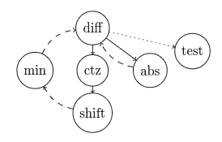

# 二进制 GCD

> 原文：[`en.algorithmica.org/hpc/algorithms/gcd/`](https://en.algorithmica.org/hpc/algorithms/gcd/)

在本节中，我们将推导出一个比 C++ 标准库中的 `gcd` 快约 2 倍的 `gcd` 变体。

## [#](https://en.algorithmica.org/hpc/algorithms/gcd/#euclids-algorithm)欧几里得算法

欧几里得算法解决了寻找两个整数 $a$ 和 $b$ 的最大公约数（GCD）的问题，定义为能够同时整除 $a$ 和 $b$ 的最大数 $g$：

$$ \gcd(a, b) = \max_{g: \; g|a \, \land \, g | b} g $$ 你可能已经从计算机科学教科书中了解到这个算法，但我会在这里总结。它基于以下公式，假设 $a > b$：$$ \gcd(a, b) = \begin{cases} a, & b = 0 \\ \gcd(b, a \bmod b), & b > 0 \end{cases} $$

这是真的，因为如果 $g = \gcd(a, b)$ 能够整除 $a$ 和 $b$，它也应该能够整除 $(a \bmod b = a - k \cdot b)$，但任何更大的除数 $d$ 都不能：$d > g$ 意味着 $d$ 不能整除 $a$，因此也不会整除 $(a - k \cdot b)$。

上面的公式本质上就是算法本身：你可以简单地递归地应用它，由于每次其中一个参数严格递减，它最终会收敛到 $b = 0$ 的情况。

教科书可能还提到了欧几里得算法最坏可能的输入——最大化步骤总数的连续斐波那契数，由于它们呈指数增长，算法的最坏情况运行时间是对数级的。如果我们将其定义为均匀分布整数对的期望步数，其平均运行时间也是如此。[维基百科文章](https://en.wikipedia.org/wiki/Euclidean_algorithm) 也提供了一个更精确的 $0.84 \cdot \ln n$ 的渐近估计。


你可以看到明亮的蓝色线条，它们的比例是黄金比例

你可以以多种方式实现欧几里得算法。最简单的方法就是将定义转换为代码：

```cpp
int gcd(int a, int b) {  if (b == 0) return a; else return gcd(b, a % b); } 
```

你可以更紧凑地重写它如下：

```cpp
int gcd(int a, int b) {  return (b ? gcd(b, a % b) : a); } 
```

你可以将其重写为一个循环，这将更接近硬件实际执行的顺序。但这不会更快，因为编译器可以轻松优化尾递归。

```cpp
int gcd(int a, int b) {  while (b > 0) { a %= b; std::swap(a, b); } return a; } 
```

你甚至可以将循环体写成这个令人困惑的一行——并且它甚至会在 C++17 之后编译而不会产生未定义行为警告：

```cpp
int gcd(int a, int b) {  while (b) b ^= a ^= b ^= a %= b; return a; } 
```

所有这些，以及 C++17 中引入的 `std::gcd`，几乎等价，并且被编译成功能上相当于以下汇编循环：

```cpp
; a = eax, b = edx loop:  ; modulo in assembly: mov  r8d, edx cdq idiv r8d mov  eax, r8d ; (a and b are already swapped now) ; continue until b is zero: test edx, edx jne  loop 
```

如果你运行 perf，你会看到它大约花费了 90% 的时间在 `idiv` 行上。这并不奇怪：在所有计算机上，包括 x86，通用整数除法都出奇地慢。

但有一种除法在硬件中工作得很好：除以 2 的幂。

## [#](https://en.algorithmica.org/hpc/algorithms/gcd/#binary-gcd)二进制最大公约数

*二进制最大公约数算法*与欧几里得算法几乎同时被发现，但它在文明世界的另一端，即古代中国。1967 年，约瑟夫·斯坦因重新发现了它，用于那些没有除法指令或除法指令非常慢的计算机——在那个时代的 CPU 中，使用数百或数千个周期进行罕见或复杂操作并不罕见。

类似于欧几里得算法，它基于几个类似的观察：

1.  $\gcd(0, b) = b$和对称地$\gcd(a, 0) = a$；

1.  $\gcd(2a, 2b) = 2 \cdot \gcd(a, b)$；

1.  如果$b$是奇数，则$\gcd(2a, b) = \gcd(a, b)$；如果$a$是奇数，则对称地$\gcd(a, b) = \gcd(a, 2b)$；

1.  如果$a$和$b$都是奇数，则$\gcd(a, b) = \gcd(|a − b|, \min(a, b))$；

同样，算法本身只是这些恒等式的重复应用。

它的运行时间仍然是对数级的，这甚至更容易证明，因为在这些恒等式中的每一个，都有一个参数被除以 2——除了最后一个情况，其中新的第一个参数，两个奇数的绝对差，保证是偶数，因此在下一次迭代中将被除以 2。

使这个算法对我们特别有趣的是，它使用的唯一算术运算只是二进制位移、比较和减法，所有这些通常只需要一个周期。

### [#](https://en.algorithmica.org/hpc/algorithms/gcd/#implementation)实现

这个算法没有出现在教科书中，是因为它不能再简单地实现为一个单行代码：

```cpp
int gcd(int a, int b) {  // base cases (1) if (a == 0) return b; if (b == 0) return a; if (a == b) return a;   if (a % 2 == 0) { if (b % 2 == 0) // a is even, b is even (2) return 2 * gcd(a / 2, b / 2); else            // a is even, b is odd (3) return gcd(a / 2, b); } else { if (b % 2 == 0) // a is odd, b is even (3) return gcd(a, b / 2); else            // a is odd, b is odd (4) return gcd(std::abs(a - b), std::min(a, b)); } } 
```

让我们运行它，然后……它很糟糕。与`std::gcd`相比，速度差异确实达到了 2 倍，但这是在方程的另一侧。这主要是因为区分不同情况所需的分支太多。让我们开始优化。

首先，让我们将所有除以 2 的操作替换为除以我们可以使用的任意最高次幂的 2。我们可以通过现代 CPU 上可用的`__builtin_ctz`（“计算尾部零数”指令）来有效地做到这一点。每当我们在原始算法中应该除以 2 时，我们将调用这个函数，它将给出将数字右移的确切位数。假设我们处理的是大随机数，这预计将减少迭代次数近一个因子，因为$1 + \frac{1}{2} + \frac{1}{4} + \frac{1}{8} + \ldots \to 2$。

第二，我们可以注意到，条件 2 现在只能为真一次——在开始时——因为其他每个恒等式都会至少留下一个数字是奇数。因此，我们可以在开始时只处理这种情况一次，并在主循环中不考虑它。

第三，我们可以注意到，在我们进入条件 4 并应用其恒等式之后，$a$ 总是偶数，而 $b$ 总是奇数，因此我们已知在下一迭代中我们将处于条件 3。这意味着我们实际上可以立即“去偶”$a$，如果我们这样做，我们将在下一迭代再次遇到条件 4。这意味着我们只能处于条件 4 或通过条件 1 终止，这样就消除了分支的需要。

结合这些想法，我们得到以下实现：

```cpp
int gcd(int a, int b) {  if (a == 0) return b; if (b == 0) return a;   int az = __builtin_ctz(a); int bz = __builtin_ctz(b); int shift = std::min(az, bz); a >>= az, b >>= bz;  while (a != 0) { int diff = a - b; b = std::min(a, b); a = std::abs(diff); a >>= __builtin_ctz(a); }  return b << shift; } 
```

它运行在 116 纳秒，而`std::gcd`需要 198 纳秒。几乎快了两倍——也许我们甚至可以将其优化到 100 纳秒以下？

为了做到这一点，我们需要再次仔细查看[其汇编](https://godbolt.org/z/nKKMe48cW)，特别是这个块：

```cpp
; a = edx, b = eax loop:  mov   ecx, edx sub   ecx, eax       ; diff = a - b cmp   eax, edx cmovg eax, edx       ; b = min(a, b) mov   edx, ecx neg   edx cmovs edx, ecx       ; a = max(diff, -diff) = abs(diff) tzcnt ecx, edx       ; az = __builtin_ctz(a) sarx  edx, edx, ecx  ; a >>= az test  edx, edx       ; a != 0? jne   loop 
```

让我们绘制这个循环的依赖图：


现代处理器可以并行执行许多指令，这本质上意味着这个计算的“真正成本”大约是其关键路径上延迟的总和。在这种情况下，它是`diff`、`abs`、`ctz`和`shift`的总延迟。

我们可以利用以下事实来减少这个延迟：我们实际上可以使用`diff = a - b`来计算`ctz`，因为一个负数如果可以被$2^k$整除，那么它的二进制表示的末尾仍然有$k$个零。这使得我们不必等待`max(diff, -diff)`首先被计算，从而得到一个更短的图，如下所示：



希望你在思考最终代码将如何执行时，会感到不那么困惑：

```cpp
int gcd(int a, int b) {  if (a == 0) return b; if (b == 0) return a;   int az = __builtin_ctz(a); int bz = __builtin_ctz(b); int shift = std::min(az, bz); b >>= bz;  while (a != 0) { a >>= az; int diff = b - a; az = __builtin_ctz(diff); b = std::min(a, b); a = std::abs(diff); }  return b << shift; } 
```

它运行在 91 纳秒，这已经足够好，可以保持不变。

如果有人想尝试通过手动重写汇编或尝试查找表来节省最后几次迭代以减少几纳秒，请[告诉我](http://sereja.me/)。

### [#](https://en.algorithmica.org/hpc/algorithms/gcd/#acknowledgements)致谢

主要的优化想法属于 Daniel Lemire 和 Ralph Corderoy，他们在 2013 年圣诞节假期没有更好的事情可做。[← 算法案例研究](https://en.algorithmica.org/hpc/algorithms/)[整数分解 →](https://en.algorithmica.org/hpc/algorithms/factorization/)
