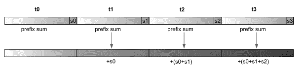

# 前缀和与 SIMD

> 原文：[`en.algorithmica.org/hpc/algorithms/prefix/`](https://en.algorithmica.org/hpc/algorithms/prefix/)

*前缀和*，也称为*累积和*、*包含扫描*或简单地称为*扫描*，是从另一个序列$a_i$生成另一个序列$b_i$的数字序列，使用以下规则：$$ \begin{aligned} b_0 &= a_0 \\ b_1 &= a_0 + a_1 \\ b_2 &= a_0 + a_1 + a_2 \\ &\ldots \end{aligned} $$

换句话说，输出序列的第$k$个元素是输入序列前$k$个元素的和。

前缀和是许多算法中一个非常重要的基本操作，尤其是在并行算法的背景下，其计算量几乎可以完美地与处理器的数量成比例。不幸的是，在单个 CPU 核心上使用 SIMD 并行性来加速它要困难得多，但我们仍然会尝试——并推导出一个比基线标量实现快 2.5 倍的算法。

### [#](https://en.algorithmica.org/hpc/algorithms/prefix/#baseline)基线

对于我们的基线，我们可以直接从 STL 调用`std::partial_sum`，但为了清晰起见，我们将手动实现它。我们创建一个整数数组，然后逐个将前一个元素加到当前元素上：

```cpp
void prefix(int *a, int n) {
    for (int i = 1; i < n; i++)
        a[i] += a[i - 1];
} 
```

看起来我们似乎需要在每次迭代中进行两次读取、一次加法和一次写入，但当然，编译器会优化额外的读取并使用寄存器作为累加器：

```cpp
loop:
    add     edx, DWORD PTR [rax]
    mov     DWORD PTR [rax-4], edx
    add     rax, 4
    cmp     rax, rcx
    jne     loop 
```

在展开循环后，只剩下两条指令：融合的读取-加法和结果的写回。理论上，这些应该以 2 GFLOPS（每个 CPU 周期处理 1 个元素，得益于超标量处理）的速度运行，但由于内存系统必须不断在读取和写入之间切换，实际性能在 1.2 到 1.6 GFLOPS 之间，具体取决于数组大小。

### [#](https://en.algorithmica.org/hpc/algorithms/prefix/#vectorization)向量化

实现并行前缀和算法的一种方法是将数组分成小块，独立地计算它们上的*局部*前缀和，然后在第二次遍历中，我们将每个块中计算出的值通过添加所有先前元素的总和来调整。



这允许并行处理每个块——在计算局部前缀和以及累积阶段——因此你通常将数组分成与处理器数量一样多的块。但由于我们只能使用一个 CPU 核心，并且 SIMD 中的非连续内存访问效果不佳，我们不会这样做。相反，我们将使用与 SIMD 通道大小相等的固定块大小，并在寄存器内计算前缀和。

现在，为了在本地计算这些前缀和，我们将使用另一种并行前缀和算法，它通常效率不高（总工作量为 $O(n \log n)$ 而不是线性），但对于数据已经位于 SIMD 寄存器中的情况来说足够好了。思路是在 $\log n$ 次迭代中执行，在第 $k$ 次迭代中，将 $a_{i - 2^k}$ 添加到所有适用的 $a_i$：

```cpp
for (int l = 0; l < logn; l++)
    // (atomically and in parallel):
    for (int i = (1 << l); i < n; i++)
        a[i] += a[i - (1 << l)]; 
```

我们可以通过归纳法证明这个算法是有效的：如果在第 $k$ 次迭代中每个元素 $a_i$ 都等于原始数组中 $(i - 2^k, i]$ 区间的和，那么在将其添加到 $a_{i - 2^k}$ 后，它将等于 $(i - 2^{k+1}, i]$ 区间的和。经过 $O(\log n)$ 次迭代后，数组将变成其前缀和。

在单指令多数据（SIMD）实现中，我们可以使用置换来将第 $i$ 个元素与第 $(i-2^k)$ 个元素对齐，但它们太慢了。相反，我们将使用 `sll`（“左移位”）指令，它正好做这件事，并且还将不匹配的元素替换为零：

```cpp
typedef __m128i v4i;

v4i prefix(v4i x) {
    // x = 1, 2, 3, 4
    x = _mm_add_epi32(x, _mm_slli_si128(x, 4));
    // x = 1, 2, 3, 4
    //   + 0, 1, 2, 3
    //   = 1, 3, 5, 7
    x = _mm_add_epi32(x, _mm_slli_si128(x, 8));
    // x = 1, 3, 5, 7
    //   + 0, 0, 1, 3
    //   = 1, 3, 6, 10
    return x;
} 
```

不幸的是，这个指令的 256 位版本在两个 128 位通道内独立地执行字节移位，这是 AVX 的典型做法：

```cpp
typedef __m256i v8i;

v8i prefix(v8i x) {
    // x = 1, 2, 3, 4, 5, 6, 7, 8
    x = _mm256_add_epi32(x, _mm256_slli_si256(x, 4));
    x = _mm256_add_epi32(x, _mm256_slli_si256(x, 8));
    x = _mm256_add_epi32(x, _mm256_slli_si256(x, 16)); // <- this does nothing
    // x = 1, 3, 6, 10, 5, 11, 18, 26
    return x;
} 
```

我们仍然可以使用它以两倍的速度计算 4 元素的前缀和，但在累积时将不得不切换到 128 位的 SSE。让我们编写一个方便的函数，从头到尾计算局部前缀和：

```cpp
void prefix(int *p) {
    v8i x = _mm256_load_si256((v8i*) p);
    x = _mm256_add_epi32(x, _mm256_slli_si256(x, 4));
    x = _mm256_add_epi32(x, _mm256_slli_si256(x, 8));
    _mm256_store_si256((v8i*) p, x);
} 
```

现在，对于累积阶段，我们将创建另一个方便的函数，它同样接受 4 元素块的指针以及前缀和的 4 元素向量。这个函数的职责是将这个前缀和向量添加到块中，并更新它，以便可以传递给下一个块（通过在加法之前广播块之前的最后一个元素）：

```cpp
v4i accumulate(int *p, v4i s) {
    v4i d = (v4i) _mm_broadcast_ss((float*) &p[3]);
    v4i x = _mm_load_si128((v4i*) p);
    x = _mm_add_epi32(s, x);
    _mm_store_si128((v4i*) p, x);
    return _mm_add_epi32(s, d);
} 
```

随着 `prefix` 和 `accumulate` 的实现，剩下要做的就是将我们的两遍算法粘合在一起：

```cpp
void prefix(int *a, int n) {
    for (int i = 0; i < n; i += 8)
        prefix(&a[i]);

    v4i s = _mm_setzero_si128();

    for (int i = 4; i < n; i += 4)
        s = accumulate(&a[i], s);
} 
```

该算法已经比标量实现快了略多于两倍，但对于超出 L3 缓存的较大数组来说会变慢——大约是两倍双向 RAM 带宽，因为我们正在读取整个数组两次。


另一个有趣的数据点：如果我们只执行 `prefix` 阶段，性能将是 ~8.1 GFLOPS。`accumulate` 阶段略慢，约为 ~5.8 GFLOPS。合理性检查：总性能应该是 $\frac{1}{ \frac{1}{5.8} + \frac{1}{8.1} } \approx 3.4$。

### [#](https://en.algorithmica.org/hpc/algorithms/prefix/#blocking)分块

因此，对于大型数组，我们有一个内存带宽问题。如果我们将其分成适合缓存的块并分别处理它们，就可以避免从 RAM 中重新检索整个数组。我们只需要传递给下一个块的先前块的求和，因此我们可以设计一个与 `accumulate` 接口类似的 `local_prefix` 函数：

```cpp
const int B = 4096; // <- ideally should be slightly less or equal to the L1 cache

v4i local_prefix(int *a, v4i s) {
    for (int i = 0; i < B; i += 8)
        prefix(&a[i]);

    for (int i = 0; i < B; i += 4)
        s = accumulate(&a[i], s);

    return s;
}

void prefix(int *a, int n) {
    v4i s = _mm_setzero_si128();
    for (int i = 0; i < n; i += B)
        s = local_prefix(a + i, s);
} 
```

（我们必须确保 $N$ 是 $B$ 的倍数，但我们现在将忽略这样的实现细节。）

块版本的性能明显更好，而不仅仅是当数组在 RAM 中时：


与非阻塞实现相比，在 RAM 情况下的加速仅为~1.5，而不是 2。这是因为当我们在第二次迭代缓存块而不是获取下一个块时，内存控制器处于空闲状态——硬件预取器还不够先进，无法检测到这种模式。

### [#](https://en.algorithmica.org/hpc/algorithms/prefix/#continuous-loads)连续加载

解决这种低利用率问题的方法有好几种。最明显的方法是在处理当前块的同时，使用软件预取来显式请求下一个块。

最好在`accumulate`阶段添加预取，因为它比`prefix`慢且内存密集度更低：

```cpp
v4i accumulate(int *p, v4i s) {
    __builtin_prefetch(p + B); // <-- prefetch the next block
    // ...
    return s;
} 
```

对于缓存中的数组，性能略有下降，但对于 RAM 中的数组，接近 2 GFLOPS：


另一种方法是进行两个阶段的*交错*。而不是在大块中分离并交替它们，我们可以同时执行这两个阶段，其中`accumulate`阶段落后于固定数量的迭代——类似于 CPU 流水线：

```cpp
const int B = 64;
//        ^ small sizes cause pipeline stalls
//          large sizes cause cache system inefficiencies

void prefix(int *a, int n) {
    v4i s = _mm_setzero_si128();

    for (int i = 0; i < B; i += 8)
        prefix(&a[i]);

    for (int i = B; i < n; i += 8) {
        prefix(&a[i]);
        s = accumulate(&a[i - B], s);
        s = accumulate(&a[i - B + 4], s);
    }

    for (int i = n - B; i < n; i += 4)
        s = accumulate(&a[i], s);
} 
```

这带来了更多的好处：循环以恒定速度进行，减轻了对内存系统的压力，调度器可以看到两个子例程的指令，这使得它能够更有效地分配指令到执行端口——有点像超线程，但体现在代码中。

由于这些原因，即使是小型数组，性能也会提高：


最后，似乎我们并没有因为内存读端口或解码宽度而成为瓶颈，因此我们可以免费添加预取，这进一步提高了性能：


我们能够实现的总加速在小型数组中为$\frac{4.2}{1.5} \approx 2.8$，在大型数组中为$\frac{2.1}{1.2} \approx 1.75$。

与标量代码相比，对于低精度数据，加速可能更高，因为它基本上限制在每个周期执行一次迭代，无论操作数的大小如何，但与一些其他基于 SIMD 的算法相比，这仍然有点“一般”。这主要是因为 AVX 中没有完整的寄存器字节移位，这会允许`accumulate`阶段以两倍的速度进行，更不用说专门的累加指令了。

### [#](https://en.algorithmica.org/hpc/algorithms/prefix/#other-relevant-work)其他相关工作

您可以阅读[哥伦比亚大学这篇论文](http://www.adms-conf.org/2020-camera-ready/ADMS20_05.pdf)，它专注于多核设置和 AVX-512（[某种程度上](https://www.intel.com/content/www/us/en/docs/intrinsics-guide/index.html#ig_expand=3037,4870,6715,4845,3853,90,7307,5993,2692,6946,6949,5456,6938,5456,1021,3007,514,518,7253,7183,3892,5135,5260,3915,4027,3873,7401,4376,4229,151,2324,2310,2324,591,4075,6130,4875,6385,5259,6385,6250,1395,7253,6452,7492,4669,4669,7253,1039,1029,4669,4707,7253,7242,848,879,848,7251,4275,879,874,849,833,6046,7250,4870,4872,4875,849,849,5144,4875,4787,4787,4787,3016,3018,5227,7359,7335,7392,4787,5259,5230,5230,5223,6438,488,483,6165,6570,6554,289,6792,6554,5230,6385,5260,5259,289,288,3037,3009,590,604,633,5230,5259,6554,6554,5259,6547,6554,3841,5214,5229,5260,5259,7335,5259,519,1029,515,3009,3009,3013,3011,515,6527,652,6527,6554,288&text=_mm512_alignr_epi32&techs=AVX_512)具有快速的 512 位寄存器字节移位）以及[这个 StackOverflow 问题](https://stackoverflow.com/questions/10587598/simd-prefix-sum-on-intel-cpu)以获得更广泛的讨论。

本文所描述的大部分内容已经为人所知。据我所知，我的贡献在于交错技术，这为性能带来了约 20%的提升。可能还有方法可以进一步改进它，但提升不会很大。

在卡内基梅隆大学（CMU）还有这样一位教授，[Guy Blelloch](https://www.cs.cmu.edu/~blelloch/)，他在 20 世纪 90 年代，当[向量处理器](https://en.wikipedia.org/wiki/Vector_processor)仍然存在的时候，[倡导](https://www.cs.cmu.edu/~blelloch/papers/sc90.pdf)了一种专门的求和硬件。求和对于并行应用非常重要，而硬件正变得越来越并行，所以也许在未来，CPU 制造商将重新激活这个想法，使得求和计算稍微容易一些。[← 使用 SIMD 进行 Argmin](https://en.algorithmica.org/hpc/algorithms/argmin/)[矩阵乘法 →](https://en.algorithmica.org/hpc/algorithms/matmul/)
