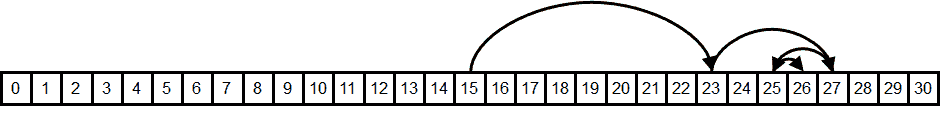
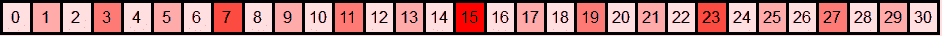
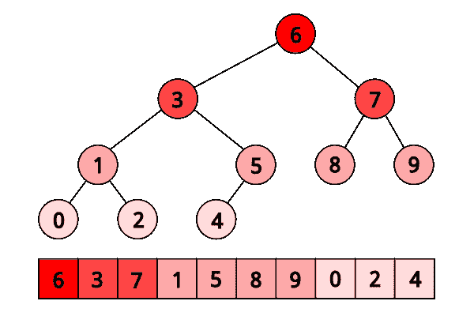

# 二分查找

> 原文：[`en.algorithmica.org/hpc/data-structures/binary-search/`](https://en.algorithmica.org/hpc/data-structures/binary-search/)

虽然提高面向用户的程序的速度是性能工程的目标，但人们对某些数据库中 5-10%的性能提升并不感到兴奋。是的，这就是软件工程师的报酬，但这些类型的优化往往过于复杂和特定于系统，无法轻易推广到其他软件。

相反，性能工程中最迷人的展示是对教科书算法的多重优化：这类算法每个人都熟知，被认为如此简单，以至于根本不会想到去优化它们。这些优化简单且具有教育意义，可以在其他地方广泛应用。而且，它们并不像你想象的那样罕见。

在本节中，我们关注这样一个基本算法——*二分查找*——并实现了其两种变体，这些变体在问题规模不同的情况下，比`std::lower_bound`快达 4 倍，同时代码行数仅为 15 行。

第一个算法通过移除分支来实现这一点，第二个算法还优化了内存布局以实现更好的缓存系统性能。从技术上讲，这使其不能作为`std::lower_bound`的直接替代品，因为它需要在开始回答查询之前对数组元素进行排列——但我无法回忆起很多你获得了排序数组但无法承担线性时间预处理成本的场景。

常规免责声明：CPU 是[Zen 2](https://www.7-cpu.com/cpu/Zen2.html)，RAM 是 DDR4-2666，我们将默认使用 Clang 10 编译器。你的机器上的性能可能会有所不同，所以我强烈建议你自己去[测试它](https://godbolt.org/z/14rd5Pnve)。

## [#](https://en.algorithmica.org/hpc/data-structures/binary-search/#binary-search)二分查找

这里是任何计算机科学入门教科书中都可以找到的搜索排序数组`t`中第一个不小于`x`的元素的常规方法：

```cpp
int lower_bound(int x) {  int l = 0, r = n - 1; while (l < r) { int m = (l + r) / 2; if (t[m] >= x) r = m; else l = m + 1; } return t[l]; } 
```

找到搜索范围的中点元素，将其与`x`比较，将范围缩小一半。其简单性令人赞叹。

`std::lower_bound`采用类似的方法，但它需要更通用以支持具有非随机访问迭代器的容器，因此它使用搜索区间的第一个元素和大小，而不是其两个端点。为此，来自[Clang](https://github.com/llvm-mirror/libcxx/blob/78d6a7767ed57b50122a161b91f59f19c9bd0d19/include/algorithm#L4169)和[GCC](https://github.com/gcc-mirror/gcc/blob/d9375e490072d1aae73a93949aa158fcd2a27018/libstdc%2B%2B-v3/include/bits/stl_algobase.h#L1023)的实现都使用了这种元编程怪物：

```cpp
template <class _Compare, class _ForwardIterator, class _Tp> _LIBCPP_CONSTEXPR_AFTER_CXX17 _ForwardIterator __lower_bound(_ForwardIterator __first, _ForwardIterator __last, const _Tp& __value_, _Compare __comp) {  typedef typename iterator_traits<_ForwardIterator>::difference_type difference_type; difference_type __len = _VSTD::distance(__first, __last); while (__len != 0) { difference_type __l2 = _VSTD::__half_positive(__len); _ForwardIterator __m = __first; _VSTD::advance(__m, __l2); if (__comp(*__m, __value_)) { __first = ++__m; __len -= __l2 + 1; } else __len = __l2; } return __first; } 
```

如果编译器成功移除了抽象，它编译出的机器代码大致相同，并且平均延迟也大致相同，这预期随着数组大小的增加而增长：


由于大多数人不会手动实现二分查找，我们将使用 Clang 中的`std::lower_bound`作为基准。

### [#](https://en.algorithmica.org/hpc/data-structures/binary-search/#the-bottleneck)瓶颈

在跳到优化实现之前，让我们简要讨论一下为什么二分查找一开始就慢。

如果你使用 perf 运行`std::lower_bound`，你会看到它的大部分时间都花在一条条件跳转指令上：

```cpp
 │35:   mov    %rax,%rdx 0.52 │      sar    %rdx 0.33 │      lea    (%rsi,%rdx,4),%rcx 4.30 │      cmp    (%rcx),%edi 65.39 │    ↓ jle    b0 0.07 │      sub    %rdx,%rax 9.32 │      lea    0x4(%rcx),%rsi 0.06 │      dec    %rax 1.37 │      test   %rax,%rax 1.11 │    ↑ jg     35 
```

这种 pipeline stall 阻止了搜索的进行，它主要是由两个因素引起的：

+   我们遭受了*控制冒险*，因为我们有一个无法预测的分支（查询和键是独立随机抽取的），处理器必须暂停 10-15 个周期来清空流水线和在每个分支预测错误时重新填充。

+   我们遭受了*数据冒险*，因为我们必须等待前面的比较完成，而这反过来又等待其操作数之一从内存中取出——这可能需要 0 到 300 个周期，具体取决于它的位置。

现在，让我们逐一尝试消除这些障碍。

## [#](https://en.algorithmica.org/hpc/data-structures/binary-search/#removing-branches)移除分支

我们可以用 predication 来替换分支。为了使任务更容易，我们可以采用 STL 方法，并使用搜索间隔的第一个元素和大小（而不是其第一个和最后一个元素）重写循环：

```cpp
int lower_bound(int x) {  int *base = t, len = n; while (len > 1) { int half = len / 2; if (base[half - 1] < x) { base += half; len = len - half; } else { len = half; } } return *base; } 
```

注意，在每次迭代中，`len`实际上只是减半，然后根据比较结果进行向下取整或向上取整。这种条件更新看起来是不必要的；为了避免它，我们可以说它总是向上取整：

```cpp
int lower_bound(int x) {  int *base = t, len = n; while (len > 1) { int half = len / 2; if (base[half - 1] < x) base += half; len -= half; // = ceil(len / 2) } return *base; } 
```

这样，我们只需要在每个迭代中更新搜索间隔的第一个元素，并使用条件移动将其大小减半：

```cpp
int lower_bound(int x) {  int *base = t, len = n; while (len > 1) { int half = len / 2; base += (base[half - 1] < x) * half; // will be replaced with a "cmov" len -= half; } return *base; } 
```

注意，这个循环并不总是等同于标准的二分查找。因为它总是向上取整搜索间隔的大小，所以它访问了稍微不同的元素，并且可能比所需的比较多一次。除了简化每次迭代的计算外，它还使得在数组大小恒定时迭代次数保持不变，从而完全消除了分支预测错误。

正如典型的 predication 一样，这个技巧对编译器优化非常脆弱——取决于编译器和函数的调用方式，它可能仍然留下分支或生成次优代码。它在 Clang 10 上运行良好，在小数组上提供了 2.5-3 倍的性能提升：


一个有趣的细节是，它在大型数组上的性能更差。这似乎很奇怪：总延迟主要由 RAM 延迟主导，而且它做的内存访问与标准二分搜索大致相同，所以它应该是大致相同，甚至稍微好一些。

你需要问的真正问题不是为什么无分支实现更差，而是为什么分支版本更好。这是因为当你有分支时，CPU 可以推测其中一个分支，并在确认它是正确的之前就开始获取左边的或右边的键——这实际上相当于隐式的预取。

对于无分支实现，这种情况不会发生，因为`cmov`被视为其他任何指令，分支预测器也不会试图窥视其操作数来预测未来。为了补偿这一点，我们可以通过显式请求左右子键来在软件中预取数据：

```cpp
int lower_bound(int x) {  int *base = t, len = n; while (len > 1) { int half = len / 2; len -= half; __builtin_prefetch(&base[len / 2 - 1]); __builtin_prefetch(&base[half + len / 2 - 1]); base += (base[half - 1] < x) * half; } return *base; } 
```

使用预取，在大数组上的性能大致相同：


随着分支版本也预取“孙子”、“曾孙”等，图仍然以更快的速度增长——尽管每次新的推测性读取的有用性随着预测越来越不可能正确而呈指数减少。

在无分支版本中，我们也可以提前获取超过一层的数据，但所需的获取次数也会呈指数增长。相反，我们将尝试不同的方法来优化内存操作。

## [#](https://en.algorithmica.org/hpc/data-structures/binary-search/#optimizing-the-layout)优化布局

在二分搜索过程中我们执行的内存请求形成了一种非常特定的访问模式：



每次请求中的元素被缓存的几率有多大？它们的数据局部性如何？

+   *空间局部性*似乎对于最后 3 到 4 次请求来说是可行的，这些请求可能位于相同的缓存行上——但所有之前的请求都需要巨大的内存跳跃。

+   *时间局部性*似乎对于前十二次左右的请求来说是可行的——这个长度的不同比较序列并不多，所以我们将反复比较相同的中间元素，这些元素很可能是缓存的。

为了说明第二种类型的缓存共享有多么重要，让我们尝试在搜索区间的元素中随机选择我们将要比较的元素，而不是中间的元素：

```cpp
int lower_bound(int x) {  int l = 0, r = n - 1; while (l < r) { int m = l + rand() % (r - l); if (t[m] >= x) r = m; else l = m + 1; } return t[l]; } 
```

理论上，这种随机二分搜索预计要比正常搜索多进行 30-40%的比较，但在实际计算机上，在大数组上的运行时间大约是 6 倍：


这并不是仅仅因为`rand()`调用速度慢。你可以在 L2-L3 边界清楚地看到这一点，在那里内存延迟超过了随机数生成和取模。性能下降是因为所有检索到的元素不太可能被缓存，而不仅仅是它们的一些小后缀。

另一个潜在的负面影响是缓存关联性。如果数组大小是某个大二的幂的倍数，那么这些“热”元素的索引也将是某些大二的幂的倍数，并将映射到相同的缓存行，相互踢出。例如，在大小为$2^{20}$的数组上进行二分搜索大约需要每个查询 360ns，而在大小为$(2^{20} + 123)$的数组上进行搜索大约需要 300ns——相差 20%。有[方法](https://en.wikipedia.org/wiki/Fibonacci_search_technique)可以解决这个问题，但为了不分散对更紧迫问题的注意力，我们只是忽略它：我们使用的所有数组大小都是整数$k$的$\lfloor 1.17^k \rfloor$的形式，这样任何缓存副作用都极不可能发生。

我们内存布局的真正问题是它没有最有效地利用时间局部性，因为它将热元素和冷元素放在一起。例如，我们可能将请求的第一个元素$\lfloor n/2 \rfloor$存储在与$\lfloor n/2 \rfloor + 1$相同的缓存行中，而后者我们几乎从不请求。

这里是可视化 31 元素数组预期比较频率的热图：



因此，理想情况下，我们希望有一个内存布局，其中热元素与热元素分组，冷元素与冷元素分组。我们可以通过重新编号数组以更缓存友好的方式来实现这一点。我们将使用的编号实际上有半个世纪的历史，而且你很可能已经知道了。

### [Eytzinger 布局](https://en.algorithmica.org/hpc/data-structures/binary-search/#eytzinger-layout)

**米夏埃尔·艾茨金格**是一位 16 世纪的奥地利贵族，因其在家谱研究方面的作品而闻名，尤其是他提出的被称为*ahnentafel*（德语意为“祖先表”）的祖先编号系统。

在那个时代，血统非常重要，但写下这些数据是昂贵的。*Ahnentafel*允许紧凑地显示一个人的家谱，而不会通过绘制图表浪费额外的空间。

它列出了一个固定顺序中的人的直接祖先。首先，这个人自己被列为编号 1，然后，递归地，对于每个编号为$k$的人，他们的父亲被列为$2k$，他们的母亲被列为$(2k+1)$。

这里是[保罗一世](https://en.wikipedia.org/wiki/Paul_I_of_Russia)，彼得大帝的曾孙的例子：

1.  保罗一世

1.  彼得三世（保罗的父亲）

1.  [叶卡捷琳娜二世](https://en.wikipedia.org/wiki/Catherine_the_Great)（保罗的母亲）

1.  查尔斯·弗雷德里克（彼得的父亲，保罗的父亲的祖父）

1.  安娜·彼得罗夫娜（彼得的母亲，保罗的父亲的祖母）

1.  克里斯蒂安·奥古斯特（凯瑟琳的父亲，保罗的母亲的祖父）

1.  约翰娜·伊丽莎白（凯瑟琳的母亲，保罗的母亲的祖母）

除了紧凑之外，它还有一些很好的特性，比如所有偶数编号的人都是男性，所有奇数编号的（可能除了 1）都是女性。一个人也可以只通过知道其后代的性别来找到特定祖先的编号。例如，彼得大帝的血脉是保罗一世 → 彼得三世 → 安娜·彼得罗夫娜 → 彼得大帝，因此他的编号应该是 $((1 \times 2) \times 2 + 1) \times 2 = 10$。

**在计算机科学中**，这种枚举已被广泛用于堆、线段树和其他二叉树结构的隐式（无指针）实现——在这里，它存储的是底层数组项而不是名称。

这里是如何将这种布局应用于二分搜索的：



注意到树略微不平衡（因为最后一层是连续的）

在这种布局中搜索时，我们只需从数组的第一个元素开始，然后在每次迭代中根据比较结果跳转到 `2k` 或 `(2k + 1)`。


你可以立即看出它的时空局部性更好（实际上，理论上是最优的），因为靠近根的元素更接近数组的开始部分，因此更有可能从缓存中获取。


另一种看待它的方法是，我们将每个偶数索引的元素写入新数组的末尾，然后写入剩余元素中每个偶数索引的元素，紧随其后，依此类推，直到我们将根作为第一个元素放置。

### [构造](https://en.algorithmica.org/hpc/data-structures/binary-search/#construction)

要构建 Eytzinger 数组，我们可以进行这种偶数奇数 过滤 $O(\log n)$ 次——这可能是最快的方法——但为了简洁起见，我们将通过遍历原始搜索树来构建它。

```cpp
int a[n], t[n + 1]; // the original sorted array and the eytzinger array we build //              ^ we need one element more because of one-based indexing  void eytzinger(int k = 1) {  static int i = 0; // <- careful running it on multiple arrays if (k <= n) { eytzinger(2 * k); t[k] = a[i++]; eytzinger(2 * k + 1); } } 
```

这个函数接受当前节点编号 `k`，递归地写出搜索区间中间左侧的所有元素，然后写出我们要比较的当前元素，最后递归地写出右侧的所有元素。这看起来有点复杂，但为了让你相信它有效，你只需要三个观察点：

+   对于每个 `k` 从 `1` 到 `n`，它只会在 `if` 语句体中写入 `n` 个元素一次。

+   它在每次增加 `i` 指针时，按顺序从原始数组中写入连续元素。

+   当我们写入节点 `k` 的元素时，我们已经在它的左侧写入了所有元素（正好是 `i`）。

尽管是递归的，但实际上它非常快，因为所有的内存读取都是顺序的，而内存写入只发生在 $O(\log n)$ 个不同的内存块中。然而，维护排列在逻辑上和计算上都更难，因为向有序数组中添加一个元素只需要将其元素的一个后缀向右移动一个位置，而 Eytzinger 数组实际上需要从头开始重建。

注意，这种遍历和由此产生的排列并不完全等同于传统的二分搜索“树”：例如，左子树可能比右子树大——最多大两倍——但这并不重要，因为两种方法都导致了相同的 $\lceil \log_2 n \rceil$ 树深度。

还要注意，Eytzinger 数组是从 1 开始计数的——这将在后续的性能中变得很重要。你可以将你想要在不存在下界的情况下返回的值放在零元素中（类似于 `std::lower_bound` 的 `a.end()`）。

### [#](https://en.algorithmica.org/hpc/data-structures/binary-search/#search-implementation)搜索实现

我们现在可以使用索引来下降这个数组：我们只需从 $k=1$ 开始，如果需要向左移动，则执行 $k := 2k$，如果需要向右移动，则执行 $k := 2k + 1$。我们甚至不再需要存储和重新计算搜索边界。这种简单性还让我们避免了分支：

```cpp
int k = 1; while (k <= n)  k = 2 * k + (t[k] < x); 
```

唯一的问题是当我们需要恢复结果元素的索引时，因为 $k$ 并不直接指向它。考虑这个例子（其对应的树如上所示）：

```cpp
    array:  0 1 2 3 4 5 6 7 8 9                            
eytzinger:  6 3 7 1 5 8 9 0 2 4                            
1st range:  ------------?------  k := 2*k     = 2   (6 ≥ 3)
2nd range:  ------?------        k := 2*k     = 4   (3 ≥ 3)
3rd range:  --?----              k := 2*k + 1 = 9   (1 < 3)
4th range:      ?--              k := 2*k + 1 = 19  (2 < 3)
5th range:        !                                        

```

在这里，我们查询数组 $[0, …, 9]$ 以找到 $x=3$ 的下界。我们将其与 $6$、$3$、$1$ 和 $2$ 进行比较，向左左右右移动，最终得到 $k = 19$，这甚至不是一个有效的数组索引。

这个技巧在于注意到，除非答案是数组的最后一个元素，否则我们会在某个时刻将 $x$ 与它进行比较，在我们得知它不小于 $x$ 之后，我们向左移动一次，然后继续向右移动直到我们到达一个叶子节点（因为我们只会将 $x$ 与较小的元素进行比较）。因此，为了恢复答案，我们只需要“取消”一些向右的移动，然后再加上一次。

这可以通过观察 $k$ 的二进制表示中的右转被记录为 1 位来优雅地完成，所以我们只需要找到二进制表示中的尾随 1 的数量，并将 $k$ 向右移动正好那么多位加一。为此，我们可以反转这个数（`~k`）并调用“找到第一个设置”指令：

```cpp
int lower_bound(int x) {  int k = 1; while (k <= n) k = 2 * k + (t[k] < x); k >>= __builtin_ffs(~k); return t[k]; } 
```

我们运行它，嗯，看起来并不那么好：


在较小的数组上，延迟与无分支二分搜索实现相当——这并不令人惊讶，因为它只是两行代码——但它开始得要早得多。原因是 Eytzinger 二分搜索没有获得空间局部性的优势：我们比较的最后 3-4 个元素不再位于同一缓存行中，我们必须单独获取它们。

如果你更深入地思考，你可能会反对说，改进的时间局部性应该可以补偿这一点。在此之前，我们只使用了大约 $\frac{1}{16}$ 的缓存行来存储一个热元素，而现在我们使用了全部，所以有效缓存大小增加了 16 倍，这使得我们可以覆盖 $\log_2 16 = 4$ 个更多的首次请求。

但如果你更深入地思考，你会理解这还不足以补偿。缓存其他 15 个元素并不是完全没有用，而且，硬件预取器可以预取我们请求的相邻缓存行。如果这是我们最后的请求之一，我们将要读取的其余部分可能都是缓存元素。所以实际上，最后 6-7 次访问很可能是缓存的，而不是 3-4 次。

看起来我们切换到这种布局是一个整体上的愚蠢行为，但有一种方法可以使它变得有价值。

### [#](https://en.algorithmica.org/hpc/data-structures/binary-search/#prefetching)预取

为了隐藏内存延迟，我们可以使用类似于我们为无分支二分搜索所做的方式的软件预取。但不是为左子节点和右子节点发出两个单独的预取指令，我们可以注意到它们在 Eytzinger 数组中是邻居：一个的索引是 $2 k$，另一个是 $(2k + 1)$，所以它们很可能位于同一缓存行中，我们可以只用一个指令。

这个观察结果也适用于节点 $k$ 的子节点——它们也是按顺序存储的：

```cpp
2 * 2 * k           = 4 * k
2 * 2 * k + 1       = 4 * k + 1
2 * (2 * k + 1)     = 4 * k + 2
2 * (2 * k + 1) + 1 = 4 * k + 3 
```

它们的缓存行也可以用一个指令来获取。有趣……如果我们继续这样做，而不是获取直接子节点，而是尽可能多地预取一个缓存行中可以容纳的后代节点，那会是什么样子？这将会有 $\frac{64}{4} = 16$ 个元素，我们的曾孙节点，索引从 $16k$ 到 $(16k + 15)$。

现在，如果我们只预取这 16 个元素中的一个，我们可能只会得到一些而不是全部，因为它们可能跨越缓存行边界。我们可以预取第一个*和*最后一个元素，但要通过一个内存请求完成，我们需要注意到第一个元素索引 $16k$ 可以被 $16$ 整除，所以它的内存地址将是数组的基本地址加上一个可以被 $16 \cdot 4 = 64$ 整除的值，这是缓存行的大小。如果数组从缓存行开始，那么这 16 个曾孙元素将保证位于单个缓存行中，这正是我们所需要的。

因此，我们只需要对齐数组：

```cpp
t = (int*) std::aligned_alloc(64, 4 * (n + 1)); 
```

然后在每次迭代中预取索引为 $16 k$ 的元素：

```cpp
int lower_bound(int x) {  int k = 1; while (k <= n) { __builtin_prefetch(t + k * 16); k = 2 * k + (t[k] < x); } k >>= __builtin_ffs(~k); return t[k]; } 
```

在大型数组上的性能比之前版本提高了 3-4 倍，比`std::lower_bound`提高了约 2 倍。仅仅增加两行代码就不错了：


实际上，我们在这里做的是通过预取四步并重叠内存请求来隐藏延迟。理论上，如果计算不重要，我们预计会有约 4 倍的速度提升，但现实中，我们得到的是一种更为适度的速度提升。

我们还可以尝试预取超过四步，而且我们甚至不必使用超过一个预取指令：我们可以尝试只请求第一行缓存，并依赖硬件来预取其邻居。这个技巧可能或可能不会提高实际性能——取决于硬件：

```cpp
__builtin_prefetch(t + k * 32); 
```

此外，请注意，最后几个预取请求实际上并不需要，实际上，它们甚至可能超出程序分配的内存区域。在大多数现代 CPU 上，无效的预取指令会被转换为空操作，所以这不是问题，但在某些平台上，这可能会导致速度降低，因此，例如，将最后约 4 次迭代从循环中分离出来以尝试移除它们可能是有意义的。

这种预取技术使我们能够读取最多四个元素，但这并不是免费的——我们实际上是在用额外的内存带宽来换取减少的延迟。如果你同时在不同的硬件线程上运行多个实例，或者在后台运行任何其他内存密集型计算，这将显著影响基准性能。

但我们可以做得更好。我们不必一次预取四行缓存，我们可以预取更少的四倍缓存行。在下一节中，我们将探讨这种方法。

### [移除最后一个分支](https://en.algorithmica.org/hpc/data-structures/binary-search/#removing-the-last-branch)

只需一个收尾工作：你注意到 Eytzinger 搜索的颠簸吗？这并不是随机噪声——让我们放大看看：


对于形式为$1.5 \cdot 2^k$的数组大小，延迟大约高 10ns。这些是从循环本身预测错误的分支——确切地说，是最后一个分支。当数组大小远非 2 的幂时，很难预测循环将执行$\lfloor \log_2 n \rfloor$次或$\lfloor \log_2 n \rfloor + 1$次迭代，所以我们有 50%的几率正好预测错误一次分支。

一种解决方法是使用无穷大填充数组到最接近的 2 的幂，但这会浪费内存。相反，我们通过始终执行一个固定的最小迭代次数，然后使用预测来可选地使最后一个比较与某个虚拟元素——这保证小于$x$，因此其比较将被取消：

```cpp
t[0] = -1; // an element that is less than x iters = std::__lg(n + 1);   int lower_bound(int x) {  int k = 1;   for (int i = 0; i < iters; i++) k = 2 * k + (t[k] < x);   int *loc = (k <= n ? t + k : t); k = 2 * k + (*loc < x);   k >>= __builtin_ffs(~k);   return t[k]; } 
```

图现在变得平滑了，在小数组上，它比无分支的二分查找慢了仅仅几个周期：


有趣的是，现在 GCC 无法用 `cmov` 替换分支，但 Clang 不行。1-1。

### [附录：随机二分查找](https://en.algorithmica.org/hpc/data-structures/binary-search/#appendix-random-binary-search)

顺便说一下，找到随机二分查找的确切期望比较次数本身就是一个相当有趣的数学问题。先自己试试解决它！

计算它的 *算法* 方法是通过动态规划。如果我们用 $f_n$ 表示在大小为 $n$ 的搜索区间中找到随机下界的期望比较次数，它可以通过考虑所有可能的 $(n - 1)$ 个分割来从之前的 $f_n$ 计算得出：

$$ f_n = \sum_{l = 1}^{n - 1} \frac{1}{n-1} \cdot \left( f_l \cdot \frac{l}{n} + f_{n - l} \cdot \frac{n - l}{n} \right) + 1 $$ 直接应用这个公式会给我们一个 $O(n²)$ 的算法，但我们可以通过重新排列求和来优化它：$$ \begin{aligned} f_n &= \sum_{i = 1}^{n - 1} \frac{ f_i \cdot i + f_{n - i} \cdot (n - i) }{ n \cdot (n - 1) } + 1 \\ &= \frac{2}{n \cdot (n - 1)} \cdot \sum_{i = 1}^{n - 1} f_i \cdot i + 1 \end{aligned} $$ 要更新 $f_n$，我们只需要计算所有 $i < n$ 的 $f_i \cdot i$ 的和。为了做到这一点，让我们引入两个新变量：$$ g_n = f_n \cdot n, \;\; s_n = \sum_{i=1}^{n} g_n $$ 现在它们可以按顺序计算如下：$$ \begin{aligned} g_n &= f_n \cdot n = \frac{2}{n-1} \cdot \sum_{i = 1}^{n - 1} g_i + n = \frac{2}{n - 1} \cdot s_{n - 1} + n \\ s_n &= s_{n - 1} + g_n \end{aligned} $$ 这样我们得到一个 $O(n)$ 的算法，但我们还可以做得更好。让我们将 $g_n$ 代入 $s_n$ 的更新公式中：$$ \begin{aligned} s_n &= s_{n - 1} + \frac{2}{n - 1} \cdot s_{n - 1} + n \\ &= (1 + \frac{2}{n - 1}) \cdot s_{n - 1} + n \\ &= \frac{n + 1}{n - 1} \cdot s_{n - 1} + n \end{aligned} $$

下一个技巧更复杂。我们这样定义 $r_n$：$$ \begin{aligned} r_n &= \frac{s_n}{n} \\ &= \frac{1}{n} \cdot \left(\frac{n + 1}{n - 1} \cdot s_{n - 1} + n\right) \\ &= \frac{n + 1}{n} \cdot \frac{s_{n - 1}}{n - 1} + 1 \\ &= \left(1 + \frac{1}{n}\right) \cdot r_{n - 1} + 1 \end{aligned} $$ 我们可以将其代入之前得到的 $g_n$ 的公式：$$ g_n = \frac{2}{n - 1} \cdot s_{n - 1} + n = 2 \cdot r_{n - 1} + n $$ 回忆一下 $g_n = f_n \cdot n$，我们可以用 $f_n$ 来表示 $r_{n - 1}$：$$ f_n \cdot n = 2 \cdot r_{n - 1} + n \implies r_{n - 1} = \frac{(f_n - 1) \cdot n}{2} $$ 最后一步。我们刚刚用 $r_{n - 1}$ 和 $r_{n - 1}$ 通过 $f_n$ 表达了 $r_n$。这使得我们可以用 $f_n$ 来表示 $f_{n + 1}$：$$ \begin{aligned} &&\quad r_n &= \left(1 + \frac{1}{n}\right) \cdot r_{n - 1} + 1 \\ &\Rightarrow & \frac{(f_{n + 1} - 1) \cdot (n + 1)}{2} &= \left(1 + \frac{1}{n}\right) \cdot \frac{(f_n - 1) \cdot n}{2} + 1 \\ &&&= \frac{n + 1}{2} \cdot (f_n - 1) + 1 \\ &\Rightarrow & (f_{n + 1} - 1) &= (f_{n} - 1) + \frac{2}{n + 1} \\ &\Rightarrow &f_{n + 1} &= f_{n} + \frac{2}{n + 1} \\ &\Rightarrow &f_{n} &= f_{n - 1} + \frac{2}{n} \\ &\Rightarrow &f_{n} &= \sum_{k = 2}^{n} \frac{2}{k} \end{aligned} $$

最后的表达式是调和级数的两倍，众所周知，当 $n \to \infty$ 时，它可以近似 $\ln n$。因此，随机二分搜索将比正常二分搜索多进行 $\frac{2 \ln n}{\log_2 n} = 2 \ln 2 \approx 1.386$ 次比较。

### [#](https://en.algorithmica.org/hpc/data-structures/binary-search/#acknowledgements)致谢

本文大致基于 Paul-Virak Khuong 和 Pat Morin 的论文“[基于比较的搜索的数组布局](https://arxiv.org/pdf/1509.05053.pdf)”。这篇论文有 46 页，详细讨论了这些以及其他许多（不太成功）的方法。我强烈推荐也看看它——这是我最喜欢的性能工程论文之一。

感谢 Marshall Lochbaum 为随机二分搜索提供了[证明](https://github.com/algorithmica-org/algorithmica/issues/57)。我自己是不可能做到的。

我很久以前也从某个博客上偷来了这些可爱的布局可视化，但我已经不记得博客的名字和它们有什么许可，反向图像搜索也不再能找到它们了。如果你不告我，谢谢你，无论你是谁！[← ../数据结构案例研究](https://en.algorithmica.org/hpc/data-structures/)[静态 B-Trees →](https://en.algorithmica.org/hpc/data-structures/s-tree/)
