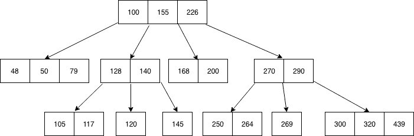
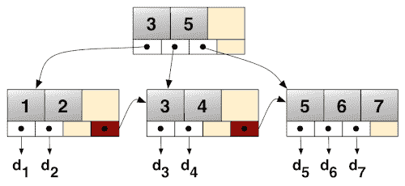

# 静态 B 树

> 原文：[`en.algorithmica.org/hpc/data-structures/s-tree/`](https://en.algorithmica.org/hpc/data-structures/s-tree/)

本节是上一节的后续，其中我们通过移除分支和改进内存布局来优化二分搜索。在这里，我们也将搜索排序数组，但这次我们不仅限于一次只获取和比较一个元素。

在本节中，我们将我们为二分搜索开发的技巧推广到*静态 B 树*，并使用 SIMD 指令进一步加速它们。特别是，我们开发了两种新的隐式数据结构：

+   第一种是基于 B 树的内存布局，并且，根据数组大小，它比`std::lower_bound`快 8 倍，同时使用与数组相同的空间，并且只需要对其元素进行排列。

+   第二种是基于 B+树的内存布局，并且比`std::lower_bound`快 15 倍，同时只使用 6-7%更多的内存——或者如果我们能保持原始排序数组，则是 6-7%的内存。

为了将它们与 B 树区分开来——具有指针、每个节点数百到数千个键和其中空位的结构——我们将分别使用*S-tree*和*S+ tree*来指代这些特定的内存布局^(1)。

根据我所知，这比现有的[方法](http://kaldewey.com/pubs/FAST__SIGMOD10.pdf)有显著的改进。和之前一样，我们使用 Clang 10 针对 Zen 2 CPU，但性能提升应该大约可以转移到大多数其他平台，包括基于 Arm 的芯片。如果你想在自己的机器上测试它，请使用[这个单源基准](https://github.com/sslotin/amh-code/blob/main/binsearch/standalone.cc)。

这是一篇长文章，因为它还作为教科书案例研究，我们将为了教学目的逐步改进算法。如果你已经是专家，并且能够舒适地阅读带有很少或没有上下文的内联代码，你可以直接跳到最终实现。

## [#](https://en.algorithmica.org/hpc/data-structures/s-tree/#b-tree-layout)B-树布局

B 树通过允许节点有超过两个子节点来推广二叉搜索树的概念。一个阶数为$k$的 B 树的节点可以包含最多$B = (k - 1)$个按键，这些键按顺序存储，并且最多有$k$个指向子节点的指针。每个子节点$i$满足以下性质：其子树中的所有键都在父节点的键$(i - 1)$和$i$之间（如果存在）。



四阶 B 树

这种方法的主要优势是它将树的高度减少了 $\frac{\log_2 n}{\log_k n} = \frac{\log k}{\log 2} = \log_2 k$ 倍，同时检索每个节点所需的时间大致相同——只要它适合单个内存块。

B 树主要是为了管理磁盘上的数据库而开发的，在那里随机获取一个字节的延迟与读取下一个 1MB 数据的顺序时间相当。对于我们的用例，我们将使用 $B = 16$ 个元素的块大小——或者 $64$ 字节，即缓存行的大小——这使得与二分搜索相比，树的高度和每次查询的缓存行检索总数减少了 $\log_2 17 \approx 4$ 倍。

### [#](https://en.algorithmica.org/hpc/data-structures/s-tree/#implicit-b-tree)隐式 B 树

在 B 树节点中存储和检索指针会浪费宝贵的缓存空间并降低性能，但它们对于在插入和删除时更改树结构是必不可少的。但是，当没有更新并且树的结构是*静态的*时，我们可以去掉指针，这使得结构*隐式*。

实现这一目标的一种方法是将艾特辛格编号推广到 $(B + 1)$-叉树：

+   根节点编号为 $0$。

+   节点 $k$ 有 $(B + 1)$ 个子节点，编号为 $\{k \cdot (B + 1) + i + 1\}$，其中 $i \in [0, B]$。

这样，我们只能通过分配一个大的二维数组键和依赖索引算术来定位树中的子节点，从而只使用 $O(1)$ 的额外内存：

```cpp
const int B = 16;

int nblocks = (n + B - 1) / B;
int btree[nblocks][B];

int go(int k, int i) { return k * (B + 1) + i + 1; } 
```

这种编号自动使 B 树在高度为 $\Theta(\log_{B + 1} n)$ 的情况下变得完整或几乎完整。如果初始数组的长度不是 $B$ 的倍数，则最后一个块用其数据类型中的最大值填充。

### [#](https://en.algorithmica.org/hpc/data-structures/s-tree/#construction)构建

我们可以像构建 Eytzinger 数组一样构建 B 树——通过遍历搜索树：

```cpp
void build(int k = 0) {
    static int t = 0;
    if (k < nblocks) {
        for (int i = 0; i < B; i++) {
            build(go(k, i));
            btree[k][i] = (t < n ? a[t++] : INT_MAX);
        }
        build(go(k, B));
    }
} 
```

这是正确的，因为初始数组中的每个值都将被复制到结果数组中的唯一位置，并且由于每次进入子节点时 $k$ 都乘以 $(B + 1)$，因此树的高度是 $\Theta(\log_{B+1} n)$。

注意，这种编号会导致轻微的不平衡：左边的子节点可能有更大的子树，尽管这只对 $O(\log_{B+1} n)$ 个父节点成立。

### [#](https://en.algorithmica.org/hpc/data-structures/s-tree/#searches)搜索

要找到下界，我们需要在一个节点中获取 $B$ 个键，找到第一个不小于 $x$ 的键 $a_i$，下降到第 $i$ 个子节点——然后继续，直到我们达到一个叶节点。如何找到第一个键有一些变化。例如，我们可以进行一个小型的内部二分搜索，使其进行 $O(\log B)$ 次迭代，或者可能只是按顺序比较每个键，在 $O(B)$ 时间内找到局部下界，希望早点退出循环。

但我们不会这样做——因为我们可以使用 SIMD。它与分支不兼容，所以本质上我们想要做的是比较所有 $B$ 个元素，无论是否，从这些比较中计算一个位掩码，然后使用`ffs`指令找到对应于第一个非较小元素的位：

```cpp
int mask = (1 << B);

for (int i = 0; i < B; i++)
    mask |= (btree[k][i] >= x) << i;

int i = __builtin_ffs(mask) - 1;
// now i is the number of the correct child node 
```

不幸的是，编译器还不够智能，还不能自动向量化此代码，因此我们必须手动优化。在 AVX2 中，我们可以加载 8 个元素，将它们与搜索键进行比较，生成向量掩码，然后使用`movemask`从中提取标量掩码。以下是一个简化的示例，说明我们想要做什么：

```cpp
       y = 4        17       65       103     
       x = 42       42       42       42      
   y ≥ x = 00000000 00000000 11111111 11111111
           ├┬┬┬─────┴────────┴────────┘       
movemask = 0011                               
           ┌─┘                                
     ffs = 3                                  

```

由于我们一次只能处理 8 个元素（我们块/缓存行大小的一半），我们必须将元素分成两组，然后合并两个 8 位掩码。为此，将条件`x > y`进行交换并计算反转掩码会稍微容易一些：

```cpp
typedef __m256i reg;

int cmp(reg x_vec, int* y_ptr) {
    reg y_vec = _mm256_load_si256((reg*) y_ptr); // load 8 sorted elements
    reg mask = _mm256_cmpgt_epi32(x_vec, y_vec); // compare against the key
    return _mm256_movemask_ps((__m256) mask);    // extract the 8-bit mask
} 
```

现在，为了处理整个块，我们需要调用它两次并合并掩码：

```cpp
int mask = ~(
    cmp(x, &btree[k][0]) +
    (cmp(x, &btree[k][8]) << 8)
); 
```

要向下遍历树，我们使用`ffs`在该掩码上获取正确的子节点编号，然后只需调用我们之前定义的`go`函数：

```cpp
int i = __builtin_ffs(mask) - 1;
k = go(k, i); 
```

要最终返回结果，我们只想从最后访问的节点中获取`btree[k][i]`，但问题是局部下界有时不存在（$i \ge B$），因为 $x$ 恰好大于节点中的所有键。理论上，我们可以做与 Eytzinger 二分搜索相同的事情，并在计算最后一个索引后恢复正确的元素，但这次我们没有一个很好的位技巧，而必须进行大量的除以 17 来计算它，这将很慢，几乎肯定不值得。

相反，我们只需记住并返回我们在下降树时遇到的最后一个局部下界：

```cpp
int lower_bound(int _x) {
    int k = 0, res = INT_MAX;
    reg x = _mm256_set1_epi32(_x);
    while (k < nblocks) {
        int mask = ~(
            cmp(x, &btree[k][0]) +
            (cmp(x, &btree[k][8]) << 8)
        );
        int i = __builtin_ffs(mask) - 1;
        if (i < B)
            res = btree[k][i];
        k = go(k, i);
    }
    return res;
} 
```

此实现优于所有之前的二分搜索实现，并且差距很大：


这很好——但我们还可以进一步优化它。

### [优化](https://en.algorithmica.org/hpc/data-structures/s-tree/#optimization)

在所有其他事情之前，让我们在 hugepage 上为数组分配内存：

```cpp
const int P = 1 << 21;                        // page size in bytes (2MB)
const int T = (64 * nblocks + P - 1) / P * P; // can only allocate whole number of pages
btree = (int(*)[16]) std::aligned_alloc(P, T);
madvise(btree, T, MADV_HUGEPAGE); 
```

这略微提高了较大数组大小的性能：


理想情况下，我们还需要为所有先前实现启用 hugepages，以使比较公平，但这并不重要，因为它们都有某种形式的预取，这可以缓解这个问题。

在这个问题解决之后，让我们开始真正的优化。首先，我们尽可能使用编译时常量而不是变量，因为这可以让编译器将它们嵌入到机器代码中，展开循环，优化算术，并为我们免费做所有 sorts of 其他好事。具体来说，我们希望提前知道树的高度：

```cpp
constexpr int height(int n) {
    // grow the tree until its size exceeds n elements
    int s = 0, // total size so far
        l = B, // size of the next layer
        h = 0; // height so far
    while (s + l - B < n) {
        s += l;
        l *= (B + 1);
        h++;
    }
    return h;
}

const int H = height(N); 
```

接下来，我们可以更快地找到节点中的局部下界。我们不再分别对两个 8 元素块进行计算并合并两个 8 位掩码，而是使用[packs](https://www.intel.com/content/www/us/en/docs/intrinsics-guide/index.html#ig_expand=3037,4870,6715,4845,3853,90,7307,5993,2692,6946,6949,5456,6938,5456,1021,3007,514,518,7253,7183,3892,5135,5260,3915,4027,3873,7401,4376,4229,151,2324,2310,2324,4075,6130,4875,6385,5259,6385,6250,1395,7253,6452,7492,4669,4669,7253,1039,1029,4669,4707,7253,7242,848,879,848,7251,4275,879,874,849,833,6046,7250,4870,4872,4875,849,849,5144,4875,4787,4787,4787,5227,7359,7335,7392,4787,5259,5230,5223,6438,488,483,6165,6570,6554,289,6792,6554,5230,6385,5260,5259,289,288,3037,3009,590,604,5230,5259,6554,6554,5259,6547,6554,3841,5214,5229,5260,5259,7335,5259,519,1029,515,3009,3009,3011,515,6527,652,6527,6554,288,3841,5230,5259,5230,5259,305,5259,591,633,633,5259,5230,5259,5259,3017,3018,3037,3018,3017,3016,3013,5144&text=_mm256_packs_epi32&techs=AVX,AVX2)指令将向量掩码组合起来，并使用`movemask`一次性提取它：

```cpp
unsigned rank(reg x, int* y) {
    reg a = _mm256_load_si256((reg*) y);
    reg b = _mm256_load_si256((reg*) (y + 8));

    reg ca = _mm256_cmpgt_epi32(a, x);
    reg cb = _mm256_cmpgt_epi32(b, x);

    reg c = _mm256_packs_epi32(ca, cb);
    int mask = _mm256_movemask_epi8(c);

    // we need to divide the result by two because we call movemask_epi8 on 16-bit masks:
    return __tzcnt_u32(mask) >> 1;
} 
```

这个指令将存储在两个寄存器中的 32 位整数转换为存储在一个寄存器中的 16 位整数——在我们的情况下，实际上是将向量掩码合并为一个。注意，我们已经交换了比较的顺序——这让我们在最后不需要反转掩码，但我们必须在开始时从搜索键中减去^(2)一次，以使其正确（否则，它作为`upper_bound`工作）。

问题在于，它以这种奇怪的交错方式执行，结果以`a1 b1 a2 b2`的顺序写入，而不是我们想要的`a1 a2 b1 b2`顺序——许多 AVX2 指令都倾向于这样做。为了纠正这一点，我们需要对结果向量进行置换，但不是在查询时间进行，我们可以在预处理期间对每个节点进行置换：

```cpp
void permute(int *node) {
    const reg perm = _mm256_setr_epi32(4, 5, 6, 7, 0, 1, 2, 3);
    reg* middle = (reg*) (node + 4);
    reg x = _mm256_loadu_si256(middle);
    x = _mm256_permutevar8x32_epi32(x, perm);
    _mm256_storeu_si256(middle, x);
} 
```

现在，我们只需在我们完成节点构建后立即调用`permute(&btree[k])`。可能还有更快的方法来交换中间元素，但我们将其留在这里，因为预处理时间现在并不重要。

这个新的 SIMD 例程要快得多，因为额外的`movemask`很慢，而且混合两个掩码需要相当多的指令。不幸的是，我们现在不能再简单地执行`res = btree[k][i]`更新了，因为元素被重新排列。我们可以通过一些关于`i`的位级技巧来解决这个问题，但索引一个小查找表证明要快得多，而且也不需要新的分支：

```cpp
const int translate[17] = {
    0, 1, 2, 3,
    8, 9, 10, 11,
    4, 5, 6, 7,
    12, 13, 14, 15,
    0
};

void update(int &res, int* node, unsigned i) {
    int val = node[translate[i]];
    res = (i < B ? val : res);
} 
```

这个`更新`过程需要一些时间，但它不在迭代之间的关键路径上，所以它对实际性能的影响不大。

将所有这些组合在一起（并省略一些其他小的优化）：

```cpp
int lower_bound(int _x) {
    int k = 0, res = INT_MAX;
    reg x = _mm256_set1_epi32(_x - 1);
    for (int h = 0; h < H - 1; h++) {
        unsigned i = rank(x, &btree[k]);
        update(res, &btree[k], i);
        k = go(k, i);
    }
    // the last branch:
    if (k < nblocks) {
        unsigned i = rank(x, btree[k]);
        update(res, &btree[k], i);
    }
    return res;
} 
```

所有这些工作为我们节省了大约 15-20%：


到目前为止，这并不令人满意，但我们将稍后重用这些优化思想。

当前实现有两个主要问题：

+   `更新`过程相当昂贵，尤其是考虑到它很可能毫无用处：17 次中有 16 次，我们只需从最后一个块中获取结果。

+   我们进行非恒定的迭代次数，导致分支预测问题类似于 Eytzinger 二分搜索；这次你也可以在图表上看到，但延迟峰值周期为$2⁴$。

为了解决这些问题，我们需要稍微改变布局。

## [#](https://en.algorithmica.org/hpc/data-structures/s-tree/#b-tree-layout-1)B+树布局

大多数时候，当人们谈论 B 树时，他们实际上是指*B+树*，这是一种区分两种节点类型的修改：

+   *内部节点*可以存储多达$B$个键和$(B + 1)$个指向子节点的指针。键号$i$始终等于第$(i + 1)$个子树中最小的键。

+   *数据节点*或*叶子*可以存储多达$B$个键，指向下一个叶节点的指针，以及可选地，每个键关联的值——如果该结构用作键值映射。

这种方法的优势包括更快的搜索时间（因为内部节点只存储键）和快速遍历一系列条目的能力（通过跟随下一个叶节点指针），但这是以一些内存开销为代价的：我们必须在内部节点中存储键的副本。



一个 4 阶的 B+树

回到我们的用例，这种布局可以帮助我们解决我们的两个问题：

+   要么我们最后进入的节点具有局部下界，要么它是下一个叶节点的第一个键，所以我们不需要在每次迭代上调用`update`。

+   所有叶子的深度都是恒定的，因为 B+树在根而不是在叶子处增长，这消除了分叉的需要。

这种布局的缺点是它不是*紧凑的*：我们需要额外的内存来存储内部节点——确切地说，大约是原始数组大小的$\frac{1}{16}$——但性能提升将远远超过这个成本。

### [#](https://en.algorithmica.org/hpc/data-structures/s-tree/#implicit-b-tree-1) 隐式 B+树

为了更明确地使用指针算术，我们将整个树存储在一个单一的一维数组中。为了在运行时最小化索引计算，我们将每个层按顺序存储在这个数组中，并使用编译时计算的偏移量来访问它们：层`h`上节点`k`的键从`btree[offset(h) + k * B]`开始，其第`i`个子节点在`btree[offset(h - 1) + (k * (B + 1) + i) * B]`。

为了实现所有这些，我们需要稍微更多的`constexpr`函数：

```cpp
// number of B-element blocks in a layer with n keys
constexpr int blocks(int n) {
    return (n + B - 1) / B;
}

// number of keys on the layer previous to one with n keys
constexpr int prev_keys(int n) {
    return (blocks(n) + B) / (B + 1) * B;
}

// height of a balanced n-key B+ tree
constexpr int height(int n) {
    return (n <= B ? 1 : height(prev_keys(n)) + 1);
}

// where the layer h starts (layer 0 is the largest)
constexpr int offset(int h) {
    int k = 0, n = N;
    while (h--) {
        k += blocks(n) * B;
        n = prev_keys(n);
    }
    return k;
}

const int H = height(N);
const int S = offset(H); // the tree size is the offset of the (non-existent) layer H

int *btree; // the tree itself is stored in a single hugepage-aligned array of size S 
```

注意，我们以相反的顺序存储层，但同一层内的节点和数据仍然是左到右的，并且层也是从下往上编号：叶子形成零层，根是层`H - 1`。这些只是任意决定——在代码实现上稍微容易一些。

### [#](https://en.algorithmica.org/hpc/data-structures/s-tree/#construction-1) 构建过程

要从排序数组`a`构建树，我们首先需要将其复制到零层，并用无穷大填充：

```cpp
memcpy(btree, a, 4 * N);

for (int i = N; i < S; i++)
    btree[i] = INT_MAX; 
```

现在，我们逐层构建内部节点。对于每个键，我们需要向其右侧下降，始终向左走，直到我们到达一个叶节点，然后取其第一个键——它将是子树中最小的：

```cpp
for (int h = 1; h < H; h++) {
    for (int i = 0; i < offset(h + 1) - offset(h); i++) {
        // i = k * B + j
        int k = i / B,
            j = i - k * B;
        k = k * (B + 1) + j + 1; // compare to the right of the key
        // and then always to the left
        for (int l = 0; l < h - 1; l++)
            k *= (B + 1);
        // pad the rest with infinities if the key doesn't exist 
        btree[offset(h) + i] = (k * B < N ? btree[k * B] : INT_MAX);
    }
} 
```

最后的润色——我们需要对内部节点中的键进行排列以加快搜索：

```cpp
for (int i = offset(1); i < S; i += B)
    permute(btree + i); 
```

我们从`offset(1)`开始，并且特别不排列叶节点，并保持数组在原始排序顺序。动机是，如果键被排列，我们需要执行在`update`中进行的复杂索引转换，而这将是最后一个操作的关键路径。所以，仅为此层，我们切换到原始的掩码混合局部下界过程。

### [#](https://en.algorithmica.org/hpc/data-structures/s-tree/#searching) 搜索

搜索过程比 B 树布局简单：我们不需要执行`update`操作，而只需要执行固定次数的迭代——尽管最后一次需要一些特殊处理：

```cpp
int lower_bound(int _x) {
    unsigned k = 0; // we assume k already multiplied by B to optimize pointer arithmetic
    reg x = _mm256_set1_epi32(_x - 1);
    for (int h = H - 1; h > 0; h--) {
        unsigned i = permuted_rank(x, btree + offset(h) + k);
        k = k * (B + 1) + i * B;
    }
    unsigned i = direct_rank(x, btree + k);
    return btree[k + i];
} 
```

转换到 B+布局的回报超过了预期：与优化的 S 树相比，S+树的速度提高了 1.5-3 倍：


图表高端的峰值是由 L1 TLB 不够大造成的：它有 64 个条目，因此最多可以处理 64 × 2 = 128MB 的数据，这正好是存储`2²⁵`个整数所需的数据。由于大约有 7%的内存开销，S+树达到这个限制的时间稍早一些。

### [#](https://en.algorithmica.org/hpc/data-structures/s-tree/#comparison-with-stdlower_bound) 与`std::lower_bound`的比较

我们已经从二分搜索走了很长的路：


在这些规模上，查看相对加速更有意义：


图表开始处的悬崖是因为`std::lower_bound`的运行时间随着数组大小的增加而平滑增长，而对于 S+树，它是局部平坦的，并且当需要添加新层时以离散的步骤增加。

我们还没有讨论的一个重要问题是，我们所测量的是不是真实延迟，而是**倒数吞吐量**——执行大量查询所需的总时间除以查询数量：

```cpp
clock_t start = clock();

for (int i = 0; i < m; i++)
    checksum ^= lower_bound(q[i]);

float seconds = float(clock() - start) / CLOCKS_PER_SEC;
printf("%.2f ns per query\n", 1e9 * seconds / m); 
```

为了测量**实际**延迟，我们需要在循环迭代之间引入依赖关系，以便下一个查询不能在之前的查询完成之前开始：

```cpp
int last = 0;

for (int i = 0; i < m; i++) {
    last = lower_bound(q[i] ^ last);
    checksum ^= last;
} 
```

在实际延迟方面，加速并不那么令人印象深刻：


S+树性能提升的大部分来自于去除分支和最小化内存请求，这允许重叠执行更多相邻的查询——平均来看，大约是三个。

尽管除了可能的高频交易人员之外没有人关心真实延迟，而且实际上人们在使用“延迟”这个词时实际上测量的是吞吐量，但这种细微差别在预测用户应用程序中可能的加速时仍然需要考虑。

### [#](https://en.algorithmica.org/hpc/data-structures/s-tree/#modifications-and-further-optimizations)修改和进一步优化

为了在查询期间最小化内存访问次数，我们可以增加块大小。为了在 32 元素节点（跨越两个缓存行和四个 AVX2 寄存器）中找到局部下界，我们可以使用一个[类似的技巧](https://github.com/sslotin/amh-code/blob/a74495a2c19dddc697f94221629c38fee09fa5ee/binsearch/bplus32.cc#L94)，该技巧使用两个`packs_epi32`和一个`packs_epi16`来组合掩码。

我们还可以通过控制每个树层在缓存层次结构中的存储位置来更有效地使用缓存。我们可以通过将节点预取到特定级别并在查询期间使用非临时读取来实现这一点。

我实现了这两种优化的两个版本：一个是块大小为 32 的版本，另一个是最后一次读取是非临时性的。它们并没有提高吞吐量：


…但它们确实降低了延迟：


我还没有实现但认为非常有前景的想法是：

+   使块大小非均匀。动机是，有一个 32 元素层的减速小于有两个单独层的减速。此外，根节点通常不是满的，所以有时它可能只有 8 个键，甚至只有一个键。为给定的数组大小选择最佳层配置应该会消除相对速度提升图中的峰值，并使其看起来更像其上包络。

    我知道如何使用代码生成来实现它，但我选择了通用解决方案，并尝试使用现代 C++的功能[实现](https://github.com/sslotin/amh-code/blob/main/binsearch/bplus-adaptive.cc)它，但编译器无法以这种方式生成最优代码。

+   将具有一代或两代后代的节点分组（约 300 个节点/约 5k 个键），以便它们在内存中靠近——类似于[FAST](http://kaldewey.com/pubs/FAST__SIGMOD10.pdf)所说的分层阻塞。这减少了 TLB 缺失的严重性，并且也可能提高延迟，因为内存控制器可能会选择保持 RAM 行缓冲区打开，以期待局部读取。

+   可选地在某些特定层使用预取。除了有$\frac{1}{17}$的机会预取到所需的节点外，如果数据总线不忙，硬件预取器也可能为我们获取一些邻居节点。它还具有与阻塞相同的 TLB 和行缓冲区效果。

其他可能的轻微优化包括：

+   将最后一层的节点进行排列——如果我们只需要索引而不是值。

+   将层的存储顺序从左到右反转，以便前几层在同一页上。

+   将整个程序重写为汇编语言，因为编译器似乎在指针算术方面有困难。

+   使用混合代替`packs`：你可以对节点键进行奇偶洗牌（`[1 3 5 7] [2 4 6 8]`），与搜索键进行比较，然后将第一个寄存器掩码的低 16 位与第二个寄存器掩码的高 16 位混合。在许多架构上，混合稍微快一些，并且它还可能有助于在打包和混合之间交替，因为它们使用不同的端口子集。（感谢 HackerNews 上的 Const-me 提出[建议](https://news.ycombinator.com/item?id=30381912)。）

+   使用 popcount 代替`tzcnt`：索引`i`等于小于`x`的键的数量，因此我们可以将`x`与所有键进行比较，以任何我们想要的方式组合向量掩码，调用`maskmov`，然后使用`popcnt`计算设置位的数量。这消除了存储键的特定顺序的需求，这使得我们可以跳过排列步骤，并且还可以在最后一层使用此过程。

+   将键$i$定义为子节点$i$的子树中的*最大*键，而不是子节点$(i + 1)$的子树中的*最小*键。正确性不会改变，但这保证了结果将存储在我们最后访问的节点中（而不是下一个相邻节点的第一个元素），这让我们可以获取更少的缓存行。

注意，当前的实现是针对 AVX2 的，可能需要一些非平凡的更改才能适应其他平台。将其移植到具有 AVX-512 的 Intel CPU 和具有 128 位 NEON 的 Arm CPU 可能会需要一些[技巧](https://github.com/WebAssembly/simd/issues/131)才能工作。

实施了这些优化后，我并不惊讶地看到在大型数组上，某些平台上的性能可以提升 10-30%，并且比`std::lower_bound`快 10 倍以上。

### [#](https://en.algorithmica.org/hpc/data-structures/s-tree/#as-a-dynamic-tree)作为一个动态树

与`std::set`和其他基于指针的树相比，这种比较更有利。在我们的基准测试中，我们添加了相同的元素（不测量添加它们所需的时间）并使用相同的下界查询，S+树的速度快到 30 倍：


这表明我们可能可以使用这种方法通过大幅提高来改进*动态*搜索树。

为了验证这个假设，我为每个节点添加了 17 个索引数组，这些索引指向它们子节点应该所在的位置，并使用这个数组来遍历树，而不是通常的隐式编号。这个数组与树是分开的，不对齐，甚至不在一个巨大的页面上——我们做的唯一优化是预取节点第一个和最后一个指针。

我还把[Abseil 中的 B 树](https://abseil.io/blog/20190812-btree)添加到比较中，这是我知道的唯一广泛使用的 B 树实现。它的性能略好于`std::lower_bound`，而带有指针的 S+树对于大型数组来说要快 15 倍左右：


当然，这种比较并不公平，因为实现动态搜索树是一个更高维的问题。

我们还需要实现更新操作，这不会特别高效，并且我们需要牺牲分支因子。但似乎仍然可以实施一个 10-20 倍更快的`std::set`和一个 3-5 倍更快的`absl::btree_set`，具体取决于你如何定义“更快”——这是我们接下来将尝试做的事情之一。

### [#](https://en.algorithmica.org/hpc/data-structures/s-tree/#acknowledgements)致谢

这[StackOverflow 的回答](https://stackoverflow.com/questions/20616605/using-simd-avx-sse-for-tree-traversal)是 Cory Nelson，我从那里得到了排列 16 元素搜索技巧的。

* * *

1.  [类似于 B 树](https://en.wikipedia.org/wiki/B-tree#Origin)，“你越思考 S 树中的 S 代表什么，你就越能更好地理解 S 树。” ↩︎

1.  如果你需要处理 浮点数 键，考虑一下 `upper_bound` 是否足够——因为如果你需要特定的 `lower_bound`，那么从搜索键中减去一个或机器 epsilon 是不行的：你需要 [获取前一个可表示的数字](https://stackoverflow.com/questions/10160079/how-to-find-nearest-next-previous-double-value-numeric-limitsepsilon-for-give)。除了某些特殊情况外，这基本上意味着将其位重新解释为整数，减去一个，然后再将其重新解释为浮点数（这神奇地工作是因为 IEEE-754 浮点数 在内存中的存储方式）。 ↩︎ [← 二分查找](https://en.algorithmica.org/hpc/data-structures/binary-search/)[搜索树 →](https://en.algorithmica.org/hpc/data-structures/b-tree/)
