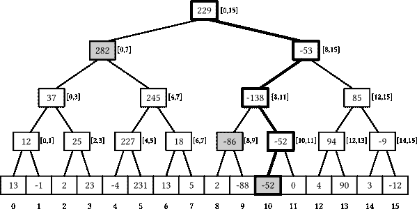
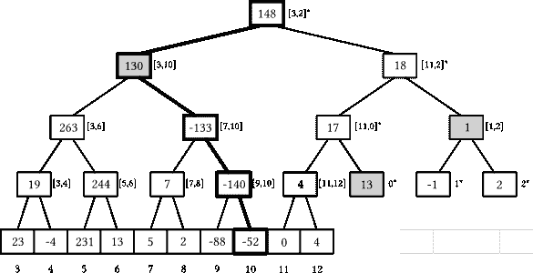
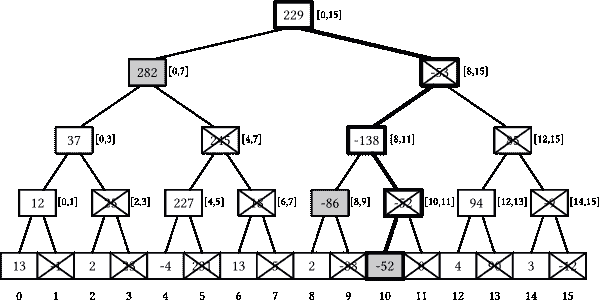
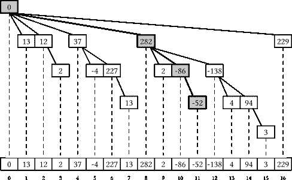
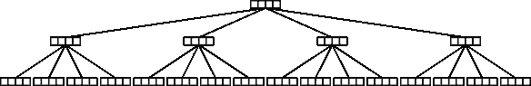

# 段树

> 原文：[`en.algorithmica.org/hpc/data-structures/segment-trees/`](https://en.algorithmica.org/hpc/data-structures/segment-trees/)

从优化二分搜索中获得的教训可以应用于广泛的数据结构。

在这篇文章中，我们不再尝试优化 STL 中的某些内容，而是专注于 *段树*，这些结构对于大多数 *普通* 程序员甚至大多数计算机科学研究者可能都不太熟悉^(1)，但它们在编程竞赛中因其速度和实现的简单性而被广泛使用[非常广泛](https://www.google.com/search?q=segment+tree+site%3Acodeforces.com&newwindow=1&sxsrf=APq-WBuTupSOnSn9JNEHhaqtmv0Uq0eogQ%3A1645969931499&ei=C4IbYrb2HYibrgS9t6qgDQ&ved=0ahUKEwj2p8_og6D2AhWIjYsKHb2bCtQQ4dUDCA4&uact=5&oq=segment+tree+site%3Acodeforces.com&gs_lcp=Cgdnd3Mtd2l6EAM6BwgAEEcQsAM6BwgAELADEEM6BAgjECc6BAgAEEM6BQgAEIAEOgYIABAWEB46BQghEKABSgQIQRgASgQIRhgAUMkFWLUjYOgkaANwAXgAgAHzAYgB9A-SAQYxNS41LjGYAQCgAQHIAQrAAQE&sclient=gws-wiz)。

（如果您已经了解背景，可以直接跳转到 最后一节 了解新内容：比 Fenwick 树快 4 到 12 倍的 *宽段树*。）

### [#](https://en.algorithmica.org/hpc/data-structures/segment-trees/#dynamic-prefix-sum)动态前缀和

段树很酷，可以做很多事情，但在这篇文章中，我们将专注于它们最简单的非平凡应用——*动态前缀和问题*：

```cpp
void add(int k, int x); // react to a[k] += x (zero-based indexing)
int sum(int k);         // return the sum of the first k elements (from 0 to k - 1) 
```

由于我们必须支持两种类型的查询，我们的优化问题变成了多维的，最优解取决于查询的分布。例如，如果一种类型的查询非常罕见，我们只会优化另一种，这相对容易做到：

+   如果我们只关心 *更新数组* 的成本，我们会直接存储它，并在每个 `sum` 查询上直接计算总和。

+   如果我们只关心 *前缀和查询* 的成本，我们就会保持它们就绪，并在每次更新时从头开始重新计算。

这两种选项对一个查询类型执行 $O(1)$ 的工作量，但对另一个查询类型执行 $O(n)$ 的工作量。当查询频率相对接近时，我们可以通过牺牲一种查询类型的一些性能来换取另一种查询类型的性能提升。段树可以让你做到这一点，实现两种查询都达到 $O(\log n)$ 工作量的平衡。

### [#](https://en.algorithmica.org/hpc/data-structures/segment-trees/#segment-tree-structure)段树结构

段树背后的主要思想是这样的：

+   计算整个数组的总和，并将它记录下来；

+   将数组分成两半，计算两半的和，并将它们记录下来；

+   将这些半数再分成半数，计算四个总和的总和，并将它们记录下来；

+   …等等，直到我们递归地达到长度为 1 的段。

这些计算出的子段和可以逻辑上表示为一个二叉树——这就是我们所说的线段树：



突出显示与求和(11)和添加(10)查询相关的节点线段树

线段树有一些很好的属性：

+   如果底层数组有 $n$ 个元素，线段树恰好有 $(2n - 1)$ 个节点——$n$ 个叶节点和 $(n - 1)$ 个内部节点——因为每个内部节点将一个段分成两部分，并且你只需要 $(n - 1)$ 个它们来完全分割原始的 $[0, n-1]$ 范围。

+   树的高度是 $\Theta(\log n)$：从根节点开始，每一层的节点数量大约翻倍，而它们段的大小大约减半。

+   每个段可以被分割成 $O(\log n)$ 个不重叠的段，这些段对应于线段树的节点：每个层最多需要两个。

当 $n$ 不是 2 的幂时，并非所有层都被完全填满——最后一层可能是不完整的，但这些属性的准确性不受影响。第一个属性允许我们仅使用 $O(n)$ 的内存来存储树，最后两个属性让我们能在 $O(\log n)$ 的时间内解决问题：

+   `add(k, x)` 查询可以通过将值 `x` 添加到所有包含元素 `k` 的段的节点上来处理，并且我们已经确定这些节点只有 $O(\log n)$ 个。

+   `sum(k)` 查询可以通过找到所有共同组成 `[0, k)` 前缀的节点并将它们中存储的值相加来回答——并且我们已经确定这些节点最多有 $O(\log n)$ 个。

但这仍然是理论。正如我们稍后将会看到的，有非常多的方法可以实现这种数据结构。

### [#](https://en.algorithmica.org/hpc/data-structures/segment-trees/#pointer-based-implementation)基于指针的实现

实现线段树最直接的方法是将我们需要的所有内容都显式地存储在一个节点中：包括数组段的边界、总和以及指向其子节点的指针。

如果我们正在“面向对象编程简介”课程中，我们会像这样递归地实现线段树：

```cpp
struct segtree {
    int lb, rb;                         // the range this node is responsible for 
    int s = 0;                          // the sum of elements [lb, rb)
    segtree *l = nullptr, *r = nullptr; // pointers to its children

    segtree(int lb, int rb) : lb(lb), rb(rb) {
        if (lb + 1 < rb) { // if the node is not a leaf, create children
            int m = (lb + rb) / 2;
            l = new segtree(lb, m);
            r = new segtree(m, rb);
        }
    }

    void add(int k, int x) { /* react to a[k] += x */ }
    int sum(int k) { /* compute the sum of the first k elements */ }
}; 
```

如果我们需要在一个现有的数组上构建它，我们会像这样重写构造函数的主体：

```cpp
if (lb + 1 == rb) {
    s = a[lb]; // the node is a leaf -- its sum is just the element a[lb]
} else {
    int t = (lb + rb) / 2;
    l = new segtree(lb, t);
    r = new segtree(t, rb);
    s = l->s + r->s; // we can use the sums of children that we've just calculated
} 
```

构造时间对我们来说没有太大的意义，所以为了减少心理负担，我们将假设在所有未来的实现中数组都是零初始化的。

现在，要实现 `add`，我们需要沿着树向下遍历直到达到一个叶节点，并将增量添加到 `s` 字段中：

```cpp
void add(int k, int x) {
    s += x;
    if (l != nullptr) { // check whether it is a leaf node
        if (k < l->rb)
            l->add(k, x);
        else
            r->add(k, x);
    }
} 
```

要计算一个段的和，我们可以检查查询是否完全覆盖当前段或者完全不与它相交——然后立即返回这个节点的结果。如果都不是这种情况，我们将递归地将查询传递给子节点，以便它们自己解决问题：

```cpp
int sum(int lq, int rq) {
    if (rb <= lq && rb <= rq) // if we're fully inside the query, return the sum
        return s;
    if (rq <= lb || lq >= rb) // if we don't intersect with the query, return zero
        return 0;
    return l->sum(lq, rq) + r->sum(lq, rq);
} 
```

此函数访问总共 $O(\log n)$ 个节点，因为它仅在段仅部分与查询相交时才产生子节点，并且最多有 $O(\log n)$ 个这样的段。

对于 *前缀和*，这些检查可以简化为查询的左边界始终为零：

```cpp
int sum(int k) {
    if (rb <= k)
        return s;
    if (lb >= k)
        return 0;
    return l->sum(k) + r->sum(k);
} 
```

由于我们有两种类型的查询，我们也得到了两个图来查看：


虽然这种面向对象的实现从软件工程实践的角度来看相当不错，但有几个方面使其在性能方面非常糟糕：

+   两种查询实现都使用了 递归 — 尽管添加查询可以被尾调用优化。

+   两种查询实现都使用了不可预测的 分支，这会导致 CPU 缓冲区停滞。

+   节点存储额外的元数据。该结构占用 $4+4+4+8+8=28$ 字节，并填充到 32 字节以进行 内存对齐，而实际上只需要 4 字节来存储整数和。

+   最重要的是，我们正在进行大量的 指针追踪：我们必须获取指向子节点的指针才能进入它们，尽管我们可以在查询之前推断出我们需要哪些段。

指针追踪在数量级上超过了所有其他问题——要否定它，我们需要消除指针，使结构 *隐式*。

### [#](https://en.algorithmica.org/hpc/data-structures/segment-trees/#implicit-segment-trees)隐式段树

由于段树是一种二叉树，我们可以使用 Eytzinger 布局将节点存储在一个大数组中，并使用索引运算代替显式指针来导航。

更正式地说，我们定义节点 $1$ 为根节点，包含整个数组 $[0, n)$ 的和。然后，对于每个对应于范围 $[l, r]$ 的节点 $v$，我们定义：

+   节点 $2v$ 应为其左子节点，对应范围 $l, \lfloor \frac{l+r}{2} \rfloor)$;

+   节点 $(2v+1)$ 应为其右子节点，对应范围 $[\lfloor \frac{l+r}{2} \rfloor, r)$。

当 $n$ 是完全的 2 的幂时，这种布局可以非常整齐地打包整个树：

![图片

隐式段树的内存布局，其中相同的查询路径被突出显示

然而，当 $n$ 不是 2 的幂时，布局就不再紧凑：尽管无论我们如何分割段，我们仍然有恰好 $(2n - 1)$ 个节点，但它们不再完美地映射到 $[1, 2n)$ 范围。

例如，考虑当我们下降到大小为 $17 = 2⁴ + 1$ 的段树的最右叶节点时会发生什么：

+   我们从编号为 $1$ 的根节点开始，代表范围 $[0, 16]$,

+   我们前往节点 $3 = 2 \times 1 + 1$，代表范围 $[8, 16]$,

+   我们前往节点 $7 = 2 \times 2 + 1$，代表范围 $[12, 16]$,

+   我们前往节点 $15 = 2 \times 7 + 1$，代表范围 $[14, 16]$,

+   我们前往代表范围 $[15, 16]$ 的节点 $31 = 2 \times 15 + 1$，

+   我们最终到达代表范围 $[16, 16]$ 的节点 $63 = 2 \times 31 + 1$。

因此，由于 $63 > 2 \times 17 - 1 = 33$，布局中存在一些空隙，但树的结构仍然是相同的，其高度仍然是 $O(\log n)$。目前，我们可以忽略这个问题，只需为存储节点分配一个更大的数组——可以证明最右侧叶子的索引永远不会超过 $4n$，因此分配这么多单元格总是足够的：

```cpp
int t[4 * N]; // contains the node sums 
```

现在，为了实现 `add`，我们创建一个类似的递归函数，但使用索引算术而不是指针。由于我们也不再在节点中存储段边界，我们需要重新计算它们并将它们作为参数传递给每个递归调用：

```cpp
void add(int k, int x, int v = 1, int l = 0, int r = N) {
    t[v] += x;
    if (l + 1 < r) {
        int m = (l + r) / 2;
        if (k < m)
            add(k, x, 2 * v, l, m);
        else
            add(k, x, 2 * v + 1, m, r);
    }
} 
```

前缀和查询的实现基本上是相同的：

```cpp
int sum(int k, int v = 1, int l = 0, int r = N) {
    if (l >= k)
        return 0;
    if (r <= k)
        return t[v];
    int m = (l + r) / 2;
    return sum(k, 2 * v, l, m)
         + sum(k, 2 * v + 1, m, r);
} 
```

在递归函数中传递五个变量看起来有些笨拙，但性能的提升显然是值得的：


除了需要更少的内存，这对适应 CPU 缓存是有好处的，这种实现的主要优点是，我们现在可以利用内存并行性并并行获取所需的节点，从而显著提高查询的运行时间。

为了进一步提高性能，我们可以：

+   手动优化索引算术（例如，注意到我们无论如何都需要将 `v` 乘以 `2`），

+   将除以二替换为显式的二进制移位（因为编译器并不总是能够自己完成这个操作)，

+   并且，最重要的是，消除递归并使实现完全迭代。

由于 `add` 是尾递归且没有返回值，因此很容易将其转换为单个 `while` 循环：

```cpp
void add(int k, int x) {
    int v = 1, l = 0, r = N;
    while (l + 1 < r) {
        t[v] += x;
        v <<= 1;
        int m = (l + r) >> 1;
        if (k < m)
            r = m;
        else
            l = m, v++;
    }
    t[v] += x;
} 
```

对于 `sum` 查询进行相同的操作稍微困难一些，因为它有两个递归调用。关键技巧是注意到当我们进行这些调用时，其中一个是保证立即终止的，因为 `k` 只能位于一半中，因此我们可以在向下遍历树之前简单地检查这个条件：

```cpp
int sum(int k) {
    int v = 1, l = 0, r = N, s = 0;
    while (true) {
        int m = (l + r) >> 1;
        v <<= 1;
        if (k >= m) {
            s += t[v++];
            if (k == m)
                break;
            l = m;
        } else {
            r = m;
        }
    }
    return s;
} 
```

这并没有在很大程度上提高更新查询的性能（因为它已经是尾递归的，编译器已经执行了类似的优化），但对于所有问题大小的前缀和查询，运行时间大约减半：


这种实现仍然存在一些问题：我们使用的内存是必要的两倍，我们付出了昂贵的分支成本，并且我们必须在每次迭代中维护和重新计算数组界限。为了消除这些问题，我们需要稍微改变我们的方法。

### [#](https://en.algorithmica.org/hpc/data-structures/segment-trees/#bottom-up-implementation)自底向上实现

让我们改变隐式段树布局的定义。我们不再依赖于父子关系，而是首先强制将所有叶子节点分配在 $[n, 2n)$ 范围内，然后递归地定义节点 $k$ 的父节点等于节点 $\lfloor \frac{k}{2} \rfloor$。

这种结构在很大程度上与之前相同：你仍然可以通过将任何节点号除以 2 来到达根（节点 $1$），每个节点仍然最多有两个子节点：$2k$ 和 $(2k + 1)$，因为其他任何东西在除以 2 时都会得到不同的父节点号。我们得到的好处是，我们已经强制最后一层是连续的，并从 $n$ 开始，因此我们可以使用大小减半的数组：

```cpp
int t[2 * N]; 
```

当 $n$ 是 2 的幂时，树的结构与之前完全相同，在实现查询时，我们可以利用这种自底向上的方法，从第 $k$ 个叶子节点（简单地索引为 $N + k$）开始，直到达到根节点：

```cpp
void add(int k, int x) {
    k += N;
    while (k != 0) {
        t[k] += x;
        k >>= 1;
    }
} 
```

要计算 $[l, r)$ 子段上的和，我们可以维护需要添加的第一个和最后一个元素的指针，在添加节点时分别增加/减少它们，并在它们收敛到相同的节点（这将是最小公共祖先）后停止：

```cpp
int sum(int l, int r) {
    l += N;
    r += N - 1;
    int s = 0;
    while (l <= r) {
        if ( l & 1) s += t[l++]; // l is a right child: add it and move to a cousin
        if (~r & 1) s += t[r--]; // r is a left child: add it and move to a cousin
        l >>= 1, r >>= 1;
    }
    return s;
} 
```

惊讶的是，即使 $n$ 不是 2 的幂，这两个查询也能正确工作。为了理解原因，考虑一个 13 个元素的段树：



最后一层的第一个索引始终是 2 的幂，但当数组大小不是 2 的完美幂时，一些前缀的叶子元素会被环绕到树的右侧。神奇的是，这个事实对我们的实现没有问题：

+   即使一些节点对应于数组的某些前缀和后缀而不是连续子段，`add` 查询仍然会更新其父节点。

+   即使 `l` 在那个环绕前缀上并且逻辑上“在 r 的右边”，`sum` 查询仍然会在正确的子段上计算和，因为最终 `l` 会成为某一层的最后一个节点并增加，突然跳到下一层的第一个元素，并在添加树环绕部分的正确节点后继续正常进行（看图中的暗色节点）。

与自顶向下的方法相比，我们使用一半的内存，并且不需要维护查询范围，这导致代码更简单，从而更快：


在运行基准测试时，我们使用 `sum(l, r)` 过程来计算一般子段和，并且将 `l` 固定为 `0`。为了在前缀和查询上获得更高的性能，我们想要避免维护 `l`，而只移动右边界，如下所示：

```cpp
int sum(int k) {
    int s = 0;
    k += N - 1;
    while (k != 0) {
        if (~k & 1) // if k is a right child
            s += t[k--];
        k = k >> 1;
    }
    return s;
} 
```

与之相反，这个前缀和实现只有在 $n$ 不是 2 的幂时才有效——因为 `k` 可能位于那个环绕部分，我们几乎会计算整个数组而不是一个小前缀。

为了使其适用于任意数组大小，我们可以对叶子进行排列，使它们在树的最后两层中按从左到右的逻辑顺序排列。在上述示例中，这意味着将 $3$ 加到所有叶子索引上，然后通过减去 $13$ 将最后三个叶子提升一个级别。

在一般情况下，这可以通过几个周期内的预测来完成：

```cpp
const int last_layer = 1 << __lg(2 * N - 1);

// calculate the index of the leaf k
int leaf(int k) {
    k += last_layer;
    k -= (k >= 2 * N) * N;
    return k;
} 
```

当实现查询时，我们只需要调用 `leaf` 函数来获取正确的叶子索引：

```cpp
void add(int k, int x) {
    k = leaf(k);
    while (k != 0) {
        t[k] += x;
        k >>= 1;
    }
}

int sum(int k) {
    k = leaf(k - 1);
    int s = 0;
    while (k != 0) {
        if (~k & 1)
            s += t[k--];
        k >>= 1;
    }
    return s;
} 
```

最后一点：通过将 `s += t[k--]` 行替换为 预测，我们可以使实现无分支（除了最后一个分支——我们仍然需要检查循环条件）：

```cpp
int sum(int k) {
    k = leaf(k - 1);
    int s = 0;
    while (k != 0) {
        s += (~k & 1) ? t[k] : 0; // will be replaced with a cmov
        k = (k - 1) >> 1;
    }
    return s;
} 
```

当结合这些优化时，前缀和查询的运行速度会大大提高：


注意到前缀和查询延迟的增加是从 $2^{19}$ 开始的，而不是从 $2^{20}$ 开始的，即 L3 缓存边界。这是因为我们仍然存储 $2n$ 个整数，并且无论是否会将其添加到 `s` 中，都会获取 `t[k]` 元素。实际上我们可以解决这两个问题。

### [#](https://en.algorithmica.org/hpc/data-structures/segment-trees/#fenwick-trees)斐波那契树

隐式结构很棒：它们避免了指针追踪，允许并行访问所有相关节点，并且由于不存储节点中的元数据，因此占用的空间更少。比隐式结构更好的是 *简洁结构*：它们只需要信息论最小空间来存储结构，仅使用 $O(1)$ 的额外内存。

为了使段树简洁，我们需要查看节点中存储的值，寻找冗余——可以从其他值推断出的值——并移除它们。一种方法是注意到，在每次前缀和的实现中，我们从未使用过右子节点中存储的和——因此，对于计算前缀和，这样的节点是冗余的：



*斐波那契树*（也称为 *二叉索引树* —— 很快你就会明白为什么）是一种使用这种考虑的段树，它去掉了所有的 *右子节点*，本质上移除了每一层的每个节点中的第二个节点，使得总节点数与底层数组相同。

```cpp
int t[N + 1]; // +1 because we use use one-based indexing 
```

为了紧凑地存储这些段和，斐波那契树放弃了 Eytzinger 布局：相反，对于每个在段树最后一层中将是叶子的元素 $k$，它存储其第一个未被移除的祖先的和。例如：

+   元素 $7$ 会持有 $[0, 7]$ 范围的求和（$282$），

+   元素 $9$ 会持有 $[8, 9]$ 范围的求和（$-86$），

+   元素 $10$ 会持有 $[10, 10]$ 范围的求和（$-52$，即元素本身）。

如何比模拟树下降更快地计算给定元素$k$（更具体地说：右边界总是元素$k$本身）的这个范围？结果是，当树的大小是 2 的幂时，并且我们使用基于 1 的索引时，有一个聪明的位技巧可以工作——只需移除索引的最低位：

+   元素`7 + 1 = 8 = 1000_2`的左边界是`0000_2 = 0`，

+   元素`9 + 1 = 10 = 1010_2`的左边界是`1000_2 = 8`，

+   元素`10 + 1 = 11 = 1011_2`的左边界是`1010_2 = 10`。

要获取一个整数的最后一个设置的位，我们可以使用这个程序：

```cpp
int lowbit(int x) {
    return x & -x;
} 
```

这个技巧是通过二进制中如何使用二进制补码来存储有符号数来实现的。当我们计算`-x`时，我们隐式地从 2 的某个大幂次中减去它：数字的一些前缀翻转，一些末尾的零保持不变，唯一一个保持不变的位是最后一个设置的位——这将是唯一一个幸存的`x & -x`。例如：

```cpp
+90 = 64 + 16 + 8 + 2 = (0)10110
-90 = 00000 - 10110   = (1)01010
    → (+90) & (-90)   = (0)00010 
```

我们已经建立了斐波那契树是一个大小为`n`的数组，其中每个元素`k`被定义为从原始数组中`k - lowbit(k) + 1`到`k`（包括`k`）的元素之和，现在是我们实现一些查询的时候了。

实现前缀和查询很简单。`t[k]`保存了我们需要的和，除了第一个`k - lowbit(k)`个元素，所以我们只需将其添加到结果中，然后跳转到`k - lowbit(k)`并继续这样做，直到我们达到数组的开始：

```cpp
int sum(int k) {
    int s = 0;
    for (; k != 0; k -= lowbit(k))
        s += t[k];
    return s;
} 
```

由于我们反复从`k`中移除最低设置的位，并且由于这个程序与在段树中访问相同的左子节点等效，每个`sum`查询最多可以触及$O(\log n)$个节点：



斐波那契树中前缀和查询的路径

为了稍微提高`sum`查询的性能，我们使用`k &= k - 1`一次性移除最低位，这比`k -= k & -k`快一个指令：

```cpp
int sum(int k) {
    int s = 0;
    for (; k != 0; k &= k - 1)
        s += t[k];
    return s;
} 
```

与所有之前的线段树实现不同，斐波那契树是一个结构，在其中计算子区间的和作为两个前缀和的差更容易、更高效：

```cpp
// [l, r)
int sum (int l, int r) {
    return sum(r) - sum(l);
} 
```

更新查询的编码更容易，但不太直观。我们需要将值`x`添加到所有是叶子`k`的左子节点祖先的节点。这些节点的索引`m`大于`k`，但`m - lowbit(m) < k`，这样`k`就包含在它们的范围内。

所有这样的索引都需要与`k`有一个共同的前缀，然后是`k`中为`0`的位置的`1`，然后是一个零的尾缀，这样`1`就可以抵消，并且`m - lowbit(m)`的结果小于`k`。所有这样的索引都可以像这样迭代生成：

```cpp
void add(int k, int x) {
    for (k += 1; k <= N; k += k & -k)
        t[k] += x;
} 
```

重复向`k`添加最低设置的位使其“更均匀”，并将其提升到其下一个左子节点段树祖先：


斐波那契树中更新查询的路径

现在，如果我们保持所有代码不变，即使当 $n$ 不是 2 的幂时，它也能正确工作。在这种情况下，Fenwick 树并不等同于大小为 $n$ 的段树，而是等同于最多 $O(\log n)$ 个大小为 2 的幂的段树的*森林*——或者如果你喜欢这样想，就是一个填充到大的 2 的幂的单一段树。在两种情况下，所有过程仍然可以正确工作，因为它们从未触及 $[1, n]$ 范围之外的任何东西。

Fenwick 树的性能与优化自底向上的段树在更新查询方面相似，而在前缀和查询方面略快：


图表上有一个奇怪的现象。当我们越过 L3 缓存边界后，性能会非常迅速地提升。这是缓存关联性效应：最频繁使用的单元的所有索引都能被大的 2 的幂整除，因此它们被映射到相同的缓存集，互相踢出，从而有效地减少了缓存大小。

一种消除这种效果的方法是在布局中插入“空洞”，如下所示：

```cpp
inline constexpr int hole(int k) {
    return k + (k >> 10);
}

int t[hole(N) + 1];

void add(int k, int x) {
    for (k += 1; k <= N; k += k & -k)
        t[hole(k)] += x;
}

int sum(int k) {
    int res = 0;
    for (; k != 0; k &= k - 1)
        res += t[hole(k)];
    return res;
} 
```

计算空缺函数不是迭代之间的关键路径，因此它不会引入任何显著的开销，但完全消除了缓存关联性问题，并将大数组的延迟减少了高达 3 倍：


Fenwick 树速度快，但它们还存在一些其他小问题。类似于二分查找，它们内存访问的时间局部性并不最佳，因为很少访问的元素被分组与最频繁访问的元素一起。Fenwick 树还执行非固定次数的迭代，并需要进行循环结束检查，这很可能导致分支预测错误——尽管只是单个错误。

可能还有一些东西可以优化，但我们打算在这里停下来，专注于一个完全不同的方法，如果你知道 S-树，你可能已经知道这个方法的方向了。

### [#](https://en.algorithmica.org/hpc/data-structures/segment-trees/#wide-segment-trees)宽段树

这里是主要思想：如果内存系统无论如何都在为我们获取完整的缓存行，那么让我们用可以让查询处理更快的信息将其填满到最大。对于段树来说，这意味着在节点中存储超过一个数据点。这让我们可以减少树的高度，并在上下文时进行更少的迭代：



我们将使用术语*宽（B-ary）段树*来指代这种修改。

为了实现这种布局，我们可以使用与 S+树中使用的类似的 constexpr-基于的方法：

```cpp
const int b = 4, B = (1 << b); // cache line size (in integers, not bytes)

// the height of the tree over an n-element array 
constexpr int height(int n) {
    return (n <= B ? 1 : height(n / B) + 1);
}

// where the h-th layer starts
constexpr int offset(int h) {
    int s = 0, n = N;
    while (h--) {
        n = (n + B - 1) / B;
        s += n * B;
    }
    return s;
}

constexpr int H = height(N);
alignas(64) int t[offset(H)]; // an array for storing nodes 
```

这样，我们实际上将树的高度减少了大约$\frac{\log_B n}{\log_2 n} = \log_2 B$倍（如果$B = 16$，则约为 4 倍），但将节点内操作有效地实现变得非同小可。对于我们的问题，我们有两种主要选项：

1.  我们可以在每个节点中存储$B$个*和*（对于它的每个$B$个子节点）。

1.  我们可以在每个节点中存储$B$个*前缀和*（第$i$个是前$(i + 1)$个子节点的和）。

如果我们选择第一种选项，`add`查询将与自底向上的段树中的查询大致相同，但`sum`查询需要将每个访问的节点中的$B$个标量相加。如果我们选择第二种选项，`sum`查询将是微不足道的，但`add`查询需要将`x`添加到每个访问的节点上的某个后缀。

在任何一种情况下，一个操作都会执行$O(\log_B n)$操作，仅在每个节点中触及一个标量，而另一个操作则会执行$O(B \cdot \log_B n)$操作，触及每个节点中最多$B$个标量。然而，我们可以使用 SIMD 来加速较慢的操作，由于 SIMD 指令集没有快速的水平归约，但向向量添加向量很容易，我们将选择第二种方法，并在每个节点中存储前缀和。

这使得`sum`查询非常快且易于实现：

```cpp
int sum(int k) {
    int s = 0;
    for (int h = 0; h < H; h++)
        s += t[offset(h) + (k >> (h * b))];
    return s;
} 
```

`add`查询更复杂且较慢。我们需要只将一个数字添加到节点的后缀中，我们可以通过掩码不应修改的位置来实现这一点。

我们可以预先计算一个$B \times B$的数组，对应于$B$个这样的掩码，这些掩码告诉，对于节点内$B$个位置中的每一个，是否需要更新某个前缀和值：

```cpp
struct Precalc {
    alignas(64) int mask[B][B];

    constexpr Precalc() : mask{} {
        for (int k = 0; k < B; k++)
            for (int i = 0; i < B; i++)
                mask[k][i] = (i > k ? -1 : 0);
    }
};

constexpr Precalc T; 
```

除了这个掩码技巧之外，其余的计算足够简单，可以用 GCC 向量类型处理。当处理`add`查询时，我们只需使用这些掩码将它们与广播的`x`值进行位与操作以掩码它，然后将其添加到节点中存储的值：

```cpp
typedef int vec __attribute__ (( vector_size(32) ));

constexpr int round(int k) {
    return k & ~(B - 1); // = k / B * B
}

void add(int k, int x) {
    vec v = x + vec{};
    for (int h = 0; h < H; h++) {
        auto a = (vec*) &t[offset(h) + round(k)];
        auto m = (vec*) T.mask[k % B];
        for (int i = 0; i < B / 8; i++)
            a[i] += v & m[i];
        k >>= b;
    }
} 
```

这样，`sum`查询比 Fenwick 树快 10 多倍，`add`查询快最多 4 倍：


与 S-树不同，在这个实现中，块大小可以很容易地更改（通过实际上更改一个字符）。预期地，当我们增加它时，更新时间也会增加，因为我们需要获取更多的缓存行并处理它们，但`sum`查询时间会减少，因为树的高度变得更小：


与 S+树类似，最优内存布局可能具有非均匀的块大小，这取决于问题大小和查询的分布，但我们不会探索这个想法，只是在这里留下优化。

### [#](https://en.algorithmica.org/hpc/data-structures/segment-trees/#comparisons)比较

与其他流行的段树实现相比，宽段树的速度显著更快：


相对速度提升的量级为：


与基于指针的原实现相比，宽段树在求前缀和和更新查询方面分别快了 200 倍和 40 倍——尽管，对于足够大的数组，两种实现都变成了纯粹受内存限制的，这种加速效果降低到大约 60 倍和 15 倍。

### [#](https://en.algorithmica.org/hpc/data-structures/segment-trees/#modifications)修改

我们只关注了 32 位整数的前缀和问题——为了使这篇文章稍微短一些，并且为了使与斐波那契树（Fenwick tree）的比较公平——但宽段树也可以用于其他常见的范围操作，尽管使用 SIMD 高效实现它们需要一些创造力。

*免责声明:* 我还没有实现这些想法中的任何一个，因此其中一些可能存在致命的缺陷。

**其他数据类型**可以通过更改向量类型以及，如果它们的大小不同，节点大小 $B$ 来轻松支持——这也改变了树的高度，从而影响了查询的总迭代次数。

也可能查询对更新和前缀和查询有不同的限制。例如，只有“$\pm 1$”更新查询且保证前缀和查询的结果始终适合 32 位整数的情况并不少见。如果结果可以适合 8 位，我们只需使用 8 位的`char`，块大小为 $B=64$ 字节，从而使总树高减少到 $\frac{\log_{16} n}{\log_{64} n} = \log_{16} 64 = 1.5$ 倍，并且两个查询都相应地更快。

不幸的是，这在一般情况下不起作用，但我们仍然有一种方法可以在更新增量较小时加速查询：我们可以*缓冲*更新查询。使用相同的“$\pm 1$”示例，我们可以将分支因子 $B=64$ 设置为我们想要的值，并在每个节点中存储 $B$ 个 32 位整数，$B$ 个 8 位有符号字符，以及一个从 $127$ 开始并每次更新节点时递减的单个 8 位计数器变量。然后，当我们处理节点中的查询时：

+   对于更新查询，我们在`char`数组中添加一个掩码 8 位加减一向量，减少计数器，如果它是零，[转换](https://www.intel.com/content/www/us/en/docs/intrinsics-guide/index.html#ig_expand=3037,3009,4870,6715,4845,3853,288,6570,90,7307,5993,2692,6946,6949,5456,6938,5456,1021,3007,514,518,7253,7183,3892,5135,5260,3915,4027,3873,7401,4376,4229,151,2324,2310,2324,591,4075,3011,3009,6130,4875,6385,5259,6385,6250,1395,7253,6452,7492,4669,4669,7253,1039,1029,4669,4707,7253,7242,848,879,848,7251,4275,879,874,849,833,6046,7250,4870,4872,4875,849,849,5144,4875,4787,4787,4787,3016,3018,5227,7359,7335,7392,4787,5259,5230,5230,5223,5214,6438,5229,488,483,6527,6527,6554,1829,1829,1829&techs=AVX,AVX2&text=cvtepi8_) `char`数组中的值到 32 位整数，将它们添加到整数数组中，将`char`数组设置为零，并将计数器重置回 127。

+   对于前缀和查询，我们访问相同的节点，但将`int`和`char`值都添加到结果中。

这个更新累积技巧让我们在多使用约 25%内存的情况下，将性能提高最多 1.5 倍。

在`add`查询中有一个条件分支并将`char`数组添加到`int`数组中相当慢，但因为我们只需要每 127 次迭代做一次，所以在平均摊销意义上并不花费我们任何东西。`sum`查询的处理时间会增加，但并不显著——因为它主要取决于最慢的读取操作，而不是迭代次数。

**通用范围查询**可以像在 Fenwick 树中一样支持：只需将范围[l, r)分解为两个前缀和[0, r)和[0, l)的差。

这也适用于一些除了加法以外的操作（模素数乘法、异或等），尽管它们必须是**可逆的**：应该有一种快速“取消”左前缀操作的方法，从最终结果中“取消”操作。

**不可逆操作**也可以支持，尽管它们仍然需要满足一些其他属性：

+   它们必须是**结合律的**：$(a \circ b) \circ c = a \circ (b \circ c)$。

+   它们必须有一个**单位元**：$a \circ e = e \circ a = a$。

（如果你是挑剔的人，这些代数结构被称为[幺半群](https://en.wikipedia.org/wiki/Monoid)）

不幸的是，当操作不可逆时，前缀和技巧不起作用，因此我们必须切换到选项一并分别存储每个区间的操作结果。这需要对查询进行一些重大更改：

+   更新查询应在叶节点替换一个标量，在叶节点执行一个水平归约，然后继续向上，替换其父节点的一个标量，依此类推。

+   范围减少查询应该分别对左右边界进行计算，在每个路径上具有垂直减少值的向量，将这两个向量合并成一个，然后水平减少以返回最终答案。请注意，我们仍然需要使用掩码来用中性元素替换查询之外的价值，这次，可能需要一些条件移动/混合，以及 $B \times B$ 预计算的掩码或使用两个掩码来考虑查询的左右边界。

这使得查询速度大大降低——尤其是减少操作——但与自底向上的段树相比，这仍然应该更快。

**最小值**是一个很好的例外，如果元素的新的值小于当前值，更新查询可以稍微快一些：我们可以跳过水平减少部分，只需使用标量过程更新 $\log_B n$ 个节点。

当我们大多数时候都有这样的更新时，这种方法运行得非常快，例如，对于稀疏图迪杰斯特拉算法，当我们有比顶点更多的边时。对于这个问题，宽段树可以作为高效的固定宇宙最小堆。

**延迟传播**可以通过在节点中存储一个用于延迟操作的单独数组来实现。为了传播更新，我们需要从上到下进行（可以通过简单地反转 `for` 循环的方向并使用 `k >> (h * b)` 来计算第 `h` 代祖先来完成），广播并重置当前节点父节点中存储的延迟操作值，并将其应用于当前节点中存储的所有值，使用 SIMD。

一个小问题是，对于某些操作，我们需要知道段的长短：例如，当我们需要支持求和和大量赋值时。可以通过以下方式解决：通过填充元素，使得每一层的每个段大小均匀，预先计算段长度并将它们存储在节点中，或者使用预测来检查有问题的节点（每个层上最多有一个）。

### [致谢](https://en.algorithmica.org/hpc/data-structures/segment-trees/#acknowledgements)

感谢 Giulio Ermanno Pibiri 在这个案例研究中合作，这个案例研究主要基于他与 Rossano Venturini 合著的 2020 年论文“[前缀和问题的实际权衡](https://arxiv.org/pdf/2006.14552.pdf)”。如果您对这里为了简洁而跳过的细节感兴趣，我强烈推荐阅读原始文章。

代码和有关自底向上段树的一些想法是从 Oleksandr Bacherikov 2015 年的一篇博客文章“[高效且简单的段树](https://codeforces.com/blog/entry/18051)”中改编的。

* * *

1.  线段树在理论计算机科学文献中很少被提及，因为它们相对较新（发明于约 2000 年），大多数情况下并不做任何其他二叉树（[任何其他二叉树](https://en.wikipedia.org/wiki/Tree_(data_structure)））做不到的事情，并且在**渐近性**上并不更快——尽管在实践中，它们在速度上通常能以很大的优势胜出。↩︎ [← 搜索树](https://en.algorithmica.org/hpc/data-structures/b-tree/)
