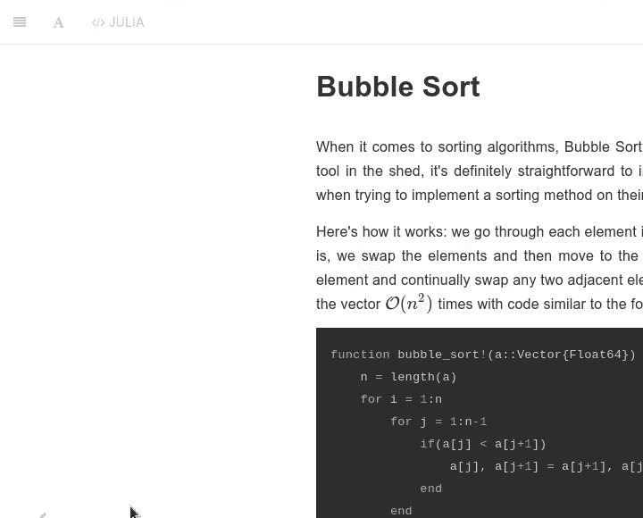

# 算法神秘档案

> 原文：[`www.algorithm-archive.org/`](https://www.algorithm-archive.org/)

神秘算法档案是一个旨在为所有语言中的所有重要算法创建指南的协作项目。显然，这个目标对于任何规模的书籍来说都过于雄心勃勃，但它是一个很好的学习和工作项目，并有望成为未来程序员的宝贵资源。

要更改语言，请使用网站顶部的 UI：

这里有一些重要的链接：

+   书籍/网站：[`www.algorithm-archive.org/`](https://www.algorithm-archive.org/)

+   GitHub 仓库：[`github.com/algorithm-archivists/algorithm-archive`](https://github.com/algorithm-archivists/algorithm-archive)

+   YouTube 频道（LeiosOS）：[`www.youtube.com/user/LeiosOS`](https://www.youtube.com/user/LeiosOS)

+   Twitch 直播：[`www.twitch.tv/leioslabs`](https://www.twitch.tv/leioslabs)

+   Discord 服务器：[`discord.gg/Pr2E9S6`](https://discord.gg/Pr2E9S6)

注意，这个项目本质上是一本关于算法的书籍，由在线社区共同撰写。幸运的是，有很多算法，这意味着有大量的内容材料可用。不幸的是，这意味着我们可能永远无法涵盖所有创建过的算法，而需要专注于社区认为有用和必要的算法。话虽如此，我们仍会涵盖一些几乎没有任何实际用途的有趣算法。

如果你想贡献，请随意访问任何带有代码的章节，并用你喜欢的语言实现该算法，然后通过 pull request 提交代码。你可以在我们的[如何贡献](https://github.com/algorithm-archivists/algorithm-archive/wiki/How-to-Contribute)wiki 条目中找到有关贡献过程的帮助和说明。

希望这个项目能够成长起来，让个人能够了解并尝试实现不同的算法，用于娱乐和（可能）有用的项目。至少，这将是我们社区的一次愉快的冒险。

感谢阅读，如果有什么不正确的地方或者你想看到未来实现的功能，请告诉我！

* * *

## 许可证

本项目的代码示例遵循 MIT 许可协议（可在[LICENSE.md](https://github.com/algorithm-archivists/algorithm-archive/blob/master/LICENSE.md)中找到）。所有文本内容均遵循[Creative Commons Attribution-ShareAlike 4.0 International License](https://creativecommons.org/licenses/by-sa/4.0/legalcode)，并在每一章末尾指定归属。所有图形均遵循每一章末尾所述的许可协议。如果未指定归属，请将归属归功于 James Schloss。

