# 绘图

> 原文：[`www.algorithm-archive.org/contents/plotting/plotting.html`](https://www.algorithm-archive.org/contents/plotting/plotting.html)

绘图是可视化理解和理解几个算法和重要细节的基本工具，对于计算科学各个领域的研究是必要的。对于许多语言，如 Python、Julia 和 Matlab，创建各种类型数据的简单图表相对简单；然而，对于 Fortran、C/C++ 和 Java 等其他几种语言，绘图可能是一项繁琐的工作。因为算法档案力求语言无关性，我们不希望偏袒任何特定的语言集合，因此我们决定将所有需要绘图的所需数据输出为可以由各种绘图脚本轻松读取的文件格式，这些脚本与算法实现分开。

如果您在这个页面上实现任何语言中的算法，您应该能够修改现有的代码以允许即时绘图。否则，请使用您选择的任何语言编写初始实现，并将数据输出到文件，然后再使用这里提供的任何脚本进行绘图。

本章旨在解释如何绘制几种不同类型的数据，并将随着更多算法需要更复杂的绘图方案而更新。尽管存在许多复杂的文件格式，但我们主要将存储用于绘图的简单 ASCII 文本。如果您希望使用这些绘图脚本处理其他文件格式或与算法档案无关的项目，可能需要进行一些修改。此外，本章中使用的每个绘图语言可能都有我们目前未使用的许多功能，因此可能存在创建令人惊叹的可视化的方法，但我们在这里忽略了。

## 绘制一系列函数

首先，让我们编写一个简单的脚本，允许绘制正弦波

```
plot sin(x) with lines 
```

其中 `x` 是从负数到正数的范围。要使用终端绘图，您可以：

+   通过使用 `gnuplot` 命令进入 gnuplot REPL（读取、评估、打印、循环 -- gnuplot 的 shell）并手动输入上述命令。

+   将命令写入外部脚本（让我们称其为 `script.gp`）并使用 `gnuplot script.gp -` 运行它。`-` 将在后台保持终端开启，以便图像保持显示。如果您的绘图脚本输出 `.png` 文件，则不需要 `-`。

这个命令将创建一个看起来像这样的图表：

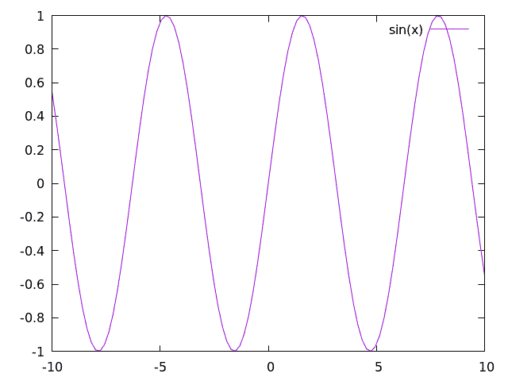

对于大多数 gnuplot 脚本，这个命令以简写形式书写。短语 `with lines` 简写为 `w l`，而 `plot` 有时简单地写成 `p`，因此以下命令也可以工作：

```
p sin(x) w l 
```

从这里开始，添加更多图表相当直接。例如，让我们添加一个余弦函数。

在这种情况下，我们需要在我们的脚本中添加以下行：

```
plot sin(x) with lines
replot cos(x) with lines 
```

这将创建一个看起来像这样的图像：

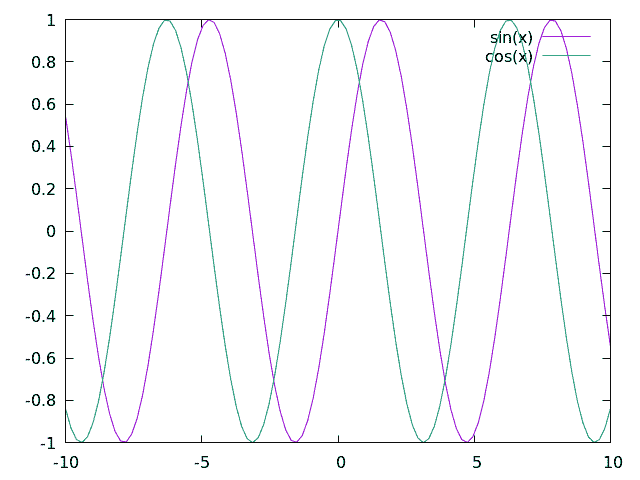

如果你希望将所有内容绘制在单行上（当直接绘制到图像文件时这一点将变得更加相关），那么你可以使用以下命令：

```
p sin(x) w l, cos(x) w l 
```

在某种意义上，本章旨在作为指南，以便用户能更好地理解他们选择的语言的绘图。因此，首先了解如何执行一些基本任务是很重要的：

1.  更改绘图辅助功能，例如：标题、坐标轴、标签、x/ytic 值和绘图尺寸

1.  同时绘制多个函数

1.  将图表输出到文件

在本章结束时，我们将讨论散点图；然而，在不久的将来，针对特定的算法和方法，可能会介绍额外的绘图技术。

### 更改辅助功能

美是主观的，但人们很少称图表为“美丽”。话虽如此，你可以做很多事情来更清楚地表示你的数据，如果你的数据很美，那就更好了！在本节中，我们将向你展示一些可以对我们已经生成的图表进行的小规模修改，使其更加整洁，但还有许多其他方式可以使你的图表更加美观，我们在这里没有涉及。如果你想要进行更复杂的操作，请务必查阅你选择的语言的绘图文档[[1]](#cite-1)。

#### x 轴和 y 轴范围

所有可以绘制的数据都有一个范围，在这个范围内，重要的特征更加清晰。有时，放大或缩小以突出数据中的特定方面是很重要的。这可以通过修改你选择的绘图器的` `和` `范围来简单地完成，如下所示：

```
set xrange [0:10]
set yrange [0:1]
plot sin(x) w l, cos(x) w l 
```

在这里，关键字`xrange`和`yrange`为 gnuplot 所知，它们接受一个范围从`[n:m]`，其中`n`和`m`是图中的实际单位。对于这个脚本，我们生成一个看起来像这样的图：

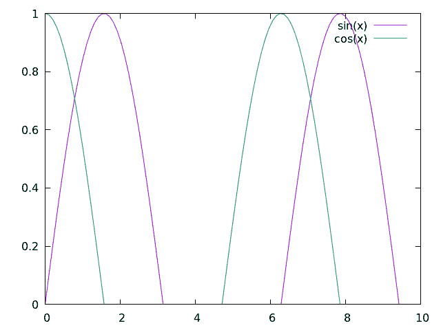

#### x 轴和 y 轴刻度

除了更改绘图比例，通知你的观众这些比例的实际含义也很重要。为了帮助引导读者的视线，更好地理解图表所代表的内容，绘图器在` `和` `轴上提供了*刻度*（小凹口）。因此，更新` `和` `刻度以适当的刻度和标签是很重要的。

首先，为了移除 x 轴和 y 轴的刻度，使用

```
unset xtics
unset ytics 
```

这将创建一个看起来像这样的图：

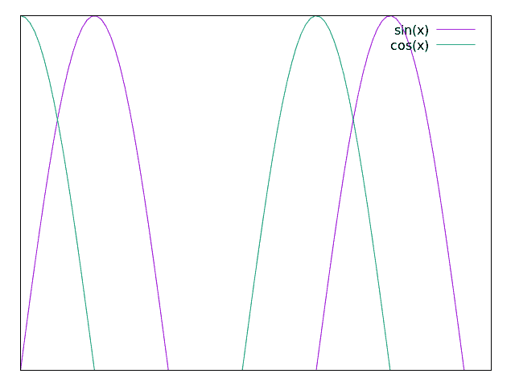

如果你想要设置特定的 x 或 y 刻度值，使用

```
set xtics 0, 5, 10
set ytics ("bottom" 0 , "top" 1) 
```

这将创建一个看起来像这样的图：

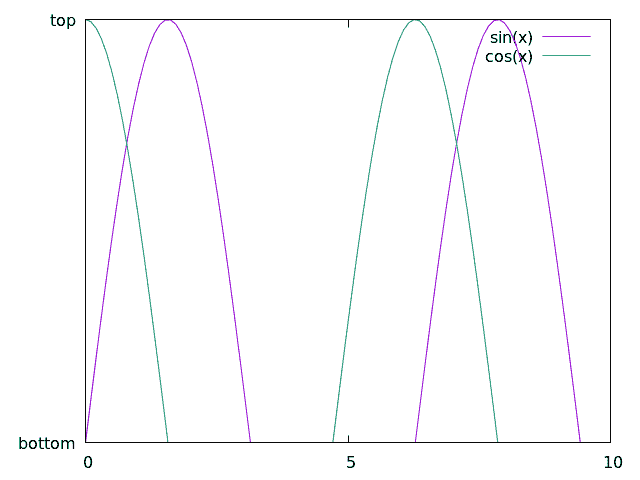

在这里，我们选择了 3 个用于 x 轴的值，并使用单词或短语表示 y 轴的“底部”和“顶部”。为了清楚起见：我们并不是通过在 y 轴上使用单词或短语，在 x 轴上使用数字来纵容 x 和 y 刻度值不匹配的行为。这只是为了展示如何以这种方式使用 gnuplot。

作为备注：这里有很多信息我们错过了，特别是格式说明符，它允许用户修改他们图表中数字的格式（浮点数、科学记数法或其他）。这些可以在[文档](http://gnuplot.sourceforge.net/docs_4.2/node184.html)中找到，以及这里遗漏的任何其他内容。

#### logscale

除了更改 x 和 y 轴的刻度值外，我们还可以使用以下命令将轴设置为对数刻度来绘制：

```
set logscale x
set logscale y 
```

作为简单的例子，让我们以`exp(x)`函数为例。

在 gnuplot 中，我们可以通过使用`p exp(x) w l`来绘制这个函数，这将创建以下内容：

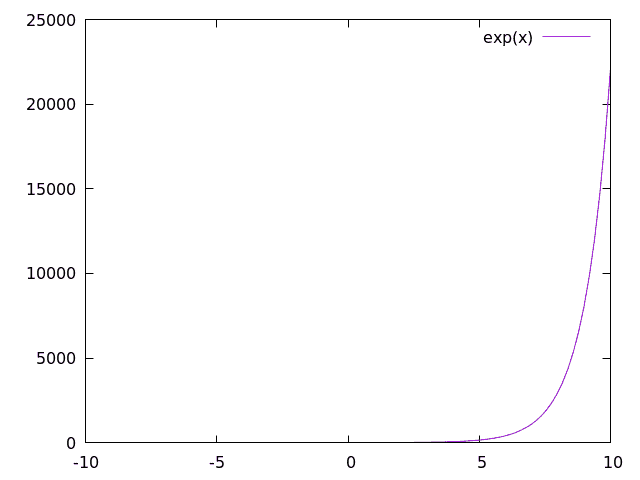

现在，让我们绘制沿 x 轴具有对数刻度的相同函数：

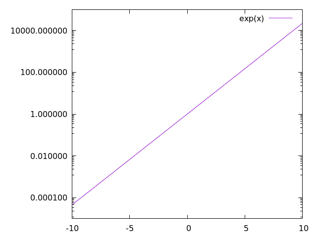

这里，我们看到我们预期的结果：当 x 轴在对数刻度时，`exp(x)`是一条直线。当我们对之前正弦和余弦波使用对数刻度时，我们得到以下内容：

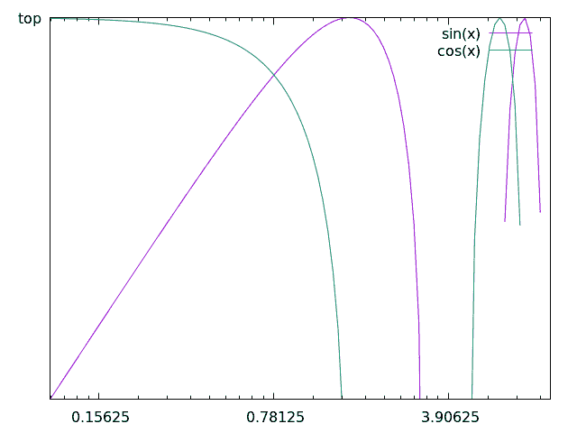

这是一个糟糕的图表，所以用它作为本章中几个更多图表的示例是合适的。

#### 标签、标题和图例

许多研究人员对标签非常挑剔。标签需要放在正确的位置，说出正确的内容，并以正确的方式被解释。因此，大多数绘图工具都有许多标签选项，包括用于学术期刊等的类似 LaTeX 的格式化。

每个图表也与多个标签相关联。每行都有一个标签，通常在一个称为*图例*的框中，图表本身也有一个标题。

##### 标签

首先，让我们更改与每个数据集或函数相关的标签。

```
p sin(x) w l title "sine wave", cos(x) w l title "cos(x)" 
```

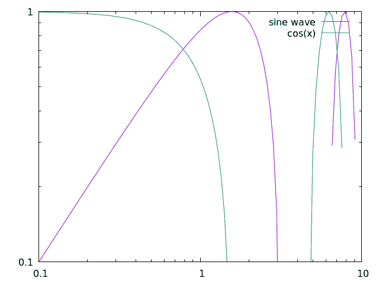

在这里，我们展示我们可以修改数据标签为任何我们想要的内容。注意，对于标签中的类似 LaTeX 的数学公式，我们可能需要将输出更改为 TeX，这将在稍后展示。

现在，让我们继续讨论我们可以对图例中的所有标签做些什么。

#### 图例

首先，你可能应该使用图例，除非你自己就是传奇人物，不需要图例...在这种情况下，你可以使用以下内容：

```
set nokey 
```

这将产生一个看起来像这样的图表：

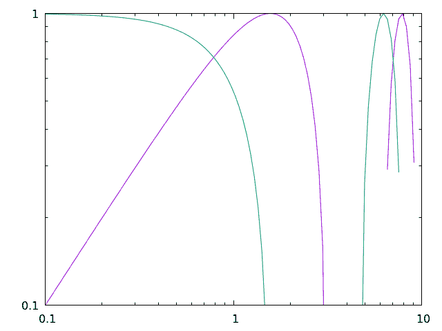

虽然你可能并不重要到可以移除图例，这样做会阻止读者理解你所绘制的图形数据，所以应该谨慎使用。相反，你可能应该尝试将图例移出数据之外，这可以通过多种方式实现。

在 gnuplot 中，我们可以通过使用某些关键字，如`top`、`bottom`、`left`、`right`和`center`来指定放置图例的位置，如下所示：

```
set key top left 
```

这将产生一个看起来像这样的图表：


此外，我们还可以在图表中指定精确的坐标来放置图例。例如，如果我们想让图例位于(1,0.5)的位置，那么我们会使用以下命令：

```
set key at 1, 0.5 
```

这将生成一个看起来像这样的图表：

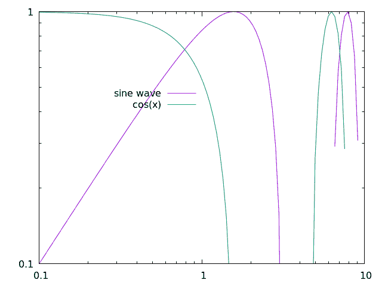

这当然是一个放置这个图表图例的糟糕位置，但这个命令可能对其他图表很有用。

##### 标题

显然，除了标签之外，我们还可以为整个图表提供一个标题，如下所示：

```
set title "Gnuplot Test" 
```

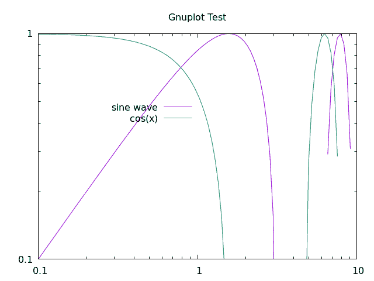

#### 正方形输出

许多时候，在 6:9（或者更糟糕的 16:9）的宽高比下绘图可能会感觉是对数据的误表示。无论出于什么原因，作为一个初出茅庐的研究人员，我一次又一次被告知没有必要使用宽屏图表，并且只要可能就应该将输出设置为正方形。

这可以通过使用

```
set size square 
```

这将输出以下图表：

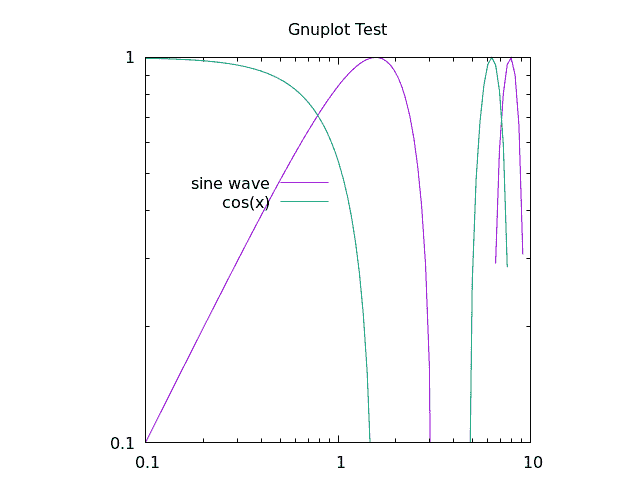

#### 线和点类型

最后，通过选择自己的点和线条类型来展示你的个性是很重要的。

要找到 gnuplot 中所有可用的点或线条类型，只需打开 REPL 并运行`test`命令，它输出的内容看起来像这样：

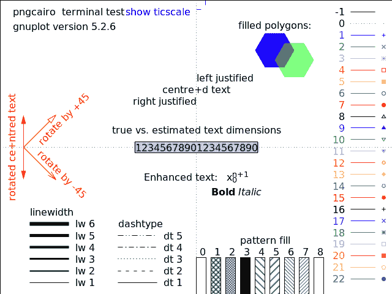

作为备注，改变线条颜色在上面的测试图像中没有提及，这可以通过`linecolor`命令来完成，它接受类似`rgb`的颜色空间中的参数。

如果我们想使用虚线黑色线条表示正弦函数，紫色十字表示余弦函数，我们会使用类似以下的内容：

```
p sin(x) with lines dashtype 2 linecolor rgb "black" title "sin(x)"
rep cos(x) w p pt 17 lc rgb "purple" t "cos(x)" 
```

这将创建一个看起来像这样的图表：

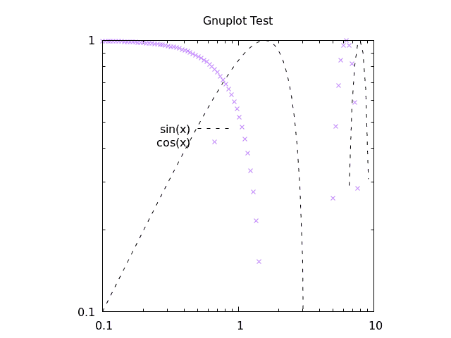

使用这个脚本，我们使用了一堆别名，这些别名可以在以下部分找到。现在很明显，你可以轻松地使你的图表看起来你想要的样子。还有许多酷炫的功能，你可以通过查看[gnuplot 网站](http://gnuplot.sourceforge.net/)上的示例来学习。

#### gnuplot 别名

正如我们在本章中看到的，使用多个别名与 gnuplot 一起是很常见的，我试图在上面的文本中缓慢地介绍这些别名。以下是所有明确声明的别名：

| 命令 | 别名 |
| --- | --- |
| `plot` | `p` |
| `replot` | `rep` |
| `with lines` | `w l` |
| `with points` | `w p` |
| `linecolor` | `lc` |
| `pointtype` | `pt` |
| `title` | `t` |

我们将在算法存档中使用时，向这个表格中添加更多别名。

### 输出图表到文件

到目前为止，所有已经展示的脚本都会直接输出到你的电脑屏幕；然而，重要的是要注意，在输出到文件时，你也可以使用上述任何方法。

大部分情况下，如果你想将上述任何脚本输出到文件，你只需要运行以下命令：

```
set terminal pngcairo
set output "check.png" 
```

在这个例子中，我们正在将 REPL 类型更改为与 Cairo 后端一起使用 png 图像，Cairo 是一个 C 语言的矢量绘图库。我们还将输出设置为 "check.png"。

如果我们想要设置输出图像的分辨率，我们可以这样做：

```
set terminal pngcairo size 640, 480 
```

例如，以下是生成上述图像的脚本：

```
set terminal pngcairo size 640, 480
set output "sine_cosine_plot.png"
set xrange [0:10]
set yrange [0:1]
set logscale x
set logscale y
set key at 1,0.5
set title "Gnuplot Test"
set size square

plot sin(x) with lines dashtype 2 linecolor rgb "black" title "sin(x)", \
     cos(x) w p pt 17 lc rgb "purple" t "cos(x)" 
```

如上所述，对于许多科学论文和文章，将图像输出到常用的排版格式中是值得的，例如 LaTeX。通过使用不同的 REPL 模式如 `epslatex`，有多种方法可以在 gnuplot 中创建 TeX 输出。

使用 LaTeX 生成 gnuplot 的 pdf 输出的最简单方法可能是创建一个 `standalone` TeX 文件，如下所示

```
set terminal epslatex standalone size 10cm, 10cm
set output "check.tex" 
```

这可以通过 `pdflatex check.tex` 命令快速转换为 pdf。

例如，如果我们运行以下脚本：

```
set terminal epslatex standalone size 12cm, 8cm
set output "out.tex"

p exp(x) 
```

然后运行

```
gnuplot file.gp
pdflatex out.tex 
```

我们将在 `out.pdf` 文件中使用 LaTeX 功能生成一个独立的 pdf 文件。此文件应如下所示：

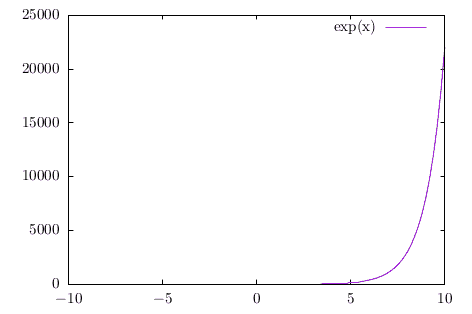

注意，在这个过程中，我们创建了辅助文件如 `*.eps` 和 `*.aux`，这是 LaTeX 预期的。

如果你想要直接从 gnuplot 读取输出 `.tex` 文件到另一个 LaTeX 文档中，你可以使用与上面相同的命令，但不带 `standalone` 选项，如下所示：

```
set terminal epslatex size 10cm, 10cm
set output "check.tex" 
```

这将输出另一个 "check.tex" 文件，该文件可以被其他 LaTeX 文档使用，以下是一个示例 tex 文件：

```
\documentclass[11pt]{article}

\usepackage{gnuplottex}
\begin{document}

\input{out}

\end{document} 
```

作为备注，`epslatex` 终端的单位是 cm、英寸或其他 LaTeX 所采用的任何其他测量单位中的实际单位。因此，你可能想要确保 gnuplot 生成的输出图像的实际大小适合你想要创建的文档。

## 从文件中绘制数据

算法存档中的每个需要绘制的算法也会输出一个数据文件用于此目的。尽管有大量的复杂数据格式可以写入和读取，但出于本文的目的，我们将专注于简单的 ASCII 数据。这并不适合任何数据密集型任务，并且有大量不同的存储格式和文件类型可供选择以适应您的特定目的；然而，算法存档旨在提供算法和方法的简单解释，我们不希望因为文件输入和输出而使过程过于复杂。

如果需要绘制多个数据集，它们也将被提供一个新文件，通常具有零填充的名称，如 `file_0000.dat`、`file_0001.dat`、`file_0002.dat` 等。我们将假设你选择的绘图器具有有限的三个维度功能，因此我们将专注于一维和二维数据的数据格式。

### 一维输出

在一维输出的情况下，数据文件将包含所有数字通过换行符分隔，如下所示：

```
0.5877852522924731
0.9510565162951535
0.9510565162951536
0.5877852522924732
1.2246467991473532e-16
-0.587785252292473
-0.9510565162951535
-0.9510565162951536
-0.5877852522924734
-2.4492935982947064e-16 
```

对于算法存档的目的，我们将称这些数据文件为`.dat`文件；然而，文件扩展名并不重要，你可以根据你的喜好将其命名为`.tsv`或`.csv`。

Gnuplot 可以以与绘制上述函数相同的方式读取此文件。因此，我们可以使用以下命令：

```
plot "sample_data.dat" with lines 
```

这将提供以下输出：

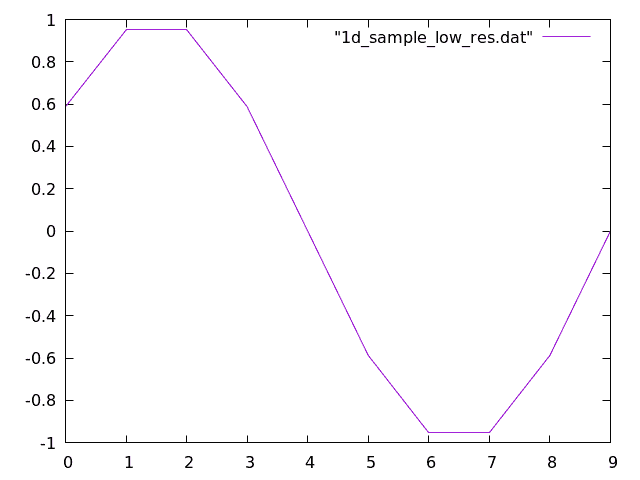

### 二维图像输出

在二维图像输出的情况下，数据文件可能类似，但这次，每个数字将由制表符分隔以表示不同的列条目，并由换行符表示行，如下所示：

```
1.0    2.0    3.0
4.0    5.0    6.0
7.0    8.0    9.0 
```

预期每行的列数不会变化，并且我们正在处理一个矩阵，该矩阵可以简单地作为一系列像素绘制，这些像素根据定义的颜色条按颜色缩放。

要在 Gnuplot 中创建二维图表，我们需要将视图设置为二维，然后使用我们设置为矩阵图像的`splot`函数进行三维绘图，如下所示：

```
set view map
splot "sample_data.dat" matrix with image 
```

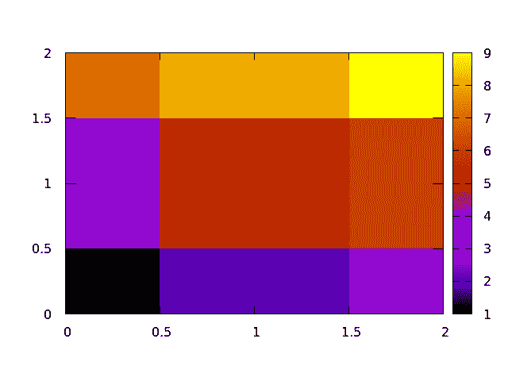

#### 改变颜色条

对于从数据文件中绘制图像，我们通常需要指定如何通过设置自定义颜色条来着色图像

在 Gnuplot 中，预定义的主题并不多，但为着色二维图像设置自己的主题相当容易。这是通过设置`调色板`来完成的，并且有一些在线[仓库](https://github.com/Gnuplotting/gnuplot-palettes)提供了许多调色板可供选择。简单来说，调色板是一个数值线，你可以设置一个颜色与任何你喜欢的值相关联，就像这个例子中一样：

```
set view map
set palette defined (0 0 0 1, 1 'red', 2 '#00FF00')
splot "2d_sample_low_res.dat" matrix with image 
```

整数值对应于颜色条上颜色的位置，颜色可以设置为已识别的单词（`blue`，`red`，`green`等），HTML 表示法（`'#FF0000'`，`'#00FF00'`，`'#0000FF'`等），或 RGB 颜色（`1 0 0`，`0 1 0`，`0 0 1`等）。此示例将输出以下图表：

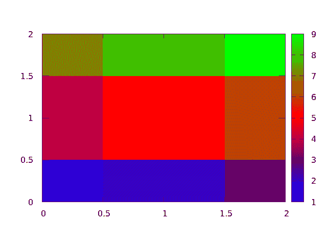

### 散点图

散点图是另一种用于可视化数据的有效方法，它在一个多维空间中绘制每个点。对于算法存档的目的，这个空间主要是二维的；然而，三维散点图也可以用于可视化三维数据集。如果需要三维散点图，我们将更新本节。

对于算法存档的目的，散点图数据将以一系列`x`和`y`对的形式输出，其中每一行都有一个`x`和`y`值，由制表符分隔。例如，一个数据文件可能看起来像这样：

```
0.7972009737623846    0.3548405553754319
0.8661873069668018    0.13307711243511333
0.7605752608745506    0.8686860241215444
0.7796784902862803    0.35589625594005647
0.23842162678327328    0.18541942067815853
0.23648916187439406    0.6351126027850458
0.6075688534409027    0.789554555806735
0.361307926046027    0.6338943724188091
0.3692102429804389    0.40610861857701597
0.30699091691896263    0.27999628668153087 
```

对于三维散点图，可能还有一个第三维。

在 gnuplot 中，使用提供的数据格式生成散点图很容易，例如，你可以使用以下命令：

```
p "scatterplot_data.dat" pt 7 
```

这将创建以下图像

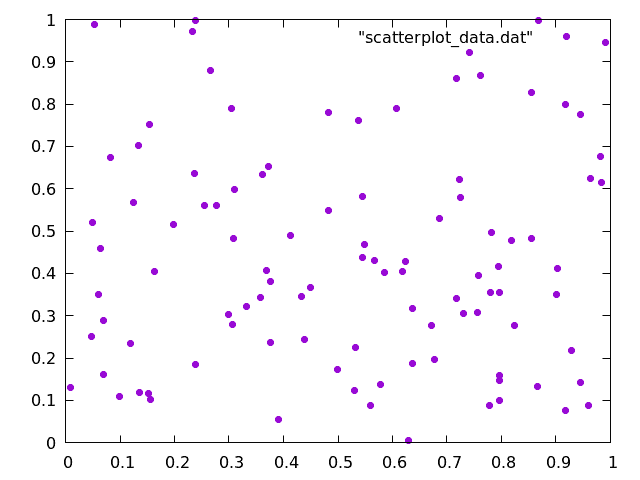

在这里，我们选择了`pointtype 7`，仅仅因为它与默认的十字相比更容易看到。

# 直方图

许多不同的算法会将数据输出为一系列点，在任何人能够理解数据之前，必须将这些点组织到单独的箱中。例如，这里是从 1 到 9 之间随机生成的 100 个整数的 10 个值：

```
2
5
5
5
1
3
2
6
3
1
6 
```

可能有人会问，“在这个数字序列中有多少个 1？”同样，有人可能想知道有多少个 1 与 2（或 3、4 等）的数量相比。为此，我们会创建一系列箱，然后遍历数据，每次找到相应的数字时，就在一个箱中加一。请注意，箱不一定是连续的整数值，并且对于浮点数，输入可能需要四舍五入。你甚至可以对直方图对象或任何可以分类的东西进行分类。

对于我们上面显示的数据，我们可能会创建一个看起来像这样的直方图：

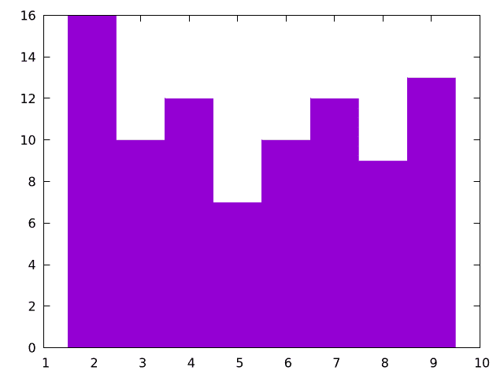

下面是一个生成它的绘图脚本：

```
# This is the size of each bin
bin_width = 1;

# This takes the data and determins which bin id it should fall into
bin_id(x) = floor(x/bin_width)

# This modifies each bin to be the correct width and also centers it over the 
#     correct number
bin(x) = bin_width * ( bin_id(x) + 0.5 )

# Starts the y-axis at 0
set yrange [0:]

# Removes legend
unset key

# Sets a fill style for "fillsteps"
set style fill solid 1.00 border

# The column number to be histogrammed is 1, change $1 to another number if 
#     you want to plot another column
plot '../../data/rand.dat' u (bin($1)):(1) t 'data' smooth frequency w fillsteps 
```

对于此，我们使用填充样式与`fillsteps`一起使用，以便直方图着色，但如果你只想显示线条，你可以移除填充样式并使用`histeps`代替。另一个需要注意的是，我们使用`t 'data' smooth frequency`，这实际上是将输入数字转换为一个小的、分箱的数组以进行绘图。

注意，此代码在浮点数输入的情况下会对输入进行四舍五入。

如果你想看到这种绘图生成分形图案，请参阅关于迭代函数系统的章节。

## 结论

绘图是计算科学中必不可少的强大工具。在这里，我们提供了绘制来自算法存档的任何数据的所有基本技能，并且我们将尽可能提供我们使用的绘图脚本。

### 参考文献列表

1.威廉姆斯，T 和凯利，C，《Gnuplot 5.0：交互式绘图程序》，官方 Gnuplot 文档，2015。

##### 代码示例

代码示例受 MIT 许可协议（在[LICENSE.md](https://github.com/algorithm-archivists/algorithm-archive/blob/main/LICENSE.md)中找到）许可。

##### 文本

本章的文本由[詹姆斯·施洛斯](https://github.com/leios)编写，并受[创意共享署名-相同方式共享 4.0 国际许可协议](https://creativecommons.org/licenses/by-sa/4.0/legalcode)许可。

[](https://creativecommons.org/licenses/by-sa/4.0/)

(https://creativecommons.org/licenses/by-sa/4.0/)

##### 图片/图形

+   图片"gnuplot_sine_wave"由[詹姆斯·施洛斯](https://github.com/leios)创建，并受[创意共享署名-相同方式共享 4.0 国际许可协议](https://creativecommons.org/licenses/by-sa/4.0/legalcode)许可。

+   图片"gnuplot_sine_cosine_wave"由[James Schloss](https://github.com/leios)创建，并授权于[Creative Commons Attribution-ShareAlike 4.0 国际许可协议](https://creativecommons.org/licenses/by-sa/4.0/legalcode)。

+   图片"gnuplot_sine_cosine_wave_range"由[James Schloss](https://github.com/leios)创建，并授权于[Creative Commons Attribution-ShareAlike 4.0 国际许可协议](https://creativecommons.org/licenses/by-sa/4.0/legalcode)。

+   图片"gnuplot_sine_cosine_notics"由[James Schloss](https://github.com/leios)创建，并授权于[Creative Commons Attribution-ShareAlike 4.0 国际许可协议](https://creativecommons.org/licenses/by-sa/4.0/legalcode)。

+   图片"gnuplot_sine_cosine_customtics"由[James Schloss](https://github.com/leios)创建，并授权于[Creative Commons Attribution-ShareAlike 4.0 国际许可协议](https://creativecommons.org/licenses/by-sa/4.0/legalcode)。

+   图片"exp_fn"由[James Schloss](https://github.com/leios)创建，并授权于[Creative Commons Attribution-ShareAlike 4.0 国际许可协议](https://creativecommons.org/licenses/by-sa/4.0/legalcode)。

+   图片"exp_fn_log"由[James Schloss](https://github.com/leios)创建，并授权于[Creative Commons Attribution-ShareAlike 4.0 国际许可协议](https://creativecommons.org/licenses/by-sa/4.0/legalcode)。

+   图片"gnuplot_sine_cosine_log"由[James Schloss](https://github.com/leios)创建，并授权于[Creative Commons Attribution-ShareAlike 4.0 国际许可协议](https://creativecommons.org/licenses/by-sa/4.0/legalcode)。

+   图片"gnuplot_sine_cosine_label"由[James Schloss](https://github.com/leios)创建，并授权于[Creative Commons Attribution-ShareAlike 4.0 国际许可协议](https://creativecommons.org/licenses/by-sa/4.0/legalcode)。

+   图片"gnuplot_sine_cosine_nokey"由[James Schloss](https://github.com/leios)创建，并授权于[Creative Commons Attribution-ShareAlike 4.0 国际许可协议](https://creativecommons.org/licenses/by-sa/4.0/legalcode)。

+   图片"gnuplot_sine_cosine_movekey"由[James Schloss](https://github.com/leios)创建，并授权于[Creative Commons Attribution-ShareAlike 4.0 国际许可协议](https://creativecommons.org/licenses/by-sa/4.0/legalcode)。

+   图片"gnuplot_sine_cosine_movekey2"由[James Schloss](https://github.com/leios)创建，并授权于[Creative Commons Attribution-ShareAlike 4.0 International License](https://creativecommons.org/licenses/by-sa/4.0/legalcode)。

+   图片"gnuplot_sine_cosine_title"由[James Schloss](https://github.com/leios)创建，并授权于[Creative Commons Attribution-ShareAlike 4.0 International License](https://creativecommons.org/licenses/by-sa/4.0/legalcode)。

+   图片"gnuplot_sine_cosine_square"由[James Schloss](https://github.com/leios)创建，并授权于[Creative Commons Attribution-ShareAlike 4.0 International License](https://creativecommons.org/licenses/by-sa/4.0/legalcode)。

+   图片"gnuplot_test"由`gnuplot test`命令创建，gnuplot 的版权信息见[这里](https://sourceforge.net/p/gnuplot/gnuplot-main/ci/master/tree/Copyright)。

+   图片"gnuplot_sine_cosine_linetype"由[James Schloss](https://github.com/leios)创建，并授权于[Creative Commons Attribution-ShareAlike 4.0 International License](https://creativecommons.org/licenses/by-sa/4.0/legalcode)。

+   图片"gnuplot_exp_tex"由[James Schloss](https://github.com/leios)创建，并授权于[Creative Commons Attribution-ShareAlike 4.0 International License](https://creativecommons.org/licenses/by-sa/4.0/legalcode)。

+   图片"gnuplot_1d_sample"由[James Schloss](https://github.com/leios)创建，并授权于[Creative Commons Attribution-ShareAlike 4.0 International License](https://creativecommons.org/licenses/by-sa/4.0/legalcode)。

+   图片"gnuplot_2d_sample"由[James Schloss](https://github.com/leios)创建，并授权于[Creative Commons Attribution-ShareAlike 4.0 International License](https://creativecommons.org/licenses/by-sa/4.0/legalcode)。

+   图片"gnuplot_2d_sample_colorbar"由[James Schloss](https://github.com/leios)创建，并授权于[Creative Commons Attribution-ShareAlike 4.0 International License](https://creativecommons.org/licenses/by-sa/4.0/legalcode)。

+   图片"gnuplot_scatterplot"由[James Schloss](https://github.com/leios)创建，并授权于[Creative Commons Attribution-ShareAlike 4.0 International License](https://creativecommons.org/licenses/by-sa/4.0/legalcode)。

+   图片"gnuplot_histogram"由[James Schloss](https://github.com/leios)创建，并授权于[Creative Commons Attribution-ShareAlike 4.0 International License](https://creativecommons.org/licenses/by-sa/4.0/legalcode)。

##### 提交拉取请求

以下拉取请求已修改本章的文本或图形：

+   622：本章的初始 PR
