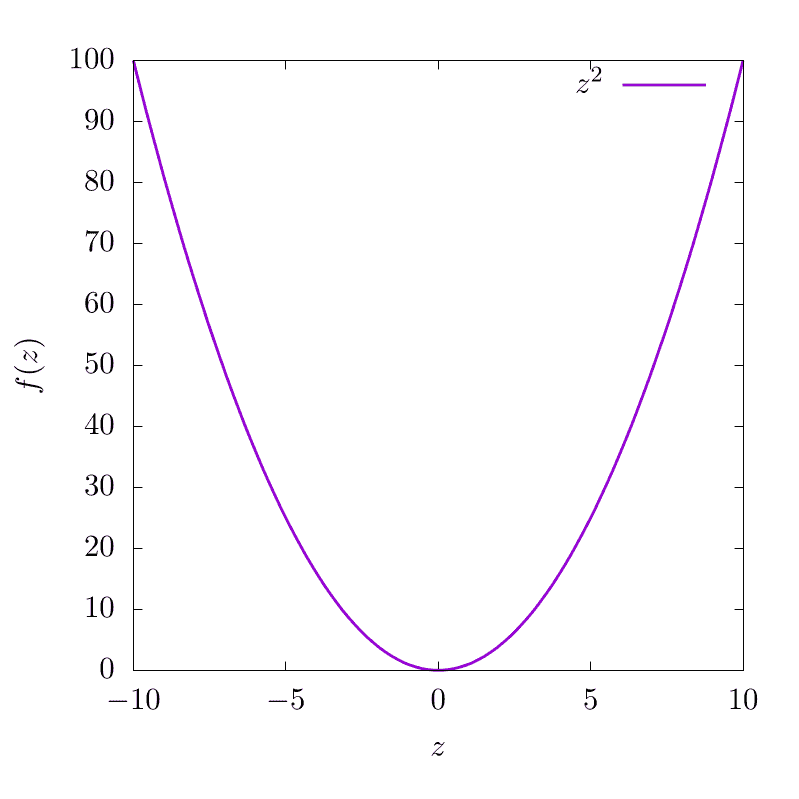
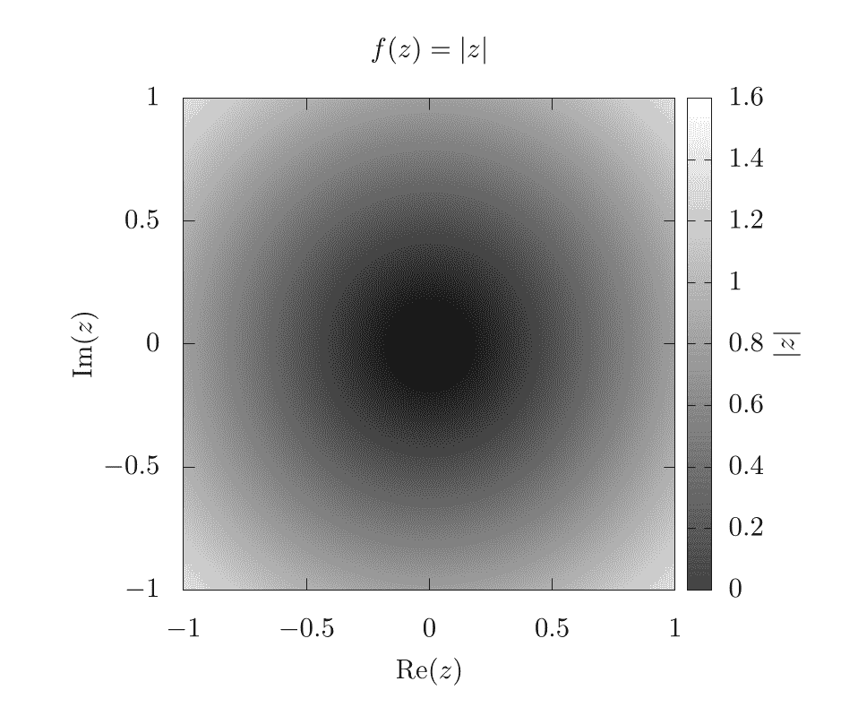
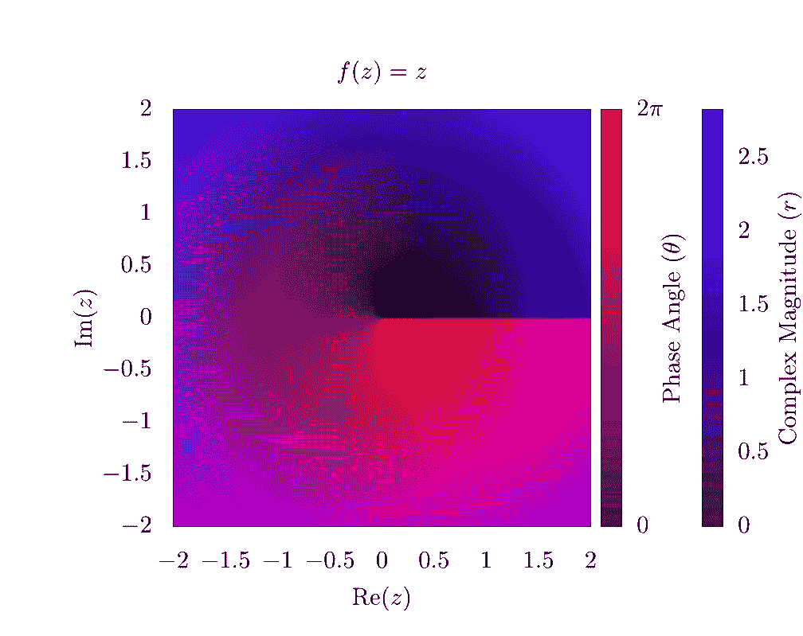
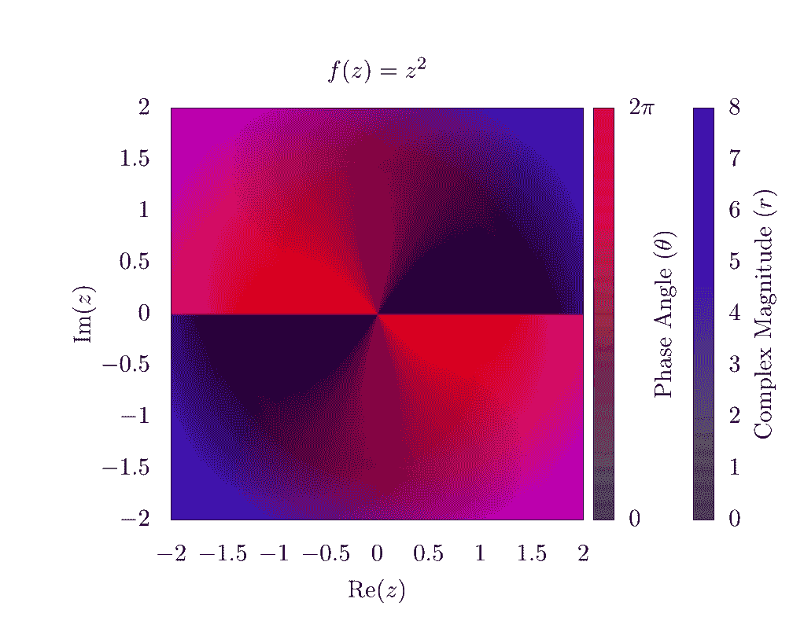
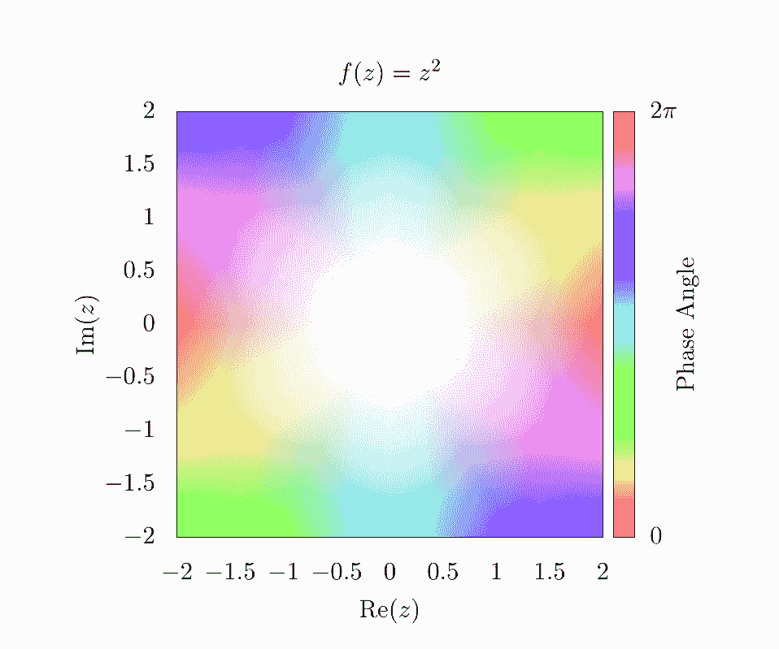
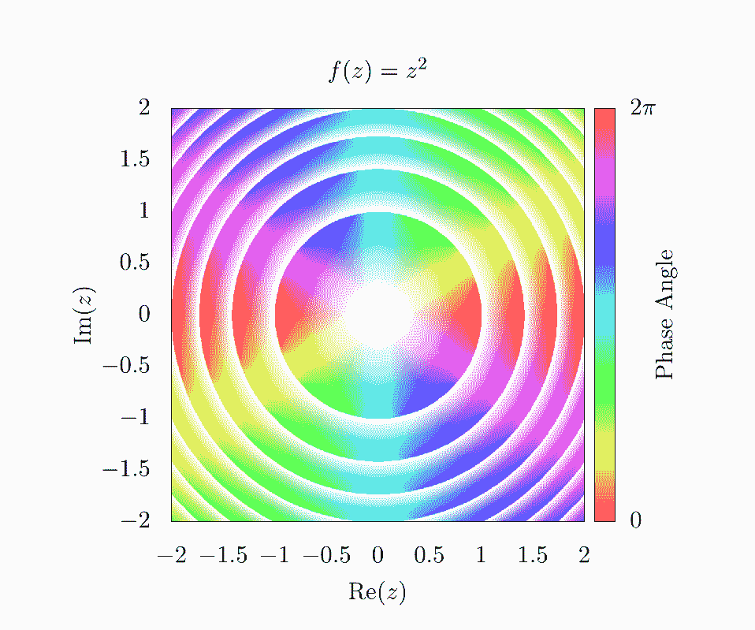
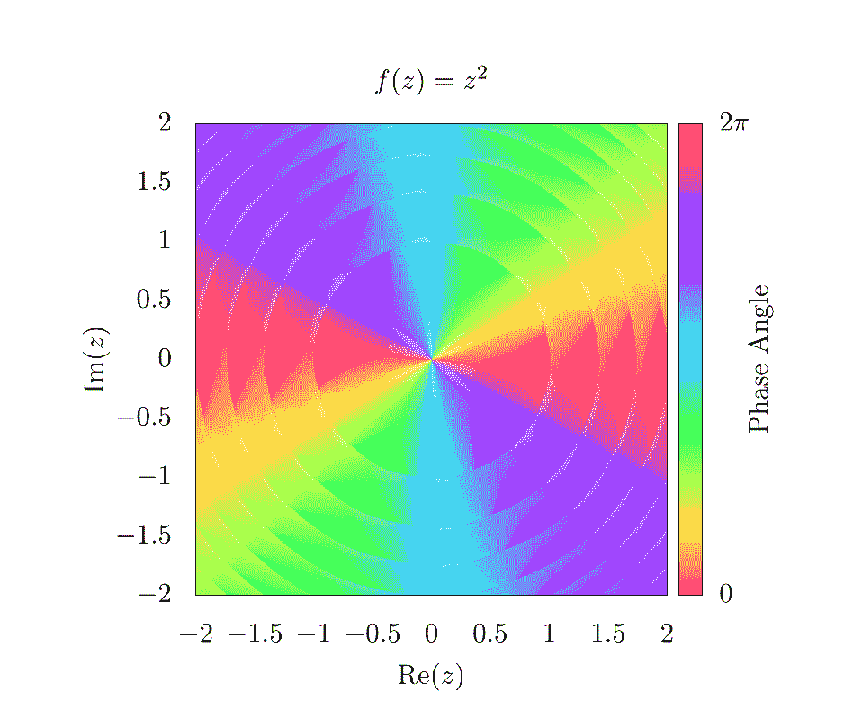
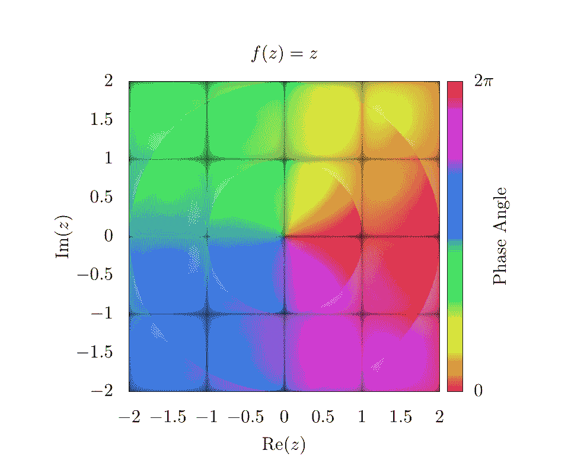
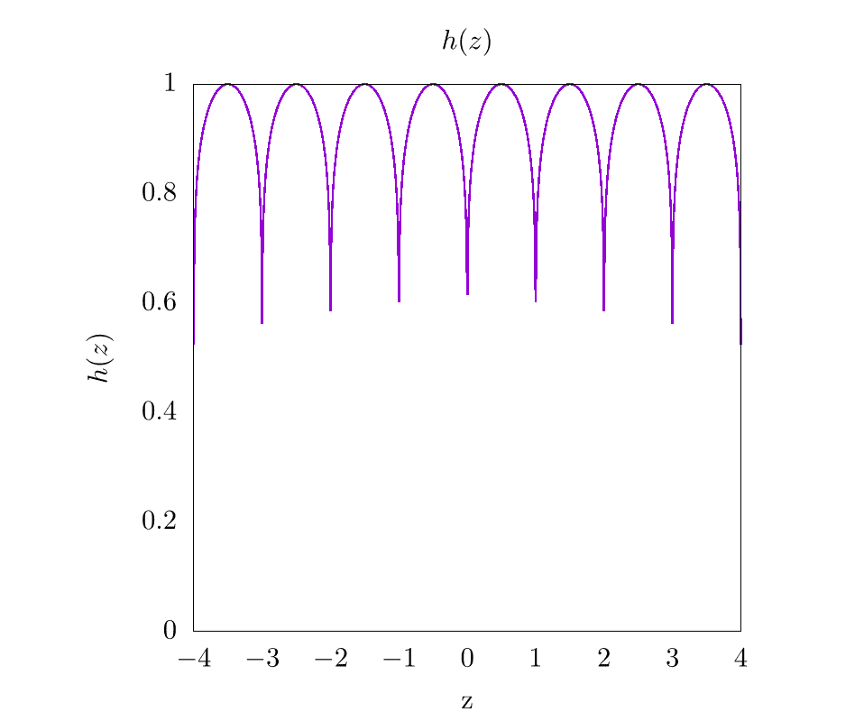
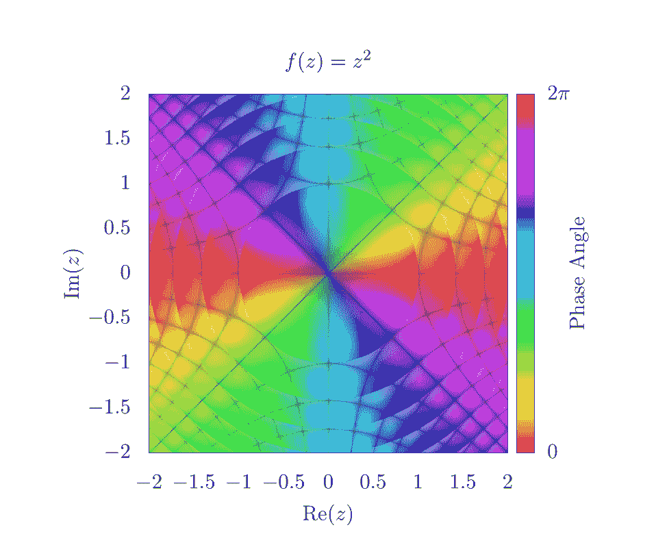

# 领域着色

> [原文链接](https://www.algorithm-archive.org/contents/domain_coloring/domain_coloring.html)

领域着色是一种比绘图章节中概述的绘图技术更复杂的绘图技术，用于绘制输入和输出都具有虚部和实部的复数函数。在本章的代码中，我们将专注于那些能够轻松绘制二维图像或热图的编程语言，而不是用于数值计算的编程语言。也就是说，本章肯定会有 gnuplot 的代码实现，但不太可能在内置绘图功能的 C、Fortran 或 Java 中实现。

首先，想象以下函数：。在这种情况下，我们可以创建一个看起来像这样的图表：



这表明，对于沿 的各种输入值，我们有来自 的不同函数输出。对于这个函数， 是纯实空间，因此输出也在实空间。现在让我们想象另一个具有复数输入 ，但纯实数输出的函数：

在这种情况下，这可以绘制成如下二维数据集：



在这里，-轴和-轴分别代表输入变量的虚部和实部。颜色条表示 .

到目前为止，我们可以开始看到问题。如果 的输出也需要绘制实部和虚部，那么我们需要四个维度来适当地表示整个函数空间，一个轴用于输入的实部，另一个轴用于输入的虚部以及 的输出。不幸的是，脆弱的人类心智无法在没有投影到低维空间的情况下理解四个空间维度，因此我们需要进行改进。

我们通过假设复数输出可以以下形式表示来做到这一点：

其中， 是复数幅度， 是复数相位。这是复平面上圆的公式，我们可以很容易地找到 和 如下：

一旦我们以这种形式得到复数函数输出，然后我们根据至少有 2 个独立维度的颜色空间对输出域进行着色，如 RGB（红色、绿色、蓝色），或 HSV（色调、饱和度、亮度）[[1]](#cite-1）。颜色空间的选择完全取决于用户认为最直观的视觉感受。在任何情况下，颜色系统的一个维度将用于表示复数幅度，另一个维度将用于表示输出复数相位。网格将表示这些函数的实部和虚部输入。也就是说，我们将 2D 复平面上的每个值都代入函数，然后根据函数输出对每个像素进行着色。

以一个例子来说明，让我们看看我们可以使用的最简单的函数，但在这个情况下是 。如果我们使用 RGB 颜色方案，其中红色代表 ，蓝色代表 ，我们可以生成以下图像：



作为备注，在水平轴上有一个明显的相不连续性，这是由于复相绕原点旋转的事实，范围从 0（清晰）到（红色）。此外，由于函数的幅度随着我们从原点向外移动而线性增加，因此图表的边缘是蓝色的。 

如果我们观察函数 ，我们可以生成一个类似的图表：



在这里，很明显，复相绕原点旋转了两次，从而在上方叠加形成了两个独立的相不连续性。这表明存在相绕。对于某些目的，例如对无粘性流体的涡旋追踪，这种可视化是理想的，因为涡旋正好位于相不连续性的中心 [[2]](#cite-2) [[3]](#cite-3)。对于其他目的，不连续性在视觉上会分散注意力，因此许多人使用 HSV 方案来绘制复函数 [[4]](#cite-4) [[5]](#cite-5) [[6]](#cite-6)。因此，这里展示的是相同的函数，但使用色调来表示复相，饱和度来表示幅度：



在这个图表中，HSV 的值始终设置为 1。当观察图表的边缘时，色调会迅速变化，但每种颜色在相对边缘都有镜像。这表明我们在 RGB 图表中看到的相绕。此外，由于复幅度随着我们远离图表中心而增加，饱和度也增加。因此，图表的中心完全被冲淡！我们需要在后续的图表中修复这个问题，以便它们更能代表实际数据。

一种简单的方法来显示复幅度增加而不牺牲相信息，是使用等高线。基本上，在幅度的每个整数值，我们想要绘制某种类型的线。有几种生成这些线的方法，一种简单的方法是使用替代的阴影函数，如下所示：

这将生成以下图像：



这个函数将基本上创建一个平滑的渐变，但由于取整操作，饱和度将在幅度每个整数值之间从 0 到 1 变化。在这里，很明显，幅度随着从原点向外的增加而增加；然而，由于饱和度波动很大，很难看到每个等高线旁边的相模式。这可以通过简单地给阴影函数添加一个偏移量来修复，如下所示，

这将生成以下图像：



这意味着饱和度将从  到 1 而不是从 0 到 1 波动，这使得在轮廓旁边看到相位信息变得容易得多。再次强调，有无数种不同的方式可以玩转这些方程，所以请随意使用您想要的任何函数！只要使用某种形式的舍入操作来为幅度确定某种整数值，就应能够创建各种类型的轮廓。

到目前为止，改变饱和度会显示复数幅度的变化，改变色调会显示复数相位的变化。不幸的是，幅度和相位都不能直接显示输出在实数或虚数空间中的情况。为了显示这一点，我们可能想要绘制网格线，当输出函数的虚部或实部为整数值时，将这些像素着色为黑色。

例如，让我们回到一个更简单的函数 。如果我们在这个图上绘制对应于输出中整数值的线，我们得到一个简单的网格



如前所述，选择用于创建网格线的函数是相当任意的。选择一个对于所有整数值急剧下降到 0 或在 1 处达到峰值的功能很重要，然后我们只需将  的值代入此函数。为了本章的目的，我们选择了以下函数

其中  是某个阈值值，在我们的图中  被设置为 0.1。以下是在  为  时的  的图像：



因此，将所有这些放在一起并回到函数  的作用上，我们发现以下图像。



在这里，穿过中心的斜线代表复数轴上  的整数值，而垂直和水平线代表实数轴上  的整数值。确定哪些线对应哪些整数值的一个简单方法是将某些值代入  中。例如，在  处有一条黑色线，其中 ，这意味着该轮廓线上的所有值都受到一个精确为 2 的虚部值的约束。

总体来说，有大量的有趣方式来绘制复数函数并制作出非常吸引人和美丽的图像！在本文的其余部分，当描述大量使用复数空间的方法时，我们将使用域着色。

## 视频解释

这里是一个描述域着色的视频：

[视频链接](https://www.youtube-nocookie.com/embed/EbanExb75mc)

## 示例代码

这里是生成  的域着色输出的完整脚本。

```
# setting output to file of size 800 x 800
set terminal pngcairo size 1000, 1000 
set output 'domain.png'

# sets title for full plot
set title 'f(z)=z²'

# removes legend
unset key

# projects image onto 2D plane
set view map

# sets aspect ratio of plot to be square 
set size square

# sets x and y range and labels
set xrange[-2:2]
set yrange[-2:2]

set xlabel "Re(z)"
set ylabel "Im(z)"

# scaling the x, y, and colorbar tics to zero so they are not seen in the plot
set xtics border scale 0,0
set ytics border scale 0,0
set cbtics border scale 0,0

# sets tics in color bar at 0 and 2pi
set cbtics ("0" -3.14159, '2pi' 3.14159)

set cblabel "Phase Angle" 
set cbrange [ -3.14159 : 3.14159 ]

# use hsv for colorbar and set palette to use full hsv space
set palette model HSV
set palette defined ( 0 0 1 1, 1 1 1 1 )

# setting isosamples for output grid and samples for input grid
set isosamples 2000, 2000
set samples 2000, 2000

# setting functions necessary for domain coloring
# setting threshold for gridlines. Smaller threshold will make smaller lines
thresh = 0.1
f(z) = z**2

# atan2 returns a range from -pi to pi, so we need to add pi, but this offsets
# the value by 180 degrees, so we also imput (-y, -x) for another 180 degrees
# to invert rotation
angle(x,y) = (pi + atan2(-y,-x)) / (2*pi)

# complex magnitude
r(x,y) = sqrt(x*x + y*y)

# complex phase and magnitude
theta(x,y) = atan2(y,x)
z(x,y) = r(x,y)*exp(theta(x,y)*sqrt(-1))

# imaginary and real output functions
imaginary_f(z) = imag(f(z))
real_f(z) = real(f(z))

# magnitude contours
magnitude_shading(x,y) = 0.5 + 0.5*(abs(f(z(x,y)))-floor(abs(f(z(x,y)))))

# gridlines
gridlines(x,y) = (abs(sin(real_f(z(x,y))*pi)**thresh) \
                  * abs(sin(imaginary_f(z(x,y))*pi))**thresh)

# overall coloring function
color(x,y) = hsv2rgb(angle(real_f(z(x,y)), imaginary_f(z(x,y))), \
                     magnitude_shading(x,y), \
                     gridlines(x,y))

save_encoding = "utf8"

# Last datafile plotted: "++"
# In this case, it means, "plot the data file created with the
#                          samples and isosamples"
splot '++' using 1:2:(color($1,$2)) with pm3d lc rgb variable nocontour 
```

```
 import numpy as np
import matplotlib.pyplot as plt
import matplotlib.colors
from matplotlib.cm import ScalarMappable

def f(z):
    return z**2

def magnitude_shading(f_val):
    f_val_abs = np.abs(f_val)
    return 0.5 + 0.5 * (f_val_abs - np.floor(f_val_abs))

def gridlines(f_val, threshold):
    return (np.abs(np.sin(np.pi * np.real(f_val))) ** threshold
            * np.abs(np.sin(np.pi * np.imag(f_val))) ** threshold)

def color(f_val, threshold):
    hue = (np.pi - np.angle(f_val)) / (2.0 * np.pi)
    saturation = magnitude_shading(f_val)
    value = gridlines(f_val, threshold)

    # Currently we have a tuple of 2D-arrays (hue, saturation, value).
    # This makes it a 2D-array of tuples, which the conversion function requires.
    hsv = np.moveaxis((hue, saturation, value), 0, -1)
    return matplotlib.colors.hsv_to_rgb(hsv)

if __name__ == "__main__":
    # Create a new figure containing a single plot
    fig, axes = plt.subplots(1, 1)

    # Set the title for the plot
    axes.set_title("$f(x)=z²$")

    # Create color bar
    cbar = fig.colorbar(
        ScalarMappable(matplotlib.colors.Normalize(0.0, 2.0 * np.pi), "hsv"),
        ax=axes,
        label="Phase Angle")

    # Set x and y labels
    axes.set_xlabel("$Re(z)$")
    axes.set_ylabel("$Im(z)$")

    # Set color bar tick locations and labels
    cbar.set_ticks([0.0, np.pi, 2.0 * np.pi])
    cbar.set_ticklabels(["$0.0$", "$\pi$", "$2\pi$"])

    # Hide x and y ticks
    for tick in axes.get_xticklines():
        tick.set_visible(False)

    for tick in axes.get_yticklines():
        tick.set_visible(False)

    # Create a 500x500 input grid
    coords = np.linspace(-2.0, 2.0, 500)
    z_real, z_imag = np.meshgrid(coords, coords)
    z = z_real + 1j * z_imag

    # Calculate function values
    f_val = f(z)

    # Map function values to colors
    colors = color(f_val, 0.1)

    # Plot the colors
    #   extent=(-2.0, 2.0, -2.0, 2.0) sets the x and y ranges
    #   origin="lower" places index (0,0) of the color array in the lower-left corner
    #   aspect="equal" ensures that the plot is square
    axes.imshow(
        colors,
        extent=(-2.0, 2.0, -2.0, 2.0),
        origin="lower",
        aspect="equal")

    # Save output
    fig.savefig("domain.png") 
```

### 参考文献列表

1.[维基百科：HSL 和 HSV](https://en.wikipedia.org/wiki/HSL_and_HSV)，2020。2.Schloss, James，在图形处理单元上模拟量子系统的并行分裂傅里叶技术，2019。3.Pethick, Christopher J 和 Smith, Henrik，稀薄气体的玻色-爱因斯坦凝聚，*剑桥大学出版社*，2008。4.Wegert, Elias，视觉复变函数：使用相空间图引入，*斯普林格科学和商业媒体*，2012。5.Poelke, Konstantin 和 Polthier, Konrad，复变函数的域着色。6.Lundmark, Hans，使用域着色可视化复变解析函数，2004。

## 许可证

##### 代码示例

代码示例授权于 MIT 许可协议（可在[LICENSE.md](https://github.com/algorithm-archivists/algorithm-archive/blob/main/LICENSE.md)中找到）。

##### 文本

本章的文本由[James Schloss](https://github.com/leios)编写，并授权于[Creative Commons Attribution-ShareAlike 4.0 国际许可协议](https://creativecommons.org/licenses/by-sa/4.0/legalcode)。

[](https://creativecommons.org/licenses/by-sa/4.0/)


##### 图片/图形

+   图片"z2"由[James Schloss](https://github.com/leios)创建，并授权于[Creative Commons Attribution-ShareAlike 4.0 国际许可协议](https://creativecommons.org/licenses/by-sa/4.0/legalcode)。

+   图片"absz"由[James Schloss](https://github.com/leios)创建，并授权于[Creative Commons Attribution-ShareAlike 4.0 国际许可协议](https://creativecommons.org/licenses/by-sa/4.0/legalcode)。

+   图片"rgb1"由[James Schloss](https://github.com/leios)创建，并授权于[Creative Commons Attribution-ShareAlike 4.0 国际许可协议](https://creativecommons.org/licenses/by-sa/4.0/legalcode)。

+   图片"rgb2"由[James Schloss](https://github.com/leios)创建，并授权于[Creative Commons Attribution-ShareAlike 4.0 国际许可协议](https://creativecommons.org/licenses/by-sa/4.0/legalcode)。

+   图片"hsv1"由[James Schloss](https://github.com/leios)创建，并授权于[Creative Commons Attribution-ShareAlike 4.0 国际许可协议](https://creativecommons.org/licenses/by-sa/4.0/legalcode)。

+   图片"hsv2"由[James Schloss](https://github.com/leios)创建，并授权于[Creative Commons Attribution-ShareAlike 4.0 国际许可协议](https://creativecommons.org/licenses/by-sa/4.0/legalcode)。

+   图片"hsv3"由[James Schloss](https://github.com/leios)创建，并授权于[Creative Commons Attribution-ShareAlike 4.0 国际许可协议](https://creativecommons.org/licenses/by-sa/4.0/legalcode)。

+   图片 "hsv4" 由 [James Schloss](https://github.com/leios) 创建，并授权于 [Creative Commons Attribution-ShareAlike 4.0 国际许可协议](https://creativecommons.org/licenses/by-sa/4.0/legalcode)。

+   图片 "shade" 由 [James Schloss](https://github.com/leios) 创建，并授权于 [Creative Commons Attribution-ShareAlike 4.0 国际许可协议](https://creativecommons.org/licenses/by-sa/4.0/legalcode)。

+   图片 "hsv5" 由 [James Schloss](https://github.com/leios) 创建，并授权于 [Creative Commons Attribution-ShareAlike 4.0 国际许可协议](https://creativecommons.org/licenses/by-sa/4.0/legalcode)。

##### 提交请求

以下提交请求已修改了本章的文本或图形：

+   无
