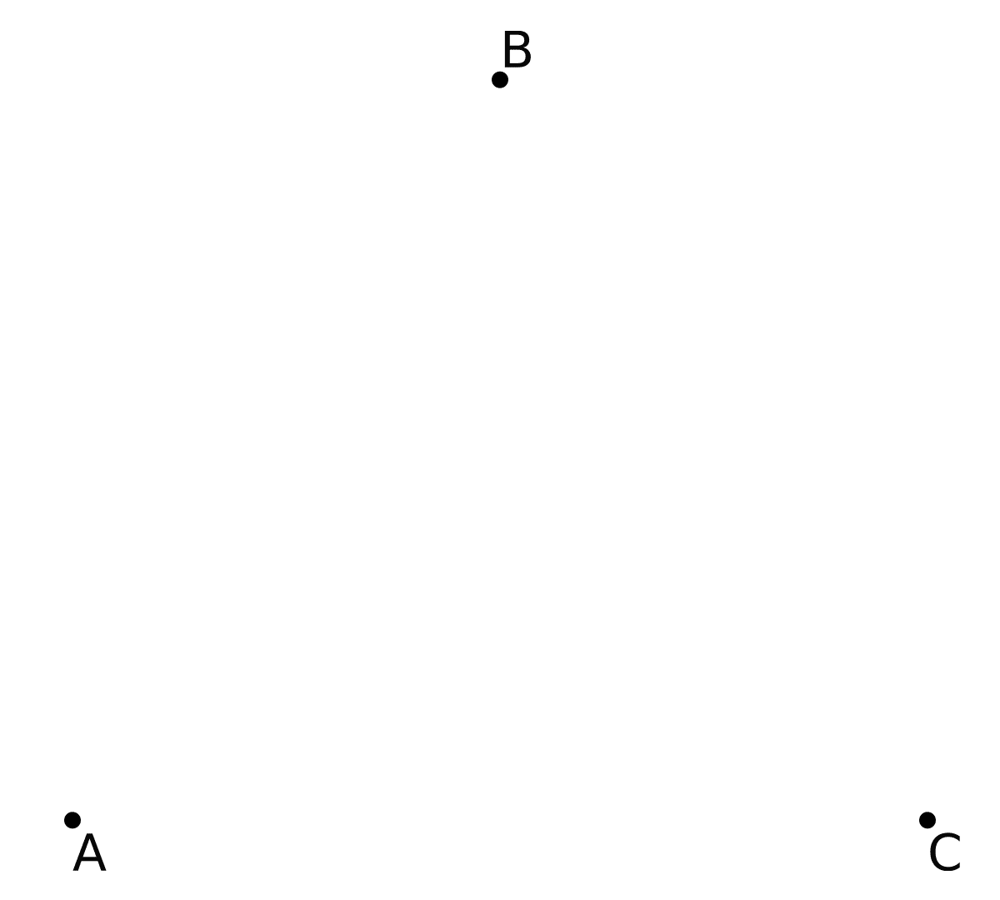
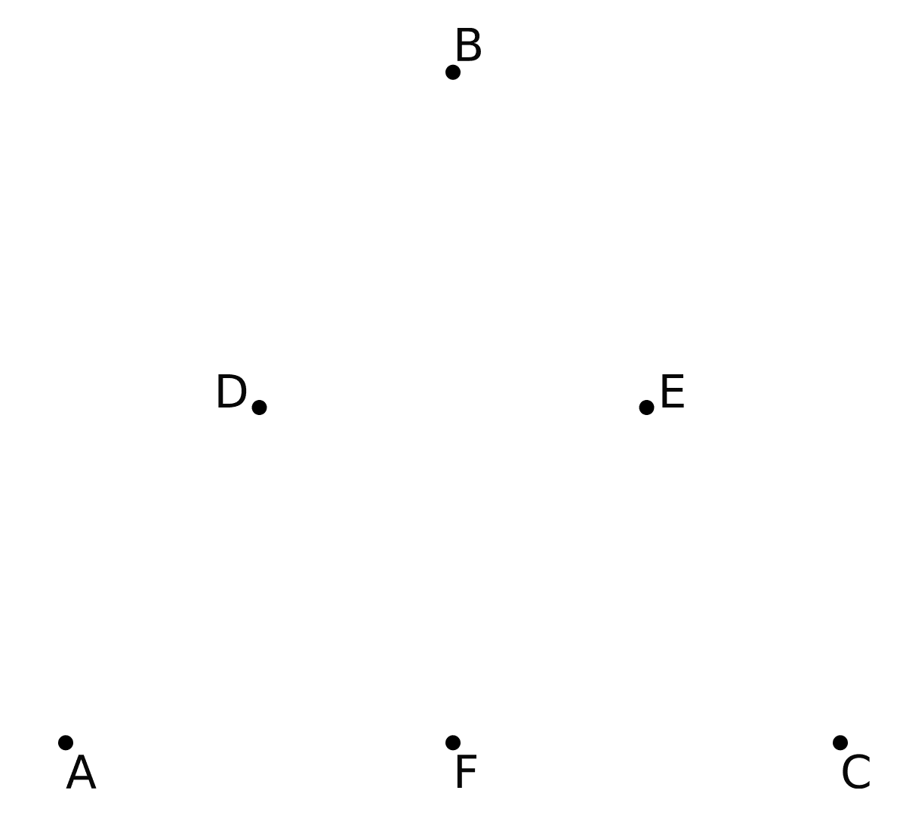
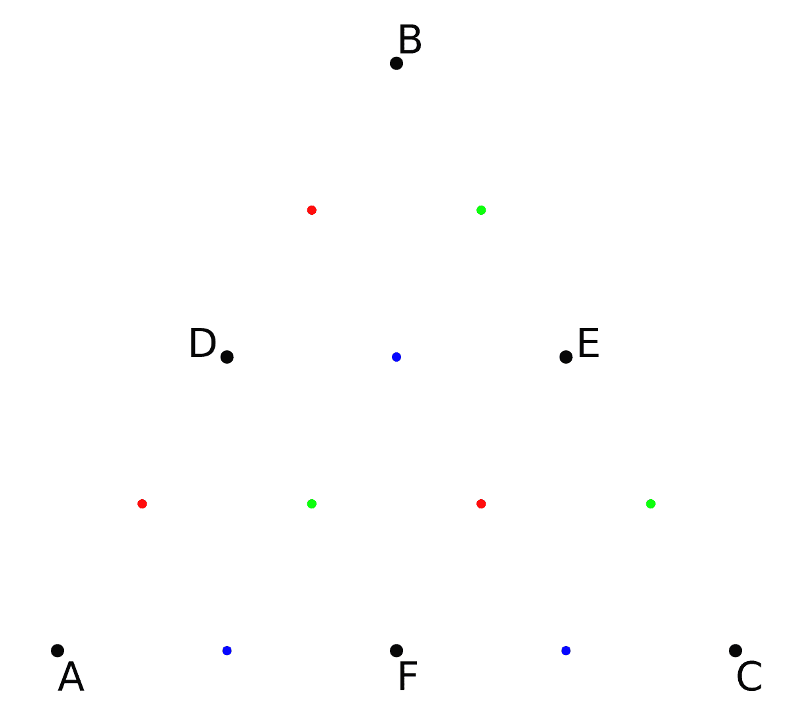
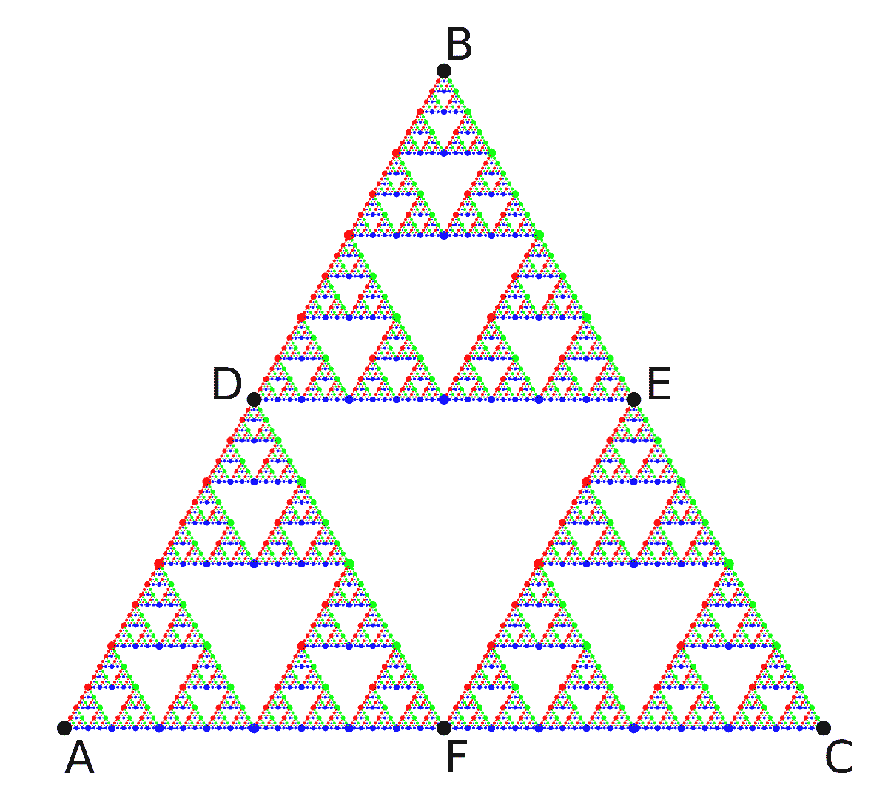
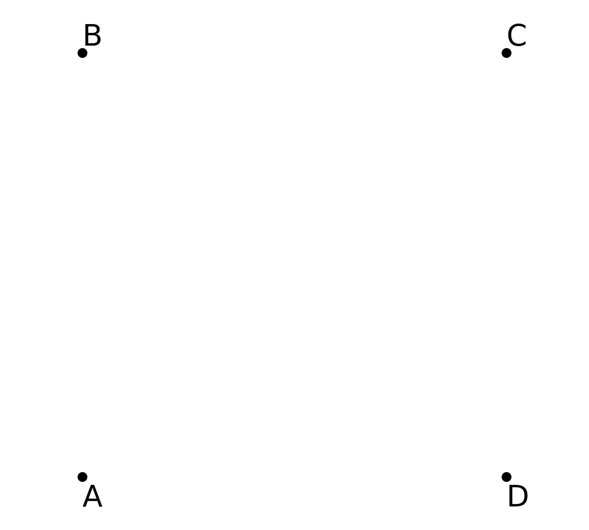
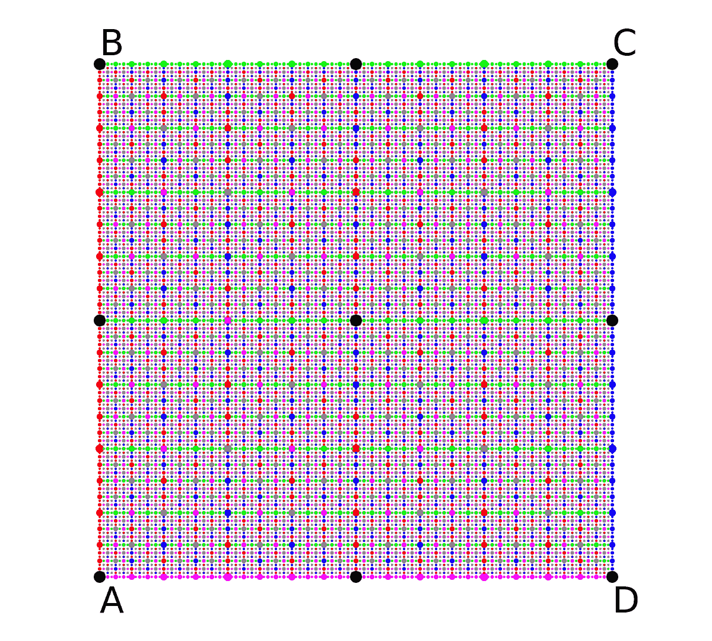
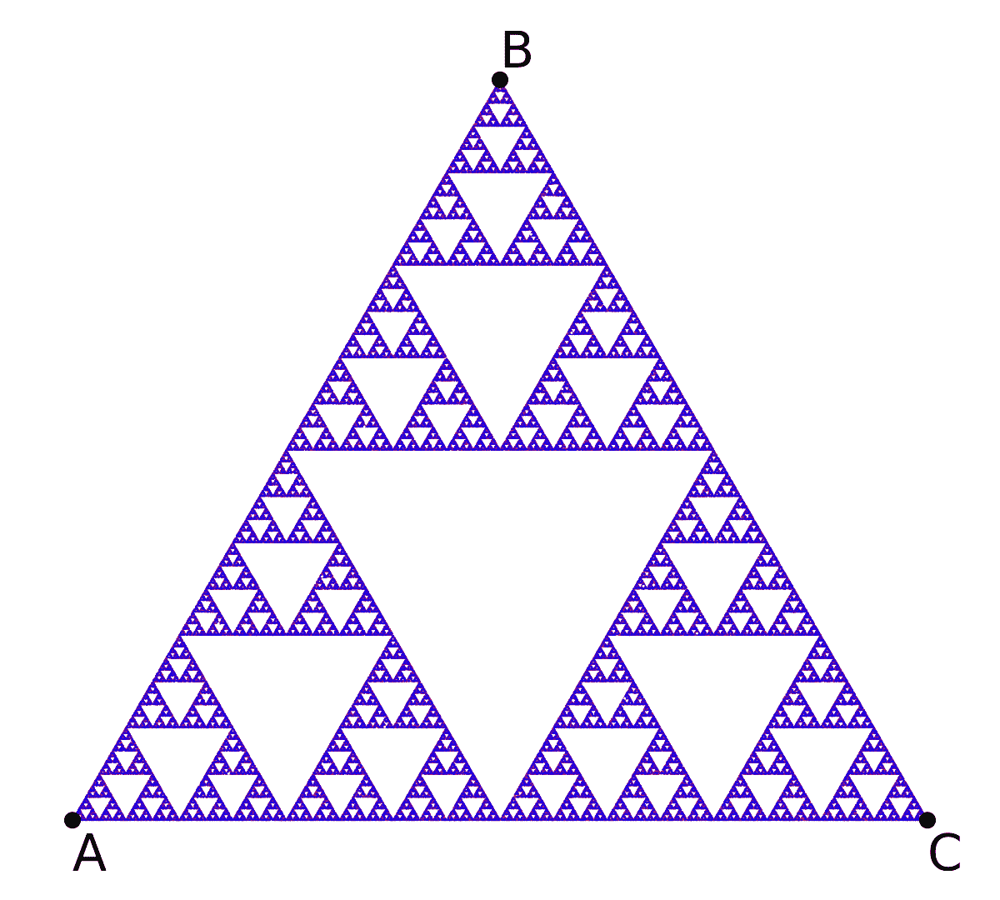

# 迭代函数系统

> 原文：[`www.algorithm-archive.org/contents/IFS/IFS.html`](https://www.algorithm-archive.org/contents/IFS/IFS.html)

在我们开始之前，有一些简要的说明：

1.  对于本章，我们将遵循绘图章节设定的方法论。也就是说，本章中展示的代码将输出另一个可以被外部绘图器轻松绘制的文件。如果您喜欢使用您选择的语言提供的绘图器，请修改提供的代码以实现这一点。

1.  本章目前是绘图章节的一个子章节，但未来我们可能会通过其他分形生成方法扩展算法档案，特别是需要创建一个新的分形章节。这将包括一个对分形有更严格定义的章节，这在接下来的讨论中很大程度上是缺失的。如果您对此感兴趣，请告诉我们！

在本章中，我们将向您展示如何通过迭代函数系统（IFSs）制作最著名的分形之一：西尔皮斯基三角形。我们还将介绍一些有趣的概念，供进一步探索，例如混沌游戏、Hutchinson 算子和吸引子。

## 西尔皮斯基三角形

要开始讨论迭代函数系统（IFSs），我们首先将讨论可能是目前已知最著名的分形之一：西尔皮斯基三角形（如下所示）：


这张图显然是一组三角形嵌入在一个更大的三角形中，这样它可以不断地被切割成三个相同的部分，同时仍然保持其内部结构。这个想法被称为自相似性 [[1]](#cite-1)，通常这是分形首先吸引观众注意的方面。实际上，分形及其数学基础有大量的应用，例如估计英国的 coastline [[2]](#cite-2)，识别指纹 [[3]](#cite-3)，以及图像压缩 [[4]](#cite-4)[[5]](#cite-5)。在许多更严格的定义中，分形可以被描述为任何具有非整数豪斯多夫维度的系统 [[6]](#cite-6)[[7]](#cite-7)[[8]](#cite-8)。尽管这是一个极其有趣的概念，但本章的讨论将专注于通过迭代函数系统生成分形模式的方法。

首先，想象从三个点创建一个三角形，分别是 \( P_1, P_2, P_3 \)。这些点可以任意选择，但在这个对话中，我们将它们限制为等边三角形的顶点，如下所示：



现在，让我们创建三个可以作用于二维空间的不同函数：

每个函数将读取空间中的特定位置（在这里，）并输出一个新位置，该位置是输入位置和 ， ，或 之间的中点。所有这些函数的并集（可用于使用的所有可能函数的集合）通常表示为*Hutchinson 算子* [[9]](#cite-9)[[10]](#cite-10)，在这种情况下，它看起来像这样：

通过迭代使用此算子，我们可以遍历集合中所有可能的移动。例如，让我们生成 3 个新点，这些点位于 和 之间，  和 之间，以及 和 之间，分别称为 ， ，和 。如下所示：



从这里，每个新点（, , 和 ）将产生 3 个孩子，每个孩子将根据 Hutchinson 算子中的三个可能函数之一移动，如下所示：

<res/IFS_triangle_vid_1.mp4>



在这里，所有红色孩子来自 ，绿色孩子来自  ，蓝色孩子来自 。在这个阶段，孩子将产生 3 个更多的孩子，每个孩子将根据不同的函数移动。这些孩子将产生更多的孩子，并相应地行动。随着这个过程不断进行，我们开始看到一个有趣的模式形成：

<res/IFS_triangle_vid_2.mp4>



这是 Sierpinski 三角形。起初，它可能看起来像数学魔术，一套简单的 3 个函数可以创造出这样的图案。毕竟，为什么没有一个孩子会迁移到结构中的空隙？这需要一些思考，但最简单的答案是，Hutchinson 算子内的任何函数都不允许孩子进入这些空间；因此，没有一个孩子可以进入。

## 那么，正方形呢？

当我了解到 Sierpinski 三角形可以从 3 个简单的函数生成时，我开始思考其他形状。我们能创造出分形正方形吗？六边形？圆形？这些形状*看起来*是上述三角形 Hutchinson 算子的自然扩展，但有一个小问题...

首先，让我们取 4 个点， , , , 和 ，这次位于正方形的四个顶点上，如下所示：



以类似的方式，我们将创建 4 个函数，分别用 , 和  表示，使得：

如果我们然后创建 5 个初始点，这些点位于所有顶点之间，并允许这些点像以前一样不断产生孩子，会发生一些奇怪的事情：

<res/IFS_square_vid_1.mp4>



我们实际上看到的是一个正方形的正方形。我们之前得到的自相似结构怎么了？为什么这不是更有趣？

我目前最好的回答是，一些 Hutchinson 算子很有趣，而另一些则不然。尽管如此，这个正方形比它最初看起来更有趣，但要了解原因，我们需要以稍微不同的方式使用 Hutchinson 算子。

## 混沌游戏和吸引子

到目前为止，我们为 Sierpinski 三角形和正方形的可视化都付出了高昂的计算成本。每次迭代，每个孩子都会生成 3 个或 4 个新的孩子。这种指数级的增长意味着我们将很快需要跟踪数百万个孩子！实际上，为了处理这个问题，我们开发了自己的方法来通过树进行计数，以更有效地跟踪一切，但这将是另一天的故事。

目前的问题是，是否有更计算上可行的方法来迭代我们的 Hutchinson 算子。

事实上，确实有！与其跟踪 Hutchinson 算子内所有可能的移动来绘制形状，实际上通过一种称为“混沌游戏”的过程，我们可以随机采样函数集。在这里，我们不是跟踪子代的孩子，而是跟踪一个随机在 Hutchinson 函数之间选择的单个个体，如下所示：

```
function chaos_game(n::Int, shape_points)

    # Initializing the output array and the initial point
    output_points = zeros(n,2)
    point = [rand(), rand()]

    for i = 1:n
        output_points[i,:] .= point
        point = 0.5*(rand(shape_points) .+ point)
    end

    return output_points

end 
```

```
chaosGame :: RandomGen g => g -> Int -> Array Int (Point -> Point) -> [Point]
chaosGame g n hutchinson = take n points
  where
    (x, g') = random g
    (y, g'') = random g'
    choices = randomRs (bounds hutchinson) g''
    points = Point x y : zipWith (hutchinson !) choices points 
```

```
// This is a function to simulate a "chaos game"
PointVector chaosGame(int numOutputPoints, const PointVector& inputPoints) {
  // Choose first point randomly
  Point curPoint = {drand(), drand()};

  // For each output point, compute midpoint to random input point
  PointVector outputPoints(numOutputPoints);
  for (auto& outPoint : outputPoints) {
    outPoint = curPoint;
    curPoint = 0.5 * (curPoint + choose(inputPoints));
  }

  return outputPoints;
} 
```

```
def chaos_game(n, shape_points):
    # Initialize the starting point
    point = [random(), random()]

    for _ in range(n):
        # Update the point position and yield the result
        point = [(p + s) / 2 for p, s in zip(point, choice(shape_points))]
        yield point 
```

```
void chaos_game(struct point *in, size_t in_n, struct point *out,
                size_t out_n) {

    struct point cur_point = {drand(), drand()};

    for (size_t i = 0; i < out_n; ++i) {
        out[i] = cur_point;
        struct point tmp = random_element(in, in_n);
        cur_point.x = 0.5 * (cur_point.x + tmp.x);
        cur_point.y = 0.5 * (cur_point.y + tmp.y);
    }
} 
```

```
(defun chaos-game (iterations shape-points)
  "Plays a chaos game with a certain shape for a determined amount of iterations"
  (loop
    repeat iterations
    for rand-point = (svref shape-points (random (length shape-points)))
    for point = (make-point (random 1.0) (random 1.0)) ; starting point
    then (make-point
           (* 0.5 (+ (point-x rand-point) (point-x point)))
           (* 0.5 (+ (point-y rand-point) (point-y point)))) ; every subsequent point
    collect point)) 
```

```
data point(x=0, y=0):
    def __add__(self, other):
        return point(self.x + other.x, self.y + other.y)

    def __rmul__(self, other):
        return point(self.x * other, self.y * other)

def chaos_game(n, shape_points):
    p = point(random(), random())

    for _ in range(n):
        p = (1/2) * (p + choice(shape_points))
        yield p 
```

```
fn chaos_game(iters: usize, shapes: Vec<Point>) -> Vec<Point> {
    let mut rng = rand::thread_rng();
    let mut p   = Point{x: rng.gen(), y: rng.gen()};

    (0..iters).into_iter().map(|_| {
        let old_point = p;
        let tmp = shapes[rng.gen_range(0..shapes.len())];
        p.x = 0.5 * (p.x + tmp.x);
        p.y = 0.5 * (p.y + tmp.y);
        old_point
    }).collect()
} 
```

```
public static Point[] chaosGame(int n, Point[] shapePoints) {
    Random rng = new Random();

    // Initialize output vector
    Point[] outputPoints = new Point[n];

    // Choose first point randomly
    Point point = new Point(rng.nextDouble(), rng.nextDouble());

    for (int i = 0; i < n; i++) {
        outputPoints[i] = point;

        // Clone point to get a new reference
        point = new Point(point.x, point.y);

        // Retrieve random shape point
        Point temp = shapePoints[rng.nextInt(shapePoints.length)];
        // Calculate midpoint
        point.x = 0.5 * (point.x + temp.x);
        point.y = 0.5 * (point.y + temp.y);
    }

    return outputPoints;
} 
```

```
function Simulate-ChaosGame($n, $shapePoints) {
    $outputPoints = New-Object System.Collections.ArrayList

    # Initialize the starting point
    $point = @($(Get-Random -Minimum 0.0 -Maximum 1.0), $(Get-Random -Minimum 0.0 -Maximum 1.0))

    for ($i = 0; $i -lt $n; $i++) {
      $outputPoints.add($point) | Out-Null
      $temp = $shapePoints[$(Get-Random -Maximum $shapePoints.Count)]

      $point = @(
          0.5 * ($point[0] + $temp[0])
          0.5 * ($point[1] + $temp[1])
      )
    }

    return $outputPoints
} 
```

如果我们将初始点设置为我们之前看到的等边三角形上，经过几千次迭代后，我们可以再次看到 Sierpinski 三角形，如下所示：

<res/chaos_vid_1.mp4>



在这里，我们正在以 1000 个点为一组绘制 200,000 个点位置，随着可视化的进行，每一组点逐渐变得更加蓝色。乍一看，这种可视化似乎令人困惑。毕竟，它似乎在几秒钟内神奇地出现了整个三角形。这里需要记住的重要一点是，这 200,000 个点中的每一个都是我们的初始点决定访问的另一个位置。

话虽如此，混沌游戏开始的方式有些奇特。我们实际上被允许从 Sierpinski 三角形之外开始模拟。正如我们之前提到的，Sierpinski 可视化的所有函数都不允许孩子进入三角形的空隙，所以让我们看看如果我们将点从三角形的中心开始会发生什么：

<res/chaos_vid_2.mp4>


这里，我绘制了混沌游戏的前 20 步，很明显，点在每次迭代中越来越接近三角形。一旦它落在三角形上，它就再也无法逃脱，从那时起的所有移动都将保持在三角形上。

在某种意义上，游荡点被这组函数吸引到 Sierpinski 三角形上，这实际上是正确的！事实是，“吸引子”这个词在文献中是一个非常复杂的术语，但就我们这里的讨论而言，一个“吸引子”是通过 Hutchinson 运算符函数迭代定义的任何形状。

那么，让我们回到正方形上四个点的例子，通过混沌游戏生成吸引子，而不是通过 Hutchinson 运算符的每个分支。如果我们这样做，我们会得到看似是点的随机分布：


当我第一次看到这个时，这让我有点困惑。在这个上下文中，点的随机分布是什么意思？

好吧，首先，它只是在正方形顶点 \(a, b, c, d\) 之间的随机分布，但没有任何东西存在于这些点之外。这意味着这实际上并不是点的随机分布，而是一个吸引平面，我们的孤独游荡点可以在这个平面内愉快地存在。

这实际上帮助我理解了吸引子在不同维度中的呈现方式。Sierpinski 三角形在二维空间中看起来像一系列线（一维对象），但正方形是一个真正的二维对象。一般来说，这意味着嵌入在 \(n\) 维中的吸引子可以是维度 N 或更低的任何形状。

下一个明显的问题是，正方形能否创建更多有趣的分形图案，答案是“可以，但只有当我们稍微限制一下移动时。”这把我们带到了另一个完全不同的主题：受限的混沌游戏。详细讨论受限的混沌游戏是单独的一章，所以在这里我将跳过讨论。如果你对此感兴趣，请告诉我，我非常愿意在未来添加这一章节！

## 视频解释

这里有一个描述迭代函数系统的视频：

[视频链接](https://www.youtube-nocookie.com/embed/nIIp-vo8rHg)

## 示例代码

对于本章中的代码，我们决定专门为混沌游戏编写，而不是章节开头展示的 Hutchinson 动画。这是因为那个动画制作起来有些棘手，会分散本章的整体目的。此外，我们还编写了混沌游戏代码，以便它可以接受一组点，这样它就不是为 Sierpinski 三角形硬编码的，可以轻松扩展到其他形状，如正方形或受限的混沌游戏，正如我们之前提到的！

```
using DelimitedFiles

# This is a function to simulate a "chaos game"
function chaos_game(n::Int, shape_points)

    # Initializing the output array and the initial point
    output_points = zeros(n,2)
    point = [rand(), rand()]

    for i = 1:n
        output_points[i,:] .= point
        point = 0.5*(rand(shape_points) .+ point)
    end

    return output_points

end

# This will generate a Sierpinski triangle with a chaos game of n points for an 
# initial triangle with three points on the vertices of an equilateral triangle:
#     A = (0.0, 0.0)
#     B = (0.5, sqrt(0.75))
#     C = (1.0, 0.0)
# It will output the file sierpinski.dat, which can be plotted after
shape_points = [[0.0, 0.0],
                [0.5, sqrt(0.75)],
                [1.0, 0.0]]
output_points = chaos_game(10000, shape_points)
writedlm("sierpinski.dat", output_points) 
```

```
import Data.Array ((!), Array, bounds, listArray)
import Data.List (intercalate)
import System.Random

data Point = Point Double Double

chaosGame :: RandomGen g => g -> Int -> Array Int (Point -> Point) -> [Point]
chaosGame g n hutchinson = take n points
  where
    (x, g') = random g
    (y, g'') = random g'
    choices = randomRs (bounds hutchinson) g''
    points = Point x y : zipWith (hutchinson !) choices points

main :: IO ()
main = do
  g <- newStdGen

  let midPoint (Point a b) (Point x y) = Point ((a + x) / 2) ((b + y) / 2)
      sierpinski =
        listArray
          (1, 3)
          [ midPoint (Point 0 0),
            midPoint (Point 0.5 (sqrt 0.75)),
            midPoint (Point 1 0)
          ]
      points = chaosGame g 10000 sierpinski
      showPoint (Point x y) = show x ++ "\t" ++ show y

  writeFile "sierpinski.dat" $ intercalate "\n" $ map showPoint points 
```

```
#include <cmath>
#include <fstream>
#include <random>
#include <vector>

// Simple X-Y point structure, along with some operators
struct Point {
  double x, y;
};

Point operator+(Point lhs, Point rhs) { return {lhs.x + rhs.x, lhs.y + rhs.y}; }
Point operator*(double k, Point pt) { return {k * pt.x, k * pt.y}; }
Point operator*(Point pt, double k) { return k * pt; }

using PointVector = std::vector<Point>;

// Returns a pseudo-random number generator
std::default_random_engine& rng() {
  // Initialize static pseudo-random engine with non-deterministic random seed
  static std::default_random_engine randEngine(std::random_device{}());
  return randEngine;
}

// Returns a random double in [0, 1)
double drand() {
  return std::uniform_real_distribution<double>(0.0, 1.0)(rng());
}

// Returns a random integer in [0, numElems-1]
std::size_t randrange(std::size_t numElems) {
  return std::uniform_int_distribution<std::size_t>(0, numElems - 1)(rng());
}

// Return a random point from the non-empty PointVector
Point choose(const PointVector& points) {
  return points[randrange(points.size())];
}

// This is a function to simulate a "chaos game"
PointVector chaosGame(int numOutputPoints, const PointVector& inputPoints) {
  // Choose first point randomly
  Point curPoint = {drand(), drand()};

  // For each output point, compute midpoint to random input point
  PointVector outputPoints(numOutputPoints);
  for (auto& outPoint : outputPoints) {
    outPoint = curPoint;
    curPoint = 0.5 * (curPoint + choose(inputPoints));
  }

  return outputPoints;
}

int main() {
  // This will generate a Sierpinski triangle with a chaos game of n points for
  // an initial triangle with three points on the vertices of an equilateral
  // triangle.
  PointVector inputPoints = {{0.0, 0.0}, {0.5, std::sqrt(0.75)}, {1.0, 0.0}};
  auto outputPoints = chaosGame(10000, inputPoints);

  // It will output the file sierpinski.dat, which can be plotted after
  std::ofstream ofs("sierpinski.dat");
  for (auto pt : outputPoints)
    ofs << pt.x << '\t' << pt.y << '\n';
} 
```

```
from random import random, choice
from math import sqrt

# This generator simulates a "chaos game"
def chaos_game(n, shape_points):
    # Initialize the starting point
    point = [random(), random()]

    for _ in range(n):
        # Update the point position and yield the result
        point = [(p + s) / 2 for p, s in zip(point, choice(shape_points))]
        yield point

# This will generate a Sierpinski triangle with a chaos game of n points for an
# initial triangle with three points on the vertices of an equilateral triangle:
#     A = (0.0, 0.0)
#     B = (0.5, sqrt(0.75))
#     C = (1.0, 0.0)
# It will output the file sierpinski.dat, which can be plotted after
shape_points = [[0.0, 0.0],
                [0.5, sqrt(0.75)],
                [1.0, 0.0]]
with open("sierpinski.dat", "w") as f:
    for point in chaos_game(10000, shape_points):
        f.write("{0}\t{1}\n".format(*point)) 
```

```
#include <math.h>
#include <stdio.h>
#include <stdlib.h>
#include <time.h>

struct point {
    double x, y;
};

double drand() {
    return ((double) rand() / (RAND_MAX));
}

struct point random_element(struct point *array, size_t n) {
    return array[rand() % (int)n];
}

void chaos_game(struct point *in, size_t in_n, struct point *out,
                size_t out_n) {

    struct point cur_point = {drand(), drand()};

    for (size_t i = 0; i < out_n; ++i) {
        out[i] = cur_point;
        struct point tmp = random_element(in, in_n);
        cur_point.x = 0.5 * (cur_point.x + tmp.x);
        cur_point.y = 0.5 * (cur_point.y + tmp.y);
    }
}

int main() {
    const size_t point_count = 10000;

    struct point shape_points [3] = {{0.0,0.0}, {0.5,sqrt(0.75)}, {1.0,0.0}};
    struct point out_points[point_count];

    srand((unsigned int)time(NULL));

    chaos_game(shape_points, 3, out_points, point_count);

    FILE *fp = fopen("sierpinksi.dat", "w+");

    for (size_t i = 0; i < point_count; ++i) {
        fprintf(fp, "%f\t%f\n", out_points[i].x, out_points[i].y);
    }

    fclose(fp);

    return 0;
} 
```

```
;;;; Iterated Function System implementation

(defstruct (point (:constructor make-point (x y))) x y)

(defun chaos-game (iterations shape-points)
  "Plays a chaos game with a certain shape for a determined amount of iterations"
  (loop
    repeat iterations
    for rand-point = (svref shape-points (random (length shape-points)))
    for point = (make-point (random 1.0) (random 1.0)) ; starting point
    then (make-point
           (* 0.5 (+ (point-x rand-point) (point-x point)))
           (* 0.5 (+ (point-y rand-point) (point-y point)))) ; every subsequent point
    collect point))

(defparameter *shape-points*
  (map
    'vector
    (lambda (e) (apply #'make-point e))
    ;; the backquote allows us to selectively evaluate (sqrt 0.75) with the comma
    `((0 0) (0.5 ,(sqrt 0.75)) (1 0))))

;; output the data to the "out.dat" file
(with-open-file (out "sierpinski.dat" :direction :output :if-exists :supersede)
  (flet ((format-point (p)
           ;; this is not very clean, but it's the simplest way to insert a tab into a string.
           (format nil "~f~c~f" (point-x p) #\tab (point-y p))))
    (format out "~{~a~%~}" (map 'list #'format-point (chaos-game 10000 *shape-points*))))) 
```

```
from math import sqrt
from random import random, choice

data point(x=0, y=0):
    def __add__(self, other):
        return point(self.x + other.x, self.y + other.y)

    def __rmul__(self, other):
        return point(self.x * other, self.y * other)

def chaos_game(n, shape_points):
    p = point(random(), random())

    for _ in range(n):
        p = (1/2) * (p + choice(shape_points))
        yield p

# This will generate a Sierpinski triangle with a chaos game of n points for an
# initial triangle with three points on the vertices of an equilateral triangle:
#     A = (0.0, 0.0)
#     B = (0.5, sqrt(0.75))
#     C = (1.0, 0.0)
# It will output the file sierpinski.dat, which can be plotted after
shape_points = [point(0.0, 0.0),
                point(0.5, sqrt(0.75)),
                point(1.0, 0.0)]
with open("sierpinski.dat", "w") as f:
    for p in chaos_game(10000, shape_points):
        f.write("{0}\t{1}\n".format(p.x, p.y)) 
```

```
use rand::*;

#[derive(Clone, Copy)]
struct Point {
    x: f64,
    y: f64,
}

fn chaos_game(iters: usize, shapes: Vec<Point>) -> Vec<Point> {
    let mut rng = rand::thread_rng();
    let mut p   = Point{x: rng.gen(), y: rng.gen()};

    (0..iters).into_iter().map(|_| {
        let old_point = p;
        let tmp = shapes[rng.gen_range(0..shapes.len())];
        p.x = 0.5 * (p.x + tmp.x);
        p.y = 0.5 * (p.y + tmp.y);
        old_point
    }).collect()
}

fn main() {
    let shapes = vec![
        Point{x: 0., y: 0.},
        Point{x: 0.5, y: 0.75_f64.sqrt()},
        Point{x: 1., y: 0.},
    ];

    let mut out = String::new();

    for point in chaos_game(10_000, shapes) {
        out += format!("{}\t{}\n", point.x, point.y).as_str();
    }

    std::fs::write("./sierpinski.dat", out).unwrap();
} 
```

```
import java.io.FileWriter;
import java.util.Random;

public class IFS {

    private static class Point {
        double x, y;

        public Point(double x, double y) {
            this.x = x;
            this.y = y;
        }
    }

    // This is a function to simulate a "chaos game"
    public static Point[] chaosGame(int n, Point[] shapePoints) {
        Random rng = new Random();

        // Initialize output vector
        Point[] outputPoints = new Point[n];

        // Choose first point randomly
        Point point = new Point(rng.nextDouble(), rng.nextDouble());

        for (int i = 0; i < n; i++) {
            outputPoints[i] = point;

            // Clone point to get a new reference
            point = new Point(point.x, point.y);

            // Retrieve random shape point
            Point temp = shapePoints[rng.nextInt(shapePoints.length)];
            // Calculate midpoint
            point.x = 0.5 * (point.x + temp.x);
            point.y = 0.5 * (point.y + temp.y);
        }

        return outputPoints;
    }

    public static void main(String[] args) throws Exception {
        // This will generate a Sierpinski triangle with a chaos game of n points for an
        // initial triangle with three points on the vertices of an equilateral triangle:
        //     A = (0.0, 0.0)
        //     B = (0.5, sqrt(0.75))
        //     C = (1.0, 0.0)
        // It will output the file sierpinski.dat, which can be plotted after
        Point[] shapePoints = new Point[]{
                new Point(0.0, 0.0),
                new Point(0.5, Math.sqrt(0.75)),
                new Point(1.0, 0.0)
        };
        Point[] outputPoints = chaosGame(10000, shapePoints);

        FileWriter fw = new FileWriter("sierpinski.dat");
        for (Point p : outputPoints)
            fw.write(p.x + "\t" + p.y + "\n");
        fw.close();
    }

} 
```

```
# This function simulates a "chaos game"
function Simulate-ChaosGame($n, $shapePoints) {
    $outputPoints = New-Object System.Collections.ArrayList

    # Initialize the starting point
    $point = @($(Get-Random -Minimum 0.0 -Maximum 1.0), $(Get-Random -Minimum 0.0 -Maximum 1.0))

    for ($i = 0; $i -lt $n; $i++) {
      $outputPoints.add($point) | Out-Null
      $temp = $shapePoints[$(Get-Random -Maximum $shapePoints.Count)]

      $point = @(
          0.5 * ($point[0] + $temp[0])
          0.5 * ($point[1] + $temp[1])
      )
    }

    return $outputPoints
}

# This will generate a Sierpinski triangle with a chaos game of n points for an
# initial triangle with three points on the vertices of an equilateral triangle:
#     A = (0.0, 0.0)
#     B = (0.5, sqrt(0.75))
#     C = (1.0, 0.0)
# It will output the file sierpinski.dat, which can be plotted after
$shapePoints = @(
    @(0.0, 0.0),
    @(0.5, [math]::sqrt(0.75)),
    @(1.0, 0.0)
)

Simulate-ChaosGame -n 10000 -shapePoints $shapePoints | % { "$($_[0])`t$($_[1])" } | Out-File -Path "sierpinski.dat" 
```

### 参考文献

1.[维基百科：自相似性](https://en.wikipedia.org/wiki/Self-similarity), 2019.2.曼德布罗特，本尼特，英国海岸线有多长？统计自相似性和分数维，*美国科学促进会*，1967.3.贾姆波尔，马赫迪 *等人*，一种新的基于分形和混沌游戏理论的指纹识别快速技术，*世界科学出版社*，2010.4.[维基百科：分形压缩](https://en.wikipedia.org/wiki/Fractal_compression), 2019.5.索佩，迪特马尔和哈姆扎乌伊，拉乌夫，分形图像压缩文献综述，*ACM*，1994.6.桑德森，G，[3blue1brown：分形通常不是自相似的](https://www.youtube.com/watch?v=gB9n2gHsHN4)，2017.7.[维基百科：豪斯多夫维度](https://en.wikipedia.org/wiki/Hausdorff_dimension), 2019.8.格奈丁，蒂尔曼和舍夫科娃，哈娜和珀西瓦尔，唐纳德·B，分形维度的估计器：评估时间序列和空间数据的粗糙度，*JSTOR*，2012.9.[维基百科：哈特希兹算子](https://en.wikipedia.org/wiki/Hutchinson_operator), 2019.10.哈钦森，约翰·E，分形与自相似，*JSTOR*，1981.11.[维基百科：混沌游戏](https://en.wikipedia.org/wiki/Chaos_game), 2019.12.[Wolfram：混沌游戏](http://mathworld.wolfram.com/ChaosGame.html), 2019.

## 许可证

##### 代码示例

代码示例受 MIT 许可协议（可在[LICENSE.md](https://github.com/algorithm-archivists/algorithm-archive/blob/main/LICENSE.md)中找到）许可。

##### 文本

本章的文本由[詹姆斯·施洛斯](https://github.com/leios)编写，并受[创意共享署名-相同方式共享 4.0 国际许可协议](https://creativecommons.org/licenses/by-sa/4.0/legalcode)许可。

[](https://creativecommons.org/licenses/by-sa/4.0/)


#### 图片/图形

+   图片"IFS 三角形 1"由[詹姆斯·施洛斯](https://github.com/leios)创建，并受[创意共享署名-相同方式共享 4.0 国际许可协议](https://creativecommons.org/licenses/by-sa/4.0/legalcode)许可。

+   图片"IFS 三角形 2"由[詹姆斯·施洛斯](https://github.com/leios)创建，并受[创意共享署名-相同方式共享 4.0 国际许可协议](https://creativecommons.org/licenses/by-sa/4.0/legalcode)许可。

+   图片"IFS 三角形 3"由[詹姆斯·施洛斯](https://github.com/leios)创建，并受[创意共享署名-相同方式共享 4.0 国际许可协议](https://creativecommons.org/licenses/by-sa/4.0/legalcode)许可。

+   图片"IFS 三角形 4"由[詹姆斯·施洛斯](https://github.com/leios)创建，并受[创意共享署名-相同方式共享 4.0 国际许可协议](https://creativecommons.org/licenses/by-sa/4.0/legalcode)许可。

+   图片 "IFS 三角形 5" 由 [James Schloss](https://github.com/leios) 创建，并授权于 [Creative Commons Attribution-ShareAlike 4.0 国际许可协议](https://creativecommons.org/licenses/by-sa/4.0/legalcode)。

+   图片 "IFS 正方形 1" 由 [James Schloss](https://github.com/leios) 创建，并授权于 [Creative Commons Attribution-ShareAlike 4.0 国际许可协议](https://creativecommons.org/licenses/by-sa/4.0/legalcode)。

+   图片 "IFS 正方形 2" 由 [James Schloss](https://github.com/leios) 创建，并授权于 [Creative Commons Attribution-ShareAlike 4.0 国际许可协议](https://creativecommons.org/licenses/by-sa/4.0/legalcode)。

+   图片 "IFS 正方形 3" 由 [James Schloss](https://github.com/leios) 创建，并授权于 [Creative Commons Attribution-ShareAlike 4.0 国际许可协议](https://creativecommons.org/licenses/by-sa/4.0/legalcode)。

+   图片 "Chaos 1" 由 [James Schloss](https://github.com/leios) 创建，并授权于 [Creative Commons Attribution-ShareAlike 4.0 国际许可协议](https://creativecommons.org/licenses/by-sa/4.0/legalcode)。

+   图片 "Chaos 2" 由 [James Schloss](https://github.com/leios) 创建，并授权于 [Creative Commons Attribution-ShareAlike 4.0 国际许可协议](https://creativecommons.org/licenses/by-sa/4.0/legalcode)。

+   视频 "IFS 三角形视频 1" 由 [James Schloss](https://github.com/leios) 创建，并授权于 [Creative Commons Attribution-ShareAlike 4.0 国际许可协议](https://creativecommons.org/licenses/by-sa/4.0/legalcode)。

+   视频 "IFS 三角形视频 2" 由 [James Schloss](https://github.com/leios) 创建，并授权于 [Creative Commons Attribution-ShareAlike 4.0 国际许可协议](https://creativecommons.org/licenses/by-sa/4.0/legalcode)。

+   视频 "IFS 正方形视频 1" 由 [James Schloss](https://github.com/leios) 创建，并授权于 [Creative Commons Attribution-ShareAlike 4.0 国际许可协议](https://creativecommons.org/licenses/by-sa/4.0/legalcode)。

+   视频 "Chaos 视频 1" 由 [James Schloss](https://github.com/leios) 创建，并授权于 [Creative Commons Attribution-ShareAlike 4.0 国际许可协议](https://creativecommons.org/licenses/by-sa/4.0/legalcode)。

+   视频 "Chaos 视频 2" 由 [James Schloss](https://github.com/leios) 创建，并授权于 [Creative Commons Attribution-ShareAlike 4.0 国际许可协议](https://creativecommons.org/licenses/by-sa/4.0/legalcode)。
