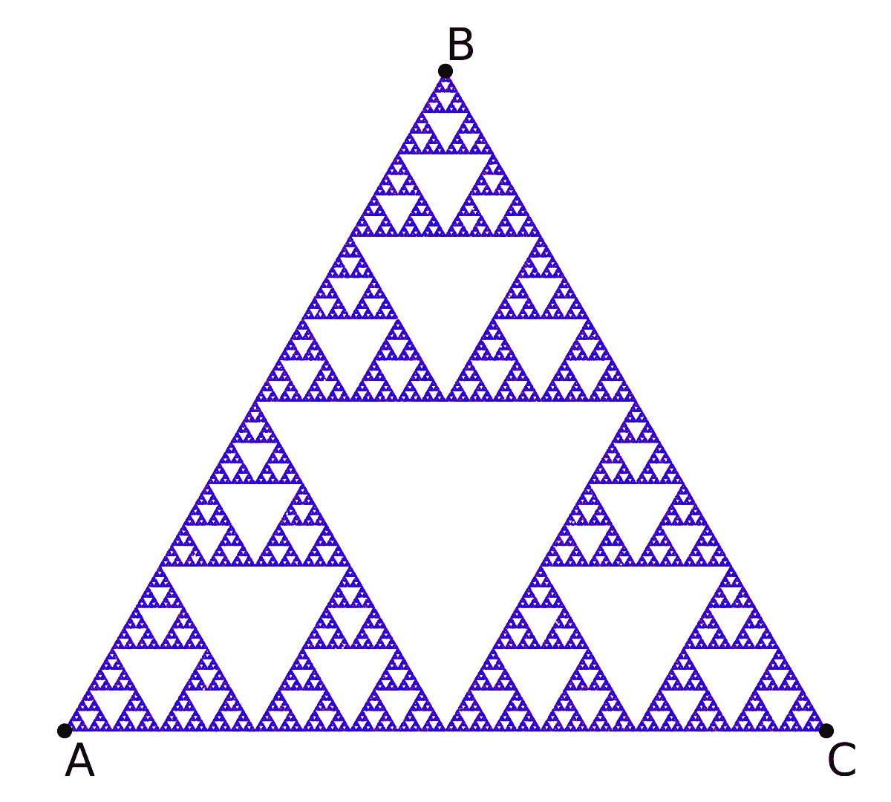
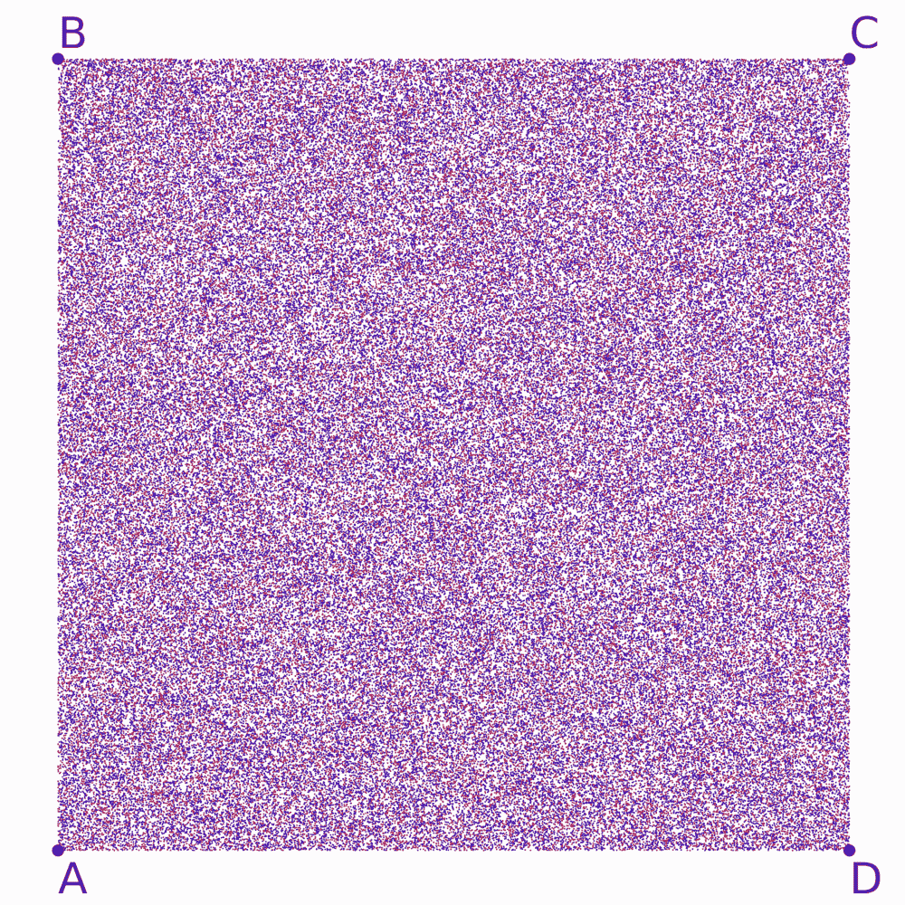

# Barnsley 蕨类植物

> 原文：[`www.algorithm-archive.org/contents/barnsley/barnsley.html`](https://www.algorithm-archive.org/contents/barnsley/barnsley.html)

在迭代函数系统章节的结尾，我们介绍了两个不同的吸引子：Sierpinski 三角形，以及一个均匀的二维正方形，下面展示了它们对应的 Hutchinson 算子。

| Hutchinson 算子 | 吸引子 |
| --- | --- |
|  |  |
|  |  |

作为提醒，Hutchinson 算子是一组作用于空间中的点，，并返回另一个新位置的点的函数。这些函数旨在以某种方式反复使用，随着你不断地遍历它们，最终会绘制出某种形状。这个形状被称为吸引子，整个系统由于绘制吸引子的迭代性质而被称为*迭代函数系统*。

在这些情况下，每个函数将点移动到其原始位置和位置之间的一半，对于，，和，分别对应于，，和。尽管，和对于两个吸引子都是相同的，但的添加极大地改变了最终结果！令人惊讶的是，两组看似相同的函数最终可以看起来如此不同，这让我们面临一个有些挑战性的问题：给定一组函数，是否有任何方法在不遍历函数的情况下预测吸引子？

通常情况下，答案是肯定的。你*必须*以某种方式采样函数集以找到结果吸引子。

这让我感到有些不安。毕竟，每个单独的函数都很简单，那么为什么结果如此难以预测呢？在本章中，我希望通过介绍另一个具有美丽吸引子的迭代函数系统，即 Barnsley 蕨类植物 1，来提供稍微令人满意的答案：

| Hutchinson 算子 | 吸引子 |
| --- | --- |
|  |  |

初看，这组函数看起来像是一团难以理解的魔法数字的混乱，用以产生特定的结果，从某种意义上说，这正是正确的。话虽如此，我们将逐一解释每个函数的工作原理，同时提供简单的混沌游戏代码实现。到本章结束时，我们并不希望提供理解所有迭代函数系统的一般策略，但我们希望至少使这一组函数更加易于理解。

## 单个仿射变换

关于 Barnsley 函数集的第一件事要注意的是，每个函数都是一个仿射变换。虽然这不是一条硬性规则，但大多数迭代函数系统都使用仿射变换，因此这种表示法很常见。实际上，Sierpinski 算子也可以写成仿射形式：

| 非仿射 | 仿射 |
| --- | --- |
|  |  |

仿射变体通过缩放 \(x\) 和 \(y\) 分量乘以 \(\alpha\)，然后分别对 \(x\)、\(y\) 或 \(z\) 添加 \(\frac{1}{2}\) 的 \(a\)、\(b\) 或 \(c\) 来执行相同的操作。每个这些变换都涉及一些线性成分（缩放或剪切）以及额外的平移。

作为一个重要的补充说明：在 Barnsley 和 Sierpinski 函数系统中，变换矩阵的系数都小于 1。这个属性被称为*收缩性*，迭代函数系统只有当系统是收缩的时才能有吸引子。反思一下，这很有道理。如果矩阵元素大于 1，点在函数的连续迭代后可能会趋向于无穷大。

现在，让我们通过查看每个变换如何影响随机点分布来剖析 Barnsley 蕨类植物：

| 函数 | 操作 |
| --- | --- |

| 此操作将每个点移动到一条直线上。 |  <res/affine_rnd_0.mp4>

您的浏览器不支持视频标签。  |

| 此操作将每个点向上和向右移动。 |  <res/affine_rnd_1.mp4>

您的浏览器不支持视频标签。  |

| 此操作将每个点旋转到左侧。 |  <res/affine_rnd_2.mp4>

您的浏览器不支持视频标签。  |

| 此操作将每个点翻转并旋转到右侧。 |  <res/affine_rnd_3.mp4>

您的浏览器不支持视频标签。  |

在这个阶段，*可能*可以清楚地了解正在发生的事情，但并不完全明显。本质上，每个操作对应于蕨类植物的另一部分：

+   创建茎。

+   依次创建越来越小的蕨类植物，向右上方移动。

+   创建右侧的叶子。

+   创建左侧的叶子。

要理解这一点，最简单的方法是展示在 Barnsley 蕨类植物本身上进行的操作，而不是点的随机分布。

| 函数 | 操作 |
| --- | --- |

|  |  <res/affine_fern_0.mp4>

您的浏览器不支持视频标签。  |

|  |  <res/affine_fern_1.mp4>

您的浏览器不支持视频标签。  |

|  |  <res/affine_fern_2.mp4>

您的浏览器不支持视频标签。  |

|  |  <res/affine_fern_3.mp4>

您的浏览器不支持视频标签。  |

在这里，蕨类植物的相似性变得明显。每个操作实际上是将蕨类植物的一部分上的一个点移动到蕨类植物另一部分上的一个点。

在最终构建中，很明显，在某些部分上所需点数比其他部分少。例如，茎几乎不需要很多点。同时，蕨的大部分似乎是由生成的，因此我们可能希望在迭代集合时选择大多数点使用该函数。为了解决这个问题，每个函数也被赋予了一个被选中的概率：

| 函数 | 概率 |
| --- | --- |
|  | 0.01 |
|  | 0.85 |
|  | 0.07 |
|  | 0.07 |

## 玩耍一会儿...

使用仿射变换构建吸引子的一个重大优势是，数学家和程序员可以利用他们对这些变换如何工作的了解来修改最终图像。以下是一些可以通过修改组成函数生成的蕨类示例：

| 函数 | 操作 |
| --- | --- |

| 将扭转变为叶子 |  <res/fern_twiddle_0.mp4>

您的浏览器不支持视频标签。  |

| 将蕨倾斜改变 |  <res/fern_twiddle_1.mp4>

您的浏览器不支持视频标签。  |

| 将扭转变为叶子 |  <res/fern_twiddle_2.mp4>

您的浏览器不支持视频标签。  |

| 将扭转变为叶子 |  <res/fern_twiddle_3.mp4>

您的浏览器不支持视频标签。  |

作为一条重要提示：通过旋转仿射变换的旋钮来修改最终图像的想法是许多有趣方法的核心，包括分形图像压缩，其中存储了图像的低分辨率版本以及一个重建函数集，用于实时生成高质量图像 [[2]](#cite-2)[[3]](#cite-3)。如果这看起来很神秘，别担心！我们肯定会很快回到这个话题，我只是想现在简要提一下，这样在我们继续前进时，每个人都会记住这一点。

## 视频解释

这里有一个描述巴恩斯利蕨的视频：

[`www.youtube-nocookie.com/embed/xoXe0AljUMA`](https://www.youtube-nocookie.com/embed/xoXe0AljUMA)

## 示例代码

与关于迭代函数系统（IFS）的章节类似，这里的示例代码将展示一个混沌游戏，用于构建一个吸引子；然而，在这种情况下，吸引子将是巴恩斯利蕨而不是谢尔宾斯基三角形。这两种代码实现之间最大的区别是，巴恩斯利实现必须考虑选择每个函数路径时的不同概率，而且这次我们将选择一个位于吸引子上的初始点（即）。 

```
using DelimitedFiles

# This is a function that reads in the Hutchinson operator and corresponding
#     probabilities and outputs a randomly selected transform
# This works by choosing a random number and then iterating through all 
#     probabilities until it finds an appropriate bin
function select_array(hutchinson_op, probabilities)

    # random number to be binned
    rnd = rand()

    # This checks to see if a random number is in a bin, if not, that 
    #     probability is subtracted from the random number and we check the
    #     next bin in the list
    for i = 1:length(probabilities)
        if (rnd < probabilities[i])
            return hutchinson_op[i]
        end
        rnd -= probabilities[i]
    end
end

# This is a general function to simulate a chaos game
# n is the number of iterations
# initial_location is the starting point of the chaos game
# hutchinson_op is the set of functions to iterate through
# probabilities is the set of probabilities corresponding to the likelihood
#     of choosing their corresponding function in hutchinson_op
function chaos_game(n::Int, initial_location, hutchinson_op, probabilities)

    # Initializing the output array and the initial point
    output_points = zeros(n,2)

    # extending point to 3D for affine transform
    point = [initial_location[1], initial_location[2], 1]

    for i = 1:n
        output_points[i,:] .= point[1:2]
        point = select_array(hutchinson_op, probabilities)*point
    end

    return output_points

end

barnsley_hutchinson = [[0.0 0.0 0.0;
                        0.0 0.16 0.0;
                        0.0 0.0 1.0],
                       [0.85 0.04 0.0;
                        -0.04 0.85 1.60;
                        0.0 0.0 1.0],
                       [0.20 -0.26 0.0;
                        0.23 0.22 1.60;
                        0.0 0.0 1.0],
                       [-0.15 0.28 0.0;
                        0.26 0.24 0.44;
                        0.0 0.0 1.0]]

barnsley_probabilities = [0.01, 0.85, 0.07, 0.07]
output_points = chaos_game(10000, [0,0],
                           barnsley_hutchinson, barnsley_probabilities)
writedlm("out.dat", output_points) 
```

```
use rand::prelude::*;
#[derive(Clone, Copy)]
struct Point2 {
    x: f64,
    y: f64,
}

#[derive(Clone, Copy)]
struct Point3 {
    x: f64,
    y: f64,
    z: f64,
}

impl Point3 {
    fn new(x: f64, y: f64, z: f64) -> Self {
        Self { x, y, z }
    }

    fn matrix_mul(self, rhs: Vec<Point3>) -> Self {
        let x = rhs[0].x * self.x + rhs[0].y * self.y + rhs[0].z * self.z;
        let y = rhs[1].x * self.x + rhs[1].y * self.y + rhs[1].z * self.z;
        let z = rhs[2].x * self.x + rhs[2].y * self.y + rhs[2].z * self.z;
        Self::new(x, y, z)
    }
}

fn select_array(hutchinson_op: &[Vec<Point3>], probabilities: &[f64]) -> Vec<Point3> {
    let mut rng = rand::thread_rng();
    let mut rnd = rng.gen::<f64>();

    for (i, probability) in probabilities.iter().enumerate() {
        if rnd < *probability {
            return hutchinson_op[i].clone();
        }
        rnd -= probability;
    }

    return vec![];
}

fn chaos_game(
    iters: usize,
    initial_location: Point2,
    hutchinson_op: &[Vec<Point3>],
    probabilities: &[f64],
) -> Vec<Point2> {
    let mut point = Point3 {
        x: initial_location.x,
        y: initial_location.y,
        z: 1.0,
    };
    (0..iters)
        .into_iter()
        .map(|_| {
            let old_point = point;
            let operation = select_array(hutchinson_op, probabilities);
            point = point.matrix_mul(operation);
            Point2 {
                x: old_point.x,
                y: old_point.y,
            }
        })
        .collect()
}

fn main() {
    let barnsley_hutchinson = vec![
        vec![
            Point3::new(0.0, 0.0, 0.0),
            Point3::new(0.0, 0.16, 0.0),
            Point3::new(0.0, 0.0, 1.0),
        ],
        vec![
            Point3::new(0.85, 0.04, 0.0),
            Point3::new(-0.04, 0.85, 1.60),
            Point3::new(0.0, 0.0, 1.0),
        ],
        vec![
            Point3::new(0.20, -0.26, 0.0),
            Point3::new(0.23, 0.22, 1.60),
            Point3::new(0.0, 0.0, 1.0),
        ],
        vec![
            Point3::new(-0.15, 0.28, 0.0),
            Point3::new(0.26, 0.24, 0.44),
            Point3::new(0.0, 0.0, 1.0),
        ],
    ];

    let barnsley_probabilities = vec![0.01, 0.85, 0.07, 0.07];

    let mut out = String::new();

    for point in chaos_game(
        10_000,
        Point2 { x: 0.0, y: 0.0 },
        &barnsley_hutchinson,
        &barnsley_probabilities,
    ) {
        out += format!("{}\t{}\n", point.x, point.y).as_str();
    }

    std::fs::write("./out.dat", out).unwrap();
} 
```

```
// The code bellow uses C++-17 features, compile it with C++-17 flags, e.g.:
// clang++ -Wall -Wextra -Wshadow -Wnon-virtual-dtor -Wold-style-cast -Wcast-align -Wunused -Woverloaded-virtual -Wpedantic -Wconversion -Wsign-conversion -Wnull-dereference -Wdouble-promotion -Wformat=2 -gdwarf-3 -D_GLIBCXX_DEBUG -std=c++17 -O3 -c ./barnsley.cpp barnsley

#include <array>
#include <cassert>
#include <fstream>
#include <random>

using Vec2 = std::array<double, 2>;
using Vec3 = std::array<double, 3>;
using Row = std::array<double, 3>;
using Op = std::array<Row, 3>;

constexpr auto OpN = 4U;

template <size_t N>
auto operator+(std::array<double, N> x, std::array<double, N> y) {
  for (auto i = 0U; i < N; ++i)
    x[i] += y[i];
  return x;
}

template <size_t N>
auto operator*(double k, std::array<double, N> v) {
  for (auto i = 0U; i < N; ++i)
    v[i] *= k;
  return v;
}

template <size_t N>
auto operator*(std::array<double, N> v, double k) {
  return k * v;
}

auto operator*(const Op& x, const Vec3& y) {
  auto ret = Vec3{};
  for (auto i = 0U; i < 3U; ++i) {
    ret[i] = 0;
    for (auto j = 0U; j < 3U; ++j)
      ret[i] += y[j] * x[i][j];
  }
  return ret;
}

// Returns a pseudo-random number generator
std::default_random_engine& rng() {
  // Initialize static pseudo-random engine with non-deterministic random seed
  static std::default_random_engine randEngine(std::random_device{}());
  return randEngine;
}

// Returns a random double in [0, 1)
double drand() {
  return std::uniform_real_distribution<double>(0.0, 1.0)(rng());
}

// This is a function that reads in the Hutchinson operator and
// corresponding
//     probabilities and outputs a randomly selected transform
// This works by choosing a random number and then iterating through all
//     probabilities until it finds an appropriate bin
auto select_array(
    const std::array<Op, OpN>& hutchinson_op,
    const std::array<double, OpN>& probabilities) {

  // random number to be binned
  auto rnd = drand();

  // This checks to see if a random number is in a bin, if not, that
  //     probability is subtracted from the random number and we check the
  //     next bin in the list
  for (auto i = 0U; i < probabilities.size(); ++i) {
    if (rnd < probabilities[i])
      return hutchinson_op[i];
    rnd -= probabilities[i];
  }
  assert(!static_cast<bool>("check if probabilities adding up to 1"));
  return hutchinson_op[0];
}

// This is a general function to simulate a chaos game
// n is the number of iterations
// initial_location is the the starting point of the chaos game
// hutchinson_op is the set of functions to iterate through
// probabilities is the set of probabilities corresponding to the likelihood
//     of choosing their corresponding function in hutchinson_op
auto chaos_game(
    size_t n,
    Vec2 initial_location,
    const std::array<Op, OpN>& hutchinson_op,
    const std::array<double, OpN>& probabilities) {

  // Initializing the output array and the initial point
  auto output_points = std::vector<Vec2>{};

  // extending point to 3D for affine transform
  auto point = Vec3{initial_location[0], initial_location[1], 1};

  for (auto i = 0U; i < n; ++i) {
    output_points.push_back(Vec2{point[0], point[1]});
    point = select_array(hutchinson_op, probabilities) * point;
  }

  return output_points;
}

int main() {

  const std::array barnsley_hutchinson = {
      Op{Row{0.0, 0.0, 0.0}, Row{0.0, 0.16, 0.0}, Row{0.0, 0.0, 1.0}},
      Op{Row{0.85, 0.04, 0.0}, Row{-0.04, 0.85, 1.60}, Row{0.0, 0.0, 1.0}},
      Op{Row{0.20, -0.26, 0.0}, Row{0.23, 0.22, 1.60}, Row{0.0, 0.0, 1.0}},
      Op{Row{-0.15, 0.28, 0.0}, Row{0.26, 0.24, 0.44}, Row{0.0, 0.0, 1.0}}};

  const std::array barnsley_probabilities = {0.01, 0.85, 0.07, 0.07};
  auto output_points = chaos_game(
      10'000, Vec2{0, 0}, barnsley_hutchinson, barnsley_probabilities);

  std::ofstream ofs("out.dat");
  for (auto pt : output_points)
    ofs << pt[0] << '\t' << pt[1] << '\n';
} 
```

```
#include <stdio.h>
#include <stdlib.h>

struct matrix {
    double xx, xy, xz,
           yx, yy, yz,
           zx, zy, zz;
};

struct point2d {
    double x, y;
};

struct point3d {
    double x, y, z;
};

struct point3d matmul(struct matrix mat, struct point3d point)
{
    struct point3d out = {
        mat.xx * point.x + mat.xy * point.y + mat.xz * point.z,
        mat.yx * point.x + mat.yy * point.y + mat.yz * point.z,
        mat.zx * point.x + mat.zy * point.y + mat.zz * point.z
    };
    return out;
}

// This function reads in the Hutchinson operator and corresponding
// probabilities and returns a randomly selected transform
// This works by choosing a random number and then iterating through all
// probabilities until it finds an appropriate bin
struct matrix select_array(struct matrix *hutchinson_op, double *probabilities,
                           size_t num_op)
{
    // random number to be binned
    double rnd = (double)rand() / RAND_MAX;

    // This checks to see if a random number is in a bin, if not, that
    // probability is subtracted from the random number and we check the next
    // bin in the list
    for (size_t i = 0; i < num_op; ++i) {
        if (rnd < probabilities[i]) {
            return hutchinson_op[i];
        }
        rnd -= probabilities[i];
    }
    return hutchinson_op[0];
}

// This is a general function to simulate a chaos game
//  - output_points: pointer to an initialized output array
//  - num: the number of iterations
//  - initial_point: the starting point of the chaos game
//  - hutchinson_op: the set of functions to iterate through
//  - probabilities: the set of probabilities corresponding to the likelihood
//      of choosing their corresponding function in hutchingson_op
//  - nop: the number of functions in hutchinson_op
void chaos_game(struct point2d *output_points, size_t num,
                struct point2d initial_point, struct matrix *hutchinson_op,
                double *probabilities, size_t nop)
{
    // extending point to 3D for affine transform
    struct point3d point = {initial_point.x, initial_point.y, 1.0};

    for (size_t i = 0; i < num; ++i) {
        point = matmul(select_array(hutchinson_op, probabilities, nop), point);
        output_points[i].x = point.x;
        output_points[i].y = point.y;
    }
}

int main()
{
    struct matrix barnsley_hutchinson[4] = {
        {
            0.0, 0.0, 0.0,
            0.0, 0.16, 0.0,
            0.0, 0.0, 1.0
        },
        {
            0.85, 0.04, 0.0,
            -0.04, 0.85, 1.60,
            0.0, 0.0, 1.0
        },
        {
            0.2, -0.26, 0.0,
            0.23, 0.22, 1.60,
            0.0, 0.0, 1.0
        },
        {
            -0.15, 0.28, 0.0,
            0.26, 0.24, 0.44,
            0.0, 0.0, 1.0
        }
    };

    double barnsley_probabilities[4] = {0.01, 0.85, 0.07, 0.07};
    struct point2d output_points[10000];
    struct point2d initial_point = {0.0, 0.0};
    chaos_game(output_points, 10000, initial_point, barnsley_hutchinson,
               barnsley_probabilities, 4);
    FILE *f = fopen("barnsley.dat", "w");
    for (size_t i = 0; i < 10000; ++i) {
        fprintf(f, "%f\t%f\n", output_points[i].x, output_points[i].y);
    }
    fclose(f);

    return 0;
} 
```

```
import java.io.FileWriter;
import java.io.IOException;
import java.util.Random;

public class Barnsley {

    private static class Point {
        public double x, y, z;

        public Point(double x, double y, double z) {
            this.x = x;
            this.y = y;
            this.z = z;
        }

        public Point(double[] coordinates) {
            this.x = coordinates[0];
            this.y = coordinates[1];
            this.z = coordinates[2];
        }

        public Point matrixMultiplication(double[][] matrix) {
            double[] results = new double[3];
            for (int i = 0; i < 3; i++) {
                results[i] = matrix[i][0] * x + matrix[i][1] * y + matrix[i][2] * z;
            }
            return new Point(results);
        }
    }

    // This is a function that reads in the Hutchinson operator and corresponding
    //   probabilities and outputs a randomly selected transform
    // This works by choosing a random number and then iterating through all
    //   probabilities until it finds an appropriate bin
    public static double[][] selectArray(double[][][] hutchinsonOp, double[] probabilities) {
        Random rng = new Random();
        // Random number to be binned
        double rand = rng.nextDouble();

        // This checks to see if a random number is in a bin, if not, that
        // probability is subtracted from the random number and we check the
        // next bin in the list
        for (int i = 0; i < probabilities.length; i++) {
            if (rand < probabilities[i])
                return hutchinsonOp[i];
            rand -= probabilities[i];
        }
        // This return will never be reached, as the loop above ensures that at some point rand will be smaller
        // than a probability. However, Java does not know this and thus this return is needed for compilation.
        return null;
    }

    // This is a general function to simulate a chaos game
    // n is the number of iterations
    // initialLocation is the starting point of the chaos game
    // hutchinsonOp is the set of functions to iterate through
    // probabilities is the set of probabilities corresponding to the likelihood
    //   of choosing their corresponding function in hutchinsonOp
    public static Point[] chaosGame(int n, Point initialLocation, double[][][] hutchinsonOp, double[] probabilities) {
        // Initializing output points
        Point[] outputPoints = new Point[n];
        Point point = initialLocation;

        for (int i = 0; i < n; i++) {
            outputPoints[i] = point;
            point = point.matrixMultiplication(selectArray(hutchinsonOp, probabilities));
        }

        return outputPoints;
    }

    public static void main(String[] args) {
        double[][][] barnsleyHutchinson = {
                {{0.0, 0.0, 0.0},
                 {0.0, 0.16, 0.0},
                 {0.0, 0.0, 1.0}},
                {{0.85, 0.04, 0.0},
                 {-0.04, 0.85, 1.60},
                 {0.0, 0.0, 1.0}},
                {{0.20, -0.26, 0.0},
                 {0.23, 0.22, 1.60},
                 {0.0, 0.0, 1.0}},
                {{-0.15, 0.28, 0.0},
                 {0.26, 0.24, 0.44},
                 {0.0, 0.0, 1.0}}
        };
        double[] barnsleyProbabilities = new double[]{0.01, 0.85, 0.07, 0.07};
        Point[] outputPoints = chaosGame(10000, new Point(0.0, 0.0, 1.0), barnsleyHutchinson, barnsleyProbabilities);
        try (FileWriter fw = new FileWriter("barnsley.dat")) {
            for (Point p : outputPoints) {
                fw.write(p.x + "\t" + p.y + "\n");
            }
        } catch (IOException e) {
            e.printStackTrace();
        }
    }

} 
```

```
from random import choices
import numpy as np

data Point(x=0, y=0):
    def __rmatmul__(self, mat: np.array):
        point_array = np.array([self.x, self.y, 1])
        x, y, *_ = tuple(*(mat @ point_array))
        return Point(x, y)

def chaos_game(Point(initial_location), hutchinson_op, probabilities):
    point = initial_location
    while True:
        yield (point := choices(hutchinson_op, probabilities) @ point)

barnsley_hutchinson = [
    np.array([
        [0., 0., 0.],
        [0., 0.16, 0.],
        [0., 0., 1.],
    ]),
    np.array([
        [0.85, 0.04, 0.],
        [-0.04, 0.85, 1.6],
        [0., 0., 1.],
    ]),
    np.array([
        [0.2, -0.26, 0.],
        [0.23, 0.22, 1.6],
        [0., 0., 1.],
    ]),
    np.array([
        [-0.15, 0.28, 0.],
        [0.26, 0.24, 0.44],
        [0., 0., 1.],
    ]),
]

barnsley_probabilities = [0.01, 0.85, 0.07, 0.07]

if __name__ == '__main__':
    output_gen = chaos_game(Point(0, 0), barnsley_hutchinson, barnsley_probabilities)
    output_points = np.array([*output_gen$[:10000]])
    np.savetxt("out.dat", output_points) 
```

```
import Data.Array (Array, bounds, elems, listArray, (!))
import Data.List (intercalate)
import System.Random

data Point = Point Double Double

chaosGame :: RandomGen g => g -> Int -> Array Int (Double, (Point -> Point)) -> [Point]
chaosGame g n hutchinson = take n points
  where
    (x, g') = random g
    (y, g'') = random g'

    cumulProbabilities = scanl1 (+) $ map fst $ elems hutchinson
    to_choice x = length $ takeWhile (x >) cumulProbabilities

    picks = map to_choice $ randomRs (0, 1) g''
    step = fmap snd hutchinson

    points = Point x y : zipWith (step !) picks points

affine :: (Double, Double, Double, Double) -> (Double, Double) -> Point -> Point
affine (xx, xy, yx, yy) (a, b) (Point x y) = Point (a + xx * x + xy * y) (b + yx * x + yy * y)

showPoint :: Point -> String
showPoint (Point x y) = show x ++ "\t" ++ show y

main :: IO ()
main = do
  g <- newStdGen
  let barnsley =
        listArray
          (0, 3)
          [ (0.01, affine (0, 0, 0, 0.16) (0, 0)),
            (0.85, affine (0.85, 0.04, -0.04, 0.85) (0, 1.6)),
            (0.07, affine (0.2, -0.26, 0.23, 0.22) (0, 1.6)),
            (0.07, affine (-0.15, 0.28, 0.26, 0.24) (0, 0.44))
          ]
      points = chaosGame g 100000 barnsley

  writeFile "out.dat" $ intercalate "\n" $ map showPoint points 
```

### 参考文献

1.Barnsley, Michael F, Fractals everywhere, *Academic press*, 2014.2.[维基百科：分形压缩](https://en.wikipedia.org/wiki/Fractal_compression), 2019.3.Saupe, Dietmar and Hamzaoui, Raouf, A review of the fractal image compression literature, *ACM*, 1994.

## 许可证

##### 代码示例

代码示例受 MIT 许可协议（在[LICENSE.md](https://github.com/algorithm-archivists/algorithm-archive/blob/main/LICENSE.md)中找到）许可。

##### 文本

本章的文本由[James Schloss](https://github.com/leios)编写，并授权于[Creative Commons Attribution-ShareAlike 4.0 国际许可协议](https://creativecommons.org/licenses/by-sa/4.0/legalcode)。

[](https://creativecommons.org/licenses/by-sa/4.0/)

(https://creativecommons.org/licenses/by-sa/4.0/)

#### 图片/图形

+   图片"IFS 三角形 1"由[James Schloss](https://github.com/leios)制作，并授权于[Creative Commons Attribution-ShareAlike 4.0 国际许可协议](https://creativecommons.org/licenses/by-sa/4.0/legalcode)。

+   图片"IFS 正方形 3"由[James Schloss](https://github.com/leios)制作，并授权于[Creative Commons Attribution-ShareAlike 4.0 国际许可协议](https://creativecommons.org/licenses/by-sa/4.0/legalcode)。

+   图片"简单的巴恩斯利蕨"由[James Schloss](https://github.com/leios)制作，并授权于[Creative Commons Attribution-ShareAlike 4.0 国际许可协议](https://creativecommons.org/licenses/by-sa/4.0/legalcode)。

+   视频文件"仿射随机变换 0"由[James Schloss](https://github.com/leios)制作，并授权于[Creative Commons Attribution-ShareAlike 4.0 国际许可协议](https://creativecommons.org/licenses/by-sa/4.0/legalcode)。

+   视频文件"仿射随机变换 1"由[James Schloss](https://github.com/leios)制作，并授权于[Creative Commons Attribution-ShareAlike 4.0 国际许可协议](https://creativecommons.org/licenses/by-sa/4.0/legalcode)。

+   视频文件"仿射随机变换 2"由[James Schloss](https://github.com/leios)制作，并授权于[Creative Commons Attribution-ShareAlike 4.0 国际许可协议](https://creativecommons.org/licenses/by-sa/4.0/legalcode)。

+   视频文件"仿射随机变换 3"由[James Schloss](https://github.com/leios)制作，并授权于[Creative Commons Attribution-ShareAlike 4.0 国际许可协议](https://creativecommons.org/licenses/by-sa/4.0/legalcode)。

+   视频文件"仿射蕨变换 0"由[James Schloss](https://github.com/leios)制作，并授权于[Creative Commons Attribution-ShareAlike 4.0 国际许可协议](https://creativecommons.org/licenses/by-sa/4.0/legalcode)。

+   视频文件"仿射蕨变换 1"由[James Schloss](https://github.com/leios)制作，并授权于[Creative Commons Attribution-ShareAlike 4.0 国际许可协议](https://creativecommons.org/licenses/by-sa/4.0/legalcode)。

+   视频文件"仿射蕨变换 2"由[詹姆斯·施洛斯](https://github.com/leios)制作，并授权于[Creative Commons Attribution-ShareAlike 4.0 国际许可协议](https://creativecommons.org/licenses/by-sa/4.0/legalcode)。

+   视频文件"仿射蕨变换 3"由[詹姆斯·施洛斯](https://github.com/leios)制作，并授权于[Creative Commons Attribution-ShareAlike 4.0 国际许可协议](https://creativecommons.org/licenses/by-sa/4.0/legalcode)。

+   视频文件"蕨摆动 0"由[詹姆斯·施洛斯](https://github.com/leios)制作，并授权于[Creative Commons Attribution-ShareAlike 4.0 国际许可协议](https://creativecommons.org/licenses/by-sa/4.0/legalcode)。

+   视频文件"蕨摆动 1"由[詹姆斯·施洛斯](https://github.com/leios)制作，并授权于[Creative Commons Attribution-ShareAlike 4.0 国际许可协议](https://creativecommons.org/licenses/by-sa/4.0/legalcode)。

+   视频文件"蕨摆动 2"由[詹姆斯·施洛斯](https://github.com/leios)制作，并授权于[Creative Commons Attribution-ShareAlike 4.0 国际许可协议](https://creativecommons.org/licenses/by-sa/4.0/legalcode)。

+   视频文件"蕨摆动 3"由[詹姆斯·施洛斯](https://github.com/leios)制作，并授权于[Creative Commons Attribution-ShareAlike 4.0 国际许可协议](https://creativecommons.org/licenses/by-sa/4.0/legalcode)。
