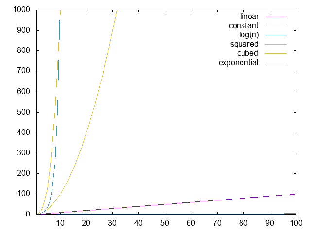

# 复杂度表示法

> 原文：[`www.algorithm-archive.org/contents/notation/notation.html`](https://www.algorithm-archive.org/contents/notation/notation.html)

算法是为了解决问题而设计的。随着时间的推移，新的算法被创造出来以解决旧算法已经解决的问题。在某些情况下，新算法并不本质上比旧算法更好。在其他情况下，这些新算法给研究和技术领域带来了生命，这些领域没有它们可能无法存在。问题是：什么使一个算法比另一个算法“更好”？

显然，这个问题没有好的答案。如果你编写一个算法来解决一个问题，无论你提出什么，对于小问题来说可能都工作得很好。话虽如此，如果你需要在一个更大的系统中使用这个算法，你可能会发现自己等待代码运行的时间越来越长。在这些情况下，很明显，*如果你正在处理一个大型系统，你需要一个能够很好地扩展到大型规模的算法*。理想情况下，一个适用于大型系统的算法也会适用于小型系统；然而，这并不总是如此。

为了确定最适合你系统的算法，通常最好咨询计算机科学家用来描述算法如何随系统规模扩展的工具：*复杂性理论*。这里的思想是：算法操作数据。复杂性理论使用不同的符号来描述算法将需要多少操作。这样，计算复杂性以算法完成任务所需操作的数量来衡量运行时间。为了清楚起见，所使用的符号并不完全精确，但它们大致描述了代码的运行时间，可以用来估计算法应该运行多长时间。此外，根据你询问的人的不同，存在许多不同的符号，但就目前而言，我们将关注大 O 表示法中的三个主要符号： , , 和 。大 O 表示法假设最坏的情况，这通常是算法最有用的描述。另一方面， 表示法假设最佳情况，而 表示法在最佳和最坏情况相同时使用。

算法可以在不同时间内运行，这 *可能*看起来很奇怪，但让我解释一下：

```
function constant(a::UInt64, b::UInt64)
    println(b)
    for i=0:18446744073709551615
        if(a < b)
            b = a - b
            println(b)
        end
    end
end 
```

如果我们在 b 中计算大 O 表示法，它将是 和 ，显然不是相同的。最佳运行时间将是如果 a > b 的`println`语句，最坏运行时间将是如果 a = 1 的`println`语句。所以这就是解释，让我们继续前进。

在这三个大 O 表示法中，最常用的是 ，在对话中用来表示算法将执行“大约”多少操作。不幸的是，到目前为止，这些符号可能有些模糊。事实上，对我来说，这些符号非常模糊，直到我看到了这些符号的实际应用，一切才开始变得有意义，所以这就是本节的内容：提供具体的例子来更好地理解计算复杂性符号。

###### 在下面的算法中，让我们假设最慢的语句是 `println`，并且我们总是谈论函数中的所有 `println`。

## 常数时间

让我们编写一些读取长度为 `n` 的数组并以常数时间运行的代码：

```
function constant(a::Array{Float64})
    println(a[1])
end 
```

显然，无论 `a` 多大，这个函数的运行时间都不会更长。正因为如此，我们说它具有常数运行时间，并用 表示。基本上，我们是在说这个函数将以 1 次操作（一个打印）完成。最佳运行时间是 1 次操作，最坏运行时间也是 1 次操作，因为它们都是相同的，我们可以用 表示。现在想象以下函数：

```
function constant(a::Array{Float64})
    if (length(a) >= 3)
        println(a[1])
        println(a[2])
        println(a[3])
    end
end 
```

这个函数有 3 个打印语句，所以总共有 3 次操作。因此，我们可能会说运行时间是 ，你不会错；然而，复杂度符号通常做出一个很大的假设：**我们不关心常数！** 这意味着什么？嗯，这意味着我们消除了所有不是 1 的常数！在这种情况下，这意味着我们将 设置为 。

现在，我知道你在想什么，*这太愚蠢了！很明显，第二个函数运行时间将是三倍，我们不应该这样表示吗？* 你没有错；然而，复杂度符号主要关注算法如何随着输入规模的增大而扩展。因为我们讨论的是常数运行时间，所以没有随着输入规模增大而扩展。无论你将什么数组读入上述函数，它们总是需要相同数量的操作来完成。这个常数时间是 1 次操作还是 3 次操作并不重要，因为不同的机器运行时间本来就会不同。

现在，这里有个问题：当我们继续讨论更复杂的例子时，我们将继续忽略常数和额外项，以便使符号更容易理解。尽管这是常见的做法，但这并不意味着这是*最佳*做法。我遇到过几次情况，知道常数可以节省我几个小时的计算时间，所以请记住，所有这些符号都是有些模糊的，并且依赖于许多辅助因素。尽管如此，这并不意味着符号完全没有用。现在，让我们继续前进，看看一些更复杂（且有用）的例子！

## 线性时间

现在我们进入了一个有趣的领域！让我们考虑以下函数：

```
function linear(a::Array{Float64})
    for i = 1:length(a)
        println(a[i])
    end
end 
```

在这里，很明显，如果我们增加 `a` 中的一个元素，我们还需要进行另一个操作。也就是说，对于大小为 的数组，我们需要进行  次操作，这意味着我们的复杂度是 。和之前一样，将更多操作添加到 `for` 循环中会改变我们复杂度符号中  前面的常数，但我们将继续忽略这些常数。例如：

```
function linear(a::Array{Float64})
    println("The first element in our array is: ", a[1])

    println("The sum of all pairs of elements in our array are...")
    for i = 1:length(a)/2
        println("a is: ", a[2*i])
        println("b is: ", a[2*i+1])
        println("The sum of a and b is: ", a[2*i] + a[2*i+1])
    end

    println("The last element in our array is: ", a[end])
end 
```

技术上具有复杂度 ，但我们只需称之为 。无论符号如何，如果你看到的是 ，你就知道最坏的情况下它将以 `for` 循环的速度运行，这已经相当不错了！

### 多项式时间

在运行时间方面，`O(1)`的承诺并不坏；然而，你不太可能遇到太多简单直接的算法是`O(1)`的。例如，假设你有一个正方形，2D 图像，并想遍历其所有点。好吧，为了做到这一点，我们可能会编写看起来像这样的代码：

```
# Here, size is the length of a single side of the image
function access_image(img::Array{Float64}, size::Int64)
    for i = 1:size
        for j = 1:size
            index = j + i*size
            println(img[index])
        end
    end
end 
```

这是一个嵌套`for`循环完全可接受的简单情况，并且从几何上很明显我们需要访问`n`个元素（因为我们正在处理一个正方形）。这意味着这个例子有`O(n)`的复杂度。这并不好。如果你必须访问 3D 空间，这可能会需要`O(n²)`，这更糟！更不用说 4D 了！直观上，如果你看到任何具有多项式运行时间的，很容易将其视为一系列嵌套的`for`循环。话虽如此，在算法的历史上，已经有一些情况，多项式运行时间阻碍了某些算法的完全使用，仅仅是因为运行时间太长了！

因此，如果你可以避免编写嵌套的`for`循环，你当然应该这样做！然而，有几个情况下这是不可避免的，所以除非运行时间成为问题，否则不要花太多时间担心这个问题！

## 指数和对数时间

这两种情况经常出现，并且通常需要一种共同的主题：*递归*。一般来说，对数算法是那里最快的算法之一，而指数算法是最慢的之一。不幸的是，这意味着递归可以是实现某些算法的最有用工具，也可以是危害最大的工具，这取决于你的问题。

这里是一个具有指数运行时间的函数的简单示例：

```
# Here, n is the number of iterations
function exponential(value::Int64, n::Int64)
    println(value)
    if(n >= 0)
        value += 1
        exponential(value, n-1)
        exponential(value, n-1)
end 
```

在这里，我们读取正在迭代的最大数字`n`，并递归调用`指数`函数，每次迭代减少剩余的次数。因为我们调用了两次`指数`函数，所以这个复杂度是`O(n)`，这并不好，但如果这是完成工作的唯一方法，那就是唯一的方法。

对数算法可以被认为是指数算法的对立面。而不是每次取一个值并计算越来越多的值，一个对数算法的好例子是它接受一个数组并递归地将其分割，如下所示：

```
# Here, cutoff is an arbitrary variable to know when to stop recursing
function logarithmic(a::Array{Float64}, cutoff::Int64)
    if (length(a) > cutoff)
        logarithmic(a[length(a)/2+1:end], cutoff)
    end
    println(length(a))
end 
```

说实话，提供的对数函数是否应该在`O(log n)`时间内运行并不明显，其中`n`是`a`的大小。话虽如此，我鼓励你思考一个大小为 8 的数组。首先，我们将它分成两半，并在其中之一上运行算法，创建一个包含 4 个元素的数组。如果我们再次将新数组分成两半并在其中之一上运行，我们得到一个包含 2 个元素的数组，如果我们再次将其分成两半并在其中之一上运行，我们得到一个包含 1 个元素的数组。这就是我们能走到的极限，我们最终将数组分成了 3 次才到达这个点。因此，这个函数以对数数量的操作运行。

## 把所有这些都放在一起

我们在这里概述了不同算法最常见的复杂度情况，但到目前为止，事情可能仍然不太清楚。哪个更好：还是？好吧，让我们把所有不同的案例都画出来，答案应该就会变得明显。



在这里，我们看到随着  的增加，每个复杂度案例。显然，与多项式或指数时间相比，线性时间并不差；然而，如果你能以对数或常数时间完成某事，那就这么做吧！

现在，关于计算复杂度还有很多话要说，我们肯定会某个时候涉及它，但我只能这么快地前进！特别是，我很乐意就困扰了一些计算机科学家一段时间的问题进行讨论，但我们将在适当的时候讨论这个问题。

### 最后警告

这是一本关于算法的书。几乎不可能不涉及复杂度理论，不解释为什么某些算法比其他算法运行得更快。然而，仅仅因为一个算法在运行在 的情况下并不意味着它总是比运行在  的算法更快。因为复杂度符号通常忽略了常数，我们可能遗漏了一个实际上对运行时间有很大影响的疯狂常数。此外，为了使用基于复杂度符号看起来更快的算法，你可能需要使用一个由于众多其他原因而大幅增加运行时间的库。

基本上，对复杂度符号持保留态度。它是一个有用的描述符，说明了算法在理想世界中应该运行得多快；然而，理想的世界并不存在。在编程方面，在实施任何东西之前可能还有数百个其他因素需要考虑。话虽如此，复杂度符号不应被忽视。如果你可以轻松实现一个符号上更快但没有任何后果的算法，那就去做吧！只是确保你不会浪费时间尝试优化你还没有写出的代码。

一般而言，我的建议如下：首先编写代码，并在第一次运行时尽可能优化，不要走得太远。如果运行时间很糟糕，就回去看看是否可以实施基于复杂度符号的更快算法。

## 许可证

##### 代码示例

代码示例许可在 MIT 许可下（可在[LICENSE.md](https://github.com/algorithm-archivists/algorithm-archive/blob/main/LICENSE.md)中找到）。

##### 文本

本章的文本由[James Schloss](https://github.com/leios)编写，并许可在[Creative Commons Attribution-ShareAlike 4.0 International License](https://creativecommons.org/licenses/by-sa/4.0/legalcode)下。

[](https://creativecommons.org/licenses/by-sa/4.0/)


##### 图像/图形

+   图片"复杂度缩放"由[James Schloss](https://github.com/leios)创建，并授权于[Creative Commons Attribution-ShareAlike 4.0 国际许可协议](https://creativecommons.org/licenses/by-sa/4.0/legalcode)。

##### 拉取请求

在初始许可([#560](https://github.com/algorithm-archivists/algorithm-archive/pull/560))之后，以下拉取请求已修改了本章的文本或图形：

+   无
