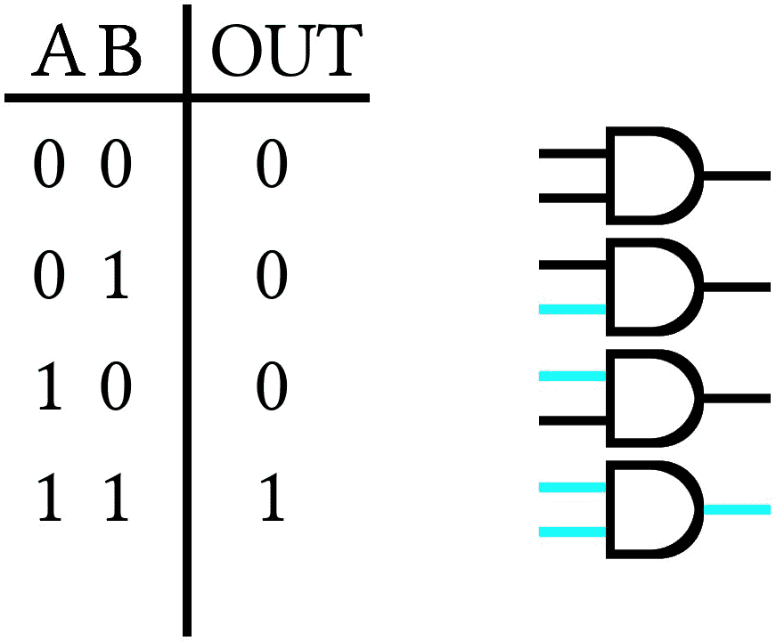
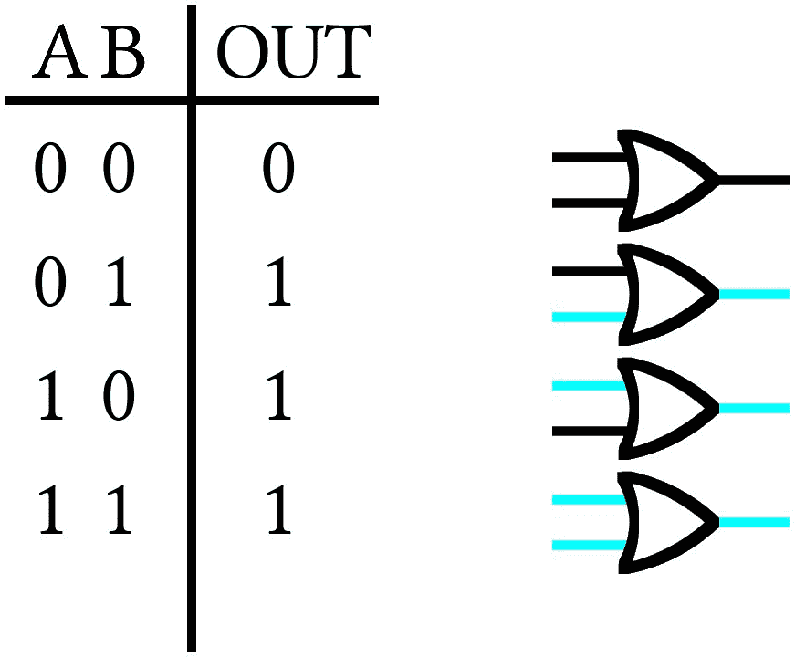
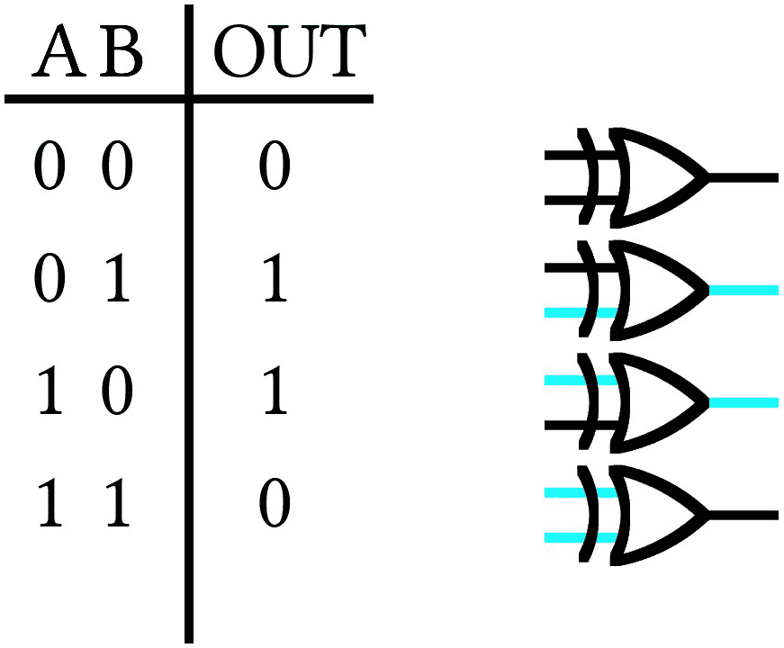
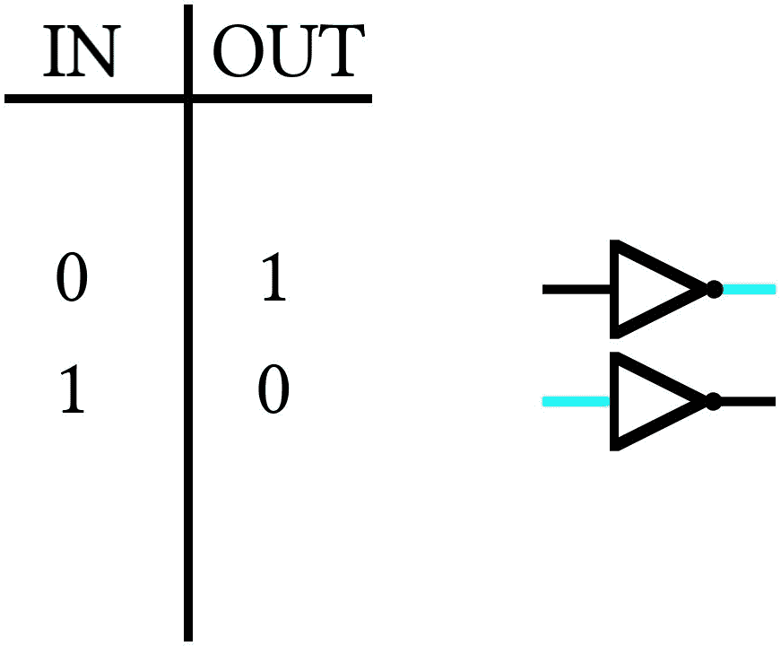
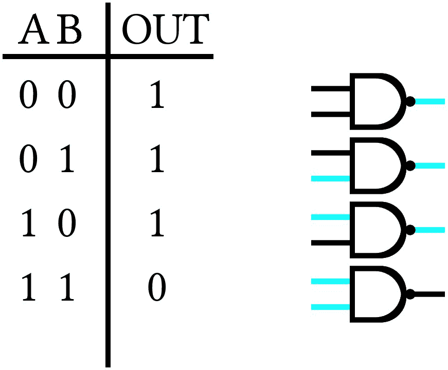
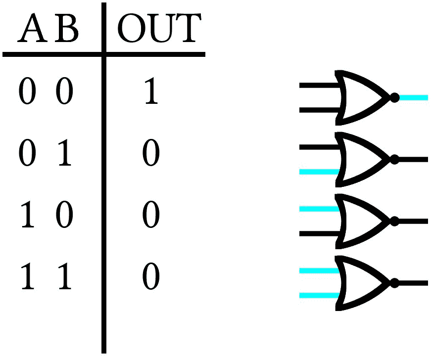

# 位逻辑

> 原文：[`www.algorithm-archive.org/contents/bitlogic/bitlogic.html`](https://www.algorithm-archive.org/contents/bitlogic/bitlogic.html)

我们用一种对我们来说有点意义的语言编写代码，但如果没有编译器将我们编写的代码转换成计算机能理解的语言，那么它对我们计算机来说就完全没有意义。最终，无论我们编写什么代码，我们编写的所有数据结构都会被转换成由 1 和 0 组成的二进制字符串，以便我们的计算机进行解释。话虽如此，但这个过程并不总是那么明显，所以让我们从整数数字的简单情况开始。

## 整数

对于整数数，0 仍然是 0，1 仍然是 1；然而，对于 2，我们需要使用 2 位，因为二进制只有 0 和 1。当我们到达 4 时，我们需要 3 位，当我们到达 8 时，我们需要 4 位。每次我们跨越一个 2 的幂，我们都需要添加一个新数字。以下是前 10 个整数在二进制中的表格：

| 整数数 | 二进制数 |
| --- | --- |
| 0 | `0000` |
| 1 | `0001` |
| 2 | `0010` |
| 3 | `0011` |
| 4 | `0100` |
| 5 | `0101` |
| 6 | `0110` |
| 7 | `0111` |
| 8 | `1000` |
| 9 | `1001` |

解释二进制字符串最简单的方法是想象每个数字都是 2 的幂，并将它们相加。例如，考虑数字 13，其位串为 1101：

| 1 | 1 | 0 | 1 |
| --- | --- | --- | --- |
|  |  |  |  |
| 8 | 4 | 2 | 1 |

我们有 1，1，0 和 1，加起来得到 13。虽然这看起来可能很简单，但这是理解稍后将在位上执行的一些操作的关键。现在，让我们谈谈整数值的唯一技巧：*负数！*

表示负数的方法有很多。例如，如果我们使用 8 位，我们可能会使用 8 位中的第一个位作为**符号位**，其唯一目的是告诉计算机该数是正数还是负数。

另一种方法是在位数过高时“翻滚”到负数，例如：

| 整数数 | 二进制数 |
| --- | --- |
| 126 | `01111110` |
| 127 | `01111111` |
| -128 | `10000000` |
| -127 | `10000001` |

最终，在二进制中处理整数数字并不那么困难，所以让我们继续更复杂的内容：*浮点数！*

## 浮点数

浮点数是带有小数点的数字。9.125 是一个浮点数。9.000 是一个浮点数。9 是一个整数。以下是一些浮点数及其整数表示：

| 浮点数 | 二进制数 |
| --- | --- |
| 9.125 | `1001.001` |
| 10.25 | `1010.01` |
| 1.00 | `1` |

想法与之前类似：每个数字代表 2 的幂；然而，这次小数点后的任何数字都表示负数。所以对于 9.125，我们有 1，1 和 1。

现在，这实际上是如何在您的计算机上实现的呢？好吧，一种方法是通过 IEEE 754 浮点算术标准。对于 32 位，第一个位是*符号位*，接下来的 8 位告诉我们关于数字的指数，接下来的 23 位被称为*尾数*并包含二进制字符串本身。现在，有几个要点需要注意：

1.  因为指数是用 8 位表示的，所以我们只有 256 个值可以操作。这意味着我们可以表示的最大指数（在单精度中）是 128，最小的是-127。因此，我们将为每个浮点数的指数加上 127。所以，存储的指数是。

1.  我们将每个二进制字符串规范化为第一个 1。例如：和偏移指数是，，这意味着*我们的二进制字符串中将始终有一个前导 1*。这意味着第一个 1 是多余的，可以从尾数中删除。

因此，这里有一些浮点数及其对应的二进制字符串：

| 浮点数 | 符号 | 指数 | 尾数 |
| --- | --- | --- | --- |
| 9.125 | `0` | `10000010` | `00100100000000000000000` |
| - 5.25 | `1` | `10000001` | `01010000000000000000000` |
| - 4096.625 | `1` | `10001011` | `00000000000010100000000` |

现在我们知道了如何表示整数和浮点数，让我们继续讨论操作，从*位移动运算符*开始

#### 位移动运算符：<<,>>

位移动运算符做它们名字暗示的事情：它们将位串向左（<<）或向右（>>）移动一位。这会产生将值乘以或除以 2 的某种深刻影响，当你考虑到每个数字代表 2 的幂时，这是有意义的。由于浮点数的性质相对复杂，位移动运算符通常只适用于整数，如下所示：

| 操作 | 整数 | 二进制字符串 |
| --- | --- | --- |
| 无 | 10 | `00001010` |
| 左移位，<< | 20 | `00010100` |
| 右移位，>> | 5 | `00000101` |

使用位移动运算符可以执行更复杂的事情；然而，我们将把这个讨论留到另一天！

#### 逻辑门

除了位移动操作之外，还有一些可以在一个或两个位上一起执行的逻辑操作。这些操作被称为*门*，并且遵循某种直接的逻辑。例如，*与门*读取 2 位，只有当两个输入都是 1 时才会输出 1 值。这可以在相应的真值表中看到：

*或门*会在任一输入位为 1 时输出 1：

*异或门*或*XOR 门*与*或门*相同，但不会在两个位都是 1 时输出 1：

*非门*简单地翻转输入位：

通过组合非门和与门，我们得到*与非门*：

并非“和”或“或”创建**非或**：

有一些其他的门，但对于大多数事情来说，这些已经足够了。随着需要，我们会添加更多。

这就是关于位逻辑的所有内容。我意识到这有点长，但这是理解计算机如何思考和如何将编程作为有效工具的绝对必要条件！

## 视频解释

下面是一个描述本章内容的视频：

[`www.youtube-nocookie.com/embed/zMuEk44Ufkw`](https://www.youtube-nocookie.com/embed/zMuEk44Ufkw)

## 许可证

##### 代码示例

代码示例授权于 MIT 许可（可在[LICENSE.md](https://github.com/algorithm-archivists/algorithm-archive/blob/main/LICENSE.md)中找到）。

##### 文本

本章的文本由[James Schloss](https://github.com/leios)编写，并授权于[Creative Commons Attribution-ShareAlike 4.0 国际许可协议](https://creativecommons.org/licenses/by-sa/4.0/legalcode)。

##### 图片/图形

+   图片“AND 门”由[James Schloss](https://github.com/leios)创建，并授权于[Creative Commons Attribution-ShareAlike 4.0 国际许可协议](https://creativecommons.org/licenses/by-sa/4.0/legalcode)。

+   图片“OR 门”由[James Schloss](https://github.com/leios)创建，并授权于[Creative Commons Attribution-ShareAlike 4.0 国际许可协议](https://creativecommons.org/licenses/by-sa/4.0/legalcode)。

+   图片“XOR 门”由[James Schloss](https://github.com/leios)创建，并授权于[Creative Commons Attribution-ShareAlike 4.0 国际许可协议](https://creativecommons.org/licenses/by-sa/4.0/legalcode)。

+   图片“NOT 门”由[James Schloss](https://github.com/leios)创建，并授权于[Creative Commons Attribution-ShareAlike 4.0 国际许可协议](https://creativecommons.org/licenses/by-sa/4.0/legalcode)。

+   图片“NAND 门”由[James Schloss](https://github.com/leios)创建，并授权于[Creative Commons Attribution-ShareAlike 4.0 国际许可协议](https://creativecommons.org/licenses/by-sa/4.0/legalcode)。

+   图片“NOR 门”由[James Schloss](https://github.com/leios)创建，并授权于[Creative Commons Attribution-ShareAlike 4.0 国际许可协议](https://creativecommons.org/licenses/by-sa/4.0/legalcode)。

##### 提交的请求

在初始许可([#560](https://github.com/algorithm-archivists/algorithm-archive/pull/560))之后，以下提交的请求修改了本章的文本或图形：

+   无
