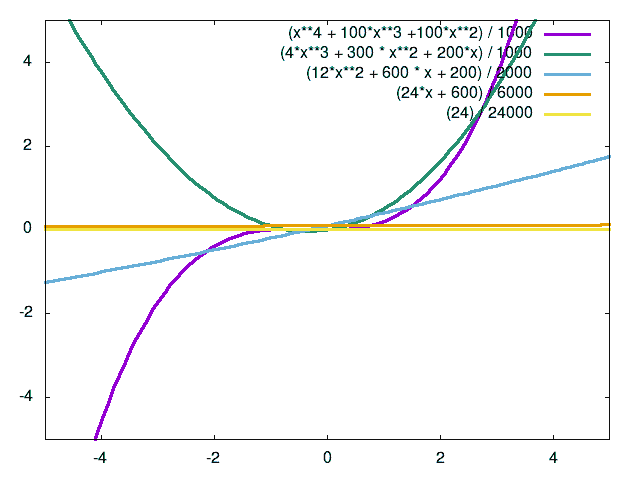

# 泰勒级数展开

> 原文：[`www.algorithm-archive.org/contents/taylor_series_expansion/taylor_series_expansion.html`](https://www.algorithm-archive.org/contents/taylor_series_expansion/taylor_series_expansion.html)

NOTE: Incomplete!

我受过物理学的正式训练。在我的脑海中，有几个数学主题模糊了数学和物理之间的界限。泰勒级数展开就是其中之一。

一方面，我可以看到这种展开如何被看作是纯粹数学的。我的意思是，这里是有定义：

其中  是沿实数或复数空间上的某个函数，  是我们展开的点，而  表示  的  阶导数。从这个角度来看，展开看起来就像是一系列导数连在一起！物理在哪里？好吧，让我们展开这个级数的前几个导数：

如果我们将导数替换为它们的物理量，从 0 开始展开，并设置

泰勒级数展开变成了经典物理学中最常见的公式之一，即*运动方程*！

注意，在这里，我们假设加速度是恒定的，但技术上可能有更高阶的项。

事实上，泰勒级数展开可以在最不寻常的地方找到，并且作为本书中许多不同算法的基础。起初，可能不明显为什么，但我们几乎可以用泰勒级数展开来近似任何光滑函数，并且我们包含的项越多，我们的近似就越好！例如，看图 1。任何函数都可以近似为该函数所有导数的和。如果我们评估这些导数在任意点，我们就可以非常接近实际函数。

这展示了泰勒级数展开的真正力量。它使我们能够通过将复杂函数近似为我们可以实际使用和想象的函数来更容易地处理它们！

## 许可证

##### 代码示例

代码示例受 MIT 许可协议（见[LICENSE.md](https://github.com/algorithm-archivists/algorithm-archive/blob/main/LICENSE.md)）许可。

##### 文本

本章的文本由[James Schloss](https://github.com/leios)编写，并受[Creative Commons Attribution-ShareAlike 4.0 International License](https://creativecommons.org/licenses/by-sa/4.0/legalcode)许可。

##### 图片/图形

+   图片"Taylor Approximation"由[James Schloss](https://github.com/leios)创建，并受[Creative Commons Attribution-ShareAlike 4.0 International License](https://creativecommons.org/licenses/by-sa/4.0/legalcode)许可。

##### 提交请求

在初始许可([#560](https://github.com/algorithm-archivists/algorithm-archive/pull/560))之后，以下拉取请求已修改了本章的文本或图形：

+   none
