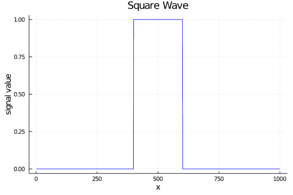
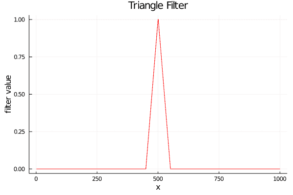
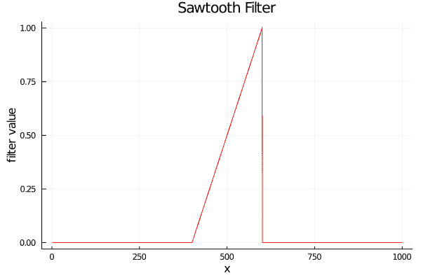
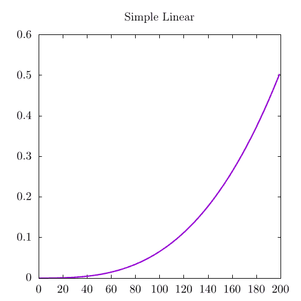
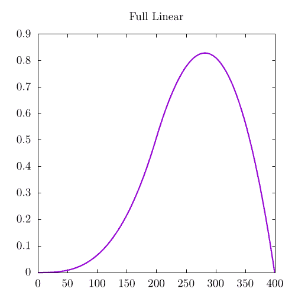
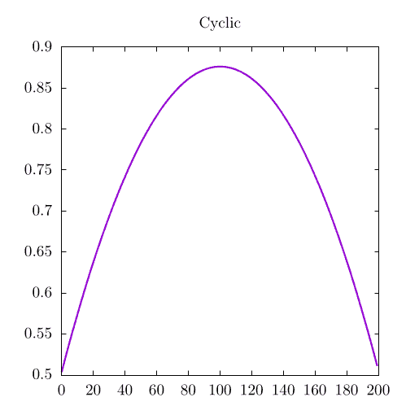

# 一维卷积

> 原文：[`www.algorithm-archive.org/contents/convolutions/1d/1d.html`](https://www.algorithm-archive.org/contents/convolutions/1d/1d.html)

如同在卷积的介绍部分中提到的，卷积允许数学家“混合”两个看似无关的函数；然而，这个定义并不十分严谨，因此可能更好地将卷积视为将滤波器应用于信号或图像的方法。这当然会引发更多问题：什么是滤波器？什么是信号？这一切与图像有何关联？

对于这个，我们将从一个预定义的信号开始。它是什么并不太重要，所以我们将选择一个方波，其中除了中心的一些元素被设置为 1 之外，其他所有元素都被设置为 0。这个信号可以被当作一个数组，或者是一个黑白的一维图像，其中除了中心的白色条纹之外，其他都是黑色。我们还将引入一个滤波器，它将是一个简单的三角波，其值达到 1。这两个都在下面展示：

 

因此，我们现在有一个信号和一个滤波器。我们如何将滤波器应用于信号？最简单的方法是遍历信号中的每个点，并将其与相邻元素混合，其中每个相邻元素根据滤波器的值进行加权。所以在这种情况下，如果三角波只有 3 个元素（`[0.5, 1, 0.5]`），则每个点的输出将会是

其中，是输出值，是输入数组（一个信号或图像），是遍历该信号的迭代元素。这样，“应用一个滤波器”的过程，简单来说就是围绕输入数组每个点进行三角波的乘法，然后对输出进行积分或求和。从某种意义上说，这意味着我们将移动滤波器，然后在每一步进行乘法和求和。这可以在以下动画中看到：

<../res/triangle_square_conv.mp4>

您的浏览器不支持视频标签。

在这里，紫色虚线是输出卷积，垂直线是迭代，蓝色线是原始信号，红色线是滤波器，绿色区域是当前位置信号乘以滤波器的结果。每个点的卷积是该点绿色区域的积分（求和）。

如果我们将这个概念扩展到整个离散空间，它可能看起来像这样：

其中`f[n]`和`g[n]`是某种形式的数组。这意味着卷积可以通过沿信号或过滤器移动信号来计算。这可以按照我们之前所说的那样来读取：每一步，我们移动过滤器，乘法，然后求和。当然，这里有一个小的注意事项。为什么我们要减去？当然，如果我们想“沿信号移动过滤器”，我们也可以通过*添加*来实现，但这实际上是一个完全不同的操作，称为*相关*，这将在稍后讨论。

这个方程最简单的解释与动画相同：我们反转第二个数组，并逐个步骤地将其通过第一个数组移动，在每个步骤进行简单的元素乘法和求和。有了这个想法，我们可以几乎直接将离散方程转换为如下代码：

```
function convolve_linear(signal::Array{T, 1}, filter::Array{T, 1},
                         output_size) where {T <: Number}

    # convolutional output
    out = Array{Float64,1}(undef, output_size)
    sum = 0

    for i = 1:output_size
        for j = max(1, i-length(filter)):i
            if j <= length(signal) && i-j+1 <= length(filter)
                sum += signal[j] * filter[i-j+1]
            end
        end

        out[i] = sum
        sum = 0
    end

    return out
end 
```

```
static double[] ConvolveLinear(double[] signal, double[] filter, int outputSize)
{
    // Convolutional output.
    var output = new double[outputSize];
    var sum = 0.0;

    for (var i = 0; i < outputSize; i++)
    {
        for (var j = Math.Max(0, i - filter.Length); j <= i; j++)
        {
            if (j < signal.Length && (i - j) < filter.Length)
            {
                sum += signal[j] * filter[i - j];
            }
        }

        output[i] = sum;
        sum = 0.0;
    }

    return output;
} 
```

```
def convolve_linear(signal, filter_array, output_size):
    out = np.zeros(output_size)
    s = 0

    for i in range(output_size):
        for j in range(max(0, i - len(filter_array)), i + 1):
            if j < len(signal) and (i - j) < len(filter_array):
                s += signal[j] * filter_array[i - j]
        out[i] = s
        s = 0

    return out 
```

理解这段代码的最简单方法就像阅读教科书一样去阅读它。对于输出域中的每个元素，我们都在乘以反转后的过滤器（`filter[i-j]`）后，从`i-length(filter)`到`i`的某个子集元素进行求和。这样，它与之前提到的数学符号完全相同。

与动画不同，动画中过滤器在屏幕左侧边缘连续出现，而我们为这一章节的这一部分编写的代码要求用户指定他们期望的输出数组长度。确定卷积边缘应该发生什么是一个有些激烈争论的话题，并且取决于用户实际想要什么，所以我们将在本章稍后更详细地讨论这个问题。

作为一条重要提示，如果我们将卷积扩展到连续空间，我们可能会写一些像这样的东西：

注意，在这种情况下，`x`和`y`不一定是空间元素，但解释与之前相同。

在这个阶段，数学和代码可能仍然有些晦涩难懂，所以尝试一些不同的过滤器并思考这些操作在实际应用中的使用方法是个不错的主意。

## 玩转过滤器

实际上，学习卷积的最佳方式是通过使用它们处理多种不同的信号和过滤器，所以让我们通过将一个相对尖锐的高斯函数与正弦波进行卷积来进一步扩展之前的三角形过滤器，这可以在下面的动画中看到：

<../res/1d_gaussian.mp4>

您的浏览器不支持视频标签。

在实践中，这里的卷积输出与我们之前展示的三角波非常相似。最终的卷积图像看起来非常像方波，只是其边界已经被平滑或“模糊”。实际上，每当使用高斯滤波器时，它总是会模糊其他卷积信号，这就是为什么卷积高斯也被称为*模糊操作*。这个操作在处理二维图像时非常常用，我们将在下一节讨论野外常见的核。然而，通过卷积随机分布与较大的高斯滤波器来观察模糊操作的效果仍然很有趣：

<../res/1d_rand_gaussian_cyclic.mp4>

您的浏览器不支持视频标签。

在这个动画中，最终的卷积效果非常模糊，以至于看起来与随机输入信号完全不相关！实际上，与之前的高斯和三角波动画相比，这个动画似乎融合得更多。这是因为高斯函数的宽度比之前的滤波器要宽。一般来说，滤波器越宽，模糊效果越强。

如果我们将高斯函数与另一个高斯函数进行卷积，会发生什么情况呢？下面将展示结果：

<../res/double_gaussian.mp4>

您的浏览器不支持视频标签。

如预期的那样，输出是一个更模糊的高斯，本质上只是更宽。如果你特别关注可视化，你可能会注意到这个可视化中的绿色区域并没有正确地与两个数组的重叠对齐。不用担心！这正是应该发生的！记住，卷积需要信号和滤波器的*乘法*，这与信号是方波时的重叠相同；然而，在两个不同信号的情况下，我们应该期望乘法输出看起来有些不同。

让我们将这个概念扩展到最后一个例子，即一个方波与一个类似这样的三角波、锯齿波函数进行卷积：



这是本章的第一个非对称滤波器，其卷积看起来是这样的：

<../res/1d_sawtooth.mp4>

您的浏览器不支持视频标签。

非对称滤波器对于测试卷积以确保输出正确非常有用，因此在这个动画上多停留一会儿可能是有益的。注意，当反转的锯齿波函数与方波相互作用时，卷积有一个加速的正斜率。这是有道理的，因为三角形的较小部分首先相互作用。同样，当锯齿波函数离开方波时，有一个负加速斜率。

## 处理边界

在所有的动画中，我们都展示了过滤器不断出现在屏幕的左侧边缘，但在边界处这样做并不总是最好的选择。实际上，这些边界条件在编码上有些复杂，因此在本节中，我们将从之前代码示例中引入的相对简单的边界条件开始。

### 简单边界

通常情况下，如果用户想要看到两个信号之间的完整卷积，输出大小必须是两个信号大小的总和，否则我们无法遍历整个卷积输出域。例如，这里再次是随机噪声与高斯函数卷积，但具有非周期性边界：

<../res/1d_rand_gaussian_full.mp4>

您的浏览器不支持视频标签。

这显示了两个信号的完整、无界卷积，我们可以清楚地看到动画开始和结束时的“上升”和“下降”阶段。尽管如此，有许多应用场景中，用户实际上需要指定输出域为另一个长度，例如输入信号之一的大小。

在这种情况下，最简单的边界假设是，每当过滤器触及图像的末端时，它就简单地消失。另一种思考方式是，信号只存在于我们指定的域内，域外的所有值都是 0；因此，过滤器不会对其范围之外的任何信号元素求和。作为一个例子，让我们以前面的例子为例：

<../res/1d_rand_gaussian_simple.mp4>

您的浏览器不支持视频标签。

与没有边界条件的情况类似，这个卷积需要“上升”，但不需要“下降”。这是因为卷积输出不再超出原始信号的边界，所以有界卷积是完整卷积的子集。更重要的是，卷积在右侧不再达到 0。这意味着我们实际上忽略了一个相当重要的卷积部分！

这 100%是正确的；然而，如果信号很大而过滤器很小（如大多数图像处理的情况），我们并不真的那么关心我们错过了卷积的哪些位。此外，有一种方法可以通过修改过滤器开始的位置来居中卷积。例如，我们可以让过滤器的一半已经存在并重叠在卷积的第一个计算点的信号上。因此，在图像上进行卷积时，简单边界经常被使用。

在之前的代码片段中，我们能够执行有界和无界卷积。这里再次呈现，以供清晰参考：

```
function convolve_linear(signal::Array{T, 1}, filter::Array{T, 1},
                         output_size) where {T <: Number}

    # convolutional output
    out = Array{Float64,1}(undef, output_size)
    sum = 0

    for i = 1:output_size
        for j = max(1, i-length(filter)):i
            if j <= length(signal) && i-j+1 <= length(filter)
                sum += signal[j] * filter[i-j+1]
            end
        end

        out[i] = sum
        sum = 0
    end

    return out
end 
```

```
static double[] ConvolveLinear(double[] signal, double[] filter, int outputSize)
{
    // Convolutional output.
    var output = new double[outputSize];
    var sum = 0.0;

    for (var i = 0; i < outputSize; i++)
    {
        for (var j = Math.Max(0, i - filter.Length); j <= i; j++)
        {
            if (j < signal.Length && (i - j) < filter.Length)
            {
                sum += signal[j] * filter[i - j];
            }
        }

        output[i] = sum;
        sum = 0.0;
    }

    return output;
} 
```

```
def convolve_linear(signal, filter_array, output_size):
    out = np.zeros(output_size)
    s = 0

    for i in range(output_size):
        for j in range(max(0, i - len(filter_array)), i + 1):
            if j < len(signal) and (i - j) < len(filter_array):
                s += signal[j] * filter_array[i - j]
        out[i] = s
        s = 0

    return out 
```

这里，有界和无界版本之间的主要区别是，有界情况下的输出数组大小更小。对于无界卷积，函数调用时指定的输出数组大小是两个信号大小的总和：

```
# full convolution, output will be the size of x + y - 1
full_linear_output = convolve_linear(x, y, length(x) + length(y) - 1) 
```

```
// Full convolution, output will be the size of x + y - 1.
var fullLinearOutput = ConvolveLinear(x, y, x.Length + y.Length - 1); 
```

```
# full convolution, output will be the size of x + y - 1
full_linear_output = convolve_linear(x, y, len(x) + len(y) - 1) 
```

另一方面，有界调用会将输出数组的大小简单地设置为信号的长度。

```
# simple boundaries
simple_linear_output = convolve_linear(x, y, length(x)) 
```

```
// Simple boundaries.
var simpleLinearOutput = ConvolveLinear(x, y, x.Length); 
```

```
# simple boundaries
simple_linear_output = convolve_linear(x, y, len(x)) 
```

最后，正如我们之前提到的，通过改变我们计算滤波器上每个点的位置，我们可以通过改变位置来使有界卷积居中。这可以通过修改以下行来完成：

```
for j = max(1, i-length(filter)):i 
```

```
for (var j = Math.Max(0, i - filter.Length); j <= i; j++) 
```

```
for j in range(max(0, i - len(filter_array)), i + 1): 
```

在这里，`j` 从 `i-length(filter)` 计数到 `i`。为了使卷积居中，它需要从 `i-(length(filter)/2)` 计数到 `i+(length(filter)/2)`。

我认为这是停止简单边界条件讨论的好地方。现在让我们更详细地谈谈我们想要滤波器在每个循环中连续重新出现的案例。这种情况被称为“周期性边界条件”，并用于本章开头的可视化。

### 周期性边界条件

虽然周期性边界条件比上一节提到的那些更复杂，但它们仍然*相对*简单易行。在这些条件下，每当滤波器遇到边界时，它就会将自己包裹到信号的另一端。这样，信号是周期的，其相同的副本作为左右邻居。这些邻居又有其他邻居，然后又有更多的邻居，从而在两个方向上形成延伸到无穷远的信号海洋。对我们来说，这意味着当滤波器离开域的一边时，它简单地出现在另一边的对面。

这种特定的卷积被称为*循环卷积*，也是通过卷积定理工作的卷积最常见的输出，这将在另一节中讨论。为了清晰起见：这里是我们上面展示的相同循环可视化，带有随机分布和高斯信号。

<../res/1d_rand_gaussian_cyclic.mp4>

您的浏览器不支持视频标签。

在代码中，这通常意味着使用某种形式的模运算，如下所示：

```
function convolve_cyclic(signal::Array{T, 1},
                         filter::Array{T, 1}) where {T <: Number}

    # output size will be the size of sign
    output_size = max(length(signal), length(filter))

    # convolutional output
    out = Array{Float64,1}(undef,output_size)
    sum = 0

    for i = 1:output_size
        for j = 1:output_size
            sum += get(signal, mod1(j, output_size), 0) * get(filter, mod1(i-j, output_size), 0)
        end

        out[i] = sum
        sum = 0

    end

    return out
end 
```

```
static double[] ConvolveCyclic(double[] signal, double[] filter)
{
    var outputSize = Math.Max(signal.Length, filter.Length);

    // Convolutional output.
    var output = new double[outputSize];
    var sum = 0.0;

    for (var i = 0; i < outputSize; i++)
    {
        for (var j = 0; j < outputSize; j++)
        {
            if (Mod(i - j, outputSize) < filter.Length)
            {
                sum += signal[Mod(j - 1, outputSize)] * filter[Mod(i - j, outputSize)];
            }
        }

        output[i] = sum;
        sum = 0.0;
    }

    return output;
} 
```

```
def convolve_cyclic(signal, filter_array):
    output_size = max(len(signal), len(filter_array))
    out = np.zeros(output_size)
    s = 0

    for i in range(output_size):
        for j in range(output_size):
            if(mod1(i - j, output_size) < len(filter_array)):
                s += signal[mod1(j - 1, output_size)] * filter_array[mod1(i - j, output_size)]
        out[i] = s
        s = 0

    return out 
```

这基本上与之前相同，只是模运算允许我们在周期域上工作。

在继续之前，作为最后的笔记：处理边界是一个棘手的问题，并且可以极大地改变输出卷积的行为。因此，考虑程序员实际需要哪种类型的边界条件是非常重要的。边界条件的选取将是计算机图形学和物理算法中常见的一个主题，在这些算法中，研究人员经常需要在某种数组上展示和模拟数据。

## 示例代码

对于本章相关的代码，我们使用了卷积来生成一些用于完整卷积的文件，以及本章讨论的周期性和简单边界条件。

```
using DelimitedFiles
using LinearAlgebra

function convolve_cyclic(signal::Array{T, 1},
                         filter::Array{T, 1}) where {T <: Number}

    # output size will be the size of sign
    output_size = max(length(signal), length(filter))

    # convolutional output
    out = Array{Float64,1}(undef,output_size)
    sum = 0

    for i = 1:output_size
        for j = 1:output_size
            sum += get(signal, mod1(j, output_size), 0) * get(filter, mod1(i-j, output_size), 0)
        end

        out[i] = sum
        sum = 0

    end

    return out
end

function convolve_linear(signal::Array{T, 1}, filter::Array{T, 1},
                         output_size) where {T <: Number}

    # convolutional output
    out = Array{Float64,1}(undef, output_size)
    sum = 0

    for i = 1:output_size
        for j = max(1, i-length(filter)):i
            if j <= length(signal) && i-j+1 <= length(filter)
                sum += signal[j] * filter[i-j+1]
            end
        end

        out[i] = sum
        sum = 0
    end

    return out
end

function main()

    # sawtooth functions for x and y
    x = [float(i)/200 for i = 1:200]
    y = [float(i)/200 for i = 1:200]

    # Normalization is not strictly necessary, but good practice
    normalize!(x)
    normalize!(y)

    # full convolution, output will be the size of x + y - 1
    full_linear_output = convolve_linear(x, y, length(x) + length(y) - 1)

    # simple boundaries
    simple_linear_output = convolve_linear(x, y, length(x))

    # cyclic convolution
    cyclic_output = convolve_cyclic(x, y)

    # outputting convolutions to different files for plotting in external code
    writedlm("full_linear.dat", full_linear_output)
    writedlm("simple_linear.dat", simple_linear_output)
    writedlm("cyclic.dat", cyclic_output)

end 
```

```
using System;
using System.IO;

namespace Convolution1D
{
    public class Convolution1D
    {
        // Creates a sawtooth function with the given length.
        static double[] CreateSawtooth(int length)
        {
            var array = new double[length];
            for (var i = 0; i < length; i++)
                array[i] = (i + 1) / 200f;
            return array;
        }

        // Normalizes the given array.
        static void Normalize(double[] array)
        {
            var norm = Norm(array);
            for (var i = 0; i < array.Length; i++)
                array[i] /= norm;
        }

        // Calculates the norm of the array.
        static double Norm(double[] array)
        {
            var sum = 0.0;
            for (var i = 0; i < array.Length; i++)
                sum += Math.Pow(array[i], 2);
            return Math.Sqrt(sum);
        }

        // Modulus function which handles negative values properly.
        // Assumes that y >= 0.
        static int Mod(int x, int y) => ((x % y) + y) % y;

        static double[] ConvolveCyclic(double[] signal, double[] filter)
        {
            var outputSize = Math.Max(signal.Length, filter.Length);

            // Convolutional output.
            var output = new double[outputSize];
            var sum = 0.0;

            for (var i = 0; i < outputSize; i++)
            {
                for (var j = 0; j < outputSize; j++)
                {
                    if (Mod(i - j, outputSize) < filter.Length)
                    {
                        sum += signal[Mod(j - 1, outputSize)] * filter[Mod(i - j, outputSize)];
                    }
                }

                output[i] = sum;
                sum = 0.0;
            }

            return output;
        }

        static double[] ConvolveLinear(double[] signal, double[] filter, int outputSize)
        {
            // Convolutional output.
            var output = new double[outputSize];
            var sum = 0.0;

            for (var i = 0; i < outputSize; i++)
            {
                for (var j = Math.Max(0, i - filter.Length); j <= i; j++)
                {
                    if (j < signal.Length && (i - j) < filter.Length)
                    {
                        sum += signal[j] * filter[i - j];
                    }
                }

                output[i] = sum;
                sum = 0.0;
            }

            return output;
        }

        static void Main()
        {
            // Create sawtooth functions for x and y.
            var x = CreateSawtooth(200);
            var y = CreateSawtooth(200);

            // Normalization is not strictly necessary, but good practice.
            Normalize(x);
            Normalize(y);

            // Full convolution, output will be the size of x + y - 1.
            var fullLinearOutput = ConvolveLinear(x, y, x.Length + y.Length - 1);
            // Simple boundaries.
            var simpleLinearOutput = ConvolveLinear(x, y, x.Length);
            // Cyclic convolution.
            var cyclicOutput = ConvolveCyclic(x, y);

            // Output convolutions to different files for plotting.
            File.WriteAllText("full_linear.dat", String.Join(Environment.NewLine, fullLinearOutput));
            File.WriteAllText("simple_linear.dat", String.Join(Environment.NewLine, simpleLinearOutput));
            File.WriteAllText("cyclic.dat", String.Join(Environment.NewLine, cyclicOutput));
        }
    }
} 
```

```
import numpy as np

def mod1(x, y): return ((x % y) + y) % y

def convolve_cyclic(signal, filter_array):
    output_size = max(len(signal), len(filter_array))
    out = np.zeros(output_size)
    s = 0

    for i in range(output_size):
        for j in range(output_size):
            if(mod1(i - j, output_size) < len(filter_array)):
                s += signal[mod1(j - 1, output_size)] * filter_array[mod1(i - j, output_size)]
        out[i] = s
        s = 0

    return out

def convolve_linear(signal, filter_array, output_size):
    out = np.zeros(output_size)
    s = 0

    for i in range(output_size):
        for j in range(max(0, i - len(filter_array)), i + 1):
            if j < len(signal) and (i - j) < len(filter_array):
                s += signal[j] * filter_array[i - j]
        out[i] = s
        s = 0

    return out

# sawtooth functions for x and y
x = [float(i + 1)/200 for i in range(200)]
y = [float(i + 1)/200 for i in range(200)]

# Normalization is not strictly necessary, but good practice
x /= np.linalg.norm(x)
y /= np.linalg.norm(y)

# full convolution, output will be the size of x + y - 1
full_linear_output = convolve_linear(x, y, len(x) + len(y) - 1)

# simple boundaries
simple_linear_output = convolve_linear(x, y, len(x))

# cyclic convolution
cyclic_output = convolve_cyclic(x, y)

# outputting convolutions to different files for plotting in external code
np.savetxt('full_linear.dat', full_linear_output)
np.savetxt('simple_linear.dat', simple_linear_output)
np.savetxt('cyclic.dat', cyclic_output) 
```

在一个测试案例中，我们选择使用两个锯齿波函数，应该产生以下图像：

| 描述 | 图片 |
| --- | --- |
| 简单边界 |  |
| 全部 |  |
| 循环 |  |

作为合理性检查，请确保有界卷积是完整卷积的子集。在这个例子中，有界卷积是完整卷积的开始，但完全有可能它可能是中间部分或完全不同的位置，这取决于你在卷积的内层求和循环中的计数方式。

## 许可证

##### 代码示例

代码示例遵循 MIT 许可协议（可在[LICENSE.md](https://github.com/algorithm-archivists/algorithm-archive/blob/main/LICENSE.md)中找到）。

##### 图片/图形

+   图片"方波"由[James Schloss](https://github.com/leios)创建，并授权于[Creative Commons Attribution-ShareAlike 4.0 国际许可协议](https://creativecommons.org/licenses/by-sa/4.0/legalcode)。

+   图片"三角波"由[James Schloss](https://github.com/leios)创建，并授权于[Creative Commons Attribution-ShareAlike 4.0 国际许可协议](https://creativecommons.org/licenses/by-sa/4.0/legalcode)。

+   视频文件"三角平方卷积"由[James Schloss](https://github.com/leios)创建，并授权于[Creative Commons Attribution-ShareAlike 4.0 国际许可协议](https://creativecommons.org/licenses/by-sa/4.0/legalcode)。

+   视频文件"高斯平方卷积"由[James Schloss](https://github.com/leios)创建，并授权于[Creative Commons Attribution-ShareAlike 4.0 国际许可协议](https://creativecommons.org/licenses/by-sa/4.0/legalcode)。

+   视频文件"高斯随机卷积"由[James Schloss](https://github.com/leios)创建，并授权于[Creative Commons Attribution-ShareAlike 4.0 国际许可协议](https://creativecommons.org/licenses/by-sa/4.0/legalcode)。

+   视频文件"双重卷积"由[James Schloss](https://github.com/leios)创建，并授权于[Creative Commons Attribution-ShareAlike 4.0 国际许可协议](https://creativecommons.org/licenses/by-sa/4.0/legalcode)。

+   图片"锯齿波"由[James Schloss](https://github.com/leios)创建，并授权于[Creative Commons Attribution-ShareAlike 4.0 国际许可协议](https://creativecommons.org/licenses/by-sa/4.0/legalcode)。

+   视频文件"锯齿平方卷积"由[James Schloss](https://github.com/leios)创建，并授权于[Creative Commons Attribution-ShareAlike 4.0 国际许可协议](https://creativecommons.org/licenses/by-sa/4.0/legalcode)。

+   视频文件 "Full Random Convolution" 由 [James Schloss](https://github.com/leios) 创建，并授权于 [Creative Commons Attribution-ShareAlike 4.0 国际许可协议](https://creativecommons.org/licenses/by-sa/4.0/legalcode)。

+   视频文件 "Simple Random Convolution" 由 [James Schloss](https://github.com/leios) 创建，并授权于 [Creative Commons Attribution-ShareAlike 4.0 国际许可协议](https://creativecommons.org/licenses/by-sa/4.0/legalcode)。

+   图片 "Simple Linear" 由 [James Schloss](https://github.com/leios) 创建，并授权于 [Creative Commons Attribution-ShareAlike 4.0 国际许可协议](https://creativecommons.org/licenses/by-sa/4.0/legalcode)。

+   图片 "Full Linear" 由 [James Schloss](https://github.com/leios) 创建，并授权于 [Creative Commons Attribution-ShareAlike 4.0 国际许可协议](https://creativecommons.org/licenses/by-sa/4.0/legalcode)。

+   图片 "Cyclic" 由 [James Schloss](https://github.com/leios) 创建，并授权于 [Creative Commons Attribution-ShareAlike 4.0 国际许可协议](https://creativecommons.org/licenses/by-sa/4.0/legalcode)。

##### 文本

本章的文本由 [James Schloss](https://github.com/leios) 编写，并授权于 [Creative Commons Attribution-ShareAlike 4.0 国际许可协议](https://creativecommons.org/licenses/by-sa/4.0/legalcode)。

[]


##### 提交请求

在初始授权 ([#560](https://github.com/algorithm-archivists/algorithm-archive/pull/560)) 之后，以下提交请求修改了本章的文本或图形：

+   无
