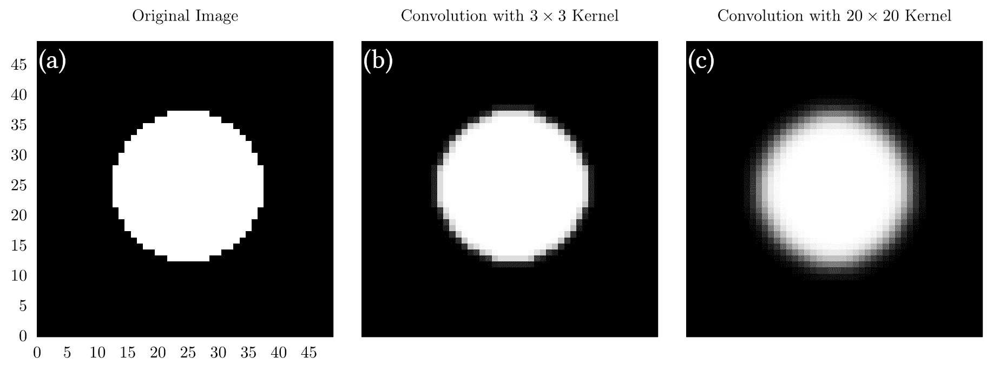
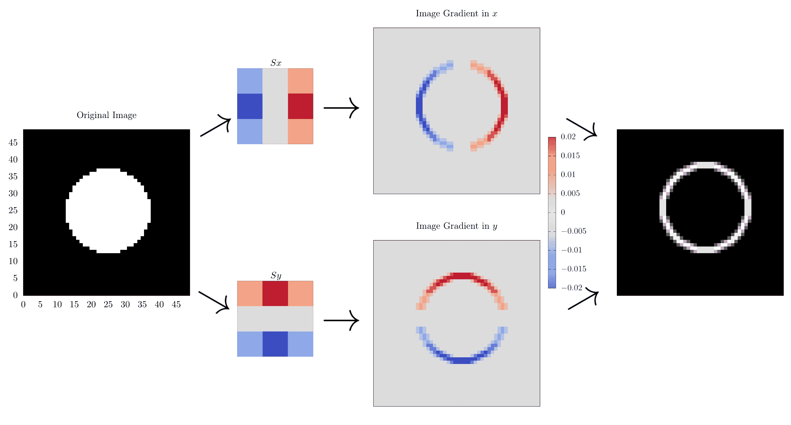

# 图像上的卷积

> 原文：[`www.algorithm-archive.org/contents/convolutions/2d/2d.html`](https://www.algorithm-archive.org/contents/convolutions/2d/2d.html)

对于本节，我们将不再关注信号，而是关注图像（填充有红色、绿色和蓝色值的元素数组）。也就是说，对于代码示例，可能会使用灰度图像，这样每个数组元素由某些浮点值组成，而不是颜色。此外，在本章中，我们不会过多地讨论边界条件，而将使用一维卷积部分中引入的简单边界。

将一维卷积扩展到二维需要考虑索引等问题，但最终是相同的操作。以下是二维图像卷积的动画：

<../res/2d.mp4>

您的浏览器不支持视频标签。

在这种情况下，我们使用一个 3x3 的正方形滤波器与图像卷积，所有值都为。这产生了一个简单的模糊效果，这在上一节的讨论中是预期的。在代码中，二维卷积可能看起来像这样：

```
function convolve_linear(signal::Array{T, 2}, filter::Array{T, 2},
                         output_size) where {T <: Number}

    # convolutional output
    out = Array{Float64,2}(undef, output_size)
    sum = 0

    for i = 1:output_size[1]
        for j = 1:output_size[2]
            for k = max(1, i-size(filter)[1]):i
                for l = max(1, j-size(filter)[2]):j
                    if k <= size(signal)[1] && i-k+1 <= size(filter)[1] &&
                       l <= size(signal)[2] && j-l+1 <= size(filter)[2]
                        sum += signal[k,l] * filter[i-k+1, j-l+1]
                    end
                end
            end

            out[i,j] = sum
            sum = 0
        end
    end

    return out
end 
```

```
def convolve_linear(signal, filter, output_size):
    out = np.zeros(output_size)
    sum = 0

    for i in range(output_size[0]):
        for j in range(output_size[1]):
            for k in range(max(0, i-filter.shape[0]), i+1):
                for l in range(max(0, j-filter.shape[1]), j+1):
                    with suppress(IndexError):
                        sum += signal[k, l] * filter[i-k, j-l]
            out[i, j] = sum
            sum = 0

    return out 
```

这与我们之前章节中展示的非常相似；然而，它本质上需要四个可迭代的维度，因为我们需要遍历输出域的每个轴*以及*滤波器。

在这个阶段，突出显示用于图像卷积的常见过滤器是值得的。特别是，我们将进一步讨论在上一节中引入的高斯滤波器，然后介绍另一组称为 Sobel 算子的核，这些核用于简单的边缘检测或图像导数。

## 高斯核

高斯核作为图像的有效*模糊*操作。提醒一下，任何高斯分布的公式是

其中，σ是标准差，是高斯宽度的一个度量。σ越大，高斯越大；然而，记住高斯必须适合滤波器，否则它将被截断！例如，如果你使用一个σ为 3 的滤波器，你不应该使用σ为 5。一些σ的定义允许用户在σx 和σy 上有不同的偏差来创建椭球高斯，但为了本章的目的，我们将假设σx=σy。一般来说，滤波器和标准差越大，最终的卷积越“模糊”。

在这个阶段，编写一些代码是很重要的，因此我们将生成一个简单的函数，该函数返回具有指定标准差和滤波器大小的高斯核。

```
function create_gaussian_kernel(kernel_size)

    kernel = zeros(kernel_size, kernel_size)

    # The center must be offset by 0.5 to find the correct index
    center = kernel_size * 0.5 + 0.5

    sigma = sqrt(0.1*kernel_size)

    for i = 1:kernel_size
        for j = 1:kernel_size
            kernel[i,j] = exp(-((i-center)² + (j-center)²) / (2*sigma²))
        end
    end

    return normalize(kernel)

end 
```

```
def create_gaussian_kernel(kernel_size):
    kernel = np.zeros((kernel_size, kernel_size))

    # The center must be offset by 0.5 to find the correct index
    center = kernel_size*0.5 + 0.5

    sigma = np.sqrt(0.1*kernel_size)

    def kernel_function(x, y):
        return np.exp(-((x-center+1)**2 + (y-center+1)**2)/(2*sigma**2))

    kernel = np.fromfunction(kernel_function, (kernel_size, kernel_size))
    return kernel / np.linalg.norm(kernel) 
```

虽然完全有可能创建一个标准差与核大小无关的高斯核，但我们决定在本章中强制这两个量之间的关系。一如既往，我们鼓励你玩转代码，以任何你想要的方式创建自己的高斯核！作为备注，所有核将在最后通过所有内部元素的总和进行缩放（归一化）。这确保了卷积的输出不会有一个令人讨厌的缩放因子与之相关。

下面是一些通过使用上述代码生成的核对圆形黑白图像应用后生成的图像。



在 (a) 中，我们展示了原始图像，它只是一个位于  网格中心的白色圆圈。在 (b) 中，我们展示了使用  核卷积后的图像。在 (c) 中，我们展示了使用  核卷积后的图像。在这里，我们可以看到 (c) 比起 (b) 来要模糊得多，这是核大小的直接后果。

我们还有很多可以讨论的内容，但现在是一个很好的时机，转向一个稍微复杂一点的卷积方法：Sobel 算子。

## Sobel 算子

Sobel 算子通过突出显示发生较大变化的部分，有效地在图像上执行梯度操作。本质上，这意味着这个操作可以被看作是一个简单的边缘检测器。本质上，-维度的 Sobel 算子由  个独立的梯度卷积（每个维度一个）组成，然后组合成一个最终的输出数组。再次强调，为了本章的目的，我们将坚持使用二维，它将由沿  和  方向的两个单独的梯度组成。每个梯度将通过使用相应的 Sobel 算子卷积我们的图像来创建：

梯度可以通过卷积找到，如下所示：

这里，  是输入数组或图像。最后，这些梯度可以通过平方和来求和，以找到总 Sobel 算子或图像梯度：

因此，现在让我们展示它在实际中的表现：



在这个图中，我们从右边的圆形图像开始，然后使用  和  算子卷积它，以找到沿  和  的梯度，然后再将它们进行平方和以获得最终的图像梯度。在这里，我们可以看到我们输入图像的边缘被突出显示，显示了圆的轮廓。这就是为什么 Sobel 算子也被称为简单的边缘检测，并且是许多更复杂的边缘检测方法（如 Canny 提出的方法）的一个基本组成部分[[1]](#cite-1)。

在代码中，Sobel 算子首先涉及找到  和  中的算子，然后通过传统的卷积应用它们：

```
function create_sobel_operators()
    Sx = [1.0, 2.0, 1.0]*[-1.0 0.0 1.0] / 9
    Sy = [-1.0, 0.0, 1.0]*[1.0 2.0 1.0] / 9

    return Sx, Sy
end

function compute_sobel(signal)
    Sx, Sy = create_sobel_operators()

    Gx = convolve_linear(signal, Sx, size(signal) .+ size(Sx))
    Gy = convolve_linear(signal, Sy, size(signal) .+ size(Sy))

    return sqrt.(Gx.² .+ Gy.²)
end 
```

```
def create_sobel_operators():
    Sx = np.dot([[1.0], [2.0], [1.0]], [[-1.0, 0.0, 1.0]]) / 9
    Sy = np.dot([[-1.0], [0.0], [1.0]], [[1.0, 2.0, 1.0]]) / 9

    return Sx, Sy

def sum_matrix_dimensions(mat1, mat2):
    return (mat1.shape[0] + mat2.shape[0], 
            mat1.shape[1] + mat2.shape[1])

def compute_sobel(signal):
    Sx, Sy = create_sobel_operators()

    Gx = convolve_linear(signal, Sx, sum_matrix_dimensions(signal, Sx))
    Gy = convolve_linear(signal, Sy, sum_matrix_dimensions(signal, Sy))

    return np.sqrt(np.power(Gx, 2) + np.power(Gy, 2)) 
```

这样，我相信我们已经到了讨论二维卷积的好地方。我们肯定会在这个话题上回来，因为新的算法需要更多信息。

## 示例代码

对于本节中的代码，我们对一维卷积章节中的可视化进行了修改，以添加一个二维变体，用于模糊随机白噪声图像。我们还添加了创建高斯核和 Sobel 算子，并将其应用于圆的代码，如文本所示。

```
using DelimitedFiles
using LinearAlgebra

function convolve_linear(signal::Array{T, 2}, filter::Array{T, 2},
                         output_size) where {T <: Number}

    # convolutional output
    out = Array{Float64,2}(undef, output_size)
    sum = 0

    for i = 1:output_size[1]
        for j = 1:output_size[2]
            for k = max(1, i-size(filter)[1]):i
                for l = max(1, j-size(filter)[2]):j
                    if k <= size(signal)[1] && i-k+1 <= size(filter)[1] &&
                       l <= size(signal)[2] && j-l+1 <= size(filter)[2]
                        sum += signal[k,l] * filter[i-k+1, j-l+1]
                    end
                end
            end

            out[i,j] = sum
            sum = 0
        end
    end

    return out
end

function create_gaussian_kernel(kernel_size)

    kernel = zeros(kernel_size, kernel_size)

    # The center must be offset by 0.5 to find the correct index
    center = kernel_size * 0.5 + 0.5

    sigma = sqrt(0.1*kernel_size)

    for i = 1:kernel_size
        for j = 1:kernel_size
            kernel[i,j] = exp(-((i-center)² + (j-center)²) / (2*sigma²))
        end
    end

    return normalize(kernel)

end

function create_sobel_operators()
    Sx = [1.0, 2.0, 1.0]*[-1.0 0.0 1.0] / 9
    Sy = [-1.0, 0.0, 1.0]*[1.0 2.0 1.0] / 9

    return Sx, Sy
end

function compute_sobel(signal)
    Sx, Sy = create_sobel_operators()

    Gx = convolve_linear(signal, Sx, size(signal) .+ size(Sx))
    Gy = convolve_linear(signal, Sy, size(signal) .+ size(Sy))

    return sqrt.(Gx.² .+ Gy.²)
end

# Simple function to create a square grid with a circle embedded inside of it
function create_circle(image_resolution, grid_extents, radius)
    out = zeros(image_resolution, image_resolution)

    for i = 1:image_resolution
        x_position = ((i-1)*grid_extents/image_resolution)-0.5*grid_extents
        for j = 1:image_resolution
            y_position = ((j-1)*grid_extents/image_resolution)-0.5*grid_extents
            if x_position² + y_position² <= radius²
                out[i,j] = 1.0
            end
        end
    end 

    return out
end

function main()

    # Random distribution in x
    x = rand(100, 100)

    # Gaussian signals
    y = [exp(-(((i-50)/100)² + ((j-50)/100)²)/.01) for i = 1:100, j=1:100]

    # Normalization is not strictly necessary, but good practice
    normalize!(x)
    normalize!(y)

    # full convolution, output will be the size of x + y
    full_linear_output = convolve_linear(x, y, size(x) .+ size(y))

    # simple boundaries
    simple_linear_output = convolve_linear(x, y, size(x))

    # outputting convolutions to different files for plotting in external code
    writedlm("full_linear.dat", full_linear_output)
    writedlm("simple_linear.dat", simple_linear_output)

    # creating simple circle and 2 different Gaussian kernels
    circle = create_circle(50,2,0.5)

    normalize!(circle)

    small_kernel = create_gaussian_kernel(3)
    large_kernel = create_gaussian_kernel(25)

    small_kernel_output = convolve_linear(circle, small_kernel,
                                          size(circle).+size(small_kernel))
    large_kernel_output = convolve_linear(circle, large_kernel,
                                          size(circle).+size(large_kernel))

    writedlm("small_kernel.dat", small_kernel_output)
    writedlm("large_kernel.dat", large_kernel_output)

    # Using the circle for Sobel operations as well
    sobel_output = compute_sobel(circle)

    writedlm("sobel_output.dat", sobel_output)

end 
```

```
import numpy as np
from contextlib import suppress

def convolve_linear(signal, filter, output_size):
    out = np.zeros(output_size)
    sum = 0

    for i in range(output_size[0]):
        for j in range(output_size[1]):
            for k in range(max(0, i-filter.shape[0]), i+1):
                for l in range(max(0, j-filter.shape[1]), j+1):
                    with suppress(IndexError):
                        sum += signal[k, l] * filter[i-k, j-l]
            out[i, j] = sum
            sum = 0

    return out

def create_gaussian_kernel(kernel_size):
    kernel = np.zeros((kernel_size, kernel_size))

    # The center must be offset by 0.5 to find the correct index
    center = kernel_size*0.5 + 0.5

    sigma = np.sqrt(0.1*kernel_size)

    def kernel_function(x, y):
        return np.exp(-((x-center+1)**2 + (y-center+1)**2)/(2*sigma**2))

    kernel = np.fromfunction(kernel_function, (kernel_size, kernel_size))
    return kernel / np.linalg.norm(kernel)

def create_sobel_operators():
    Sx = np.dot([[1.0], [2.0], [1.0]], [[-1.0, 0.0, 1.0]]) / 9
    Sy = np.dot([[-1.0], [0.0], [1.0]], [[1.0, 2.0, 1.0]]) / 9

    return Sx, Sy

def sum_matrix_dimensions(mat1, mat2):
    return (mat1.shape[0] + mat2.shape[0], 
            mat1.shape[1] + mat2.shape[1])

def compute_sobel(signal):
    Sx, Sy = create_sobel_operators()

    Gx = convolve_linear(signal, Sx, sum_matrix_dimensions(signal, Sx))
    Gy = convolve_linear(signal, Sy, sum_matrix_dimensions(signal, Sy))

    return np.sqrt(np.power(Gx, 2) + np.power(Gy, 2))

def create_circle(image_resolution, grid_extents, radius):
    out = np.zeros((image_resolution, image_resolution))

    for i in range(image_resolution):
        x_position = ((i * grid_extents / image_resolution)
                      - 0.5 * grid_extents)
        for j in range(image_resolution):
            y_position = ((j * grid_extents / image_resolution)
                          - 0.5 * grid_extents)
            if x_position ** 2 + y_position ** 2 <= radius ** 2:
                out[i, j] = 1.0

    return out

def main():

    # Random distribution in x
    x = np.random.rand(100, 100)

    # Gaussian signals
    def create_gaussian_signals(i, j):
        return np.exp(-(((i-50)/100) ** 2 +
                        ((j-50)/100) ** 2) / .01)
    y = np.fromfunction(create_gaussian_signals, (100, 100))

    # Normalization is not strictly necessary, but good practice
    x /= np.linalg.norm(x)
    y /= np.linalg.norm(y)

    # full convolution, output will be the size of x + y
    full_linear_output = convolve_linear(x, y, sum_matrix_dimensions(x, y))

    # simple boundaries
    simple_linear_output = convolve_linear(x, y, x.shape)

    np.savetxt("full_linear.dat", full_linear_output)
    np.savetxt("simple_linear.dat", simple_linear_output)

    # creating simple circle and 2 different Gaussian kernels
    circle = create_circle(50, 2, 0.5)

    circle = circle / np.linalg.norm(circle)

    small_kernel = create_gaussian_kernel(3)
    large_kernel = create_gaussian_kernel(25)

    small_kernel_output = convolve_linear(circle, small_kernel,
                                          sum_matrix_dimensions(circle,
                                                                small_kernel))

    large_kernel_output = convolve_linear(circle, large_kernel,
                                          sum_matrix_dimensions(circle,
                                                                large_kernel))

    np.savetxt("small_kernel.dat", small_kernel_output)
    np.savetxt("large_kernel.dat", large_kernel_output)

    circle = create_circle(50, 2, 0.5)

    # Normalization
    circle = circle / np.linalg.norm(circle)

    # using the circle for sobel operations as well
    sobel_output = compute_sobel(circle)

    np.savetxt("sobel_output.dat", sobel_output) 
```

### Bibliography

1.Canny, John, A computational approach to edge detection, *Ieee*, 1986.

## License

##### Code Examples

代码示例授权于 MIT 许可（可在[LICENSE.md](https://github.com/algorithm-archivists/algorithm-archive/blob/main/LICENSE.md)中找到）。

##### Images/Graphics

+   图片"8bit Heart"由[James Schloss](https://github.com/leios)创建，并授权于[Creative Commons Attribution-ShareAlike 4.0 国际许可协议](https://creativecommons.org/licenses/by-sa/4.0/legalcode)。

+   图片"Circle Blur"由[James Schloss](https://github.com/leios)创建，并授权于[Creative Commons Attribution-ShareAlike 4.0 国际许可协议](https://creativecommons.org/licenses/by-sa/4.0/legalcode)。

+   图片"Sobel Filters"由[James Schloss](https://github.com/leios)创建，并授权于[Creative Commons Attribution-ShareAlike 4.0 国际许可协议](https://creativecommons.org/licenses/by-sa/4.0/legalcode)。

+   视频"2D Convolution"由[James Schloss](https://github.com/leios)和[Grant Sanderson](https://github.com/3b1b)创建，并授权于[Creative Commons Attribution-ShareAlike 4.0 国际许可协议](https://creativecommons.org/licenses/by-sa/4.0/legalcode)。

##### Text

本章的文本由[James Schloss](https://github.com/leios)编写，并授权于[Creative Commons Attribution-ShareAlike 4.0 国际许可协议](https://creativecommons.org/licenses/by-sa/4.0/legalcode)。

[](https://creativecommons.org/licenses/by-sa/4.0/)


##### Pull Requests

在初始授权([#560](https://github.com/algorithm-archivists/algorithm-archive/pull/560))之后，以下 pull requests 修改了本章的文本或图形：

+   none
