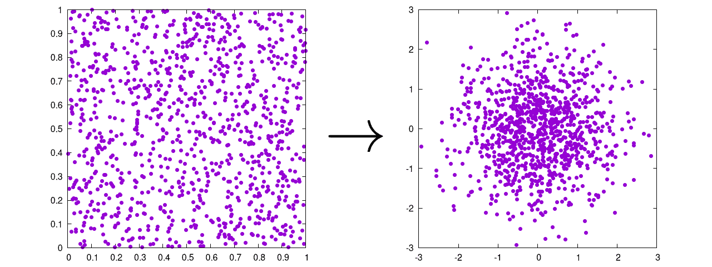
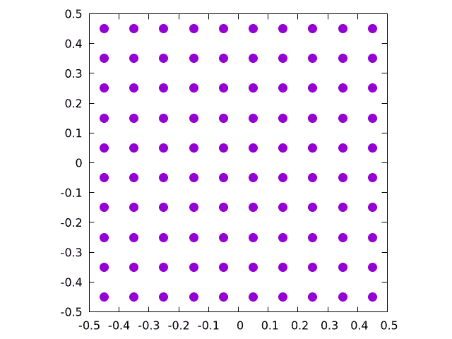
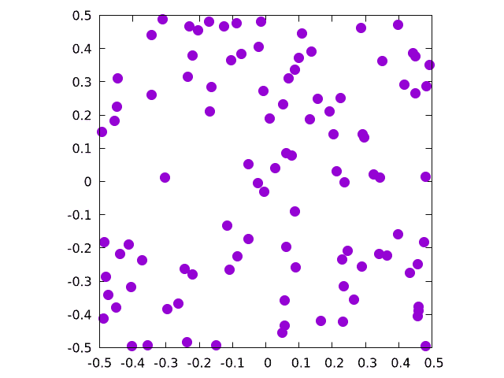
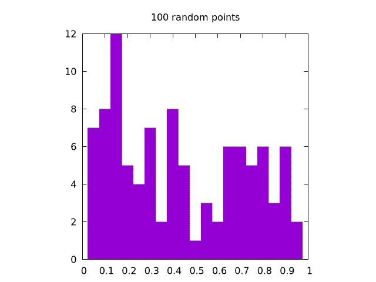
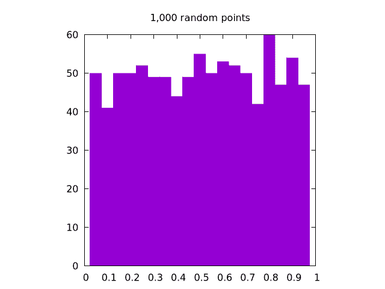
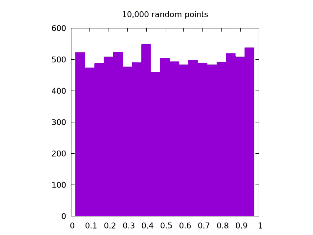
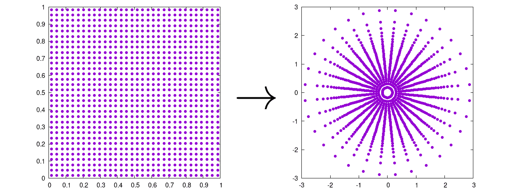
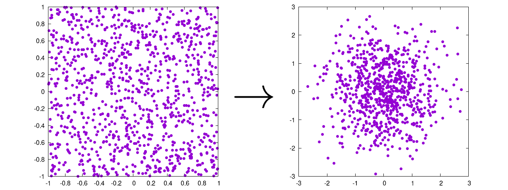
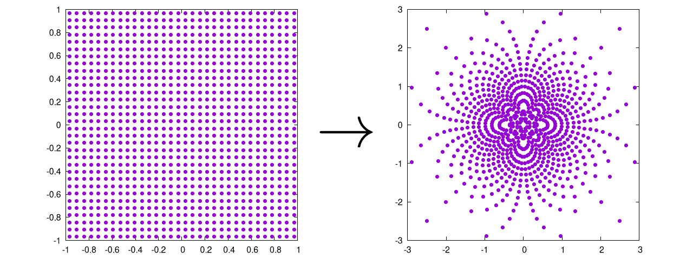

# Box-Muller 变换

> 原文：[`www.algorithm-archive.org/contents/box_muller/box_muller.html`](https://www.algorithm-archive.org/contents/box_muller/box_muller.html)

Box-Muller 变换在我心中占有特殊位置，因为它是我为自己的研究首次实现的方法。

这种变换的目的很简单。它将一个均匀（可能是随机的）分布转换为高斯分布。



就这样。

它最初由 George Box（是的，Box 是他的姓）和 Mervin Muller 在 1958 年开发，是创建随机高斯点分布的最常见方法之一 [[1]](#cite-1)。它在初始化物理 N 体模拟的粒子集时特别有用。本章将分为几个小节：

1.  如何初始化 Box-Muller 变换

1.  如何在笛卡尔坐标中使用 Box-Muller 变换 [[2]](#cite-2)。

1.  如何在极坐标中使用 Box-Muller 变换，也称为 Marsaglia 变换 [[3]](#cite-3)。

当然，底部会有完整的代码示例。所以，让我们开始吧！

## 如何初始化 Box-Muller 变换

这里要提到的主要事情是，Box-Muller 变换需要某种形式的均匀分布作为其输入。初始化点随机分布的一个明显方法是从一个网格开始，如下所示：

```
 function create_grid(n, endpoints)

    grid_extents = endpoints[2] - endpoints[1]

    # number of points along any given axis
    # For 2D, we take the sqrt(n) and then round up
    axis_num = ceil(Int, sqrt(n))

    # we are now rounding n up to the nearest square if it was not already one
    if sqrt(n) != axis_num
       n = axis_num²
    end 

    # Distance between each point
    dx = grid_extents / (axis_num)

    # Initializing the array, particles along the column, dimensions along rows
    a = zeros(n, 2)

    # This loops over the relevant dimensions
    for i = 1:axis_num
        for j = 1:axis_num
            a[(i - 1) * axis_num + j, :] .=
                [(i - 0.5) * dx + endpoints[1],
                 (j - 0.5) * dx + endpoints[1]]
        end
    end

    return a 
```

这将创建以下一系列点：



说实话，有几种方法可以生成这种完全相同的分布。在这里，我们只是沿着网格的一半反向移动，确定步长，然后在每个步骤放置一个粒子。请注意，这种方法固有的局限性在于它只适用于平方数。因此，我们决定将其四舍五入到最近的平方数，以形成一个漂亮的网格。这不是最干净的实施方式，但网格主要用于调试，所以这里稍微乱一点是可以接受的。

演示中的真正明星是均匀随机分布，它可以这样生成：

```
 function create_rand_dist(n, endpoints)
    grid_extents = endpoints[2] - endpoints[1]
    return(rand(n,2) * grid_extents .+ endpoints[1]) 
```

这将创建以下一系列点：



好吧，但我们如何知道这是均匀的？好问题！

最简单的方法是绘制大量点的直方图。如果随机分布是均匀的，那么所有桶的值应该大致相同。我们拥有的点越多，桶之间的百分比差异就越小。以下是由 `rand()` 生成的，用于生成单个维度上的 ， ， 和 的图像集：

|  |  |  |
| --- | --- | --- |
|  |  |  |

很明显，  的情况看起来最均匀。注意，对于二维情况，相同的逻辑适用，但我们需要为  和  坐标创建单独的直方图。

一旦这个测试完成，我们可以相当确信我们用来生成初始分布的函数是均匀的，并且可以进入下一个步骤：实际上使用 Box—Muller 变换！

## 如何在笛卡尔坐标系中使用 Box—Muller 变换

Box—Muller 变换的二维笛卡尔版本从两个随机输入值（ 和 ）开始，这两个值都来自它们自己的均匀分布，分布在  和  之间。然后它创建两个输出点（ 和 ）。为此，  用于在某个径向值  上创建高斯分布，而  用于围绕某个角分量  旋转，使得

看着这些方程，  看起来相当合理。毕竟，角度通常从  变化，我们的输入分布从  变化，因此我们可以通过将  乘以我们的输入值之一来得到  和  之间的某个值。

那么  呢？记住，如果我们想让  处于高斯形式，我们可能会说，  ，因此如果我们解这个方程得到  。

从这些值中，我们可以计算出新的  点，

最后，为了指定生成的高斯分布的大小和形状，我们可以使用标准差，  ，和均值，  ，如下所示：

通常，这可以写成代码如下：

```
# Box--Muller transform
function cartesian_box_muller(input_pts, sigma, mu)
    r = sqrt(-2 * log(input_pts[1]))
    theta = 2 * pi * input_pts[2]

    return [sigma * r * cos(theta) + mu[1],
            sigma * r * sin(theta) + mu[2]]

end 
```

这会产生以下输出

 

注意，我们编写的代码是针对单一组输入值工作的，但它也可以编写为一次性读取整个点的分布。由于这种特定技术通常以并行方式实现，所以取决于你决定哪种方式对你自己的特定用例来说是最快的。

在这个阶段，我们已经对变换的工作原理有了很好的了解，但有些人实际上会避开笛卡尔方法，而选择极坐标形式，这将在下一节讨论！

## 如何在极坐标系中使用 Box—Muller 变换

Box—Muller 变换的笛卡尔形式相对直观。极坐标方法本质上相同，但没有昂贵的  和  操作。在这种情况下，我们使用输入值来创建一个初始径向点（稍后进行缩放）：

这意味着我们实际上是在尝试将我们的  值集转换成一个新的输入值 。为此，我们需要从一个均匀分布的 *圆* 开始，因此我们必须拒绝任何  和  的值，其中  要么是  要么是 。这也意味着  和  的初始分布必须从  范围内。

从这里，我们可以使用基本的三角恒等式来重新定义  和  为

这将改变输出方程为

再次，最终值是：

在代码中，它可能看起来像这样：

```
# Box--Muller transform
function polar_box_muller(input_pts, sigma, mu)
    r_0 = input_pts[1]² + input_pts[2]²

    # this method is only valid for points within the unit circle
    if r_0 == 0 || r_0 > 1
        return [NaN, NaN]
    end

    return [sigma * input_pts[1] * sqrt(-2 * log(r_0) / r_0) + mu[1],
            sigma * input_pts[2] * sqrt(-2 * log(r_0) / r_0) + mu[2]] 
```

这将产生以下输出：

 

再次强调，这最终与笛卡尔方法相同，只是它：

1.  拒绝初始分布中位于单位圆外的点（也称为拒绝采样）

1.  避免昂贵和复杂的操作

第二点意味着极坐标方法*应该*比笛卡尔方法快得多，但拒绝采样本身也很有趣，我们已在单独的章节中讨论过。

## 示例代码

此处的示例代码非常直接：我们从一个均匀分布的点集（既在网格上也在均匀随机分布上）开始，然后执行 Box-Muller 变换，以查看它与我们期望的高斯分布有多大的偏差。

```
using DelimitedFiles, LinearAlgebra
using Test

function create_grid(n, endpoints)

    grid_extents = endpoints[2] - endpoints[1]

    # number of points along any given axis
    # For 2D, we take the sqrt(n) and then round up
    axis_num = ceil(Int, sqrt(n))

    # we are now rounding n up to the nearest square if it was not already one
    if sqrt(n) != axis_num
       n = axis_num²
    end 

    # Distance between each point
    dx = grid_extents / (axis_num)

    # Initializing the array, particles along the column, dimensions along rows
    a = zeros(n, 2)

    # This loops over the relevant dimensions
    for i = 1:axis_num
        for j = 1:axis_num
            a[(i - 1) * axis_num + j, :] .=
                [(i - 0.5) * dx + endpoints[1],
                 (j - 0.5) * dx + endpoints[1]]
        end
    end

    return a
end

function create_rand_dist(n, endpoints)
    grid_extents = endpoints[2] - endpoints[1]
    return(rand(n,2) * grid_extents .+ endpoints[1]) 
end

# This function reads in a pair of input points and performs the Cartesian
# Box--Muller transform
function cartesian_box_muller(input_pts, sigma, mu)
    r = sqrt(-2 * log(input_pts[1]))
    theta = 2 * pi * input_pts[2]

    return [sigma * r * cos(theta) + mu[1],
            sigma * r * sin(theta) + mu[2]]

end

# This function reads in a pair of input points and performs the Cartesian
# Box--Muller transform
function polar_box_muller(input_pts, sigma, mu)
    r_0 = input_pts[1]² + input_pts[2]²

    # this method is only valid for points within the unit circle
    if r_0 == 0 || r_0 > 1
        return [NaN, NaN]
    end

    return [sigma * input_pts[1] * sqrt(-2 * log(r_0) / r_0) + mu[1],
            sigma * input_pts[2] * sqrt(-2 * log(r_0) / r_0) + mu[2]]

end

function is_gaussian(input_pts; bounds = [-1 1; -1 1], dx = 0.1,
                     sigma = 1, mu = [0,0], threshold = 0.1)
    histogram = zeros(ceil(Int,(bounds[1,2]-bounds[1,1])/dx),
                      ceil(Int,(bounds[2,2]-bounds[2,1])/dx))

    for i = 1:size(input_pts)[1]
        input_x = input_pts[i, 1]
        input_y = input_pts[i, 2]
        if !(isnan(input_x) || isnan(input_y))

            bin = CartesianIndex(ceil(Int, (input_x - bounds[1,1]) / dx),
                                 ceil(Int, (input_y - bounds[2,1]) / dx))

            if bin[1] <= size(histogram)[1] && bin[1] > 0 &&
               bin[2] <= size(histogram)[2] && bin[2] > 0
                histogram[bin] += 1
            end
        end
    end

    n = sum(histogram)
    normalize!(histogram)

    rms = 0
    for i = 1:size(histogram)[1]
        x = bounds[1,1] + i*dx
        for j = 1:size(histogram)[2]
            y = bounds[2,1] + j*dx
            gaussian_value = exp(-(((x+mu[1])²)/(2*sigma²) +
                                   ((y+mu[2])²)/(2*sigma²)))
            rms += (gaussian_value - histogram[i,j])²
        end
    end

    return sqrt(rms/n) < threshold
end

function main(n)

    # This casts the input onto the nearest square for the cartesian grids
    n = Int(ceil(sqrt(n))²)

    cartesian_grid = create_grid(n, [0,1])
    polar_grid = create_grid(n, [-1,1])
    cartesian_rand = create_rand_dist(n, [0,1])
    polar_rand = create_rand_dist(n, [-1,1])

    cartesian_grid_output = similar(cartesian_grid)
    polar_grid_output = similar(polar_grid)
    cartesian_rand_output = similar(cartesian_rand)
    polar_rand_output = similar(polar_rand)

    # going through each pair of points and using the x,y coordinates in
    # their respective functions
    for i = 1:size(cartesian_grid)[1]
        cartesian_grid_output[i,:] .= 
            cartesian_box_muller(cartesian_grid[i,:], 1, [0,0])

        polar_grid_output[i,:] .= polar_box_muller(polar_grid[i,:], 1, [0,0])

        cartesian_rand_output[i,:] .=
            cartesian_box_muller(cartesian_rand[i,:], 1, [0,0])

        polar_rand_output[i,:] .= polar_box_muller(polar_rand[i,:], 1, [0,0])
    end

    @testset "histogram tests of Box--Muller Gaussianness" begin
        @test is_gaussian(cartesian_grid_output;
                          bounds = [-3 3; -3 3], dx = 0.3,
                          sigma = 1, mu = [0,0])
        @test is_gaussian(cartesian_rand_output;
                          bounds = [-3 3; -3 3], dx = 0.3,
                          sigma = 1, mu = [0,0])
        @test is_gaussian(polar_grid_output;
                          bounds = [-3 3; -3 3], dx = 0.3,
                          sigma = 1, mu = [0,0])
        @test is_gaussian(polar_rand_output;
                          bounds = [-3 3; -3 3], dx = 0.3,
                          sigma = 1, mu = [0,0])
    end

    writedlm("cartesian_grid_output.dat", cartesian_grid_output)
    writedlm("polar_grid_output.dat", polar_grid_output)
    writedlm("cartesian_rand_output.dat", cartesian_rand_output)
    writedlm("polar_rand_output.dat", polar_rand_output)

    writedlm("cartesian_grid.dat", cartesian_grid)
    writedlm("polar_grid.dat", polar_grid)
    writedlm("cartesian_rand.dat", cartesian_rand)
    writedlm("polar_rand.dat", polar_rand)
end 
```

### 参考文献列表

1. Box, George EP, A note on the generation of random normal deviates, 1958.2.[Wikipedia: Box-Muller Transform](https://en.wikipedia.org/wiki/Box%E2%80%93Muller_transform), 2022.3.[Wikipedia: Marsaglia Transform](https://en.wikipedia.org/wiki/Marsaglia_polar_method), 2022.

## 许可协议

##### 代码示例

代码示例受 MIT 许可协议保护（可在[LICENSE.md](https://github.com/algorithm-archivists/algorithm-archive/blob/main/LICENSE.md)中找到）。

##### 文本

本章的文本由[James Schloss](https://github.com/leios)编写，并授权于[Creative Commons Attribution-ShareAlike 4.0 国际许可协议](https://creativecommons.org/licenses/by-sa/4.0/legalcode)。

[](https://creativecommons.org/licenses/by-sa/4.0/)


#### 图片/图形

+   图片"IFS 三角形 1"由[James Schloss](https://github.com/leios)创建，并授权于[Creative Commons Attribution-ShareAlike 4.0 国际许可协议](https://creativecommons.org/licenses/by-sa/4.0/legalcode)。

+   图片"IFS 正方形 3"由[James Schloss](https://github.com/leios)创建，并授权于[Creative Commons Attribution-ShareAlike 4.0 国际许可协议](https://creativecommons.org/licenses/by-sa/4.0/legalcode)。

+   图片"简单的 Barnsley 蕨叶"由[James Schloss](https://github.com/leios)创建，并授权于[Creative Commons Attribution-ShareAlike 4.0 国际许可协议](https://creativecommons.org/licenses/by-sa/4.0/legalcode)。

+   视频文件"仿射随机变换 0"由[James Schloss](https://github.com/leios)创建，并授权于[Creative Commons Attribution-ShareAlike 4.0 国际许可协议](https://creativecommons.org/licenses/by-sa/4.0/legalcode)。

+   视频文件"仿射随机变换 1"由[James Schloss](https://github.com/leios)制作，并授权于[Creative Commons Attribution-ShareAlike 4.0 国际许可协议](https://creativecommons.org/licenses/by-sa/4.0/legalcode)。

+   视频文件"仿射随机变换 2"由[James Schloss](https://github.com/leios)制作，并授权于[Creative Commons Attribution-ShareAlike 4.0 国际许可协议](https://creativecommons.org/licenses/by-sa/4.0/legalcode)。

+   视频文件"仿射随机变换 3"由[James Schloss](https://github.com/leios)制作，并授权于[Creative Commons Attribution-ShareAlike 4.0 国际许可协议](https://creativecommons.org/licenses/by-sa/4.0/legalcode)。

+   视频文件"仿射蕨变换 0"由[James Schloss](https://github.com/leios)制作，并授权于[Creative Commons Attribution-ShareAlike 4.0 国际许可协议](https://creativecommons.org/licenses/by-sa/4.0/legalcode)。

+   视频文件"仿射蕨变换 1"由[James Schloss](https://github.com/leios)制作，并授权于[Creative Commons Attribution-ShareAlike 4.0 国际许可协议](https://creativecommons.org/licenses/by-sa/4.0/legalcode)。

+   视频文件"仿射蕨变换 2"由[James Schloss](https://github.com/leios)制作，并授权于[Creative Commons Attribution-ShareAlike 4.0 国际许可协议](https://creativecommons.org/licenses/by-sa/4.0/legalcode)。

+   视频文件"仿射蕨变换 3"由[James Schloss](https://github.com/leios)制作，并授权于[Creative Commons Attribution-ShareAlike 4.0 国际许可协议](https://creativecommons.org/licenses/by-sa/4.0/legalcode)。

+   视频文件"蕨摆动 0"由[James Schloss](https://github.com/leios)制作，并授权于[Creative Commons Attribution-ShareAlike 4.0 国际许可协议](https://creativecommons.org/licenses/by-sa/4.0/legalcode)。

+   视频文件"蕨摆动 1"由[James Schloss](https://github.com/leios)制作，并授权于[Creative Commons Attribution-ShareAlike 4.0 国际许可协议](https://creativecommons.org/licenses/by-sa/4.0/legalcode)。

+   视频文件"蕨摆动 2"由[James Schloss](https://github.com/leios)制作，并授权于[Creative Commons Attribution-ShareAlike 4.0 国际许可协议](https://creativecommons.org/licenses/by-sa/4.0/legalcode)。

+   视频文件"蕨摆动 3"由[James Schloss](https://github.com/leios)制作，并授权于[Creative Commons Attribution-ShareAlike 4.0 国际许可协议](https://creativecommons.org/licenses/by-sa/4.0/legalcode)。
