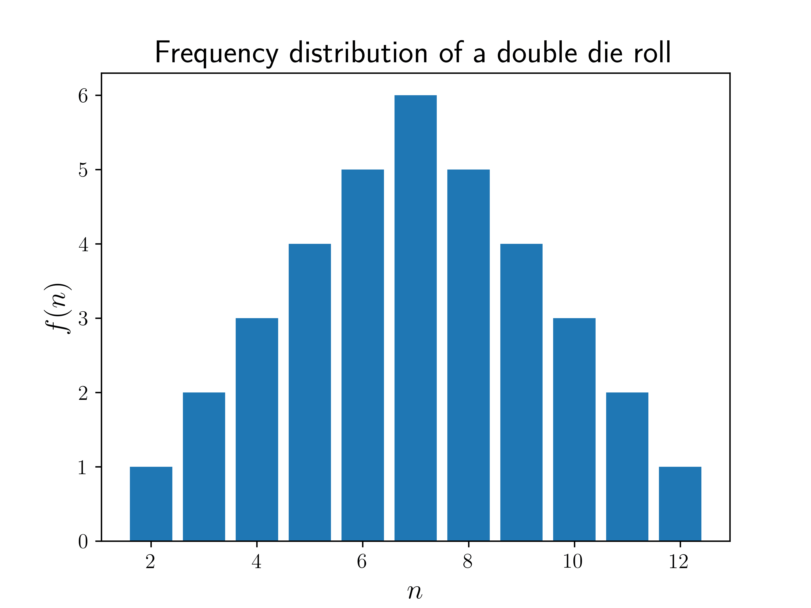
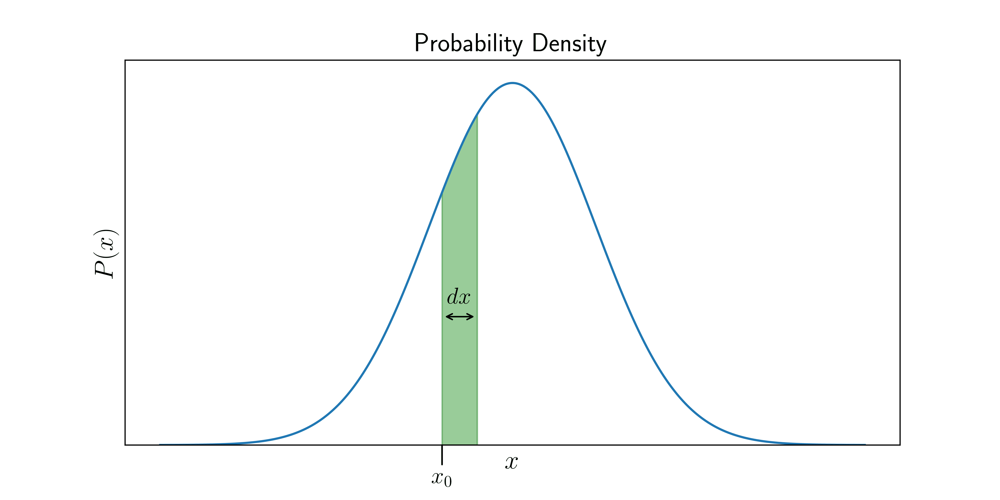

# 什么是概率分布？

> 原文：[`www.algorithm-archive.org/contents/probability_distributions/distributions.html`](https://www.algorithm-archive.org/contents/probability_distributions/distributions.html)

概率分布是数学函数，它给出了范围或一组结果的概率。这些结果可以是实验或程序的结果，例如抛硬币或掷骰子。它们也可以是物理测量的结果，例如测量物体的温度，计算自旋向上的电子数量等。广义上，我们可以将概率分布分为两类 - **离散概率分布**和**连续概率分布**。

## 离散概率分布

对于我们来说，理解什么是**离散**概率分布是很直观的。例如，我们非常了解抛硬币的结果，以及掷骰子的结果。对于单次抛硬币，我们知道得到正面  的概率是二分之一，或者说 。同样，得到反面  的概率也是 。正式来说，我们可以将此类抛硬币的概率分布写成，

在这里，  表示结果，我们使用了“集合表示法”， ，意味着“  属于包含  和  的集合”。从上述方程中，我们也可以假设  的任何其他结果（例如落在边缘上）都是极其不可能的，或者是不可能的，或者简单地“不允许”（例如，如果它真的落在边缘上，就再抛一次！）。

对于概率分布，注意可能性的集合，或者分布的**定义域**是很重要的。在这里，  是  的定义域，告诉我们  只能是  或 。

如果我们使用不同的系统，结果  可能意味着其他事情。例如，它可能是一个像掷骰子结果那样的数字，其概率分布为，

这意味着在  和  之间取整数的概率是 ，并且我们假设得到任何其他  的概率是 。这是一个离散概率函数，因为  是一个整数，因此只取离散值。

上述两个例子都相当无聊，因为对于所有  的值，  的值都是相同的。一个概率函数的例子，其中概率实际上依赖于  的，是当  是两个骰子点数之和时。在这种情况下，对于每个  的值，  是不同的，因为某些可能性（例如  ）只能以一种可能的方式发生（两个骰子都是 ），而  可以以  种方式发生（  和 ；或者  和 ；或者  和 ）。

掷两个骰子的例子是研究我们如何构建概率分布的一个很好的案例研究，因为概率是变化的，并且它如何变化并不立即明显。所以，让我们继续构建它！

让我们首先定义我们的目标  的定义域。我们知道两个骰子最低的和是  （两个骰子都是 ），所以  是确定的。同样，最大值是两个六的和，即 ，所以  也是。

因此，现在我们知道了可能性的范围，即， 。接下来，我们采取一个非常常见的方法——对于每个结果 ，我们计算它可能出现的不同方式的数量。让我们称这个数字为 的**频率**， 。我们已经提到，只有一种方式可以得到 ，即通过得到一对 。根据函数的定义，这意味着 。对于 ，我们看到有两种可能的方式得到这个结果：第一个骰子显示一个 ，第二个骰子显示一个 ，或者第一个骰子显示一个 ，第二个骰子显示一个 。因此， 。如果你继续对所有 进行这样的操作，你可能会看到一种模式（留给读者作为作业！）。一旦你有了所有的 ，我们就可以通过绘制  与  的图来可视化它，如下所示。

从图中我们可以看出，两个骰子之和最常见的值是 ，而且离  越远，结果就越不可能。这对于潜在的赌徒来说是个好消息！

### 归一化

上图中绘制的  技术上不是概率  ——因为我们知道所有概率的总和应该是 ，这显然不是 的情况。但我们可以通过将其除以可能性的总数来得到概率， 。对于两个骰子，这是 ，但我们也可以将其表达为所有频率的总和，

在这种情况下，这也等于 。因此，通过将除以 ，我们得到我们的目标概率分布， 。这个过程被称为**归一化**，对于确定几乎任何概率分布都是至关重要的。所以一般来说，如果我们有函数 ，我们可以得到概率，如下所示：

注意， 不一定是 的频率——它可以是任何与 成正比的函数，并且上述对 的定义仍然成立。很容易检查，现在总和等于 ，因为

一旦我们有了概率函数 ，我们就可以计算各种概率。例如，假设我们想找到  在两个整数  和  之间（包括  和 ）的概率。为了简洁起见，我们将使用符号  来表示这个概率。为了计算它，我们只需要将那个范围内每个  值的概率相加，即，

## 概率密度函数

如果我们不是有一个离散变量 ，而是一个连续变量 ，比如温度或重量呢？在这种情况下，询问某个特定的数值的概率是没有意义的——毕竟，有无限多的实数，所以某个特定数值的概率几乎为零！但是，询问某个数值在某个范围内的概率是有意义的。例如，有人可能会说，明天中午的温度在 和 之间的概率是 ，或者它将在 和 之间的概率是 。但是，我们如何将所有这些信息，对于每个可能的范围，放入一个单一函数中呢？答案是使用**概率密度函数**。

这意味着什么？好吧，假设 \( X \) 是一个连续量，并且我们有一个概率密度函数 \( f \)，它看起来像

现在，如果我们对介于 \( a \) 和 \( b \) 之间的值域的概率感兴趣，我们只需计算绿色条块的面积。这是概率密度函数的一个定义特征：

**一个值域的概率是该值域下概率密度曲线下的面积**。

所以如果 \( \Delta x \) 无限小，那么绿色条块的面积变为 \( f(a) \Delta x \)，因此，

所以严格来说，\( f \) 本身不是概率，而是概率是量 \( \int_A f(x) \, dx \)，或者曲线下的任何面积。这就是为什么我们称 \( f \) 为在 \( x \) 处的概率密度，而实际的概率只定义在值域的范围内。

因此，要获得某个范围的概率，我们只需在该范围内对函数进行积分，即，

这与从上一节中找到离散值范围的概率类似：

所有概率之和必须等于 1 转换为

其中 \( \Omega \) 表示 \( f \) 的 **定义域**，即 \( f \) 定义的所有可能值的整个范围。

### 密度函数的归一化

就像在离散情况中一样，我们通常首先计算一些密度或频率函数 \( f \)，它不是概率，但与概率成正比。我们可以通过类似的方式进行归一化来得到概率密度函数，只是我们进行积分而不是求和：

例如，考虑以下 **高斯函数**（在 **正态分布**中广泛使用），

该函数对所有实数都有定义。我们首先对其进行积分（或者快速进行谷歌搜索，因为它相当复杂），得到

现在我们有一个高斯概率分布，

通常，归一化可以让我们从几乎任何函数中创建一个概率分布。要成为概率密度分布的候选者，必须满足以下两条规则：

1.  对 \( \mathbb{R} \) 的任何子集（用 \( A \) 表示）的积分必须是非负的（它可以为零）：

1.  以下积分必须是有限的：

## 许可证

##### 图像/图形

+   图片 "双骰子频率分布" 由 [K. Shudipto Amin](https://github.com/shudipto-amin) 创建，并授权于 [Creative Commons Attribution-ShareAlike 4.0 国际许可](https://creativecommons.org/licenses/by-sa/4.0/legalcode)。

+   图片 "概率密度" 由 [K. Shudipto Amin](https://github.com/shudipto-amin) 创建，并授权于 [Creative Commons Attribution-ShareAlike 4.0 国际许可](https://creativecommons.org/licenses/by-sa/4.0/legalcode)。

##### 文本

本章的文本由[K. Shudipto Amin](https://github.com/shudipto-amin)编写，并许可在[Creative Commons Attribution-ShareAlike 4.0 国际许可协议](https://creativecommons.org/licenses/by-sa/4.0/legalcode)下。

##### 拉取请求

在初始许可([#560](https://github.com/algorithm-archivists/algorithm-archive/pull/560))之后，以下拉取请求已修改了本章的文本或图形：

+   无
