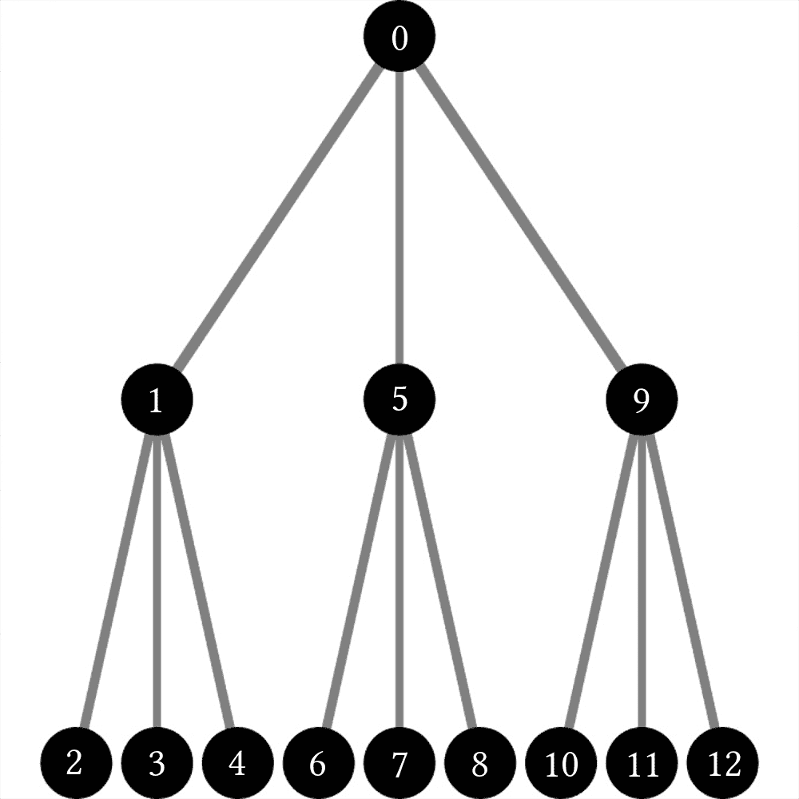
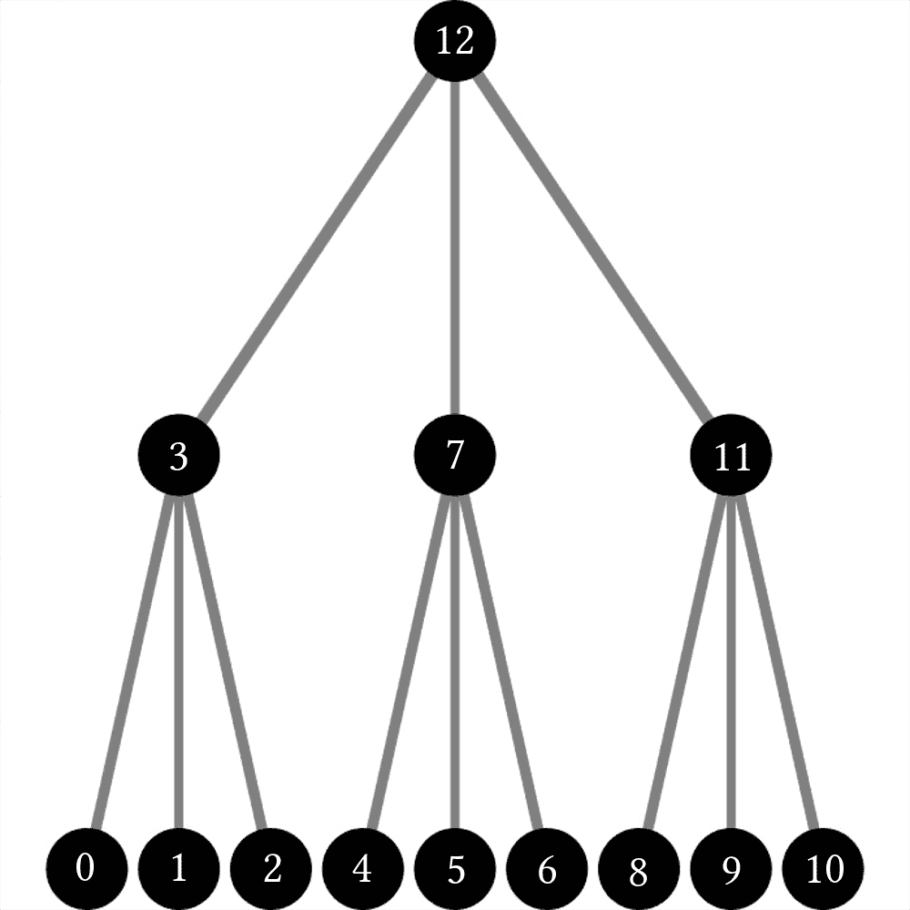
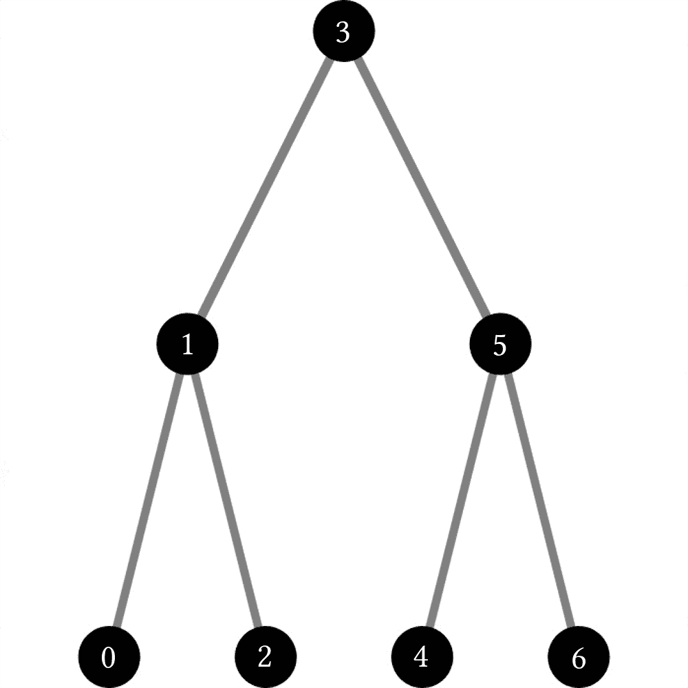
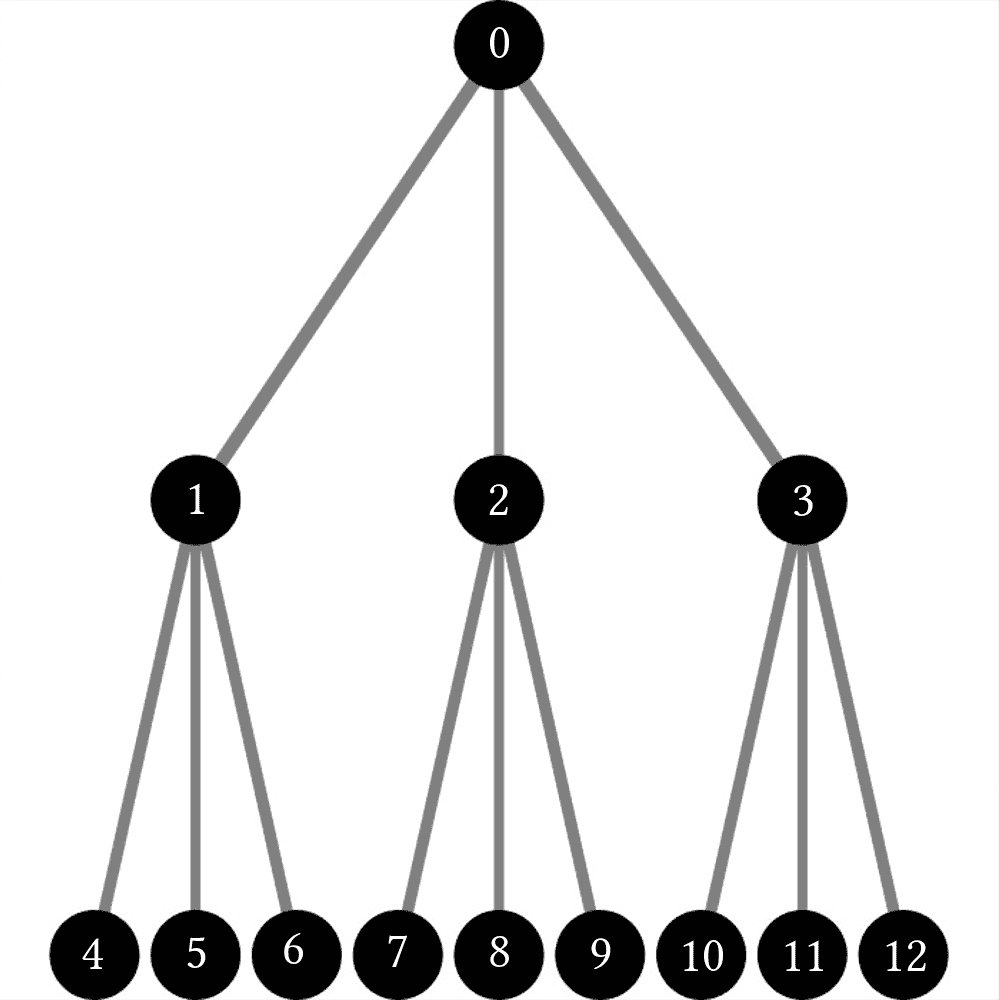

# 树遍历

> [原文链接](https://www.algorithm-archive.org/contents/tree_traversal/tree_traversal.html)

树是自然递归数据结构，正因为如此，我们无法像访问向量或数组元素那样访问它们的元素。相反，我们需要使用更有趣的方法来处理每个元素。这通常被称为*树遍历*，并且有多种不同的方法可以实现。目前，我们将讨论两种常见的树遍历方法：*深度优先*和*广度优先搜索*。请注意，树的外观和大小因使用方式而异；然而，它们主要由包含其他子节点的节点组成，如下所示：

```
struct Node
    children::Vector{Node}
    ID::Int64
    Node(ID::Int64) = new(Vector{Node}(), ID)
end 
```

```
struct node {
  std::vector<node> children;
  size_t value;
}; 
```

```
public class Tree
{
    public int Id { get; private set; }
    private List<Tree> _children = new List<Tree>(); 
```

```
struct node {
    struct node *children;
    size_t children_size;
    int id;
}; 
```

```
private class Node implements Comparable<Node> {
    public ArrayList<Node> children;
    public int id;

    public Node(int id) {
        this.children = new ArrayList<Node>();
        this.id = id;
    }

    @Override
    public int compareTo(Node other) {
        // Need to implement Comparable<Node> and override this
        // method because of the method BFSQueue() which uses Queues
        // and must know how to check if two nodes are the same or not
        return Integer.compare(this.id, other.id);
    }
} 
```

```
function createTree(rows, children) {
  if (rows === 0) {
    return { id: rows, children: [] };
  }

  return {
    id: rows,
    children: [...Array(children).keys()].map(() => createTree(rows - 1, children))
  };
} 
```

作为备注，在 JavaScript 中不需要`node`结构体，所以这是一个树可能构建的例子。

```
class Node:
    def __init__(self):
        self.data = None
        self.children = [] 
```


```
struct Node {
    children: Vec<Node>,
    value: u64,
} 
```

```
data Tree a = Node
  { node :: a,
    forest :: [Tree a]
  } 
```

```
class Node {
    var value: Int
    var children: [Node]?

    init(value: Int, children: [Node]) {
        self.value = value
        self.children = children
    }
} 
```

```
class Tree implements JsonSerializable
{
    private $id;
    private $children = [];

    public function __construct(int $id, array $children = [])
    {
        $this->id = $id;
        $this->children = $children;
    }

    public function getId(): int
    {
        return $this->id;
    }

    public function getChildren(): array
    {
        return $this->children;
    }

    public function addChild(Tree $child): void
    {
        $this->children[] = $child;
    }

    public function jsonSerialize(): array
    {
        return [
            'id' => $this->id,
            'children' => $this->children,
        ];
    }
} 
```

```
class Node 
  property id, children 
  def initialize(@id : Int32, @children : Array(Node))
  end 
end 
```

```
Object subclass: #Node
    instanceVariableNames: 'children data'
    classVariableNames: ''
    package: ''

Node>>children
    "Children getter."
    ^ children

Node>>children: newChildren
    "Children setter."
    children := newChildren.

Node>>data
    "Data getter"
    ^ data

Node>>data: newData
    "Data setter"
    data := newData. 
```

```
type node struct {
    id       int
    children []*node
} 
```

```
.equ tree_children,     0
.equ tree_num_children, 8
.equ tree_value,        12
.equ tree_size,         16 
```

```
🦃 ⏹ 🍇
  🔘 ⏫ 
```

```
(defstruct node data children) 
```

```
node = @(k,v) containers.Map(k,v); 
```

```
data Node(value: int, children: Node[]) 
```

由于这个原因，遍历树最直接的方式可能是递归。这自然引导我们到深度优先搜索（DFS）方法：

```
function DFS_recursive(n::Node)
    # Here we are doing something...
    print(n.ID, " ")

    for child in n.children
        DFS_recursive(child)
    end
end 
```

```
// Simple recursive scheme for DFS
void dfs_recursive(node const& n) {
  // Here we are doing something...
  std::cout << n.value << ' ';
  for (auto const& child : n.children) {
    dfs_recursive(child);
  }
} 
```

```
private void DFSRecursive(Tree tree) {
    Console.Write(tree.Id + " ");

    foreach (var c in tree._children)
        DFSRecursive(c);
}

public void DFSRecursive()
{
    DFSRecursive(this);

} 
```

```
void dfs_recursive(struct node n) {
    printf("%d ", n.id);

    if (n.children) {
        for (size_t i = 0; i < n.children_size; ++i) {
            dfs_recursive(n.children[i]);
        }
    }
} 
```

```
private void dfsRecursive(Node node) {
    System.out.print(node.id + " ");

    for (Node n : node.children) {
        dfsRecursive(n);
    }
} 
```

```
function dfsPreorder(tree) {
  if (!tree) {
    return;
  }

  process.stdout.write(tree.id + " ");
  tree.children.forEach(dfsPreorder);
} 
```

```
def dfs_recursive(node):
    if node.data != None:
        print(node.data, end=' ')

    for child in node.children:
        dfs_recursive(child) 
```


```
fn dfs_recursive(n: &Node) {
    print!("{} ", n.value);

    for child in &n.children {
        dfs_recursive(child);
    }
} 
```

```
dfs :: Tree a -> [a]
dfs (Node x ts) = x : concatMap dfs ts 
```

```
func dfsRecursive(node: Node) {
    print(node.value, terminator:" ")

    for child in node.children! {
        dfsRecursive(node: child)
    }
} 
```

```
public static function DFSRecursive(Tree $tree): void
{
    echo $tree->getId() . ' ';
    foreach ($tree->getChildren() as $child) {
        static::DFSRecursive($child);
    }
} 
```

```
def dfs_recursive(node) 
  print "#{node.id} "
  node.children.each{ |child| dfs_recursive child } 
end 
```

```
Node>>dfsRecursive
    "Recursive depth first search."
    Transcript show: data; cr.
    children collect: [ :child | child dfsRecursive ]

Node>>dfsRecursivePostOrder 
```

```
func dfsRecursive(n *node) {
    fmt.Printf("%d ", n.id)
    for _, child := range n.children {
        dfsRecursive(child)
    }
} 
```

```
# rdi - children ptr
# rsi - value|children_size
dfs_recursive:
  push   r12
  push   r13
  mov    r12, rdi
  mov    r13, rsi
  mov    rdi, OFFSET fmt_tree      # Handle the current node
  shr    rsi, 32                   # The tree value is in the upper 32 bits
  xor    rax, rax
  call   printf
  mov    r13d, r13d                # Zero out the top 32 bits
  add    r13, r12                  # Pointer pointing after the last element of the children array
dfs_recursive_children:
  cmp    r12, r13                  # If we reached the end, return
  je     dfs_recursive_return
  mov    rdi, QWORD PTR [r12]
  mov    rsi, QWORD PTR [r12 + 8]
  call   dfs_recursive
  add    r12, tree_size
  jmp    dfs_recursive_children
dfs_recursive_return:
  pop    r13
  pop    r12
  ret 
```

```
 🌌🐕 depth_count children_count❗️
🍉

❗️ 🆔 ➡️ 🔢 🍇
  ↩️ id
🍉

❗️ 🧒 ➡️ 🍨🐚🌲🍆 🍇 
```

```
(defun dfs-recursive (node)
  "A depth first approach for printing out all values in a tree."
  (when (node-data node)
    (format t "~a " (node-data node)))
  (loop for child in (node-children node) do
    (dfs-recursive child))) 
```

```
function DFS_recursive(n)

    cell_index = @(a, b) a{b};
    ID = cell_index(keys(n), 1);

    fprintf('%u ', ID);

    children = cell_index(values(n), 1);
    for i = children
        child = i{1};
        if ~isempty(child)
            DFS_recursive(child);
        end
    end
end 
```

```
def dfs_recursive(Node(value, children)):
    """A depth first approach for printing out all values in a tree."""
    print(value, end=' ')
    for child in children:
        dfs_recursive(child) 
```

至少对我来说，这很有道理。我们用递归对抗递归！首先，我们首先输出我们所在的节点，然后对每个子节点调用`DFS_recursive(...)`。这种树遍历方法正如其名所暗示的那样：它首先深入树的深度，然后再通过其他分支。在这种情况下，顺序看起来像这样：



注意，在上面的代码中，我们遗漏了一个关键步骤：*检查我们使用的节点是否实际存在!*因为我们使用向量存储所有节点，我们将小心避免在尚未初始化的节点上调用`DFS_recursive(...)`；然而，根据我们使用的语言，我们可能需要小心这一点，以避免递归错误！

现在，在这种情况下，首先搜索的元素仍然是树的根。这种类型的树遍历被称为*前序*DFS。我们在搜索子节点之前执行一个操作（输出 ID）。如果我们调整函数并将数据输出放在函数的末尾，我们可以修改搜索树的顺序，使其成为*后序*，看起来像这样：

```
function DFS_recursive_postorder(n::Node)

    for child in n.children
        DFS_recursive_postorder(child)
    end

    # Here we are doing something...
    print(n.ID, " ")
end 
```

```
void dfs_recursive_postorder(node const& n) {
  for (auto const& child : n.children) {
    dfs_recursive_postorder(child);
  }
  std::cout << n.value << ' ';
} 
```

```
private void DFSRecursivePostorder(Tree tree)
{
    foreach (var c in tree._children)
        DFSRecursivePostorder(c);

    Console.Write(tree.Id + " ");
}

public void DFSRecursivePostorder()
{
    DFSRecursivePostorder(this); 
```

```
void dfs_recursive_postorder(struct node n) {
    for (size_t i = 0; i < n.children_size; ++i) {
        dfs_recursive_postorder(n.children[i]);
    }

    printf("%d ", n.id);
} 
```

```
private void dfsRecursivePostOrder(Node node) {
    for (Node n : node.children) {
        dfsRecursivePostOrder(n);
    }

    // Here we are doing something ...
    System.out.print(node.id + " ");
} 
```

```
function dfsPostorder(tree) {
  if (!tree) {
    return;
  }

  tree.children.forEach(dfsPostorder);
  process.stdout.write(tree.id + " ");
} 
```

```
def dfs_recursive_postorder(node):
    for child in node.children:
        dfs_recursive_postorder(child)

    if node.data != None:
        print(node.data, end=' ') 
```


```
fn dfs_recursive_postorder(n: &Node) {
    for child in &n.children {
        dfs_recursive_postorder(child);
    }

    print!("{} ", n.value);
} 
```

```
dfsPostOrder :: Tree a -> [a]
dfsPostOrder (Node x ts) = concatMap dfsPostOrder ts ++ [x] 
```

```
func dfsRecursivePostOrder(node: Node) {
    for child in node.children! {
        dfsRecursivePostOrder(node: child)
    }

    print(node.value, terminator:" ")
} 
```

```
public static function DFSRecursivePostorder(Tree $tree): void
{
    foreach ($tree->getChildren() as $child) {
        static::DFSRecursivePostorder($child);
    }
    echo $tree->getId() . ' ';
} 
```

```
def dfs_recursive_postorder(node) 
  node.children.each{ |child| dfs_recursive_postorder child }
  print "#{node.id} "
end 
```

```
 children collect: [ :child | (child dfsRecursivePostOrder)].
    Transcript show: data; cr.

Node>>dfsInOrderBinaryTree
    "Recursive depth first search on a binary tree in order."
    children size > 2 ifTrue: [ 
```

```
func dfsRecursivePostorder(n *node) {
    for _, child := range n.children {
        dfsRecursivePostorder(child)
    }
    fmt.Printf("%d ", n.id)
} 
```

```
# rdi - children ptr
# rsi - value|children_size
dfs_recursive_postorder:
  push   r12
  push   r13
  push   r14
  mov    r12, rdi
  mov    r13, rsi
  mov    r14, rsi
  mov    r13d, r13d                # Zero out the top 32 bits
  add    r13, r12                  # Pointer pointing after the last element of the children array
dfs_recursive_po_children:
  cmp    r12, r13                  # If we reached the end, return
  je     dfs_recursive_po_return
  mov    rdi, QWORD PTR [r12]
  mov    rsi, QWORD PTR [r12 + 8]
  call   dfs_recursive_postorder
  add    r12, tree_size
  jmp    dfs_recursive_po_children
dfs_recursive_po_return:
  mov    rdi, OFFSET fmt_tree      # Handle the current node
  mov    rsi, r14
  shr    rsi, 32                   # The tree value is in the upper 32 bits
  xor    rax, rax
  call   printf
  pop    r14
  pop    r13
  pop    r12
  ret 
```

```
🍉

📗 Depth-First Search Recursive pre-order 📗
❗️ 🌀 🍇
  😀 🔡 id 10❗️❗️

  🔂 child children 🍇
    🌀 child❗️ 
```

```
(defun dfs-recursive-postorder (node)
  "A depth first approach for printing out all values in a tree starting from the bottom."
  (loop for child in (node-children node) do
    (dfs-recursive-postorder child))
  (when (node-data node)
    (format t "~a "  (node-data node)))) 
```

```
function DFS_recursive_postorder(n)

    cell_index = @(a, b) a{b};

    children = cell_index(values(n), 1);
    for i = children
        child = i{1};
        if ~isempty(child)
            DFS_recursive_postorder(child);
        end
    end

    ID = cell_index(keys(n), 1);
    fprintf('%u ', ID);

end 
```

```
def dfs_recursive_postorder(Node(value, children)):
    """A depth first approach for printing out all values in a tree starting from the bottom."""
    for child in children:
        dfs_recursive_postorder(child)
    print(value, end=' ') 
```



在这种情况下，第一个访问的节点位于树的底部，并逐分支向上移动。除了这两种类型之外，二叉树还有一个*中序*遍历方案，看起来像这样：

```
# This assumes only 2 children, but accounts for other possibilities
function DFS_recursive_inorder_btree(n::Node)

    if (length(n.children) == 2)
        DFS_recursive_inorder_btree(n.children[1])
        print(n.ID, " ")
        DFS_recursive_inorder_btree(n.children[2])
    elseif (length(n.children) == 1)
        DFS_recursive_inorder_btree(n.children[1])
        print(n.ID, " ")
    elseif (length(n.children) == 0)
        print(n.ID, " ")
    else
        println("Not a binary tree!")
    end
end 
```

```
void dfs_recursive_inorder_btree(node const& n) {
  switch (n.children.size()) {
    case 2:
      dfs_recursive_inorder_btree(n.children[0]);
      std::cout << n.value << ' ';
      dfs_recursive_inorder_btree(n.children[1]);
      break;
    case 1:
      dfs_recursive_inorder_btree(n.children[0]);
      std::cout << n.value << ' ';
      break;
    case 0:
      std::cout << n.value << ' ';
      break;
    default:
      std::cout << "This is not a binary tree.\n";
      break;
  }
} 
```

```
 private void DFSRecursiveInorderBinary(Tree tree)
{
    switch (tree._children.Count)
    {
        case 2:
            DFSRecursiveInorderBinary(tree._children[0]);
            Console.Write(tree.Id + " ");
            DFSRecursiveInorderBinary(tree._children[1]);
            break;
        case 1:
            DFSRecursiveInorderBinary(tree._children[0]);
            Console.Write(tree.Id + " ");
            break;
        case 0:
            Console.Write(tree.Id + " ");
            break;
        default:
            throw new Exception("Not binary tree!");
    }
}

public void DFSRecursiveInorderBinary()
{
    DFSRecursiveInorderBinary(this); 
```

```
void dfs_recursive_inorder_btree(struct node n) {
    switch (n.children_size) {
    case 2:
        dfs_recursive_inorder_btree(n.children[0]);
        printf("%d ", n.id);
        dfs_recursive_inorder_btree(n.children[1]);
        break;
    case 1:
        dfs_recursive_inorder_btree(n.children[0]);
        printf("%d ", n.id);
        break;
    case 0:
        printf("%d ", n.id);
        break;
    default:
        printf("This is not a binary tree.\n");
        break;
    }
} 
```

```
private void dfsRecursiveInOrderBinary(Node node) {
    switch (node.children.size()) {
        case 2:
            dfsRecursiveInOrderBinary(node.children.get(0));
            System.out.print(node.id + " ");
            dfsRecursiveInOrderBinary(node.children.get(1));
            break;
        case 1:
            dfsRecursiveInOrderBinary(node.children.get(0));
            System.out.print(node.id + " ");
            break;
        case 0:
            System.out.print(node.id + " ");
            break;
        default:
            System.err.println("Not a binary tree at dfsRecursiveInOrderBinary()!");
    }
} 
```

```
function dfsInorder(tree) {
  if (!tree) {
    return;
  }

  switch (tree.children.length) {
    case 2:
      dfsInorder(tree.children[0]);
      console.log(tree.id);
      dfsInorder(tree.children[1]);
      break;
    case 1:
      dfsInorder(tree.children[0]);
      console.log(tree.id);
      break;
    case 0:
      console.log(tree.id);
      break;
    default:
      throw new Error("Postorder traversal is only valid for binary trees");
  }
} 
```

```
def dfs_recursive_inorder_btree(node):
    if len(node.children) == 2:
        dfs_recursive_inorder_btree(node.children[0])
        print(node.data, end=' ')
        dfs_recursive_inorder_btree(node.children[1])
    elif len(node.children) == 1:
        dfs_recursive_inorder_btree(node.children[0])
        print(node.data, end=' ')
    elif len(node.children) == 0:
        print(node.data, end=' ')
    else:
        print("Not a binary tree!") 
```


```
fn dfs_recursive_inorder_btree(n: &Node) {
    match &n.children[..] {
        [left, right] => {
            dfs_recursive_inorder_btree(left);
            print!("{} ", n.value);
            dfs_recursive_inorder_btree(right);
        }
        [left] => {
            dfs_recursive_inorder_btree(left);
            print!("{} ", n.value);
        }
        [] => print!("{} ", n.value),
        _ => print!("This is not a binary tree. "),
    }
} 
```

```
dfsInOrder :: Tree a -> [a] -- For binary trees only
dfsInOrder (Node x []) = [x]
dfsInOrder (Node x [l]) = dfsInOrder l ++ [x] -- Single branch assumed to be left
dfsInOrder (Node x [l, r]) = dfsInOrder l ++ [x] ++ dfsInOrder r
dfsInOrder _ = error "Not a binary tree" 
```

```
func dfsRecursiveInOrderBinary(node: Node) {
    if node.children?.count == 2 {
        dfsRecursiveInOrderBinary(node: node.children![0])
        print(node.value, terminator:" ")
        dfsRecursiveInOrderBinary(node: node.children![1])
    } else if node.children?.count == 1 {
        dfsRecursiveInOrderBinary(node: node.children![0])
        print(node.value, terminator:" ")
    } else if node.children?.count == 0 {
        print(node.value, terminator:" ")
    } else {
        print("Not a binary tree!")
    }
} 
```

```
public static function DFSRecursiveInorderBinary(Tree $tree): void
{
    switch (count($tree->getChildren())) {
        case 2:
            static::DFSRecursiveInorderBinary($tree->getChildren()[0]);
            echo $tree->getId() . ' ';
            static::DFSRecursiveInorderBinary($tree->getChildren()[1]);
            break;
        case 1:
            static::DFSRecursiveInorderBinary($tree->getChildren()[0]);
            echo $tree->getId() . ' ';
            break;
        case 0:
            echo $tree->getId() . ' ';
            break;
        default:
            throw new InvalidArgumentException('Not a binary tree!');
            break;
    }
} 
```

```
def dfs_recursive_inorder_btree(node) 
  case node.children.size
  when 2
    dfs_recursive_inorder_btree node.children[0]
    print "#{node.id} "
    dfs_recursive_inorder_btree node.children[1]  
  when 1 
    dfs_recursive_inorder_btree node.children[0]
    print "#{node.id} "
  when 0 
    print "#{node.id} "
  else 
    print "Not a binary tree!"
  end 
end 
```

```
 ^self.
    ].
    children size = 2 ifTrue: [
        (children at: 1) dfsInOrderBinaryTree: value.
    ].
    Transcript show: data; cr.
    children size >= 1 ifTrue: [
        (children at: 0) dfsInOrderBinaryTree: value.
    ].
    ^self.

Node>>dfsStack
    "Depth-first search with a stack."
    | stack top | 
```

```
func dfsRecursiveInorderBtree(n *node) {
    switch len(n.children) {
    case 2:
        dfsRecursiveInorderBtree(n.children[0])
        fmt.Printf("%d ", n.id)
        dfsRecursiveInorderBtree(n.children[1])
    case 1:
        dfsRecursiveInorderBtree(n.children[0])
        fmt.Printf("%d ", n.id)
    case 0:
        fmt.Printf("%d ", n.id)
    default:
        fmt.Println("This is not a binary tree")
    }
} 
```

```
# rdi - children ptr
# rsi - value|children_size
dfs_recursive_inorder_btree:
  push   r12
  push   r13
  mov    r12, rdi
  mov    r13, rsi
  mov    rax, rsi
  mov    eax, eax
  cmp    rax, 0                    # Check what type of tree it is.
  je     dfs_recursive_bt_size0
  cmp    rax, 16
  je     dfs_recursive_bt_size1
  cmp    rax, 32
  je     dfs_recursive_bt_size2
  mov    rdi, OFFSET not_bt        # If the tree is not binary then print a warning
  xor    rax, rax
  call   printf
  jmp    dfs_recursive_bt_return
dfs_recursive_bt_size0:
  mov    rdi, OFFSET fmt_tree      # If the node is a leaf then print its id
  shr    rsi, 32
  xor    rax, rax
  call   printf
  jmp    dfs_recursive_bt_return
dfs_recursive_bt_size1:
  mov    rdi, QWORD PTR [r12]      # If the node has 1 child then call the function and print the id
  mov    rsi, QWORD PTR [r12 + 8]
  call   dfs_recursive_inorder_btree
  mov    rdi, OFFSET fmt_tree
  mov    rsi, r13
  shr    rsi, 32
  xor    rax, rax
  call   printf
  jmp    dfs_recursive_bt_return
dfs_recursive_bt_size2:
  mov    rdi, QWORD PTR [r12]     # Same as above just print id inbetween the calls
  mov    rsi, QWORD PTR [r12 + 8]
  call   dfs_recursive_inorder_btree
  mov    rdi, OFFSET fmt_tree
  mov    rsi, r13
  shr    rsi, 32
  xor    rax, rax
  call   printf
  mov    rdi, QWORD PTR [r12 + 16]
  mov    rsi, QWORD PTR [r12 + 24]
  call   dfs_recursive_inorder_btree
dfs_recursive_bt_return:
  pop    r13
  pop    r12
  ret 
```

```
🍉

📗 Depth-First Search Recursive post-order 📗
❗️ 🍥 🍇
  🔂 child children 🍇
    🍥 child❗️
  🍉

  😀 🔡 id 10❗️❗️
🍉

📗
  Depth-First Search Recursive Inorder Binary
  This assumes only 2 children.
📗
❗️ 🍭 ➡️ 🍬⏹ 🍇
  ↪️ 🐔 children❗️ ▶️ 2 🍇
    ↩️ 🆕⏹⏫❗️ 
```

```
(defun dfs-recursive-inorder-btree (node)
  "A depth first search approach for printing all values in a binary tree."
  (case (length (node-children node))
    (2
     (dfs-recursive-inorder-btree (first (node-children node)))
     (format t "~a " (node-data node))
     (dfs-recursive-inorder-btree (second (node-children node))))
    (1
     (dfs-recursive-inorder-btree (first (node-children node)))
     (format t "~a " (node-data node)))
    (0
     (format t "~a " (node-data node)))
    (t
     (print "Invalid binary tree.")))) 
```

```
function DFS_recursive_inorder_btree(n)

    cell_index = @(a, b) a{b};
    ID = cell_index(keys(n), 1);
    children = cell_index(values(n), 1);

    if length(children) == 2
        DFS_recursive_inorder_btree(children{1})
        fprintf('%u ', ID)
        DFS_recursive_inorder_btree(children{2})
    elseif length(children) == 1
        if ~isempty(children{1})
            DFS_recursive_inorder_btree(children{1})
        end
        fprintf('%u ', ID)
    else
        fprintf("Not a binary tree!")
    end
end 
```

```
def dfs_recursive_inorder_btree(Node(value, children)):
    """A depth first search approach for printing all values in a binary tree."""
    match len(children):
        case 2:
            dfs_recursive_inorder_btree(children[0])
            print(value, end=' ')
            dfs_recursive_inorder_btree(children[1])
        case 1:
            dfs_recursive_inorder_btree(children[0])
            print(value, end=' ')
        case 0:
            print(value, end=' ')
    else:
        print('Invalid binary tree') 
```



这里的顺序似乎是其他两种方法的混合，并通过二叉树从左到右进行操作。

现在，在这个时候，可能看起来搜索递归数据结构的唯一方法就是递归，但这并不一定是这样！令人惊讶的是，我们可以通过使用栈来非递归地执行 DFS，栈是只允许你与最后放入的元素交互的多个元素的数据结构。这里的想法很简单：

1.  将根节点放入栈中

1.  将其移出并放入其子节点

1.  弹出栈顶并放入其子节点

1.  重复 3，直到栈为空

在代码中，它看起来像这样：

```
function DFS_stack(n::Node)
    s = Stack{Node}()
    push!(s, n)

    while(length(s) > 0)
        print(top(s).ID, " ")
        temp = pop!(s)
        for child in temp.children
            push!(s, child)
        end
    end
end 
```

```
void dfs_stack(node const& n) {
  // this stack holds pointers into n's `children` vector,
  // or its children's `children` vector.
  std::stack<node const*> stack;
  stack.push(&n);

  while (stack.size() > 0) {
    auto const& temp = *stack.top();
    stack.pop();
    std::cout << temp.value << ' ';

    for (auto const& child : temp.children) {
      stack.push(&child);
    }
  }
} 
```

```
}

public void DFSStack()
{
    var stack = new Stack<Tree>();
    stack.Push(this);

    while (stack.Count != 0)
    {
        Console.Write(stack.Peek().Id + " ");
        var temp = stack.Pop();

        foreach (var c in temp._children)
            stack.Push(c); 
```

```
void dfs_stack(struct node n) {
    struct stack stk = get_stack(sizeof(struct node*));
    stack_push(&stk, &n);
    struct node *tmp;

    while (!stack_empty(&stk)) {
        tmp = (struct node*)stack_pop(&stk);
        if (!tmp) {
            break;
        }

        printf("%d ", tmp->id);
        for (size_t i = 0; i < tmp->children_size; ++i) {
            stack_push(&stk, &tmp->children[i]);
        }
    }

    free_stack(stk);
} 
```

```
public void dfsStack() {
    Stack<Node> stack = new Stack<Node>();
    stack.push(this.root);

    Node tmp;

    while (stack.size() != 0) {
        System.out.print(stack.peek().id + " ");
        tmp = stack.pop();

        for (Node c : tmp.children) {
            stack.push(c);
        }
    }
} 
```

```
function dfsIterative(tree) {
  const stack = [tree];
  while (stack.length > 0) {
    const current = stack.pop();
    process.stdout.write(current.id + " ");
    stack.push(...current.children);
  }
} 
```

```
def dfs_stack(node):
    stack = [node]
    while stack:
        node = stack.pop()
        stack.extend(node.children)
        print(node.data, end=' ') 
```


```
fn dfs_stack(n: &Node) {
    let mut stack = vec![n];

    while let Some(current) = stack.pop() {
        print!("{} ", current.value);
        stack.extend(&current.children);
    }
} 
```

```
dfsStack :: Tree a -> [a]
dfsStack t = go [t]
  where
    go [] = []
    go ((Node x ts) : stack) = x : go (ts ++ stack) 
```

```
func dfsStack(node: Node) {
    var stack = [node]
    var temp: Node

    while stack.count > 0 {
        temp = stack.popLast()!
        print(temp.value, terminator:" ")

        for child in temp.children! {
            stack.append(child)
        }
    }
} 
```

```
public static function DFSStack(Tree $tree): void
{
    $stack = [$tree];
    $temp = null;

    while (null !== ($temp = array_pop($stack))) {
        echo $temp->getId() . ' ';
        foreach ($temp->getChildren() as $child) {
            $stack[] = $child;
        }
    }
} 
```

```
def dfs_stack(node) 
  stack = [node] 

  until stack.empty? 
    temp = stack.pop 
    print "#{temp.id} "
    temp.children.each{ |child| stack.push child } 
  end 
end 
```

```
Node>>dfsStack
    "Depth-first search with a stack."
    | stack top |
    stack := Stack new.
    stack push: self.
    [stack size > 0] whileTrue: [
        top := stack pop.
    Transcript show: (top data); cr.
        top children reverseDo: [ :child |
            stack push: child.
        ].
    ]. 
```

```
func dfsStack(n *node) {
    stack := []*node{n}

    for len(stack) > 0 {
        cur := stack[0]
        stack = stack[1:]
        fmt.Printf("%d ", cur.id)
        stack = append(cur.children, stack...)
    }
} 
```

```
# rdi - children ptr
# rsi - value|children_size
dfs_stack:
  push   r12
  push   r13
  push   r14
  sub    rsp, 16                  # Create stack
  mov    r12, rsp
  push   rsi                      # Save node to use as pointer
  push   rdi
  mov    rdi, r12
  call   get_stack                # Init stack
  mov    rdi, r12
  mov    rsi, rsp
  call   stack_push               # Push node
  mov    rdi, r12                 # Pop stack
  call   stack_pop
dfs_stack_loop:
  test   rax, rax                 # Test if stack is empty
  jz     dfs_stack_return
  mov    r13, rax
  mov    rdi, OFFSET fmt_tree     # Print id
  mov    esi, DWORD PTR [r13 + 12]
  xor    rax, rax
  call   printf
  mov    eax, DWORD PTR [r13 + 8] # Get start and end of array
  mov    r13, QWORD PTR [r13]
  lea    r14, [r13 + rax]
dfs_stack_push_child:
  cmp    r13, r14                 # Check if the pointers are the same
  je     dfs_stack_end_push
  mov    rdi, r12                 # Push node into the stack
  mov    rsi, r13
  call   stack_push
  add    r13, tree_size
  jmp    dfs_stack_push_child
dfs_stack_end_push:
  mov    rdi, r12                 # Pop stack
  call   stack_pop
  jmp    dfs_stack_loop
dfs_stack_return:
  mov    rdi, r12                 # Free stack
  call   free_stack
  add    rsp, 32
  pop    r14
  pop    r13
  pop    r12
  ret 
```

```
 ↪️ 🐔 children❗️ ▶️ 0 🍇
    🍭🐽 children 0❗️❗️
    😀 🔡 id 10❗️❗️
    🍭🐽 children 1❗️❗️
  🍉
  🙅 🍇
    😀 🔡 id 10❗️❗️
  🍉
  ↩️ 🤷‍♀️
🍉

📗 Depth-First Search Stack 📗
❗️ 🥞 🍇
  🍨 🐕 🍆 ➡️ stack 
```

```
(defun dfs-stack (node)
  "A depth first approach for printing out all values in a tree using a stack."
  (loop
    with stack = (list node)
    with temp = nil
    while (> (length stack) 0) do
    (format t "~a " (node-data (first stack)))
    (setf temp (pop stack))
    (loop for child in (node-children temp) do
      (push child stack)))) 
```

```
function DFS_stack(n)

    cell_index = @(a, b) a{b};
    node_stack = {n};

    while ~isempty(node_stack)

        parent = node_stack{end};
        node_stack(end) = [];

        ID = cell_index(keys(parent), 1);
        fprintf('%u ', ID);

        children = cell_index(values(parent), 1);

        for i = flip(children)
            child = i{1};
            if ~isempty(child)
                node_stack = {node_stack{:} child};
            end
        end
    end
end 
```

```
def dfs_stack(Node(node)):
    """A depth first approach for printing out all values in a tree using a stack."""
    stack = [node]
    while stack:
        current_node = stack.pop()
        print(current_node.value, end=' ')
        for child in current_node.children:
            stack.append(child) 
```

说了这么多，关于深度优先搜索（DFS）还有一些细节可能并不理想，这取决于具体情况。例如，如果我们在一个非常长的树上使用 DFS，我们将花费大量时间沿着一条分支不断深入，而不会搜索数据结构的其余部分。此外，如果要求从上到下编号所有节点，这并不是人类自然排序树的方式。我认为更自然的遍历顺序可能看起来像这样：



这正是广度优先搜索（BFS）所做的事情！除此之外，它可以通过与上面的 `DFS_stack(...)` 函数相同的方式实现，只需将 `stack` 替换为 `queue`，它类似于栈，但只允许你与第一个元素而不是最后一个元素交互。在代码中，这看起来像这样：

```
function BFS_queue(n::Node)
    q = Queue{Node}()
    enqueue!(q, n)

    while(length(q) > 0)
        print(first(q).ID, " ")
        temp = dequeue!(q)
        for child in temp.children
            enqueue!(q, child)
        end
    end
end 
```

```
void bfs_queue(node const& n) {
  std::queue<node const*> queue;
  queue.push(&n);

  while (queue.size() > 0) {
    auto const& temp = *queue.front();
    queue.pop();

    std::cout << temp.value << ' ';
    for (auto const& child : temp.children) {
      queue.push(&child);
    }
  }
} 
```

```
}

public void BFSQueue()
{
    var queue = new Queue<Tree>();
    queue.Enqueue(this);

    while (queue.Count != 0)
    {
        Console.Write(queue.Peek().Id + " ");
        var temp = queue.Dequeue();

        foreach (var c in temp._children)
            queue.Enqueue(c); 
```

```
void bfs_queue(struct node n) {
    struct queue q = get_queue(sizeof(struct node*));
    enqueue(&q, &n);
    struct node *tmp;

    while (!queue_empty(&q)) {
        tmp = (struct node*)dequeue(&q);
        if (!tmp) {
            break;
        }

        printf("%d ", tmp->id);
        for (size_t i = 0; i < tmp->children_size; ++i) {
            enqueue(&q, &tmp->children[i]);
        }
    }

    free_queue(q);
} 
```

```
public void bfsQueue() {
    Queue<Node> queue = new LinkedList<Node>();
    queue.add(this.root);

    while (queue.size() != 0) {
        System.out.print(queue.peek().id + " ");
        Node temp = queue.poll(); // return null if the queue is empty

        if (temp != null) {
            for (Node c : temp.children) {
                queue.add(c);
            }
        }
    }
} 
```

```
function bfs(tree) {
  const queue = [tree];
  while (queue.length > 0) {
    const current = queue.shift();
    process.stdout.write(current.id + " ");
    queue.push(...current.children);
  }
} 
```

```
def bfs_queue(node):
    queue = [node]
    while queue:
        node = queue.pop(0)
        queue.extend(node.children)
        print(node.data) 
```


```
fn bfs_queue(n: &Node) {
    let mut queue = VecDeque::new();
    queue.push_back(n);

    while let Some(current) = queue.pop_front() {
        print!("{} ", current.value);
        queue.extend(&current.children);
    }
} 
```

```
bfs :: Tree a -> [a]
bfs (Node x ts) = x : go ts
  where
    go [] = []
    go ts = map node ts ++ go (concatMap forest ts) 
```

```
func bfsQueue(node: Node) {
    var queue = [node]
    var temp: Node

    while queue.count > 0 {
        temp = queue.remove(at: 0)
        print(temp.value, terminator:" ")

        for child in temp.children! {
            queue.append(child)
        }
    }
} 
```

```
public static function DFSQueue(Tree $tree): void
{
    $stack = [$tree];
    $temp = null;

    while (null !== ($temp = array_shift($stack))) {
        echo $temp->getId() . ' ';
        foreach ($temp->getChildren() as $child) {
            $stack[] = $child;
        }
    }
} 
```

```
def bfs_queue(node) 
  queue = Deque.new [node]

  until queue.empty? 
    temp = queue.shift
    print "#{temp.id} "
    temp.children.each{ |child| queue.push child }
  end  
end 
```

```
Node>>bfs
    "A breadth-first tree search using queues."
    | queue current |
    queue := LinkedList with: self.
    [ queue size > 0 ] whileTrue: [
        current := queue first.
    queue removeFirst.
    Transcript show: (current data); cr.
    current children collect: [ :child |
        queue addLast: child
        ].
     ]. 
```

```
func bfsQueue(n *node) {
    queue := []*node{n}

    for len(queue) > 0 {
        cur := queue[0]
        queue = queue[1:]
        fmt.Printf("%d ", cur.id)
        queue = append(queue, cur.children...)
    }
} 
```

```
# rdi - children ptr
# rsi - value|children_size
bfs_queue:
  push   r12
  push   r13
  push   r14
  sub    rsp, 20                  # Create queue
  mov    r12, rsp
  push   rsi                      # Save node to use as pointer
  push   rdi
  mov    rdi, r12
  call   get_queue                # Init queue
  mov    rdi, r12
  mov    rsi, rsp
  call   enqueue                  # enqueue node
  mov    eax, DWORD PTR [r12 + 8]
  mov    edi, DWORD PTR [r12 + 12]
bfs_queue_loop:
  cmp    eax, edi
  je     bfs_queue_return
  mov    rdi, r12                 # dequeue
  call   dequeue
  test   rax, rax                 # Test if queue is empty
  jz     bfs_queue_return
  mov    r13, rax
  mov    rdi, OFFSET fmt_tree     # Print id
  mov    esi, DWORD PTR [r13 + 12]
  xor    rax, rax
  call   printf
  mov    eax, DWORD PTR [r13 + 8] # Get start and end of array
  mov    r13, QWORD PTR [r13]
  lea    r14, [r13 + rax]
bfs_queue_push_child:
  cmp    r13, r14                 # Check if the pointers are the same
  je     bfs_queue_end_push
  mov    rdi, r12                 # enqueue node
  mov    rsi, r13
  call   enqueue
  add    r13, tree_size
  jmp    bfs_queue_push_child
bfs_queue_end_push:
  mov    eax, DWORD PTR [r12 + 8]
  mov    edi, DWORD PTR [r12 + 12]
  jmp    bfs_queue_loop
bfs_queue_return:
  mov    rdi, r12                 # Free queue
  call   free_queue
  add    rsp, 36
  pop    r14
  pop    r13
  pop    r12
  ret 
```

```
 🐽 stack 🐔 stack❗️ ➖ 1❗️ ➡️ temp
    🐨 stack 🐔 stack❗️ ➖ 1❗️

    😀 🔡 🆔 temp❗️ 10❗️❗️

    🧒 temp❗️ ➡️ temp_children
    🔂 child temp_children 🍇
      🐻 stack child❗️
    🍉
  🍉
🍉

📗 Breadth-First Search Queue 📗
❗️ 🏢 🍇
  🍨 🐕 🍆 ➡️ queue 
```

```
(defun bfs-queue (node)
  "A breadth first search approach for printing out all values in a tree."
  (loop
    with queue = (list node)
    with temp = nil
    while (> (length queue) 0) do
    (format t "~a " (node-data (first queue)))
    (setf temp (pop queue))
    ;; If the queue is empty, the queue should be filled with the children nodes.
    (if (eql queue nil)
        (setf queue (node-children temp))
        (nconc queue (node-children temp))))) 
```

```
function BFS_queue(n)

    cell_index = @(a, b) a{b};
    node_queue = {n};

    while ~isempty(node_queue)
        next_nodes = {};
        for parent_cell = node_queue
            parent = parent_cell{1};
            ID = cell_index(keys(parent), 1);
            fprintf('%u ', ID);
            children = cell_index(values(parent), 1);
            for i = children
                child = i{1};
                if ~isempty(child)
                    next_nodes = {next_nodes{:}, child};
                end
            end
        end
        node_queue = next_nodes;
    end
end 
```

```
def bfs_queue(Node(node)):
    """A breadth first search approach for printing out all values in a tree."""
    queue = deque([node])
    while queue:
        current_node = queue.popleft()
        print(current_node.value, end=' ')
        for child in current_node.children:
            queue.append(child) 
```

## 视频解释

这里有一个描述树遍历的视频：

[`www.youtube-nocookie.com/embed/cZPXfl_tUkA`](https://www.youtube-nocookie.com/embed/cZPXfl_tUkA)

## 示例代码

```
using DataStructures, Printf

struct Node
    children::Vector{Node}
    ID::Int64
    Node(ID::Int64) = new(Vector{Node}(), ID)
end

function DFS_recursive(n::Node)
    # Here we are doing something...
    print(n.ID, " ")

    for child in n.children
        DFS_recursive(child)
    end
end

function DFS_recursive_postorder(n::Node)

    for child in n.children
        DFS_recursive_postorder(child)
    end

    # Here we are doing something...
    print(n.ID, " ")
end

# This assumes only 2 children, but accounts for other possibilities
function DFS_recursive_inorder_btree(n::Node)

    if (length(n.children) == 2)
        DFS_recursive_inorder_btree(n.children[1])
        print(n.ID, " ")
        DFS_recursive_inorder_btree(n.children[2])
    elseif (length(n.children) == 1)
        DFS_recursive_inorder_btree(n.children[1])
        print(n.ID, " ")
    elseif (length(n.children) == 0)
        print(n.ID, " ")
    else
        println("Not a binary tree!")
    end
end

function DFS_stack(n::Node)
    s = Stack{Node}()
    push!(s, n)

    while(length(s) > 0)
        print(top(s).ID, " ")
        temp = pop!(s)
        for child in temp.children
            push!(s, child)
        end
    end
end

function BFS_queue(n::Node)
    q = Queue{Node}()
    enqueue!(q, n)

    while(length(q) > 0)
        print(first(q).ID, " ")
        temp = dequeue!(q)
        for child in temp.children
            enqueue!(q, child)
        end
    end
end

# function to create a simple, balanced tree
function create_tree(num_row::Int64, num_child::Int64)
    ret = Node(num_row)
    if (num_row == 0)
        return ret
    end

    for i = 1:num_child
        child = create_tree(num_row - 1, num_child)
        push!(ret.children, child)
    end

    return ret
end

function main()
    root = create_tree(2, 3)

    println("[#]\nRecursive DFS:")
    DFS_recursive(root);
    println()

    println("[#]\nRecursive Postorder DFS:")
    DFS_recursive_postorder(root);
    println()

    println("[#]\nStack-based DFS:")
    DFS_stack(root);
    println()

    println("[#]\nQueue-based BFS:")
    BFS_queue(root);
    println()

    root_binary = create_tree(3,2)
    println("[#]\nRecursive Inorder DFS for Binary Tree:")
    DFS_recursive_inorder_btree(root_binary)
    println()
end

main() 
```

```
#include <algorithm>
#include <cstddef>
#include <iostream>
#include <iterator>
#include <queue>
#include <stack>
#include <utility>
#include <vector>

using std::size_t;

struct node {
  std::vector<node> children;
  size_t value;
};

// Simple recursive scheme for DFS
void dfs_recursive(node const& n) {
  // Here we are doing something...
  std::cout << n.value << ' ';
  for (auto const& child : n.children) {
    dfs_recursive(child);
  }
}

void dfs_recursive_postorder(node const& n) {
  for (auto const& child : n.children) {
    dfs_recursive_postorder(child);
  }
  std::cout << n.value << ' ';
}

void dfs_recursive_inorder_btree(node const& n) {
  switch (n.children.size()) {
    case 2:
      dfs_recursive_inorder_btree(n.children[0]);
      std::cout << n.value << ' ';
      dfs_recursive_inorder_btree(n.children[1]);
      break;
    case 1:
      dfs_recursive_inorder_btree(n.children[0]);
      std::cout << n.value << ' ';
      break;
    case 0:
      std::cout << n.value << ' ';
      break;
    default:
      std::cout << "This is not a binary tree.\n";
      break;
  }
}

// Simple non-recursive scheme for DFS
void dfs_stack(node const& n) {
  // this stack holds pointers into n's `children` vector,
  // or its children's `children` vector.
  std::stack<node const*> stack;
  stack.push(&n);

  while (stack.size() > 0) {
    auto const& temp = *stack.top();
    stack.pop();
    std::cout << temp.value << ' ';

    for (auto const& child : temp.children) {
      stack.push(&child);
    }
  }
}

// simple non-recursive scheme for BFS
void bfs_queue(node const& n) {
  std::queue<node const*> queue;
  queue.push(&n);

  while (queue.size() > 0) {
    auto const& temp = *queue.front();
    queue.pop();

    std::cout << temp.value << ' ';
    for (auto const& child : temp.children) {
      queue.push(&child);
    }
  }
}

node create_tree(size_t num_row, size_t num_child) {
  if (num_row == 0) {
    return node{std::vector<node>(), 0};
  }

  std::vector<node> vec;
  std::generate_n(std::back_inserter(vec), num_child, [&] {
    return create_tree(num_row - 1, num_child);
  });

  return node{std::move(vec), num_row};
}

int main() {
  // Creating Tree in main
  auto root = create_tree(2, 3);
  auto binary_root = create_tree(3, 2);
  std::cout << "[#]\nRecursive DFS:\n";
  dfs_recursive(root);
  std::cout << '\n';
  std::cout << "[#]\nRecursive Postorder DFS:\n";
  dfs_recursive_postorder(root);
  std::cout << '\n';
  std::cout << "[#]\nStack-based DFS:\n";
  dfs_stack(root);
  std::cout << '\n';
  std::cout << "[#]\nQueue-based BFS:\n";
  bfs_queue(root);
  std::cout << '\n';
  std::cout << "[#]\nRecursive Inorder DFS for Binary Tree:\n";
  dfs_recursive_inorder_btree(binary_root);
  std::cout << '\n';

  return 0;
} 
```

##### Tree.cs

```
using System;
using System.Collections.Generic;

namespace TreeTraversal
{
    public class Tree
    {
        public int Id { get; private set; }
        private List<Tree> _children = new List<Tree>();

        public Tree(int depthCount, int childrenCount)
        {
            Id = 1;

            if (depthCount > 0)
            {
                for (int i = 0; i < childrenCount; i++)
                    _children.Add(new Tree(Id * 10 + i + 1, depthCount - 1, childrenCount));
            }
        }

        private Tree(int id, int depthCount, int childrenCount)
        {
            Id = id;

            if (!(depthCount <= 1))
            {
                for (int i = 0; i < childrenCount; i++)
                    _children.Add(new Tree(Id * 10 + i + 1, depthCount - 1, childrenCount));
            }
        }

        private void DFSRecursive(Tree tree) {
            Console.Write(tree.Id + " ");

            foreach (var c in tree._children)
                DFSRecursive(c);
        }

        public void DFSRecursive()
        {
            DFSRecursive(this);

        }

        private void DFSRecursivePostorder(Tree tree)
        {
            foreach (var c in tree._children)
                DFSRecursivePostorder(c);

            Console.Write(tree.Id + " ");
        }

        public void DFSRecursivePostorder()
        {
            DFSRecursivePostorder(this);

        }

        private void DFSRecursiveInorderBinary(Tree tree)
        {
            switch (tree._children.Count)
            {
                case 2:
                    DFSRecursiveInorderBinary(tree._children[0]);
                    Console.Write(tree.Id + " ");
                    DFSRecursiveInorderBinary(tree._children[1]);
                    break;
                case 1:
                    DFSRecursiveInorderBinary(tree._children[0]);
                    Console.Write(tree.Id + " ");
                    break;
                case 0:
                    Console.Write(tree.Id + " ");
                    break;
                default:
                    throw new Exception("Not binary tree!");
            }
        }

        public void DFSRecursiveInorderBinary()
        {
            DFSRecursiveInorderBinary(this);

        }

        public void DFSStack()
        {
            var stack = new Stack<Tree>();
            stack.Push(this);

            while (stack.Count != 0)
            {
                Console.Write(stack.Peek().Id + " ");
                var temp = stack.Pop();

                foreach (var c in temp._children)
                    stack.Push(c);
            }
        }

        public void BFSQueue()
        {
            var queue = new Queue<Tree>();
            queue.Enqueue(this);

            while (queue.Count != 0)
            {
                Console.Write(queue.Peek().Id + " ");
                var temp = queue.Dequeue();

                foreach (var c in temp._children)
                    queue.Enqueue(c);
            }
        }
    }
} 
```

##### Program.cs

```
using System;

namespace TreeTraversal
{
    class Program
    {
        static void Main(string[] args)
        {
            var tree = new Tree(2, 3);
            Console.WriteLine("[#]\nRecursive DFS:");
            tree.DFSRecursive();
            Console.WriteLine();

            Console.WriteLine("[#]\nRecursive Postorder DFS:");
            tree.DFSRecursivePostorder();
            Console.WriteLine();

            Console.WriteLine("[#]\nStack-based DFS:");
            tree.DFSStack();
            Console.WriteLine();

            Console.WriteLine("[#]\nQueue-based BFS:");
            tree.BFSQueue();
            Console.WriteLine();

            tree = new Tree(3, 2);
            Console.WriteLine("[#]\nRecursive Inorder DFS for Binary Tree:");
            tree.DFSRecursiveInorderBinary();
            Console.WriteLine();
        }
    }
} 
```

##### utility.h

```
#ifndef UTILITY_H
#define UTILITY_H

#include <stdbool.h>
#include <stddef.h>
#include <stdlib.h>
#include <string.h>

struct stack {
    void **data;
    size_t top, capacity, size;
};

struct queue {
    void **data;
    size_t front, back, capacity;
};

struct stack get_stack(size_t size) {
    struct stack stk;

    stk.data = malloc(4 * size);
    stk.capacity = 4;
    stk.top = 0;

    return stk;
}

bool stack_empty(struct stack *stk) {
    return stk->top == 0;
}

void stack_push(struct stack *stk, void *element) {
    if (stk->top == stk->capacity) {
        stk->capacity *= 2;
        stk->data = realloc(stk->data, stk->capacity * sizeof(stk->data[0]));
    }

    stk->data[stk->top++] = element;
}

void *stack_pop(struct stack *stk) {
    if (stack_empty(stk)) {
        return NULL;
    }

    return stk->data[--stk->top];
}

void free_stack(struct stack stk) {
    free(stk.data);
}

struct queue get_queue(size_t size) {
    struct queue q;

    q.data = calloc(4, size);
    q.front = 0;
    q.back = 0;
    q.capacity = 4;

    return q;
}

bool queue_empty(struct queue *q) {
    return q->front == q->back;
}

void queue_resize(struct queue *q) {
    size_t size = sizeof(q->data[0]);
    void **tmp = calloc((q->capacity * 2), size);
    memcpy(tmp, q->data + q->front, (q->capacity - q->front) * size);
    memcpy(tmp + q->capacity - q->front, q->data, (q->front - 1) * size);

    free(q->data);

    q->data = tmp;
    q->back = q->capacity - 1;
    q->front = 0;
    q->capacity *= 2;
}

void enqueue(struct queue *q, void *element) {
    if (q->front == (q->back + 1) % q->capacity) {
        queue_resize(q);
    }

    q->data[q->back] = element;
    q->back = (q->back + 1) % q->capacity;
}

void *dequeue(struct queue *q) {
    if (queue_empty(q)) {
        return NULL;
    }

    void *ret = q->data[q->front];
    q->front = (q->front + 1) % q->capacity;

    return ret;
}

void free_queue(struct queue q) {
    free(q.data);
}

#endif //UTILITY_H 
```

##### tree_traversal.c

```
#include "utility.h"

#include <stddef.h>
#include <stdlib.h>
#include <stdio.h>

struct node {
    struct node *children;
    size_t children_size;
    int id;
};

struct node create_tree(int rows, size_t num_children) {
    struct node n = {NULL, 0, rows};

    if (rows > 0) {
        n.children = (struct node*)malloc(num_children * sizeof(struct node));
        n.children_size = num_children;
        for (size_t i = 0; i < num_children; ++i) {
            n.children[i] = create_tree(rows - 1, num_children);
        }
    }

    return n;
}

void destroy_tree(struct node n) {
    if (n.id > 0) {
        for (size_t i = 0; i < n.children_size; ++i) {
            destroy_tree(n.children[i]);
        }

        free(n.children);
    }
}

void dfs_recursive(struct node n) {
    printf("%d ", n.id);

    if (n.children) {
        for (size_t i = 0; i < n.children_size; ++i) {
            dfs_recursive(n.children[i]);
        }
    }
}

void dfs_recursive_postorder(struct node n) {
    for (size_t i = 0; i < n.children_size; ++i) {
        dfs_recursive_postorder(n.children[i]);
    }

    printf("%d ", n.id);
}

void dfs_recursive_inorder_btree(struct node n) {
    switch (n.children_size) {
    case 2:
        dfs_recursive_inorder_btree(n.children[0]);
        printf("%d ", n.id);
        dfs_recursive_inorder_btree(n.children[1]);
        break;
    case 1:
        dfs_recursive_inorder_btree(n.children[0]);
        printf("%d ", n.id);
        break;
    case 0:
        printf("%d ", n.id);
        break;
    default:
        printf("This is not a binary tree.\n");
        break;
    }
}

void dfs_stack(struct node n) {
    struct stack stk = get_stack(sizeof(struct node*));
    stack_push(&stk, &n);
    struct node *tmp;

    while (!stack_empty(&stk)) {
        tmp = (struct node*)stack_pop(&stk);
        if (!tmp) {
            break;
        }

        printf("%d ", tmp->id);
        for (size_t i = 0; i < tmp->children_size; ++i) {
            stack_push(&stk, &tmp->children[i]);
        }
    }

    free_stack(stk);
}

void bfs_queue(struct node n) {
    struct queue q = get_queue(sizeof(struct node*));
    enqueue(&q, &n);
    struct node *tmp;

    while (!queue_empty(&q)) {
        tmp = (struct node*)dequeue(&q);
        if (!tmp) {
            break;
        }

        printf("%d ", tmp->id);
        for (size_t i = 0; i < tmp->children_size; ++i) {
            enqueue(&q, &tmp->children[i]);
        }
    }

    free_queue(q);
}

int main() {
    struct node root = create_tree(2, 3);

    printf("[#]\nRecursive DFS:\n");
    dfs_recursive(root);
    printf("\n");

    printf("[#]\nRecursive Postorder DFS:\n");
    dfs_recursive_postorder(root);
    printf("\n");

    printf("[#]\nStack-based DFS:\n");
    dfs_stack(root);
    printf("\n");

    printf("[#]\nQueue-based BFS:\n");
    bfs_queue(root);
    printf("\n");

    destroy_tree(root);
    struct node root_binary = create_tree(3, 2);

    printf("[#]\nRecursive Inorder DFS for Binary Tree:\n");
    dfs_recursive_inorder_btree(root_binary);
    printf("\n");

    destroy_tree(root_binary);
    return 0;
} 
```

##### Tree.java

```
import java.util.ArrayList;
import java.util.LinkedList;
import java.util.Queue;
import java.util.Stack;

public class Tree {
    public Node root;

    public Tree(int rowCount, int childrenCount) {
        // this.root is the root node of the Tree
        this.root = new Node(rowCount);
        this.createAllChildren(this.root, rowCount-1, childrenCount);
    }

    public void dfsRecursive() {
        this.dfsRecursive(this.root);
    }

    private void dfsRecursive(Node node) {
        System.out.print(node.id + " ");

        for (Node n : node.children) {
            dfsRecursive(n);
        }
    }

    public void dfsRecursivePostOrder() {
        this.dfsRecursivePostOrder(this.root);
    }

    private void dfsRecursivePostOrder(Node node) {
        for (Node n : node.children) {
            dfsRecursivePostOrder(n);
        }

        // Here we are doing something ...
        System.out.print(node.id + " ");
    }

    public void dfsRecursiveInOrderBinary() {
        dfsRecursiveInOrderBinary(this.root);
    }

    private void dfsRecursiveInOrderBinary(Node node) {
        switch (node.children.size()) {
            case 2:
                dfsRecursiveInOrderBinary(node.children.get(0));
                System.out.print(node.id + " ");
                dfsRecursiveInOrderBinary(node.children.get(1));
                break;
            case 1:
                dfsRecursiveInOrderBinary(node.children.get(0));
                System.out.print(node.id + " ");
                break;
            case 0:
                System.out.print(node.id + " ");
                break;
            default:
                System.err.println("Not a binary tree at dfsRecursiveInOrderBinary()!");
        }
    }

    public void dfsStack() {
        Stack<Node> stack = new Stack<Node>();
        stack.push(this.root);

        Node tmp;

        while (stack.size() != 0) {
            System.out.print(stack.peek().id + " ");
            tmp = stack.pop();

            for (Node c : tmp.children) {
                stack.push(c);
            }
        }
    }

    public void bfsQueue() {
        Queue<Node> queue = new LinkedList<Node>();
        queue.add(this.root);

        while (queue.size() != 0) {
            System.out.print(queue.peek().id + " ");
            Node temp = queue.poll(); // return null if the queue is empty

            if (temp != null) {
                for (Node c : temp.children) {
                    queue.add(c);
                }
            }
        }
    }

    private void createAllChildren(Node node, int rowCount, int childrenCount) {
        if (rowCount < 0) {
           return; 
        }

        for (int i = 0; i < childrenCount; i++) {
            node.children.add(new Node(rowCount));
            createAllChildren(node.children.get(i), rowCount - 1, childrenCount);
        }
    }

    private class Node implements Comparable<Node> {
        public ArrayList<Node> children;
        public int id;

        public Node(int id) {
            this.children = new ArrayList<Node>();
            this.id = id;
        }

        @Override
        public int compareTo(Node other) {
            // Need to implement Comparable<Node> and override this
            // method because of the method BFSQueue() which uses Queues
            // and must know how to check if two nodes are the same or not
            return Integer.compare(this.id, other.id);
        }
    }

    public static void main(String[] args) {
        Tree tree = new Tree(2, 3);

        System.out.println("[#]\nRecursive DFS:");
        tree.dfsRecursive();
        System.out.println();

        System.out.println("[#]\nRecursive Postorder DFS:");
        tree.dfsRecursivePostOrder();
        System.out.println();

        System.out.println("[#]\nStack-based DFS:");
        tree.dfsStack();
        System.out.println();

        System.out.println("[#]\nQueue-based BFS:");
        tree.bfsQueue();
        System.out.println();

        // Uncommenting the following 2 lines will result in an exception thrown because at least one Node of the Tree has more than 2 children and therefor a DFSRecursiveInorderBinary doesn't work.
        //System.out.println("Using in-order binary recursive DFS : (fail)");
        //tree.dfsRecursiveInOrderBinary();

        tree = new Tree(3, 2);
        System.out.println("[#]\nRecursive Inorder DFS for Binary Tree:");
        tree.dfsRecursiveInOrderBinary();
        System.out.println();
    }
} 
```

```
function createTree(rows, children) {
  if (rows === 0) {
    return { id: rows, children: [] };
  }

  return {
    id: rows,
    children: [...Array(children).keys()].map(() => createTree(rows - 1, children))
  };
}

function dfsPreorder(tree) {
  if (!tree) {
    return;
  }

  process.stdout.write(tree.id + " ");
  tree.children.forEach(dfsPreorder);
}

function dfsPostorder(tree) {
  if (!tree) {
    return;
  }

  tree.children.forEach(dfsPostorder);
  process.stdout.write(tree.id + " ");
}

function dfsInorder(tree) {
  if (!tree) {
    return;
  }

  switch (tree.children.length) {
    case 2:
      dfsInorder(tree.children[0]);
      console.log(tree.id);
      dfsInorder(tree.children[1]);
      break;
    case 1:
      dfsInorder(tree.children[0]);
      console.log(tree.id);
      break;
    case 0:
      console.log(tree.id);
      break;
    default:
      throw new Error("Postorder traversal is only valid for binary trees");
  }
}

function dfsIterative(tree) {
  const stack = [tree];
  while (stack.length > 0) {
    const current = stack.pop();
    process.stdout.write(current.id + " ");
    stack.push(...current.children);
  }
}

function bfs(tree) {
  const queue = [tree];
  while (queue.length > 0) {
    const current = queue.shift();
    process.stdout.write(current.id + " ");
    queue.push(...current.children);
  }
}

const root = createTree(2, 3);
console.log("[#]\nRecursive DFS:");
dfsPreorder(root);
console.log();
console.log("[#]\nRecursive Postorder DFS:");
dfsPostorder(root);
console.log();
console.log("[#]\nStack-based DFS:");
dfsIterative(root);
console.log();
console.log("[#]\nQueue-based BFS:");
bfs(root);
console.log();
const root_binary = createTree(3, 2);
console.log("[#]\nRecursive Inorder DFS for Binary Tree:");
dfsInorder(root_binary);
console.log(); 
```

```
class Node:
    def __init__(self):
        self.data = None
        self.children = []

def create_tree(node, num_row, num_child):
    node.data = num_row

    if num_row > 0:
        for i in range(num_child):
            child = create_tree(Node(), num_row-1, num_child)
            node.children.append(child)

    return node

def dfs_recursive(node):
    if node.data != None:
        print(node.data, end=' ')

    for child in node.children:
        dfs_recursive(child)

def dfs_recursive_postorder(node):
    for child in node.children:
        dfs_recursive_postorder(child)

    if node.data != None:
        print(node.data, end=' ')

# This assumes only 2 children, but accounts for other possibilities
def dfs_recursive_inorder_btree(node):
    if len(node.children) == 2:
        dfs_recursive_inorder_btree(node.children[0])
        print(node.data, end=' ')
        dfs_recursive_inorder_btree(node.children[1])
    elif len(node.children) == 1:
        dfs_recursive_inorder_btree(node.children[0])
        print(node.data, end=' ')
    elif len(node.children) == 0:
        print(node.data, end=' ')
    else:
        print("Not a binary tree!")

def dfs_stack(node):
    stack = [node]
    while stack:
        node = stack.pop()
        stack.extend(node.children)
        print(node.data, end=' ')

def bfs_queue(node):
    queue = [node]
    while queue:
        node = queue.pop(0)
        queue.extend(node.children)
        print(node.data)

def main():
    tree = create_tree(Node(), 2, 3)

    print("[#]\nRecursive DFS:")
    dfs_recursive(tree)
    print()

    print("[#]\nRecursive Postorder DFS:")
    dfs_recursive_postorder(tree)
    print()

    print("[#]\nStack-based DFS:")
    dfs_stack(tree)
    print()

    print("[#]\nQueue-based BFS:")
    bfs_queue(tree)
    print()

    binary_tree = create_tree(Node(), 3, 2)

    print("[#]\nRecursive Inorder DFS for Binary Tree:")
    dfs_recursive_inorder_btree(binary_tree)
    print()

if __name__ == '__main__':
    main() 
```

代码片段取自这个 [Scratch 项目](https://scratch.mit.edu/projects/174017753/)


```
use std::collections::VecDeque;

#[derive(Debug)]
struct Node {
    children: Vec<Node>,
    value: u64,
}

fn dfs_recursive(n: &Node) {
    print!("{} ", n.value);

    for child in &n.children {
        dfs_recursive(child);
    }
}

fn dfs_recursive_postorder(n: &Node) {
    for child in &n.children {
        dfs_recursive_postorder(child);
    }

    print!("{} ", n.value);
}

fn dfs_recursive_inorder_btree(n: &Node) {
    match &n.children[..] {
        [left, right] => {
            dfs_recursive_inorder_btree(left);
            print!("{} ", n.value);
            dfs_recursive_inorder_btree(right);
        }
        [left] => {
            dfs_recursive_inorder_btree(left);
            print!("{} ", n.value);
        }
        [] => print!("{} ", n.value),
        _ => print!("This is not a binary tree. "),
    }
}

fn dfs_stack(n: &Node) {
    let mut stack = vec![n];

    while let Some(current) = stack.pop() {
        print!("{} ", current.value);
        stack.extend(&current.children);
    }
}

fn bfs_queue(n: &Node) {
    let mut queue = VecDeque::new();
    queue.push_back(n);

    while let Some(current) = queue.pop_front() {
        print!("{} ", current.value);
        queue.extend(&current.children);
    }
}

fn create_tree(num_row: u64, num_child: u64) -> Node {
    if num_row == 0 {
        return Node {
            children: vec![],
            value: 0,
        };
    }

    let children = (0..num_child)
        .map(|_| create_tree(num_row - 1, num_child))
        .collect();

    Node {
        children,
        value: num_row,
    }
}

fn main() {
    let root = create_tree(2, 3);

    println!("[#]\nRecursive DFS:");
    dfs_recursive(&root);
    println!();

    println!("[#]\nRecursive Postorder DFS:");
    dfs_recursive_postorder(&root);
    println!();

    println!("[#]\nStack-based DFS:");
    dfs_stack(&root);
    println!();

    println!("[#]\nQueue-based BFS:");
    bfs_queue(&root);
    println!();

    println!("[#]\nRecursive Inorder DFS for Binary Tree:");
    let root_binary = create_tree(3, 2);
    dfs_recursive_inorder_btree(&root_binary);
    println!();
} 
```

```
data Tree a = Node
  { node :: a,
    forest :: [Tree a]
  }
  deriving (Show)

dfs :: Tree a -> [a]
dfs (Node x ts) = x : concatMap dfs ts

dfsPostOrder :: Tree a -> [a]
dfsPostOrder (Node x ts) = concatMap dfsPostOrder ts ++ [x]

dfsInOrder :: Tree a -> [a] -- For binary trees only
dfsInOrder (Node x []) = [x]
dfsInOrder (Node x [l]) = dfsInOrder l ++ [x] -- Single branch assumed to be left
dfsInOrder (Node x [l, r]) = dfsInOrder l ++ [x] ++ dfsInOrder r
dfsInOrder _ = error "Not a binary tree"

dfsStack :: Tree a -> [a]
dfsStack t = go [t]
  where
    go [] = []
    go ((Node x ts) : stack) = x : go (ts ++ stack)

bfs :: Tree a -> [a]
bfs (Node x ts) = x : go ts
  where
    go [] = []
    go ts = map node ts ++ go (concatMap forest ts)

createTree :: Int -> Int -> Tree Int
createTree 0 _ = Node 0 []
createTree numRow numChild = Node numRow children
  where
    children = map (createTree (numRow - 1)) $ replicate numChild numChild

main = do
  let testTree = createTree 2 3
      showNodes = unwords . map show
  putStrLn "[#]\nRecursive DFS:"
  putStrLn $ showNodes $ dfs testTree
  putStrLn "[#]\nRecursive Postorder DFS:"
  putStrLn $ showNodes $ dfsPostOrder testTree
  putStrLn "[#]\nStack-based DFS:"
  putStrLn $ showNodes $ dfsStack testTree
  putStrLn "[#]\nQueue-based BFS:"
  putStrLn $ showNodes $ bfs testTree
  putStrLn "[#]\nRecursive Inorder DFS for Binary Tree:"
  putStrLn $ showNodes $ dfsInOrder $ createTree 3 2 
```

```
class Node {
    var value: Int
    var children: [Node]?

    init(value: Int, children: [Node]) {
        self.value = value
        self.children = children
    }
}

func createTree(numRows: Int, numChildren: Int) -> Node {
    let node = Node(value: numRows, children: [])

    if numRows > 0 {
        for _ in 1...numChildren {
            let child = createTree(numRows: numRows-1, numChildren: numChildren)
            node.children?.append(child)
        }
    }

    return node
}

func dfsRecursive(node: Node) {
    print(node.value, terminator:" ")

    for child in node.children! {
        dfsRecursive(node: child)
    }
}

func dfsRecursivePostOrder(node: Node) {
    for child in node.children! {
        dfsRecursivePostOrder(node: child)
    }

    print(node.value, terminator:" ")
}

func dfsRecursiveInOrderBinary(node: Node) {
    if node.children?.count == 2 {
        dfsRecursiveInOrderBinary(node: node.children![0])
        print(node.value, terminator:" ")
        dfsRecursiveInOrderBinary(node: node.children![1])
    } else if node.children?.count == 1 {
        dfsRecursiveInOrderBinary(node: node.children![0])
        print(node.value, terminator:" ")
    } else if node.children?.count == 0 {
        print(node.value, terminator:" ")
    } else {
        print("Not a binary tree!")
    }
}

func dfsStack(node: Node) {
    var stack = [node]
    var temp: Node

    while stack.count > 0 {
        temp = stack.popLast()!
        print(temp.value, terminator:" ")

        for child in temp.children! {
            stack.append(child)
        }
    }
}

func bfsQueue(node: Node) {
    var queue = [node]
    var temp: Node

    while queue.count > 0 {
        temp = queue.remove(at: 0)
        print(temp.value, terminator:" ")

        for child in temp.children! {
            queue.append(child)
        }
    }
}

func main() {
    let root = createTree(numRows: 2, numChildren: 3)

    print("[#]\nRecursive DFS:")
    dfsRecursive(node: root)
    print()

    print("[#]\nRecursive Postorder DFS:")
    dfsRecursivePostOrder(node: root)
    print()

    print("[#]\nStack-based DFS:")
    dfsStack(node: root)
    print()

    print("[#]\nQueue-based BFS:")
    bfsQueue(node: root)
    print()

    let rootBinary = createTree(numRows: 3, numChildren: 2)

    print("[#]\nRecursive Inorder DFS for Binary Tree:")
    dfsRecursiveInOrderBinary(node: rootBinary)
    print()
}

main() 
```

```
<?php
declare(strict_types=1);

class Tree implements JsonSerializable
{
    private $id;
    private $children = [];

    public function __construct(int $id, array $children = [])
    {
        $this->id = $id;
        $this->children = $children;
    }

    public function getId(): int
    {
        return $this->id;
    }

    public function getChildren(): array
    {
        return $this->children;
    }

    public function addChild(Tree $child): void
    {
        $this->children[] = $child;
    }

    public function jsonSerialize(): array
    {
        return [
            'id' => $this->id,
            'children' => $this->children,
        ];
    }
}

class TreeTraversal
{
    public static function DFSRecursive(Tree $tree): void
    {
        echo $tree->getId() . ' ';
        foreach ($tree->getChildren() as $child) {
            static::DFSRecursive($child);
        }
    }

    public static function DFSRecursivePostorder(Tree $tree): void
    {
        foreach ($tree->getChildren() as $child) {
            static::DFSRecursivePostorder($child);
        }
        echo $tree->getId() . ' ';
    }

    public static function DFSRecursiveInorderBinary(Tree $tree): void
    {
        switch (count($tree->getChildren())) {
            case 2:
                static::DFSRecursiveInorderBinary($tree->getChildren()[0]);
                echo $tree->getId() . ' ';
                static::DFSRecursiveInorderBinary($tree->getChildren()[1]);
                break;
            case 1:
                static::DFSRecursiveInorderBinary($tree->getChildren()[0]);
                echo $tree->getId() . ' ';
                break;
            case 0:
                echo $tree->getId() . ' ';
                break;
            default:
                throw new InvalidArgumentException('Not a binary tree!');
                break;
        }
    }

    public static function DFSStack(Tree $tree): void
    {
        $stack = [$tree];
        $temp = null;

        while (null !== ($temp = array_pop($stack))) {
            echo $temp->getId() . ' ';
            foreach ($temp->getChildren() as $child) {
                $stack[] = $child;
            }
        }
    }

    public static function DFSQueue(Tree $tree): void
    {
        $stack = [$tree];
        $temp = null;

        while (null !== ($temp = array_shift($stack))) {
            echo $temp->getId() . ' ';
            foreach ($temp->getChildren() as $child) {
                $stack[] = $child;
            }
        }
    }
}

function generate_tree(int $numOfRows, int $numOfChildren): Tree
{
    $node = new Tree($numOfRows);

    if ($numOfRows > 0) {
        for ($i = 0; $i < $numOfChildren; $i++) {
            $child = generate_tree($numOfRows - 1, $numOfChildren);
            $node->addChild($child);
        }
    }

    return $node;
}

$node = generate_tree(2, 3);

echo '[#]' . PHP_EOL . 'Recursive DFS:' . PHP_EOL;
TreeTraversal::DFSRecursive($node);
echo PHP_EOL;

echo '[#]' . PHP_EOL . 'Recursive Postorder DFS:' . PHP_EOL;
TreeTraversal::DFSRecursivePostorder($node);
echo PHP_EOL;

echo '[#]' . PHP_EOL . 'Stack-based DFS:' . PHP_EOL;
TreeTraversal::DFSStack($node);
echo PHP_EOL;

echo '[#]' . PHP_EOL . 'Queue-based BFS:' . PHP_EOL;
TreeTraversal::DFSQueue($node);
echo PHP_EOL;

// If you want to try to run binary order on a non-binary tree,
// comment out the generation of the new tree below.
// If you do that, an exception will be thrown
$node = generate_tree(3, 2);
echo '[#]' . PHP_EOL . 'Recursive Inorder DFS for Binary Tree:' . PHP_EOL;
TreeTraversal::DFSRecursiveInorderBinary($node);
echo PHP_EOL; 
```

```
class Node 
  property id, children 
  def initialize(@id : Int32, @children : Array(Node))
  end 
end 

def dfs_recursive(node) 
  print "#{node.id} "
  node.children.each{ |child| dfs_recursive child } 
end

def dfs_recursive_postorder(node) 
  node.children.each{ |child| dfs_recursive_postorder child }
  print "#{node.id} "
end 

def dfs_recursive_inorder_btree(node) 
  case node.children.size
  when 2
    dfs_recursive_inorder_btree node.children[0]
    print "#{node.id} "
    dfs_recursive_inorder_btree node.children[1]  
  when 1 
    dfs_recursive_inorder_btree node.children[0]
    print "#{node.id} "
  when 0 
    print "#{node.id} "
  else 
    print "Not a binary tree!"
  end 
end 

def dfs_stack(node) 
  stack = [node] 

  until stack.empty? 
    temp = stack.pop 
    print "#{temp.id} "
    temp.children.each{ |child| stack.push child } 
  end 
end 

def bfs_queue(node) 
  queue = Deque.new [node]

  until queue.empty? 
    temp = queue.shift
    print "#{temp.id} "
    temp.children.each{ |child| queue.push child }
  end  
end 

def create_tree(levels, num_childs) 

  children = [] of Node  
  unless levels == 0 
    num_childs.times{children.push create_tree levels-1, num_childs } 
  end 

  Node.new(levels, children) 
end

def main 
  root = create_tree levels: 2, num_childs: 3

  puts "[#]\nRecursive DFS:"
  dfs_recursive root
  puts  

  puts "[#]\nRecursive Postorder DFS:" 
  dfs_recursive_postorder root 
  puts  

  puts "[#]\nStack-based DFS:"
  dfs_stack root 
  puts  

  puts "[#]\nQueue-based BFS:"
  bfs_queue root 
  puts  

  root_bin = create_tree levels: 3, num_childs: 2

  puts "[#]\nRecursive Inorder DFS for Binary Tree:"
  dfs_recursive_inorder_btree root_bin
  puts
end 

main 
```

```
Object subclass: #Node
    instanceVariableNames: 'children data'
    classVariableNames: ''
    package: ''

Node>>children
    "Children getter."
    ^ children

Node>>children: newChildren
    "Children setter."
    children := newChildren.

Node>>data
    "Data getter"
    ^ data

Node>>data: newData
    "Data setter"
    data := newData.

Node>>dfsRecursive
    "Recursive depth first search."
    Transcript show: data; cr.
    children collect: [ :child | child dfsRecursive ]

Node>>dfsRecursivePostOrder
    "Recursive depth first search (post-order)."
    children collect: [ :child | (child dfsRecursivePostOrder)].
    Transcript show: data; cr.

Node>>dfsInOrderBinaryTree
    "Recursive depth first search on a binary tree in order."
    children size > 2 ifTrue: [
        Transcript show: 'This is not a binary tree!'; cr.
        ^self.
    ].
    children size = 2 ifTrue: [
        (children at: 1) dfsInOrderBinaryTree: value.
    ].
    Transcript show: data; cr.
    children size >= 1 ifTrue: [
        (children at: 0) dfsInOrderBinaryTree: value.
    ].
    ^self.

Node>>dfsStack
    "Depth-first search with a stack."
    | stack top |
    stack := Stack new.
    stack push: self.
    [stack size > 0] whileTrue: [
        top := stack pop.
    Transcript show: (top data); cr.
        top children reverseDo: [ :child |
            stack push: child.
        ].
    ].

Node>>bfs
    "A breadth-first tree search using queues."
    | queue current |
    queue := LinkedList with: self.
    [ queue size > 0 ] whileTrue: [
        current := queue first.
    queue removeFirst.
    Transcript show: (current data); cr.
    current children collect: [ :child |
        queue addLast: child
        ].
     ].

| test |
test := Node new: 1 children: { Node new: 2.
                                Node new: 3 children: { Node new: 4.
                                                        Node new: 5. } }.
test dfsRecursive.
test dfsRecursivePostorder.
test dfsInOrderBinaryTree.
test dfsStack.
test bfs. 
```

```
package main

import "fmt"

type node struct {
    id       int
    children []*node
}

func dfsRecursive(n *node) {
    fmt.Printf("%d ", n.id)
    for _, child := range n.children {
        dfsRecursive(child)
    }
}

func dfsRecursivePostorder(n *node) {
    for _, child := range n.children {
        dfsRecursivePostorder(child)
    }
    fmt.Printf("%d ", n.id)
}

func dfsRecursiveInorderBtree(n *node) {
    switch len(n.children) {
    case 2:
        dfsRecursiveInorderBtree(n.children[0])
        fmt.Printf("%d ", n.id)
        dfsRecursiveInorderBtree(n.children[1])
    case 1:
        dfsRecursiveInorderBtree(n.children[0])
        fmt.Printf("%d ", n.id)
    case 0:
        fmt.Printf("%d ", n.id)
    default:
        fmt.Println("This is not a binary tree")
    }
}

func dfsStack(n *node) {
    stack := []*node{n}

    for len(stack) > 0 {
        cur := stack[0]
        stack = stack[1:]
        fmt.Printf("%d ", cur.id)
        stack = append(cur.children, stack...)
    }
}

func bfsQueue(n *node) {
    queue := []*node{n}

    for len(queue) > 0 {
        cur := queue[0]
        queue = queue[1:]
        fmt.Printf("%d ", cur.id)
        queue = append(queue, cur.children...)
    }
}

func createTree(numRow, numChild int) *node {
    if numRow == 0 {
        return &node{id: 0}
    }

    cur := new(node)
    cur.id = numRow

    for x := 0; x < numChild; x++ {
        cur.children = append(cur.children, createTree(numRow-1, numChild))
    }
    return cur
}

func main() {
    root := createTree(2, 3)
    binTree := createTree(3, 2)

    fmt.Println("[#]\nRecursive DFS:")
    dfsRecursive(root)
    fmt.Println()

    fmt.Println("[#]\nRecursive Postorder DFS:")
    dfsRecursivePostorder(root)
    fmt.Println()

    fmt.Println("[#]\nStack-based DFS:")
    dfsStack(root)
    fmt.Println()

    fmt.Println("[#]\nQueue-based BFS:")
    bfsQueue(root)
    fmt.Println()

    fmt.Println("[#]\nRecursive Inorder DFS for Binary Tree:")
    dfsRecursiveInorderBtree(binTree)
    fmt.Println()

} 
```

```
.intel_syntax noprefix

# System V calling convention cheatsheet
# Params: rdi, rsi, rdx, rcx, r8, r9, xmm0-7
# Return: rax (int 64 bits), rax:rdx (int 128 bits), xmm0 (float)
# Callee cleanup: rbx, rbp, r12-15
# Scratch: rax, rdi, rsi, rdx, rcx, r8, r9, r10, r11

.section .rodata
  not_bt:     .string "This is not a binary tree.\n"
  fmt_tree:   .string "%d \n"

  .equ stack_size,  16
  .equ stack_array, 0
  .equ stack_top,   8
  .equ stack_cap,   12

  .equ queue_size,  20
  .equ queue_array, 0
  .equ queue_front, 8
  .equ queue_back,  12
  .equ queue_cap,   16

  .equ tree_children,     0
  .equ tree_num_children, 8
  .equ tree_value,        12
  .equ tree_size,         16
.section .text
  .global main
  .extern printf, malloc, free, memcpy

# rdi - stack ptr
get_stack:
  push   r12
  mov    r12, rdi
  mov    rdi, 32                   # Creating a 32 byte array
  call   malloc
  mov    QWORD PTR [r12], rax      # Saving the data into the stack
  mov    DWORD PTR [r12 + 8], 0
  mov    DWORD PTR [r12 + 12], 32
  pop    r12
  ret

# rdi - stack ptr
# rsi - element ptr
stack_push:
  push   r12
  push   r13
  push   r14
  mov    r12, rdi                  # Saving the variables
  mov    r13, rsi
  mov    r14d, DWORD PTR [r12 + 8]
  mov    esi, DWORD PTR [r12 + 12]
  cmp    rsi, r14                  # Check if top is equal to capacity
  jne    stack_push_append
  shl    rsi, 1                    # Calculate new capacity in bytes
  mov    DWORD PTR [r12 + 12], esi # Saving new capcaity
  mov    rdi, [r12]
  call   realloc                   # Making the array bigger
  mov    QWORD PTR [r12], rax
stack_push_append:
  add    r14, 8
  mov    rax, QWORD PTR [r12]
  lea    rax, [rax + r14]
  mov    QWORD PTR [rax], r13      # Saving element and new top
  mov    DWORD PTR [r12 + 8], r14d
  pop    r14
  pop    r13
  pop    r12
  ret

# rdi - stack ptr
# RET rax - element ptr
stack_pop:
  push   r12
  mov    r12d, DWORD PTR [rdi + 8] # Get top
  test   r12, r12                  # Check if top is zero
  jne    stack_pop_element
  xor    rax, rax                  # Return 0
  jmp    stack_pop_return
stack_pop_element:
  mov    rax, [rdi]
  lea    rax, [rax + r12]          # Get the element
  mov    rax, QWORD PTR [rax]
  sub    r12, 8                    # Subtract 1 from top and save it
  mov    DWORD PTR [rdi + 8], r12d
stack_pop_return:
  pop    r12
  ret

# rdi - stack ptr
free_stack:
  mov    rdi, QWORD PTR [rdi]
  call   free                      # Free stack array
  ret

# rdi - queue ptr
get_queue:
  push   r12
  mov    r12, rdi
  mov    rdi, 32                  # Create a 32 byte array
  call   malloc
  mov    QWORD PTR [r12], rax     # Saving data to the queue pointer
  mov    QWORD PTR [r12 + 8], 0
  mov    DWORD PTR [r12 + 16], 32
  pop    r12
  ret

# rdi - queue ptr
queue_resize:
  push   r12
  push   r13
  push   r14
  mov    r12, rdi
  mov    edi, DWORD PTR [r12 + 16] # Get new capacity and create new array
  shl    rdi, 1
  call   malloc
  mov    r13, rax
  mov    r14, QWORD PTR[r12]
  mov    rdi, r13                  # Copy data from front to capacity
  mov    eax, DWORD PTR [r12 + 8]
  lea    rsi, [r14 + rax]
  mov    edx, DWORD PTR [r12 + 16]
  sub    edx, DWORD PTR [r12 + 8]
  call   memcpy
  mov    eax, DWORD PTR [r12 + 16] # Copy data from start of array to front
  sub    eax, DWORD PTR [r12 + 8]
  lea    rdi, [r13 + rax]
  mov    rsi, r14
  mov    edx, DWORD PTR [r12 + 8]
  call   memcpy
  mov    rdi, r14                  # New array has front at 0 and back at the old capacity
  call   free                      # So free the old array then save the new queue
  mov    QWORD PTR [r12], r13
  mov    eax, DWORD PTR [r12 + 16]
  sub    rax, 8
  mov    DWORD PTR [r12 + 12], eax
  mov    DWORD PTR [r12 + 8], 0
  mov    eax, DWORD PTR [r12 + 16]
  shl    rax, 1
  mov    DWORD PTR [r12 + 16], eax
  pop    r14
  pop    r13
  pop    r12
  ret

# rdi - queue ptr
# rsi - element
enqueue:
  push   r12
  push   r13
  push   r14
  push   r15
  mov    r12, rdi                 # Saving parameters
  mov    r13, rsi
  mov    r14d, DWORD PTR [rdi + 8]
  mov    eax, DWORD PTR [rdi + 12]# Calculating new back
  add    eax, 8
  mov    edi, DWORD PTR [r12 + 16]
  cdq
  idiv   edi
  cmp    rdx, r14                 # Check if front and new back are equal
  jne    enqueue_append
  mov    rdi, r12                 # If so resize the queue
  call   queue_resize
enqueue_append:
  mov    r14, QWORD PTR [r12]     # Saving the element
  mov    r15d, DWORD PTR [r12 + 12]
  lea    r14, [r14 + r15]
  mov    QWORD PTR [r14], r13
  mov    r14d, DWORD PTR [r12 + 16]# Calculating new back and then saving it
  add    r15, 8
  mov    rax, r15
  cdq
  idiv   r14d
  mov    DWORD PTR [r12 + 12], edx
  pop    r15
  pop    r14
  pop    r13
  pop    r12
  ret

# rdi - queue ptr
# RET rax - element
dequeue:
  push   r12
  push   r13
  mov    r12d, DWORD PTR [rdi + 8] # Check if queue is empty
  mov    r13d, DWORD PTR [rdi + 12]
  xor    rax, rax
  cmp    r12, r13
  je     dequeue_return            # if empty return null
  mov    r12, QWORD PTR [rdi]      # else return element pointer
  mov    r13d, DWORD PTR [rdi + 8]
  lea    r13, [r12 + r13]
  mov    eax, DWORD PTR [rdi + 8]
  add    eax, 8
  mov    r12d, DWORD PTR [rdi + 16] # Calculate new front
  cdq
  idiv   r12d
  mov    DWORD PTR [rdi + 8], edx   # Save new front
  mov    rax, QWORD PTR [r13]
dequeue_return:
  pop    r13
  pop    r12
  ret

# rdi - queue ptr
free_queue:
  mov    rdi, QWORD PTR [rdi]       # Free queue array
  call   free
  ret

# rdi - levels
# rsi - children_size
# RET rax:rdx - the tree - children|value|children_size
create_tree:
  push   rbx
  push   r12
  push   r13
  push   r14
  push   r15
  mov    r12, rdi
  mov    r13, rsi
  test   rdi, rdi
  jz     create_tree_leaf
  mov    r14, rsi                  # We'll allocate sizeof(tree) * children_size bytes of memory
  shl    r14, 4                    # save the size calculation to a callee-saved register so we can reuse it after the malloc
  mov    rdi, r14
  call   malloc
  mov    r15, rax                  # Save the children address twice, once for the return value, once for the loop variable
  mov    rbx, rax
  lea    r14, [rax + r14]          # Calculate the address of the element after last of the children array
create_tree_children:
  cmp    rbx, r14
  je     create_tree_return
  lea    rdi, [r12 - 1]            # levels - 1
  mov    rsi, r13
  call   create_tree
  mov    QWORD PTR [rbx], rax      # Save the created tree to memory
  mov    QWORD PTR [rbx + 8], rdx  # The offset of children_size, writing out explicitly would've made the line way too long
  add    rbx, tree_size
  jmp    create_tree_children
create_tree_leaf:
  mov    r15, 0
  xor    r13, r13                  # Leaves won't have any children
create_tree_return:
  mov    rax, r15                  # The children pointer will be in r15
  mov    rdx, r12
  shl    rdx, 32                   # The tree's value will be the current "levels"
  shl    r13, 4
  or     rdx, r13                  # Generate the return value by moving the value to the upper 32 bits
  pop    r15
  pop    r14
  pop    r13
  pop    r12
  pop    rbx
  ret

# rdi - children ptr
# rsi - children size
free_tree:
  push   r12
  push   r13
  push   r14
  push   r15
  test   rdi, rdi                 # Make sure the pointer is non-zero
  jz     free_tree_return
  mov    r12, rdi                 # Saving array
  lea    r13, [r12 + rsi]         # Get start and end of the array
  mov    r14, r12
free_tree_free_kid:
  cmp    r14, r13                 # Loop thought the array and free all children
  je     free_tree_free_array
  mov    rdi, QWORD PTR [r14]
  mov    esi, DWORD PTR [r14 + 8]
  call   free_tree
  add    r14, tree_size
  jmp    free_tree_free_kid
free_tree_free_array:
  mov    rdi, r12                 # Free the array
  call   free
free_tree_return:
  pop    r15
  pop    r14
  pop    r13
  pop    r12
  ret

# rdi - children ptr
# rsi - value|children_size
dfs_recursive:
  push   r12
  push   r13
  mov    r12, rdi
  mov    r13, rsi
  mov    rdi, OFFSET fmt_tree      # Handle the current node
  shr    rsi, 32                   # The tree value is in the upper 32 bits
  xor    rax, rax
  call   printf
  mov    r13d, r13d                # Zero out the top 32 bits
  add    r13, r12                  # Pointer pointing after the last element of the children array
dfs_recursive_children:
  cmp    r12, r13                  # If we reached the end, return
  je     dfs_recursive_return
  mov    rdi, QWORD PTR [r12]
  mov    rsi, QWORD PTR [r12 + 8]
  call   dfs_recursive
  add    r12, tree_size
  jmp    dfs_recursive_children
dfs_recursive_return:
  pop    r13
  pop    r12
  ret

# rdi - children ptr
# rsi - value|children_size
dfs_recursive_postorder:
  push   r12
  push   r13
  push   r14
  mov    r12, rdi
  mov    r13, rsi
  mov    r14, rsi
  mov    r13d, r13d                # Zero out the top 32 bits
  add    r13, r12                  # Pointer pointing after the last element of the children array
dfs_recursive_po_children:
  cmp    r12, r13                  # If we reached the end, return
  je     dfs_recursive_po_return
  mov    rdi, QWORD PTR [r12]
  mov    rsi, QWORD PTR [r12 + 8]
  call   dfs_recursive_postorder
  add    r12, tree_size
  jmp    dfs_recursive_po_children
dfs_recursive_po_return:
  mov    rdi, OFFSET fmt_tree      # Handle the current node
  mov    rsi, r14
  shr    rsi, 32                   # The tree value is in the upper 32 bits
  xor    rax, rax
  call   printf
  pop    r14
  pop    r13
  pop    r12
  ret

# rdi - children ptr
# rsi - value|children_size
dfs_recursive_inorder_btree:
  push   r12
  push   r13
  mov    r12, rdi
  mov    r13, rsi
  mov    rax, rsi
  mov    eax, eax
  cmp    rax, 0                    # Check what type of tree it is.
  je     dfs_recursive_bt_size0
  cmp    rax, 16
  je     dfs_recursive_bt_size1
  cmp    rax, 32
  je     dfs_recursive_bt_size2
  mov    rdi, OFFSET not_bt        # If the tree is not binary then print a warning
  xor    rax, rax
  call   printf
  jmp    dfs_recursive_bt_return
dfs_recursive_bt_size0:
  mov    rdi, OFFSET fmt_tree      # If the node is a leaf then print its id
  shr    rsi, 32
  xor    rax, rax
  call   printf
  jmp    dfs_recursive_bt_return
dfs_recursive_bt_size1:
  mov    rdi, QWORD PTR [r12]      # If the node has 1 child then call the function and print the id
  mov    rsi, QWORD PTR [r12 + 8]
  call   dfs_recursive_inorder_btree
  mov    rdi, OFFSET fmt_tree
  mov    rsi, r13
  shr    rsi, 32
  xor    rax, rax
  call   printf
  jmp    dfs_recursive_bt_return
dfs_recursive_bt_size2:
  mov    rdi, QWORD PTR [r12]     # Same as above just print id inbetween the calls
  mov    rsi, QWORD PTR [r12 + 8]
  call   dfs_recursive_inorder_btree
  mov    rdi, OFFSET fmt_tree
  mov    rsi, r13
  shr    rsi, 32
  xor    rax, rax
  call   printf
  mov    rdi, QWORD PTR [r12 + 16]
  mov    rsi, QWORD PTR [r12 + 24]
  call   dfs_recursive_inorder_btree
dfs_recursive_bt_return:
  pop    r13
  pop    r12
  ret

# rdi - children ptr
# rsi - value|children_size
dfs_stack:
  push   r12
  push   r13
  push   r14
  sub    rsp, 16                  # Create stack
  mov    r12, rsp
  push   rsi                      # Save node to use as pointer
  push   rdi
  mov    rdi, r12
  call   get_stack                # Init stack
  mov    rdi, r12
  mov    rsi, rsp
  call   stack_push               # Push node
  mov    rdi, r12                 # Pop stack
  call   stack_pop
dfs_stack_loop:
  test   rax, rax                 # Test if stack is empty
  jz     dfs_stack_return
  mov    r13, rax
  mov    rdi, OFFSET fmt_tree     # Print id
  mov    esi, DWORD PTR [r13 + 12]
  xor    rax, rax
  call   printf
  mov    eax, DWORD PTR [r13 + 8] # Get start and end of array
  mov    r13, QWORD PTR [r13]
  lea    r14, [r13 + rax]
dfs_stack_push_child:
  cmp    r13, r14                 # Check if the pointers are the same
  je     dfs_stack_end_push
  mov    rdi, r12                 # Push node into the stack
  mov    rsi, r13
  call   stack_push
  add    r13, tree_size
  jmp    dfs_stack_push_child
dfs_stack_end_push:
  mov    rdi, r12                 # Pop stack
  call   stack_pop
  jmp    dfs_stack_loop
dfs_stack_return:
  mov    rdi, r12                 # Free stack
  call   free_stack
  add    rsp, 32
  pop    r14
  pop    r13
  pop    r12
  ret

# rdi - children ptr
# rsi - value|children_size
bfs_queue:
  push   r12
  push   r13
  push   r14
  sub    rsp, 20                  # Create queue
  mov    r12, rsp
  push   rsi                      # Save node to use as pointer
  push   rdi
  mov    rdi, r12
  call   get_queue                # Init queue
  mov    rdi, r12
  mov    rsi, rsp
  call   enqueue                  # enqueue node
  mov    eax, DWORD PTR [r12 + 8]
  mov    edi, DWORD PTR [r12 + 12]
bfs_queue_loop:
  cmp    eax, edi
  je     bfs_queue_return
  mov    rdi, r12                 # dequeue
  call   dequeue
  test   rax, rax                 # Test if queue is empty
  jz     bfs_queue_return
  mov    r13, rax
  mov    rdi, OFFSET fmt_tree     # Print id
  mov    esi, DWORD PTR [r13 + 12]
  xor    rax, rax
  call   printf
  mov    eax, DWORD PTR [r13 + 8] # Get start and end of array
  mov    r13, QWORD PTR [r13]
  lea    r14, [r13 + rax]
bfs_queue_push_child:
  cmp    r13, r14                 # Check if the pointers are the same
  je     bfs_queue_end_push
  mov    rdi, r12                 # enqueue node
  mov    rsi, r13
  call   enqueue
  add    r13, tree_size
  jmp    bfs_queue_push_child
bfs_queue_end_push:
  mov    eax, DWORD PTR [r12 + 8]
  mov    edi, DWORD PTR [r12 + 12]
  jmp    bfs_queue_loop
bfs_queue_return:
  mov    rdi, r12                 # Free queue
  call   free_queue
  add    rsp, 36
  pop    r14
  pop    r13
  pop    r12
  ret

main:
  push   r12
  push   r13
  mov    rdi, 3
  mov    rsi, 3
  call   create_tree
  mov    r12, rax
  mov    r13, rdx
  mov    rdi, rax
  mov    rsi, rdx
  call   bfs_queue
  mov    rdi, r12
  mov    rsi, r13
  mov    esi, esi
  call   free_tree
  pop    r13
  pop    r12
  ret 
```

```
🦃 ⏹ 🍇
  🔘 ⏫

  ❗️ 🔡 ➡️ 🔡 🍇
    ↪️ 🐕 🙌 🆕⏹⏫❗️ 🍇
      ↩️ 🔤The given tree is not binary!🔤
    🍉
    ↩️ 🔤🔤
  🍉
🍉

🐇 🌲 🍇
  🖍🆕 id 🔢
  🖍🆕 children 🍨🐚🌲🍆

  🆕 depth_count 🔢 children_count 🔢 🍇
    1 ➡️ 🖍id
    🍨🍆 ➡️ 🖍children

    🌌🐕 depth_count children_count❗️
  🍉

  🔐 🆕 ⭐️ given_id 🔢 depth_count 🔢 children_count 🔢 🍇
    given_id ➡️ 🖍id
    🍨🍆 ➡️ 🖍children

    🌌🐕 depth_count children_count❗️
  🍉

  ❗️ 🆔 ➡️ 🔢 🍇
    ↩️ id
  🍉

  ❗️ 🧒 ➡️ 🍨🐚🌲🍆 🍇
    ↩️ children
  🍉

  📗 Depth-First Search Recursive pre-order 📗
  ❗️ 🌀 🍇
    😀 🔡 id 10❗️❗️

    🔂 child children 🍇
      🌀 child❗️
    🍉
  🍉

  📗 Depth-First Search Recursive post-order 📗
  ❗️ 🍥 🍇
    🔂 child children 🍇
      🍥 child❗️
    🍉

    😀 🔡 id 10❗️❗️
  🍉

  📗
    Depth-First Search Recursive Inorder Binary
    This assumes only 2 children.
  📗
  ❗️ 🍭 ➡️ 🍬⏹ 🍇
    ↪️ 🐔 children❗️ ▶️ 2 🍇
      ↩️ 🆕⏹⏫❗️
    🍉

    ↪️ 🐔 children❗️ ▶️ 0 🍇
      🍭🐽 children 0❗️❗️
      😀 🔡 id 10❗️❗️
      🍭🐽 children 1❗️❗️
    🍉
    🙅 🍇
      😀 🔡 id 10❗️❗️
    🍉
    ↩️ 🤷‍♀️
  🍉

  📗 Depth-First Search Stack 📗
  ❗️ 🥞 🍇
    🍨 🐕 🍆 ➡️ stack

    🔁 ❎ 🐔 stack❗️ 🙌  0❗️ 🍇
      🐽 stack 🐔 stack❗️ ➖ 1❗️ ➡️ temp
      🐨 stack 🐔 stack❗️ ➖ 1❗️

      😀 🔡 🆔 temp❗️ 10❗️❗️

      🧒 temp❗️ ➡️ temp_children
      🔂 child temp_children 🍇
        🐻 stack child❗️
      🍉
    🍉
  🍉

  📗 Breadth-First Search Queue 📗
  ❗️ 🏢 🍇
    🍨 🐕 🍆 ➡️ queue

    🔁 ❎ 🐔 queue❗️ 🙌  0❗️ 🍇
      🐽 queue 0❗️ ➡️ temp
      🐨 queue 0❗️

      😀 🔡 🆔 temp❗️ 10❗️❗️

      🧒 temp❗️ ➡️ temp_children
      🔂 child temp_children 🍇
        🐻 queue child❗️
      🍉
    🍉
  🍉

  🔐 ❗️ 🌌 depth_count 🔢 children_count 🔢 🍇
    ↪️ ❎ depth_count ◀️🙌 1❗️ 🍇
      🔂 i 🆕⏩⏩ 0 children_count❗️ 🍇
        🐻 children 🆕🌲⭐️ 🤜id ✖️ 10 ➕ i ➕ 1🤛 🤜depth_count ➖ 1🤛 children_count❗️❗️
      🍉
    🍉
  🍉
🍉

🏁 🍇
  🆕🌲🆕 3 3❗️ ➡️ tree
  😀 🔤Tree Traversal🔤️❗️
  😀 🔤🌀  - Depth-First Search Recursive pre-order🔤❗️
  🌀tree❗️
  😀 🔤🍥  - Depth-First Search Recursive post-order🔤❗️
  🍥tree❗️
  😀 🔤🥞  - Depth-First Search Stack🔤❗️
  🥞tree❗️
  😀 🔤🏢  - Breadth-First Search Queue🔤❗️
  🏢tree❗️

  😀 🔤🍭  - Depth-First Search Recursive Inorder Binary - Error🔤❗️
  💭 Calling the Depth-First Search Recursive Inorder Binary method here does
  💭 result in an error, since "tree" is not a binary tree.
  ️↪️ 🍭tree❗️ ➡️ return 🍇
    😀 🔡return❗❗️️
  🍉

  🆕🌲🆕 3 2❗️ ➡️ binary_tree
  😀 🔤🍭  - Depth-First Search Recursive Inorder Binary🔤❗️
  ️↪️ 🍭binary_tree❗️ ➡️ return 🍇
    😀 🔡return❗❗️️
  🍉
🍉 
```

```
;;;; Tree traversal in Common Lisp

(defstruct node data children)

(defun dfs-recursive (node)
  "A depth first approach for printing out all values in a tree."
  (when (node-data node)
    (format t "~a " (node-data node)))
  (loop for child in (node-children node) do
    (dfs-recursive child)))

(defun dfs-recursive-postorder (node)
  "A depth first approach for printing out all values in a tree starting from the bottom."
  (loop for child in (node-children node) do
    (dfs-recursive-postorder child))
  (when (node-data node)
    (format t "~a "  (node-data node))))

(defun dfs-recursive-inorder-btree (node)
  "A depth first search approach for printing all values in a binary tree."
  (case (length (node-children node))
    (2
     (dfs-recursive-inorder-btree (first (node-children node)))
     (format t "~a " (node-data node))
     (dfs-recursive-inorder-btree (second (node-children node))))
    (1
     (dfs-recursive-inorder-btree (first (node-children node)))
     (format t "~a " (node-data node)))
    (0
     (format t "~a " (node-data node)))
    (t
     (print "Invalid binary tree."))))

(defun dfs-stack (node)
  "A depth first approach for printing out all values in a tree using a stack."
  (loop
    with stack = (list node)
    with temp = nil
    while (> (length stack) 0) do
    (format t "~a " (node-data (first stack)))
    (setf temp (pop stack))
    (loop for child in (node-children temp) do
      (push child stack))))

(defun bfs-queue (node)
  "A breadth first search approach for printing out all values in a tree."
  (loop
    with queue = (list node)
    with temp = nil
    while (> (length queue) 0) do
    (format t "~a " (node-data (first queue)))
    (setf temp (pop queue))
    ;; If the queue is empty, the queue should be filled with the children nodes.
    (if (eql queue nil)
        (setf queue (node-children temp))
        (nconc queue (node-children temp)))))

(defun make-tree (num-rows num-child)
  "Creates a simple tree, where every node has 'num-child' children and is 'num-rows' deep."
  ;; A tree with 0 rows can't be created.
  (if (eql num-rows 0)
      (make-node
       :data 0
       :children nil)
      (make-node
       :data num-rows
       :children (loop repeat num-child collect (make-tree (1- num-rows) num-child)))))

;; A tree for testing
(defvar tree (make-tree 2 3))

;; A binary tree for testing
(defvar binary-tree (make-tree 3 2))

;; Should print: 3 2 1 1 1 2 1 1 1 2 1 1 1
(format t "[#]~%Recursive DFS:~%")
(dfs-recursive tree)
(format t "~%")

;; Should print: 1 1 1 2 1 1 1 2 1 1 1 2 3
(format t "[#]~%Recursive Postorder DFS:~%")
(dfs-recursive-postorder tree)
(format t "~%")

;; Should print: 3 2 1 1 1 2 1 1 1 2 1 1 1
(format t "[#]~%Stack-based DFS:~%")
(dfs-stack tree)
(format t "~%")

;; Should print: 3 2 2 2 1 1 1 1 1 1 1 1 1
(format t "[#]~%Queue-based BFS:~%")
(bfs-queue tree)
(format t "~%")

;; Should print: 1 2 1 3 1 2 1
(format t "[#]~%Recursive Inorder DFS for Binary Tree:~%")
(dfs-recursive-inorder-btree binary-tree)
(format t "~%") 
```

```
main()

%% Functions

function root = create_tree()
    node = @(k,v) containers.Map(k,v);

    node2  =  node(2, {{}});  node3 =  node(3, {{}});  node4 =  node(4, {{}});
    node6  =  node(6, {{}});  node7 =  node(7, {{}});  node8 =  node(8, {{}});
    node10 = node(10, {{}}); node11 = node(11, {{}}); node12 = node(12, {{}});

    node1  = node(1,  {node2,  node3,  node4});
    node5  = node(5,  {node6,  node7,  node8});
    node9  = node(9, {node10, node11, node12});

    root   = node(0,  {node1,  node5,  node9});
end

function root = create_btree()
    node = @(k,v) containers.Map(k,v);

    node2  =  node(2, {{}});  node3 =  node(3, {{}});
    node5  =  node(5, {{}});  node6 =  node(6, {{}});

    node1  = node(1,  {node2,  node3});
    node4  = node(4,  {node5,  node6});

    root   = node(0,  {node1,  node4});
end

function DFS_recursive(n)

    cell_index = @(a, b) a{b};
    ID = cell_index(keys(n), 1);

    fprintf('%u ', ID);

    children = cell_index(values(n), 1);
    for i = children
        child = i{1};
        if ~isempty(child)
            DFS_recursive(child);
        end
    end
end

function DFS_recursive_postorder(n)

    cell_index = @(a, b) a{b};

    children = cell_index(values(n), 1);
    for i = children
        child = i{1};
        if ~isempty(child)
            DFS_recursive_postorder(child);
        end
    end

    ID = cell_index(keys(n), 1);
    fprintf('%u ', ID);

end

function DFS_recursive_inorder_btree(n)

    cell_index = @(a, b) a{b};
    ID = cell_index(keys(n), 1);
    children = cell_index(values(n), 1);

    if length(children) == 2
        DFS_recursive_inorder_btree(children{1})
        fprintf('%u ', ID)
        DFS_recursive_inorder_btree(children{2})
    elseif length(children) == 1
        if ~isempty(children{1})
            DFS_recursive_inorder_btree(children{1})
        end
        fprintf('%u ', ID)
    else
        fprintf("Not a binary tree!")
    end
end

function DFS_stack(n)

    cell_index = @(a, b) a{b};
    node_stack = {n};

    while ~isempty(node_stack)

        parent = node_stack{end};
        node_stack(end) = [];

        ID = cell_index(keys(parent), 1);
        fprintf('%u ', ID);

        children = cell_index(values(parent), 1);

        for i = flip(children)
            child = i{1};
            if ~isempty(child)
                node_stack = {node_stack{:} child};
            end
        end
    end
end

function BFS_queue(n)

    cell_index = @(a, b) a{b};
    node_queue = {n};

    while ~isempty(node_queue)
        next_nodes = {};
        for parent_cell = node_queue
            parent = parent_cell{1};
            ID = cell_index(keys(parent), 1);
            fprintf('%u ', ID);
            children = cell_index(values(parent), 1);
            for i = children
                child = i{1};
                if ~isempty(child)
                    next_nodes = {next_nodes{:}, child};
                end
            end
        end
        node_queue = next_nodes;
    end
end

function main()
    root  = create_tree();
    rootb = create_btree();

    fprintf('\nDFS Recursive\n')
    DFS_recursive(root)

    fprintf('\nDFS Recursive Postorder\n')
    DFS_recursive_postorder(root)

    fprintf('\nDFS Recursive Inorder Binary Tree\n')
    DFS_recursive_inorder_btree(rootb)

    fprintf('\nDFS Stack\n')
    DFS_stack(root)

    fprintf('\nBFS Queue\n')
    BFS_queue(root) 
    fprintf('\n')
end 
```

```
from collections import deque

data Node(value: int, children: Node[])

def dfs_recursive(Node(value, children)):
    """A depth first approach for printing out all values in a tree."""
    print(value, end=' ')
    for child in children:
        dfs_recursive(child)

def dfs_recursive_postorder(Node(value, children)):
    """A depth first approach for printing out all values in a tree starting from the bottom."""
    for child in children:
        dfs_recursive_postorder(child)
    print(value, end=' ')

def dfs_recursive_inorder_btree(Node(value, children)):
    """A depth first search approach for printing all values in a binary tree."""
    match len(children):
        case 2:
            dfs_recursive_inorder_btree(children[0])
            print(value, end=' ')
            dfs_recursive_inorder_btree(children[1])
        case 1:
            dfs_recursive_inorder_btree(children[0])
            print(value, end=' ')
        case 0:
            print(value, end=' ')
    else:
        print('Invalid binary tree')

def dfs_stack(Node(node)):
    """A depth first approach for printing out all values in a tree using a stack."""
    stack = [node]
    while stack:
        current_node = stack.pop()
        print(current_node.value, end=' ')
        for child in current_node.children:
            stack.append(child)

def bfs_queue(Node(node)):
    """A breadth first search approach for printing out all values in a tree."""
    queue = deque([node])
    while queue:
        current_node = queue.popleft()
        print(current_node.value, end=' ')
        for child in current_node.children:
            queue.append(child)

def create_tree(num_rows, num_child):
    """Creates a simple tree, where every node has
    'num_child' children and is 'num_rows' deep."""
    if num_rows == 0:
        return Node(0, ())
    else:
        return Node(num_rows, tuple(create_tree(num_rows-1, num_child)
                                    for _ in range(num_child)))

if __name__ =='__main__':
    # A ternary tree for testing
    tree = create_tree(2, 3)

    print("[#]\nRecursive DFS:")
    dfs_recursive(tree)
    print()

    print("[#]\nRecursive Postorder DFS:")
    dfs_recursive_postorder(tree)
    print()

    print("[#]\nStack-based DFS:")
    dfs_stack(tree)
    print()

    print("[#]\nQueue-based BFS:")
    bfs_queue(tree)
    print()

    # And a binary tree for testing
    binary_tree = create_tree(3, 2)

    print("[#]\nRecursive Inorder DFS for Binary Tree:")
    dfs_recursive_inorder_btree(binary_tree)
    print() 
```

## 许可证

##### 代码示例

代码示例受 MIT 许可协议许可（见 [LICENSE.md](https://github.com/algorithm-archivists/algorithm-archive/blob/main/LICENSE.md)）。

##### 文本

本章文本由 [James Schloss](https://github.com/leios) 编写，并授权于 [Creative Commons Attribution-ShareAlike 4.0 国际许可协议](https://creativecommons.org/licenses/by-sa/4.0/legalcode)。

[](https://creativecommons.org/licenses/by-sa/4.0/)


##### 图片/图形

+   图片 "DFSpreorder" 由 [James Schloss](https://github.com/leios) 创建，并授权于 [Creative Commons Attribution-ShareAlike 4.0 国际许可协议](https://creativecommons.org/licenses/by-sa/4.0/legalcode)。

+   图片"DFSpostorder"由[James Schloss](https://github.com/leios)创建，并授权于[Creative Commons Attribution-ShareAlike 4.0 国际许可协议](https://creativecommons.org/licenses/by-sa/4.0/legalcode)。

+   图片"DFSinorder"由[James Schloss](https://github.com/leios)创建，并授权于[Creative Commons Attribution-ShareAlike 4.0 国际许可协议](https://creativecommons.org/licenses/by-sa/4.0/legalcode)。

+   图片"BFSsimple"由[James Schloss](https://github.com/leios)创建，并授权于[Creative Commons Attribution-ShareAlike 4.0 国际许可协议](https://creativecommons.org/licenses/by-sa/4.0/legalcode)。

##### 拉取请求

在初始许可([#560](https://github.com/algorithm-archivists/algorithm-archive/pull/560))之后，以下拉取请求已修改了本章的文本或图形：

+   无
