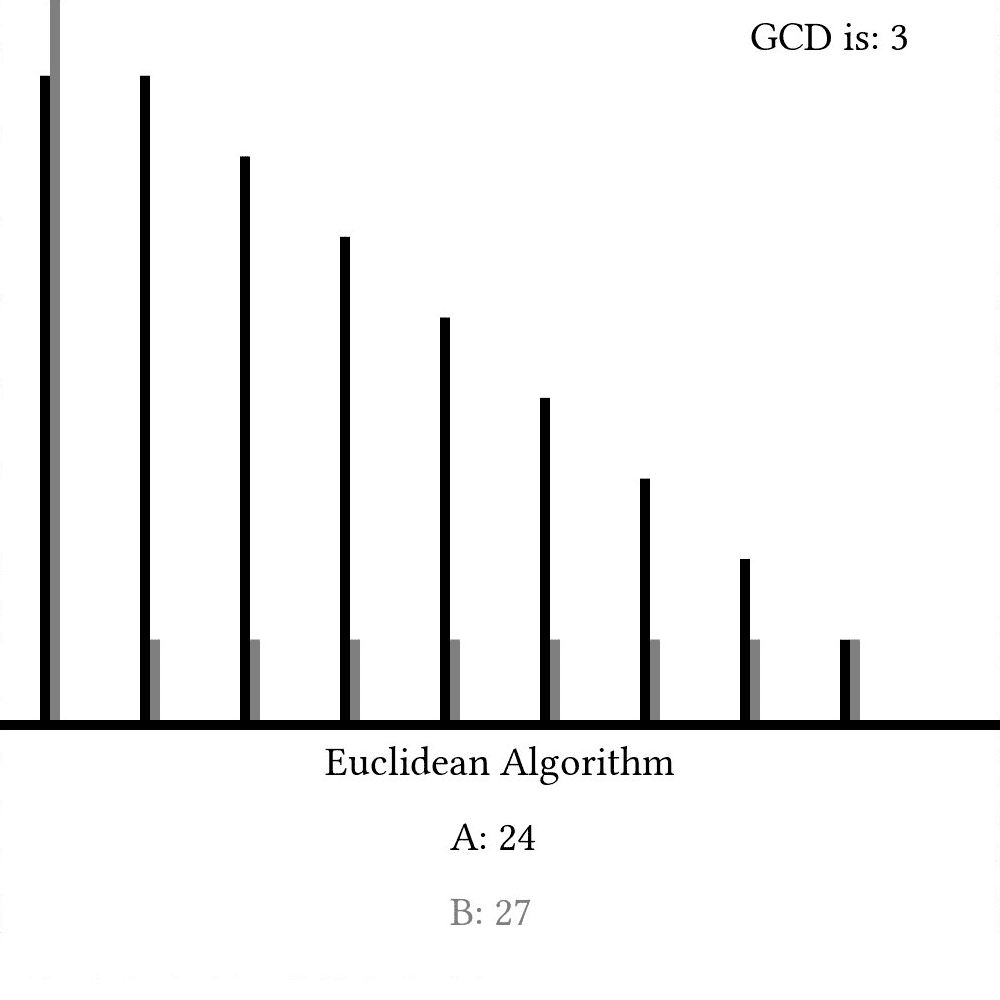
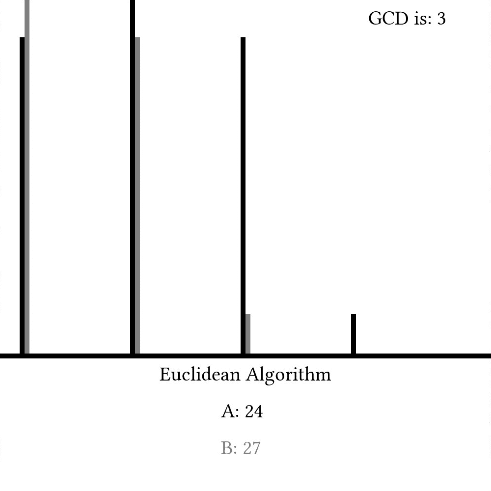

# 欧几里得算法

> 原文：[`www.algorithm-archive.org/contents/euclidean_algorithm/euclidean_algorithm.html`](https://www.algorithm-archive.org/contents/euclidean_algorithm/euclidean_algorithm.html)

计算机科学（几乎可以说是）是一门关于计算机的科学——一个在 19 世纪首次被构想出来的设备。计算机已经变得如此革命性，以至于很难想象没有它们我们的生活。话虽如此，*算法*要古老得多，并且在世界上存在了数千年。令人难以置信的是，在公元纪元之前创建的一些算法至今仍在使用。其中一个算法首先在欧几里得的《几何原本》（约公元前 300 年）中描述，并被称为*欧几里得算法*。

该算法是一种简单的找到两个数*最大公约数*（GCD）的方法，这在许多不同的应用中很有用（如化简分数）。第一种方法（由欧几里得构想）使用简单的减法：

```
function s:euclid_sub(a, b)
    let l:a = abs(a:a)
    let l:b = abs(a:b)

    while l:a != l:b
        if l:a > l:b
            let l:a -= l:b
        else
            let l:b -= l:a
        endif
    endwhile

    return l:a
endfunction 
```

```
int euclid_sub(int a, int b) {
  a = abs(a);
  b = abs(b);

  while (a != b) {
    if (a > b) {
      a -= b;
    } else {
      b -= a;
    }
  }

  return a;
} 
```

```
public int EuclidSub(int a, int b)
{
    // Math.Abs for negative number support
    a = Math.Abs(a);
    b = Math.Abs(b);

    while (a != b)
    {
        if (a > b)
            a = a - b;
        else
            b = b - a;
    }

    return a;
} 
```

```
(defn euclid-sub [a b]
  (loop [i (Math/abs a) j (Math/abs b)]
    (if (= i j)
      i
      (if (> i j)
        (recur (- i j) j)
        (recur i (- j i)))))) 
```

```
int euclid_sub(int a, int b) {
  a = std::abs(a);
  b = std::abs(b);

  while (a != b) {
    if (a > b) {
      a -= b;
    } else {
      b -= a;
    }
  }

  return a;
} 
```

```
public static int euclidSub(int a, int b) {
    a = Math.abs(a);
    b = Math.abs(b);

    while (a != b) {
        if (a > b) {
            a -= b;
        } else {
            b -= a;
        }
    }

    return a;
} 
```

```
fun euclidSub(a: Int, b: Int): Int {
    var a = a.absoluteValue
    var b = b.absoluteValue

    while (a != b) {
        if (a > b) a -= b
        else b -= a
    }

    return a
} 
```

```
function euclidSub(a, b) {
  a = Math.abs(a);
  b = Math.abs(b);

  while (a !== b) {
    if (a > b) {
      a -= b;
    } else {
      b -= a;
    }
  }

  return a;
} 
```

```
(defun euclid-sub (a b)
  "Finds the greatest common divsor for any two integers"
  (defun euclid-sub* (a b)
    "Finds the greatest common divisor for any two positive integers"
    (if (eql a b)
        a
        (if (> a b)
            (euclid-sub* (- a b) b)
            (euclid-sub* a (- b a)))))
  (euclid-sub* (abs a) (abs b))) 
```

```
def euclid_sub(a, b):

    a = abs(a)
    b = abs(b)

    if a == 0:
        return b
    elif b == 0:
        return a

    while a != b:
        if a > b:
            a -= b
        else:
            b -= a

    return a 
```

```
euclidSub :: Integer -> Integer -> Integer
euclidSub a b = inner (abs a) (abs b)
  where
    inner x y
      -- if a = b, then the gcd is a
      | x == y = x
      -- if a < b: Recursively call euclidSub with the a and (b-a) as new inputs
      | x < y = euclidSub x (y - x)
      -- otherwise: Recursively call euclidSub with the a and (b-a) as new inputs
      | otherwise = euclidSub (x - y) y 
```

```
fn euclid_sub(mut a: i64, mut b: i64) -> i64 {
    a = a.abs();
    b = b.abs();
    while a != b {
        if a < b {
            b -= a;
        } else {
            a -= b;
        }
    }

    a
} 
```

```
let euclid_sub a b =
  let rec inner a b =
    if a = b then
      a
    else if a < b then
      inner a (b - a)
    else
      inner (a - b) b
  in (inner (abs a) (abs b)) 
```

```
func euclidSub(a, b int) int {
    a = abs(a)
    b = abs(b)

    for a != b {
        if a > b {
            a -= b
        } else {
            b -= a
        }
    }

    return a
} 
```

```
func euclidSub(a: Int, b: Int) -> Int {
    var a = abs(a)
    var b = abs(b)

    while (a != b) {
        if (a > b) {
            a -= b
        } else {
            b -= a
        }
    }

    return a
} 
```

```
function gcd = euclidSub(a,b)

    a = abs(a);
    b = abs(b);

    while a ~= b
        if a > b
            a = a - b;
        else
            b = b - a;
        end
    end

    gcd = a;
end 
```

```
local function euclid_sub(a, b)
  a = math.abs(a)
  b = math.abs(b)

  while a ~= b do
    if a > b then
      a = a-b
    else
      b = b-a
    end
  end

  return a
end 
```

```
function euclid_sub(a::Int64, b::Int64)
    a = abs(a)
    b = abs(b)

    while (a != b)
        if (a > b)
            a -= b
        else
            b -= a
        end
    end

    return a
end 
```

```
func euclid_sub(in1, in2: int): int =
  var
    a = abs(in1)
    b = abs(in2)

  while a != b:
    if a > b:
      a -= b
    else:
      b -= a

  result = a 
```

```
 euclid_sub:
  mov    rax, rdi           # Get abs of a
  sar    rax, 31
  xor    rdi, rax
  sub    rdi, rax
  mov    rax, rsi           # Get abs of b
  sar    rax, 31
  xor    rsi, rax
  sub    rsi, rax
  jmp    check
loop:
  cmp    rdi, rsi           # Find which is bigger
  jle    if_true
  sub    rdi, rsi           # If a is bigger then a -= b
  jmp    check
if_true:
  sub    rsi, rdi           # Else b -= a
check:
  cmp    rsi, rdi           # Check if a and b are not equal
  jne    loop
  mov    rax, rdi           # Return results 
```

```
INTEGER FUNCTION euclid_sub(a, b)
    IMPLICIT NONE
    INTEGER, INTENT(INOUT) :: a, b

    a = ABS(a)
    b = ABS(b)

    DO WHILE (a /= b)

        IF (a > b) THEN
            a = a - b
        ELSE
            b = b - a
        END IF
    END DO

    euclid_sub = a

END FUNCTION euclid_sub 
```

```
function euclid_sub(int $a, int $b): int
{
    $a = abs($a);
    $b = abs($b);

    while ($a !== $b) {
        if ($a > $b) {
            $a = $a - $b;
        } else {
            $b = $b - $a;
        }
    }

    return $a;
} 
```

```
: euclid- ( a b -- gcd )
  [ abs ] bi@
  [ 2dup = ]
  [
    ! make sure the lower number is deeper
    2dup >= [ swap ] when
    over -
    ! leaves us with stack { <lower> <greater - lower> }
  ]
  until
  ! we have the GCD twice now, drop one
  drop
; 
```

```
Euclidian algorithm subtraction method.
Enter two positive integers.    

The                      
end. 
```

```
def euclid_sub(a: Int, b: Int): Int =
  (Math.abs(a), Math.abs(b)) match {
    case (0, _) | (_, 0) => 0
    case (x, y) if x < y => euclid_sub(x, y - x)
    case (x, y) if x > y => euclid_sub(x - y, y)
    case _ => a 
```

```
(define (euclid_sub a b)
  (local ((define (euclid_sub* x y)
          (if (= x y)
              x
              (if (> x y)
                  (euclid_sub* (- x y) y)
                  (euclid_sub* x (- y x))
                  )
              )
          )) (euclid_sub* (abs a) (abs b))
    )
  ) 
```

```
def gcd_minus(a, b)
    a = a.abs
    b = b.abs
    until a == b
        if a > b
            a -= b
        else
            b -= a
        end
    end
    a
end 
```

```
Integer>>euclidSub: secondNumber
    "Euclidean algorithm with subtraction"
    | a b |
    a := self abs.
    b := secondNumber abs.
    [ a == b ] whileFalse: [ 
        a > b ifTrue: [ 
            a := a - b.
        ] ifFalse: [ 
            b := b - a.
        ].
    ].
    ^a. 
```

```
🐇 ❗️ 🔼 a 🔢 b 🔢 ➡️ 🔢 🍇
  💭 Use 🏧 (returns the absolute value) to support negative numbers.
  🏧a ❗️ ➡️ 🖍🆕var_a
  🏧b ❗️ ➡️ 🖍🆕var_b

  ️🔁 ❎ var_a 🙌 var_b ❗️ 🍇
    ↪️ var_a ▶️ var_b 🍇
      var_a ⬅️ ➖ var_b
    🍉
    🙅 🍇
      var_b ⬅️ ➖ var_a
    🍉
  🍉

  ↩️ var_a
🍉 
```

```
HOW IZ I UKLIDSUP YR NUM1 AN YR NUM2
    NUM1 R I IZ ABZ YR NUM1 MKAY
    NUM2 R I IZ ABZ YR NUM2 MKAY

    IM IN YR LOOP 
        BOTH SAEM NUM1 AN NUM2, O RLY?
            YA RLY, FOUND YR NUM1
        OIC        

        DIFFRINT NUM1 AN SMALLR OF NUM1 AN NUM2, O RLY?
            YA RLY, NUM1 R DIFF OF NUM1 AN NUM2
            NO WAI, NUM2 R DIFF OF NUM2 AN NUM1
        OIC
    IM OUTTA YR LOOP

IF U SAY SO 
```

```
euclid_sub() {
    local a
    local b
    a=$(abs "$1")
    b=$(abs "$2")

    while (( a != b )); do
        if (( a > b )); then
            ((a -= b))
        else
            ((b -= a))
        fi
    done
    printf "%s" "$a"
} 
```

```
// Euclidean algorithm with subtraction
int euclid_sub(int a, int b) {
    a = abs(a);
    b = abs(b);

    while (a != b) {
        if (a > b) {
            a -= b;
        } else {
            b -= a;
        }
    }

    return a;
} 
```

>  

```
(define (euclid-sub a b)
    (cond                                                                                                                                                                                                                                                                         
        [(or (negative? a)(negative? b))(euclid-sub (abs a)(abs b))]                                                                                                                                                                                                              
        [(eq? a b) a]
        [(> a b)(euclid-sub(- a b) b)]
        [else
            (euclid-sub a (- b a))])) 
```


# 留下一行空白：

```
function Sub-Euclid($a, $b) {
    $a = [Math]::Abs($a)
    $b = [Math]::Abs($b)

    while ($a -ne $b) {
        if ($a -gt $b) {
            $a = $a - $b
        } else {
            $b = $b - $a
        }
    }

    return $a
} 
```

```
def euclid_sub(int(a), 0) = a
addpattern def euclid_sub(0, int(b)) = b

addpattern def euclid_sub(int(a), int(b)):
    if a < b:
        return euclid_sub(a, b - a)
    elif b < a:
        return euclid_sub(a - b, b)
    return a 
```

在这里，我们每一步只是简单地排列两个数，并在每个时间步长从较大的数中减去较小的数。一旦两个值相等，我们就称那个值为最大公约数。`a`和`b`随每一步变化而变化的图表看起来可能就像这样：



现代实现通常使用模运算符（%）如下

```
function s:euclid_mod(a, b)
    let l:a = abs(a:a)
    let l:b = abs(a:b)

    while l:b != 0
        let l:c = l:b
        let l:b = l:a % l:b
        let l:a = l:c
    endwhile

    return l:a
endfunction 
```

```
int euclid_mod(int a, int b) {
  a = abs(a);
  b = abs(b);

  while (b != 0) {
    int temp = b;
    b = a % b;
    a = temp;
  }

  return a;
} 
```

```
public int EuclidMod(int a, int b)
{
    // Math.Abs for negative number support
    a = Math.Abs(a);
    b = Math.Abs(b);

    while (b != 0)
    {
        var temp = b;
        b = a % b;
        a = temp;
    }

    return a;
} 
```

```
(defn euclid-mod [a b]
  (loop [i (Math/abs a) j (Math/abs b)]
    (if (zero? j)
      i
      (recur j (% i j))))) 
```

```
// Euclidean algorithm using modulus
int euclid_mod(int a, int b) {
  a = std::abs(a);
  b = std::abs(b);

  while (b != 0) {
    a = std::exchange(b, a % b);
  }

  return a;
} 
```

```
public static int euclidMod(int a, int b) {
    while (b != 0) {
        int tmp = b;
        b = a % b;
        a = tmp;
    }

    return a;
} 
```

```
fun euclidMod(a: Int, b: Int): Int {
    var a = a.absoluteValue
    var b = b.absoluteValue

    while (b != 0) {
        val tmp = b
        b = a % b
        a = tmp
    }

    return a
} 
```

```
function euclidMod(a, b) {
  a = Math.abs(a);
  b = Math.abs(b);

  let temp;
  while (b !== 0) {
    temp = b;
    b = a % b;
    a = temp;
  }

  return a;
} 
```

```
(defun euclid-mod (a b)
  "Finds the greatest common divisor for any two integers"
  (if (zerop b)
      (abs a)
      (euclid-mod b (mod a b)))) 
```

```
def euclid_mod(a, b):

    a = abs(a)
    b = abs(b)

    while b > 0:
        a, b = b, a % b

    return a 
```

```
euclidMod :: Integer -> Integer -> Integer
euclidMod a b = inner (abs a) (abs b)
  where
    -- if a divides b, then gcd is a
    inner x 0 = x
    -- otherwise, recursively call inner with b and (a mod b) as new inputs
    inner x y = inner y (x `mod` y) 
```

```
fn euclid_rem(mut a: i64, mut b: i64) -> i64 {
    a = a.abs();
    b = b.abs();
    while b != 0 {
        let tmp = b;
        b = a % b;
        a = tmp;
    }

    a
} 
```

```
let euclid_mod a b =
  let rec inner a = function
  | 0 -> a
  | b -> inner b (a mod b)
  in (inner (abs a) (abs b)) 
```

```
func euclidMod(a, b int) int {
    a = abs(a)
    b = abs(b)

    for b != 0 {
        a, b = b, a%b
    }

    return a
} 
```

```
func euclidMod(a: Int, b: Int) -> Int {
    var a = abs(a);
    var b = abs(b);

    while (b != 0) {
        let temp = b
        b = a % b
        a = temp
    }

    return a
} 
```

```
function gcd = euclidMod(a,b)

    a=abs(a);
    b=abs(b);

    while b > 0
        temp = b;
        b = mod(a,b);
        a = temp;
    end

    gcd = a;
end 
```

```
local function euclid_mod(a, b)
  a = math.abs(a)
  b = math.abs(b)

  while b ~= 0 do
    a, b = b, a%b
  end

  return a
end 
```

```
function euclid_mod(a::Int64, b::Int64)
    a = abs(a)
    b = abs(b)

    while(b != 0)
        b,a = a%b,b
    end

    return a
end 
```

```
func euclid_mod(in1, in2: int): int =
  var
    a = abs(in1)
    b = abs(in2)

  while b != 0:
    let temp: int = b
    b = a mod b
    a = temp;

  result = a 
```

```
 # rdi - a
# rsi - b
# RET rax - gcd of a and b
euclid_mod:
  mov    rax, rdi           # Get abs of a
  sar    rax, 31
  xor    rdi, rax
  sub    rdi, rax
  mov    rax, rsi           # Get abs of b
  sar    rax, 31
  xor    rsi, rax
  sub    rsi, rax
  jmp    mod_check
mod_loop:
  xor    rdx, rdx           # Take the mod of a and b
  mov    rax, rdi
  div    rsi
  mov    rdi, rsi           # Set b to the mod of a and b
  mov    rsi, rdx           # Set a to b
mod_check:
  cmp    rsi, 0             # Check if b is non-zero
  jne    mod_loop
  mov    rax, rdi           # Return the result 
```

```
INTEGER FUNCTION euclid_mod(a, b)
    IMPLICIT NONE
    INTEGER, INTENT(INOUT) :: a, b
    INTEGER                :: temp

    DO WHILE (b > 0)
        temp = b
        b = MODULO(a,b)
        a = temp
    END DO

    euclid_mod = a

END FUNCTION euclid_mod 
```

```
function euclid_mod(int $a, int $b): int
{
    $a = abs($a);
    $b = abs($b);

    while ($b !== 0) {
        list($b, $a) = [$a % $b, $b];
    }

    return $a;
} 
```

```
: euclid% ( a b -- gcd )
  [ abs ] bi@   ! take both absolute values
  [ dup zero? ] ! check if `b` (on top) is 0
  [
    ! a b -> a b b -> b a b -> b a%b
    dup -rot mod
  ]
  until
  ! the zero is on top, so get rid of it
  drop
; 
```

```
Euclidian algorithm modulo method.
Enter two positive integers.    

The
end. 
```

```
 def euclid_mod(a: Int, b: Int): Int =
  (Math.abs(a), Math.abs(b)) match {
    case (_, 0) => a
    case (a, b) => euclid_mod(b, a % b) 
```

```
(define (euclid_mod a b)
  (local ((define (euclid_mod* a b)
           (if (= 0 b)
               (abs a)
               (euclid_mod* b (modulo a b))
               )
           )) (euclid_mod* a b)
    )
  ) 
```

```
def gcd_mod(a, b)
    a = a.abs
    b = b.abs
    a, b = b, a%b until b.zero?
    a
end 
```

```
Integer>>euclidMod: secondNumber
    "Euclidean algorithm with modulus."
    | a b oldB |
    a := self abs.
    b := secondNumber abs.
    [ b == 0 ] whileFalse: [ 
        oldB := b.
        b := a % b.
        a := oldB.
    ].
    ^a. 
```

```
🐇 ❗️ ⏫ a 🔢 b 🔢 ➡️ 🔢 🍇
  💭 Use 🏧 (returns the absolute value) to support negative numbers.
  🏧a ❗️ ➡️ 🖍🆕var_a
  🏧b ❗️ ➡️ 🖍🆕var_b

  ️🔁 ❎ var_b 🙌 0 ❗️ 🍇
    var_b ➡️ temp
    var_a 🚮 var_b ➡️ 🖍var_b
    temp ➡️ 🖍var_a
  🍉

  ↩️ var_a
🍉 
```

```
HOW IZ I UKLIDMOD YR NUM1 AN YR NUM2
    NUM1 R I IZ ABZ YR NUM1 MKAY
    NUM2 R I IZ ABZ YR NUM2 MKAY

    IM IN YR LOOP 
        BOTH SAEM NUM2 AN 0, O RLY?
            YA RLY, FOUND YR NUM1
        OIC

        I HAS A TMP ITZ NUM2
        NUM2 R MOD OF NUM1 AN NUM2
        NUM1 R TMP
    IM OUTTA YR LOOP

IF U SAY SO 
```

```
euclid_mod() {
    local a
    local b
    a=$(abs "$1")
    b=$(abs "$2")

    while (( b != 0 )); do
        ((tmp = b))
        ((b = a % b))
        ((a = tmp))
    done
    printf "%s" "$a"
} 
```

```
// Euclidean algorithm using modulus
int euclid_mod(int a, int b) {
    int tmp;
    a = abs(a);
    b = abs(b);

    while (b != 0) {
        tmp = a % b;
        a = b;
        b = tmp;
    }

    return a;
} 
```

>  

```
(define (euclid-mod a b)
    (if (zero? b)
        a
        (euclid-mod b (modulo a b)))) 
```


# 留下一行空白：

```
function Mod-Euclid($a, $b) {
    $a = [Math]::Abs($a)
    $b = [Math]::Abs($b)

    while ($b -ne 0) {
        $tmp = $b
        $b = $a % $b
        $a = $tmp
    }

    return $a
} 
```

```
def euclid_mod(int(a), 0) = a
addpattern def euclid_mod(0, int(b)) = b

addpattern def euclid_mod(int(a), int(b)) = euclid_mod(b, a % b) 
```

在这里，我们将`b`设置为`a%b`的余数，将`a`设置为上一步中`b`的值。由于模运算符的工作方式，这将提供与基于减法实现相同的信息，但当我们显示`a`和`b`随时间变化的情况时，我们可以看到它可能需要更少的步骤：



欧几里得算法确实是计算机科学历史上许多其他算法的基础，并且肯定会在以后再次被使用。至少对我来说，这样一个古老的算法仍然具有现代的应用和吸引力是令人惊讶的。话虽如此，还有一些其他算法可以找到两个数的最大公约数，在某些情况下可能比欧几里得算法更好，但我们在他去世两千年后仍在讨论欧几里得的事实表明，真正的数学是永恒和普遍的。我认为这很酷。

## 视频解释

这里有一个关于欧几里得算法的视频：

[`www.youtube-nocookie.com/embed/h86RzlyHfUE`](https://www.youtube-nocookie.com/embed/h86RzlyHfUE)

## 示例代码

```
function s:euclid_mod(a, b)
    let l:a = abs(a:a)
    let l:b = abs(a:b)

    while l:b != 0
        let l:c = l:b
        let l:b = l:a % l:b
        let l:a = l:c
    endwhile

    return l:a
endfunction

function s:euclid_sub(a, b)
    let l:a = abs(a:a)
    let l:b = abs(a:b)

    while l:a != l:b
        if l:a > l:b
            let l:a -= l:b
        else
            let l:b -= l:a
        endif
    endwhile

    return l:a
endfunction

let s:check_1 = s:euclid_mod(64 * 67, 64 * 71)
let s:check_2 = s:euclid_sub(128 * 12, 128 * 77)

echo 'Modulus-based euclidean algorithm result:' s:check_1
echo 'subtraction-based euclidean algorithm result:' s:check_2 
```

```
#include <stdio.h>
#include <stdlib.h>

int euclid_mod(int a, int b) {
  a = abs(a);
  b = abs(b);

  while (b != 0) {
    int temp = b;
    b = a % b;
    a = temp;
  }

  return a;
}

int euclid_sub(int a, int b) {
  a = abs(a);
  b = abs(b);

  while (a != b) {
    if (a > b) {
      a -= b;
    } else {
      b -= a;
    }
  }

  return a;
}

int main() {
  int check1 = euclid_mod(64 * 67, 64 * 81);
  int check2 = euclid_sub(128 * 12, 128 * 77);

  printf("[#]\nModulus-based euclidean algorithm result:\n%d\n", check1);
  printf("[#]\nSubtraction-based euclidean algorithm result:\n%d\n", check2);

  return 0;
} 
```

##### EuclideanAlgorithm.cs

```
// submitted by Julian Schacher (jspp)
using System;

namespace EuclideanAlgorithm
{
    public class EuclideanAlgorithm
    {
        public int EuclidSub(int a, int b)
        {
            // Math.Abs for negative number support
            a = Math.Abs(a);
            b = Math.Abs(b);

            while (a != b)
            {
                if (a > b)
                    a = a - b;
                else
                    b = b - a;
            }

            return a;
        }

        public int EuclidMod(int a, int b)
        {
            // Math.Abs for negative number support
            a = Math.Abs(a);
            b = Math.Abs(b);

            while (b != 0)
            {
                var temp = b;
                b = a % b;
                a = temp;
            }

            return a;
        }
    }
} 
```

##### Program.cs

```
// submitted by Julian Schacher (jspp)
using System;

namespace EuclideanAlgorithm
{
    class Program
    {
        static void Main(string[] args)
        {
            var euclideanAlgorithm = new EuclideanAlgorithm();
            int check = euclideanAlgorithm.EuclidMod(64 * 67, 64 * 81);
            int check2 = euclideanAlgorithm.EuclidSub(128 * 12, 128 * 77);

            Console.WriteLine("[#]\nModulus-based euclidean algorithm result:");
            Console.WriteLine(check);
            Console.WriteLine("[#]\nSubtraction-based euclidean algorithm result:");
            Console.WriteLine(check2);
        }
    }
} 
```

```
;; earthfail
(defn euclid-sub [a b]
  (loop [i (Math/abs a) j (Math/abs b)]
    (if (= i j)
      i
      (if (> i j)
        (recur (- i j) j)
        (recur i (- j i))))))
(defn euclid-mod [a b]
  (loop [i (Math/abs a) j (Math/abs b)]
    (if (zero? j)
      i
      (recur j (% i j)))))

(print
 (euclid-sub (* 64 67)
             (* 64 81))
 (euclid-mod (* 128 12)
             (* 128 77))) 
```

```
#include <cmath>
#include <iostream>
#include <utility>

// Euclidean algorithm using modulus
int euclid_mod(int a, int b) {
  a = std::abs(a);
  b = std::abs(b);

  while (b != 0) {
    a = std::exchange(b, a % b);
  }

  return a;
}

// Euclidean algorithm with subtraction
int euclid_sub(int a, int b) {
  a = std::abs(a);
  b = std::abs(b);

  while (a != b) {
    if (a > b) {
      a -= b;
    } else {
      b -= a;
    }
  }

  return a;
}

int main() {
  auto check1 = euclid_mod(64 * 67, 64 * 81);
  auto check2 = euclid_sub(128 * 12, 128 * 77);

  std::cout << "[#]\nModulus-based euclidean algorithm result:\n" << check1 << '\n';
  std::cout << "[#]\nSubtraction-based euclidean algorithm result:\n" << check2 << '\n';
} 
```

```
// submitted by lolatomroflsinnlos, modified by xam4lor
public class EuclideanAlgo {
    public static int euclidSub(int a, int b) {
        a = Math.abs(a);
        b = Math.abs(b);

        while (a != b) {
            if (a > b) {
                a -= b;
            } else {
                b -= a;
            }
        }

        return a;
    }

    public static int euclidMod(int a, int b) {
        while (b != 0) {
            int tmp = b;
            b = a % b;
            a = tmp;
        }

        return a;
    }

    public static void main(String[] args) {
        System.out.println("[#]\nModulus-based euclidean algorithm result:");
        System.out.println(euclidMod(64 * 67, 64 * 81));
        System.out.println("[#]\nSubtraction-based euclidean algorithm result:");
        System.out.println(euclidSub(128 * 12, 128 * 77));
    }
} 
```

```
import kotlin.math.absoluteValue

fun euclidSub(a: Int, b: Int): Int {
    var a = a.absoluteValue
    var b = b.absoluteValue

    while (a != b) {
        if (a > b) a -= b
        else b -= a
    }

    return a
}

fun euclidMod(a: Int, b: Int): Int {
    var a = a.absoluteValue
    var b = b.absoluteValue

    while (b != 0) {
        val tmp = b
        b = a % b
        a = tmp
    }

    return a
}

fun main(args: Array<String>) {
    println("[#]\nModulus-based euclidean algorithm result:")
    println(euclidMod(64 * 67, 64 * 81))
    println("[#]\nSubtraction-based euclidean algorithm result:")
    println(euclidSub(128 * 12, 128 * 77))
} 
```

```
function euclidMod(a, b) {
  a = Math.abs(a);
  b = Math.abs(b);

  let temp;
  while (b !== 0) {
    temp = b;
    b = a % b;
    a = temp;
  }

  return a;
}

function euclidSub(a, b) {
  a = Math.abs(a);
  b = Math.abs(b);

  while (a !== b) {
    if (a > b) {
      a -= b;
    } else {
      b -= a;
    }
  }

  return a;
}

console.log('[#]\nModulus-based euclidean algorithm result:')
console.log(euclidMod(64 * 67, 64 * 81));
console.log('[#]\nSubtraction-based euclidean algorithm result:')
console.log(euclidSub(128 * 12, 128 * 77)); 
```

```
;;;; Euclidean algorithm implementation in Common Lisp

(defun euclid-sub (a b)
  "Finds the greatest common divsor for any two integers"
  (defun euclid-sub* (a b)
    "Finds the greatest common divisor for any two positive integers"
    (if (eql a b)
        a
        (if (> a b)
            (euclid-sub* (- a b) b)
            (euclid-sub* a (- b a)))))
  (euclid-sub* (abs a) (abs b)))

(defun euclid-mod (a b)
  "Finds the greatest common divisor for any two integers"
  (if (zerop b)
      (abs a)
      (euclid-mod b (mod a b))))

(format T "[#]~%Modulus-based euclidean algorithm result:~%")
(format T "~d~%" (euclid-sub (* 64 67) (* 64 81)))
(format T "[#]~%Subtraction-based euclidean algorithm result:~%")
(format T "~d~%" (euclid-mod (* 128 12) (* 128 77)))

;; Quick test
(assert
  (eql (euclid-sub (* 64 67) (* 64 81))
       (gcd (* 64 67) (* 64 81))))

(assert
  (eql (euclid-mod (* 64 67) (* 64 81))
       (gcd (* 64 67) (* 64 81)))) 
```

```
def euclid_mod(a, b):

    a = abs(a)
    b = abs(b)

    while b > 0:
        a, b = b, a % b

    return a

def euclid_sub(a, b):

    a = abs(a)
    b = abs(b)

    if a == 0:
        return b
    elif b == 0:
        return a

    while a != b:
        if a > b:
            a -= b
        else:
            b -= a

    return a

if __name__=="__main__":
    print('[#]\nModulus-based euclidean algorithm result:'),
    print(euclid_mod(64 * 67, 64 * 81))
    print('[#]\nSubtraction-based euclidean algorithm result:')
    print(euclid_sub(128 * 12, 128 * 77)) 
```

```
-- Method 1: Euclid's original subtraction algorithm

euclidSub :: Integer -> Integer -> Integer
euclidSub a b = inner (abs a) (abs b)
  where
    inner x y
      -- if a = b, then the gcd is a
      | x == y = x
      -- if a < b: Recursively call euclidSub with the a and (b-a) as new inputs
      | x < y = euclidSub x (y - x)
      -- otherwise: Recursively call euclidSub with the a and (b-a) as new inputs
      | otherwise = euclidSub (x - y) y

-- _______________________________________________________________________

-- Method 2: Modern implemetation - The modulus method.

euclidMod :: Integer -> Integer -> Integer
euclidMod a b = inner (abs a) (abs b)
  where
    -- if a divides b, then gcd is a
    inner x 0 = x
    -- otherwise, recursively call inner with b and (a mod b) as new inputs
    inner x y = inner y (x `mod` y)

-- _________________________________________________________________________

-- Examples

main :: IO ()
main = do
  let chk1 = euclidMod (64 * 67) (64 * 81)
      chk2 = euclidSub (128 * 12) (128 * 77)
  putStrLn "[#]\nModulus-based euclidean algorithm result:"
  print chk1
  putStrLn "[#]\nSubtraction-based euclidean algorithm result:"
  print chk2 
```

```
// contributed by Nicole Mazzuca (ubsan)

fn euclid_sub(mut a: i64, mut b: i64) -> i64 {
    a = a.abs();
    b = b.abs();
    while a != b {
        if a < b {
            b -= a;
        } else {
            a -= b;
        }
    }

    a
}

fn euclid_rem(mut a: i64, mut b: i64) -> i64 {
    a = a.abs();
    b = b.abs();
    while b != 0 {
        let tmp = b;
        b = a % b;
        a = tmp;
    }

    a
}

fn main() {
    let chk1 = euclid_rem(64 * 67, 64 * 81);
    let chk2 = euclid_sub(128 * 12, 128 * 77);
    println!("[#]\nModulus-based euclidean algorithm result:\n{}", chk1);
    println!("[#]\nSubtraction-based euclidean algorithm result:\n{}", chk2);
} 
```

```
(* contributed by Nicole Mazzuca (ubsan) *)

let euclid_mod a b =
  let rec inner a = function
  | 0 -> a
  | b -> inner b (a mod b)
  in (inner (abs a) (abs b))

let euclid_sub a b =
  let rec inner a b =
    if a = b then
      a
    else if a < b then
      inner a (b - a)
    else
      inner (a - b) b
  in (inner (abs a) (abs b))

let chk1 = euclid_mod (64 * 67) (64 * 81)
let chk2 = euclid_sub (128 * 12) (128 * 77)
let () =
  Printf.printf "[#]\nModulus-based euclidean algorithm result:\n";
  chk1 |> print_int |> print_newline;
  Printf.printf "[#]\nSubtraction-based euclidean algorithm result:\n";
  chk2 |> print_int |> print_newline 
```

```
// Submitted by Chinmaya Mahesh (chin123)

package main

import "fmt"

func abs(a int) int {
    if a < 0 {
        a = -a
    }
    return a
}

func euclidMod(a, b int) int {
    a = abs(a)
    b = abs(b)

    for b != 0 {
        a, b = b, a%b
    }

    return a
}

func euclidSub(a, b int) int {
    a = abs(a)
    b = abs(b)

    for a != b {
        if a > b {
            a -= b
        } else {
            b -= a
        }
    }

    return a
}

func main() {
    check1 := euclidMod(64*67, 64*81)
    check2 := euclidSub(128*12, 128*77)

    fmt.Println("[#]\nModulus-based euclidean algorithm result:")
    fmt.Println(check1)
    fmt.Println("[#]\nSubtraction-based euclidean algorithm result:")
    fmt.Println(check2)
} 
```

```
func euclidSub(a: Int, b: Int) -> Int {
    var a = abs(a)
    var b = abs(b)

    while (a != b) {
        if (a > b) {
            a -= b
        } else {
            b -= a
        }
    }

    return a
}

func euclidMod(a: Int, b: Int) -> Int {
    var a = abs(a);
    var b = abs(b);

    while (b != 0) {
        let temp = b
        b = a % b
        a = temp
    }

    return a
}

func main() {
    print("[#]\nModulus-based euclidean algorithm result:")
    print(euclidMod(a: 64 * 67, b: 64 * 81))
    print("[#]\nSubtraction-based euclidean algorithm result:")
    print(euclidSub(a: 128 * 12, b: 128 * 77))
}

main() 
```

```
// Submitted by Max Weinstein

function gcd = euclidSub(a,b)

    a = abs(a);
    b = abs(b);

    while a ~= b
        if a > b
            a = a - b;
        else
            b = b - a;
        end
    end

    gcd = a;
end

function gcd = euclidMod(a,b)

    a=abs(a);
    b=abs(b);

    while b > 0
        temp = b;
        b = mod(a,b);
        a = temp;
    end

    gcd = a;
end

function euclid()
    ['[#] Modulus-based euclidean algorithm result: ',num2str(euclidMod(64 * 67, 64 * 81))]

    ['[#] Subtraction-based euclidean algorithm result: ',num2str(euclidSub(128 * 12, 128 * 77))]
end 
```

```
local function euclid_sub(a, b)
  a = math.abs(a)
  b = math.abs(b)

  while a ~= b do
    if a > b then
      a = a-b
    else
      b = b-a
    end
  end

  return a
end

local function euclid_mod(a, b)
  a = math.abs(a)
  b = math.abs(b)

  while b ~= 0 do
    a, b = b, a%b
  end

  return a
end

local function main()
  print("[#]\nModulus-based euclidean algorithm result:")
  print(euclid_mod(64 * 67, 64 * 81))
  print("[#]\nSubtraction-based euclidean algorithm result:")
  print(euclid_sub(128 * 12, 128 * 77))
end

main() 
```

```
function euclid_mod(a::Int64, b::Int64)
    a = abs(a)
    b = abs(b)

    while(b != 0)
        b,a = a%b,b
    end

    return a
end

function euclid_sub(a::Int64, b::Int64)
    a = abs(a)
    b = abs(b)

    while (a != b)
        if (a > b)
            a -= b
        else
            b -= a
        end
    end

    return a
end

function main()
    check1 = euclid_mod(64 * 67, 64 * 81);
    check2 = euclid_sub(128 * 12, 128 * 77);

    println("[#]\nModulus-based euclidean algorithm result:\n$(check1)")
    println("[#]\nSubtraction-based euclidean algorithm result:\n$(check2)")

end

main() 
```

```
func euclid_mod(in1, in2: int): int =
  var
    a = abs(in1)
    b = abs(in2)

  while b != 0:
    let temp: int = b
    b = a mod b
    a = temp;

  result = a

func euclid_sub(in1, in2: int): int =
  var
    a = abs(in1)
    b = abs(in2)

  while a != b:
    if a > b:
      a -= b
    else:
      b -= a

  result = a

when isMainModule:
  echo "[#]\nModulus-based euclidean algorithm result:"
  echo euclid_sub(64 * 67, 64 * 81)
  echo "[#]\nSubtraction-based euclidean algorithm result:"
  echo euclid_mod(128 * 12, 128 * 77) 
```

```
.intel_syntax noprefix

.section .rodata
  euclid_mod_fmt: .string "[#]\nModulus-based euclidean algorithm result:\n%d\n"
  euclid_sub_fmt: .string "[#]\nSubtraction-based euclidean algorithm result:\n%d\n"

.section .text
  .global main
  .extern printf

# rdi - a
# rsi - b
# RET rax - gcd of a and b
euclid_mod:
  mov    rax, rdi           # Get abs of a
  sar    rax, 31
  xor    rdi, rax
  sub    rdi, rax
  mov    rax, rsi           # Get abs of b
  sar    rax, 31
  xor    rsi, rax
  sub    rsi, rax
  jmp    mod_check
mod_loop:
  xor    rdx, rdx           # Take the mod of a and b
  mov    rax, rdi
  div    rsi
  mov    rdi, rsi           # Set b to the mod of a and b
  mov    rsi, rdx           # Set a to b
mod_check:
  cmp    rsi, 0             # Check if b is non-zero
  jne    mod_loop
  mov    rax, rdi           # Return the result
  ret

euclid_sub:
  mov    rax, rdi           # Get abs of a
  sar    rax, 31
  xor    rdi, rax
  sub    rdi, rax
  mov    rax, rsi           # Get abs of b
  sar    rax, 31
  xor    rsi, rax
  sub    rsi, rax
  jmp    check
loop:
  cmp    rdi, rsi           # Find which is bigger
  jle    if_true
  sub    rdi, rsi           # If a is bigger then a -= b
  jmp    check
if_true:
  sub    rsi, rdi           # Else b -= a
check:
  cmp    rsi, rdi           # Check if a and b are not equal
  jne    loop
  mov    rax, rdi           # Return results
  ret

main:
  mov    rdi, 4288          # Call euclid_mod
  mov    rsi, 5184
  call   euclid_mod
  mov    rdi, OFFSET euclid_mod_fmt    # Print output
  mov    rsi, rax
  xor    rax, rax
  call   printf
  mov    rdi, 1536          # Call euclid_sub
  mov    rsi, 9856
  call   euclid_sub
  mov    rdi, OFFSET euclid_sub_fmt    # Print output
  mov    rsi, rax
  xor    rax, rax
  call   printf
  xor    rax, rax           # Return 0
  ret 
```

```
INTEGER FUNCTION euclid_sub(a, b)
    IMPLICIT NONE
    INTEGER, INTENT(INOUT) :: a, b

    a = ABS(a)
    b = ABS(b)

    DO WHILE (a /= b)

        IF (a > b) THEN
            a = a - b
        ELSE
            b = b - a
        END IF
    END DO

    euclid_sub = a

END FUNCTION euclid_sub 

INTEGER FUNCTION euclid_mod(a, b)
    IMPLICIT NONE
    INTEGER, INTENT(INOUT) :: a, b
    INTEGER                :: temp

    DO WHILE (b > 0)
        temp = b
        b = MODULO(a,b)
        a = temp
    END DO

    euclid_mod = a

END FUNCTION euclid_mod

PROGRAM euclidean

    IMPLICIT NONE
    INTEGER :: a, b, euclid_sub, euclid_mod

    a = 64 * 67
    b = 64 * 81

    WRITE(*,'(a)') '[#]'
    WRITE(*,'(a)') 'Modulus-based euclidean algorithm result:'
    WRITE(*, '(g0)') euclid_mod(a, b)

    a = 128 * 12
    b = 128 * 77

    WRITE(*,'(a)') '[#]'
    WRITE(*,'(a)') 'Subtraction-based euclidean algorithm result:'
    WRITE(*, '(g0)') euclid_sub(a, b)

END PROGRAM euclidean 
```

```
<?php
declare(strict_types=1);

function euclid_sub(int $a, int $b): int
{
    $a = abs($a);
    $b = abs($b);

    while ($a !== $b) {
        if ($a > $b) {
            $a = $a - $b;
        } else {
            $b = $b - $a;
        }
    }

    return $a;
}

function euclid_mod(int $a, int $b): int
{
    $a = abs($a);
    $b = abs($b);

    while ($b !== 0) {
        list($b, $a) = [$a % $b, $b];
    }

    return $a;
}

printf('[#]'.PHP_EOL.'Modulus-based euclidean algorithm result:'.PHP_EOL.'%s', euclid_mod(64 * 67, 64 * 81));
echo PHP_EOL;
printf('[#]'.PHP_EOL.'Subtraction-based euclidean algorithm result:'.PHP_EOL.'%s', euclid_sub(128 * 12, 128 * 77));
echo PHP_EOL; 
```

```
: euclid- ( a b -- gcd )
  [ abs ] bi@
  [ 2dup = ]
  [
    ! make sure the lower number is deeper
    2dup >= [ swap ] when
    over -
    ! leaves us with stack { <lower> <greater - lower> }
  ]
  until
  ! we have the GCD twice now, drop one
  drop
;

: euclid% ( a b -- gcd )
  [ abs ] bi@   ! take both absolute values
  [ dup zero? ] ! check if `b` (on top) is 0
  [
    ! a b -> a b b -> b a b -> b a%b
    dup -rot mod
  ]
  until
  ! the zero is on top, so get rid of it
  drop
;

42 56 euclid% .  ! 14
48 180 euclid% . ! 12

42 56 euclid- .  ! 14
48 180 euclid- . ! 12 
```

这里是带有注释的算法的可读版本。首先，减法方法：

```
Reading the input: a, b
[SPACE][SPACE][SPACE][LF]            push 0
[SPACE][SPACE][SPACE][TAB][LF]       push 1
[TAB][LF][TAB][TAB]                  readi
[TAB][LF][TAB][TAB]                  readi

Loop: a, b => a, b-a
[LF][SPACE][SPACE][LF]               label_0:
[SPACE][SPACE][SPACE][LF]              push 0
[TAB][TAB][TAB]                        retrieve
[SPACE][SPACE][SPACE][TAB][LF]         push 1
[TAB][TAB][TAB]                        retrieve
[TAB][SPACE][SPACE][TAB]               sub
[SPACE][LF][SPACE]                     dup
[LF][TAB][SPACE][TAB][LF]              jmp zero label_1
[SPACE][LF][SPACE]                     dup
[LF][TAB][TAB][TAB][SPACE][LF]         jmp neg label_2
[SPACE][SPACE][SPACE][LF]              push 0
[SPACE][LF][TAB]                       swap
[TAB][TAB][SPACE]                      store
[LF][SPACE][LF][LF]                    jmp label_0

Exit when a=b
[LF][SPACE][SPACE][TAB][LF]          label_1:
[SPACE][SPACE][SPACE][LF]              push 0
[TAB][TAB][TAB]                        retrieve
[TAB][LF][SPACE][TAB]                  printi
[LF][LF][LF]                           end

If a>b: a, b => a-b, b
[LF][SPACE][SPACE][TAB][SPACE][LF]   label_2:
[SPACE][SPACE][SPACE][LF]              push 0
[SPACE][LF][TAB]                       swap
[TAB][SPACE][SPACE][TAB]               sub
[SPACE][SPACE][SPACE][TAB][LF]         push 1
[SPACE][LF][TAB]                       swap
[TAB][TAB][SPACE]                      store
[LF][SPACE][LF][LF]                    jmp label_0 
```

以及模数方法：

```
Reading the input: a, b
[SPACE][SPACE][SPACE][LF]       push 0
[SPACE][SPACE][SPACE][TAB][LF]  push 1
[TAB][LF][TAB][TAB]             readi
[TAB][LF][TAB][TAB]             readi

Loop: a, b => b, a%b
[LF][SPACE][SPACE][LF]          label_0:
[SPACE][SPACE][SPACE][LF]         push 0
[TAB][TAB][TAB]                   retrieve
[SPACE][LF][SPACE]                dup
[LF][TAB][SPACE][TAB][LF]         jmp zero label_1
[SPACE][SPACE][SPACE][TAB][LF]    push 1
[TAB][TAB][TAB]                   retrieve
[SPACE][LF][TAB]                  swap
[TAB][SPACE][TAB][TAB]            mod
[SPACE][SPACE][SPACE][LF]         push 0
[TAB][TAB][TAB]                   retrieve
[SPACE][SPACE][SPACE][TAB][LF]    push 1
[SPACE][LF][TAB]                  swap
[TAB][TAB][SPACE]                 store
[SPACE][SPACE][SPACE][LF]         push 0
[SPACE][LF][TAB]                  swap
[TAB][TAB][SPACE]                 store
[LF][SPACE][LF][LF]               jmp label_0

Exit when b=0
[LF][SPACE][SPACE][TAB][LF]     label_1:
[SPACE][SPACE][SPACE][TAB][LF]    push 1
[TAB][TAB][TAB]                   retrieve
[TAB][LF][SPACE][TAB]             printi
[LF][LF][LF][LF]                  end 
```

```
object Euclid {

  def euclid_sub(a: Int, b: Int): Int =
    (Math.abs(a), Math.abs(b)) match {
      case (0, _) | (_, 0) => 0
      case (x, y) if x < y => euclid_sub(x, y - x)
      case (x, y) if x > y => euclid_sub(x - y, y)
      case _ => a
    }

  def euclid_mod(a: Int, b: Int): Int =
    (Math.abs(a), Math.abs(b)) match {
      case (_, 0) => a
      case (a, b) => euclid_mod(b, a % b)
    }

  def main(args: Array[String]): Unit = {
    println("[#]\nModulus-based euclidean algorithm result:")
    println(euclid_mod(64 * 67, 64 * 81))
    println("[#]\nSubtraction-based euclidean algorithm result:")
    println(euclid_sub(128 * 12, 128 * 77))
  }

} 
```

```
#lang racket

(define (euclid_sub a b)
  (local ((define (euclid_sub* x y)
          (if (= x y)
              x
              (if (> x y)
                  (euclid_sub* (- x y) y)
                  (euclid_sub* x (- y x))
                  )
              )
          )) (euclid_sub* (abs a) (abs b))
    )
  )

(define (euclid_mod a b)
  (local ((define (euclid_mod* a b)
           (if (= 0 b)
               (abs a)
               (euclid_mod* b (modulo a b))
               )
           )) (euclid_mod* a b)
    )
  )

(displayln "[#]\nModulus-based euclidean algorithm result:")
(displayln (euclid_sub (* 64 67) (* 64 81)))
(displayln "[#]\nSubtraction-based euclidean algorithm result:")
(displayln (euclid_mod (* 128 12) (* 128 77))) 
```

```
def gcd_mod(a, b)
    a = a.abs
    b = b.abs
    a, b = b, a%b until b.zero?
    a
end

def gcd_minus(a, b)
    a = a.abs
    b = b.abs
    until a == b
        if a > b
            a -= b
        else
            b -= a
        end
    end
    a
end

print "[#]\nModulus-based euclidean algorithm result:\n"
p gcd_mod(64 * 67, 64 * 81)
print "[#]\nSubtraction-based euclidean algorithm result:\n"
p gcd_minus(128 * 12, 128 * 77) 
```

```
Integer>>euclidSub: secondNumber
    "Euclidean algorithm with subtraction"
    | a b |
    a := self abs.
    b := secondNumber abs.
    [ a == b ] whileFalse: [ 
        a > b ifTrue: [ 
            a := a - b.
        ] ifFalse: [ 
            b := b - a.
        ].
    ].
    ^a.

Integer>>euclidMod: secondNumber
    "Euclidean algorithm with modulus."
    | a b oldB |
    a := self abs.
    b := secondNumber abs.
    [ b == 0 ] whileFalse: [ 
        oldB := b.
        b := a % b.
        a := oldB.
    ].
    ^a.

Transcript show: ((64 * 67) euclidSub: (64 * 81)).
Transcript cr.
Transcript show: ((128 * 12) euclidMod: (128 * 77)). 
```

```
🐇 ⬆️ 🍇
  🐇 ❗️ 🔼 a 🔢 b 🔢 ➡️ 🔢 🍇
    💭 Use 🏧 (returns the absolute value) to support negative numbers.
    🏧a ❗️ ➡️ 🖍🆕var_a
    🏧b ❗️ ➡️ 🖍🆕var_b

    ️🔁 ❎ var_a 🙌 var_b ❗️ 🍇
      ↪️ var_a ▶️ var_b 🍇
        var_a ⬅️ ➖ var_b
      🍉
      🙅 🍇
        var_b ⬅️ ➖ var_a
      🍉
    🍉

    ↩️ var_a
  🍉

  🐇 ❗️ ⏫ a 🔢 b 🔢 ➡️ 🔢 🍇
    💭 Use 🏧 (returns the absolute value) to support negative numbers.
    🏧a ❗️ ➡️ 🖍🆕var_a
    🏧b ❗️ ➡️ 🖍🆕var_b

    ️🔁 ❎ var_b 🙌 0 ❗️ 🍇
      var_b ➡️ temp
      var_a 🚮 var_b ➡️ 🖍var_b
      temp ➡️ 🖍var_a
    🍉

    ↩️ var_a
  🍉
🍉

🏁 🍇
  😀 🔡 ️🔼🐇⬆️ 🤜64 ✖️ 67🤛 🤜64 ✖️ 81🤛 ❗️ 10 ❗️❗️
  😀 🔡 ️⏫🐇⬆️ 🤜128 ✖️ 12🤛 🤜128 ✖️ 77🤛 ❗️ 10 ❗️❗️
🍉 
```

```
HAI 1.2
    HOW IZ I ABZ YR NUM
        DIFFRINT NUM AN BIGGR OF NUM AN 0, O RLY?
            YA RLY, FOUND YR DIFF OF 0 AN NUM
            NO WAI, FOUND YR NUM
        OIC
    IF U SAY SO

    HOW IZ I UKLIDMOD YR NUM1 AN YR NUM2
        NUM1 R I IZ ABZ YR NUM1 MKAY
        NUM2 R I IZ ABZ YR NUM2 MKAY

        IM IN YR LOOP 
            BOTH SAEM NUM2 AN 0, O RLY?
                YA RLY, FOUND YR NUM1
            OIC

            I HAS A TMP ITZ NUM2
            NUM2 R MOD OF NUM1 AN NUM2
            NUM1 R TMP
        IM OUTTA YR LOOP

    IF U SAY SO

    HOW IZ I UKLIDSUP YR NUM1 AN YR NUM2
        NUM1 R I IZ ABZ YR NUM1 MKAY
        NUM2 R I IZ ABZ YR NUM2 MKAY

        IM IN YR LOOP 
            BOTH SAEM NUM1 AN NUM2, O RLY?
                YA RLY, FOUND YR NUM1
            OIC        

            DIFFRINT NUM1 AN SMALLR OF NUM1 AN NUM2, O RLY?
                YA RLY, NUM1 R DIFF OF NUM1 AN NUM2
                NO WAI, NUM2 R DIFF OF NUM2 AN NUM1
            OIC
        IM OUTTA YR LOOP

    IF U SAY SO

    I HAS A CHECK1 ITZ I IZ UKLIDMOD YR PRODUKT OF 64 AN 67 AN YR PRODUKT OF 64 AN 81 MKAY
    I HAS A CHECK2 ITZ I IZ UKLIDSUP YR PRODUKT OF 128 AN 12  AN YR PRODUKT OF 128 AN 77 MKAY

    VISIBLE CHECK1
    VISIBLE CHECK2
KTHXBYE 
```

```
#!/usr/bin/env bash
abs() {
    local ret=$1
    if (( ret < 0 )); then
        ((ret *= -1))
    fi
    printf "%s" "$ret"
} 

euclid_mod() {
    local a
    local b
    a=$(abs "$1")
    b=$(abs "$2")

    while (( b != 0 )); do
        ((tmp = b))
        ((b = a % b))
        ((a = tmp))
    done
    printf "%s" "$a"
}

euclid_sub() {
    local a
    local b
    a=$(abs "$1")
    b=$(abs "$2")

    while (( a != b )); do
        if (( a > b )); then
            ((a -= b))
        else
            ((b -= a))
        fi
    done
    printf "%s" "$a"
}

result=$(euclid_mod $((64 * 67)) $((64 * 81)))
echo -e "[#]\nModulus-based euclidean algorithm result:\n$result"
result=$(euclid_sub $((128 * 12)) $((128 * 77)))
echo -e "[#]\nSubtraction-based euclidean algorithm result:\n$result" 
```

```
import std.stdio;
import std.math;

// Euclidean algorithm using modulus
int euclid_mod(int a, int b) {
    int tmp;
    a = abs(a);
    b = abs(b);

    while (b != 0) {
        tmp = a % b;
        a = b;
        b = tmp;
    }

    return a;
}

// Euclidean algorithm with subtraction
int euclid_sub(int a, int b) {
    a = abs(a);
    b = abs(b);

    while (a != b) {
        if (a > b) {
            a -= b;
        } else {
            b -= a;
        }
    }

    return a;
}

void main()
{
    auto check1 = euclid_mod(64 * 67, 64 * 81);
    auto check2 = euclid_sub(128 * 12, 128 * 77);

    writeln("[#]\nModulus-based euclidean algorithm result:\n", check1);
    writeln("[#]\nSubtraction-based euclidean algorithm result:\n", check2);
} 
```

程序的文本版本为两个版本都提供。

#### 减法

>  

```
COMMAND                 STATE OF STACK
in(number)              A           // Take A as an input
duplicate               AA          // Start to take the absolute value of A
push 1                  1AA
duplicate               11AA
subtract                0AA
greater                 0/1A        // 1 if A > 0, 0 if A <= 0
not                     1/0A        // 0 if A > 0, 1 if A <= 0
push 1                  1 1/0 A
push 3                  31 1/0 A
subtract                -2 1/0 A
multiply                -2/0 A
push 1                  1 -2/0 A
add                     -1/1 A
multiply                A           // A should now be an absolute value

in(number)              BA          // Take B as an input
duplicate               BBA         // Start to take the absolute value of B
push 1                  1BBA
duplicate               11BBA
subtract                0BBA
greater                 0/1BA        // 1 if B > 0, 0 if B <= 0
not                     1/0BA        // 0 if B > 0, 1 if B <= 0
push 1                  1 1/0 BA
push 3                  31 1/0 BA
subtract                -2 1/0 BA
multiply                -2/0 BA
push 1                  1 -2/0 BA
add                     -1/1 BA
multiply                BA          // B should now be an absolute value

// Start of the main loop while a ≠ b 
duplicate               BBA
push 3                  3BBA
push 2                  23BBA
roll                    ABB
duplicate               AABB
push 4                  4AABB
push 1                  14AABB
roll                    ABBA
subtract                0/x BA
not                     1/0 BA      // 1 if a = b and 0 if a ≠ b
not                     0/1 BA      // 1 if a ≠ b and 0 if a = b
pointer                 BA          // If a ≠ b, the DP should change one clockwise, otherwise, go straight ahead.

    // Go left if a ≠ b (DP changed one clockwise)
    duplicate               BBA
    push 3                  3BBA
    push 2                  23BBA
    roll                    ABB
    duplicate               AABB
    push 4                  4AABB
    push 1                  14AABB
    roll                    ABBA
    push 2                  2ABBA
    push 1                  12ABBA
    roll                    BABA
    greater                 0/1 BA          // A > B; 1 if true; 0 if false
    pointer                 BA              // If A > B, DP goes one clockwise, otherwise, DP stays the same. 

        // If A > B (DP has changed 1 clockwise)
        duplicate               BBA
        push 3                  3BBA
        push 1                  13BBA
        roll                    BAB
        subtract                AB              // A = A - B
        push 2                  2AB
        push 1                  12AB
        roll                    BA
        // Go back to start of loop

        // If B > A (DP stayed the same)
        push 2                  2BA
        push 1                  12BA
        roll                    AB
        duplicate               AAB
        push 3                  3AAB
        push 1                  13AAB
        roll                    ABA
        subtract                BA              // B = B - A
        // Go back to start of loop

// Go down if a = b (end of while loop)
pop                     A
out(number)             -               // Print out A when done. 
```

#### 模数

>  

```
COMMAND                 STATE OF STACK
in(number)              A
in(number)              BA

//  Start of loop
duplicate               BBA
not                     0/1 BA
not                     1/0 BA
pointer                 BA

    // Go down if b ≠ 0
    duplicate               TBA
    push 3                  3TBA                  
    push 1                  13TBA
    roll                    BAT
    mod                     BA          // b = a mod b; a = t
    // Go back to the start of the loop

// Go right if b = 0
pop                     A
out(number)             -               // Print out A when done. 
```

```
(define (euclid-sub a b)
    (cond                                                                                                                                                                                                                                                                         
        [(or (negative? a)(negative? b))(euclid-sub (abs a)(abs b))]                                                                                                                                                                                                              
        [(eq? a b) a]
        [(> a b)(euclid-sub(- a b) b)]
        [else
            (euclid-sub a (- b a))]))

(define (euclid-mod a b)
    (if (zero? b)
        a
        (euclid-mod b (modulo a b))))

(display "[#]\nModulus-based euclidean algorithm result:") (newline)
(display (euclid-mod (* 64 67) (* 64 81))) (newline)

(display "[#]\nSubtraction-based euclidean algorithm result:") (newline)
(display (euclid-sub (* 128 12) (* 128 77))) (newline) 
```

代码片段取自这个 [Scratch 项目](https://scratch.mit.edu/projects/278727055/)


# 空一行：

```
function Sub-Euclid($a, $b) {
    $a = [Math]::Abs($a)
    $b = [Math]::Abs($b)

    while ($a -ne $b) {
        if ($a -gt $b) {
            $a = $a - $b
        } else {
            $b = $b - $a
        }
    }

    return $a
}

function Mod-Euclid($a, $b) {
    $a = [Math]::Abs($a)
    $b = [Math]::Abs($b)

    while ($b -ne 0) {
        $tmp = $b
        $b = $a % $b
        $a = $tmp
    }

    return $a
}

Write-Host "[#]`nSubtraction-based euclidean algorithm result:`n$(Mod-Euclid $(64 * 67) $(64 * 81))"
Write-Host "[#]`nModulus-based euclidean algorithm result:`n$(Sub-Euclid $(128 * 12) $(128 * 77))" 
```

```
def euclid_sub(int(a), 0) = a
addpattern def euclid_sub(0, int(b)) = b

addpattern def euclid_sub(int(a), int(b)):
    if a < b:
        return euclid_sub(a, b - a)
    elif b < a:
        return euclid_sub(a - b, b)
    return a

def euclid_mod(int(a), 0) = a
addpattern def euclid_mod(0, int(b)) = b

addpattern def euclid_mod(int(a), int(b)) = euclid_mod(b, a % b)

if __name__ == '__main__':
    print('[#]\nModulus-based euclidean algorithm result:')
    print(euclid_mod(64 * 67, 64 * 81))
    print('[#]\nSubtraction-based euclidean algorithm result:')
    print(euclid_sub(128 * 12, 128 * 77)) 
```

## 许可证

##### 代码示例

代码示例在 MIT 许可证下发布（见 [LICENSE.md](https://github.com/algorithm-archivists/algorithm-archive/blob/main/LICENSE.md)）。

##### 文本

本章的文本由 [James Schloss](https://github.com/leios) 编写，并授权于 [Creative Commons Attribution-ShareAlike 4.0 国际许可协议](https://creativecommons.org/licenses/by-sa/4.0/legalcode)。

[](https://creativecommons.org/licenses/by-sa/4.0/)

[(https://creativecommons.org/licenses/by-sa/4.0/)]

##### 图片/图形

+   图片 "Euclidsub" 由 [James Schloss](https://github.com/leios) 创建，并授权于 [Creative Commons Attribution-ShareAlike 4.0 国际许可协议](https://creativecommons.org/licenses/by-sa/4.0/legalcode)。

+   图片 "Euclidmod" 由 [James Schloss](https://github.com/leios) 创建，并授权于 [Creative Commons Attribution-ShareAlike 4.0 国际许可协议](https://creativecommons.org/licenses/by-sa/4.0/legalcode)。

##### 拉取请求

在初始许可 ([#560](https://github.com/algorithm-archivists/algorithm-archive/pull/560)) 之后，以下拉请求已修改本章的文本或图形：

+   无
