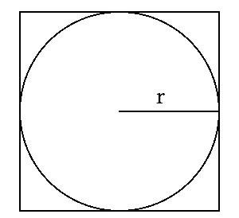

# 蒙特卡洛积分

> 原文：[`www.algorithm-archive.org/contents/monte_carlo_integration/monte_carlo_integration.html`](https://www.algorithm-archive.org/contents/monte_carlo_integration/monte_carlo_integration.html)

蒙特卡洛方法是我最初用于研究的一些方法之一，当我了解到它们时，它们似乎像某种魔法。它们的原理很简单：随机数可以用来对嵌入在其他物体中的任意形状进行积分。如今，“蒙特卡洛”已经成为一个用于使用随机数产生真实结果的通用术语，但这一切都始于一种简单的方法来积分物体。无论如何切割，这个想法一开始似乎有点疯狂。毕竟，随机数是随机的。它们怎么可能用来找到非随机值呢？

好吧，想象你有一个正方形。正方形的面积很简单，是。由于它是一个正方形，所以和是相同的，所以公式实际上是。如果我们把一个半径为的正方形嵌入到正方形中（如下所示），那么它的面积就是。为了简单起见，我们也可以说。



现在，假设我们想要找到圆的面积而不使用公式。正如我们之前所说的，它被嵌入在正方形中，因此我们应该能够找到正方形面积与圆面积之间的某个比率：

这意味着，

因此，如果我们能找到，并且我们知道，我们应该能够轻松地找到。问题是，“我们如何轻松地找到？” 好吧，一种方法是通过*随机抽样*。我们基本上只是在正方形中随机选择一些点，然后测试每个点是否在圆内：

```
function in_circle(x_pos::Float64, y_pos::Float64)

    # Setting radius to 1 for unit circle
    radius = 1
    return x_pos² + y_pos² < radius²
end 
```

```
(defn in-circle? [pv r]
  "take a vector representing point and radius return true if the
  point is inside the circle"
  (< (->>
      pv
      (map #(* % %))
      (reduce +))
     (* r r))) 
```

```
bool in_circle(double x, double y) {
    return x * x + y * y < 1;
} 
```

```
/**
 * Check if the point (x, y) is within a circle of a given radius.
 * @param x coordinate one
 * @param y coordinate two
 * @param r radius of the circle (optional)
 * @return true if (x, y) is within the circle.
 */
inline bool in_circle(double x, double y, double r = 1) {
    return x * x + y * y < r * r;
} 
```

```
function inCircle(xPos, yPos) {
  // Setting radius to 1 for unit circle
  let radius = 1;
  return xPos * xPos + yPos * yPos < radius * radius;
} 
```

```
inCircle (x, y) = x² + y² < 1 
```

```
fn in_circle(x: f64, y: f64, radius: f64) -> bool {
    x * x + y * y < radius * radius
} 
```

```
bool inCircle(real x, real y)
{
    return x ^^ 2 + y ^^ 2 < 1.0;
} 
```

```
func inCircle(x, y float64) bool {
    return x*x+y*y < 1.0 // the radius of an unit circle is 1.0
} 
```

```
in_circle <- function(x, y, radius = 1){
        # Return True if the point is in the circle and False otherwise.
        return((x*x + y*y) < radius*radius)
} 
```

```
private static boolean inCircle(double x, double y) {
    return x * x + y * y < 1;
} 
```

```
func inCircle(x: Double, y: Double, radius: Double) -> Bool {
    return (x*x) + (y*y) < radius*radius
} 
```

```
def in_circle(x, y, radius = 1):
    """Return True if the point is in the circle and False otherwise."""
    return (x*x + y*y) < radius*radius 
```

```
public bool IsInMe(Point point) => Math.Pow(point.X, 2) + Math.Pow(point.Y, 2) < Math.Pow(Radius, 2); 
```

```
proc in_circle(x, y, radius: float): bool =
  return x * x + y * y < radius * radius 
```

```
def in_circle(x, y, radius=1)
  # Check if coords are in circle via Pythagorean Thm
  return (x*x + y*y) < radius*radius
end 
```

```
FUNCTION in_circle(pos_x, pos_y, r)
    IMPLICIT NONE
    REAL(16), INTENT(IN) :: pos_x, pos_y, r
    LOGICAL              :: in_circle

    in_circle = (pos_x ** 2 + pos_y ** 2) < r ** 2

END FUNCTION in_circle 
```

```
[ ! in-circle check
  [ 2 ^ ] bi@ + ! get the distance from the center
  1 <           ! see if it's less than the radius
] 
```

```
❗️ 📥 point ☝️ ➡️ 👌 🍇
  📪 point❗️ ➡️ point_x
  📫 point❗️ ➡️ point_y
  ↩️ 🤜point_x ✖️ point_x ➕ point_y ✖️ point_y🤛 ◀️ 🤜radius ✖️ radius🤛
🍉 
```

```
function in_circle(float $positionX, float $positionY, float $radius = 1): bool
{
    return pow($positionX, 2) + pow($positionY, 2) < pow($radius, 2);
} 
```

```
local function in_circle(x, y)
  return x*x + y*y < 1
end 
```

```
(define (in-circle x y)
  "Checks if a point is in a unit circle"
  (< (+ (sqr x) (sqr y)) 1)) 
```

```
def inCircle(x: Double, y: Double) = x * x + y * y < 1 
```

```
(defun in-circle-p (x y)
  "Checks if a point is in a unit circle"
  (< (+ (* x x) (* y y)) 1)) 
```

```
# xmm0 - x
# xmm1 - y
# RET rax - bool
in_circle:
  mulsd  xmm0, xmm0                  # Calculate x * x + y * y
  mulsd  xmm1, xmm1
  addsd  xmm0, xmm1
  movsd  xmm1, one                   # Set circle radius to 1
  xor    rax, rax
  comisd xmm1, xmm0                  # Return bool xmm0 < xmm1
  seta al
  ret 
```

```
inCircle() {
    local ret
    local mag
    ((ret = 0))
    if (($1 ** 2 + $2 ** 2 < 1073676289)); then # 1073676289 = 32767 ** 2
        ((ret = 1))
    fi
    printf "%d" $ret
} 
```

```
private fun inCircle(x: Double, y: Double, radius: Double = 1.0) = (x * x + y * y) < radius * radius 
```

```
% a 2 by n array, rows are xs and ys
xy_array = rand(2, n);   

% square every element in the array
squares_array = xy_array.²;            

% sum the xs and ys and check if it's in the quarter circle
incircle_array = sum(squares_array)<1; 
```


```
data point(x, y):
    def __abs__(self) = (self.x, self.y) |> map$(pow$(?, 2)) |> sum |> math.sqrt

def in_circle(point(p), radius = 1):
    """Return True if the point is in the circle and False otherwise."""
    return abs(p) < radius 
```

```
function Is-InCircle($x, $y, $radius=1) {
    return ([Math]::Pow($x, 2) + [Math]::Pow($y, 2)) -lt [Math]::Pow($radius, 2)
} 
```

如果它在圆内，我们就增加一个内部计数器，最后，

如果我们使用少量点，这将只给出一个粗略的近似值，但随着我们开始添加越来越多的点，近似值变得越来越好（如下所示）！


蒙特卡洛的真正力量在于它可以用来积分任何可以嵌入正方形中的物体。只要你能编写一个函数来判断提供的点是否在你想形状内（比如本例中的`in_circle()`），你就可以使用蒙特卡洛积分！这显然是一个极其强大的工具，并且已经被多次用于物理和工程的不同领域。我可以保证，我们将在未来看到类似的方法无处不在！

## 视频解释

这里有一个描述蒙特卡洛积分的视频：

[`www.youtube-nocookie.com/embed/AyBNnkYrSWY`](https://www.youtube-nocookie.com/embed/AyBNnkYrSWY)

## 示例代码

蒙特卡洛方法因其简单性而闻名。不需要太多行代码就能开始实现简单的功能。在这里，我们只是在整合一个圆，就像我们上面描述的那样；然而，这里有一个小转折和技巧。我们不是在计算圆的面积，而是在尝试找到值，而且我们不是在整合整个圆，而是在从到整合圆的右上象限。这节省了一些计算时间，但也要求我们将输出乘以。

就这些了！欢迎通过 pull request 提交你的版本，感谢阅读！

```
# function to determine whether an x, y point is in the unit circle
function in_circle(x_pos::Float64, y_pos::Float64)

    # Setting radius to 1 for unit circle
    radius = 1
    return x_pos² + y_pos² < radius²
end

# function to integrate a unit circle to find pi via monte_carlo
function monte_carlo(n::Int64)

    pi_count = 0
    for i = 1:n
        point_x = rand()
        point_y = rand()

        if (in_circle(point_x, point_y))
            pi_count += 1
        end
    end

    # This is using a quarter of the unit sphere in a 1x1 box.
    # The formula is pi = (box_length² / radius²) * (pi_count / n), but we
    #     are only using the upper quadrant and the unit circle, so we can use
    #     4*pi_count/n instead
    return 4*pi_count/n
end

pi_estimate = monte_carlo(10000000)
println("The pi estimate is: ", pi_estimate)
println("Percent error is: ", 100 * abs(pi_estimate - pi) / pi, " %") 
```

```
(ns monte-carlo.core)

(defn in-circle? [pv r]
  "take a vector representing point and radius return true if the
  point is inside the circle"
  (< (->>
      pv
      (map #(* % %))
      (reduce +))
     (* r r)))

(defn rand-point [r]
  "return a random point from (0,0) inclusive to (r,r) exclusive"
  (repeatedly 2 #(rand r)))

(defn monte-carlo [n r]
  "take the number of random points and radius return an estimate to
pi"
  (*' 4 (/ n)
      (loop [i n count 0]
        (if (zero? i)
          count
          (recur (dec i)
                 (if (in-circle? (rand-point r) r)
                   (inc count)
                   count))))))

(defn -main []
  (let [constant-pi Math/PI
        computed-pi (monte-carlo 10000000 2) ;; this may take some time on lower end machines
        difference (Math/abs (- constant-pi computed-pi))
        error (* 100 (/ difference constant-pi))]
    (println "world's PI: " constant-pi
             ",our PI: " (double computed-pi)
             ",error: " error))) 
```

```
#include <math.h>
#include <stdio.h>
#include <stdbool.h>
#include <stdlib.h>
#include <time.h>

bool in_circle(double x, double y) {
    return x * x + y * y < 1;
}

double monte_carlo(unsigned int samples) {
    unsigned int count = 0;

    for (unsigned int i = 0; i < samples; ++i) {
        double x = (double)rand() / RAND_MAX;
        double y = (double)rand() / RAND_MAX;

        if (in_circle(x, y)) {
            count += 1;
        }
    }

    return 4.0 * count / samples;
}

int main() {
    srand((unsigned int)time(NULL));

    double estimate = monte_carlo(1000000);

    printf("The estimate of pi is %g\n", estimate);
    printf("Percentage error: %0.2f%%\n", 100 * fabs(M_PI - estimate) / M_PI);

    return 0;
} 
```

```
#include <iostream>
#include <cstdlib>
#include <random>

constexpr double PI = 3.14159265358979323846264338;

/**
 * Check if the point (x, y) is within a circle of a given radius.
 * @param x coordinate one
 * @param y coordinate two
 * @param r radius of the circle (optional)
 * @return true if (x, y) is within the circle.
 */
inline bool in_circle(double x, double y, double r = 1) {
    return x * x + y * y < r * r;
}

/**
 * Return an estimate of PI using Monte Carlo integration.
 * @param samples number of iterations to use
 * @return estimate of pi
 */
double monte_carlo_pi(unsigned samples) {
    static std::default_random_engine generator;
    static std::uniform_real_distribution<double> dist(0, 1);

    unsigned count = 0;
    for (unsigned i = 0; i < samples; ++i) {
        double x = dist(generator);
        double y = dist(generator);

        if (in_circle(x, y))
            ++count;
    }

    return 4.0 * count / samples;
}

int main() {
    double pi_estimate = monte_carlo_pi(10000000);
    std::cout << "Pi = " << pi_estimate << '\n';
    std::cout << "Percent error is: " << 100 * std::abs(pi_estimate - PI) / PI << " %\n";
} 
```

```
// submitted by xam4lor
function inCircle(xPos, yPos) {
  // Setting radius to 1 for unit circle
  let radius = 1;
  return xPos * xPos + yPos * yPos < radius * radius;
}

function monteCarlo(n) {
  let piCount = 0;

  for (let i = 0; i < n; i++) {
    const pointX = Math.random();
    const pointY = Math.random();

    if (inCircle(pointX, pointY)) {
      piCount++;
    }
  }

  // This is using a quarter of the unit sphere in a 1x1 box.
  // The formula is pi = (boxLength² / radius²) * (piCount / n), but we
  // are only using the upper quadrant and the unit circle, so we can use
  // 4*piCount/n instead
  // piEstimate = 4*piCount/n
  const piEstimate = 4 * piCount / n;
  console.log('Percent error is: %s%', 100 * Math.abs(piEstimate - Math.PI) / Math.PI);
}

monteCarlo(100000000); 
```

```
import System.Random

monteCarloPi :: RandomGen g => g -> Int -> Float
monteCarloPi g n = count $ filter inCircle $ makePairs
  where makePairs = take n $ toPair (randomRs (0, 1) g :: [Float])
        toPair (x:y:rest) = (x, y) : toPair rest
        inCircle (x, y) = x² + y² < 1
        count l = 4 * fromIntegral (length l) / fromIntegral n

main = do
  g <- newStdGen
  let p = monteCarloPi g 100000
  putStrLn $ "Estimated pi: " ++ show p
  putStrLn $ "Percent error: " ++ show (100 * abs (pi - p) / pi) 
```

```
// Submitted by jess 3jane

extern crate rand;

use std::f64::consts::PI;

fn in_circle(x: f64, y: f64, radius: f64) -> bool {
    x * x + y * y < radius * radius
}

fn monte_carlo(n: i64) -> f64 {
    let mut count = 0;

    for _ in 0..n {
        let x = rand::random();
        let y = rand::random();
        if in_circle(x, y, 1.0) {
            count += 1;
        }
    }

    // return our pi estimate
    (4 * count) as f64 / n as f64
}

fn main() {
    let pi_estimate = monte_carlo(10000000);

    println!(
        "Percent error is {:.3}%",
        (100.0 * (pi_estimate - PI).abs() / PI)
    );
} 
```

```
///Returns true if a point (x, y) is in the circle with radius r
bool inCircle(real x, real y)
{
    return x ^^ 2 + y ^^ 2 < 1.0;
}

///Calculate pi using monte carlo
real monteCarloPI(ulong n)
{
    import std.algorithm : count;
    import std.random : uniform01;
    import std.range : generate, take;
    import std.typecons : tuple;

    auto piCount =  generate(() => tuple!("x", "y")(uniform01, uniform01))
        .take(n)
        .count!(a => inCircle(a.x, a.y));
    return piCount * 4.0 / n;
}

void main()
{
    import std.math : abs, PI;
    import std.stdio : writeln;

    auto p = monteCarloPI(100_000);
    writeln("Estimated pi: ", p);
    writeln("Percent error: ", abs(p - PI) * 100 / PI);
} 
```

```
// Submitted by Chinmaya Mahesh (chin123)

package main

import (
    "fmt"
    "math"
    "math/rand"
    "time"
)

func inCircle(x, y float64) bool {
    return x*x+y*y < 1.0 // the radius of an unit circle is 1.0
}

func monteCarlo(samples int) {
    count := 0
    s := rand.NewSource(time.Now().UnixNano())
    r := rand.New(s)

    for i := 0; i < samples; i++ {
        x, y := r.Float64(), r.Float64()

        if inCircle(x, y) {
            count += 1
        }
    }

    estimate := 4.0 * float64(count) / float64(samples)

    fmt.Println("The estimate of pi is", estimate)
    fmt.Printf("Which has an error of %f%%\n", 100*math.Abs(math.Pi-estimate)/math.Pi)
}

func main() {
    monteCarlo(10000000)
} 
```

```
 in_circle <- function(x, y, radius = 1){
        # Return True if the point is in the circle and False otherwise.
        return((x*x + y*y) < radius*radius)
}

monte_carlo <- function(n_samples, radius = 1){
# Return the estimate of pi using the monte carlo algorithm.

        # Sample x, y from the uniform distribution
        x <- runif(n_samples, 0, radius)
        y <- runif(n_samples, 0, radius)

        # Count the number of points inside the circle
        in_circle_count <- sum(in_circle(x, y, radius))

        # Since we've generated points in upper left quadrant ([0,radius], [0,])
        # We need to multiply the number of points by 4 
        pi_estimate <- 4 * in_circle_count / n_samples

        return(pi_estimate)
}

pi_estimate <- monte_carlo(10000000)
percent_error <- abs(pi - pi_estimate)/pi

print(paste("The estimate of pi is: ", formatC(pi_estimate)))
print(paste("The percent error is:: ", formatC(percent_error))) 
```

```
import java.util.Random;

public class MonteCarlo {

    public static void main(String[] args) {
        double piEstimation = monteCarlo(1000);
        System.out.println("Estimated pi value: " + piEstimation);
        System.out.printf("Percent error: " + 100 * Math.abs(piEstimation - Math.PI) / Math.PI);
    }

    // function to check whether point (x,y) is in unit circle
    private static boolean inCircle(double x, double y) {
        return x * x + y * y < 1;
    }

    // function to calculate estimation of pi
    public static double monteCarlo(int samples) {
        int piCount = 0;

        Random random = new Random();

        for (int i = 0; i < samples; i++) {
            double x = random.nextDouble();
            double y = random.nextDouble();
            if (inCircle(x, y)) {
                piCount++;
            }
        }

        return 4.0 * piCount / samples;
    }
} 
```

```
func inCircle(x: Double, y: Double, radius: Double) -> Bool {
    return (x*x) + (y*y) < radius*radius
}

func monteCarlo(n: Int) -> Double {
    let radius: Double = 1
    var piCount = 0
    var randX: Double
    var randY: Double

    for _ in 0...n {
        randX = Double.random(in: 0..<radius)
        randY = Double.random(in: 0..<radius)

        if(inCircle(x: randX, y: randY, radius: radius)) {
            piCount += 1
        }
    }

    let piEstimate = Double(4 * piCount)/(Double(n))
    return piEstimate
}

func main() {
    let piEstimate = monteCarlo(n: 10000)
    print("Pi estimate is: ", piEstimate)
    print("Percent error is: \(100 * abs(piEstimate - Double.pi)/Double.pi)%")
}

main() 
```

```
import math
import random

def in_circle(x, y, radius = 1):
    """Return True if the point is in the circle and False otherwise."""
    return (x*x + y*y) < radius*radius

def monte_carlo(n_samples, radius = 1):
    """Return the estimate of pi using the monte carlo algorithm."""
    in_circle_count = 0
    for i in range(n_samples):

        # Sample x, y from the uniform distribution
        x = random.uniform(0, radius)
        y = random.uniform(0, radius)

        # Count the number of points inside the circle
        if(in_circle(x, y, radius)):
            in_circle_count += 1

    # Since we've generated points in upper right quadrant ([0,radius], [0, radius])
    # We need to multiply the number of points by 4 
    pi_estimate = 4 * in_circle_count / (n_samples)

    return pi_estimate

if __name__ == '__main__':

    pi_estimate = monte_carlo(100000)
    percent_error = 100*abs(math.pi - pi_estimate)/math.pi

    print("The estimate of pi is: {:.3f}".format(pi_estimate))
    print("The percent error is: {:.3f}".format(percent_error)) 
```

##### MonteCarlo.cs

```
using System;

namespace MonteCarloIntegration
{
    public class MonteCarlo
    {
        public double Run(int samples)
        {
            var circle = new Circle(1.0);
            var count = 0;
            var random = new Random();

            for (int i = 0; i < samples; i++)
            {
                var point = new Point(random.NextDouble(), random.NextDouble());
                if (circle.IsInMe(point))
                    count++;
            }

            return 4.0 * count / samples;
        }
    }
} 
```

##### Circle.cs

```
using System;

namespace MonteCarloIntegration
{
    public struct Point
    {
        public double X { get; set; }
        public double Y { get; set; }

        public Point(double x, double y)
        {
            this.X = x;
            this.Y = y;
        }
    }

    public class Circle
    {
        public double Radius { get; private set; }

        public Circle(double radius) => this.Radius = Math.Abs(radius);

        public bool IsInMe(Point point) => Math.Pow(point.X, 2) + Math.Pow(point.Y, 2) < Math.Pow(Radius, 2);
    }
} 
```

##### Program.cs

```
using System;

namespace MonteCarloIntegration
{
    class Program
    {
        static void Main(string[] args)
        {
            var monteCarlo = new MonteCarlo();
            System.Console.WriteLine("Running with 10,000,000 samples.");
            var piEstimate = monteCarlo.Run(10000000);
            System.Console.WriteLine($"The estimate of pi is: {piEstimate}");
            System.Console.WriteLine($"The percent error is: {Math.Abs(piEstimate - Math.PI) / Math.PI * 100}%");
        }
    }
} 
```

```
import random
import math

randomize()

proc in_circle(x, y, radius: float): bool =
  return x * x + y * y < radius * radius

proc monte_carlo(samples: int): float =
  const radius: float = 1
  var count: int = 0

  for i in 0 .. < samples:
    let
      x: float = random(radius)
      y: float = random(radius)

    if in_circle(x, y, radius):
      count += 1

  let pi_estimate: float = 4 * count / samples
  return pi_estimate

let estimate: float = monte_carlo(1000000)

echo "the estimate of pi is ", estimate
echo "percent error: ", 100 * (abs(estimate - PI)/PI) 
```

```
def in_circle(x, y, radius=1)
  # Check if coords are in circle via Pythagorean Thm
  return (x*x + y*y) < radius*radius
end

def monte_carlo(n_samples, radius=1)
  # estimate pi via monte carlo sampling
  in_circle_count = 0.0

  for _ in 0...n_samples
    # randomly choose coords within square
    x = rand()*radius
    y = rand()*radius
    if in_circle(x, y, radius)
      in_circle_count += 1
    end
  end

  # circle area is pi*r² and rect area is 4r²
  # ratio between the two is then pi/4 so multiply by 4 to get pi
  return 4 * (in_circle_count / n_samples)

end

# Main
pi_estimate = monte_carlo(100000)
percent_error = 100 * (pi_estimate - Math::PI).abs / Math::PI

puts "The estimate of pi is: #{pi_estimate.round(3)}"
puts "The percent error is: #{percent_error.round(3)}" 
```

```
FUNCTION in_circle(pos_x, pos_y, r)
    IMPLICIT NONE
    REAL(16), INTENT(IN) :: pos_x, pos_y, r
    LOGICAL              :: in_circle

    in_circle = (pos_x ** 2 + pos_y ** 2) < r ** 2

END FUNCTION in_circle 

PROGRAM monte_carlo

    IMPLICIT NONE

    INTERFACE
        FUNCTION in_circle(pos_x, pos_y, r) 
            IMPLICIT NONE
            REAL(16), INTENT(IN) :: pos_x, pos_y, r
            LOGICAL              :: in_circle
        END FUNCTION in_circle 
    END INTERFACE

    INTEGER  :: i,n
    REAL(16) :: pos_x,pos_y, r, pi_est, pi_count, pi_error, pi

    ! Calculate Pi from trigonometric functions as reference
    pi       = DACOS(-1.d0)
    n        = 1000000
    r        = 1d0
    pos_x    = 0d0
    pos_y    = 0d0
    pi_count = 0d0

    DO i=0,n

        CALL RANDOM_NUMBER(pos_x)
        CALL RANDOM_NUMBER(pos_y)

        IF (in_circle(pos_x, pos_y, r) .EQV. .TRUE.) THEN 

            pi_count = pi_count + 1d0

        END IF
    END DO

    pi_est   = 4d0 * pi_count / n
    pi_error = 100d0 * (abs(pi_est - pi)/pi)

    WRITE(*,'(A, F12.4)') 'The pi estimate is: ', pi_est
    WRITE(*,'(A, F12.4, A)') 'Percent error is: ', pi_error, ' %'

END PROGRAM monte_carlo 
```

```
USING: locals random math.ranges math.functions ;

:: monte-carlo ( n in-shape?: ( x y -- ? ) -- % )
  n <iota> [ drop random-unit random-unit in-shape? call ] count n /
; inline

! Use the monte-carlo approximation to calculate pi
: monte-carlo-pi ( n -- pi-approx )
  [ ! in-circle check
    [ 2 ^ ] bi@ + ! get the distance from the center
    1 <           ! see if it's less than the radius
  ]
  monte-carlo 4 * >float
;

USING: math.constants ;
10000000 monte-carlo-pi ! Approximate pi
dup .                   ! Print the approximation
pi - pi / 100 * >float abs .  ! And the error margin 
```

```
🐇 ☝️ 🍇
  🖍🆕 x 💯
  🖍🆕 y 💯

  🆕 🍼 x 💯 🍼 y 💯 🍇 🍉

  ❗️ 📪 ➡️ 💯 🍇
    ↩️ x
  🍉

  ❗️ 📫 ➡️ 💯 🍇
    ↩️ y
  🍉
🍉

🐇 🌕 🍇
  🖍🆕 radius 💯

  🆕 given_radius 💯 🍇
    🏧 given_radius❗️ ➡️ 🖍radius
  🍉

  ❗️ 📥 point ☝️ ➡️ 👌 🍇
    📪 point❗️ ➡️ point_x
    📫 point❗️ ➡️ point_y
    ↩️ 🤜point_x ✖️ point_x ➕ point_y ✖️ point_y🤛 ◀️ 🤜radius ✖️ radius🤛
  🍉
🍉

🐇 🤡 🍇
  🐇 ❗️ 🏃‍♀️ samples 🔢 ➡️ 💯 🍇
    🆕🌕🆕 1.0 ❗️ ➡️ circle
    0 ➡️ 🖍🆕 count

    🆕🎰🆕 ❗️ ➡️ random

    🔂 i 🆕⏩⏩ 0 samples❗️ 🍇
      🆕☝️🆕 💯 random❗️ 💯 random❗️❗️ ➡️ point
      ↪️ 📥 circle point❗️ 🍇
        count ⬅️ ➕ 1
      🍉
    🍉

    ↩️ 4.0 ✖️ 💯 count❗️ ➗ 💯samples❗️
  🍉
🍉

🏁 🍇
  😀 🔤Running with 10,000,000 samples.🔤❗️
  🏃‍♀️🐇🤡 10000000❗️ ➡️ pi_estimate
  😀 🍪🔤The estimate of pi is: 🔤 🔡 pi_estimate 10❗🍪❗️
  🏧 🤜pi_estimate ➖ 🥧🕊💯 ❗️🤛❗️ ➗ 🥧🕊💯 ❗️ ✖️ 100 ➡️ percent_error
  😀 🍪🔤The percent error is: 🔤 🔡 percent_error 10❗ 🔤%🔤🍪❗️
🍉 
```

```
<?php
declare(strict_types=1);

function in_circle(float $positionX, float $positionY, float $radius = 1): bool
{
    return pow($positionX, 2) + pow($positionY, 2) < pow($radius, 2);
}

function random_zero_to_one(): float
{
    return mt_rand() / mt_getrandmax();
}

function monte_carlo(int $samples, float $radius = 1): float
{
    $inCircleCount = 0;

    for ($i = 0; $i < $samples; $i++) {
        if (in_circle(random_zero_to_one() * $radius, random_zero_to_one() * $radius, $radius)) {
            $inCircleCount++;
        }
    }

    return 4 * $inCircleCount / $samples;
}

$piEstimate = monte_carlo(10000000);
$percentError = abs($piEstimate - pi()) / pi() * 100;

printf('The estimate of PI is: %s', $piEstimate);
echo PHP_EOL;
printf('The percent error is: %s', $percentError);
echo PHP_EOL; 
```

```
-- function to determine whether an x, y point is in the unit circle
local function in_circle(x, y)
  return x*x + y*y < 1
end

-- function to integrate a unit circle to find pi via monte_carlo
function monte_carlo(nsamples)
  local count = 0

  for i = 1,nsamples do
    if in_circle(math.random(), math.random()) then
      count = count + 1
    end
  end

  -- This is using a quarter of the unit sphere in a 1x1 box.
  -- The formula is pi = (box_length² / radius²) * (pi_count / n), but we
  -- are only using the upper quadrant and the unit circle, so we can use
  -- 4*pi_count/n instead
  return 4 * count/nsamples
end

local pi = monte_carlo(10000000)
print("Estimate: " .. pi)
print(("Error: %.2f%%"):format(100*math.abs(pi-math.pi)/math.pi)) 
```

```
#lang racket/base

(require racket/local)
(require racket/math)

(define (in-circle x y)
  "Checks if a point is in a unit circle"
  (< (+ (sqr x) (sqr y)) 1))

(define (monte-carlo-pi n)
  "Returns an approximation of pi"
  (* (/ (local ((define (monte-carlo-pi* n count)
                  (if (= n 0)
                      count
                      (monte-carlo-pi* (sub1 n) 
                                       (if (in-circle (random) (random)) 
                                           (add1 count)
                                           count)))))
          (monte-carlo-pi* n 0)) n) 4))

(define nsamples 5000000)
(define pi-estimate (monte-carlo-pi nsamples))
(displayln (string-append "Estimate (rational): " (number->string pi-estimate)))
(displayln (string-append "Estimate (float): " (number->string (real->single-flonum pi-estimate))))
(displayln (string-append "Error:" (number->string (* (/ (abs (- pi-estimate pi)) pi) 100)))) 
```

```
object MonteCarlo {

  def inCircle(x: Double, y: Double) = x * x + y * y < 1

  def monteCarloPi(samples: Int) = {
    def randCoord = math.random() * 2 - 1

    var pointCount = 0

    for (_ <- 0 to samples)
      if (inCircle(randCoord, randCoord)) 
        pointCount += 1

    4.0 * pointCount / samples
  }

  def main(args: Array[String]): Unit = {
    val approxPi = monteCarloPi(1000)
    println("Estimated pi value: " + approxPi)
    println("Percent error: " + 100 * Math.abs(approxPi - Math.PI) / Math.PI)
  }
} 
```

```
;;;; Monte carlo integration to approximate pi

(defun in-circle-p (x y)
  "Checks if a point is in a unit circle"
  (< (+ (* x x) (* y y)) 1))

(defun monte-carlo (samples)
  "Returns an approximation of pi"
  (loop repeat samples
    with count = 0 
    do
      (when (in-circle-p (random 1.0) (random 1.0))
            (incf count))
    finally (return (* (/ count samples) 4.0))))

(defvar pi-estimate (monte-carlo 5000000))
(format t "Estimate: ~D ~%" pi-estimate)
(format t "Error: ~D%" (* (/ (abs (- pi-estimate pi)) pi) 100)) 
```

```
.intel_syntax noprefix

.section .rodata
  pi:            .double 3.141592653589793
  one:           .double 1.0
  four:          .double 4.0
  hundred:       .double 100.0
  rand_max:      .long 4290772992
                 .long 1105199103
  fabs_const:    .long 4294967295
                 .long 2147483647
                 .long 0
                 .long 0
  estimate_fmt:  .string "The estaimate of pi is %lf\n"
  error_fmt:     .string "Percentage error: %0.2f\n"

.section .text
  .global main
  .extern printf, srand, time, rand

# xmm0 - x
# xmm1 - y
# RET rax - bool
in_circle:
  mulsd  xmm0, xmm0                  # Calculate x * x + y * y
  mulsd  xmm1, xmm1
  addsd  xmm0, xmm1
  movsd  xmm1, one                   # Set circle radius to 1
  xor    rax, rax
  comisd xmm1, xmm0                  # Return bool xmm0 < xmm1
  seta al
  ret

# rdi - samples
# RET xmm0 - estimate
monte_carlo:
  pxor   xmm2, xmm2                  # Setting it to zero for loop
  cvtsi2sd xmm3, rdi                 # From int to double
  pxor   xmm4, xmm4                  # Setting to zero for counter
monte_carlo_iter:
  comisd xmm2, xmm3                  # Check if we went through all samples
  je     monte_carlo_return
  call   rand                        # Get random point in the first quartile
  cvtsi2sd xmm0, rax
  divsd  xmm0, rand_max
  call   rand
  cvtsi2sd xmm1, rax
  divsd  xmm1, rand_max
  call   in_circle                   # Check if its in the circle
  test   rax, rax
  jz     monte_carlo_false
  addsd  xmm4, one                   # if so increment counter
monte_carlo_false:
  addsd  xmm2, one
  jmp    monte_carlo_iter
monte_carlo_return:
  mulsd  xmm4, four                  # Return estimate
  divsd  xmm4, xmm2
  movsd  xmm0, xmm4
  ret

main:
  push   rbp
  sub    rsp, 16
  mov    rdi, 0
  call   time
  mov    rdi, rax
  call   srand
  mov    rdi, 1000000
  call   monte_carlo
  movsd  QWORD PTR [rsp], xmm0      # Save estimate to stack
  mov    rdi, OFFSET estimate_fmt   # Print estimate
  mov    rax, 1
  call   printf
  movsd  xmm0, QWORD PTR [rsp]      # Get estimate from stack
  movsd  xmm1, pi                   # Calculate fabs(M_PI - estimate)
  subsd  xmm0, xmm1
  movq   xmm1, fabs_const
  andpd  xmm0, xmm1
  divsd  xmm0, pi                   # Print percentage error on pi
  mulsd  xmm0, hundred
  mov    rdi, OFFSET error_fmt
  mov    rax, 1
  call   printf
  add    rsp, 16
  pop    rbp
  xor    rax, rax                   # Set exit code to 0
  ret 
```

```
#!/usr/bin/env bash
inCircle() {
    local ret
    local mag
    ((ret = 0))
    if (($1 ** 2 + $2 ** 2 < 1073676289)); then # 1073676289 = 32767 ** 2
        ((ret = 1))
    fi
    printf "%d" $ret
}

monteCarlo() {
    local count
    local i
    ((count = 0))
    for ((i = 0; i < $1; i++)); do
        if (($(inCircle RANDOM RANDOM) == 1)); then
            ((count++))
        fi
    done
    echo "scale = 8; 4 * $count / $1" | bc
}

est=$(monteCarlo 10000)
echo "The estimate of pi is $est"
echo "Percentage error: $(echo "scale = 8; 100 * sqrt( ( 1 - $est / (4*a(1)) ) ^ 2 )" | bc -l)" 
```

```
import java.util.Random

private fun inCircle(x: Double, y: Double, radius: Double = 1.0) = (x * x + y * y) < radius * radius

fun monteCarlo(samples: Int): Double {
    var piCount = 0
    val random = Random()

    for (i in 0 until samples) {
        val x = random.nextDouble()
        val y = random.nextDouble()
        if (inCircle(x, y))
            piCount++
    }
    return 4.0 * piCount / samples
}

fun main(args: Array<String>) {
    val piEstimate = monteCarlo(100000)
    println("Estimated pi value: $piEstimate")
    val percentError = 100 * Math.abs(piEstimate - Math.PI) / Math.PI
    println("Percent error: $percentError")
} 
```

```
pi_estimate = monte_carlo(10000000);

fprintf("The pi estimate is: %f\n", pi_estimate);
fprintf("Percent error is: %f%%\n", 100 * abs(pi_estimate - pi) / pi);

function pi_estimate=monte_carlo(n)

    % a 2 by n array, rows are xs and ys
    xy_array = rand(2, n);   

    % square every element in the array
    squares_array = xy_array.²;            

    % sum the xs and ys and check if it's in the quarter circle
    incircle_array = sum(squares_array)<1;  

    % determine the average number of points in the circle
    pi_estimate = 4*sum(incircle_array)/n;  

end 
```

代码片段是从这个[Scratch 项目](https://scratch.mit.edu/projects/319610349)中提取的


```
import math
import random

data point(x, y):
    def __abs__(self) = (self.x, self.y) |> map$(pow$(?, 2)) |> sum |> math.sqrt

def in_circle(point(p), radius = 1):
    """Return True if the point is in the circle and False otherwise."""
    return abs(p) < radius

def monte_carlo(n_samples, radius = 1) = (range(n_samples)
    |> map$(-> point(random.uniform(0, radius), random.uniform(0, radius)))
    |> filter$(in_circle$(?, radius))
    |> tuple
    |> len) * 4 / n_samples

if __name__ == '__main__':

    samples = 100_000

    print(f"Using {samples:_} samples.")

    pi_estimate = monte_carlo(samples)
    percent_error = 100*abs(math.pi - pi_estimate)/math.pi

    print("The estimate of pi is: {:.3f}".format(pi_estimate))
    print("The percent error is: {:.3f}".format(percent_error)) 
```

```
function Is-InCircle($x, $y, $radius=1) {
    return ([Math]::Pow($x, 2) + [Math]::Pow($y, 2)) -lt [Math]::Pow($radius, 2)
}

function Monte-Carlo([int]$n) {
    $PiCount = 0;
    for ($i = 0; $i -lt $n; $i++) {
        $x = Get-Random -Minimum 0.0 -Maximum 1.0
        $y = Get-Random -Minimum 0.0 -Maximum 1.0

        if (Is-InCircle $x $y) {
            $PiCount++
        }
    }
    return 4.0 * $PiCount / $n
}

# This could take some time
$PiEstimate = Monte-Carlo 10000000
Write-Host "The pi estimate is: $PiEstimate"
Write-Host "Percent error is: $(100 * [Math]::Abs($PiEstimate - ([Math]::PI)) / ([Math]::PI))" 
```

## License

##### 代码示例

代码示例受 MIT 许可协议保护（可在[LICENSE.md](https://github.com/algorithm-archivists/algorithm-archive/blob/main/LICENSE.md)中找到）。

##### Text

本章的文本由[James Schloss](https://github.com/leios)编写，并授权于[Creative Commons Attribution-ShareAlike 4.0 International License](https://creativecommons.org/licenses/by-sa/4.0/legalcode)。

[Creative Commons Attribution-ShareAlike 4.0 International License](https://creativecommons.org/licenses/by-sa/4.0/)

(https://creativecommons.org/licenses/by-sa/4.0/)

##### Images/Graphics

+   图片"squarecircle"由[James Schloss](https://github.com/leios)创建，并授权于[Creative Commons Attribution-ShareAlike 4.0 International License](https://creativecommons.org/licenses/by-sa/4.0/legalcode)。

+   The animation "simplemontecarlo" was created by [James Schloss](https://github.com/leios) and is licensed under the [Creative Commons Attribution-ShareAlike 4.0 International License](https://creativecommons.org/licenses/by-sa/4.0/legalcode).

##### Pull Requests

在初始授权([#560](https://github.com/algorithm-archivists/algorithm-archive/pull/560))之后，以下 pull requests 修改了本章的文本或图形：

+   none
