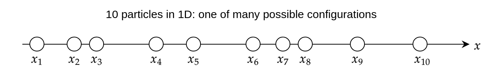
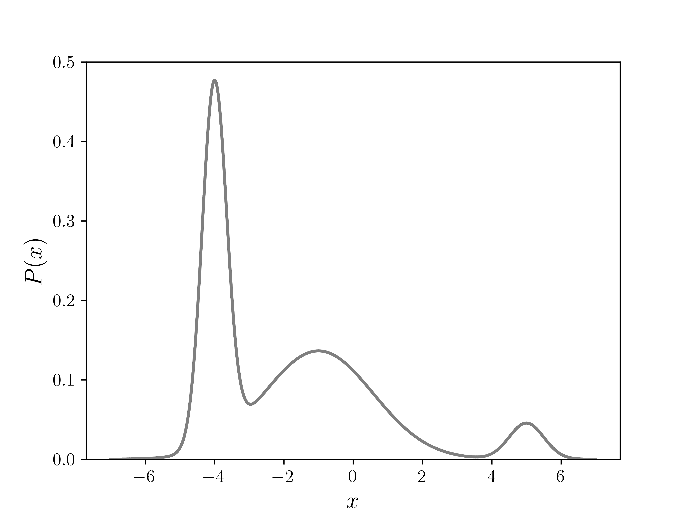
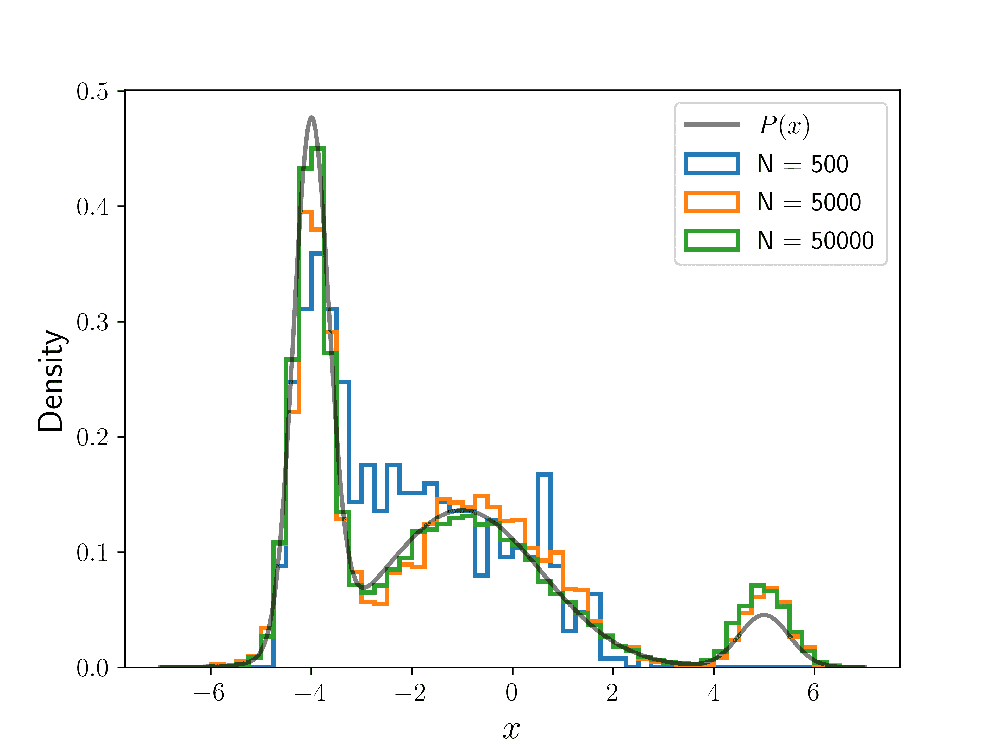

# 梅特罗波利斯算法

> 原文：[`www.algorithm-archive.org/contents/metropolis/metropolis.html`](https://www.algorithm-archive.org/contents/metropolis/metropolis.html)

蒙特卡洛积分 方法使用随机数来近似我们选择的任何形状的面积。梅特罗波利斯算法 [[1]](#cite-1) 是一种稍微更先进的蒙特卡洛方法，它使用随机数来近似一个 概率分布：

其中  是  的定义域，即  所有可能的值。  是一个与  成比例的函数，例如统计频率分布，它计算每个  发生的次数。分母中的积分是**归一化因子**，它确保所有概率之和为 1，即  一个一维的例子是**正态分布**，或**高斯分布**，其表达式为

在实践中，我们通常很容易知道 ，但分母中的积分可能相当难以计算，即使是数值计算。这尤其适用于坐标 () 是多维的情况，且  是一项昂贵的计算，正如以下示例所示。

## 一个应用示例

当考虑一个由  个粒子组成的物理系统时，一个复杂的概率函数的例子就会出现。这些可以是原子、分子，甚至是星系！对于这样的系统，我们通常可以描述系统的**势能** [[2]](#cite-2) 作为所有粒子坐标  的函数，

其中  是粒子  的空间坐标。所以总共有  个坐标，使得  是一个  维函数，这本身可能是一项计算密集型的任务。但不仅如此！

物理学家路德维希·玻尔兹曼 [[3]](#cite-3) 发现，当这样的系统在某个温度  下达到平衡时，你可以使用， [[4]](#cite-4) 来描述系统在任何一组坐标  的概率密度，

其中分子被称为**玻尔兹曼因子**，而  是 归一化常数，

我们现在可以看到，概率密度函数是一个复杂的计算，尤其是由于 。几乎总是， 中的积分没有解析解，数值积分也不可行。

为了说明  的计算不可行，想象一下只有  个粒子存在于一个 D 维世界中，被限制在一条线段上。



假设粒子之间存在相互作用，这意味着一个粒子的位置会影响另一个粒子的位置。例如，如果所有粒子都带电，那么它们会相互排斥或吸引。这意味着系统的能量是一个 D 函数，由于相互作用，它不可能进一步简化。因此，玻尔兹曼因子， ，也是一个 D 函数。要计算 ，我们需要对玻尔兹曼因子  进行 D 次积分，每次对应一个坐标，

在大多数情况下，上述积分没有已知的解析表达式，因此必须进行数值计算。为此，想象我们将 D 线段仅分成  个不同的区间，允许每个粒子占据  个不同的位置。这相当于将足球场的长度分成大约  米的区间——这不是你想要观看比赛的分辨率！即使具有如此低分辨率，不同位置组合的数量也是  ——一个巨大的数字。为了了解这个数字有多大，想象一下，在单个处理器上计算  只需要  纳秒，这比实际中大多数物理系统的能量计算要快得多。以这种速度，单个处理器计算  需要秒——这意味着即使所有处理器都在并行运行（可能有数十亿或数万亿个），计算  仍然需要比宇宙年龄更长的时间——多得多！

Metropolis 方法真正强大之处在于，你不需要知道概率函数本身。相反，你只需要一个与它成比例的函数。这对于玻尔兹曼分布意味着，你只需要知道这个项，

Metropolis 算法可以完全绕过 的计算，并使用 生成一个遵循概率密度 的分布。换句话说，它可以在这样的方式下采样 的值，使得采样的概率将遵循实际的分布 。因此，如果使用 Metropolis 从 中采样，那么 的出现次数将与 成正比。然后可以通过使用样本总数而不是进行积分来进行数值归一化。这一事实大大减少了近似概率分布所需的计算量。

最后，Metropolis 算法可以被修改或以其他方法实现，并成为许多高级采样算法的基础。最流行的大概是 Metropolis-Hastings 算法 [[5]](#cite-5)，其本质上是相同的。使用此方法的某些其他算法包括 Metropolis 调整的 Langevin 算法 [[6]](#cite-6) 和哈密顿蒙特卡洛 [[7]](#cite-7)，仅举几个例子。它们通常用于遵循玻尔兹曼分布的物理系统。

## 一维随机游走

在本章的剩余部分，我们将通过 D 个示例来了解 Metropolis 算法。尽管该算法在单维度上并不特别高效，但在单维度上理解它比在多维度上容易得多。Metropolis 算法与随机游走非常相似，所以让我们首先看看我们如何从一个随机游走中得到一个分布。

<res/animated_random_walk.mp4>

您的浏览器不支持视频标签。

上图中的点是一个“行走者”，其初始位置是 。步长 ，是在区间 中的一个随机数。要得到行走者的下一个位置，我们只需生成  并将其加到当前位置上。要从这个游走中得到  的分布，我们可以将域划分为离散的位置或“桶”，并计算行走者访问每个桶的频率。每次它访问一个桶，该桶的频率就增加一个。经过多次迭代，我们得到一个频率分布 。

## 带有接受准则的随机游走

Metropolis 算法的工作方式与随机游走类似，但在一个关键方面有所不同——在为行走者选择一个随机步之后，会根据函数 . 来决定是**接受**还是**拒绝**这个步。为了理解这是如何工作的，我们可以将步之前的位姿称为 ，步之后的位姿称为 。然后我们定义**接受步**的概率为

上面的函数意味着如果 ，这意味着如果移动是朝着更高概率的位置，那么它**总是**会被接受。否则，它将以概率 被接受。如果我们为某个任意的目标函数 创建这个游走的直方图，我们可以从下面的图中看到，经过多次迭代后，频率开始看起来非常像它！

<res/animated_metropolis.mp4>

您的浏览器不支持视频标签。

虽然最终会发生收敛，但分布的并非所有部分都能快速收敛。从上面的动画中可以看出，行走者很快就会复制左侧两个峰的分布，但要达到右侧的第三个峰则需要相当长的时间。这是因为第三个峰和第二个峰之间有一个很长的低概率区域，充当了一个“屏障”。这不一定是一件坏事——有时人们可能想要估计某物从一种状态转换到另一种状态需要多长时间，而且这些峰通常代表这样的“状态”。因此，通过多次 Metropolis 运行进行平均可能会给出这些转换时间的估计。如果全局采样是目标，可以通过为行走者选择更大的步长来加快探索过程，例如，从区间  中选择步长  而不是 。 

## 一维示例的算法

现在让我们通过一些示例代码深入了解实际的算法！

### 初始设置

让我们的目标分布为

其中  是我们上面展示的相同函数，由

定义此函数的代码如下。

```
def f(x, normalize=False):
    '''
    Function proportional to target distribution, a sum of Gaussians.
    For testing, set normalize to True, to get target distribution exactly.
    '''
    # Gaussian heights, width parameters, and mean positions respectively:
    a = np.array([10., 3., 1.]).reshape(3, 1)
    b = np.array([ 4., 0.2, 2.]).reshape(3, 1)
    xs = np.array([-4., -1., 5.]).reshape(3, 1)

    if normalize:
        norm = (np.sqrt(np.pi) * (a / np.sqrt(b))).sum()
        a /= norm

    return (a * np.exp(-b * (x - xs)**2)).sum(axis=0) 
```

由于这是一个容易积分的函数，因此可以直接得到我们的目标分布 ，我们可以用它来验证 Metropolis 算法。下面图中的  显示了不同宽度、高度和重叠的三个不同峰。



接下来，我们定义行走的对称步长生成函数。正如随机游走示例中那样，我们将使用介于 和 之间的随机实数作为步长。

```
def g():
    '''Random step vector.'''
    return np.random.uniform(-1,1) 
```

然而，对于上述算法要有效， 可以是关于  的任何对称函数。例如，它可以是从离散列表中随机选择的数字，如 。它也可以是从对称连续分布中选择的数字，如高斯分布， 。在更高维的情况下，函数应该是球对称的，如多维高斯函数， 。无论你选择什么函数，至少要注意以下几点：

1.  如果函数 是离散的，你将只采样离散值。例如，如果 仅返回 或 ，中间没有其他值，你将只从初始点采样整数步长。

1.  平均步长真的很重要！小的步长意味着行走的粒子会更仔细地采样附近的区域，但会走得较慢，因此可能不擅长探索广阔的区域。另一方面，步长较大的行走在准确采样附近区域方面可能表现不佳——并且如果行走在高概率区域，被拒绝的可能性更高，因为大步长的接受率更为剧烈。步长对行走的效率的影响远非显而易见！

如何选择最优的  是一个独立的研究领域，这很大程度上取决于采样的目标。一些技术甚至使用“自适应”方法，其中  在线“训练”使用学习算法！这些方法和其他方法在参考文献 [[8]](#cite-8) 和参考文献 [[9]](#cite-9) 中讨论。在许多情况下，人们只是使用试错法，因为算法并不难实现。

在选择之后，我们几乎准备好迭代了。我们只需要选择 的域，以及从 的域中随机选择的初始点 （在 ）。

```
xmin, xmax = -10, 10
x0 = np.random.uniform(xmin, xmax) 
```

### 如何迭代

1.  生成新的提议位置。

1.  计算接受概率，

1.  以概率 接受提议，  如果你的编程语言没有内置的此方法，

    +   在区间内生成一个随机数。

    +   如果 ，则**接受**移动，并设置新位置， 。

    +   否则，**拒绝**移动，并将新位置设置为当前位置， 。

1.  增加 ，并从步骤 1 重复。

步骤 1 到 3 的代码如下：

```
def metropolis_iterate(x0, num_steps):
    '''Iterate metropolis algorithm for num_steps using iniital position x_0'''

    for n in range(num_steps):
        if n == 0:
            x = x0
        else:
            x = metropolis_step(x)
        yield x 
```

下面的图显示了运行算法不同迭代次数 () 的结果，初始位置相同。直方图已归一化，以便它们积分到 。我们可以看到，随着 的增加，向 的收敛。



## 示例代码

以下代码将所有内容整合在一起，并运行给定`num_steps`步数的 Metropolis 算法。算法访问的所有位置随后被写入一个文件，该文件可以稍后读取并输入到直方图或其他密度计算方案中。代码还包含了一些使用`test_metropolis_iterate`方法的算法测试。此测试将从生成数据创建一个归一化密度直方图，并将其与使用均方根偏差指标[[10]](#cite-10)进行比较。

```
import numpy as np

def f(x, normalize=False):
    '''
    Function proportional to target distribution, a sum of Gaussians.
    For testing, set normalize to True, to get target distribution exactly.
    '''
    # Gaussian heights, width parameters, and mean positions respectively:
    a = np.array([10., 3., 1.]).reshape(3, 1)
    b = np.array([ 4., 0.2, 2.]).reshape(3, 1)
    xs = np.array([-4., -1., 5.]).reshape(3, 1)

    if normalize:
        norm = (np.sqrt(np.pi) * (a / np.sqrt(b))).sum()
        a /= norm

    return (a * np.exp(-b * (x - xs)**2)).sum(axis=0)

def g():
    '''Random step vector.'''
    return np.random.uniform(-1,1)

def metropolis_step(x, f=f, g=g):
    '''Perform one full iteration and return new position.'''

    x_proposed = x + g()
    a = min(1, (f(x_proposed) / f(x)).item())

    x_new = np.random.choice([x_proposed, x], p=[a, 1-a])

    return x_new

def metropolis_iterate(x0, num_steps):
    '''Iterate metropolis algorithm for num_steps using iniital position x_0'''

    for n in range(num_steps):
        if n == 0:
            x = x0
        else:
            x = metropolis_step(x)
        yield x

def test_metropolis_iterate(num_steps, xmin, xmax, x0):
    '''
    Calculate error in normalized density histogram of data  
    generated by metropolis_iterate() by using 
    normalized-root-mean-square-deviation metric. 
    '''

    bin_width = 0.25
    bins = np.arange(xmin, xmax + bin_width/2, bin_width)
    centers = np.arange(xmin + bin_width/2, xmax, bin_width)

    true_values = f(centers, normalize=True)
    mean_value = np.mean(true_values - min(true_values))

    x_dat = list(metropolis_iterate(x0, num_steps))
    heights, _ = np.histogram(x_dat, bins=bins, density=True)

    nmsd = np.average((heights - true_values)**2 / mean_value)
    nrmsd = np.sqrt(nmsd)

    return nrmsd

if __name__ == "__main__":
    xmin, xmax = -10, 10
    x0 = np.random.uniform(xmin, xmax)

    num_steps = 50_000

    x_dat = list(metropolis_iterate(x0, 50_000))

    # Write data to file
    output_string = "\n".join(str(x) for x in x_dat)

    with open("output.dat", "w") as out:
        out.write(output_string)
        out.write("\n")

    # Testing
    print(f"Testing with x0 = {x0:5.2f}")
    print(f"{'num_steps':>10s}  {'NRMSD':10s}")
    for num_steps in (500, 5_000, 50_000):
        nrmsd = test_metropolis_iterate(num_steps, xmin, xmax, x0)
        print(f"{num_steps:10d}  {nrmsd:5.1%}") 
```

### 参考文献列表

1.Metropolis, Nicholas *et al.*, [快速计算机器的态方程计算](https://doi.org/10.1063/1.1699114

), 1953.2.[维基百科：势能](https://en.wikipedia.org/wiki/Potential_energy), 2021.3.[维基百科：路德维希·玻尔兹曼](https://en.wikipedia.org/wiki/Ludwig_Boltzmann), 2021.4.[维基百科：玻尔兹曼分布](https://en.wikipedia.org/wiki/Boltzmann_distribution), 2021.5.Hastings, W. K., [使用马尔可夫链的蒙特卡洛采样方法和它们的用途](https://doi.org/10.1093/biomet/57.1.97), 1970.6.[维基百科：Metropolis 调整的 Langevin 算法](https://en.wikipedia.org/wiki/Metropolis-adjusted_Langevin_algorithm), 2021.7.[维基百科：哈密顿量蒙特卡洛](https://en.wikipedia.org/wiki/Hamiltonian_Monte_Carlo), 2021.8.Rosenthal, Jeffrey S and others, Optimal proposal distributions and adaptive MCMC, *Chapman & Hall/CRC Boca Raton, FL*, 2011.9.Gareth O. Roberts and Jeffrey S. Rosenthal, [各种 Metropolis-Hastings 算法的最优缩放](https://doi.org/10.1214/ss/1015346320), *Institute of Mathematical Statistics*, 2001.10.[维基百科：均方根偏差](https://en.wikipedia.org/wiki/Root-mean-square_deviation), 2021.

## 许可证

##### 代码示例

代码示例受 MIT 许可协议（位于[LICENSE.md](https://github.com/algorithm-archivists/algorithm-archive/blob/master/LICENSE.md)）许可。

##### 图片/图形

+   动画"动画随机游走"由[K. Shudipto Amin](https://github.com/shudipto-amin)创建，并授权于[Creative Commons Attribution-ShareAlike 4.0 国际许可协议](https://creativecommons.org/licenses/by-sa/4.0/legalcode)。

+   动画"动画 Metropolis"由[K. Shudipto Amin](https://github.com/shudipto-amin)创建，并授权于[Creative Commons Attribution-ShareAlike 4.0 国际许可协议](https://creativecommons.org/licenses/by-sa/4.0/legalcode)。

+   图片"P(x)的图"由[K. Shudipto Amin](https://github.com/shudipto-amin)创建，并授权于[Creative Commons Attribution-ShareAlike 4.0 国际许可协议](https://creativecommons.org/licenses/by-sa/4.0/legalcode)。

+   图片“多个直方图”由[K. Shudipto Amin](https://github.com/shudipto-amin)创建，并授权于[Creative Commons Attribution-ShareAlike 4.0 国际许可协议](https://creativecommons.org/licenses/by-sa/4.0/legalcode)。

##### 文本

本章的文本由[K. Shudipto Amin](https://github.com/shudipto-amin)编写，并授权于[Creative Commons Attribution-ShareAlike 4.0 国际许可协议](https://creativecommons.org/licenses/by-sa/4.0/legalcode)。

[]


##### 提交请求

在初始授权([#560](https://github.com/algorithm-archivists/algorithm-archive/pull/560))之后，以下提交请求已修改了本章的文本或图形：

+   无
