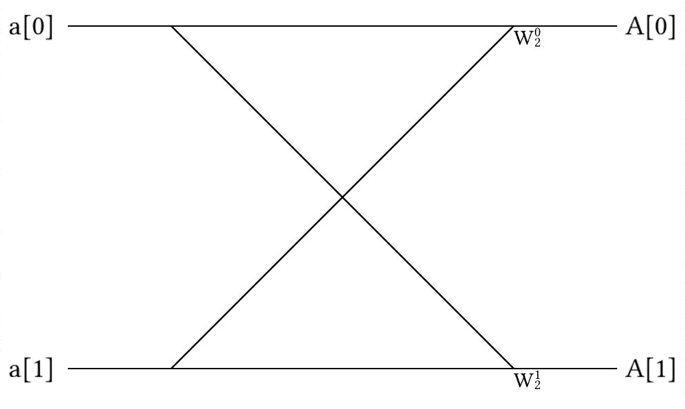
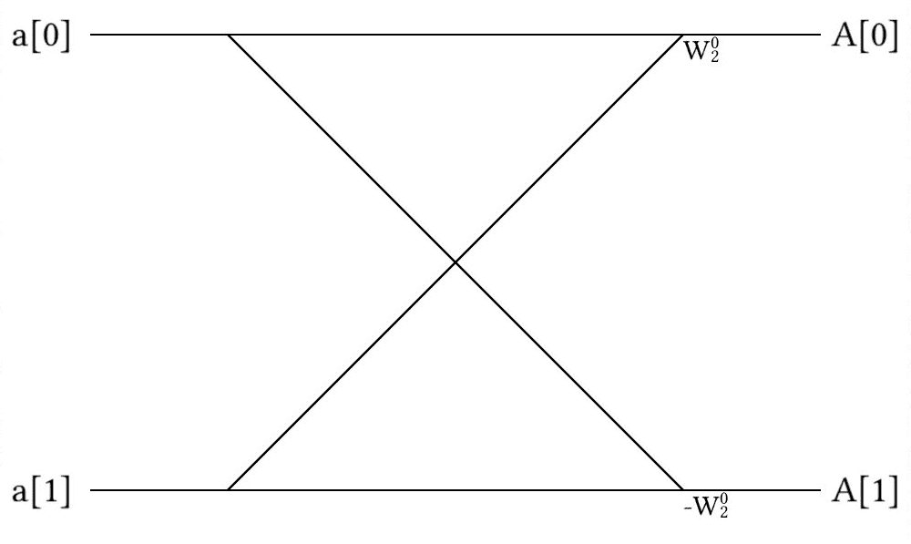
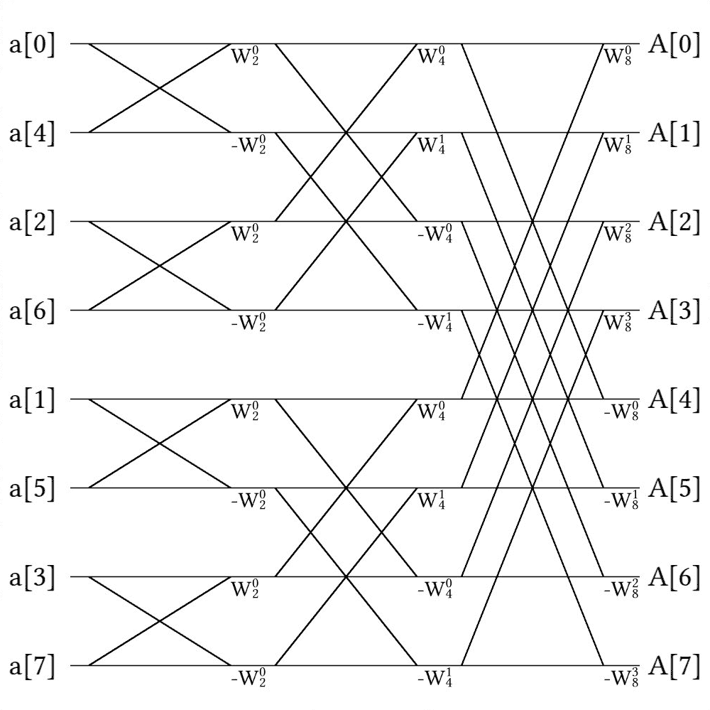
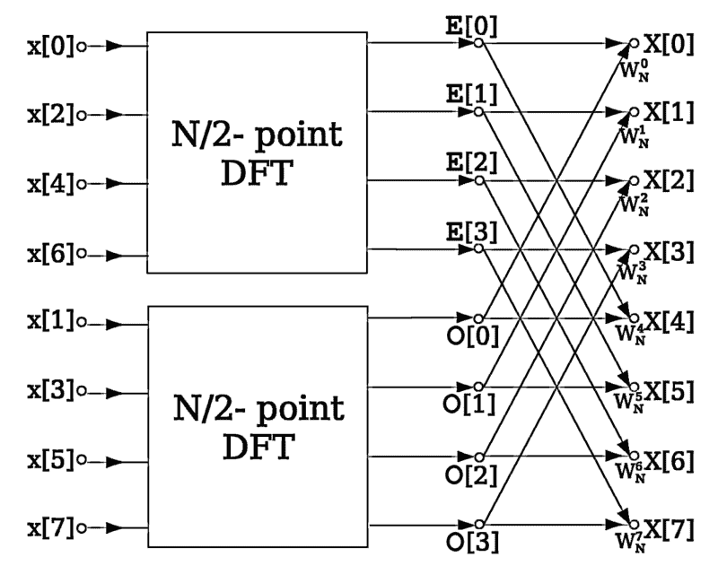

# 什么使得傅里叶变换变得快速？

> 原文：[`www.algorithm-archive.org/contents/cooley_tukey/cooley_tukey.html`](https://www.algorithm-archive.org/contents/cooley_tukey/cooley_tukey.html)

如果有一个算法能够通过使看似不可能的问题变得可能，从而彻底改变计算机科学和工程领域的格局，那么它就是快速傅里叶变换（FFT）。从表面上看，这个算法似乎只是递归的简单应用，在原则上，这正是它所做的事情；然而，傅里叶变换并非普通的变换——它允许研究人员和工程师轻松地在实空间和频谱空间之间来回跳跃，并且是许多物理和工程应用的核心。从计算超流体涡旋位置到超分辨率成像，傅里叶变换位于许多科学学科的核心，对于我们在本书后面将要讨论的许多算法至关重要。

简而言之，傅里叶变换是复数系统的一个美丽应用；然而，如果没有快速傅里叶变换的能力，今天很少会使用它，快速傅里叶变换最早由伟大的弗雷德里克·高斯在 1805 年提出，后来由詹姆斯·库利和约翰·图基在 1965 年独立发现 [[1]](#cite-1)。高斯（当然）已经有太多东西以他的名字命名了，而库利和图基的名字都更酷，所以今天 FFT 最常用的算法被称为库利-图基算法。

### 什么是傅里叶变换？

对于局外人来说，傅里叶变换看起来像是一团糟的数学——当然远非我描绘的两个领域之间的英雄门户；然而，就像大多数事情一样，它并没有最初看起来那么糟糕。所以，这就是它的全部辉煌！

和

其中  代表频谱空间中的函数，  代表频谱空间中的值，  代表实空间中的函数，  代表实空间中的值。请注意，这两个指数项之间的唯一区别是在变换到频谱空间时有一个负号。正如我提到的，这不是直观的语法，所以请允许我稍作解释。

首先，**傅里叶变换究竟做了什么？**

如果我们取一系列正弦函数的和（如  或 ），我们可能会在  之间发现一团复杂的波。每个组成波只能用唯一的一个值来描述： . 因此，我们不必像上面那样表示这些曲线，而可以描述为频谱空间中的峰值，如下所示。


这就是傅里叶变换所做的事情！执行变换后，现在要精确地理解我们的波形中包含哪些频率要容易得多，这对于大多数信号处理领域都是至关重要的。

现在，这与上面的变换有什么关系呢？最简单的方法是代入欧拉公式：

这显然将我们的频谱空间中的函数转换为：

并将我们的实空间函数转换为：

在这里，\(X\) 和 \(x\) 函数在公式中清晰地写出，所以看起来更加友好，对吧？这意味着实空间中的一个点是由其对应频率函数在整个空间上的积分乘以正弦振荡来定义的。

说实话，即使看到了这个数学公式，我仍然没有理解傅里叶变换。说实话，直到我将实空间和频率空间离散化以创建离散傅里叶变换（DFT），我才完全理解它，这是在代码中实现傅里叶变换的唯一方法。

### 什么是离散傅里叶变换？

从原则上讲，离散傅里叶变换（DFT）只是傅里叶变换，用求和代替积分：

和

在频率域和实空间中，\(X\) 和 \(x\) 分别是数字序列。原则上，这并不比之前的情况更容易理解！然而，不知何故，将代码应用于这种转换实际上帮助我弄清楚真正发生的事情。

```
function DFT(x)
    N = length(x)

    # We want two vectors here for real space (n) and frequency space (k)
    n = 0:N-1
    k = n'
    transform_matrix = exp.(-2im*pi*n*k/N)
    return transform_matrix*x

end 
```

```
void dft(double complex *X, const size_t N) {
    double complex tmp[N];
    for (size_t i = 0; i < N; ++i) {
        tmp[i] = 0;
        for (size_t j = 0; j < N; ++j) {
            tmp[i] += X[j] * cexp(-2.0 * M_PI * I * (double)j * (double)i / (double)N);
        }
    }

    memcpy(X, tmp, N * sizeof(*X));
} 
```

```
(defn dft
  "take a vector of real numbers and return a vector of frequency
  space"
  [vx]
  (let [len (count vx)]
     (matrix-mult
      (partition len
                 (for [n (range len)
                       k (range len)]
                   ;; expresion below is
                   ;; e^(n*k*2*pi*(1/len)*(-i))
                   (c/exp (c/* n k
                               2 Math/PI
                               (/ len)
                               (c/complex 0 -1)))))
      vx))) 
```

```
template <typename Iter>
void dft(Iter X, Iter last) {
  const auto N = last - X;
  std::vector<complex> tmp(N);
  for (auto i = 0; i < N; ++i) {
    for (auto j = 0; j < N; ++j) {
      tmp[i] += X[j] * exp(complex(0, -2.0 * M_PI * i * j / N));
    }
  }
  std::copy(std::begin(tmp), std::end(tmp), X);
} 
```

```
dft :: [Complex Double] -> [Complex Double]
dft x = matMult dftMat x
  where
    n = length x
    w = exp $ (-2) * pi * (0 :+ 1) / fromIntegral n
    dftMat = [[w ^ (j * k) | j <- [0 .. n - 1]] | k <- [0 .. n - 1]]
    matMult m x = map (sum . zipWith (*) x) m 
```

```
def dft(X):
    N = len(X)
    temp = [0] * N
    for i in range(N):
        for k in range(N):
            temp[i] += X[k] * exp(-2.0j * pi * i * k / N)
    return temp 
```

```
# rdi - array ptr
# rsi - array size
dft:
  push   rbx
  push   r12
  push   r13
  push   r14
  push   r15
  mov    r12, rdi                    # Save parameters
  mov    r13, rsi
  sub    rsp, r13                    # Make a double complex array
  xor    r14, r14                    # Set index to 0
dft_loop_i:
  cmp    r14, r13                    # Check if index is equal to array size
  je     dft_end_i
  lea    rax, [rsp + r14]            # Set tmp array to zero at r14
  mov    QWORD PTR [rax], 0
  mov    QWORD PTR [rax + 8], 0
  xor    r15, r15                    # Set second index to 0
dft_loop_j:
  cmp    r15, r13                    # Check if the index is equal to array size
  je     dft_end_j
  movsd  xmm1, two_pi                # Calculate xmm1 = -2pi * i * j / N
  mov    rax, r14
  imul   rax, r15
  shr    rax, 4
  cvtsi2sdq xmm2, rax
  mulsd  xmm1, xmm2
  cvtsi2sdq xmm2, r13
  divsd  xmm1, xmm2
  pxor   xmm0, xmm0                  # Set xmm0 to 0
  call   cexp
  lea    rax, [r12 + r15]            # Calculate X[i] * cexp(-2pi * i * j / N)
  movsd  xmm2, QWORD PTR [rax]
  movsd  xmm3, QWORD PTR [rax + 8]
  call   __muldc3
  lea    rax, [rsp + r14]
  movsd  xmm6, QWORD PTR [rax]       # Sum to tmp array
  movsd  xmm7, QWORD PTR [rax + 8]
  addsd  xmm6, xmm0
  addsd  xmm7, xmm1
  movsd  QWORD PTR [rax], xmm6       # Save to tmp array
  movsd  QWORD PTR [rax + 8], xmm7
  add    r15, 16
  jmp    dft_loop_j
dft_end_j:
  add    r14, 16
  jmp    dft_loop_i
dft_end_i:
  mov    rdi, r12                    # Move tmp array to array ptr
  mov    rsi, rsp
  mov    rdx, r13
  call   memcpy
  add    rsp, r13
  pop    r15
  pop    r14
  pop    r13
  pop    r12
  pop    rbx
  ret 
```

```
function dft(x) {
  const N = x.length;

  // Initialize an array with N elements, filled with 0s
  return Array(N)
    .fill(new Complex(0, 0))
    .map((temp, i) => {
      // Reduce x into the sum of x_k * exp(-2*sqrt(-1)*pi*i*k/N)
      return x.reduce((a, b, k) => {
        return a.add(b.mul(new Complex(0, (-2 * Math.PI * i * k) / N).exp()));
      }, new Complex(0, 0)); // Start accumulating from 0
    });
} 
```

```
fn dft(x: &[Complex<f64>]) -> Vec<Complex<f64>> {
    let n = x.len();
    (0..n)
        .map(|i| {
            (0..n)
                .map(|k| {
                    x[k] * (Complex::new(0.0_f64, -2.0_f64) * PI * (i as f64) * (k as f64)
                        / (n as f64))
                        .exp()
                })
                .sum()
        })
        .collect()
} 
```

```
(defun coefficient (time-index freq-index dft-len)
  "Calculates a single twiddle factor for the Fourier Transform."
  (exp (- (/ (* #c(0 1) 2.0 pi time-index freq-index)
             dft-len))))

(defun dft (data)
  "Performs the Discrete Fourier Transform"
  (let ((dft-len (length data)))
    (loop for freq-index from 0 below dft-len collect
      (loop for time-index from 0 below dft-len sum
        (* (coefficient time-index freq-index dft-len) (elt data time-index)))))) 
```

在这个函数中，我们定义 \(n\) 为从 \(0\) 到 \(N-1\) 的整数集，并将它们排列成列。然后我们将 \(k\) 设置为相同的东西，但按行排列。这意味着当我们相乘时，我们得到一个矩阵，但不是任何矩阵！这个矩阵是变换本身的核心！

```
M = [1.0+0.0im  1.0+0.0im           1.0+0.0im          1.0+0.0im;
     1.0+0.0im  6.12323e-17-1.0im  -1.0-1.22465e-16im -1.83697e-16+1.0im;
     1.0+0.0im -1.0-1.22465e-16im   1.0+2.44929e-16im -1.0-3.67394e-16im;
     1.0+0.0im -1.83697e-16+1.0im  -1.0-3.67394e-16im  5.51091e-16-1.0im] 
```

当我看到这个变换实际上是一个真正的变换矩阵时，这对我来说是令人惊讶的！话虽如此，离散傅里叶变换是慢的——主要是因为矩阵乘法慢，而且正如之前提到的，慢的代码并不特别有用。那么，大家从离散傅里叶变换到快速傅里叶变换（FFT）所使用的技巧是什么呢？

递归！

### 库利-图基算法

使用标准 DFT 的问题在于它需要大量的矩阵乘法和对所有元素的求和，这些操作过于复杂。库利-图基算法通过更少的求和和没有矩阵乘法直接计算 DFT。如果需要，DFTs 可以在 FFT 计算的早期阶段直接计算。库利-图基算法的技巧是递归。具体来说，我们将要执行 FFT 的矩阵分成两部分：一部分是所有偶数索引的元素，另一部分是所有奇数索引的元素。然后我们继续不断地将数组分割，直到我们有一个可以管理的数组大小来执行 DFT（或类似的 FFT）。我们还可以通过使用位反转方案执行类似的重新排序，其中我们输出每个数组索引的整数值的二进制表示，并将其翻转以找到该元素的新位置。通过递归，我们可以将复杂度降低到 \(O(N\log N)\)，这是一个可行的操作。

最后，代码看起来是这样的：

```
function cooley_tukey(x)
    N = length(x)

    if (N > 2)
        x_odd = cooley_tukey(x[1:2:N])
        x_even = cooley_tukey(x[2:2:N])
    else
        x_odd = x[1]
        x_even = x[2]
    end
    n = 0:N-1
    half = div(N,2)
    factor = exp.(-2im*pi*n/N)
    return vcat(x_odd .+ x_even .* factor[1:half],
                x_odd .- x_even .* factor[1:half])

end 
```

```
void cooley_tukey(double complex *X, const size_t N) {
    if (N >= 2) {
        double complex tmp [N / 2];
        for (size_t i = 0; i < N / 2; ++i) {
            tmp[i] = X[2*i + 1];
            X[i] = X[2*i];
        }
        for (size_t i = 0; i < N / 2; ++i) {
            X[i + N / 2] = tmp[i];
        }

        cooley_tukey(X, N / 2);
        cooley_tukey(X + N / 2, N / 2);

        for (size_t i = 0; i < N / 2; ++i) {
            X[i + N / 2] = X[i] - cexp(-2.0 * I * M_PI * (double)i / (double)N) * X[i + N / 2];
            X[i] -= (X[i + N / 2]-X[i]);
        }
    }
} 
```

```
(defn fft [vx]
  (let [len (count vx)]
    (if (= len 1)
      vx
      ;;else
      (let [;; take values of vx in the even indices
            even-indices (keep-indexed #(if (even? %1) %2) vx)
            ;; take values in the odd indices
            odd-indices (keep-indexed #(if (odd? %1) %2) vx)
            ;; recursion
            even-fft (fft even-indices)
            odd-fft (fft odd-indices)
            ;; make a sequence of e^(-2pi*i*k/N) where N is the length
            ;; vx and k range from 0 to N/2
            omegas-half (map
                         (comp c/exp
                               (partial c/*
                                        (/ len)
                                        2 Math/PI
                                        (c/complex 0 -1)))
                         (range 0 (quot len 2)))
            ;; take the negative of the first sequence because
            ;; e^(-2pi*i*(k+N/2)/N=-e^(-2pi*i*k/N) where k ranges from
            ;; 0 to N/2 
            omegas-2half (map c/- omegas-half)
            mult-add (partial map #(c/+ %3 (c/* %1 %2)))]
        (concat (mult-add omegas-half odd-fft even-fft)
                (mult-add omegas-2half odd-fft even-fft)))))) 
```

```
template <typename Iter>
void cooley_tukey(Iter first, Iter last) {
  auto size = last - first;
  if (size >= 2) {
    // split the range, with even indices going in the first half,
    // and odd indices going in the last half.
    auto temp = std::vector<complex>(size / 2);
    for (int i = 0; i < size / 2; ++i) {
      temp[i] = first[i * 2 + 1];
      first[i] = first[i * 2];
    }
    for (int i = 0; i < size / 2; ++i) {
      first[i + size / 2] = temp[i];
    }

    // recurse the splits and butterflies in each half of the range
    auto split = first + size / 2;
    cooley_tukey(first, split);
    cooley_tukey(split, last);

    // now combine each of those halves with the butterflies
    for (int k = 0; k < size / 2; ++k) {
      auto w = std::exp(complex(0, -2.0 * pi * k / static_cast<double>(size)));

      auto& bottom = first[k];
      auto& top = first[k + size / 2];
      top = bottom - w * top;
      bottom -= top - bottom;
    }
  }
} 
```

```
fft :: [Complex Double] -> [Complex Double]
fft x = fft' x
  where
    n = length x
    w0 = exp ((-2) * pi * (0 :+ 1) / fromIntegral n)
    w = M.fromList [(k % n, w0 ^ k) | k <- [0 .. n - 1]]
    fft' [x] = [x]
    fft' x =
      let (evens, odds) = partition (even . fst) $ zip [0 ..] x
          e = fft' $ map snd evens
          o = fft' $ map snd odds
          x1 = zipWith3 (\e o k -> e + o * w ! (k %n)) e o [0 ..]
          x2 = zipWith3 (\e o k -> e - o * w ! (k %n)) e o [0 ..]
       in x1 ++ x2 
```

```
def cooley_tukey(X):
    N = len(X)
    if N <= 1:
        return X
    even = cooley_tukey(X[0::2])
    odd = cooley_tukey(X[1::2])

    temp = [i for i in range(N)]
    for k in range(N // 2):
        temp[k] = even[k] + exp(-2.0j * pi * k / N) * odd[k]
        temp[k + N // 2] = even[k] - exp(-2.0j * pi * k / N) * odd[k]
    return temp 
```

```
# rdi - array ptr
# rsi - array size
cooley_tukey:
  cmp    rsi, 16                     # Check if size if greater then 1
  jle    cooley_tukey_return
  push   rbx
  push   r12
  push   r13
  push   r14
  push   r15
  mov    r12, rdi                    # Save parameters
  mov    r13, rsi
  mov    r14, rsi                    # Save N / 2
  shr    r14, 1
  sub    rsp, r14                    # Make a tmp array
  xor    r15, r15
  mov    rbx, r12
cooley_tukey_spliting:
  cmp    r15, r14
  je     cooley_tukey_split
  lea    rax, [r12 + 2 * r15]        # Moving all odd entries to the front of the array
  movaps xmm0, XMMWORD PTR [rax + 16]
  movaps xmm1, XMMWORD PTR [rax]
  movaps XMMWORD PTR [rsp + r15], xmm0
  movaps XMMWORD PTR [rbx], xmm1
  add    rbx, 16
  add    r15, 16
  jmp    cooley_tukey_spliting
cooley_tukey_split:
  mov    rax, rsp
  lea    rdi, [r12 + r13]
cooley_tukey_mov_data:
  cmp    rbx, rdi
  je     cooley_tukey_moved
  movaps xmm0, XMMWORD PTR [rax]
  movaps XMMWORD PTR [rbx], xmm0
  add    rbx, 16
  add    rax, 16
  jmp    cooley_tukey_mov_data
cooley_tukey_moved:
  add    rsp, r14
  mov    rdi, r12                   # Makking a recursive call
  mov    rsi, r14
  call   cooley_tukey
  lea    rdi, [r12 + r14]           # Makking a recursive call
  mov    rsi, r14
  call   cooley_tukey
  lea    rbx, [r12 + r14]
  mov    r14, rbx
  mov    r15, r12
cooley_tukey_loop:
  cmp    r15, rbx
  je     cooley_tukey_end
  pxor   xmm0, xmm0                 # Calculate cexp(-2.0 * I * M_PI * i / N)
  movsd  xmm1, two_pi
  mov    rax, r14
  sub    rax, rbx
  cvtsi2sdq xmm2, rax
  cvtsi2sdq xmm3, r13
  divsd  xmm2, xmm3
  mulsd  xmm1, xmm2
  call   cexp
  movq   xmm2, QWORD PTR [r14]      # Calculating X[i] - cexp() * X[i + N / 2]
  movq   xmm3, QWORD PTR [r14 + 8]
  call   __muldc3
  movq   xmm2, QWORD PTR [r15]
  movq   xmm3, QWORD PTR [r15 + 8]
  subsd  xmm2, xmm0
  subsd  xmm3, xmm1
  movq   QWORD PTR [r14], xmm2      # Save value in X[i + N / 2]
  movq   QWORD PTR [r14 + 8], xmm3
  movq   xmm0, QWORD PTR [r15]      # Calculating X[i] -= X[i + N / 2] - X[i]
  movq   xmm1, QWORD PTR [r15 + 8]
  subsd  xmm2, xmm0
  subsd  xmm3, xmm1
  subsd  xmm0, xmm2
  subsd  xmm1, xmm3
  movq   QWORD PTR [r15], xmm0
  movq   QWORD PTR [r15 + 8], xmm1
  add    r14, 16
  add    r15, 16
  jmp    cooley_tukey_loop
cooley_tukey_end:
  pop    r15
  pop    r14
  pop    r13
  pop    r12
  pop    rbx
cooley_tukey_return:
  ret 
```

```
function cooley_tukey(x) {
  const N = x.length;
  const half = Math.floor(N / 2);
  if (N <= 1) {
    return x;
  }

  // Extract even and odd indexed elements with remainder mod 2
  const evens = cooley_tukey(x.filter((_, idx) => !(idx % 2)));
  const odds = cooley_tukey(x.filter((_, idx) => idx % 2));

  // Fill an array with null values
  let temp = Array(N).fill(null);

  for (let i = 0; i < half; i++) {
    const arg = odds[i].mul(new Complex(0, (-2 * Math.PI * i) / N).exp());

    temp[i] = evens[i].add(arg);
    temp[i + half] = evens[i].sub(arg);
  }

  return temp;
} 
```

```
fn cooley_tukey(x: &[Complex<f64>]) -> Vec<Complex<f64>> {
    let n = x.len();
    if n <= 1 {
        return x.to_owned();
    }
    let even = cooley_tukey(&x.iter().step_by(2).cloned().collect::<Vec<_>>());
    let odd = cooley_tukey(&x.iter().skip(1).step_by(2).cloned().collect::<Vec<_>>());

    let mut temp = vec![Complex::new(0.0_f64, 0.0_f64); n];
    for k in 0..(n / 2) {
        temp[k] = even[k]
            + (Complex::new(0.0_f64, -2.0_f64) * PI * (k as f64) / (n as f64)).exp() * odd[k];
        temp[k + n / 2] = even[k]
            - (Complex::new(0.0_f64, -2.0_f64) * PI * (k as f64) / (n as f64)).exp() * odd[k];
    }
    temp
} 
```

```
(defun merge-sub-ffts (evens odds)
  "Combines the FFTs of the even and odd indices."
  (let* ((fft-length (+ (length evens) (length odds)))
         ;; Calculate coefficients for the odd indices.
         (twiddle-factors (loop for i from 0 below (length odds)
                             collect (coefficient 1.0 i fft-length)))
         ;; Multiply values with coefficients.
         (odd-terms (mapcar #'* odds twiddle-factors)))
    ;; Combine the two FFTs.
    (concatenate 'list 
                 (mapcar #'+ evens odd-terms)
                 (mapcar #'- evens odd-terms))))

(defun cooley-tukey-rec (data)
  "Performs the Fourier Transform using the recursive Cooley-Tukey method."
  (if (<= (length data) 1)
      data
      (loop
        for i from 0 below (length data)
        ;; Split even and odd indexed elements into two seperate lists.
        if (evenp i)
          collect (elt data i) into evens
        else
          collect (elt data i) into odds
        finally
          ;; Calculate the Fourier Transform for the two smaller lists and
          ;; combine them into the Fourier Transform of the full input.
          (return (merge-sub-ffts (cooley-tukey-rec evens)
                                  (cooley-tukey-rec odds)))))) 
```

作为旁注，我们强制要求数组必须是 2 的幂，这样操作才能工作。这是使用递归并且每次都将数组分成两半的事实上的限制；然而，如果你的数组不是 2 的幂，你可以简单地用 0 填充剩余的空间，直到你的数组是 2 的幂。

上述方法是完全有效的快速傅里叶变换（FFT）；然而，它缺少库利-图基算法的图像核心和灵魂：蝴蝶图。

### 蝴蝶图

蝴蝶图显示了在 FFT 之前、期间和之后数组中每个元素的位置。如前所述，FFT 必须执行 DFT。这意味着尽管我们需要小心地将元素相加，但我们最终还是要执行以下操作：

然而，在打乱初始数组（通过位反转或递归细分）之后，我们将在各个部分中执行项的矩阵乘法。基本上，我们将数组拆分为一系列的欧米茄值：

在每一步，我们使用适当的项。例如，想象我们需要对一个仅包含 2 个元素的数组执行 FFT。我们可以用以下（基数-2）蝴蝶来表示这个加法：



这里，图表示以下内容：

然而，结果证明，我们的值数组的后半部分总是前半部分的负数，所以，所以我们可以使用以下蝴蝶图：



使用以下方程：

通过这种方式交换第二个值，我们可以节省大量的空间。现在想象我们需要组合更多的元素。在这种情况下，我们开始使用简单的蝴蝶，如上图所示，然后求蝴蝶的蝴蝶。例如，如果我们有 8 个元素，这可能会看起来像这样：



注意，如果我们想在使用蝴蝶之前直接执行 DFT，我们必须小心地打乱我们的数组。在上一节提供的代码片段中，细分是在与连接相同的函数中执行的，因此排序始终是正确的；然而，如果我们使用位反转重新排序，这可能就不是这样了。

例如，看看 FFT 的排序（在维基百科上找到的[蝴蝶图](https://en.wikipedia.org/wiki/Butterfly_diagram)）以执行 DFT 快捷方式：



在这里，数组的排序只是简单地分为偶数和奇数元素一次，但它们没有再次递归地分割偶数和奇数元素的数组，因为它们知道不久之后将执行 DFT。

现在，关于傅里叶变换我想说的就这些了，但这一章仍然需要大量的工作！我肯定会回来继续这个话题，所以请告诉我你喜欢什么，不喜欢什么，我们可以从这里开始！

### 参考文献

1. Cooley, James W 和 Tukey, John W，用于机器计算复数傅里叶级数的算法，*JSTOR*，1965 年。

## 示例代码

为了明确起见，这次示例代码将会比较复杂，需要以下功能：

+   一个 FFT 库（内置的或类似 FFTW 的）

+   一个近似函数，用于判断两个数组是否相似

如文中所述，Cooley-Tukey 算法可以递归或非递归实现，其中递归方法更容易实现。我要求你实现递归或非递归方法（如果你愿意，也可以两者都实现）。如果你想要编写的实现语言已经存在，请将你的代码添加到现有的代码库中。和之前一样，优先考虑 pull requests。

注意：我使用 Julia 实现了这个算法，因为 Julia 中的代码看起来更直接；然而，如果你希望编写更好的 Julia 代码或你自己的语言的代码，请随意这样做！**我并不声称这是实现 Cooley-Tukey 方法的最高效方式，所以如果你有更好的实现方式，请随意实现！**

```
using FFTW

#simple DFT function
function DFT(x)
    N = length(x)

    # We want two vectors here for real space (n) and frequency space (k)
    n = 0:N-1
    k = n'
    transform_matrix = exp.(-2im*pi*n*k/N)
    return transform_matrix*x

end

# Implementing the Cooley-Tukey Algorithm
function cooley_tukey(x)
    N = length(x)

    if (N > 2)
        x_odd = cooley_tukey(x[1:2:N])
        x_even = cooley_tukey(x[2:2:N])
    else
        x_odd = x[1]
        x_even = x[2]
    end
    n = 0:N-1
    half = div(N,2)
    factor = exp.(-2im*pi*n/N)
    return vcat(x_odd .+ x_even .* factor[1:half],
                x_odd .- x_even .* factor[1:half])

end

function bitreverse(a::Array)
    # First, we need to find the necessary number of bits
    digits = convert(Int,ceil(log2(length(a))))

    indices = [i for i = 0:length(a)-1]

    bit_indices = []
    for i = 1:length(indices)
        push!(bit_indices, bitstring(indices[i]))
    end

    # Now stripping the unnecessary numbers
    for i = 1:length(bit_indices)
        bit_indices[i] = bit_indices[i][end-digits:end]
    end

    # Flipping the bits
    for i =1:length(bit_indices)
        bit_indices[i] = reverse(bit_indices[i])
    end

    # Replacing indices
    for i = 1:length(indices)
        indices[i] = 0
        for j = 1:digits
            indices[i] += 2^(j-1) * parse(Int, string(bit_indices[i][end-j]))
        end
       indices[i] += 1
    end

    b = [float(i) for i = 1:length(a)]
    for i = 1:length(indices)
        b[i] = a[indices[i]]
    end

    return b
end

function iterative_cooley_tukey(x)
    N = length(x)
    logN = convert(Int,ceil(log2(length(x))))
    bnum = div(N,2)
    stride = 0;

    x = bitreverse(x)

    z = [Complex(x[i]) for i = 1:length(x)]
    for i = 1:logN
       stride = div(N, bnum)
       for j = 0:bnum-1
           start_index = j*stride + 1
           y = butterfly(z[start_index:start_index + stride - 1])
           for k = 1:length(y)
               z[start_index+k-1] = y[k]
           end
       end
       bnum = div(bnum,2)
    end

    return z
end

function butterfly(x)
    N = length(x)
    half = div(N,2)
    n = [i for i = 0:N-1]
    half = div(N,2)
    factor = exp.(-2im*pi*n/N)

    y = [0 + 0.0im for i = 1:length(x)]

    for i = 1:half
        y[i] = x[i] + x[half+i]*factor[i]
        y[half+i] = x[i] - x[half+i]*factor[i]
    end

    return y
end

function main()
    x = rand(128)
    y = cooley_tukey(x)
    z = iterative_cooley_tukey(x)
    w = fft(x)
    if(isapprox(y, w))
        println("Recursive Cooley Tukey matches fft() from FFTW package.")
    end
    if(isapprox(z, w))
        println("Iterative Cooley Tukey matches fft() from FFTW package.")
    end
end

main() 
```

```
#include <complex.h>
#include <math.h>
#include <stdio.h>
#include <stdlib.h>
#include <string.h>
#include <time.h>
#include <fftw3.h>

void fft(double complex *x, size_t n) {
    double complex y[n];
    memset(y, 0, sizeof(y));
    fftw_plan p;

    p = fftw_plan_dft_1d((int)n, (fftw_complex*)x, (fftw_complex*)y,
                         FFTW_FORWARD, FFTW_ESTIMATE);

    fftw_execute(p);
    fftw_destroy_plan(p);

    for (size_t i = 0; i < n; ++i) {
        x[i] = y[i] / sqrt((double)n);
    }
}

void dft(double complex *X, const size_t N) {
    double complex tmp[N];
    for (size_t i = 0; i < N; ++i) {
        tmp[i] = 0;
        for (size_t j = 0; j < N; ++j) {
            tmp[i] += X[j] * cexp(-2.0 * M_PI * I * (double)j * (double)i / (double)N);
        }
    }

    memcpy(X, tmp, N * sizeof(*X));
}

void cooley_tukey(double complex *X, const size_t N) {
    if (N >= 2) {
        double complex tmp [N / 2];
        for (size_t i = 0; i < N / 2; ++i) {
            tmp[i] = X[2*i + 1];
            X[i] = X[2*i];
        }
        for (size_t i = 0; i < N / 2; ++i) {
            X[i + N / 2] = tmp[i];
        }

        cooley_tukey(X, N / 2);
        cooley_tukey(X + N / 2, N / 2);

        for (size_t i = 0; i < N / 2; ++i) {
            X[i + N / 2] = X[i] - cexp(-2.0 * I * M_PI * (double)i / (double)N) * X[i + N / 2];
            X[i] -= (X[i + N / 2]-X[i]);
        }
    }
}

void bit_reverse(double complex *X, size_t N) {
    for (size_t i = 0; i < N; ++i) {
        size_t n = i;
        size_t a = i;
        int count = (int)log2((double)N) - 1;

        n >>= 1;
        while (n > 0) {
            a = (a << 1) | (n & 1);
            count--;
            n >>= 1;
        }
        n = (a << count) & (size_t)((1 << (size_t)log2((double)N)) - 1);

        if (n > i) {
            double complex tmp = X[i];
            X[i] = X[n];
            X[n] = tmp;
        }
    }
}

void iterative_cooley_tukey(double complex *X, size_t N) {
    bit_reverse(X, N);

    for (int i = 1; i <= log2((double)N); ++i) {
        size_t stride = (size_t)pow(2, i);
        double complex w = cexp(-2.0 * I * M_PI / (double)stride);
        for (size_t j = 0; j < N; j += stride) {
            double complex v = 1.0;
            for (size_t k = 0; k < stride / 2; ++k) {
                X[k + j + stride / 2] = X[k + j] - v * X[k + j + stride / 2];
                X[k + j] -= (X[k + j + stride / 2] - X[k + j]);
                v *= w;
            }
        }
    }
}

void approx(double complex *X, double complex *Y, size_t N) {
    for (size_t i = 0; i < N; ++i) {
        if (cabs(X[i]) - cabs(Y[i]) > 1E-5) {
            printf("This is not approximate.\n");
            return;
        }
    }
    printf("This is approximate.\n");
}

int main() {
    srand((unsigned int)time(NULL));
    double complex x[64], y[64], z[64];
    for (size_t i = 0; i < 64; ++i) {
        x[i] = rand() / (double) RAND_MAX;
        y[i] = x[i];
        z[i] = x[i];
    }

    fft(x, 64);
    cooley_tukey(y, 64);
    iterative_cooley_tukey(z, 64);

    approx(x, y, 64);
    approx(x, z, 64);

    return 0;
} 
```

```
(ns fft.core
  (:require [complex.core :as c]))
;; complex is a jar for complex numbers
;; https://github.com/alanforr/complex
;; add [complex "0.1.11"] to :dependencies in your project.clj
;; and run lein repl or lein deps in the terminal
(defn matrix-mult
  "take a matrix m and a vector v which length is number of columns
  ,return a vector of applying dot-product between v and each row of
  m. the returned vector's length is the number of rows of m"
  [m v]
  (mapv (comp (partial apply c/+)
              (partial map c/* v))
        m))
(defn dft
  "take a vector of real numbers and return a vector of frequency
  space"
  [vx]
  (let [len (count vx)]
     (matrix-mult
      (partition len
                 (for [n (range len)
                       k (range len)]
                   ;; expresion below is
                   ;; e^(n*k*2*pi*(1/len)*(-i))
                   (c/exp (c/* n k
                               2 Math/PI
                               (/ len)
                               (c/complex 0 -1)))))
      vx)))
(defn fft [vx]
  (let [len (count vx)]
    (if (= len 1)
      vx
      ;;else
      (let [;; take values of vx in the even indices
            even-indices (keep-indexed #(if (even? %1) %2) vx)
            ;; take values in the odd indices
            odd-indices (keep-indexed #(if (odd? %1) %2) vx)
            ;; recursion
            even-fft (fft even-indices)
            odd-fft (fft odd-indices)
            ;; make a sequence of e^(-2pi*i*k/N) where N is the length
            ;; vx and k range from 0 to N/2
            omegas-half (map
                         (comp c/exp
                               (partial c/*
                                        (/ len)
                                        2 Math/PI
                                        (c/complex 0 -1)))
                         (range 0 (quot len 2)))
            ;; take the negative of the first sequence because
            ;; e^(-2pi*i*(k+N/2)/N=-e^(-2pi*i*k/N) where k ranges from
            ;; 0 to N/2 
            omegas-2half (map c/- omegas-half)
            mult-add (partial map #(c/+ %3 (c/* %1 %2)))]
        (concat (mult-add omegas-half odd-fft even-fft)
                (mult-add omegas-2half odd-fft even-fft))))))
(defn -main [& args]
    (let [vx [0 1 2 3]
          len (count vx)
          ;; calculate the next power of 2 after len
          ;; the reason behind this is to fill them with zeros for fft
          next-len (->>
                    [len 2]
                    (map #(Math/log %))
                    (apply /)
                    Math/ceil
                    (Math/pow 2)
                    int)
          ;; add zeros at the end of vx
          complete-vx (into vx (repeat (- next-len len) 0))
          fft-cvx (fft complete-vx)
          dft-cvx (dft complete-vx)
          diffv (mapv c/- fft-cvx dft-cvx)]
    (println "vx:" vx)
    (println "complete-vx:" complete-vx)
    (println "result from fft:" (map c/stringify fft-cvx))
    (println "result from dft:" (map c/stringify dft-cvx))
    (println "difference: " (map c/stringify diffv)))) 
```

```
// written by Gathros, modernized by Nicole Mazzuca.

#include <algorithm>
#include <array>
#include <complex>
#include <cstdint>
#include <vector>

// These headers are for presentation not for the algorithm.
#include <iomanip>
#include <iostream>
#include <random>

using std::begin;
using std::end;
using std::swap;

using std::size_t;

using complex = std::complex<double>;
static const double pi = 3.14159265358979323846264338327950288419716;

template <typename Iter>
void dft(Iter X, Iter last) {
  const auto N = last - X;
  std::vector<complex> tmp(N);
  for (auto i = 0; i < N; ++i) {
    for (auto j = 0; j < N; ++j) {
      tmp[i] += X[j] * exp(complex(0, -2.0 * M_PI * i * j / N));
    }
  }
  std::copy(std::begin(tmp), std::end(tmp), X);
}

// `cooley_tukey` does the cooley-tukey algorithm, recursively
template <typename Iter>
void cooley_tukey(Iter first, Iter last) {
  auto size = last - first;
  if (size >= 2) {
    // split the range, with even indices going in the first half,
    // and odd indices going in the last half.
    auto temp = std::vector<complex>(size / 2);
    for (int i = 0; i < size / 2; ++i) {
      temp[i] = first[i * 2 + 1];
      first[i] = first[i * 2];
    }
    for (int i = 0; i < size / 2; ++i) {
      first[i + size / 2] = temp[i];
    }

    // recurse the splits and butterflies in each half of the range
    auto split = first + size / 2;
    cooley_tukey(first, split);
    cooley_tukey(split, last);

    // now combine each of those halves with the butterflies
    for (int k = 0; k < size / 2; ++k) {
      auto w = std::exp(complex(0, -2.0 * pi * k / static_cast<double>(size)));

      auto& bottom = first[k];
      auto& top = first[k + size / 2];
      top = bottom - w * top;
      bottom -= top - bottom;
    }
  }
}

// note: (last - first) must be less than 2**32 - 1
template <typename Iter>
void sort_by_bit_reverse(Iter first, Iter last) {
  // sorts the range [first, last) in bit-reversed order,
  // by the method suggested by the FFT
  auto size = last - first;

  for (std::uint32_t i = 0; i < size; ++i) {
    auto b = i;
    b = (((b & 0xaaaaaaaa) >> 1) | ((b & 0x55555555) << 1));
    b = (((b & 0xcccccccc) >> 2) | ((b & 0x33333333) << 2));
    b = (((b & 0xf0f0f0f0) >> 4) | ((b & 0x0f0f0f0f) << 4));
    b = (((b & 0xff00ff00) >> 8) | ((b & 0x00ff00ff) << 8));
    b = ((b >> 16) | (b << 16)) >> (32 - std::uint32_t(log2(static_cast<double>(size))));
    if (b > i) {
      swap(first[b], first[i]);
    }
  }
}

// `iterative_cooley_tukey` does the cooley-tukey algorithm iteratively
template <typename Iter>
void iterative_cooley_tukey(Iter first, Iter last) {
  sort_by_bit_reverse(first, last);

  // perform the butterfly on the range
  auto size = last - first;
  for (int stride = 2; stride <= size; stride *= 2) {
    auto w = exp(complex(0, -2.0 * pi / stride));
    for (int j = 0; j < size; j += stride) {
      auto v = complex(1.0);
      for (int k = 0; k < stride / 2; k++) {
        first[k + j + stride / 2] =
            first[k + j] - v * first[k + j + stride / 2];
        first[k + j] -= (first[k + j + stride / 2] - first[k + j]);
        v *= w;
      }
    }
  }
}

int main() {
  // initalize the FFT inputs
  std::random_device random_device;
  std::mt19937 rng(random_device());
  std::uniform_real_distribution<double> distribution(0.0, 1.0);

  std::array<complex, 64> initial;
  std::generate(
      begin(initial), end(initial), [&] { return distribution(rng); });

  auto recursive = initial;
  auto iterative = initial;

  // Preform an FFT on the arrays.
  cooley_tukey(begin(recursive), end(recursive));
  iterative_cooley_tukey(begin(iterative), end(iterative));

  // Check if the arrays are approximately equivalent
  std::cout << std::right << std::setw(16) << "idx" << std::setw(16) << "rec"
            << std::setw(16) << "it" << std::setw(16) << "subtracted" << '\n';
  for (size_t i = 0; i < initial.size(); ++i) {
    auto rec = recursive[i];
    auto it = iterative[i];
    std::cout << std::setw(16) << i << std::setw(16) << std::abs(rec)
              << std::setw(16) << std::abs(it) << std::setw(16)
              << (std::abs(rec) - std::abs(it)) << '\n';
  }
} 
```

```
import Data.Complex
import Data.List (partition)
import Data.Map ((!))
import qualified Data.Map as M
import Data.Ratio

dft :: [Complex Double] -> [Complex Double]
dft x = matMult dftMat x
  where
    n = length x
    w = exp $ (-2) * pi * (0 :+ 1) / fromIntegral n
    dftMat = [[w ^ (j * k) | j <- [0 .. n - 1]] | k <- [0 .. n - 1]]
    matMult m x = map (sum . zipWith (*) x) m

fft :: [Complex Double] -> [Complex Double]
fft x = fft' x
  where
    n = length x
    w0 = exp ((-2) * pi * (0 :+ 1) / fromIntegral n)
    w = M.fromList [(k % n, w0 ^ k) | k <- [0 .. n - 1]]
    fft' [x] = [x]
    fft' x =
      let (evens, odds) = partition (even . fst) $ zip [0 ..] x
          e = fft' $ map snd evens
          o = fft' $ map snd odds
          x1 = zipWith3 (\e o k -> e + o * w ! (k %n)) e o [0 ..]
          x2 = zipWith3 (\e o k -> e - o * w ! (k %n)) e o [0 ..]
       in x1 ++ x2

main = do
  print $ dft [0, 1, 2, 3]
  print $ fft [0, 1, 2, 3] 
```

```
from random import random
from cmath import exp, pi
from math import log2

def dft(X):
    N = len(X)
    temp = [0] * N
    for i in range(N):
        for k in range(N):
            temp[i] += X[k] * exp(-2.0j * pi * i * k / N)
    return temp

def cooley_tukey(X):
    N = len(X)
    if N <= 1:
        return X
    even = cooley_tukey(X[0::2])
    odd = cooley_tukey(X[1::2])

    temp = [i for i in range(N)]
    for k in range(N // 2):
        temp[k] = even[k] + exp(-2.0j * pi * k / N) * odd[k]
        temp[k + N // 2] = even[k] - exp(-2.0j * pi * k / N) * odd[k]
    return temp

def bit_reverse(X):
    N = len(X)
    temp = [i for i in range(N)]
    for k in range(N):
        b = sum(1 << int(log2(N)) - 1 -
                i for i in range(int(log2(N))) if k >> i & 1)
        temp[k] = X[b]
        temp[b] = X[k]
    return temp

def iterative_cooley_tukey(X):
    N = len(X)

    X = bit_reverse(X)

    for i in range(1, int(log2(N)) + 1):
        stride = 2 ** i
        w = exp(-2.0j * pi / stride)
        for j in range(0, N, stride):
            v = 1
            for k in range(stride // 2):
                X[k + j + stride // 2] = X[k + j] - v * X[k + j + stride // 2]
                X[k + j] -= X[k + j + stride // 2] - X[k + j]
                v *= w
    return X

X = []

for i in range(64):
    X.append(random())

Y = cooley_tukey(X)
Z = iterative_cooley_tukey(X)
T = dft(X)

print(all(abs([Y[i] - Z[i] for i in range(64)][j]) < 1 for j in range(64)))
print(all(abs([Y[i] - T[i] for i in range(64)][j]) < 1 for j in range(64))) 
```

```
.intel_syntax noprefix

.section .rodata
  two:           .double 2.0
  one:           .double 1.0
  two_pi:        .double -6.28318530718
  rand_max:      .long 4290772992
                 .long 1105199103
  fmt:           .string "%g\n"

.section .text
  .global main
  .extern printf, memset, memcpy, srand, rand, time, cexp, __muldc3, cabs, log2

# rdi - array ptr
# rsi - array size
dft:
  push   rbx
  push   r12
  push   r13
  push   r14
  push   r15
  mov    r12, rdi                    # Save parameters
  mov    r13, rsi
  sub    rsp, r13                    # Make a double complex array
  xor    r14, r14                    # Set index to 0
dft_loop_i:
  cmp    r14, r13                    # Check if index is equal to array size
  je     dft_end_i
  lea    rax, [rsp + r14]            # Set tmp array to zero at r14
  mov    QWORD PTR [rax], 0
  mov    QWORD PTR [rax + 8], 0
  xor    r15, r15                    # Set second index to 0
dft_loop_j:
  cmp    r15, r13                    # Check if the index is equal to array size
  je     dft_end_j
  movsd  xmm1, two_pi                # Calculate xmm1 = -2pi * i * j / N
  mov    rax, r14
  imul   rax, r15
  shr    rax, 4
  cvtsi2sdq xmm2, rax
  mulsd  xmm1, xmm2
  cvtsi2sdq xmm2, r13
  divsd  xmm1, xmm2
  pxor   xmm0, xmm0                  # Set xmm0 to 0
  call   cexp
  lea    rax, [r12 + r15]            # Calculate X[i] * cexp(-2pi * i * j / N)
  movsd  xmm2, QWORD PTR [rax]
  movsd  xmm3, QWORD PTR [rax + 8]
  call   __muldc3
  lea    rax, [rsp + r14]
  movsd  xmm6, QWORD PTR [rax]       # Sum to tmp array
  movsd  xmm7, QWORD PTR [rax + 8]
  addsd  xmm6, xmm0
  addsd  xmm7, xmm1
  movsd  QWORD PTR [rax], xmm6       # Save to tmp array
  movsd  QWORD PTR [rax + 8], xmm7
  add    r15, 16
  jmp    dft_loop_j
dft_end_j:
  add    r14, 16
  jmp    dft_loop_i
dft_end_i:
  mov    rdi, r12                    # Move tmp array to array ptr
  mov    rsi, rsp
  mov    rdx, r13
  call   memcpy
  add    rsp, r13
  pop    r15
  pop    r14
  pop    r13
  pop    r12
  pop    rbx
  ret

# rdi - array ptr
# rsi - array size
cooley_tukey:
  cmp    rsi, 16                     # Check if size if greater then 1
  jle    cooley_tukey_return
  push   rbx
  push   r12
  push   r13
  push   r14
  push   r15
  mov    r12, rdi                    # Save parameters
  mov    r13, rsi
  mov    r14, rsi                    # Save N / 2
  shr    r14, 1
  sub    rsp, r14                    # Make a tmp array
  xor    r15, r15
  mov    rbx, r12
cooley_tukey_spliting:
  cmp    r15, r14
  je     cooley_tukey_split
  lea    rax, [r12 + 2 * r15]        # Moving all odd entries to the front of the array
  movaps xmm0, XMMWORD PTR [rax + 16]
  movaps xmm1, XMMWORD PTR [rax]
  movaps XMMWORD PTR [rsp + r15], xmm0
  movaps XMMWORD PTR [rbx], xmm1
  add    rbx, 16
  add    r15, 16
  jmp    cooley_tukey_spliting
cooley_tukey_split:
  mov    rax, rsp
  lea    rdi, [r12 + r13]
cooley_tukey_mov_data:
  cmp    rbx, rdi
  je     cooley_tukey_moved
  movaps xmm0, XMMWORD PTR [rax]
  movaps XMMWORD PTR [rbx], xmm0
  add    rbx, 16
  add    rax, 16
  jmp    cooley_tukey_mov_data
cooley_tukey_moved:
  add    rsp, r14
  mov    rdi, r12                   # Makking a recursive call
  mov    rsi, r14
  call   cooley_tukey
  lea    rdi, [r12 + r14]           # Makking a recursive call
  mov    rsi, r14
  call   cooley_tukey
  lea    rbx, [r12 + r14]
  mov    r14, rbx
  mov    r15, r12
cooley_tukey_loop:
  cmp    r15, rbx
  je     cooley_tukey_end
  pxor   xmm0, xmm0                 # Calculate cexp(-2.0 * I * M_PI * i / N)
  movsd  xmm1, two_pi
  mov    rax, r14
  sub    rax, rbx
  cvtsi2sdq xmm2, rax
  cvtsi2sdq xmm3, r13
  divsd  xmm2, xmm3
  mulsd  xmm1, xmm2
  call   cexp
  movq   xmm2, QWORD PTR [r14]      # Calculating X[i] - cexp() * X[i + N / 2]
  movq   xmm3, QWORD PTR [r14 + 8]
  call   __muldc3
  movq   xmm2, QWORD PTR [r15]
  movq   xmm3, QWORD PTR [r15 + 8]
  subsd  xmm2, xmm0
  subsd  xmm3, xmm1
  movq   QWORD PTR [r14], xmm2      # Save value in X[i + N / 2]
  movq   QWORD PTR [r14 + 8], xmm3
  movq   xmm0, QWORD PTR [r15]      # Calculating X[i] -= X[i + N / 2] - X[i]
  movq   xmm1, QWORD PTR [r15 + 8]
  subsd  xmm2, xmm0
  subsd  xmm3, xmm1
  subsd  xmm0, xmm2
  subsd  xmm1, xmm3
  movq   QWORD PTR [r15], xmm0
  movq   QWORD PTR [r15 + 8], xmm1
  add    r14, 16
  add    r15, 16
  jmp    cooley_tukey_loop
cooley_tukey_end:
  pop    r15
  pop    r14
  pop    r13
  pop    r12
  pop    rbx
cooley_tukey_return:
  ret

# rdi - array ptr
# rsi - array size
bit_reverse:
  push   rbx
  push   r12
  push   r13
  push   r14
  push   r15
  mov    r12, rdi                  # Save parameters
  mov    r13, rsi
  shr    r13, 4
  xor    r14, r14                  # Loop through all entries
bit_reverse_entries:
  cmp    r14, r13
  je     bit_reverse_return
  cvtsi2sdq xmm0, r13              # Calculating the number of bit in N
  call   log2
  cvttsd2si rcx, xmm0
  mov    rdi, 1                    # Calculating (1 << log2(N)) - 1
  sal    edi, cl
  sub    edi, 1
  sub    ecx, 1
  mov    rax, r14
  mov    r15, r14
bit_reverse_loop:
  sar    r15                       # Check if r15 is 0
  je     bit_reverse_reversed
  sal    rax, 1                    # Calculating (rax << 1) | (r15 & 1)
  mov    rsi, r15
  and    rsi, 1
  or     rax, rsi
  sub    ecx, 1                    # Decrement bit count
  jmp    bit_reverse_loop
bit_reverse_reversed:
  sal    eax, cl                   # Calculate (rax << rcx) & (1 << bit count)
  and    rax, rdi
  cmp    rax, r14                  # Check if rax is greater then r14
  jle    bit_reverse_no_swap       # If so then swap entries
  shl    rax, 4                    # Times index by 16 to get bytes to entry
  shl    r14, 4
  movaps xmm0, XMMWORD PTR [r12 + rax]
  movaps xmm1, XMMWORD PTR [r12 + r14]
  movaps XMMWORD PTR [r12 + rax], xmm1
  movaps XMMWORD PTR [r12 + r14], xmm0
  shr    r14, 4
bit_reverse_no_swap:
  add    r14, 1
  jmp    bit_reverse_entries
bit_reverse_return:
  pop    r15
  pop    r14
  pop    r13
  pop    r12
  pop    rbx
  ret

# rdi - array ptr
# rsi - array size
iterative_cooley_tukey:
  push   r12
  push   r13
  push   r14
  push   r15
  push   rbx
  sub    rsp, 48
  mov    r12, rdi
  mov    r13, rsi
  call   bit_reverse              # Bit reversing array
  sar    r13, 4                   # Calculate log2(N)
  cvtsi2sdq xmm0, r13
  call   log2
  cvttsd2si rax, xmm0
  mov    QWORD PTR [rsp], rax     # Save it to the stack
  mov    r14, 1
iter_ct_loop_i:
  cmp    r14, rax                 # Check if r14 is greater then log2(N)
  jg     iter_ct_end_i
  movsd  xmm0, two                # Calculate stride = 2^(r14)
  cvtsi2sdq xmm1, r14
  call   pow
  cvttsd2si r10, xmm0
  mov    QWORD PTR [rsp + 40], r10# move stride to stack
  movsd  xmm1, two_pi             # Calculating cexp(-2pi * I / stride)
  divsd  xmm1, xmm0
  pxor   xmm0, xmm0
  call   cexp
  movq   QWORD PTR [rsp + 8], xmm0  # Save it to stack
  movq   QWORD PTR [rsp + 16], xmm1
  xor    r15, r15
iter_ct_loop_j:
  cmp    r15, r13                 # Check if r15 is less then array size
  je     iter_ct_end_j
  movsd  xmm4, one                # Save 1 + 0i to stack
  pxor   xmm5, xmm5
  movsd  QWORD PTR [rsp + 24], xmm4
  movsd  QWORD PTR [rsp + 32], xmm5
  xor    rbx, rbx
  mov    rax, QWORD PTR [rsp + 40]# Calculate stride / 2
  sar    rax, 1
iter_ct_loop_k:
  cmp    rbx, rax                 # Check if rbx is less then stride / 2
  je     iter_ct_end_k
  mov    r8, r15                  # Saving pointers to X[k + j + stride / 2] and X[k + j]
  add    r8, rbx
  sal    r8, 4
  mov    r9, QWORD PTR [rsp + 40]
  sal    r9, 3
  add    r9, r8
  lea    r9, [r12 + r9]
  lea    r8, [r12 + r8]
  movsd  xmm0, QWORD PTR [r9]     # Calculate X[k + j] - v * X[k + j + stride / 2]
  movsd  xmm1, QWORD PTR [r9 + 8]
  movsd  xmm2, QWORD PTR [rsp + 24]
  movsd  xmm3, QWORD PTR [rsp + 32]
  call   __muldc3
  movsd  xmm2, QWORD PTR [r8]
  movsd  xmm3, QWORD PTR [r8 + 8]
  subsd  xmm2, xmm0
  subsd  xmm3, xmm1
  movsd  QWORD PTR [r9], xmm2     # Saving answer
  movsd  QWORD PTR [r9 + 8], xmm3
  movsd  xmm0, QWORD PTR [r8]     # Calculating X[k + j] - (X[k + j + stride / 2] - X[k + j])
  movsd  xmm1, QWORD PTR [r8 + 8]
  subsd  xmm2, xmm0
  subsd  xmm3, xmm1
  subsd  xmm0, xmm2
  subsd  xmm1, xmm3
  movsd  QWORD PTR [r8], xmm0     # Saving answer
  movsd  QWORD PTR [r8 + 8], xmm1
  movsd  xmm0, QWORD PTR [rsp + 24] # Calculating v * w
  movsd  xmm1, QWORD PTR [rsp + 32]
  movsd  xmm2, QWORD PTR [rsp + 8]
  movsd  xmm3, QWORD PTR [rsp + 16]
  call   __muldc3
  movsd  QWORD PTR [rsp + 24], xmm0 # Saving answer
  movsd  QWORD PTR [rsp + 32], xmm1
  add    rbx, 1
  mov    rax, QWORD PTR [rsp + 40]
  sar    rax, 1
  jmp    iter_ct_loop_k
iter_ct_end_k:
  add    r15, QWORD PTR [rsp + 40]
  jmp    iter_ct_loop_j
iter_ct_end_j:
  add    r14, 1
  mov    rax, QWORD PTR [rsp]
  jmp    iter_ct_loop_i
iter_ct_end_i:
  add    rsp, 48
  pop    rbx
  pop    r15
  pop    r14
  pop    r13
  pop    r12
  ret

# rdi - array a ptr
# rsi - array b ptr
# rdx - array size
approx:
  push   r12
  push   r13
  push   r14
  push   r15
  mov    r12, rdi
  mov    r13, rsi
  mov    r14, rdx
  lea    r15, [rdi + rdx]
  sub    rsp, 8
approx_loop:
  cmp    r12, r15
  je     approx_return
  movsd  xmm0, QWORD PTR[r13]
  movsd  xmm1, QWORD PTR[r13 + 8]
  call   cabs
  movsd  QWORD PTR [rsp], xmm0
  movsd  xmm0, QWORD PTR[r12]
  movsd  xmm1, QWORD PTR[r12 + 8]
  call   cabs
  movsd  xmm1, QWORD PTR [rsp]
  subsd  xmm0, xmm1
  mov    rdi, OFFSET fmt
  mov    rax, 1
  call   printf
  add    r12, 16
  add    r13, 16
  jmp    approx_loop
approx_return:
  add    rsp, 8
  pop    r15
  pop    r14
  pop    r13
  pop    r12
  ret

main:
  push   r12
  sub    rsp, 2048
  mov    rdi, 0
  call   time
  mov    edi, eax
  call   srand
  lea    r12, [rsp + 1024]
loop:
  cmp    r12, rsp
  je     end_loop
  sub    r12, 16
  call   rand
  cvtsi2sd xmm0, rax
  divsd  xmm0, rand_max
  lea    rax, [r12 + 1024]
  movsd  QWORD PTR [r12], xmm0
  movsd  QWORD PTR [rax], xmm0
  mov    QWORD PTR [r12 + 8], 0
  mov    QWORD PTR [rax + 8], 0
  jmp    loop
end_loop:
  mov    rdi, rsp
  mov    rsi, 1024
  call   iterative_cooley_tukey
  lea    rdi, [rsp + 1024]
  mov    rsi, 1024
  call   cooley_tukey
  mov    rdi, rsp
  lea    rsi, [rsp + 1024]
  mov    rdx, 1024
  call   approx
  xor    rax, rax
  add    rsp, 2048
  pop    r12
  ret 
```

```
const Complex = require("complex.js");

function dft(x) {
  const N = x.length;

  // Initialize an array with N elements, filled with 0s
  return Array(N)
    .fill(new Complex(0, 0))
    .map((temp, i) => {
      // Reduce x into the sum of x_k * exp(-2*sqrt(-1)*pi*i*k/N)
      return x.reduce((a, b, k) => {
        return a.add(b.mul(new Complex(0, (-2 * Math.PI * i * k) / N).exp()));
      }, new Complex(0, 0)); // Start accumulating from 0
    });
}

function cooley_tukey(x) {
  const N = x.length;
  const half = Math.floor(N / 2);
  if (N <= 1) {
    return x;
  }

  // Extract even and odd indexed elements with remainder mod 2
  const evens = cooley_tukey(x.filter((_, idx) => !(idx % 2)));
  const odds = cooley_tukey(x.filter((_, idx) => idx % 2));

  // Fill an array with null values
  let temp = Array(N).fill(null);

  for (let i = 0; i < half; i++) {
    const arg = odds[i].mul(new Complex(0, (-2 * Math.PI * i) / N).exp());

    temp[i] = evens[i].add(arg);
    temp[i + half] = evens[i].sub(arg);
  }

  return temp;
}

function bit_reverse_idxs(n) {
  if (!n) {
    return [0];
  } else {
    const twice = bit_reverse_idxs(n - 1).map(x => 2 * x);
    return twice.concat(twice.map(x => x + 1));
  }
}

function bit_reverse(x) {
  const N = x.length;
  const indexes = bit_reverse_idxs(Math.log2(N));
  return x.map((_, i) => x[indexes[i]]);
}

// Assumes log_2(N) is an integer
function iterative_cooley_tukey(x) {
  const N = x.length;

  x = bit_reverse(x);

  for (let i = 1; i <= Math.log2(N); i++) {
    const stride = 2 ** i;
    const half = stride / 2;
    const w = new Complex(0, (-2 * Math.PI) / stride).exp();
    for (let j = 0; j < N; j += stride) {
      let v = new Complex(1, 0);
      for (let k = 0; k < half; k++) {
        // perform butterfly multiplication
        x[k + j + half] = x[k + j].sub(v.mul(x[k + j + half]));
        x[k + j] = x[k + j].sub(x[k + j + half].sub(x[k + j]));
        // accumulate v as powers of w
        v = v.mul(w);
      }
    }
  }

  return x;
}

// Check if two arrays of complex numbers are approximately equal
function approx(x, y, tol = 1e-12) {
  let diff = 0;
  for (let i = 0; i < x.length; i++) {
    diff += x[i].sub(y[i]).abs();
  }
  return diff < tol;
}

const X = Array.from(Array(8), () => new Complex(Math.random(), 0));
const Y = cooley_tukey(X);
const Z = iterative_cooley_tukey(X);
const T = dft(X);

// Check if the calculations are correct within a small tolerance
console.log("Cooley tukey approximation is accurate: ", approx(Y, T));
console.log("Iterative cooley tukey approximation is accurate: ", approx(Z, T)); 
```

```
extern crate rand;
extern crate rustfft;

use rand::prelude::*;
use rustfft::num_complex::Complex;
use rustfft::FFTplanner;
use std::f64::consts::PI;

// This is based on the Python and C implementations.

fn fft(x: &[Complex<f64>]) -> Vec<Complex<f64>> {
    let n = x.len();
    let mut new_x = x.to_vec();
    let mut y = vec![Complex::new(0.0_f64, 0.0_f64); n];

    let mut planner = FFTplanner::new(false);
    let this_fft = planner.plan_fft(n);
    this_fft.process(new_x.as_mut_slice(), y.as_mut_slice());

    // y.into_iter().map(|i| i / (n as f64).sqrt()).collect()
    y
}

fn dft(x: &[Complex<f64>]) -> Vec<Complex<f64>> {
    let n = x.len();
    (0..n)
        .map(|i| {
            (0..n)
                .map(|k| {
                    x[k] * (Complex::new(0.0_f64, -2.0_f64) * PI * (i as f64) * (k as f64)
                        / (n as f64))
                        .exp()
                })
                .sum()
        })
        .collect()
}

fn cooley_tukey(x: &[Complex<f64>]) -> Vec<Complex<f64>> {
    let n = x.len();
    if n <= 1 {
        return x.to_owned();
    }
    let even = cooley_tukey(&x.iter().step_by(2).cloned().collect::<Vec<_>>());
    let odd = cooley_tukey(&x.iter().skip(1).step_by(2).cloned().collect::<Vec<_>>());

    let mut temp = vec![Complex::new(0.0_f64, 0.0_f64); n];
    for k in 0..(n / 2) {
        temp[k] = even[k]
            + (Complex::new(0.0_f64, -2.0_f64) * PI * (k as f64) / (n as f64)).exp() * odd[k];
        temp[k + n / 2] = even[k]
            - (Complex::new(0.0_f64, -2.0_f64) * PI * (k as f64) / (n as f64)).exp() * odd[k];
    }
    temp
}

fn bit_reverse(x: &[Complex<f64>]) -> Vec<Complex<f64>> {
    let n = x.len();
    let mut temp = vec![Complex::new(0.0_f64, 0.0_f64); n];
    for k in 0..n {
        let b: usize = (0..((n as f64).log2() as usize))
            .filter(|i| k >> i & 1 != 0)
            .map(|i| 1 << ((((n as f64).log2()) as usize) - 1 - i))
            .sum();
        temp[k] = x[b];
        temp[b] = x[k];
    }
    temp
}

fn iterative_cooley_tukey(x: &[Complex<f64>]) -> Vec<Complex<f64>> {
    let n = x.len();

    let mut new_x = bit_reverse(x);

    for i in 1..=((n as f64).log2() as usize) {
        let stride = 2_u128.pow(i as u32);
        let w = (Complex::new(0.0_f64, -2.0_f64) * PI / (stride as f64)).exp();
        for j in (0..n).step_by(stride as usize) {
            let mut v = Complex::new(1.0_f64, 0.0_f64);
            for k in 0..((stride / 2) as usize) {
                new_x[k + j + ((stride / 2) as usize)] =
                    new_x[k + j] - v * new_x[k + j + ((stride / 2) as usize)];
                new_x[k + j] =
                    new_x[k + j] - (new_x[k + j + ((stride / 2) as usize)] - new_x[k + j]);
                v *= w;
            }
        }
    }

    new_x
}

fn main() {
    let mut x = Vec::with_capacity(64);
    let mut rng = thread_rng();
    for _i in 0..64 {
        let real = rng.gen_range(0.0_f64, 1.0_f64);
        x.push(Complex::new(real, 0.0_f64));
    }
    let v = fft(&x);
    let y = cooley_tukey(&x);
    let z = iterative_cooley_tukey(&x);
    let t = dft(&x);

    println!(
        "{}",
        v.iter().zip(y.iter()).all(|i| (i.0 - i.1).norm() < 1.0)
    );
    println!(
        "{}",
        v.iter().zip(z.iter()).all(|i| (i.0 - i.1).norm() < 1.0)
    );
    println!(
        "{}",
        v.iter()
            .zip(t.into_iter())
            .all(|i| (i.0 - i.1).norm() < 1.0)
    );
} 
```

```
 (defun coefficient (time-index freq-index dft-len)
  "Calculates a single twiddle factor for the Fourier Transform."
  (exp (- (/ (* #c(0 1) 2.0 pi time-index freq-index)
             dft-len))))

(defun dft (data)
  "Performs the Discrete Fourier Transform"
  (let ((dft-len (length data)))
    (loop for freq-index from 0 below dft-len collect
      (loop for time-index from 0 below dft-len sum
        (* (coefficient time-index freq-index dft-len) (elt data time-index))))))

(defun merge-sub-ffts (evens odds)
  "Combines the FFTs of the even and odd indices."
  (let* ((fft-length (+ (length evens) (length odds)))
         ;; Calculate coefficients for the odd indices.
         (twiddle-factors (loop for i from 0 below (length odds)
                             collect (coefficient 1.0 i fft-length)))
         ;; Multiply values with coefficients.
         (odd-terms (mapcar #'* odds twiddle-factors)))
    ;; Combine the two FFTs.
    (concatenate 'list 
                 (mapcar #'+ evens odd-terms)
                 (mapcar #'- evens odd-terms))))

(defun cooley-tukey-rec (data)
  "Performs the Fourier Transform using the recursive Cooley-Tukey method."
  (if (<= (length data) 1)
      data
      (loop
        for i from 0 below (length data)
        ;; Split even and odd indexed elements into two seperate lists.
        if (evenp i)
          collect (elt data i) into evens
        else
          collect (elt data i) into odds
        finally
          ;; Calculate the Fourier Transform for the two smaller lists and
          ;; combine them into the Fourier Transform of the full input.
          (return (merge-sub-ffts (cooley-tukey-rec evens)
                                  (cooley-tukey-rec odds))))))

(defun reverse-bits (value num-bits)
  "Reverses the bits of a value"
  (if (= num-bits 1)
      value
      ;; Split bits into two parts.
      (let* ((num-low-bits (floor (/ num-bits 2))) 
             (num-high-bits (- num-bits num-low-bits))
             (bit-mask (- (expt 2 num-low-bits) 1))
             (lower-half (logand value bit-mask))
             (upper-half (ash value (- num-low-bits))))
        ;; Reverse the bits of each part, then swap the results.
        (logior (ash (reverse-bits lower-half num-low-bits) num-high-bits)
                (reverse-bits upper-half num-high-bits)))))

(defun bit-shuffle-indices (data)
  "Rearanges the elements in a list according to their bit-reversed indices."
  (loop 
    with num-bits = (floor (log (length data) 2)) 
    for i from 0 below (length data)
    collect (elt data (reverse-bits i num-bits))))

(defun butterfly (a b coeff)
  "Calculates a single butterfly."
  (values (+ a (* coeff b)) (- a (* coeff b))))

(defun butterfly-group (data start stride)
  "Calculates a single group of butterflies."
  (dotimes (i stride)
    ;; Take two elements which are stride apart and perform a butterfly on them.
    (let* ((first-elt-index (+ start i))
           (second-elt-index (+ start i stride))
           (first-elt (elt data first-elt-index))
           (second-elt (elt data second-elt-index))
           (coeff (coefficient 1.0 i (* 2 stride))))
    (multiple-value-bind (sum difference) (butterfly first-elt second-elt coeff)
      ;; Write results back into the list.
      (setf (elt data first-elt-index) sum)
      (setf (elt data second-elt-index) difference)))))

(defun cooley-tukey-iter (data)
  "Performs the Fourier Transform using the iterative Cooley-Tukey method."
  (loop
    ;; Bit-shuffle indices.
    with shuffled-data = (bit-shuffle-indices data)
    for stride = 1 then (* 2 stride)
    while (< stride (length shuffled-data))
    do
      ;; Compute butterfly groups for the current stride.
      (loop for i from 0 below (length shuffled-data) by (* 2 stride) do
        (butterfly-group shuffled-data i stride))
    finally (return shuffled-data)))

(defun approx-eql (list1 list2)
  (let ((diffs (mapcar #'(lambda (e1 e2) (abs (- e1 e2)))
                       list1
                       list2)))
    (loop for d in diffs always (< d 1e-9))))

(defun test-fft (data)
  (let ((dft-result (dft data))
        (rec-result (cooley-tukey-rec data))
        (iter-result (cooley-tukey-iter data)))
    (format T "~&DFT and recursive Cooley-Tukey approx. equal: ~a" 
              (approx-eql dft-result rec-result))
    (format T "~&DFT and iterative Cooley-Tukey approx. equal: ~a"
              (approx-eql dft-result iter-result))
    (format T "~&Recursive Cooley-Tukey and iterative Cooley-Tukey approx. equal: ~a" 
              (approx-eql rec-result iter-result))))

(test-fft '(0.0 0.25 0.5 0.75 0.0 -0.25 -0.5 -0.75)) 
```

## 许可证

##### 代码示例

代码示例采用 MIT 许可（可在[LICENSE.md](https://github.com/algorithm-archivists/algorithm-archive/blob/main/LICENSE.md)中找到）。

##### 文本

本章的文本由[James Schloss](https://github.com/leios)编写，并采用[Creative Commons Attribution-ShareAlike 4.0 国际许可](https://creativecommons.org/licenses/by-sa/4.0/legalcode)。

[](https://creativecommons.org/licenses/by-sa/4.0/)


##### 图片/图形

+   图片"FTexample"由[James Schloss](https://github.com/leios)创建，并采用[Creative Commons Attribution-ShareAlike 4.0 国际许可](https://creativecommons.org/licenses/by-sa/4.0/legalcode)。

+   图片"radix2positive"由[James Schloss](https://github.com/leios)创建，并采用[Creative Commons Attribution-ShareAlike 4.0 国际许可](https://creativecommons.org/licenses/by-sa/4.0/legalcode)。

+   图片"radix2"由[James Schloss](https://github.com/leios)创建，并采用[Creative Commons Attribution-ShareAlike 4.0 国际许可](https://creativecommons.org/licenses/by-sa/4.0/legalcode)。

+   图片"radix8"由[James Schloss](https://github.com/leios)创建，并采用[Creative Commons Attribution-ShareAlike 4.0 国际许可](https://creativecommons.org/licenses/by-sa/4.0/legalcode)。

+   图片"[DIT-FFT-butterfly](https://en.wikipedia.org/wiki/Butterfly_diagram#/media/File:DIT-FFT-butterfly.png)"由 Virens 创作，并授权于[Creative Commons Attribution 3.0 Unported License](https://creativecommons.org/licenses/by/3.0/)。

##### Pull Requests

在初始授权([#560](https://github.com/algorithm-archivists/algorithm-archive/pull/560))之后，以下 Pull Requests 修改了本章的文本或图形：

+   none
