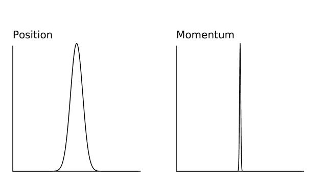

# 量子系统

> 原文：[`www.algorithm-archive.org/contents/quantum_systems/quantum_systems.html`](https://www.algorithm-archive.org/contents/quantum_systems/quantum_systems.html)

正如我确信你们已经听说过的，量子世界是奇怪的。当你处理越来越小的系统时，在某个点上，将对象描述为粒子就变得不准确了。相反，最好将对象描述为概率密度。这些密度最容易通过*波函数*来理解，波函数是描述量子系统行为的复函数。

再次强调，这几乎是常识；然而，关于如何模拟量子系统的可读文献却明显不足，尽管有众多方法可以做到这一点！本节将处理使用经典机器计算量子状态的问题。现在，我知道你们在想什么，“等等。为什么我们要在经典计算机上模拟量子系统？为什么不通过某种实验或量子计算机来模拟呢？”好吧，这正是符号变得非常棘手的地方。

量子计算机和量子模拟器之间有一个明显的区别。*量子计算机*是经典计算机的量子对应物，通过量子信息理论用量子位替换比特。量子计算机通常被认为是利用量子力学通过新的量子算法最终解决现实世界问题的方法。Grover 算法和 Shor 算法都是量子计算可以极大地改变我们所知的现代计算格局的例子！

另一方面，*量子模拟器*是用于更好地理解量子力学的量子系统。这些通常以实验量子系统的形式出现，表现出量子行为，并使我们能够更好地理解量子系统的其他领域。换句话说，量子模拟器是研究量子系统在量子硬件上的通用技术；然而，量子计算机是用于量子计算的量子硬件，其目的是使用量子位进行量子计算。由于超级计算机在执行量子计算方面并不出色，某些量子模拟器作为量子计算的基础块而存在。一个*通用量子模拟器*通常被称为量子计算机，就是这个原因。

事实上，量子模拟器在实验室中很难制造，所以在大多数情况下，在经典硬件上模拟量子系统是我们的最佳选择。本节致力于目前用于解决复杂量子系统的所有不同方法，因此让我们从薛定谔方程开始，它有许多不同的形式。这里是最容易解释的一个：

其中，是量子波函数，是*陷阱势*，是*拉普拉斯算子*，是某种空间分量，而 是时间。这里有很多东西需要消化；然而，这最终只是在左侧的一些时间导数和右侧的一些空间导数（和一些额外的步骤）。以这种方式，它与扩散（热）方程并没有太大的不同：

其中，是某个正定矩阵，是系统的密度（或温度）。事实上，这就是为什么最常见的量子模拟类型有时被称为*扩散蒙特卡洛*。在用经典硬件模拟这两个系统的方式上，两者之间并没有太大的区别...但我们跑题了。现在，让我们谈谈量子力学与经典力学如何不同，以及我们如何利用这一点来获得优势。

## 概率密度

量子力学在物理学中与经典力学的基本工作方式不同。波函数可以被视为一个对象可能处于的所有可能状态的集合，其中粒子在每个状态下被找到的概率是某种概率。这意味着我们无法说一个粒子位于特定的位置，而通常我们会说它可能位于任何位置，具有概率，如*概率密度*所示：

在这里，有两点需要注意：

1.  一个复数参数的绝对值平方是一个复函数与其厄米共轭之间的点积（内积）。这意味着这个值总是实数，而波函数本身可能不是。

1.  如你所知，一旦波函数被观察，它就会坍缩到一个单一的状态。这可以简单地解释为对粒子位置的绝对知识。如果我们知道粒子的位置，概率密度就没有意义了！

现在，为了清楚起见：所有概率的总和必须为 1，或者（更正式地）：

这仅仅意味着在真实空间中找到我们的量子粒子的概率是 1。换句话说，我们的粒子必须存在于已知的宇宙中的某个地方。

另外一点：就像位置空间可以用位置向量 来参数化一样，波函数也可以用频率空间中的*波*向量 在频率空间中参数化。任何波矢量 都具有与倒空间相同的单位，因此类似于角频率 。通常，波矢量空间被称为*动量*空间，这在考虑德布罗意公式时是有意义的：

其中，是普朗克常数，是波长。这意味着我们可以通过使用傅里叶变换在位置空间和动量空间之间进行转换，这在许多情况下非常有用！

尽管位置空间和动量空间之间的关系是理解现代量子力学的一个基本基石，但在根本层面上它是难以理解的。位置空间和动量空间通过傅里叶变换相关联；然而，上面提到的相当随意的论证可能不足以令人信服，并且它并没有提供任何关于为什么傅里叶变换会出现在这个讨论中的直观描述。理解这一点可能最简单的方法是查看**海森堡不确定性原理**，这是位置空间和动量空间之间的一项基本关系。

## 海森堡不确定性原理

简而言之，海森堡不确定性原理表明，我们无法确切地知道量子粒子的位置和动量。特别是，它说：

其中  是普朗克常数，  是标准差，  是分布的统计平均值，  是采样点的数量，  是每个点的值，而  代表  或 。最终，这意味着如果我们对位置空间的精度更高，那么在动量空间中的精度就会更低。反之亦然：动量空间中的更高精度将导致位置空间中的精度更低。

如果我们想象在位置空间中有一个类似于高斯分布的概率密度函数（），那么在动量空间中也会得到一个类似高斯分布的密度。在这里，我们可以看到，如果我们在一个空间中有一个更宽的分布，那么在相反的空间中我们必须有一个更薄的分布，正如这里所示：



因为密度可以解释为“在位置空间（或动量空间）的任何给定位置找到量子粒子的概率”，所以解释是清晰的：我们对粒子位置的了解越多，对其动量的了解就越少。这是一个强有力的陈述，应该给予一些思考。

对我来说，这个描述中最有趣的部分不是物理解释，而是这个在较大和较小的高斯分布之间转换的行为正是傅里叶变换所做的事情！这进一步强化了我们之前的论点。位置空间和动量空间通过傅里叶变换相关联！

这是模拟量子系统算法的核心，包括分裂算子方法。

至少对我来说，我发现这个描述是直观的，但并不完整。图像中仍然缺少一些应该更深入描述的内容，为了做到这一点，我们需要深入量子力学的核心和**哈密顿量**。

## 哈密顿量

下面再次给出薛定谔方程：

我们在章节的初始部分描述了它。在大多数情况下，当我们试图解这个方程时，左边是不变的。它总是。另一方面，右边会根据情况有很大的变化。也就是说，我们可以通过使用一种称为*哈密顿量*的数学形式来简化薛定谔方程。

为了清楚起见，哈密顿力学不是一个量子特有的概念。它在统计物理学中无处不在，通常在经典物理课程中作为另一种称为拉格朗日力学的符号形式的类比来教授。为了简单起见，我们将在这里限制于解释哈密顿量的物理意义。我们基本上可以说，哈密顿量是我们量子系统能量的度量。更具体地说，我们可以说，哈密顿量是一组作用于我们的波函数的能量算子。

在一维谐振子粒子的情形下，我们可能会使用以下定义：

其中，是*动量算子*，是*捕获频率*，表示我们的量子系统将被限制到何种程度。在这种情况下，是一个在动量空间中作用于我们的波函数的算子，而作用于位置空间。这两个都是算子。也就是说，它们通过某种方式*操作*我们的量子系统。最终，这意味着算子不是为了独立于其他对象（在这种情况下，是波函数）而被解释的。

最后，我们可以将我们的薛定谔方程更新为

这要干净得多，也更通用。现在，只要可以用哈密顿力学来表示，薛定谔方程就可以解决任何量子系统！

当观察算子时，很明显，算子是在位置空间中的。我们可以清楚地看到它作为一个函数来操作。然而，为什么算子是在动量空间中并不是立即显而易见的。这是一个不容易回答的问题，但它在讨论谱方法时确实非常重要，并将被更深入地探讨。

现在，我们将笼统地说

换句话说，我们可以通过对函数进行傅里叶变换，乘以一些动量空间网格，然后对其进行逆变换来导出一个函数。因为这个操作本质上在变换之前涉及到动量空间的转换，所以它是一个动量空间算子。

这是我能找到的最直观的推理；然而，我确信还有更多直观的解释来说明为什么导数总是动量空间操作。当我们在讨论谱方法时，这一节将会进一步更新，但如果你有更好的描述，请告诉我！

## 括号矢量符号

不幸的是，量子模拟的解释相当棘手，有时用稍微不同的符号来理解会更容易一些。这种符号被称为*括号*符号，其中*矢量*看起来是这样的：

并且基本上将描述为列向量。**内积**表示**矢量**的厄米共轭，看起来是这样的：

矢量通常表示为行向量。因此，表示两个向量的内积，表示外积。现在，到目前为止，括号符号没有特别量子化的特征；然而，当描述实际的量子现象时，它变得很有用。例如，如果我们想表示波函数坍缩到状态的概率，我们可能会写：，这正好与上面定义的概率密度相同。

现在我们对符号有了基本理解，我们应该通过几个其他重要的量子力学思想和属性。

## 本征态

正如之前提到的，波函数是复数，既有实部也有虚部；然而，有一些状态是纯粹实数的。这些状态是系统的**本征态**，通常被描述为构成所有其他可能波函数的组成部分。换句话说，

其中，是一个描述给定本征态在完整波函数中**有多少**的常数。正如你所预期的那样，所有的“”都应该加起来等于 1。

## 能量计算

当涉及到量子系统时，没有比能量更重要的量了。基本上，系统的每个本征态都与一个不同的能量相关联，你可以通过简单的计算找到这个能量：

这可以通过在位置和动量空间中操作后找到波函数的共轭，并将其与另一个波函数相乘来相当简单地用代码实现。最终看起来是这样的：

```
# We are calculating the energy to check <Psi|H|Psi>
function calculate_energy(par, opr)
    # Creating real, momentum, and conjugate wavefunctions
    wfc_r = opr.wfc
    wfc_k = fft(wfc_r)
    wfc_c = conj(wfc_r)

    # Finding the momentum and real-space energy terms
    energy_k = 0.5*wfc_c.*ifft((par.k.²) .* wfc_k)
    energy_r = wfc_c.*opr.V .* wfc_r

    # Integrating over all space
    energy_final = 0
    for i = 1:length(energy_k)
        energy_final += real(energy_k[i] + energy_r[i])
    end

    return energy_final*par.dx
end 
```

```
calculateEnergy :: Parameters -> Operators -> Double
calculateEnergy param ops = (* dx param) . sum . map realPart $ elems totalE
  where
    totalE = potentialE .+ kineticE
    potentialE = wfcConj .* v ops .* wfc ops
    kineticOp = liftArray ((/ 2) . (^ 2)) (ks param)
    kineticE = wfcConj .* idft (kineticOp .* dft (wfc ops))
    wfcConj = liftArray conjugate $ wfc ops 
```

```
double calculate_energy(struct params par, struct operators opr) {
    double complex wfc_r[opr.size];
    double complex wfc_k[opr.size];
    double complex wfc_c[opr.size];
    memcpy(wfc_r, opr.wfc, sizeof(wfc_r));

    memcpy(wfc_k, opr.wfc, sizeof(wfc_k));
    fft(wfc_k, opr.size, false);

    for (size_t i = 0; i < opr.size; ++i) {
        wfc_c[i] = conj(wfc_r[i]);
    }

    double complex energy_k[opr.size];
    double complex energy_r[opr.size];

    for (size_t i = 0; i < opr.size; ++i) {
        energy_k[i] = wfc_k[i] * cpow(par.k[i] + 0.0*I, 2);
    }

    fft(energy_k, opr.size, true);

    for (size_t i = 0; i < opr.size; ++i) {
        energy_k[i] *= 0.5 * wfc_c[i];
        energy_r[i] = wfc_c[i] * opr.v[i] * wfc_r[i];
    }

    double energy_final = 0;

    for (size_t i = 0; i < opr.size; ++i) {
        energy_final += creal(energy_k[i] + energy_r[i]);
    }

    return energy_final * par.dx;
} 
```

```
double calculate_energy(Params &par, Operators &opr) {
    vector_complex wfc_r(opr.wfc);
    vector_complex wfc_k(opr.wfc);
    vector_complex wfc_c(opr.size);
    fft(wfc_k, false);

    for (size_t i = 0; i < opr.size; ++i) {
        wfc_c[i] = conj(wfc_r[i]);
    }

    vector_complex energy_k(opr.size);
    vector_complex energy_r(opr.size);

    for (size_t i = 0; i < opr.size; ++i) {
        energy_k[i] = wfc_k[i] * pow(complex(par.k[i], 0.0), 2);
    }

    fft(energy_k, true);

    for (size_t i = 0; i < opr.size; ++i) {
        energy_k[i] *= 0.5 * wfc_c[i];
        energy_r[i] = wfc_c[i] * opr.v[i] * wfc_r[i];
    }

    double energy_final = 0;

    for (size_t i = 0; i < opr.size; ++i) {
        energy_final += real(energy_k[i] + energy_r[i]);
    }

    return energy_final * par.dx;
} 
```

```
def calculate_energy(par: Param, opr: Operators) -> float:
    """Calculate the energy <Psi|H|Psi>."""
    # Creating real, momentum, and conjugate wavefunctions.
    wfc_r = opr.wfc
    wfc_k = np.fft.fft(wfc_r)
    wfc_c = np.conj(wfc_r)

    # Finding the momentum and real-space energy terms
    energy_k = 0.5 * wfc_c * np.fft.ifft((par.k ** 2) * wfc_k)
    energy_r = wfc_c * opr.V * wfc_r

    # Integrating over all space
    energy_final = sum(energy_k + energy_r).real

    return energy_final * par.dx 
```

这个计算将在许多量子系统的不同模拟中使用，以检查我们的结果。最终，许多量子模拟都集中在**基态**上，这是最低能量状态（）；然而，有时也希望能得到更高能量状态。

## 未来

随着我们继续添加新的算法来模拟量子系统，我将在本节中添加越来越多的符号；然而，已经有大量关于理解和研究量子系统的教科书。我们不想在这里重新发明轮子。相反，我们想专注于一个通常没有过多详细考虑的领域：研究人员用来确定量子力学新知识的算法和方法，如分裂算子法、DMRG、量子蒙特卡洛、精确对角化以及许多更多。

量子力学是物理学中那些真正推动人类知识边界在多个不同领域发展的领域之一，计算就是其中之一。实际上，量子信息理论目前正被设定为下一个将彻底改变我们已知现代计算格局的创新！当然，由于它将对行业产生大规模的影响，它理应拥有自己的章节。

如往常一样，如果您觉得本节缺少某些内容，请随时联系我或在 GitHub 上创建一个问题，我们会尽快处理！

## 许可协议

##### 代码示例

代码示例遵循 MIT 许可协议（可在[LICENSE.md](https://github.com/algorithm-archivists/algorithm-archive/blob/main/LICENSE.md)中找到）。

##### 文本

本章的文本由[James Schloss](https://github.com/leios)编写，并遵循[Creative Commons Attribution-ShareAlike 4.0 国际许可协议](https://creativecommons.org/licenses/by-sa/4.0/legalcode)。

[](https://creativecommons.org/licenses/by-sa/4.0/)

(https://creativecommons.org/licenses/by-sa/4.0/)

##### 图片/图形

+   动画"FTgaussian"由[James Schloss](https://github.com/leios)创建，并遵循[Creative Commons Attribution-ShareAlike 4.0 国际许可协议](https://creativecommons.org/licenses/by-sa/4.0/legalcode)。

##### 提交请求

在初始许可([#560](https://github.com/algorithm-archivists/algorithm-archive/pull/560))之后，以下提交请求已修改了本章的文本或图形：

+   none
