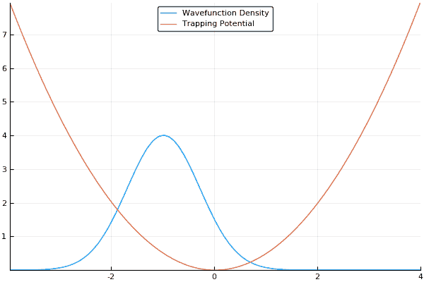

# 分割算子法

> 原文：[`www.algorithm-archive.org/contents/split-operator_method/split-operator_method.html`](https://www.algorithm-archive.org/contents/split-operator_method/split-operator_method.html)

分割算子法（也称为分割步法），实际上是我攻读博士学位期间解决薛定谔方程的主要方法。这是此目的中最简单和最快的方法之一，并且在现代量子研究领域的各个方面都得到了广泛应用，尤其是在处理非线性薛定谔方程（NLSE）时：

这是从 量子系统 章节中提供的符号得出的： 是一个具有空间 () 和时间 () 相关性的量子波函数， 是拉普拉斯算子， 是某种类型的势能（如  或类似的东西）。在这种情况下，我们还在非线性  项旁边添加了一个相互作用项  。这就是我在我的博士生涯的大部分时间里研究过的系统（当然，我们在并行化等方面玩了一些技巧，所以它 *稍微* 复杂一些）。

在本质上，分割算子法不过是一个伪谱微分方程求解器...也就是说，它使用 FFT 求解薛定谔方程。实际上，有一大类谱和伪谱方法用于解决许多不同的物理系统，我们肯定会在未来涵盖这些内容。如 量子系统 部分所述，我们可以在动量空间中表示量子波函数，它由波矢 . 参数化。在上面的哈密顿量中，我们可以将我们的系统分割为位置空间分量 ，和动量空间分量 。坦白说，我不知道该用什么符号来表示 ，因为 用来描述动量。我决定用  表示 *实空间*，但这在符号上有些模糊。此外，  将表示动量空间，因为它是由所有波矢量的和组成的，通常表示为 。抛开糟糕的符号不谈，让我们继续。

如果我们假设我们的量子系统有一个相对一般的解：

并假设我们通过一系列小时间步长 () 来模拟我们的系统，我们可以通过使用 Baker-Campbell-Housdorff 公式执行类似的分割：

这种方法会导致与哈密顿量的实部和动量空间分量交换相关的一小部分误差（）。这是一个相对较大的误差，这是不可接受的。为了将误差从 变为 ，我们可以通过在动量空间中执行一步半的步骤之前在位置空间中执行一步完整的步骤，通过称为 *Strang 分割* 的过程来实现：

然后，我们可以通过使用 傅里叶变换 来分块处理这个解的每一部分，首先在位置空间中，然后在动量空间中，最后再次在位置空间中。这看起来像这样：

其中， , 和  以及  和  表示正向和逆傅里叶变换。以下是我们每一步都在寻找的流程图：


大部分就是这样：

1.  将实空间中的波函数与实空间算子相乘。

1.  使用傅里叶变换将波函数转换为动量空间。

1.  将动量空间波函数乘以动量空间算子。

1.  使用逆傅里叶变换将波函数转换为位置空间。

1.  重复 1-4 直到满意。

如果我们猜测我们的初始波函数类似于高斯函数，并且稍微偏离中心或陷阱，这将允许我们看到我们的波函数在我们的陷阱中“荡漾”来去，如下所示：



作为一个小小的让步，使用这种方法强制执行周期性边界条件，其中波函数将简单地从模拟盒的一侧滑到另一侧，但对于大多数情况来说这没问题。事实上，对于许多情况（如大规模湍流模型）来说，这是理想的。

话虽如此，这个故事还有更多内容。正如我们在量子系统部分提到的，许多量子系统的模拟都希望找到我们系统的基态。分裂算子方法也可以用于此！如果我们以**虚时间**运行这个模拟，只需简单地设置  并通过  步进，而不是 ，我们就不会再看到原子应该如何行为的“现实世界”例子，而会看到高能态的指数衰减。如果我们以足够长的时间步长运行模拟，所有高能态都将消失。这意味着我们可以通过在虚时间下运行模拟来找到我们系统的基态，这是一个极其有用的功能！如果我们以虚时间运行上述相同的模拟，我们应该看到我们的波函数平滑地移动到我们的陷阱中心（最低能量位置），如下所示：


## 算法

幸运的是，在这个案例中，代码相当简单。在开始之前，请注意，我们将在这个模拟中使用归一化单位，其中 。这些单位通常被称为**自然**单位。你们中的许多人（*咳嗽*实验学家*咳嗽*）可能会认为这些单位完全不物理，它们确实是；然而，它们允许我们输出分数和整数。例如，如果我们试图找到简单谐振子中原子基态的能量，我们知道它应该是 ，其中  是 项前面的系数，称为陷阱的**频率**。如果我们用实际单位计算能量，我们的模拟将输出 ，这很难解释。通过使用自然单位，我们得到精确的  ，并且我们知道这些单位是 。毫无疑问，这使得模拟更容易理解（尽管最终有点误导）。

不论如何，我们首先需要设置所有初始参数，包括实空间和动量空间的初始网格：

```
struct Param
    xmax::Float64
    res::Int64
    dt::Float64
    timesteps::Int64
    dx::Float64
    x::Vector{Float64}
    dk::Float64
    k::Vector{Float64}
    im_time::Bool

    Param() = new(10.0, 512, 0.05, 1000, 2 * 10.0/512,
                  Vector{Float64}(-10.0 + 10.0/512 : 20.0/512 : 10.0),
                  pi / 10.0,
                  Vector{Float64}(vcat(0:512/2 - 1, -512/2 : -1) * pi/10.0),
                  false)
    Param(xmax::Float64, res::Int64, dt::Float64, timesteps::Int64,
          im_val::Bool) = new(
              xmax, res, dt, timesteps,
              2*xmax/res, Vector{Float64}(-xmax+xmax/res:2*xmax/res:xmax),
              pi/xmax, Vector{Float64}(vcat(0:res/2-1, -res/2:-1)*pi/(xmax)),
              im_val
          )
end 
```

```
struct params {
    double xmax;
    unsigned int res;
    double dt;
    unsigned int timesteps;
    double dx;
    double *x;
    double dk;
    double *k;
    bool im_time;
}; 
```

```
void init_params(struct params *par, double xmax, unsigned int res, double dt,
                 unsigned int timesteps, bool im) {

    par->xmax = xmax;
    par->res = res;
    par->dt = dt;
    par->timesteps = timesteps;
    par->dx = 2.0 * xmax / res;
    par->x = malloc(sizeof(double) * res);
    par->dk = M_PI / xmax;
    par->k = malloc(sizeof(double) * res);
    par->im_time = im;

    for (size_t i = 0; i < res; ++i) {
        par->x[i] = xmax / res - xmax + (double)i * (2.0 * xmax / res);
        if (i < res / 2) {
            par->k[i] = (double)i * M_PI / xmax;
        } else {
            par->k[i] = ((double)i - res) * M_PI / xmax;
        }
    }
} 
```

```
using complex = std::complex<double>;
using vector_real = std::vector<double>;
using vector_complex = std::vector<complex>;

struct Params {
    Params(double _xmax, unsigned int _res, double _dt, unsigned int _timesteps, bool im) {
        xmax = _xmax;
        res = _res;
        dt = _dt;
        timesteps = _timesteps;
        dx = 2.0 * xmax / res;
        x.reserve(res);
        dk = M_PI / xmax;
        k.reserve(res);
        im_time = im;

        for (size_t i = 0; i < res; ++i) {
            x.emplace_back(xmax / res - xmax + static_cast<double>(i) * (2.0 * xmax / res));
            if (i < res / 2) {
                k.push_back(static_cast<double>(i) * M_PI / xmax);
            } else {
                k.push_back((static_cast<double>(i) - res) * M_PI / xmax);
            }
        }
    }

    double xmax;
    unsigned int res;
    double dt;
    unsigned int timesteps;
    double dx;
    vector_real x;
    double dk;
    vector_real k;
    bool im_time;
}; 
```

```
class Param:
    """Container for holding all simulation parameters."""
    def __init__(self,
                 xmax: float,
                 res: int,
                 dt: float,
                 timesteps: int,
                 im_time: bool) -> None:

        self.xmax = xmax
        self.res = res
        self.dt = dt
        self.timesteps = timesteps
        self.im_time = im_time

        self.dx = 2 * xmax / res
        self.x = np.arange(-xmax + xmax / res, xmax, self.dx)
        self.dk = pi / xmax
        self.k = np.concatenate((np.arange(0, res / 2),
                                 np.arange(-res / 2, 0))) * self.dk 
```

```
data Parameters = Parameters
  { xmax :: Double
  , res :: Int
  , dt :: Double
  , timesteps :: Int
  , dx :: Double
  , x :: Vector
  , dk :: Double
  , ks :: Vector
  , imTime :: Bool
  }

defaultParameters :: Parameters
defaultParameters = makeParameters 10 512 0.01 1000 True

makeParameters :: Double -> Int -> Double -> Int -> Bool -> Parameters
makeParameters xmax res dt timesteps imTime =
  let fi = fromIntegral
      rng = (0, res - 1)
      ks = [0 .. div res 2 - 1] ++ [-div res 2 .. -1]
   in Parameters
        xmax
        res
        dt
        timesteps
        (2 * xmax / fi res)
        (listArray rng $
         map (\n -> xmax * (-1 + 2 * fi n / fi res) :+ 0) [1 .. res])
        (pi / xmax)
        (listArray rng $ map ((:+ 0) . (pi / xmax *) . fi) ks)
        imTime 
```

```
 xmax: f64,
    res: usize,
    dt: f64,
    timesteps: usize,
    dx: f64,
    x: Vec<f64>,
    dk: f64,
    k: Vec<f64>,
    im_time: bool,
}

impl Parameters {
    pub fn new(xmax: f64, res: usize, dt: f64, timesteps: usize, im_time: bool) -> Parameters {
        let dx = 2.0_f64 * xmax / (res as f64);
        let mut x: Vec<f64> = Vec::with_capacity(res);
        let dk = PI / xmax;
        let mut k: Vec<f64> = Vec::with_capacity(res);
        for i in 0..res {
            x.push(xmax / (res as f64) - xmax + (i as f64) * dx);
            match i {
                i if (i < res / 2) => k.push((i as f64) * PI / xmax),
                _ => k.push(((i as f64) - (res as f64)) * PI / xmax),
            }
        }
        Parameters {
            xmax,
            res,
            dt,
            timesteps,
            im_time,
            dx,
            x,
            dk,
            k,
        }
    }
} 
```

作为备注，当我们生成动量空间 `k` 的网格时，我们需要将网格分成两行，一行从 `0` 到 `-kmax`，然后是不连续的，从 `kmax` 到 `0`。这仅仅是因为 FFT 会自然地假设我们网格中的 `0` 在模拟的左侧，因此我们将 k 空间调整以匹配这种期望。此外，对于这段代码，我们将使用与上面相同的符号：`opr.R` 将是实空间算子，而 `opr.K` 将是动量空间算子。这里还有一个布尔值，称为 `im_time`，用于虚时间演化。

之后，我们将它们转换为算子：

```
mutable struct Operators
    V::Vector{Complex{Float64}}
    R::Vector{Complex{Float64}}
    K::Vector{Complex{Float64}}
    wfc::Vector{Complex{Float64}}

    Operators(res) = new(zeros(res),
                         zeros(res),
                         zeros(res),
                         zeros(res))
end

# Function to initialize the wfc and potential
function init(par::Param, voffset::Float64, wfcoffset::Float64)
    opr = Operators(length(par.x))
    opr.V = 0.5 * (par.x .- voffset).²
    opr.wfc = exp.(-(par.x .- wfcoffset).²/2)
    if (par.im_time)
        opr.K = exp.(-0.5*par.k.²*par.dt)
        opr.R = exp.(-0.5*opr.V*par.dt)
    else
        opr.K = exp.(-im*0.5*par.k.²*par.dt)
        opr.R = exp.(-im*0.5*opr.V*par.dt)
    end

    return opr
end 
```

```
struct operators {
    size_t size;
    double complex *v;
    double complex *pe;
    double complex *ke;
    double complex *wfc;
}; 
```

```
void init_operators(struct operators *opr, struct params par, double voffset,
                    double wfcoffset) {

    opr->size = par.res;
    opr->v = malloc(sizeof(double complex) * par.res);
    opr->pe = malloc(sizeof(double complex) * par.res);
    opr->ke = malloc(sizeof(double complex) * par.res);
    opr->wfc = malloc(sizeof(double complex) * par.res);

    for (size_t i = 0; i < par.res; ++i) {
        opr->v[i] = 0.5 * cpow(par.x[i] - voffset, 2);
        opr->wfc[i] = cexp(-cpow(par.x[i] - wfcoffset, 2) / 2.0);

        if (par.im_time) {
            opr->ke[i] = cexp(-0.5 * par.dt * cpow(par.k[i], 2));
            opr->pe[i] = cexp(-0.5 * par.dt * opr->v[i]);
        } else {
            opr->ke[i] = cexp(-0.5 * par.dt * cpow(par.k[i], 2) * I);
            opr->pe[i] = cexp(-0.5 * par.dt * opr->v[i] * I);
        }
    }
} 
```

```
struct Operators {
public:
    Operators(Params &par, double voffset,
              double wfcoffset) {
        size = par.res;
        v.reserve(size);
        pe.reserve(size);
        ke.reserve(size);
        wfc.reserve(size);

        for (size_t i = 0; i < size; ++i) {
            v.push_back(0.5 * pow(par.x[i] - voffset, 2));
            wfc.push_back(exp(-pow(par.x[i] - wfcoffset, 2) / 2.0));

            if (par.im_time) {
                ke.push_back(exp(-0.5 * par.dt * pow(par.k[i], 2)));
                pe.push_back(exp(-0.5 * par.dt * v[i]));
            } else {
                ke.push_back(exp(-0.5 * par.dt * pow(par.k[i], 2) * complex(0.0, 1.0)));
                pe.push_back(exp(-0.5 * par.dt * v[i] * complex(0.0, 1.0)));
            }
        }
    }

    size_t size;
    vector_complex v;
    vector_complex pe;
    vector_complex ke;
    vector_complex wfc;
}; 
```

```
class Operators:
    """Container for holding operators and wavefunction coefficients."""
    def __init__(self, res: int) -> None:

        self.V = np.empty(res, dtype=complex)
        self.R = np.empty(res, dtype=complex)
        self.K = np.empty(res, dtype=complex)
        self.wfc = np.empty(res, dtype=complex)

def init(par: Param, voffset: float, wfcoffset: float) -> Operators:
    """Initialize the wavefunction coefficients and the potential."""
    opr = Operators(len(par.x))
    opr.V = 0.5 * (par.x - voffset) ** 2
    opr.wfc = np.exp(-((par.x - wfcoffset) ** 2) / 2, dtype=complex)
    if par.im_time:
        opr.K = np.exp(-0.5 * (par.k ** 2) * par.dt)
        opr.R = np.exp(-0.5 * opr.V * par.dt)
    else:
        opr.K = np.exp(-0.5 * (par.k ** 2) * par.dt * 1j)
        opr.R = np.exp(-0.5 * opr.V * par.dt * 1j)
    return opr 
```

```
data Operators = Operators
  { v :: Vector
  , rStep :: Vector
  , kStep :: Vector
  , wfc :: Vector
  }

makeOperators :: Parameters -> Complex Double -> Complex Double -> Operators
makeOperators param v0 wfc0 =
  let rng = (0, res param - 1)
      time
        | imTime param = dt param :+ 0
        | otherwise = 0 :+ dt param
      v = liftArray (\x -> 0.5 * (x - v0) ^ 2) (x param)
      rStep = liftArray (\x -> exp (-0.5 * time * x)) v
      kStep = liftArray (\k -> exp (-0.5 * time * k ^ 2)) (ks param)
      wfc = liftArray (\x -> exp (-(x - wfc0) ^ 2 / 2)) (x param)
   in Operators v rStep kStep (normalize (dx param) wfc) 
```

```
 v: Vec<Complex<f64>>,
    pe: Vec<Complex<f64>>,
    ke: Vec<Complex<f64>>,
    wfc: Vec<Complex<f64>>,
}

impl Operators {
    pub fn new(par: &Parameters, v_offset: f64, wfc_offset: f64) -> Operators {
        let mut v: Vec<Complex<f64>> = Vec::with_capacity(par.res);
        let mut pe: Vec<Complex<f64>> = Vec::with_capacity(par.res);
        let mut ke: Vec<Complex<f64>> = Vec::with_capacity(par.res);
        let mut wfc: Vec<Complex<f64>> = Vec::with_capacity(par.res);

        for i in 0..par.res {
            v.push(Complex::new(
                0.5_f64 * (par.x[i] - v_offset).powi(2),
                0.0_f64,
            ));
            wfc.push(Complex::new(
                (-((par.x[i] - wfc_offset).powi(2)) / 2.0_f64).exp(),
                0.0_f64,
            ));
            if par.im_time {
                ke.push(Complex::new(
                    (-0.5_f64 * par.dt * par.k[i].powi(2)).exp(),
                    0.0_f64,
                ));
                pe.push(Complex::new((-0.5_f64 * par.dt * v[i].re).exp(), 0.0_f64));
            } else {
                ke.push(Complex::new(
                    0.0_f64,
                    (-0.5_f64 * par.dt * par.k[i].powi(2)).exp(),
                ));
                pe.push(Complex::new(0.0_f64, (-0.5_f64 * par.dt * v[i].re).exp()));
            }
        }
        Operators { v, pe, ke, wfc }
    }
} 
```

这里，我们使用标准谐振势让原子处于其中，并使用高斯分布作为概率分布的初始猜测。如果我们对陷阱或原子进行轻微偏移（这样原子的高斯分布就不会完全位于势能的底部），当我们向前推进模拟时间时，我们可以看到原子在势能中来回移动。这意味着我们可以轻松地看到我们的量子系统的动力学！如果我们用虚时间运行模拟，我们会看到原子的高斯分布向势能中心移动，这是能量最低的位置。上述两种情况都在上面的图中展示过。

最后一步是进行迭代本身。

```
function split_op!(par::Param, opr::Operators)

    for i = 1:par.timesteps
        # Half-step in real space
        opr.wfc = opr.wfc .* opr.R

        # fft to momentum space
        opr.wfc = fft(opr.wfc)

        # Full step in momentum space
        opr.wfc = opr.wfc .* opr.K

        # ifft back
        opr.wfc = ifft(opr.wfc)

        # final half-step in real space
        opr.wfc = opr.wfc .* opr.R

        # density for plotting and potential
        density = abs2.(opr.wfc)

        # renormalizing for imaginary time
        if (par.im_time)
            renorm_factor = sum(density) * par.dx

            for j = 1:length(opr.wfc)
                opr.wfc[j] /= sqrt(renorm_factor)
            end
        end

        # Outputting data to file. Plotting can also be done in a similar way
        # This is set to output exactly 100 files, no matter how many timesteps
        if ((i-1) % div(par.timesteps, 100) == 0)
            outfile = open("output" * string(lpad(string(i-1), 5, string(0)))
                                    * ".dat","w")

            # Outputting for gnuplot. Any plotter will do.
            for j = 1:length(density)
                write(outfile, string(par.x[j]) * "\t"
                               * string(density[j]) * "\t"
                               * string(real(opr.V[j])) * "\n")
            end

            close(outfile)
            println("Outputting step: ", i)
        end
    end
end 
```

```
void split_op(struct params par, struct operators opr) {
    double density[opr.size];

    for (size_t i = 0; i < par.timesteps; ++i) {
        for (size_t j = 0; j < opr.size; ++j) {
            opr.wfc[j] *= opr.pe[j];
        }

        fft(opr.wfc, opr.size, false);

        for (size_t j = 0; j < opr.size; ++j) {
            opr.wfc[j] *= opr.ke[j];
        }

        fft(opr.wfc, opr.size, true);

        for (size_t j = 0; j < opr.size; ++j) {
            opr.wfc[j] *= opr.pe[j];
        }

        for (size_t j = 0; j < opr.size; ++j) {
            density[j] = pow(cabs(opr.wfc[j]), 2);
        }

        if (par.im_time) {
            double sum = 0;

            for (size_t j = 0; j < opr.size; ++j) {
                sum += density[j];
            }

            sum *= par.dx;

            for (size_t j = 0; j < opr.size; ++j) {
                opr.wfc[j] /= sqrt(sum);
            }
        }

        // Writing data into a file in the format of:
        // index, density, real potential.
        char filename[256];
        sprintf(filename, "output%lu.dat", i);
        FILE *fp = fopen(filename, "w");

        for (size_t i = 0; i < opr.size; ++i) {
            fprintf(fp, "%ld\t%f\t%f\n", i, density[i], creal(opr.v[i]));
        }

        fclose(fp);
    }
} 
```

```
void split_op(Params &par, Operators &opr) {
    auto density = std::vector<double>(opr.size, 0);

    for (size_t i = 0; i < par.timesteps; ++i) {
        for (size_t j = 0; j < opr.size; ++j) {
            opr.wfc[j] *= opr.pe[j];
        }

        fft(opr.wfc, false);

        for (size_t j = 0; j < opr.size; ++j) {
            opr.wfc[j] *= opr.ke[j];
        }

        fft(opr.wfc, true);

        for (size_t j = 0; j < opr.size; ++j) {
            opr.wfc[j] *= opr.pe[j];
        }

        for (size_t j = 0; j < opr.size; ++j) {
            density[j] = pow(abs(opr.wfc[j]), 2);
        }

        if (par.im_time) {
            double sum = 0;

            for (size_t j = 0; j < opr.size; ++j) {
                sum += density[j];
            }

            sum *= par.dx;

            for (size_t j = 0; j < opr.size; ++j) {
                opr.wfc[j] /= sqrt(sum);
            }
        }

        // Writing data into a file in the format of:
        // index, density, real potential.
        std::stringstream filename_stream;
        filename_stream << "output" << i << ".dat";

        std::ofstream fstream = std::ofstream(filename_stream.str());

        if (fstream) {
            for (std::size_t i = 0; i < opr.size; ++i) {
                std::stringstream data_stream;

                data_stream << i << "\t" << density[i] << "\t" << real(opr.v[i]) << "\n";

                fstream.write(data_stream.str().c_str(), data_stream.str().length());
            }
        }

        fstream.close();
    }
} 
```

```
def split_op(par: Param, opr: Operators) -> None:

    for i in range(par.timesteps):

        # Half-step in real space
        opr.wfc *= opr.R

        # FFT to momentum space
        opr.wfc = np.fft.fft(opr.wfc)

        # Full step in momentum space
        opr.wfc *= opr.K

        # iFFT back
        opr.wfc = np.fft.ifft(opr.wfc)

        # Final half-step in real space
        opr.wfc *= opr.R

        # Density for plotting and potential
        density = np.abs(opr.wfc) ** 2

        # Renormalizing for imaginary time
        if par.im_time:
            renorm_factor = sum(density) * par.dx
            opr.wfc /= sqrt(renorm_factor)

        # Outputting data to file. Plotting can also be done in a
        # similar way. This is set to output exactly 100 files, no
        # matter how many timesteps were specified.
        if i % (par.timesteps // 100) == 0:
            filename = "output{}.dat".format(str(i).rjust(5, str(0)))
            with open(filename, "w") as outfile:
                # Outputting for gnuplot. Any plotter will do.
                for j in range(len(density)):
                    template = "{}\t{}\t{}\n".format
                    line = template(par.x[j], density[j].real, opr.V[j].real)
                    outfile.write(line)
            print("Outputting step: ", i + 1) 
```

```
evolve :: Parameters -> Operators -> [Operators]
evolve param op@(Operators _ rStep kStep _) = iterate splitop op
  where
    splitop op = op {wfc = wfc' op}
    wfc' = norm . (rStep .*) . idft . (kStep .*) . dft . (rStep .*) . wfc
    norm = if imTime param then normalize (dx param) else id 
```

```
 let mut density: Vec<f64>;

    for i in 0..par.timesteps {
        for j in 0..par.res {
            opr.wfc[j] *= opr.pe[j];
        }

        fft(&mut opr.wfc, false);

        for j in 0..par.res {
            opr.wfc[j] *= opr.ke[j];
        }

        fft(&mut opr.wfc, true);

        for j in 0..par.res {
            opr.wfc[j] *= opr.pe[j];
        }

        density = opr.wfc.iter().map(|x| x.norm().powi(2)).collect();

        if par.im_time {
            let sum = density.iter().sum::<f64>() * par.dx;

            for j in 0..par.res {
                opr.wfc[j] /= sum.sqrt();
            }
        }

        // Writing data into a file in the format of:
        // index, density, real potential.
        let path_name = format!("output{}.dat", i);
        let path = Path::new(&path_name);
        let display = path.display();

        let mut file = match File::create(&path) {
            Err(why) => panic!("Couldn't create {}: {}", display, why),
            Ok(good) => good,
        };

        for j in 0..par.res {
            if let Err(why) = writeln!(file, "{}\t{}\t{}", j, density[j], opr.v[j].re) {
                panic!("Couldn't write to {}: {}", display, why)
            }
            if let Err(why) = file.flush() {
                panic!("Couldn't flush {}: {}", display, why)
            }
        }
    }
} 
```

就这样。

虚时间模拟中有一点有点奇怪。基本上，在虚时间中，我们看到所有高能态的指数衰减，这意味着我们在每个时间步长实际上丢失了大量波函数密度！为了解决这个问题，我们通过强制执行来 *重整化*。正如您从代码中看到的，这涉及到求和密度，将这个和乘以 `dx`，然后除以波函数中的每个元素的 `sqrt()` 值。

分割算子法是量子模拟中最常用的算法之一，因为它编码简单，可以快速开始深入研究模拟结果中的物理现象！

## 视频解释

下面是一个描述分割算子法的视频：

[`www.youtube-nocookie.com/embed/BBt8EugN03Q`](https://www.youtube-nocookie.com/embed/BBt8EugN03Q)

## 示例代码

这个示例代码是原子在虚时间中略微偏移的高斯分布的模拟。只要代码编写得当，这意味着原子应该向陷阱中心移动，能量应该衰减到，在这个模拟中将是简单的。检查你的代码是否可以输出谐波陷阱的正确能量是一个很好的测试，以确保在模拟更复杂的哈密顿量系统之前，所有内部工作都正常。

```
#------------split_op.jl-------------------------------------------------------#
#
# Plotting: to plot individual timesteps, use gnuplot like so:
#               p "output00000.dat" u 1:2 w l
#               rep "output00000.dat" u 1:3 w l
#
#------------------------------------------------------------------------------#

using FFTW

struct Param
    xmax::Float64
    res::Int64
    dt::Float64
    timesteps::Int64
    dx::Float64
    x::Vector{Float64}
    dk::Float64
    k::Vector{Float64}
    im_time::Bool

    Param() = new(10.0, 512, 0.05, 1000, 2 * 10.0/512,
                  Vector{Float64}(-10.0 + 10.0/512 : 20.0/512 : 10.0),
                  pi / 10.0,
                  Vector{Float64}(vcat(0:512/2 - 1, -512/2 : -1) * pi/10.0),
                  false)
    Param(xmax::Float64, res::Int64, dt::Float64, timesteps::Int64,
          im_val::Bool) = new(
              xmax, res, dt, timesteps,
              2*xmax/res, Vector{Float64}(-xmax+xmax/res:2*xmax/res:xmax),
              pi/xmax, Vector{Float64}(vcat(0:res/2-1, -res/2:-1)*pi/(xmax)),
              im_val
          )
end

mutable struct Operators
    V::Vector{Complex{Float64}}
    R::Vector{Complex{Float64}}
    K::Vector{Complex{Float64}}
    wfc::Vector{Complex{Float64}}

    Operators(res) = new(zeros(res),
                         zeros(res),
                         zeros(res),
                         zeros(res))
end

# Function to initialize the wfc and potential
function init(par::Param, voffset::Float64, wfcoffset::Float64)
    opr = Operators(length(par.x))
    opr.V = 0.5 * (par.x .- voffset).²
    opr.wfc = exp.(-(par.x .- wfcoffset).²/2)
    if (par.im_time)
        opr.K = exp.(-0.5*par.k.²*par.dt)
        opr.R = exp.(-0.5*opr.V*par.dt)
    else
        opr.K = exp.(-im*0.5*par.k.²*par.dt)
        opr.R = exp.(-im*0.5*opr.V*par.dt)
    end

    return opr
end

# Function for the split-operator loop
function split_op!(par::Param, opr::Operators)

    for i = 1:par.timesteps
        # Half-step in real space
        opr.wfc = opr.wfc .* opr.R

        # fft to momentum space
        opr.wfc = fft(opr.wfc)

        # Full step in momentum space
        opr.wfc = opr.wfc .* opr.K

        # ifft back
        opr.wfc = ifft(opr.wfc)

        # final half-step in real space
        opr.wfc = opr.wfc .* opr.R

        # density for plotting and potential
        density = abs2.(opr.wfc)

        # renormalizing for imaginary time
        if (par.im_time)
            renorm_factor = sum(density) * par.dx

            for j = 1:length(opr.wfc)
                opr.wfc[j] /= sqrt(renorm_factor)
            end
        end

        # Outputting data to file. Plotting can also be done in a similar way
        # This is set to output exactly 100 files, no matter how many timesteps
        if ((i-1) % div(par.timesteps, 100) == 0)
            outfile = open("output" * string(lpad(string(i-1), 5, string(0)))
                                    * ".dat","w")

            # Outputting for gnuplot. Any plotter will do.
            for j = 1:length(density)
                write(outfile, string(par.x[j]) * "\t"
                               * string(density[j]) * "\t"
                               * string(real(opr.V[j])) * "\n")
            end

            close(outfile)
            println("Outputting step: ", i)
        end
    end
end

# We are calculating the energy to check <Psi|H|Psi>
function calculate_energy(par, opr)
    # Creating real, momentum, and conjugate wavefunctions
    wfc_r = opr.wfc
    wfc_k = fft(wfc_r)
    wfc_c = conj(wfc_r)

    # Finding the momentum and real-space energy terms
    energy_k = 0.5*wfc_c.*ifft((par.k.²) .* wfc_k)
    energy_r = wfc_c.*opr.V .* wfc_r

    # Integrating over all space
    energy_final = 0
    for i = 1:length(energy_k)
        energy_final += real(energy_k[i] + energy_r[i])
    end

    return energy_final*par.dx
end

# main function
function main()
    par = Param(5.0, 256, 0.05, 100, true)

    # Starting wavefunction slightly offset so we can see it change
    opr = init(par, 0.0, -1.00)
    split_op!(par, opr)

    energy = calculate_energy(par, opr)
    println("Energy is: ", energy)
end

main() 
```

```
#include <complex.h>
#include <stdbool.h>
#include <stdio.h>
#include <stdlib.h>
#include <string.h>
#include <math.h>

// Using fftw3 library.
#include <fftw3.h>

struct params {
    double xmax;
    unsigned int res;
    double dt;
    unsigned int timesteps;
    double dx;
    double *x;
    double dk;
    double *k;
    bool im_time;
};

struct operators {
    size_t size;
    double complex *v;
    double complex *pe;
    double complex *ke;
    double complex *wfc;
};

void fft(double complex *x, size_t n, bool inverse) {
    double complex y[n];
    memset(y, 0, sizeof(y));
    fftw_plan p;

    if (inverse) {
        p = fftw_plan_dft_1d((int)n, (fftw_complex*)x, (fftw_complex*)y,
                             FFTW_BACKWARD, FFTW_ESTIMATE);
    } else {
        p = fftw_plan_dft_1d((int)n, (fftw_complex*)x, (fftw_complex*)y,
                             FFTW_FORWARD, FFTW_ESTIMATE);
    }

    fftw_execute(p);
    fftw_destroy_plan(p);

    for (size_t i = 0; i < n; ++i) {
        x[i] = y[i] / sqrt((double)n);
    }
}

void init_params(struct params *par, double xmax, unsigned int res, double dt,
                 unsigned int timesteps, bool im) {

    par->xmax = xmax;
    par->res = res;
    par->dt = dt;
    par->timesteps = timesteps;
    par->dx = 2.0 * xmax / res;
    par->x = malloc(sizeof(double) * res);
    par->dk = M_PI / xmax;
    par->k = malloc(sizeof(double) * res);
    par->im_time = im;

    for (size_t i = 0; i < res; ++i) {
        par->x[i] = xmax / res - xmax + (double)i * (2.0 * xmax / res);
        if (i < res / 2) {
            par->k[i] = (double)i * M_PI / xmax;
        } else {
            par->k[i] = ((double)i - res) * M_PI / xmax;
        }
    }
}

void init_operators(struct operators *opr, struct params par, double voffset,
                    double wfcoffset) {

    opr->size = par.res;
    opr->v = malloc(sizeof(double complex) * par.res);
    opr->pe = malloc(sizeof(double complex) * par.res);
    opr->ke = malloc(sizeof(double complex) * par.res);
    opr->wfc = malloc(sizeof(double complex) * par.res);

    for (size_t i = 0; i < par.res; ++i) {
        opr->v[i] = 0.5 * cpow(par.x[i] - voffset, 2);
        opr->wfc[i] = cexp(-cpow(par.x[i] - wfcoffset, 2) / 2.0);

        if (par.im_time) {
            opr->ke[i] = cexp(-0.5 * par.dt * cpow(par.k[i], 2));
            opr->pe[i] = cexp(-0.5 * par.dt * opr->v[i]);
        } else {
            opr->ke[i] = cexp(-0.5 * par.dt * cpow(par.k[i], 2) * I);
            opr->pe[i] = cexp(-0.5 * par.dt * opr->v[i] * I);
        }
    }
}

void split_op(struct params par, struct operators opr) {
    double density[opr.size];

    for (size_t i = 0; i < par.timesteps; ++i) {
        for (size_t j = 0; j < opr.size; ++j) {
            opr.wfc[j] *= opr.pe[j];
        }

        fft(opr.wfc, opr.size, false);

        for (size_t j = 0; j < opr.size; ++j) {
            opr.wfc[j] *= opr.ke[j];
        }

        fft(opr.wfc, opr.size, true);

        for (size_t j = 0; j < opr.size; ++j) {
            opr.wfc[j] *= opr.pe[j];
        }

        for (size_t j = 0; j < opr.size; ++j) {
            density[j] = pow(cabs(opr.wfc[j]), 2);
        }

        if (par.im_time) {
            double sum = 0;

            for (size_t j = 0; j < opr.size; ++j) {
                sum += density[j];
            }

            sum *= par.dx;

            for (size_t j = 0; j < opr.size; ++j) {
                opr.wfc[j] /= sqrt(sum);
            }
        }

        // Writing data into a file in the format of:
        // index, density, real potential.
        char filename[256];
        sprintf(filename, "output%lu.dat", i);
        FILE *fp = fopen(filename, "w");

        for (size_t i = 0; i < opr.size; ++i) {
            fprintf(fp, "%ld\t%f\t%f\n", i, density[i], creal(opr.v[i]));
        }

        fclose(fp);
    }
}

double calculate_energy(struct params par, struct operators opr) {
    double complex wfc_r[opr.size];
    double complex wfc_k[opr.size];
    double complex wfc_c[opr.size];
    memcpy(wfc_r, opr.wfc, sizeof(wfc_r));

    memcpy(wfc_k, opr.wfc, sizeof(wfc_k));
    fft(wfc_k, opr.size, false);

    for (size_t i = 0; i < opr.size; ++i) {
        wfc_c[i] = conj(wfc_r[i]);
    }

    double complex energy_k[opr.size];
    double complex energy_r[opr.size];

    for (size_t i = 0; i < opr.size; ++i) {
        energy_k[i] = wfc_k[i] * cpow(par.k[i] + 0.0*I, 2);
    }

    fft(energy_k, opr.size, true);

    for (size_t i = 0; i < opr.size; ++i) {
        energy_k[i] *= 0.5 * wfc_c[i];
        energy_r[i] = wfc_c[i] * opr.v[i] * wfc_r[i];
    }

    double energy_final = 0;

    for (size_t i = 0; i < opr.size; ++i) {
        energy_final += creal(energy_k[i] + energy_r[i]);
    }

    return energy_final * par.dx;
}

void free_params(struct params par) {
    free(par.x);
    free(par.k);
}

void free_operators(struct operators opr) {
    free(opr.v);
    free(opr.pe);
    free(opr.ke);
    free(opr.wfc);
}

int main() {
    struct params par;
    struct operators opr;

    init_params(&par, 5.0, 256, 0.05, 100, true);
    init_operators(&opr, par, 0.0, -1.0);

    split_op(par, opr);

    printf("the energy is %f\n", calculate_energy(par, opr));

    free_params(par);
    free_operators(opr);

    return 0;
} 
```

```
#include <complex>
#include <vector>
#include <iostream>
#include <cstring>
#include <fstream>

// Using fftw3 library.
#include <fftw3.h>

#ifndef M_PI
#define M_PI 3.14159265358979323846
#endif

using complex = std::complex<double>;
using vector_real = std::vector<double>;
using vector_complex = std::vector<complex>;

struct Params {
    Params(double _xmax, unsigned int _res, double _dt, unsigned int _timesteps, bool im) {
        xmax = _xmax;
        res = _res;
        dt = _dt;
        timesteps = _timesteps;
        dx = 2.0 * xmax / res;
        x.reserve(res);
        dk = M_PI / xmax;
        k.reserve(res);
        im_time = im;

        for (size_t i = 0; i < res; ++i) {
            x.emplace_back(xmax / res - xmax + static_cast<double>(i) * (2.0 * xmax / res));
            if (i < res / 2) {
                k.push_back(static_cast<double>(i) * M_PI / xmax);
            } else {
                k.push_back((static_cast<double>(i) - res) * M_PI / xmax);
            }
        }
    }

    double xmax;
    unsigned int res;
    double dt;
    unsigned int timesteps;
    double dx;
    vector_real x;
    double dk;
    vector_real k;
    bool im_time;
};

struct Operators {
public:
    Operators(Params &par, double voffset,
              double wfcoffset) {
        size = par.res;
        v.reserve(size);
        pe.reserve(size);
        ke.reserve(size);
        wfc.reserve(size);

        for (size_t i = 0; i < size; ++i) {
            v.push_back(0.5 * pow(par.x[i] - voffset, 2));
            wfc.push_back(exp(-pow(par.x[i] - wfcoffset, 2) / 2.0));

            if (par.im_time) {
                ke.push_back(exp(-0.5 * par.dt * pow(par.k[i], 2)));
                pe.push_back(exp(-0.5 * par.dt * v[i]));
            } else {
                ke.push_back(exp(-0.5 * par.dt * pow(par.k[i], 2) * complex(0.0, 1.0)));
                pe.push_back(exp(-0.5 * par.dt * v[i] * complex(0.0, 1.0)));
            }
        }
    }

    size_t size;
    vector_complex v;
    vector_complex pe;
    vector_complex ke;
    vector_complex wfc;
};

void fft(vector_complex &x, bool inverse) {
    std::vector<std::complex<double>> y(x.size(), std::complex<double>(0.0, 0.0));
    fftw_plan p;

    fftw_complex *in = reinterpret_cast<fftw_complex*>(x.data());
    fftw_complex *out = reinterpret_cast<fftw_complex*>(y.data());
    p = fftw_plan_dft_1d(static_cast<int>(x.size()), in, out,
                         (inverse ? FFTW_BACKWARD : FFTW_FORWARD), FFTW_ESTIMATE);

    fftw_execute(p);
    fftw_destroy_plan(p);

    for (size_t i = 0; i < x.size(); ++i) {
        x[i] = y[i] / sqrt(static_cast<double>(x.size()));
    }
}

void split_op(Params &par, Operators &opr) {
    auto density = std::vector<double>(opr.size, 0);

    for (size_t i = 0; i < par.timesteps; ++i) {
        for (size_t j = 0; j < opr.size; ++j) {
            opr.wfc[j] *= opr.pe[j];
        }

        fft(opr.wfc, false);

        for (size_t j = 0; j < opr.size; ++j) {
            opr.wfc[j] *= opr.ke[j];
        }

        fft(opr.wfc, true);

        for (size_t j = 0; j < opr.size; ++j) {
            opr.wfc[j] *= opr.pe[j];
        }

        for (size_t j = 0; j < opr.size; ++j) {
            density[j] = pow(abs(opr.wfc[j]), 2);
        }

        if (par.im_time) {
            double sum = 0;

            for (size_t j = 0; j < opr.size; ++j) {
                sum += density[j];
            }

            sum *= par.dx;

            for (size_t j = 0; j < opr.size; ++j) {
                opr.wfc[j] /= sqrt(sum);
            }
        }

        // Writing data into a file in the format of:
        // index, density, real potential.
        std::stringstream filename_stream;
        filename_stream << "output" << i << ".dat";

        std::ofstream fstream = std::ofstream(filename_stream.str());

        if (fstream) {
            for (std::size_t i = 0; i < opr.size; ++i) {
                std::stringstream data_stream;

                data_stream << i << "\t" << density[i] << "\t" << real(opr.v[i]) << "\n";

                fstream.write(data_stream.str().c_str(), data_stream.str().length());
            }
        }

        fstream.close();
    }
}

double calculate_energy(Params &par, Operators &opr) {
    vector_complex wfc_r(opr.wfc);
    vector_complex wfc_k(opr.wfc);
    vector_complex wfc_c(opr.size);
    fft(wfc_k, false);

    for (size_t i = 0; i < opr.size; ++i) {
        wfc_c[i] = conj(wfc_r[i]);
    }

    vector_complex energy_k(opr.size);
    vector_complex energy_r(opr.size);

    for (size_t i = 0; i < opr.size; ++i) {
        energy_k[i] = wfc_k[i] * pow(complex(par.k[i], 0.0), 2);
    }

    fft(energy_k, true);

    for (size_t i = 0; i < opr.size; ++i) {
        energy_k[i] *= 0.5 * wfc_c[i];
        energy_r[i] = wfc_c[i] * opr.v[i] * wfc_r[i];
    }

    double energy_final = 0;

    for (size_t i = 0; i < opr.size; ++i) {
        energy_final += real(energy_k[i] + energy_r[i]);
    }

    return energy_final * par.dx;
}

int main() {
    Params par = Params(5.0, 256, 0.05, 100, true);
    Operators opr = Operators(par, 0.0, -1.0);

    split_op(par, opr);

    std::cout << "The energy is " << calculate_energy(par, opr) << "\n";

    return 0;
} 
```

```
from math import pi
from math import sqrt

import numpy as np

class Param:
    """Container for holding all simulation parameters."""
    def __init__(self,
                 xmax: float,
                 res: int,
                 dt: float,
                 timesteps: int,
                 im_time: bool) -> None:

        self.xmax = xmax
        self.res = res
        self.dt = dt
        self.timesteps = timesteps
        self.im_time = im_time

        self.dx = 2 * xmax / res
        self.x = np.arange(-xmax + xmax / res, xmax, self.dx)
        self.dk = pi / xmax
        self.k = np.concatenate((np.arange(0, res / 2),
                                 np.arange(-res / 2, 0))) * self.dk

class Operators:
    """Container for holding operators and wavefunction coefficients."""
    def __init__(self, res: int) -> None:

        self.V = np.empty(res, dtype=complex)
        self.R = np.empty(res, dtype=complex)
        self.K = np.empty(res, dtype=complex)
        self.wfc = np.empty(res, dtype=complex)

def init(par: Param, voffset: float, wfcoffset: float) -> Operators:
    """Initialize the wavefunction coefficients and the potential."""
    opr = Operators(len(par.x))
    opr.V = 0.5 * (par.x - voffset) ** 2
    opr.wfc = np.exp(-((par.x - wfcoffset) ** 2) / 2, dtype=complex)
    if par.im_time:
        opr.K = np.exp(-0.5 * (par.k ** 2) * par.dt)
        opr.R = np.exp(-0.5 * opr.V * par.dt)
    else:
        opr.K = np.exp(-0.5 * (par.k ** 2) * par.dt * 1j)
        opr.R = np.exp(-0.5 * opr.V * par.dt * 1j)
    return opr

def split_op(par: Param, opr: Operators) -> None:

    for i in range(par.timesteps):

        # Half-step in real space
        opr.wfc *= opr.R

        # FFT to momentum space
        opr.wfc = np.fft.fft(opr.wfc)

        # Full step in momentum space
        opr.wfc *= opr.K

        # iFFT back
        opr.wfc = np.fft.ifft(opr.wfc)

        # Final half-step in real space
        opr.wfc *= opr.R

        # Density for plotting and potential
        density = np.abs(opr.wfc) ** 2

        # Renormalizing for imaginary time
        if par.im_time:
            renorm_factor = sum(density) * par.dx
            opr.wfc /= sqrt(renorm_factor)

        # Outputting data to file. Plotting can also be done in a
        # similar way. This is set to output exactly 100 files, no
        # matter how many timesteps were specified.
        if i % (par.timesteps // 100) == 0:
            filename = "output{}.dat".format(str(i).rjust(5, str(0)))
            with open(filename, "w") as outfile:
                # Outputting for gnuplot. Any plotter will do.
                for j in range(len(density)):
                    template = "{}\t{}\t{}\n".format
                    line = template(par.x[j], density[j].real, opr.V[j].real)
                    outfile.write(line)
            print("Outputting step: ", i + 1)

def calculate_energy(par: Param, opr: Operators) -> float:
    """Calculate the energy <Psi|H|Psi>."""
    # Creating real, momentum, and conjugate wavefunctions.
    wfc_r = opr.wfc
    wfc_k = np.fft.fft(wfc_r)
    wfc_c = np.conj(wfc_r)

    # Finding the momentum and real-space energy terms
    energy_k = 0.5 * wfc_c * np.fft.ifft((par.k ** 2) * wfc_k)
    energy_r = wfc_c * opr.V * wfc_r

    # Integrating over all space
    energy_final = sum(energy_k + energy_r).real

    return energy_final * par.dx

def main() -> None:
    par = Param(5.0, 256, 0.05, 100, True)

    # Starting wavefunction slightly offset so we can see it change
    opr = init(par, 0.0, -1.00)
    split_op(par, opr)

    energy = calculate_energy(par, opr)
    print("Energy is: ", energy)

if __name__ == "__main__":
    main() 
```

```
import Data.Array.CArray
import Data.Complex
import Data.List (intercalate, transpose)
import Math.FFT (dft, idft)

type Vector = CArray Int (Complex Double)

(.*), (.+) :: Vector -> Vector -> Vector
a .* b = liftArray2 (*) a b
a .+ b = liftArray2 (+) a b

normalize :: Double -> Vector -> Vector
normalize dx v =
  let factor = 1 / sqrt dx / norm2 v :+ 0
   in liftArray (factor *) v

data Parameters = Parameters
  { xmax :: Double
  , res :: Int
  , dt :: Double
  , timesteps :: Int
  , dx :: Double
  , x :: Vector
  , dk :: Double
  , ks :: Vector
  , imTime :: Bool
  }

defaultParameters :: Parameters
defaultParameters = makeParameters 10 512 0.01 1000 True

makeParameters :: Double -> Int -> Double -> Int -> Bool -> Parameters
makeParameters xmax res dt timesteps imTime =
  let fi = fromIntegral
      rng = (0, res - 1)
      ks = [0 .. div res 2 - 1] ++ [-div res 2 .. -1]
   in Parameters
        xmax
        res
        dt
        timesteps
        (2 * xmax / fi res)
        (listArray rng $
         map (\n -> xmax * (-1 + 2 * fi n / fi res) :+ 0) [1 .. res])
        (pi / xmax)
        (listArray rng $ map ((:+ 0) . (pi / xmax *) . fi) ks)
        imTime

data Operators = Operators
  { v :: Vector
  , rStep :: Vector
  , kStep :: Vector
  , wfc :: Vector
  }

makeOperators :: Parameters -> Complex Double -> Complex Double -> Operators
makeOperators param v0 wfc0 =
  let rng = (0, res param - 1)
      time
        | imTime param = dt param :+ 0
        | otherwise = 0 :+ dt param
      v = liftArray (\x -> 0.5 * (x - v0) ^ 2) (x param)
      rStep = liftArray (\x -> exp (-0.5 * time * x)) v
      kStep = liftArray (\k -> exp (-0.5 * time * k ^ 2)) (ks param)
      wfc = liftArray (\x -> exp (-(x - wfc0) ^ 2 / 2)) (x param)
   in Operators v rStep kStep (normalize (dx param) wfc)

evolve :: Parameters -> Operators -> [Operators]
evolve param op@(Operators _ rStep kStep _) = iterate splitop op
  where
    splitop op = op {wfc = wfc' op}
    wfc' = norm . (rStep .*) . idft . (kStep .*) . dft . (rStep .*) . wfc
    norm = if imTime param then normalize (dx param) else id

calculateEnergy :: Parameters -> Operators -> Double
calculateEnergy param ops = (* dx param) . sum . map realPart $ elems totalE
  where
    totalE = potentialE .+ kineticE
    potentialE = wfcConj .* v ops .* wfc ops
    kineticOp = liftArray ((/ 2) . (^ 2)) (ks param)
    kineticE = wfcConj .* idft (kineticOp .* dft (wfc ops))
    wfcConj = liftArray conjugate $ wfc ops

-- Use gnuplot to make an animated  GIF using ../gnuplot/plot_output.plt
-- $ gnuplot -e "folder='../haskell'" plot_output.plt
printEvolution :: Parameters -> [Operators] -> IO ()
printEvolution param =
  mapM_ (export . (format <$>)) . zip [0 ..] . take 100 . skip
  where
    skip (x:xs) = x : skip (drop (div (timesteps param) 100 - 1) xs)
    format (Operators v _ _ wfc) =
      let density = liftArray ((^ 2) . abs) wfc
          values = map (map (show . realPart) . elems) [x param, density, v]
       in intercalate "\n" $ map (intercalate "\t") $ transpose values
    export (i, f) = writeFile ("output" ++ pad (show i) ++ ".dat") f
    pad n = replicate (5 - length n) '0' ++ n

main :: IO ()
main = do
  let p = defaultParameters
      o = makeOperators p 0 4
      evol = evolve p o
  print $ calculateEnergy p (evol !! timesteps p)
  printEvolution p evol 
```

```
extern crate rustfft;

use rustfft::num_complex::Complex;
use rustfft::FFTplanner;
use std::f64::consts::PI;
use std::fs::File;
use std::io::Write;
use std::path::Path;

// This implementation is based on the C and C++ implementations.

#[derive(Clone)]
struct Parameters {
    xmax: f64,
    res: usize,
    dt: f64,
    timesteps: usize,
    dx: f64,
    x: Vec<f64>,
    dk: f64,
    k: Vec<f64>,
    im_time: bool,
}

impl Parameters {
    pub fn new(xmax: f64, res: usize, dt: f64, timesteps: usize, im_time: bool) -> Parameters {
        let dx = 2.0_f64 * xmax / (res as f64);
        let mut x: Vec<f64> = Vec::with_capacity(res);
        let dk = PI / xmax;
        let mut k: Vec<f64> = Vec::with_capacity(res);
        for i in 0..res {
            x.push(xmax / (res as f64) - xmax + (i as f64) * dx);
            match i {
                i if (i < res / 2) => k.push((i as f64) * PI / xmax),
                _ => k.push(((i as f64) - (res as f64)) * PI / xmax),
            }
        }
        Parameters {
            xmax,
            res,
            dt,
            timesteps,
            im_time,
            dx,
            x,
            dk,
            k,
        }
    }
}

struct Operators {
    v: Vec<Complex<f64>>,
    pe: Vec<Complex<f64>>,
    ke: Vec<Complex<f64>>,
    wfc: Vec<Complex<f64>>,
}

impl Operators {
    pub fn new(par: &Parameters, v_offset: f64, wfc_offset: f64) -> Operators {
        let mut v: Vec<Complex<f64>> = Vec::with_capacity(par.res);
        let mut pe: Vec<Complex<f64>> = Vec::with_capacity(par.res);
        let mut ke: Vec<Complex<f64>> = Vec::with_capacity(par.res);
        let mut wfc: Vec<Complex<f64>> = Vec::with_capacity(par.res);

        for i in 0..par.res {
            v.push(Complex::new(
                0.5_f64 * (par.x[i] - v_offset).powi(2),
                0.0_f64,
            ));
            wfc.push(Complex::new(
                (-((par.x[i] - wfc_offset).powi(2)) / 2.0_f64).exp(),
                0.0_f64,
            ));
            if par.im_time {
                ke.push(Complex::new(
                    (-0.5_f64 * par.dt * par.k[i].powi(2)).exp(),
                    0.0_f64,
                ));
                pe.push(Complex::new((-0.5_f64 * par.dt * v[i].re).exp(), 0.0_f64));
            } else {
                ke.push(Complex::new(
                    0.0_f64,
                    (-0.5_f64 * par.dt * par.k[i].powi(2)).exp(),
                ));
                pe.push(Complex::new(0.0_f64, (-0.5_f64 * par.dt * v[i].re).exp()));
            }
        }
        Operators { v, pe, ke, wfc }
    }
}

fn fft(x: &mut Vec<Complex<f64>>, inverse: bool) {
    let mut y = vec![Complex::new(0.0_f64, 0.0_f64); x.len()];
    let mut p = FFTplanner::new(inverse);
    let fft = p.plan_fft(x.len());
    fft.process(x.as_mut_slice(), y.as_mut_slice());

    for i in 0..x.len() {
        x[i] = y[i] / (x.len() as f64).sqrt();
    }
}

fn split_op(par: &Parameters, opr: &mut Operators) {
    let mut density: Vec<f64>;

    for i in 0..par.timesteps {
        for j in 0..par.res {
            opr.wfc[j] *= opr.pe[j];
        }

        fft(&mut opr.wfc, false);

        for j in 0..par.res {
            opr.wfc[j] *= opr.ke[j];
        }

        fft(&mut opr.wfc, true);

        for j in 0..par.res {
            opr.wfc[j] *= opr.pe[j];
        }

        density = opr.wfc.iter().map(|x| x.norm().powi(2)).collect();

        if par.im_time {
            let sum = density.iter().sum::<f64>() * par.dx;

            for j in 0..par.res {
                opr.wfc[j] /= sum.sqrt();
            }
        }

        // Writing data into a file in the format of:
        // index, density, real potential.
        let path_name = format!("output{}.dat", i);
        let path = Path::new(&path_name);
        let display = path.display();

        let mut file = match File::create(&path) {
            Err(why) => panic!("Couldn't create {}: {}", display, why),
            Ok(good) => good,
        };

        for j in 0..par.res {
            if let Err(why) = writeln!(file, "{}\t{}\t{}", j, density[j], opr.v[j].re) {
                panic!("Couldn't write to {}: {}", display, why)
            }
            if let Err(why) = file.flush() {
                panic!("Couldn't flush {}: {}", display, why)
            }
        }
    }
}

fn calculate_energy(par: &Parameters, opr: &Operators) -> f64 {
    let wfc_r = opr.wfc.clone();
    let mut wfc_k = opr.wfc.clone();
    let mut wfc_c = vec![Complex::new(0.0_f64, 0.0_f64); par.res];

    fft(&mut wfc_k, false);

    for i in 0..par.res {
        wfc_c[i] = wfc_r[i].conj();
    }

    let mut energy_k = vec![Complex::new(0.0_f64, 0.0_f64); par.res];
    let mut energy_r = vec![Complex::new(0.0_f64, 0.0_f64); par.res];

    for i in 0..par.res {
        energy_k[i] = wfc_k[i] * Complex::new(par.k[i], 0.0_f64).powi(2);
    }

    fft(&mut energy_k, true);

    for i in 0..par.res {
        energy_k[i] *= wfc_c[i].scale(0.5_f64);
        energy_r[i] = wfc_c[i] * opr.v[i] * wfc_r[i];
    }

    let energy_final = energy_k
        .into_iter()
        .zip(energy_r.into_iter())
        .fold(0.0_f64, |acc, x| acc + (x.0 + x.1).re);

    energy_final * par.dx
}

fn main() {
    let par = Parameters::new(5.0, 256, 0.05, 100, true);
    let mut opr = Operators::new(&par, 0.0, -1.0);

    split_op(&par, &mut opr);

    println!("The energy is {}", calculate_energy(&par, &opr));
} 
```

## 许可证

##### 代码示例

代码示例授权于 MIT 许可协议（可在[LICENSE.md](https://github.com/algorithm-archivists/algorithm-archive/blob/main/LICENSE.md)中找到）。

##### 文本

本章的文本由[James Schloss](https://github.com/leios)编写，并授权于[Creative Commons Attribution-ShareAlike 4.0 国际许可协议](https://creativecommons.org/licenses/by-sa/4.0/legalcode)。

[](https://creativecommons.org/licenses/by-sa/4.0/)


##### 图片/图形

+   图片"split_op_method"由[Julian Schacher](https://github.com/julianschacher)创建，并授权于[Creative Commons Attribution-ShareAlike 4.0 国际许可协议](https://creativecommons.org/licenses/by-sa/4.0/legalcode)。

+   动画"realsplitop"由[James Schloss](https://github.com/leios)创建，并授权于[Creative Commons Attribution-ShareAlike 4.0 国际许可协议](https://creativecommons.org/licenses/by-sa/4.0/legalcode)。

+   动画"imaginarysplitop"由[James Schloss](https://github.com/leios)创建，并授权于[Creative Commons Attribution-ShareAlike 4.0 国际许可协议](https://creativecommons.org/licenses/by-sa/4.0/legalcode)。

##### 提交的请求

在初始授权([#560](https://github.com/algorithm-archivists/algorithm-archive/pull/560))之后，以下提交的请求已修改了本章的文本或图形：

+   无
