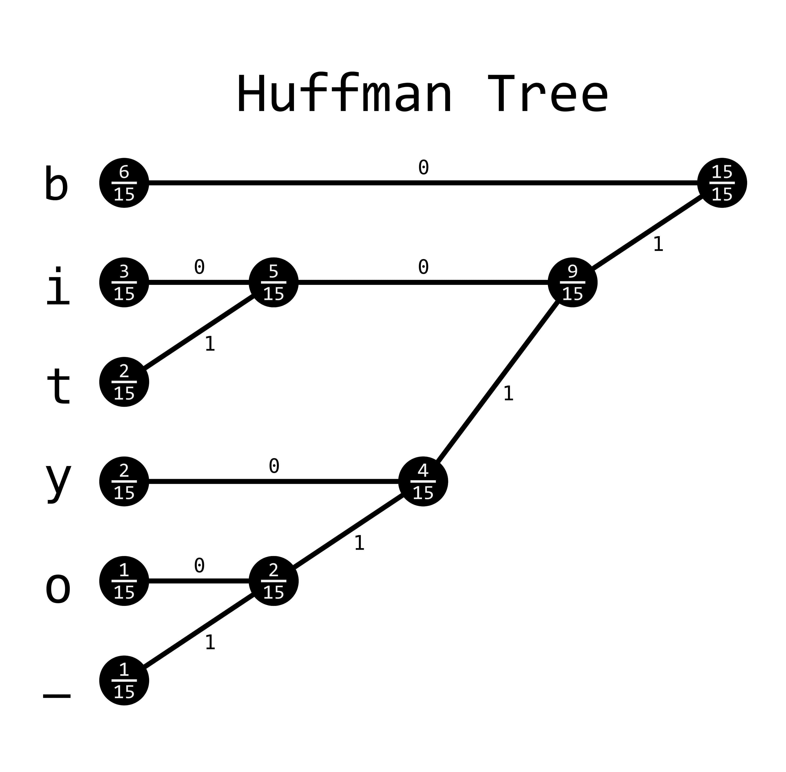

# 霍夫曼编码

> [`www.algorithm-archive.org/contents/huffman_encoding/huffman_encoding.html`](https://www.algorithm-archive.org/contents/huffman_encoding/huffman_encoding.html)

如果有一种数据压缩方法能风靡全球，那将是霍夫曼编码。事实上，这正是让我开始接触计算方法的方法。我清楚地记得坐在我的数据压缩课上，谈论伟大的信息理论家克劳德·香农和罗伯特·法诺，突然我的教授介绍了一个新面孔：大卫·霍夫曼。他设法从该领域领导者的方法中提取核心，创建了一种更容易理解和实现的数据压缩方法，同时提供了更稳健的结果，而且显然这一切都是为了一个学校项目而做的！

就在那个时刻，我知道我永远不会有什么成就。从那时起，我就接受了这个事实，并继续前进。

霍夫曼编码源于数据压缩部分中描述的问题。我们有一个字符串，想要将其编码成比特。霍夫曼编码确保我们的编码比特串尽可能小，同时不丢失任何信息。因为它既是无损的，又保证了可能的最小比特长度，所以在大多数情况下，它直接取代了香农编码和香农-法诺编码，这有点奇怪，因为这种方法是在霍夫曼从法诺那里上课时发明的！

在原则上，这个想法相当直接，但在实践中编码却有点困难。通过创建输入字母表的二叉树，每个分支都可以通过为每个子节点分配一个二进制值，并从根节点开始读取叶节点中的字符来提供一个唯一的比特表示。

因此，现在的问题是：我们如何创建一个二叉树？好吧，我们是这样从下往上构建的：

1.  按照字符在输入比特串中出现的频率对所有字符进行排序，频率最高的字符位于列表顶部。务必记录频率！

1.  将最小的两个值相加，创建一个新的节点，并赋予它一个新的频率。

1.  重复执行步骤 2，直到树完成。

1.  从根节点开始，反向读取树，并将最终的比特串码字连接起来。保留所有码字，并将它们放入最终的码字集中（有时称为码簿）。

1.  使用码簿对短语进行编码。

就这样。这是一张短语`bibbity_bobbity`可能看起来像的图片：



这将创建一个看起来像这样的码簿：

| 字符 | 比特表示 |
| --- | --- |
| *b* | 0 |
| *i* | 100 |
| *t* | 101 |
| *y* | 110 |
| *o* | 1110 |
| *_* | 1111 |

`bibbity_bobbity` 转换为 `01000010010111011110111000100101110`。正如提到的，这使用了编码所需的最少位数。这个算法既概念简单又经得起验证的实用性对我来说相当非凡，这也是为什么霍夫曼编码在我心中始终占据一个特殊位置。

## 视频解释

这里有一个关于霍夫曼编码的快速视频解释：

[`www.youtube-nocookie.com/embed/wHyUxTc2Ohk`](https://www.youtube-nocookie.com/embed/wHyUxTc2Ohk)

## 示例代码

在代码中，这可能会有些棘手。它需要一个方法来持续地对节点进行排序，因为你向系统中添加越来越多的节点。在某些语言中，使用优先队列来做这件事是最直接的方法，但根据语言的不同，这可能会更合适或不太合适。此外，为了反向读取树，需要实现某种形式的深度优先搜索。你使用栈还是直接递归也取决于语言，但在大多数情况下，递归方法更容易理解。

```
using Test

# This is for the PriorityQueue
using DataStructures

struct Leaf
    weight::Int64
    key::Char
end

struct Branch
    right::Union{Leaf, Branch}
    left::Union{Leaf, Branch}
    weight::Int64
end

const Node = Union{Leaf, Branch}

function codebook_recurse!(leaf::Leaf, code::String,
                          dict::Dict{Char,String})
    dict[leaf.key] = code
end

function codebook_recurse!(branch::Branch, code::String,
                          dict::Dict{Char,String})
    codebook_recurse!(branch.left, string(code, "1"), dict)
    codebook_recurse!(branch.right, string(code, "0"), dict)
end

# This will depth-first search through the tree
# to create bitstrings for each character.
# Note: Any depth-first search method will work
# This outputs encoding Dict to be used for encoding
function create_codebook(n::Node)
    codebook = Dict{Char,String}()
    if isa(n, Leaf)
        codebook[n.key]="0"
    else
        codebook_recurse!(n, "", codebook)
    end
    return codebook
end

# This outputs huffman tree to generate dictionary for encoding
function create_tree(phrase::String)

    # creating weights
    weights = PriorityQueue()
    for i in phrase
        temp_string = string(i)
        if (haskey(weights, temp_string))
            weights[temp_string] += 1
        else
            weights[temp_string] = 1
        end
    end

    # Creating all nodes to iterate through
    nodes = PriorityQueue{Node, Int64}()
    while(length(weights) > 0)
        weight = peek(weights)[2]
        key = dequeue!(weights)[1]
        temp_node = Leaf(weight, key)
        enqueue!(nodes, temp_node, weight)
    end

    while(length(nodes) > 1)
        node1 = dequeue!(nodes)
        node2 = dequeue!(nodes)
        temp_node = Branch(node1, node2, node1.weight + node2.weight)
        enqueue!(nodes, temp_node, temp_node.weight)
    end

    huffman_tree = dequeue!(nodes)
    return huffman_tree

end

function encode(codebook::Dict{Char, String}, phrase::String)
    final_bitstring = ""
    for i in phrase
        final_bitstring = final_bitstring * codebook[i]
    end

    return final_bitstring
end

function decode(huffman_tree::Node, bitstring::String)
    current = huffman_tree
    final_string = ""
    for i in bitstring
        if isa(huffman_tree, Branch)
            if (i == '1')
                current = current.left
            else
                current = current.right
            end

            if (!isa(current, Branch))
                final_string *= string(current.key)
                current = huffman_tree
            end
        else
            final_string *= string(huffman_tree.key)
        end
    end

    return final_string
end

function two_pass_huffman(phrase::String)
    huffman_tree = create_tree(phrase)
    codebook = create_codebook(huffman_tree)
    bitstring = encode(codebook, phrase)
    final_string = decode(huffman_tree, bitstring)
    return final_string
end

@testset "b-string tests" begin
    @test two_pass_huffman("b") == "b"
    @test two_pass_huffman("bbbbbbbb") == "bbbbbbbb"
    @test two_pass_huffman("bibbity bobbity") == "bibbity bobbity"
end 
```

```
extern crate itertools;

use std::cmp::{Ord, Ordering, PartialOrd};
use std::collections::{BinaryHeap, HashMap};

use itertools::Itertools;

#[derive(Debug)]
enum HuffmanTree {
    Branch {
        count: i32,
        left: Box<HuffmanTree>,
        right: Box<HuffmanTree>,
    },
    Leaf {
        count: i32,
        value: char,
    },
}

impl PartialEq for HuffmanTree {
    fn eq(&self, other: &Self) -> bool {
        self.count() == other.count()
    }
}

impl Eq for HuffmanTree {}

impl PartialOrd for HuffmanTree {
    fn partial_cmp(&self, other: &Self) -> Option<Ordering> {
        other.count().partial_cmp(&self.count())
    }
}

impl Ord for HuffmanTree {
    fn cmp(&self, other: &Self) -> Ordering {
        other.count().cmp(&self.count())
    }
}

#[derive(Debug)]
struct Codebook {
    codebook: HashMap<char, String>,
    tree: HuffmanTree,
}

impl HuffmanTree {
    pub fn from(input: &str) -> Self {
        let counts = input.chars().fold(HashMap::new(), |mut map, c| {
            *map.entry(c).or_insert(0) += 1;
            map
        });
        let mut queue = counts
            .iter()
            .map(|(&value, &count)| HuffmanTree::Leaf { value, count })
            .collect::<BinaryHeap<HuffmanTree>>();

        while queue.len() > 1 {
            let left = queue.pop().unwrap();
            let right = queue.pop().unwrap();
            queue.push(HuffmanTree::Branch {
                count: left.count() + right.count(),
                left: Box::new(left),
                right: Box::new(right),
            })
        }

        queue.pop().expect("The Huffman tree has to have a root")
    }

    pub fn count(&self) -> i32 {
        match *self {
            HuffmanTree::Branch { count, .. } => count,
            HuffmanTree::Leaf { count, .. } => count,
        }
    }

    pub fn make_codebook(self) -> Codebook {
        let mut codebook = HashMap::new();
        self.dfs(String::from(""), &mut codebook);
        Codebook {
            codebook,
            tree: self,
        }
    }

    pub fn decode(&self, input: &str) -> String {
        let mut result = String::from("");
        let mut start = 0;
        while !input[start..].is_empty() {
            start += self.decode_dfs(&input[start..], &mut result);
        }
        result
    }

    fn decode_dfs(&self, input: &str, result: &mut String) -> usize {
        let current = input.chars().next();
        match *self {
            HuffmanTree::Branch { ref left, .. } if current == Some('0') => {
                1 + left.decode_dfs(&input[1..], result)
            }
            HuffmanTree::Branch { ref right, .. } if current == Some('1') => {
                1 + right.decode_dfs(&input[1..], result)
            }
            HuffmanTree::Leaf { value, .. } => {
                result.push(value);
                0
            }
            _ => panic!("Unexpected end of input"),
        }
    }

    fn dfs(&self, code: String, codebook: &mut HashMap<char, String>) {
        match *self {
            HuffmanTree::Branch {
                ref left,
                ref right,
                ..
            } => {
                left.dfs(code.clone() + "0", codebook);
                right.dfs(code.clone() + "1", codebook);
            }
            HuffmanTree::Leaf { value, .. } => {
                codebook.insert(value, code);
            }
        }
    }
}

impl Codebook {
    fn encode(&self, input: &str) -> String {
        input.chars().map(|c| &self.codebook[&c]).join("")
    }

    fn decode(&self, input: &str) -> String {
        self.tree.decode(input)
    }
}

fn main() {
    let input = "bibbity bobbity";

    let tree = HuffmanTree::from(input);
    let codebook = tree.make_codebook();
    let encoded = codebook.encode(input);
    let decoded = codebook.decode(&encoded);

    // Uncomment this line if you want to see the codebook/tree
    // println!("{:#?}", codebook);
    println!("{}", encoded);
    println!("{}", decoded);
} 
```

```
// Made by Guston and edited by Gathros
#include <stdio.h>
#include <stdlib.h>
#include <string.h>
#include <stdbool.h>

struct tree {
    struct tree* left;
    struct tree* right;

    int count;
    char value;
};

struct bitstring_builder {
    char str[257];
    int next_index;
};

struct codebook {
    char* codes[256];
};

struct heap {
    struct tree** data;
    size_t length;
    size_t capacity;
};

bool is_leaf(const struct tree* t) {
    return !t->left && !t->right;
}

void swap(struct tree** lhs, struct tree** rhs) {
    struct tree* tmp = *lhs;
    *lhs = *rhs;
    *rhs = tmp;
}

/* The two concat functions are horribly inefficient */
void concat(char** dst, const char* src) {
    size_t dst_len = strlen(*dst);
    size_t src_len = strlen(src);
    *dst = realloc(*dst, src_len + dst_len + 1);
    strcat(*dst, src);
}

void concat_char(char** dst, char c) {
    size_t len = strlen(*dst);
    *dst = realloc(*dst, len + 2);
    (*dst)[len] = c;
    (*dst)[len + 1] = '\0';
}

char* duplicate(const char* src) {
    size_t length = strlen(src);
    char* dst = malloc(length + 1);
    memcpy(dst, src, length + 1);
    return dst;
}

void heap_push(struct heap* heap, struct tree* value) {
    if (heap->capacity == heap->length) {
        heap->capacity = heap->capacity == 0 ? 4 : heap->capacity * 2;
        heap->data = realloc(heap->data, heap->capacity * sizeof(struct tree*));
    }
    heap->data[heap->length++] = value;

    size_t index = heap->length - 1;
    while (index) {
        size_t parent_index = (index - 1) / 2;
        if (heap->data[parent_index]->count <= heap->data[index]->count) {
            break;
        }

        swap(&heap->data[parent_index], &heap->data[index]);
        index = parent_index;
    }
}

struct tree* heap_pop(struct heap* heap) {
    if (!heap->length) {
        return NULL;
    }

    struct tree* result = heap->data[0];
    swap(&heap->data[0], &heap->data[--heap->length]);

    size_t index = 0;
    for (;;) {
        size_t target = index;
        size_t left = 2 * index + 1;
        size_t right = left + 1;

        if (left < heap->length &&
                heap->data[left]->count < heap->data[target]->count) {
            target = left;
        }

        if (right < heap->length &&
                heap->data[right]->count < heap->data[target]->count) {
            target = right;
        }

        if (target == index) {
            break;
        }

        swap(&heap->data[index], &heap->data[target]);
        index = target;
    }

    return result;
}

void heap_free(struct heap* heap) {
    free(heap->data);
}

struct tree* generate_tree(const char* str) {
    int counts[256] = { 0 };

    for (; *str != '\0'; ++str) {
        counts[(unsigned char)*str] += 1;
    }

    struct heap heap = { 0 };
    for (size_t i = 0; i < sizeof(counts) / sizeof(int); ++i) {
        if (counts[i]) {
            struct tree* tree = calloc(1, sizeof(struct tree));
            tree->value = (char)i;
            tree->count = counts[i];
            heap_push(&heap, tree);
        }
    }

    if (heap.length == 1) {
        struct tree* leaf = heap_pop(&heap);
        struct tree* root = calloc(0, sizeof(struct tree));
        root->left = leaf;
        root->count = leaf->count;
        heap_free(&heap);
        return root;
    }

    while (heap.length > 1) {
        struct tree* left = heap_pop(&heap);
        struct tree* right = heap_pop(&heap);
        struct tree* branch = calloc(1, sizeof(struct tree));
        branch->count = left->count + right->count;
        branch->left = left;
        branch->right = right;
        heap_push(&heap, branch);
    }

    struct tree* root = heap_pop(&heap);
    heap_free(&heap);
    return root;
}

void tree_free(struct tree* tree) {
    if (!tree) return;
    tree_free(tree->left);
    tree_free(tree->right);
    free(tree);
}

void codebook_recurse(const struct tree* tree,
                        struct bitstring_builder* builder,
                        struct codebook* codebook) {
    if (!tree) {
        return;
    }

    if (is_leaf(tree)) {
        builder->str[builder->next_index] = '\0';
        codebook->codes[(unsigned char)tree->value] = duplicate(builder->str);
        return;
    }

    builder->str[builder->next_index++] = '0';
    codebook_recurse(tree->left, builder, codebook);
    builder->next_index -= 1;

    builder->str[builder->next_index++] = '1';
    codebook_recurse(tree->right, builder, codebook);
    builder->next_index -= 1;
}

struct codebook generate_codebook(const struct tree* tree) {
    struct codebook codebook = { .codes = { 0 } };
    struct bitstring_builder builder = { .str = { 0 }, .next_index = 0 };
    codebook_recurse(tree, &builder, &codebook);
    return codebook;
}

void codebook_free(struct codebook* codebook) {
    int size = sizeof(codebook->codes) / sizeof(codebook->codes[0]);
    for (int i = 0; i < size; ++i) {
        free(codebook->codes[i]);
    }
}

const char* get_code(const struct codebook* codebook, char c) {
    return codebook->codes[(unsigned char)c];
}

char* encode(const char* input, struct tree** huffman_tree,
                struct codebook* codebook) {
    *huffman_tree = generate_tree(input);
    *codebook = generate_codebook(*huffman_tree);

    char* result = duplicate(get_code(codebook, *input));

    input += 1;

    for (; *input; ++input) {
        concat(&result, get_code(codebook, *input));
    }

    return result;
}

const char* decode_recurse(const char* input, const struct tree* tree,
                            char** result) {
    if (!tree) {
        return input;
    }

    if (is_leaf(tree)) {
        concat_char(result, tree->value);
        return input;
    }

    if (*input == '0') {
        return decode_recurse(input + 1, tree->left, result);
    } else {
        return decode_recurse(input + 1, tree->right, result);
    }
}

char* decode(const char* input, const struct tree* tree) {
    char* result = calloc(1, 1);
    do {
        input = decode_recurse(input, tree, &result);
    } while (*input);
    return result;
}

int main() {
    struct tree* tree;
    struct codebook codebook;

    char* encoded = encode("bibbity bobbity", &tree, &codebook);
    char* decoded = decode(encoded, tree);

    printf("Codebook:\n");
    for (int i = 0; i < 256; ++i) {
        if (codebook.codes[i]) {
            printf("%c %s\n", (char)i, codebook.codes[i]);
        }
    }

    printf("%s\n", encoded);
    printf("%s\n", decoded);

    tree_free(tree);
    codebook_free(&codebook);
    free(encoded);
    free(decoded);
    return 0;
} 
```

```
import qualified Data.Map as M
import           Data.List (insert, sort)

data Tree a = Leaf Int a
            | Node Int (Tree a) (Tree a)
                   deriving (Show, Eq)

freq :: Tree a -> Int
freq (Leaf i _)   = i
freq (Node i _ _) = i

instance (Eq a) => Ord (Tree a) where
  compare t1 t2 = compare (freq t1) (freq t2)

getFrequencies :: Ord a => [a] -> [(Int, a)]
getFrequencies = toSortedList . M.fromListWith (+) . flip zip (repeat 1)
  where toSortedList = sort . map swap . M.toList
        swap (a, i) = (i, a)

buildTree :: (Ord a) => [a] -> Maybe (Tree a)
buildTree = build . map (uncurry Leaf) . getFrequencies
  where build []         = Nothing
        build [t]        = Just t
        build (t1:t2:ts) = build $ insert (Node (freq t1 + freq t2) t1 t2) ts

data Bit = Zero | One

instance Show Bit where
  show Zero = "0"
  show One = "1"

encode :: (Ord a) => [a] -> (Maybe (Tree a), [Bit])
encode s = (tree, msg)
  where
  tree = buildTree s
  msg = concatMap (table M.!) s
  table = case tree of
    Nothing -> M.empty
    Just t  -> M.fromList $ mkTable (t, [])
  mkTable (Leaf _ a, p)     = [(a, reverse p)]
  mkTable (Node _ t1 t2, p) = concatMap mkTable [(t1,  Zero:p), (t2, One:p)]

decode :: (Ord a) => Maybe (Tree a) -> [Bit] -> [a]
decode Nothing _ = []
decode (Just t) m = path t m
  where path (Leaf _ a) m            = a : path t m
        path (Node _ t1 _) (Zero: m) = path t1 m
        path (Node _ _ t2) (One: m)  = path t2 m
        path _ _                     = []

main = do
  let msg = "bibbity bobbity"
      (tree, encoded) = encode msg
      decoded = decode tree encoded
  putStrLn $ "Endoding \"" ++ msg ++ "\": " ++ concatMap show encoded
  putStrLn $ "Length: " ++ (show $ length encoded)
  putStrLn $ "Decoding: " ++ decoded 
```

##### HuffmanCoding.cs

```
// submitted by Julian Schacher (jspp), thanks to gustorn for the help
using System;
using System.Collections.Generic;
using System.Linq;

namespace HuffmanCoding
{
    public class EncodingResult
    {
        public string BitString { get; set; }
        public Dictionary<char, string> Dictionary { get; set; }
        public HuffmanCoding.Node Tree { get; set; }

        public EncodingResult(string bitString, Dictionary<char, string> dictionary, HuffmanCoding.Node tree)
        {
            this.BitString = bitString;
            this.Dictionary = dictionary;
            this.Tree = tree;
        }
    }

    public class HuffmanCoding
    {
        // The Node class used for the Huffman Tree.
        public class Node : IComparable<Node>
        {
            public Node LeftChild { get; set; }
            public Node RightChild { get; set; }
            public string BitString { get; set; } = "";
            public int Weight { get; set; }
            public string Key { get; set; }

            public bool IsLeaf => LeftChild == null && RightChild == null;

            // Creates a leaf. So just a node is created with the given values.
            public static Node CreateLeaf(char key, int weight) => new Node(key.ToString(), weight, null, null);
            // Creates a branch. Here a node is created by adding the keys and weights of both childs together.
            public static Node CreateBranch(Node leftChild, Node rightChild) => new Node(leftChild.Key + rightChild.Key, leftChild.Weight + rightChild.Weight, leftChild, rightChild);
            private Node(string key, int weight, Node leftChild, Node rightChild)
            {
                this.Key = key;
                this.Weight =  weight;
                this.LeftChild = leftChild;
                this.RightChild = rightChild;
            }

            public int CompareTo(Node other) => this.Weight - other.Weight;
        }

        // Node with biggest value at the top.
        class NodePriorityList
        {
            public int Count => nodes.Count;

            private List<Node> nodes = new List<Node>();

            public NodePriorityList() { }
            public NodePriorityList(List<Node> givenNodes)
            {
                this.nodes = givenNodes.ToList();
                this.nodes.Sort();
            }

            public void Add(Node newNode)
            {
                var index = this.nodes.BinarySearch(newNode);
                if (index < 0)
                    this.nodes.Insert(~index, newNode);
                else
                    this.nodes.Insert(index, newNode);
            }

            public Node Pop()
            {
                var result = this.nodes[0];
                this.nodes.RemoveAt(0);
                return result;
            }
        }

        public EncodingResult Encode(string input)
        {
            var root = CreateTree(input);
            var dictionary = CreateDictionary(root);
            var bitString = CreateBitString(input, dictionary);

            return new EncodingResult(bitString, dictionary, root);
        }

        public string Decode(EncodingResult result)
        {
            var output = "";
            Node currentNode = result.Tree;
            foreach (var bit in result.BitString)
            {
                // Go down the tree.
                if (bit == '0')
                    currentNode = currentNode.LeftChild;
                else
                    currentNode = currentNode.RightChild;

                if (currentNode.IsLeaf)
                {
                    output += currentNode.Key;
                    currentNode = result.Tree;
                }
            }
            return output;
        }

        private Node CreateTree(string input)
        {
            // Create a List of all characters and their count in input by putting them into nodes.
            var nodes = input
                .GroupBy(c => c)
                .Select(n => Node.CreateLeaf(n.Key, n.Count()))
                .ToList();

            // Convert list of nodes to a NodePriorityList.
            var nodePriorityList = new NodePriorityList(nodes);

            // Create Tree.
            while (nodePriorityList.Count > 1)
            {
                // Pop the two nodes with the smallest weights from the nodePriorityList and create a parentNode with the CreateBranch method. (This method adds the keys and weights of the childs together.)
                var leftChild = nodePriorityList.Pop();
                var rightChild = nodePriorityList.Pop();
                var parentNode = Node.CreateBranch(leftChild, rightChild);

                nodePriorityList.Add(parentNode);
            }

            return nodePriorityList.Pop();
        }

        private void CreateDictionary(Node node, string bitString, Dictionary<char, string> localDictionary)
        {
            if (node.IsLeaf)
                localDictionary.Add(node.Key[0], bitString);
            else
            {
                if (node.LeftChild != null)
                    CreateDictionary(node.LeftChild, bitString + '0', localDictionary);
                if (node.RightChild != null)
                    CreateDictionary(node.RightChild, bitString + '1', localDictionary);
            }
        }

        private Dictionary<char, string> CreateDictionary(Node root)
        {
            // We're using a string instead of a actual bits here, since it makes the code somewhat more readable and this is an educational example.
            var dictionary = new Dictionary<char, string>();
            CreateDictionary(root, "", dictionary);
            return dictionary;
        }

        private string CreateBitString(string input, Dictionary<char, string> dictionary)
        {
            // We're using a string right here. While no compression is achieved with a string, it's the easiest way to display what the compressed result looks like. Also this is just an educational example.
            var bitString = "";
            foreach (var character in input)
                bitString += dictionary[character];

            return bitString;
        }
    }
} 
```

##### Program.cs

```
// submitted by Julian Schacher (jspp), thanks to gustorn for the help
using System.Collections;
using System.Collections.Generic;

namespace HuffmanCoding
{
    class Program
    {
        static void Main(string[] args)
        {
            var huffmanCoding = new HuffmanCoding();

            var result = huffmanCoding.Encode("bibbity bobbity");
            // The bitStrings are just strings and provide no compression. Look in HuffmanCoding.cs for explanation.
            // Print dictionary.
            foreach (var entry in result.Dictionary)
                System.Console.WriteLine($"{entry.Key}  {entry.Value}");
            // Print BitString.
            System.Console.WriteLine($"{result.BitString} count: {result.BitString.Length}");

            var originalString = huffmanCoding.Decode(result);
            System.Console.WriteLine(originalString);
        }
    }
} 
```

```
local function frequency_array(str)
  -- Collect all frequency values into a dict
  local map = {}
  for c in str:gmatch(".") do -- Iterate over each character in str
    map[c] = (map[c] or 0) + 1 -- Increment map[c] (default 0) by 1
  end

  -- We have a dict of frequencies but we want it in a sorted list
  -- Dump each key value pair into an array
  local arr = {}
  for k, v in pairs(map) do
    arr[#arr + 1] = {k, v}
  end
  table.sort(arr, function(a, b) return a[2] > b[2] end) -- Sort by frequency descending
  return arr
end

local function build_huffman_tree(message)

  if #message == 0 then return end

  local freq = frequency_array(message)

  while #freq > 1 do -- Repeat until we have only 1 node

    -- Take two of the least frequent nodes
    local node1, node2 = table.remove(freq), table.remove(freq)

        -- Group node values in first index, and sum of node frequencies in second
    local node3 = { {node1[1], node2[1] }, node1[2] + node2[2] }

    local i = 1
    while i <= #freq and freq[i][2] <= node3[2] do -- Sorted insertion, faster than inserting then sorting again
      i = i + 1
    end

    table.insert(freq, i, node3)
  end

  return freq[1][1] -- Return value of only element in freq array
end

local function _create_codebook(node, codebook, code)
  if not node then
    return
  elseif type(node) == "string" then
    codebook[node] = code -- if node is a leaf then add it to codebook
  else
    _create_codebook(node[1], codebook, code .. "0") -- Left side
    _create_codebook(node[2], codebook, code .. "1") -- Right side
  end
end

local function create_codebook(tree)
  local codebook = {}
  _create_codebook(tree, codebook, "")
  return codebook
end

local function huffman_encode(codebook, message)
  local encoded_chars = {}
  for c in message:gmatch(".") do -- Iterate over each character in message
    encoded_chars[#encoded_chars + 1] = codebook[c]
  end
  return table.concat(encoded_chars) -- table.concat to avoid slow string bufferin
end

local function _huffman_decode(node, bitstring, i)
  if type(node) == "string" then
    return node, i -- If it's a leaf node then return the value along with the next bit to read
  end
  if bitstring:sub(i, i) == "0" then
    return _huffman_decode(node[1], bitstring, i + 1) -- If it's 0 traverse down the left side
  elseif bitstring:sub(i, i) == "1" then
    return _huffman_decode(node[2], bitstring, i + 1) -- If it's 1 traverse down the right side
  end
end

local function huffman_decode(tree, bitstring)
  -- i is the current position in the bitstring, we can track which bit we are to look at next without using string.sub
  local decoded_chars, i = {}, 1
  while i <= #bitstring do
    decoded_chars[#decoded_chars + 1], i = _huffman_decode(tree, bitstring, i)
  end

  return table.concat(decoded_chars)
end

local message = "bibbity_bobbity"

local tree = build_huffman_tree(message)
local codebook = create_codebook(tree)

local bitstring = huffman_encode(codebook, message)
print("Encoded: " .. bitstring)

print("Decoded: " .. huffman_decode(tree, bitstring)) 
```

```
#include <algorithm>
#include <array>
#include <bitset>
#include <cassert>
#include <cctype>
#include <cstddef>
#include <limits>
#include <memory>
#include <string>
#include <utility>
#include <vector>

#include <iostream>

using std::begin;
using std::end;

namespace huffman {

[[noreturn]] inline void unreachable() {
  std::cerr << "this should never happen\n";
  std::abort();
}

// --- interface ---
class codebook {
  struct node {
    int frequency;

    node(int freq) : frequency(freq) {}
    virtual ~node() = 0;
  };

  // never null
  using node_ptr = std::unique_ptr<node const>;
  using bitstring = std::vector<bool>;

  // this is a flatmap between char and a bitstring
  // there should only ever be one character with a given
  // value at any time.
  using encoder_t = std::vector<std::pair<char, bitstring>>;

  struct leaf final : node {
    char key;

    leaf(int freq, char key) : node(freq), key(key) {}
  };

  struct branch final : node {
    node_ptr lhs;
    node_ptr rhs;

    branch(node_ptr lhs, node_ptr rhs)
        : node(lhs->frequency + rhs->frequency), lhs(std::move(lhs)),
          rhs(std::move(rhs)) {}
  };

  // this allows us to share [codebook]s among encoded strings
  struct data {
    node_ptr decoder;
    encoder_t encoder;
  };
  std::shared_ptr<data const> underlying_;

public:
  template <typename Iter>
  codebook(Iter const first, Iter const last);

  template <typename Iter>
  std::vector<bool> encode(Iter first, Iter last) const;

  template <typename Iter>
  std::string decode(Iter first, Iter last) const;
};

struct encoded_string {
  codebook codes;
  std::vector<bool> string;

  explicit encoded_string(std::string const& s)
      : codes(begin(s), end(s)), string(codes.encode(begin(s), end(s))) {}

  encoded_string(codebook codes, std::string const& s)
      : codes(codes), string(codes.encode(begin(s), end(s))) {}

  std::string decoded() const {
    return codes.decode(begin(string), end(string));
  }
};

// --- implementation ---
inline codebook::node::~node() {}

inline std::vector<bool> with_new_bit(std::vector<bool> bits, bool b) {
  bits.push_back(b);
  return bits;
}

template <typename Iter>
codebook::codebook(Iter const first, Iter const last) {
  struct helper {
    static node_ptr make_decoder(Iter const first, Iter const last) {
      // in this part of the function, we build up a frequency list
      // sorted by frequency, descending
      auto freq = std::vector<leaf>();

      std::for_each(first, last, &freq {
        auto const it = std::find_if(
            begin(freq), end(freq), c { return p.key == c; });
        if (it != end(freq)) {
          // it's already in the list
          it->frequency += 1;
        } else {
          // it's not already in the list
          freq.emplace_back(1, c);
        }
      });

      if (freq.empty()) {
        throw std::invalid_argument("attempted to codebook an empty range");
      }

      std::sort(begin(freq), end(freq), [](auto const& lhs, auto const& rhs) {
        return lhs.frequency > rhs.frequency;
      });

      auto ret = std::vector<std::unique_ptr<node>>();
      std::transform(
          begin(freq), end(freq), std::back_inserter(ret), [](auto const l) {
            return std::make_unique<leaf>(l);
          });

      while (ret.size() > 1) {
        auto rhs = std::move(ret.back());
        ret.pop_back();
        auto lhs = std::move(ret.back());
        ret.pop_back();

        auto new_node =
            std::make_unique<branch>(std::move(lhs), std::move(rhs));
        auto const new_freq = new_node->frequency;

        // look for the first element with a smaller frequency
        auto const it =
            std::find_if(begin(ret), end(ret), new_freq {
              return n->frequency < new_freq;
            });
        // and insert the new_node before that element
        ret.insert(it, std::move(new_node));
        // in this way, we keep the list sorted by frequency
      }

      return std::move(ret.back());
    }

    static void
    encoder_rec(node const* cur, std::vector<bool> bits, encoder_t& out) {
      if (auto l = dynamic_cast<leaf const*>(cur)) {
        out.push_back(std::make_pair(l->key, std::move(bits)));
      } else if (auto b = dynamic_cast<branch const*>(cur)) {
        encoder_rec(b->lhs.get(), with_new_bit(bits, 0), out);
        encoder_rec(b->rhs.get(), with_new_bit(std::move(bits), 1), out);
      } else {
        unreachable();
      }
    }

    static encoder_t make_encoder(node const& decoder) {
      auto ret = encoder_t();

      encoder_rec(&decoder, std::vector<bool>(), ret);

      return ret;
    }
  };

  auto decoder = helper::make_decoder(first, last);
  auto encoder = helper::make_encoder(*decoder);
  underlying_ = std::make_shared<data const>(
      data{std::move(decoder), std::move(encoder)});
}

template <typename Iter>
std::vector<bool> codebook::encode(Iter const first, Iter const last) const {
  std::vector<bool> ret;

  auto& encoder = underlying_->encoder;
  std::for_each(first, last, &ret, &encoder {
    auto const it =
        std::find_if(begin(encoder), end(encoder), c {
          return p.first == c;
        });
    if (it != end(encoder)) {
      auto const& code = it->second;
      std::copy(begin(code), end(code), std::back_inserter(ret));
    } else {
      throw std::invalid_argument(
          "The range has a character which was not in the huffman set");
    }
  });

  return ret;
}

template <typename Iter>
std::string codebook::decode(Iter const first, Iter const last) const {
  std::string ret;

  node const* const top = underlying_->decoder.get();

  // returns a pair:
  // the second member is the decoded character
  // the first member is the place we've gotten to in the range
  // i.e., if [0] is an 'a', and we have
  // it, last) = { 0, 1, 1, 0 }
  // we return (it', 'a') such that
  // [it', last) = { 1, 1, 0 }
  auto decode_single =
      [top -> std::pair<Iter, char> {
    node const* current_node = top;

    for (; it != last; ++it) {
      if (auto l = dynamic_cast<leaf const*>(current_node)) {
        return std::make_pair(it, l->key);
      } else if (auto b = dynamic_cast<branch const*>(current_node)) {
        if (*it) {
          current_node = b->rhs.get();
        } else {
          current_node = b->lhs.get();
        }
      } else {
        unreachable();
      }
    }

    if (auto l = dynamic_cast<leaf const*>(current_node)) {
      return std::make_pair(last, l->key);
    } else {
      throw std::invalid_argument(
          "The range was not encoded with this huffman set");
    }
  };

  for (auto it = first; it != last;) {
    auto p = decode_single(it, last);
    it = p.first;
    ret.push_back(p.second);
  }

  return ret;
}

} // namespace huffman

int main() {
  std::string to_be_encoded = R"(bibbity bobbity)";

  auto encoded = huffman::encoded_string(to_be_encoded);

  std::cout << "Encoded, the string looks like: ";
  for (bool b : encoded.string) {
    std::cout << b;
  }
  std::cout << "\nand decoded, the string looks like: " << encoded.decoded();
  std::cout << "\n\nAs opposed to the original, which is "
            << to_be_encoded.size() * 8 << " bits, the encoded has size "
            << encoded.string.size() << ".\n";
} 
```

```
;; earthfail
(ns experiments.core)

;; get a vector with chars and frequencies

(defn tree-string [st]
  "take a string st and return the huffmantree with the frequency of
   each character included"
  ;; vector of [character frequency] pair
  ;; for every char in string, added it to hash-map
  ;; with value one if it doesn't exist or increment its value
  (def cf-vec (vec
               (reduce (fn [m c]
                         (assoc m c (inc (get m c 0))))
                       {}
                       st)))
  ;; make a sorted list with nodes with bigger frequencies first
  ;; take the last two which will help in dividing the tree
  ;; the first and last elements before and after
  ;; the smallest two in the tree shouldn't change
  (loop [tree (sort-by last > cf-vec)]
    (if (< (count tree) 2)
      (first tree) ; only of tree is one node or nil
      (let [sorted-tree (sort-by last > tree)
            mid (take-last 2 sorted-tree)
            set-mid (set mid)
            func (complement (partial contains? set-mid))
            firsty (take-while func tree)
            [middle lasty] (split-at 2
                                     (drop-while func tree))]
        (recur
         (concat
          firsty
          ;; make a list with the two element in one list and
          ;; the sum of their frequencies e.g
          ;; '(((node1 f1) (node2 f2)) f1+f2)
          (list (list middle (reduce #(+ %1 (last %2)) 0 middle)))
          lasty))))))

(defn remove-freq [tree]
  "remove the frequencies in the huffmantree tree"
  (cond
    (char? tree) tree                 ; check if this is a branch
    ;; if the tree is a node and frequency then ignore frequency
    (integer? (second tree)) (remove-freq (first tree)) ;remove the frequency
    ;; if the tree consists of two nodes then apply to both and combine
    :else (list (remove-freq (first tree))
                (remove-freq (second tree)))))

(defn hash-tree [tree]
  "make a hashmap with code for each letter as key and the letter as
  value"
  (cond
    (char? tree) {"" tree}
    :else
    (let [left-map (hash-tree (first tree))
          right-map (hash-tree (second tree))
          func #(apply hash-map         ; apply hash-map because
                                        ; interleave return a seq
                       (interleave
                        (map (partial str %2) (keys %1)) ;add 0 or 1
                                        ;to the start
                                        ;of the keys
                        (vals %1)))]
      ;; add "0" to the keys of left nodes and "1" to the right nodes
      (merge (func left-map "0") (func right-map "1")))))

(defn coder [s hash-coder]
  "take a string s and return a coded string"
  (apply str (map hash-coder s)))

(defn decoder [s hash-decoder]
  "takes a string s and a hash-map hash-decoder and decode s"
  ;; code keyword in hashmap is for storing codes untill they are
  ;; complete and can be decoded with the decoder
  (get (reduce (fn [m code]             ; reduce return {:message
                                        ; message,:code _}
                 (let [new-code (str (m :code) code)]
                   (if-let  [letter (get hash-decoder new-code)]
                     ;; if there is a letter then add it to :message
                     ;; and revert :code to empty
                     (assoc (update m :message #(str % letter))
                            :code "")
                     ;; if there is not a letter then just add the
                     ;; code letter to the :code
                     (update m :code #(str % code)))))
               {:message "",:code ""}
               s)
       :message))           ;extract :message  value
;; ----------------EXAMPLE----------------
(def st "(bibbity bobbity)")

(def hash-decoder (->>
                   st
                   tree-string
                   remove-freq
                   hash-tree))
(def hash-coder (clojure.set/map-invert hash-decoder))
(println "coding...")
(def code (coder st hash-coder))
(clojure.pprint/pprint code)

(println "\ndecoding...")
(clojure.pprint/pprint (decoder code hash-decoder)) 
```

```
# Huffman Encoding
# Python 2.7+
# Submitted by Matthew Giallourakis

from collections import Counter

# constructs the tree
def build_huffman_tree(message):

    # get sorted list of character and frequency pairs
    frequencies = Counter(message)
    trees = frequencies.most_common()

    # while there is more than one tree
    while len(trees) > 1:

        # pop off the two trees of least weight from the trees list
        tree_left,weight_left = trees.pop()
        tree_right,weight_right = trees.pop()

        # combine the nodes and add back to the nodes list
        new_tree = [tree_left, tree_right]
        new_weight = weight_left + weight_right

        # find the first tree that has a weight smaller than new_weight and returns its index in the list
        # If no such tree can be found, use len(trees) instead to append
        index = next((i for i, tree in enumerate(trees) if tree[1] < new_weight), len(trees))

        # insert the new tree there
        trees.insert(index, (new_tree, new_weight))

    # Return an empty list if the message was empty, else the tree
    huffman_tree = [] if not trees else trees[0][0]
    return huffman_tree

# constructs the mapping with recursion
def build_codebook(tree, code=''):
    # Check whether our tree contains more than 1 element or not
    if not tree:
        return []
    elif type(tree) != list:
        return [(tree, '0')]

    codebook = []

    # split the tree
    left_tree, right_tree = tree

    # if the left node has children, find the mapping of those children
    # else pair the character with the current code + 0
    if type(left_tree) is list:
        codebook += build_codebook(left_tree, code+'0')
    else:
        codebook.append((left_tree, code+'0'))

    # if the right node has children, find the mapping of those children
    # else pair the character with the current code + 1
    if type(right_tree) is list:
        codebook += build_codebook(right_tree, code+'1')
    else:
        codebook.append((right_tree, code+'1'))
    return codebook

# encodes the message
def huffman_encode(codebook, message):

    encoded_message = ''

    # build a char -> code dictionary
    forward_dict = dict(codebook)

    # replace each character with its code
    for char in message:
        encoded_message += forward_dict[char]

    return encoded_message

# decodes a message
def huffman_decode(codebook, encoded_message):

    decoded_message = ''
    key = ''

    # build a code -> char dictionary
    inverse_dict = dict([(v, k) for k, v in codebook])

    # for each bit in the encoding
    # if the bit is in the dictionary, replace the bit with the paired character
    # else look at the bit and the following bits together until a match occurs
    # move to the next bit not yet looked at
    for index, bit in enumerate(encoded_message):
        key += bit
        if key in inverse_dict:
            decoded_message += inverse_dict[key]
            key = ''

    return decoded_message

def main():

    # test example
    message = 'bibbity_bobbity'
    tree = build_huffman_tree(message)
    codebook = build_codebook(tree)
    encoded_message = huffman_encode(codebook, message)
    decoded_message = huffman_decode(codebook, encoded_message)

    print('message: ' + message)
    print('huffman tree: ' + str(tree))
    print('codebook: ' + str(codebook))
    print('encoded message: ' + encoded_message)
    print('decoded message: ' + decoded_message)

    # prints the following:
    #
    #  message: bibbity_bobbity
    #  huffman_tree: ['b', [[['_', 'o'], 'y'], ['t', 'i']]]
    #  codebook: [('b', '0'), ('_', '1000'), ('o', '1001'),
    #             ('y', '101'), ('t', '110'), ('i', '111')]
    #  encoded_message: 01110011111010110000100100111110101
    #  decoded_message: bibbity_bobbity

if __name__ == '__main__':
    main() 
```

```
function encode(str) {
  const tree = createTree(str);
  const codebook = createCodebook(tree);
  return {
    string: [...str].map(c => codebook[c]).join(""),
    tree,
    codebook
  };

  function createTree(str) {
    const chars = [...str];
    const charCounts = chars.reduce((counts, char) => {
      counts[char] = (counts[char] || 0) + 1;
      return counts;
    }, {});

    const nodes = Object.entries(charCounts).map(([key, weight]) => ({ key, weight }));
    const priorityQueue = makeQueue(nodes);
    while (priorityQueue.data.length > 1) {
      const left = priorityQueue.dequeue();
      const right = priorityQueue.dequeue();
      priorityQueue.enqueue({ weight: left.weight + right.weight, left, right });
    }
    return priorityQueue.dequeue();
  }

  function createCodebook(tree) {
    return recurse(tree, "", {});

    function recurse(node, bitstring, dict) {
      if (!node.left && !node.right) {
        dict[node.key] = bitstring;
      } else {
        if (node.left) {
          recurse(node.left, bitstring + "0", dict);
        }

        if (node.right) {
          recurse(node.right, bitstring + "1", dict);
        }
      }
      return dict;
    }
  }
}

function decode(bitstring, tree) {
  const result = [];
  let node = tree;

  for (const bit of [...bitstring]) {
    node = bit === "0" ? node.left : node.right;
    if (!node.left && !node.right) {
      result.push(node.key);
      node = tree;
    }
  }

  return result.join("");
}

// This queue implementation is horribly inefficient, but a proper, heap-based implementation would
// be longer that the algorithm itself
function makeQueue(iterable) {
  return {
    data: [...iterable].sort((a, b) => a.weight - b.weight),
    enqueue(value) {
      const target = this.data.findIndex(x => x.weight > value.weight);
      if (target === -1) {
        this.data.push(value);
      } else {
        this.data = [...this.data.slice(0, target), value, ...this.data.slice(target)];
      }
    },
    dequeue() {
      return this.data.shift();
    }
  };
}

const encoded = encode("bibbity bobbity");
const decoded = decode(encoded.string, encoded.tree);
console.log(encoded.string);
console.log(decoded); 
```

```
import java.util.*;

class Huffman {
    public static void main(String[] args) {
        HuffmanTree huffmanTree = new HuffmanTree("bibbity_bobbity");
        huffmanTree.createTree();
        String encoded = huffmanTree.encode();
        System.out.println("Encoded String: " + encoded);
        System.out.println("Decoded String: " + huffmanTree.decode(encoded));
    }
}

class TreeNode {
    String letter = "";
    int frequency = 0;
    TreeNode left = null, right = null;

    public TreeNode(String letter, int frequency) {
        this.letter = letter;
        this.frequency = frequency;
    }

    public TreeNode(int frequency, TreeNode left, TreeNode right) {
        this.frequency = frequency;
        this.left = left;
        this.right = right;
    }
}

class HuffmanTree {
    private Map<String, Integer> frequencyMap = new HashMap<>();
    private Map<String, String> codeBook = new HashMap<>(), reverseCodeBook = new HashMap<>();
    private TreeNode root;
    private String stringToEncode;

    public HuffmanTree(String stringToEncode) {
        this.stringToEncode = stringToEncode;
    }

    public void createTree() {
        for (int i = 0; i < stringToEncode.length(); i++) {
            String key = Character.toString(stringToEncode.charAt(i));
            if (!frequencyMap.containsKey(key)) {
                frequencyMap.put(key, 1);
            } else {
                int frequency = frequencyMap.get(key) + 1;
                frequencyMap.replace(key, frequency);
            }
        }
        Queue<TreeNode> priorityQueue = new PriorityQueue<>(Comparator.comparingInt(o -> o.frequency));
        for (Map.Entry<String, Integer> m : frequencyMap.entrySet()) {
            priorityQueue.add(new TreeNode(m.getKey(), m.getValue()));
        }
        while (priorityQueue.size() > 1) {
            TreeNode left = priorityQueue.remove();
            TreeNode right = priorityQueue.remove();
            priorityQueue.add(new TreeNode(left.frequency + right.frequency, left, right));
        }
        root = priorityQueue.remove();
    }

    private void traverse(TreeNode node, StringBuilder code) {
        if (node.left == null && node.right == null) {
            codeBook.put(node.letter, code.toString());
        }
        if (node.left != null) {
            traverse(node.left, code.append(0));
            code.deleteCharAt(code.length() - 1);
        }
        if (node.right != null) {
            traverse(node.right, code.append(1));
            code.deleteCharAt(code.length() - 1);
        }
    }

    public void printCodeBook() {
        System.out.println("Code Book");
        for (Map.Entry<String, String> m : codeBook.entrySet()) {
            System.out.println(m.getKey() + "\t" + m.getValue());
        }
        System.out.println();
    }

    private void CodeBookReverse() {
        for (Map.Entry<String, String> m : codeBook.entrySet()) {
            reverseCodeBook.put(m.getValue(), m.getKey());
        }
    }

    public String encode() {
        traverse(root, new StringBuilder());
        StringBuilder encode = new StringBuilder();
        for (int i = 0; i < stringToEncode.length(); i++) {
            String k = Character.toString(stringToEncode.charAt(i));
            encode.append(codeBook.get(k));
        }
        printCodeBook();
        return encode.toString();
    }

    public String decode(String encoded) {
        StringBuilder decoded = new StringBuilder(), key = new StringBuilder();
        CodeBookReverse();
        for (int i = 0; i < encoded.length(); i++) {
            key = key.append(encoded.charAt(i));
            if (reverseCodeBook.containsKey(key.toString())) {
                decoded.append(reverseCodeBook.get(key.toString()));
                key = new StringBuilder();
            }
        }
        return decoded.toString();
    }
} 
```

```
package main

import (
    "container/heap"
    "fmt"
)

type node struct {
    freq  int
    char  rune
    left  *node
    right *node
}

type codebook map[rune]string
type nodeHeap []*node

func (n nodeHeap) Len() int           { return len(n) }
func (n nodeHeap) Less(i, j int) bool { return n[i].freq > n[j].freq }
func (n nodeHeap) Swap(i, j int)      { n[i], n[j] = n[j], n[i] }

func (n *nodeHeap) Push(x interface{}) {
    if node, ok := x.(*node); ok {
        *n = append(*n, node)
    } else {
        fmt.Printf("I got a node of Type %T\n", x)
    }
}

func (n *nodeHeap) Pop() interface{} {
    old := *n
    l := len(old)
    x := old[l-1]
    *n = old[0 : l-1]
    return x
}

func buildTree(message string) *node {
    freqMap := make(map[rune]*node)
    h := new(nodeHeap)
    heap.Init(h) // really needed?

    for _, char := range message {
        if _, ok := freqMap[char]; ok {
            freqMap[char].freq++
        } else {
            newNode := new(node)
            newNode.freq = 1
            newNode.char = char
            freqMap[char] = newNode
            heap.Push(h, newNode)
        }
    }

    for h.Len() > 1 {
        left, right := h.Pop().(*node), h.Pop().(*node)
        branch := new(node)
        branch.freq = right.freq + left.freq
        branch.left = left
        branch.right = right
        heap.Push(h, branch)
    }

    root := heap.Pop(h).(*node)
    return root
}

func codebookRecurse(node *node, cb *codebook, code []rune) {
    if node == nil {
        return
    }

    if node.left == nil && node.right == nil {
        (*cb)[node.char] = string(code)
    }

    code = append(code, '0')
    codebookRecurse(node.left, cb, code)
    code = append(code[:len(code)-1], '1')
    codebookRecurse(node.right, cb, code)
}

func encode(message string) (string, *node, codebook) {
    ret := ""
    root := buildTree(message)
    cb := generateCodebook(root)
    for _, char := range message {
        ret += cb[char]
    }

    return ret, root, cb
}

func decode(message string, root *node) string {
    cur := root
    ret := ""

    for _, char := range message {
        if cur == nil {
            return message
        }

        switch string(char) {
        case "0":
            if cur.left == nil {
                ret += string(cur.char)
                cur = root.left
            } else {
                cur = cur.left
            }
        case "1":
            if cur.right == nil {
                ret += string(cur.char)
                cur = root.right
            } else {
                cur = cur.right
            }
        }
    }

    if cur.char != 0 {
        ret += string(cur.char)
    }

    return ret
}

func generateCodebook(root *node) codebook {
    cb := make(codebook)
    codeArr := make([]rune, 0)
    codebookRecurse(root, &cb, codeArr)
    return cb
}

func main() {
    enc, root, cb := encode("bibbity_bobbity")
    fmt.Println("Codebook:")
    for r, c := range cb {
        fmt.Println(string(r), "->", c)
    }
    fmt.Println("\nEncoded:", enc)
    fmt.Println("Decoded:", decode(enc, root))
} 
```

```
.intel_syntax noprefix

# System V calling convention cheatsheet
# Params: rdi, rsi, rdx, rcx, r8, r9, xmm0-7
# Return: rax (int 64 bits), rax:rdx (int 128 bits), xmm0 (float)
# Callee cleanup: rbx, rbp, r12-15
# Scratch: rax, rdi, rsi, rdx, rcx, r8, r9, r10, r11

.section .rodata
  text:       .string "bibbity bobbity"
  original:   .string "Original message: %s\n"
  encoded:    .string "Encoded message: "
  decoded:    .string "Decoded message: %s\n"

  .equ bitstr_len,       32
  .equ bitstr_size,      40
  .equ codebook_size,    256 * bitstr_size

  .equ tree_left,        0
  .equ tree_right,       8
  .equ tree_count,       16
  .equ tree_value,       20
  .equ tree_size,        24

  .equ heap_len,         0
  .equ heap_data,        4
  .equ heap_size,        512 * 8 + 16         # 512 ptrs + 4 byte length + 12 byte padding
  .equ counts_size,      256 * 4

  .equ msg_len,          0
  .equ msg_data,         8
.section .text
  .global main
  .extern printf, calloc, malloc, memset, puts

main:
  push   r12
  push   r13
  sub    rsp, codebook_size + 16              # 8 extra bytes for the Huffman-tree ptr, 8 bytes for padding

  # Print the original text
  mov    rdi, OFFSET original
  mov    rsi, OFFSET text
  xor    rax, rax
  call   printf

  # First encode the text. This will also initialize the Huffman-tree and the codebook
  mov    rdi, OFFSET text
  mov    rsi, rsp
  lea    rdx, [rsp + codebook_size]
  call   encode
  mov    r12, rax                             # Save the returned message ptr

  # Print the codebook and the encoded message
  mov    rdi, rsp
  call   print_codebook
  mov    rdi, OFFSET encoded
  xor    rax, rax
  call   printf
  mov    rdi, r12
  call   print_message

  # Decode and print the message
  mov    rdi, r12
  mov    rsi, QWORD PTR [rsp + codebook_size]
  call   decode
  mov    r13, rax
  mov    rdi, OFFSET decoded
  mov    rsi, r13
  xor    rax, rax
  call   printf

  # Free allocated resources
  mov    rdi, r12
  call   free
  mov    rdi, r13
  call   free
  mov    rdi, QWORD PTR [rsp + codebook_size]
  call   free_tree

  add    rsp, codebook_size + 16
  pop    r13
  pop    r12

  # Indiciate success with a 0 exit code
  xor    rax, rax
  ret

# rdi - text
# rsi - codebook ptr
# rdx - Huffman-tree ptr
# RET rax - encoded message ptr
encode:
  push   r12
  push   r13
  push   r14
  mov    r12, rdi                             # Save the original arguments
  mov    r13, rsi
  mov    r14, rdx
  call   generate_tree                        # The text is already in rdi
  mov    QWORD PTR [r14], rax                 # Save the Huffman-tree's root
  mov    rdi, r13                             # Set up the parameters for codebook generation: codebook ptr, Huffman-tree root
  mov    rsi, rax
  call   generate_codebook
  xor    rax, rax
  xor    r14, r14                             # We'll use r14 to keep track of the length of the message
  mov    rcx, r12                             # Make a copy of the pointer to the message to be encoded
encode_calculate_length:
  mov    al, BYTE PTR [rcx]
  test   al, al                               # If we're at the terminating null character then we're ready to encode
  jz     encode_message
  lea    rdx, [rax + 4*rax]                   # We get the codebook entry at the specific index
  lea    r8, [r13 + 8*rdx]
  add    r14, QWORD PTR [r8 + bitstr_len]     # And add the encoded word length to the total
  inc    rcx
  jmp    encode_calculate_length
encode_message:
  mov    rdi, 1
  lea    rsi, [r14 + 7]                       # Calculate the number of bytes we need to allocate to fit all the bits
  shr    rsi, 3                               # length % 8 rounded up = (length + 8 - 1) / 8
  lea    rsi, [rsi + 8]                       # Make space for an 8-byte length field
  call   calloc                               # Allocate the necessary memory, the message will be in rax
  mov    QWORD PTR [rax], r14                 # Save the length of the message
  # Registers:
  #   - r12: text
  #   - r13: codebook_ptr
  #   - rax: message ptr
  #   - free to use: rdi, rsi, rcx, rdx, r8, r9, r10, r11, r14
  xor    r8, r8                               # Bit offset
  lea    r9, [rax + 8]                        # 8-byte message block
encode_message_bits:
  xor    rdi, rdi                             # We need to clear rdi because moving a single byte to dil doesn't do so
  mov    dil, BYTE PTR [r12]                  # Iterate the message again
  test   dil, dil                             # If we're at the the null terminator we're done
  jz     encode_done
  lea    rdx, [rdi + 4*rdi]                   # Get the codebook entry
  lea    r10, [r13 + 8*rdx]
  mov    r11, QWORD PTR [r10 + bitstr_len]    # Load the bitstring length
  lea    r14, [r10]                           # The bitstring qword we're currently processing
encode_message_bits_qword:
  mov    rdi, QWORD PTR [r14]                 # Calculate the first mask: [code qword] << [bit offset]
  mov    rsi, rdi                             # Get a second copy of the code's current qword
  mov    rcx, r8
  shl    rdi, cl
  or     QWORD PTR [r9], rdi                  # Apply the mask to the current block
  mov    rcx, 64                              # Calculate the second mask: [code qword] >> [64 - bit offset]
  sub    rcx, r8
  shr    rsi, cl
  mov    rcx, r11                             # Copy the code length so we can manipulate it without destroying the original value
  sub    rcx, 64
  jle    encode_message_bits_try_overflow     # If the length was less than or equal to 64, check if the code qword would overflow the current message block
  mov    r11, rcx                             # We wanted to subtract 64 from the code length anyway
  lea    r9, [r9 + 8]                         # Load the next message block
  or     QWORD PTR [r9], rsi                  # Save the second mask to the new message block
  jmp    encode_message_bits_qword
encode_message_bits_try_overflow:
  add    rcx, r8                              # Calculate [code length] + [bit offset] - 64
  jl     encode_calculate_new_bit_offset      # If the result is less than 0 then we have no remaining bits -> calculate the new bit offset
  mov    r8, rcx                              # Otherwise this also happens to be our new bit offset
  lea    r9, [r9 + 8]                         # Load the next message block
  or     QWORD PTR [r9], rsi                  # Save the second mask to the new message block
  inc    r12                                  # Go to the next character in the input
  jmp    encode_message_bits
encode_calculate_new_bit_offset:
  lea    r8, [r8 + r11]                       # Calculate the bit offset for the next code qword
  inc    r12
  jmp    encode_message_bits
encode_done:
  pop    r14
  pop    r13
  pop    r12
  ret

# rdi - encoded message
# rsi - Huffman-tree root (ptr)
# RET rax - the decoded message
decode:
  push   r12
  push   r13
  push   r14
  mov    r12, rdi
  mov    r13, rsi
  mov    rdi, QWORD PTR [r12]                 # Load the length of the message
  mov    r14, rdi                             # We'll use the length of the message as a loop counter later
  lea    rdi, [rdi + 1]                       # The null terminator
  call   malloc                               # This will usually be more than enough memory to contain the whole decoded message (we don't handle pathological cases right now)
  mov    rdi, r12                             # The single-character decoder doesn't touch rdi so we can hoist it before the loop
  xor    rcx, rcx
  mov    rdx, rax                             # The current byte in the output string
decode_loop:
  cmp    rcx, r14                             # The encoded message bit counter
  jge    decode_done
  mov    rsi, r13                             # The current node in the Huffman-tree
decode_loop_char:
  test   rsi, rsi                             # If the Huffman-tree node is null then we reached a dead-end -> start over
  jz     decode_loop
  cmp    QWORD PTR [rsi + tree_left], 0       # If the node has either a left or a right child, treat it as a branch
  jnz    decode_loop_char_branch
  cmp    QWORD PTR [rsi + tree_right], 0
  jnz    decode_loop_char_branch
  mov    r9d, DWORD PTR [rsi + tree_value]    # Load the value in this node in case the next iteration needs it
  mov    BYTE PTR [rdx], r9b                  # And save it to the output
  lea    rdx, [rdx + 1]                       # Advance the output string
  jmp    decode_loop
decode_loop_char_branch:
  mov    r9, rcx                              # First, load the byte of the message the current bit is in
  shr    r9, 3
  mov    r10b, BYTE PTR [rdi + r9 + msg_data]
  mov    r11, rcx                             # Save rcx in another register temporarily so we can restore it without push/pop
  and    rcx, 7
  shr    r10, cl                              # Get the bit we're interested in to position 0
  lea    rcx, [r11 + 1]                       # Restore rcx and immediately add 1 to get the next bit to decode
  and    r10, 0x1                             # Zero out all other bits
  mov    r8, rsi
  mov    rsi, QWORD PTR [r8 + tree_left]      # Take the left branch for 0, the right branch for a non-zero bit
  cmovnz rsi, QWORD PTR [r8 + tree_right]
  jmp    decode_loop_char
decode_done:
  mov    BYTE PTR [rdx], 0                    # Write the null terminator at the end of the string
  pop    r14
  pop    r13
  pop    r12
  ret

# rdi - The starting address of the codebook we want to generate
# rsi - Huffman-tree root (ptr)
generate_codebook:
  push   r12
  sub    rsp, bitstr_size + 16                # 16 extra bytes for alignment
  mov    r12, rsi
  xorps  xmm0, xmm0                           # Create a 0-initialized bitstring. This will be
  movaps XMMWORD PTR [rsp], xmm0              # used in the recursive function calls
  movaps XMMWORD PTR [rsp + 16], xmm0
  mov    QWORD PTR [rsp + 32], 0
  xor    rsi, rsi
  mov    rdx, codebook_size
  call   memset
  mov    rdi, rax
  mov    rsi, r12
  mov    rdx, rsp
  call   generate_codebook_recurse
  add    rsp, bitstr_size + 16
  pop    r12
  ret

# rdi - The codebook's starting address
# rsi - The current Huffman-tree node
# rdx - The bitstring used for code generation
generate_codebook_recurse:
  push   rbp
  push   r12
  push   r13
  test   rsi, rsi                             # If we reached a null pointer we're done
  jz     generate_codebook_recurse_done
  mov    r12, rsi
  cmp    QWORD PTR [r12 + tree_left], 0       # If at least one of the children is not null
  jnz    generate_codebook_branch             # then we need to treat the current node as a branch
  cmp    QWORD PTR [r12 + tree_right], 0
  jnz    generate_codebook_branch
  mov    r8d, DWORD PTR [r12 + tree_value]    # Get the value of the current node
  movaps xmm0, XMMWORD PTR [rdx]              # Get the values of the current bitstring into some registers
  movaps xmm1, XMMWORD PTR [rdx + 16]
  mov    r9, QWORD PTR [rdx + 32]
  lea    rax, [r8 + 4*r8]                     # The index calculation needs to add 40 * index. With lea arithmetic this can be represented as
  lea    r10, [rdi + 8*rax]                   # base address + 8 * (5 * index). This is done in two lea instructions
  movups XMMWORD PTR [r10], xmm0              # And copy the data over to it
  movups XMMWORD PTR [r10 + 16], xmm1
  mov    QWORD PTR [r10 + 32], r9
  jmp    generate_codebook_recurse_done
generate_codebook_branch:
  # First, calculate the necessary indices and bitmask to use for the bitstring
  mov    r13, QWORD PTR [rdx + bitstr_len]    # Load the current length of the bitstring
  mov    rcx, r13                             # This will be used to index into the bitstring data. We'll need two copies for it
  shr    r13, 6                               # We first get which 64 bit chunk of the bitstring we want to modify
  and    rcx, 63                              # Then the bit we want to change
  mov    rbp, 1                               # Generate the mask we'll use to set the correct bit
  shl    rbp, cl
  # We'll start with the right branch
  or     QWORD PTR [rdx + 8*r13], rbp         # Set the bit
  inc    QWORD PTR [rdx + bitstr_len]         # Increase the bitstring length
  mov    rsi, QWORD PTR [r12 + tree_right]
  call   generate_codebook_recurse
  # Now we move on to the left branch: rbx - left child, r13 - bitstring index, rbp - mask
  not    rbp
  and    QWORD PTR [rdx + 8*r13], rbp
  mov    rsi, QWORD PTR [r12 + tree_left]
  call   generate_codebook_recurse
  dec    QWORD PTR [rdx + bitstr_len]         # Decrease the bitstring length
generate_codebook_recurse_done:
  pop    r13
  pop    r12
  pop    rbp
  ret

# rdi - text
# RET rax - Huffman-tree root (ptr)
generate_tree:
  push   r12
  push   r13
  sub    rsp, 5128                            # 1024 bytes for the char counts, 4 bytes for heap length, 4096 bytes for the heap, 4 byte padding
  mov    r12, rdi                             # Save the original text so it doesn't get clobbered
  mov    rdi, rsp                             # Zero out the character counts and the heap length
  xor    rsi, rsi
  mov    rdx, 1040
  call   memset
  xor    rax, rax
generate_tree_count_chars:
  mov    al, BYTE PTR [r12]
  test   al, al
  jz     generate_tree_leaves_setup
  inc    DWORD PTR [rsp + 4*rax]
  inc    r12
  jmp    generate_tree_count_chars
generate_tree_leaves_setup:
  mov    r12, 255                             # The loop counter. We can only get here if the "test" on line 301 resulted in a zero so the next jl instruction will do the right thing
generate_tree_leaves:
  jl     generate_tree_one_leaf               # If not then it's time to generate the branches
  mov    r13d, DWORD PTR [rsp + 4*r12]        # Load the count at the ith position
  test   r13d, r13d                           # And check if it's zero
  jz     generate_tree_leaves_counters        # If it is we can skip this iteration
  mov    rdi, 1                               # If not, we need to allocate a new leaf node
  mov    rsi, tree_size
  call   calloc
  mov    DWORD PTR [rax + tree_value], r12d   # Save the value and the count to the tree
  mov    DWORD PTR [rax + tree_count], r13d
  lea    rdi, [rsp + counts_size]             # Then push it onto the heap
  mov    rsi, rax
  call   heap_push
generate_tree_leaves_counters:
  dec    r12                                  # Decrement the loop counter and start over
  jmp    generate_tree_leaves
generate_tree_one_leaf:
  cmp    DWORD PTR [rsp + counts_size], 1     # Check if there is only one element in the heap
  jne    generate_tree_branches
  lea    rdi, [rsp + counts_size]             # Get the element
  call   heap_pop
  mov    r12, rax
  mov    rdi, tree_size                       # Create the new tree node, the pointer to it will be in rax
  call   malloc
  mov    QWORD PTR [rax + tree_left], r12     # Save element in the left node
  mov    ecx, DWORD PTR [r12 + tree_count]    # Save element count in branch
  mov    DWORD PTR [rax + tree_count], ecx
  jmp    generate_tree_ret                    # Returning
generate_tree_branches:
  cmp    DWORD PTR [rsp + counts_size], 1     # Check if there are still at least two elements in the heap
  jle    generate_tree_done                   # If not, we're done
  lea    rdi, [rsp + counts_size]             # Get the left child
  call   heap_pop
  mov    r12, rax
  lea    rdi, [rsp + counts_size]             # Get the right child
  call   heap_pop
  mov    r13, rax
  mov    rdi, tree_size                       # Create the new tree node, the pointer to it will be in rax
  call   malloc
  mov    ecx, DWORD PTR [r12 + tree_count]    # The new node's count: left count + right count
  add    ecx, DWORD PTR [r13 + tree_count]
  mov    QWORD PTR [rax + tree_left], r12     # Save the new node's fields: left, right, count (leave value unititialized, it shouldn't be used with branch nodes)
  mov    QWORD PTR [rax + tree_right], r13
  mov    DWORD PTR [rax + tree_count], ecx
  lea    rdi, [rsp + counts_size]             # Add the branch to the heap
  mov    rsi, rax
  call   heap_push
  jmp    generate_tree_branches
generate_tree_done:
  lea    rdi, [rsp + counts_size]             # The tree's root will be in rax after the pop
  call   heap_pop
generate_tree_ret:
  add    rsp, 5128
  pop    r13
  pop    r12
  ret

# rdi - heap ptr
# rsi - tree ptr
heap_push:
  lea    rax, QWORD PTR [rdi + heap_data]     # We load the heap's data ptr and length to the respective registers
  mov    ecx, DWORD PTR [rdi + heap_len]      # Load the current length
  lea    edx, [ecx + 1]                       # First, calculate the new length (length + 1)
  mov    DWORD PTR [rdi + heap_len], edx      # Then save it
  mov    QWORD PTR [rax + 8*rcx], rsi         # And finally add the new value at the end of the array
heap_push_sift_up:
  test   rcx, rcx                             # Test if we got to the root (index == 0)
  jz     heap_push_done
  lea    rdx, [rcx - 1]                       # Calculate the parent index: (index - 1) / 2
  shr    rdx, 1
  lea    r8, [rax + 8*rcx]                    # Get the pointer to the current and parent elements
  lea    r9, [rax + 8*rdx]
  mov    r10, QWORD PTR [r8]                  # Load the current and the parent elements
  mov    r11, QWORD PTR [r9]
  mov    esi, DWORD PTR [r10 + tree_count]    # Load the current tree's count
  cmp    DWORD PTR [r11 + tree_count], esi    # If parent count <= current count
  jle    heap_push_done                       # Then we're done
  mov    QWORD PTR [r8], r11                  # Otherwise swap the two elements
  mov    QWORD PTR [r9], r10
  mov    rcx, rdx
  jmp    heap_push_sift_up
heap_push_done:
  ret

# rdi - heap ptr
# RET rax - tree ptr
heap_pop:
  mov    r8d, DWORD PTR [rdi + heap_len]      # Load the heap's length
  test   r8d, r8d                             # If it's 0 then the heap's empty
  jz     heap_empty
  lea    rdx, [rdi + heap_data]               # Get the heap's data ptr
  mov    rax, QWORD PTR [rdx]                 # The return value will be the tree's current root
  lea    r8d, [r8d - 1]                       # Calculate the new length
  mov    DWORD PTR [rdi + heap_len], r8d      # And save it
  mov    rsi, QWORD PTR [rdx + 8*r8]          # Load the element we're going to swap with the root
  mov    QWORD PTR [rdx], rsi                 # Swap the root and the last element
  mov    QWORD PTR [rdx + 8*r8], rax
  xor    r9, r9                               # The loop index
heap_pop_sift_down:
  mov    rcx, r9                              # Save the target index at the start of the loop
  lea    r10, [r9 + r9 + 1]                   # The left child index
  lea    r11, [r9 + r9 + 2]                   # The right child index
  cmp    r10, r8
  jge    heap_pop_check_right
  mov    rdi, QWORD PTR [rdx + 8*r10]         # Load the left child
  mov    rsi, QWORD PTR [rdx + 8*rcx]         # Load the target
  mov    esi, DWORD PTR [rsi + tree_count]    # Load the target tree count
  cmp    DWORD PTR [rdi + tree_count], esi    # If the left tree count < target tree count
  jge    heap_pop_check_right
  mov    rcx, r10
heap_pop_check_right:
  cmp    r11, r8
  jge    heap_pop_compare_indices
  mov    rdi, QWORD PTR [rdx + 8*r11]         # Load the right child
  mov    rsi, QWORD PTR [rdx + 8*rcx]         # Load the target
  mov    esi, DWORD PTR [rsi + tree_count]    # Load the target tree count
  cmp    DWORD PTR [rdi + tree_count], esi    # If the right tree count < target tree count
  jge    heap_pop_compare_indices
  mov    rcx, r11
heap_pop_compare_indices:
  cmp    r9, rcx                              # If the target index == current index we're done
  je     heap_pop_done
  mov    rdi, QWORD PTR [rdx + 8*r9]          # Otherwise we swap the values
  mov    rsi, QWORD PTR [rdx + 8*rcx]
  mov    QWORD PTR [rdx + 8*r9], rsi
  mov    QWORD PTR [rdx + 8*rcx], rdi
  mov    r9, rcx
  jmp    heap_pop_sift_down
heap_empty:
  xor    rax, rax                             # Return a null pointer to indicate the heap was empty
heap_pop_done:
  ret

# rdi - codebook start ptr
print_codebook:
  push   rbx
  push   r12
  sub    rsp, 272                             # The bitstring we're going to print
  mov    r12, rdi
  xor    rbx, rbx                             # Save the loop counter into a register that doesn't get clobbered
print_codebook_loop:
  cmp    rbx, 255
  jg     print_codebook_done
  lea    rax, [rbx + 4*rbx]                   # We get the codebook entry at the specific index
  lea    r10, [r12 + 8*rax]
  mov    rdx, QWORD PTR [r10 + bitstr_len]    # Load the length of the bitstring
  test   rdx, rdx                             # If it's zero then the codepoint didn't exist in the original alphabet, skip
  jz     print_codebook_counters
print_codebook_char:
  mov    BYTE PTR [rsp], bl                   # First, the character we're printing the code for
  mov    WORD PTR [rsp + 1], 0x203a           # Then ": "
  mov    BYTE PTR [rsp + rdx + 3], 0x00       # At the end add the null terminator
print_codebook_generate_binary:
  dec    rdx
  jl     print_codebook_binary
  mov    r9, rdx                              # Two copies of the loop counter
  mov    rcx, rdx
  shr    r9, 6                                # Calculate the bitstring part we're going to load
  and    rcx, 63                              # The bit we're interested in
  mov    rsi, QWORD PTR [r10 + r9]            # One of the 4, 64 bit parts of the bitstring we're going to print
  shr    rsi, cl                              # Get the relevant bit into the 0th position
  and    rsi, 1                               # Mask the rest of the bits
  add    rsi, '0'                             # Convert it to ASCII
  mov    BYTE PTR [rsp + rdx + 3], sil        # And copy it into the string
  jmp    print_codebook_generate_binary
print_codebook_binary:
  mov    rdi, rsp                             # Print the current bitstring
  call   puts
print_codebook_counters:
  inc    rbx                                  # And go to the next codebook entry
  jmp    print_codebook_loop
print_codebook_done:
  add    rsp, 272
  pop    r12
  pop    rbx
  ret

# rdi - message ptr
# This would run out of stack space for long messages but it will do for now
print_message:
  push   r12
  push   r13
  mov    r12, rdi
  mov    r13, QWORD PTR [rdi]                 # Get the length of the message
  lea    rdi, [r13 + 1]                       # For the length of the string we'll need an additional the null terminator
  call   malloc
  xor    rdx, rdx
print_message_generate_string:
  cmp    rdx, r13
  jge    print_message_puts
  mov    r8, rdx                              # Get two copies of the current index
  mov    rcx, rdx
  shr    r8, 3                                # We first get the byte we want to print
  mov    r10b, BYTE PTR [r12 + r8 + msg_data]
  and    rcx, 7                               # Then the bit in that byte
  shr    r10, cl
  and    r10, 0x1                             # Mask it so only the bit we're interested in is visible
  add    r10, '0'                             # Convert it to ASCII
  mov    BYTE PTR [rax + rdx], r10b           # Write it into the printable string
  inc    rdx
  jmp    print_message_generate_string
print_message_puts:
  mov    BYTE PTR [rax + rdx], 0x00           # Write the null terminator
  mov    rdi, rax                             # And print the string
  call   puts
  pop    r13
  pop    r12
  ret

# rdi - tree ptr
free_tree:
  push   rbx
  mov    rbx, rdi
  test   rbx, rbx                             # When the tree ptr we're trying to free is already null we reached the termination condition
  jz     free_tree_done
  mov    rdi, [rbx + tree_left]               # Otherwise free the left child first
  call   free_tree
  mov    rdi, [rbx + tree_right]              # Then the right child
  call   free_tree
  mov    rdi, rbx                             # And finally, the node itself
  call   free
free_tree_done:
  pop    rbx
  ret 
```

```
import scala.collection.mutable.{Map, PriorityQueue}

object HuffmanEncoding {

  trait Node {
    var weight: Int
  }

  case class Leaf(char: Char, var weight: Int) extends Node

  case class Branch(left: Node, right: Node, var weight: Int) extends Node

  def createTree(phrase: String): Option[Node] = {

    val tree = PriorityQueue[Node]()(Ordering.by(-_.weight))
    tree ++= phrase
      .groupBy(identity)
      .mapValues(_.length)
      .map{
        case (char, count) => Leaf(char, count)
      }

    while (tree.size > 1) {
      val node1 = tree.dequeue()
      val node2 = tree.dequeue()
      tree += Branch(node1, node2, node1.weight + node2.weight)
    }

    tree.headOption
  }

  def createCodeBook(maybeRoot: Option[Node]): Map[Char, String] = {
    val codeBook = Map[Char, String]()

    def codeBookRecurse(node: Node, code: String): Unit =
      node match {
        case Leaf(symbol, _) => codeBook.put(symbol, code)
        case Branch(left, right, _) => {
          codeBookRecurse(left, code + "0")
          codeBookRecurse(right, code + "1")
        }
      }

    maybeRoot.foreach(c => codeBookRecurse(c, ""))

    codeBook
  }

  def encode(phrase: String, codeBook: Map[Char, String]): String = {
    phrase.flatMap(c => codeBook.getOrElse(c, "?"))
  }

  def decode(encoded: String, maybeRoot: Option[Node]): String = {
    val root = maybeRoot.getOrElse(Leaf('?', 0))
    var currentNode = root

    def chooseTreeBranch(bit: Char) =
      currentNode match {
        case Branch(left, right, _) =>
          currentNode = if (bit == '0') left else right
        case _ =>
      }

    def maybeGetACharacter =
      currentNode match {
        case Leaf(c, _) => {
          currentNode = root
          Some(c)
        }
        case _ => None
      }

    encoded
      .flatMap(bit => {
        chooseTreeBranch(bit)
        maybeGetACharacter
      })
  }

  def main(args: Array[String]): Unit = {
    val originalText = "bibbity_bobbity"
    println("Original Text: " + originalText)

    val tree = createTree(originalText)
    val codeBook = createCodeBook(tree)
    println("CodeBook is: " + codeBook)

    val encoded = encode(originalText, codeBook)
    println("Encoded text: " + encoded)

    val decoded = decode(encoded, tree)
    println("Decoded text: " + decoded)

  }

} 
```

代码片段取自这个[Scratch 项目](https://scratch.mit.edu/projects/389604255/)


```
from collections import Counter, deque
from bisect import bisect

class Tree

data Empty() from Tree
data Leaf(char, int(n)) from Tree:
    def __str__(self):
        return f'Leaf({self.char}, {self.n})'

    __repr__ = __str__

data Node(Tree(left), Tree(right)) from Tree:
    def __str__(self):
        return f'Node({str(self.left)}, {str(self.right)})'
    __repr__ = __str__

def weight(Tree()) = 0
addpattern def weight(Leaf(char, n)) = n
addpattern def weight(Node(left, right)) = weight(left) + weight(right)

def build_huffman_tree(message):

    # get sorted list of character and frequency pairs
    frequencies = Counter(message)
    trees = frequencies.most_common() |> map$(t -> Leaf(*t)) |> reversed |> deque

    if not trees:
        return Empty()

    # while there is more than one tree
    while len(trees) > 1:

        # pop off the two trees of least weight from the trees list
        tree_left = trees.popleft()
        tree_right = trees.popleft()

        # combine the nodes and add back to the nodes list
        new_tree = Node(tree_left, tree_right)

        # find the first tree that has a weight smaller than new_weight
        # and returns its index in the list.
        # If no such tree can be found, use len(trees) instead to append
        index = bisect(trees |> map$(weight) |> list, weight(new_tree))

        # insert the new tree there
        trees.insert(index, new_tree)

    huffman_tree = trees[0]
    return huffman_tree

def build_codebook(Empty(), code='') = []
addpattern def build_codebook(Leaf(char, n), code='') = [(char, code)]
addpattern def build_codebook(Node(left, right), code='') =
    build_codebook(left, code+'0') + build_codebook(right, code+'1')

def huffman_encode(codebook, message):

    if len(codebook) == 1:
        return '0' * len(message)

    # build a char -> code dictionary
    forward_dict = dict(codebook)

    return ''.join(message |> map$(forward_dict[]))

def huffman_decode(codebook, encoded_message):

    decoded_message = []
    key = ''

    if not codebook:
        return ''
    elif len(codebook) == 1:
        return codebook[0][0] * len(encoded_message)

    # build a code -> char dictionary
    inverse_dict = dict((v, k) for k, v in codebook)

    # for each bit in the encoding
    # if the bit is in the dictionary, replace the bit with the paired
    # character else look at the bit and the following bits together
    # until a match occurs move to the next bit not yet looked at.
    if encoded_message == '':
        return inverse_dict['']

    for bit in encoded_message:
        key += bit
        if key in inverse_dict:
            decoded_message.append(inverse_dict[key])
            key = ''

    return ''.join(decoded_message)

if __name__ == '__main__':
    # test example
    message = 'bibbity_bobbity'
    tree = build_huffman_tree(message)
    codebook = build_codebook(tree)
    encoded_message = huffman_encode(codebook, message)
    decoded_message = huffman_decode(codebook, encoded_message)

    print('message:', message)
    print('huffman tree:', tree)
    print('codebook:', codebook)
    print('encoded message:', encoded_message)
    print('decoded message:', decoded_message)

    # prints the following:
    #
    #  message: bibbity_bobbity
    #  huffman_tree: Node(Leaf(b, 6), Node(Node(Leaf(y, 2), Leaf(t, 2)),
    #                     Node(Node(Leaf(o, 1), Leaf(_, 1)), Leaf(i, 3))))
    #  codebook: [('b', '0'), ('y', '100'), ('t', '101'),
    #             ('o', '1100'), ('_', '1101'), ('i', '111')]
    #  encoded_message: 01110011110110011010110000111101100
    #  decoded_message: bibbity_bobbity 
```

## 许可证

##### 代码示例

代码示例许可在 MIT 许可下（可在[LICENSE.md](https://github.com/algorithm-archivists/algorithm-archive/blob/main/LICENSE.md)中找到）。

##### 文本

本章的文本由[James Schloss](https://github.com/leios)编写，并许可在[Creative Commons Attribution-ShareAlike 4.0 国际许可协议](https://creativecommons.org/licenses/by-sa/4.0/legalcode)下。

[](https://creativecommons.org/licenses/by-sa/4.0/)


##### 图像/图形

+   图片"huffman_tree"由[Julian Schacher](https://github.com/julianschacher)创建，并许可在[Creative Commons Attribution-ShareAlike 4.0 国际许可协议](https://creativecommons.org/licenses/by-sa/4.0/legalcode)下。

##### 拉取请求

在初始许可([#560](https://github.com/algorithm-archivists/algorithm-archive/pull/560))之后，以下拉取请求已修改了本章的文本或图形：

+   无
