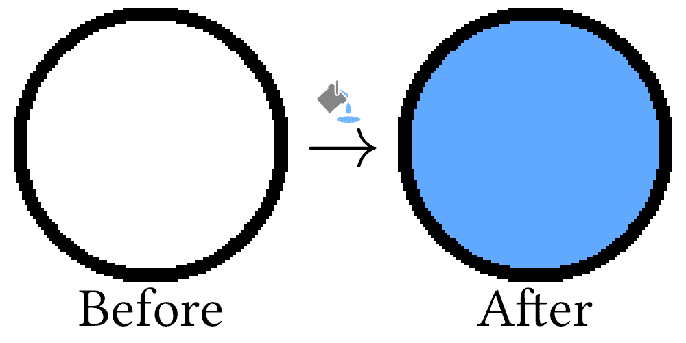
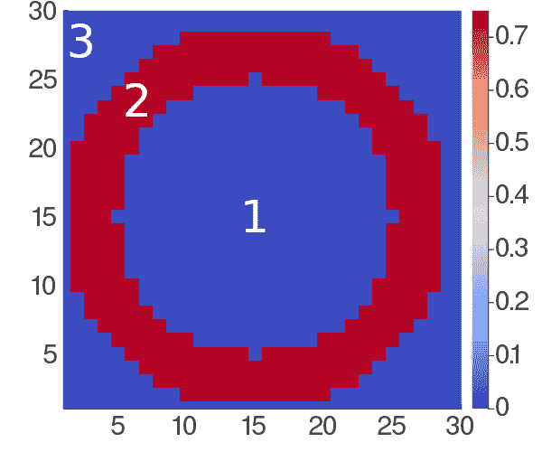
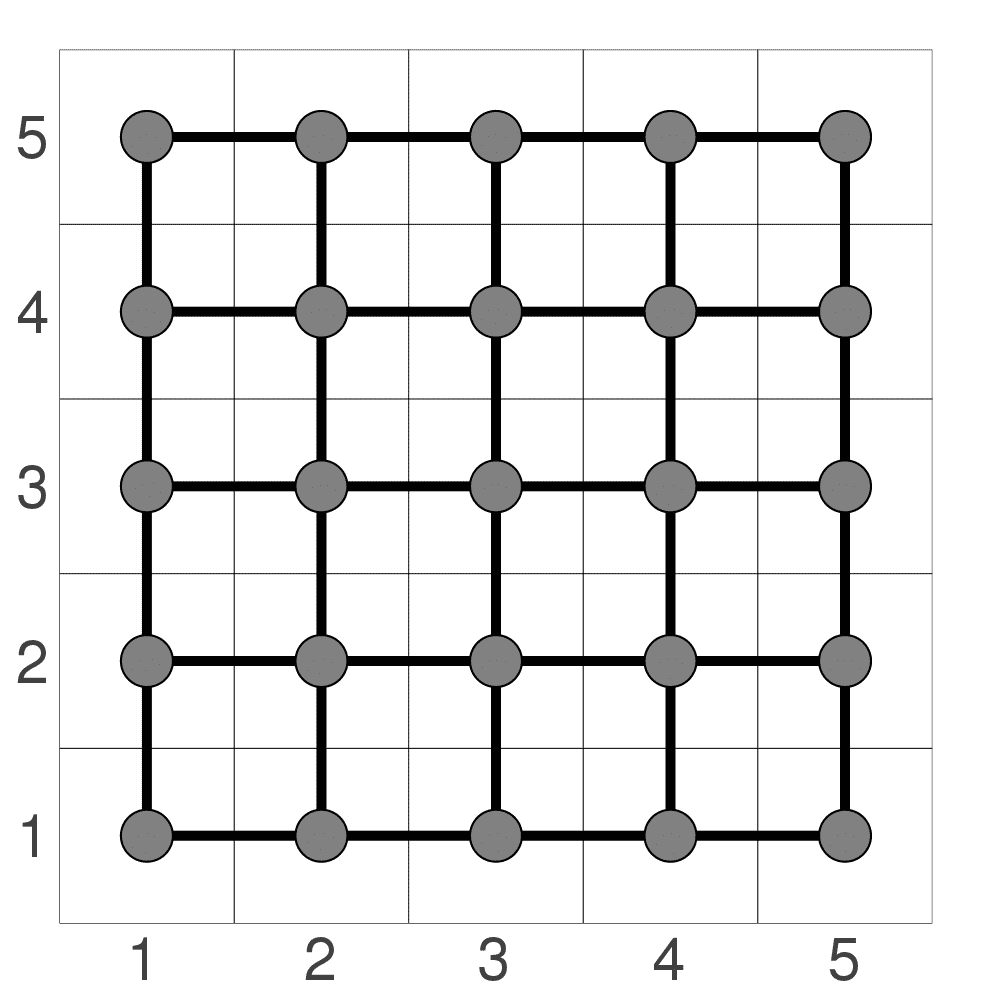
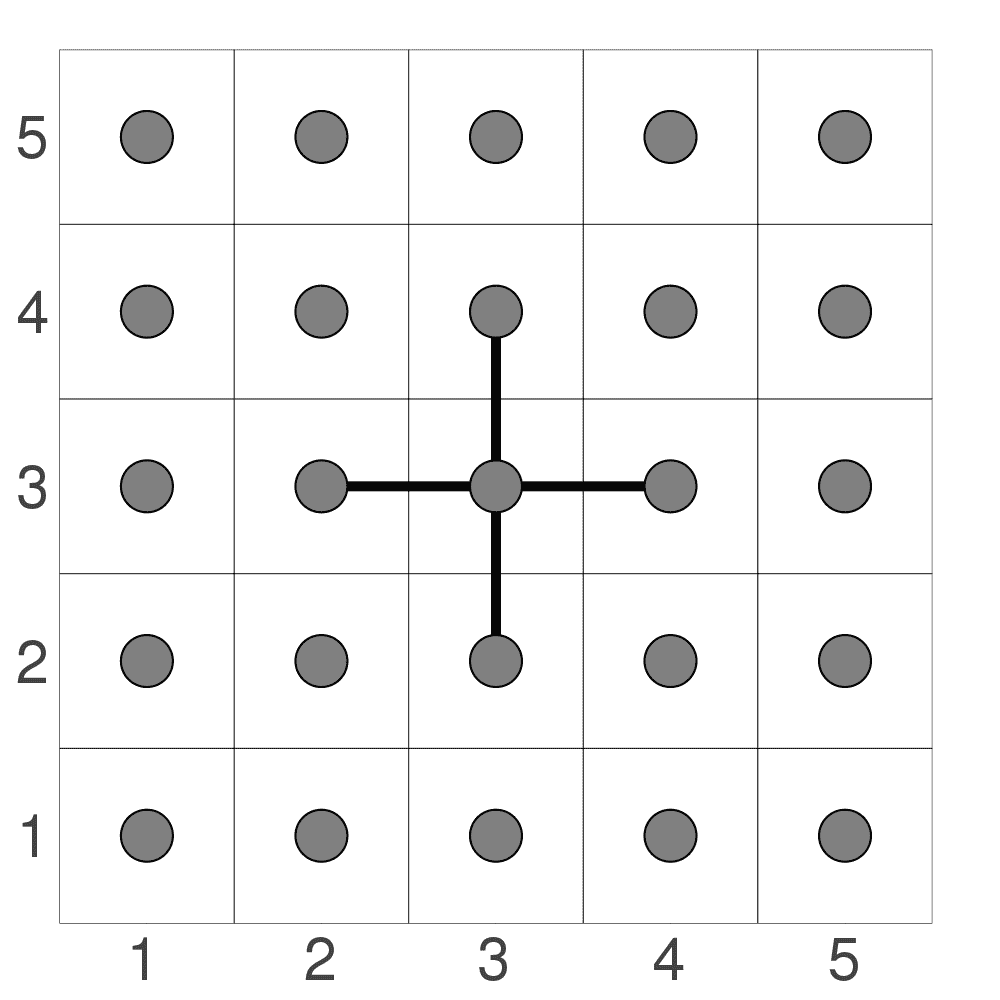
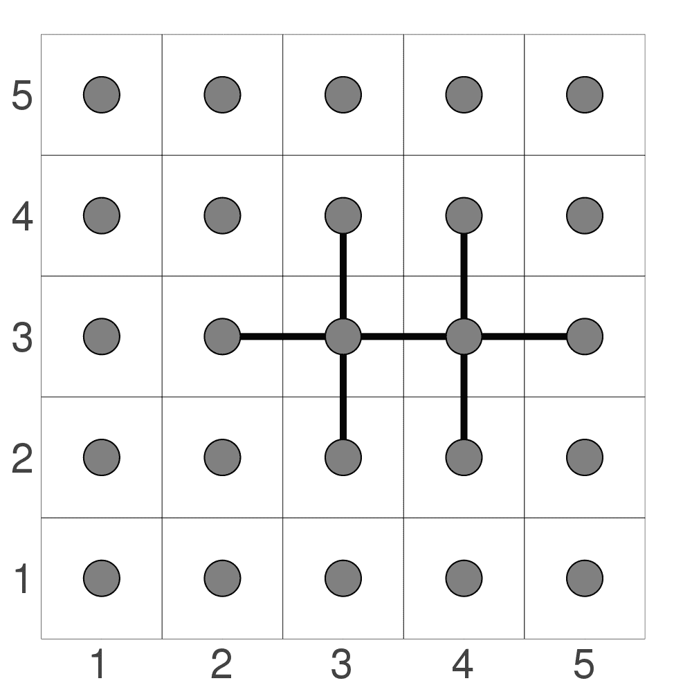
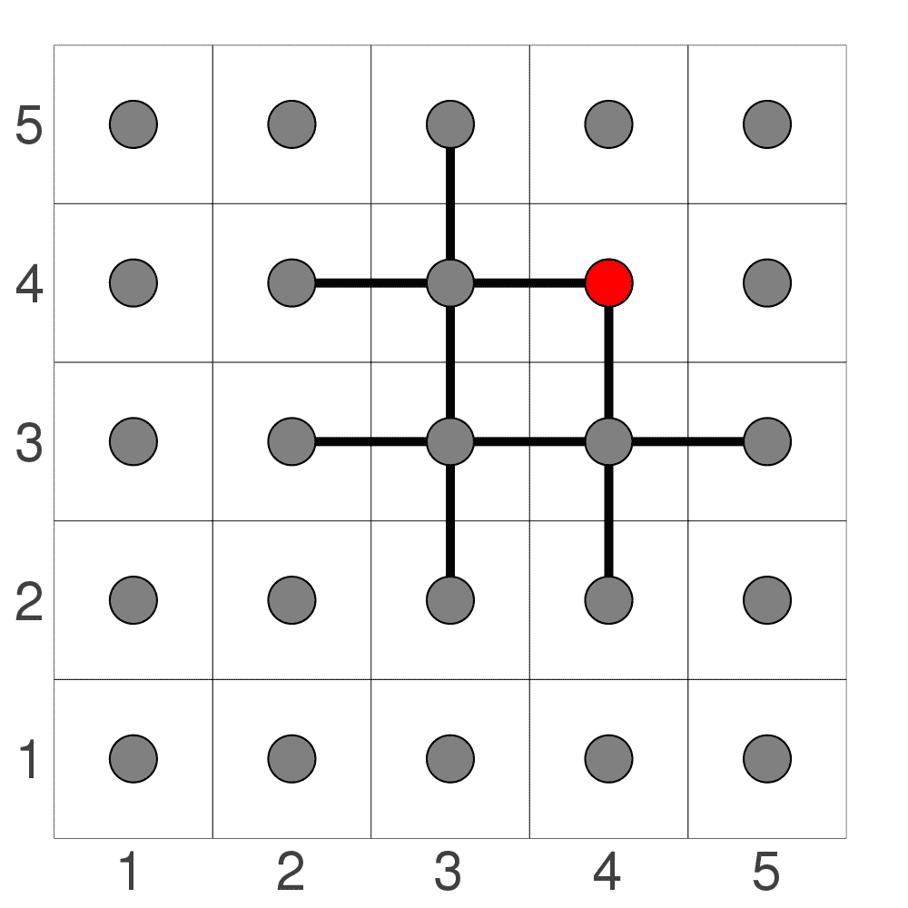
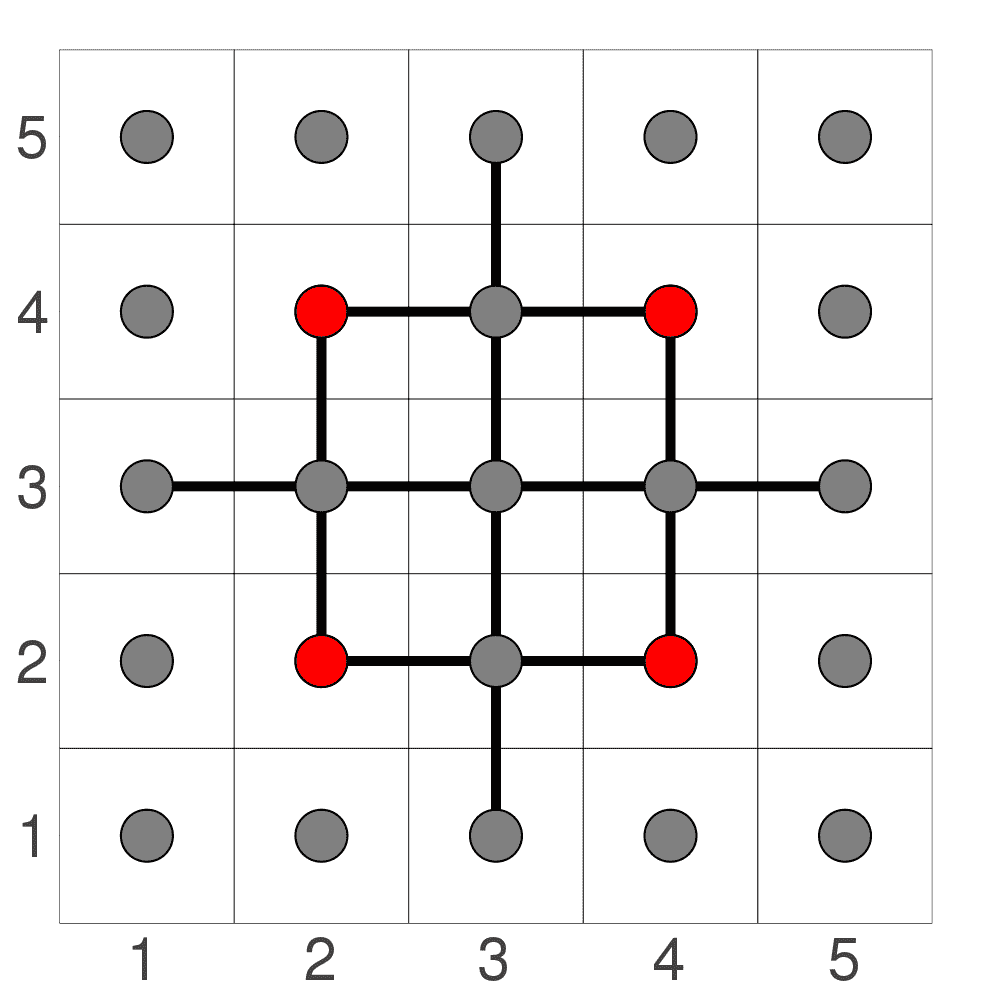
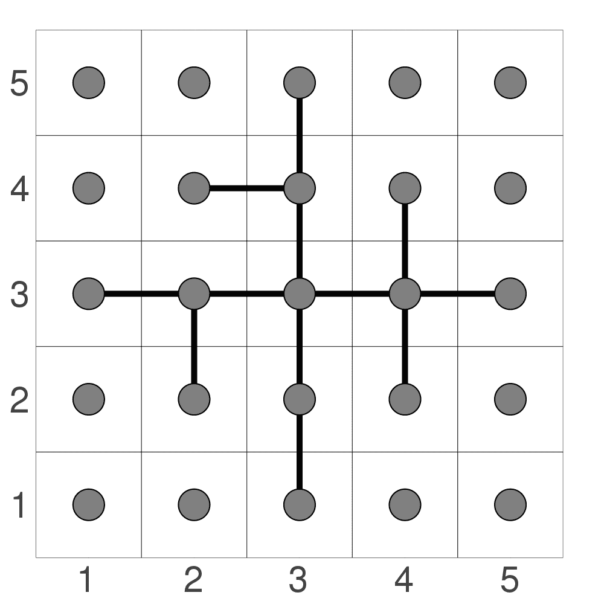

# 填充算法

> [原文链接](https://www.algorithm-archive.org/contents/flood_fill/flood_fill.html)

填充算法是一种在众多不同情况下都出奇地有用的方法，无论我走到哪里都能找到它的身影。当我完成我的博士学业时，我有一个想法，就是通过使用填充算法作为帮助掩盖模拟中不必要的特征的方式来追踪超流体涡旋。当我制作一个终端游戏时，我想到了创建一个仅以填充算法为伪装的动画。当我决定和我的女朋友一起玩扫雷或围棋时，填充算法在两者中都得到了应用！

填充算法在大多数艺术程序中最常见的是被称为“桶填充”的应用程序 [[1]](#cite-1)。它通常由一个看起来像桶的图标表示，并且众所周知，它可以填充任何封闭区域，如下所示：



由于填充算法非常常见，因此存在大量对该方法的不同变体，其中一些比其他一些更优。在本章中，我们将介绍基础知识：如何以快速而粗略的方式填充域。在随后的章节中，我们将继续我们的旅程，创建越来越高效的填充算法，包括基于扫描线和固定内存的方法 [[2]](#cite-2)。

我决定将章节拆分，有几个重要的原因：

1.  我不想一次性将填充算法的方法全部填满算法档案。我觉得让每个章节稍微休息一下，细细品味它的独特风味是值得的。

1.  许多用户都在他们自己的语言中实现每种算法的版本，并且很难审查和提交包含大量代码段章节的代码。包含较少代码的几个子章节对每个人来说都更容易。

1.  我现在有点时间限制，想确保我们定期将内容放入算法档案。

因此，无需多言，让我们直接进入正题吧！

## 填充算法做什么？

填充算法本质上由两部分组成：

1.  确定要填充的域的范围

1.  遍历域内的所有元素并更改某些属性

为了本章的目的，我们将使用一组从 0 到 1 的浮点值，而不是像 RGB 这样的颜色空间。尽管桶填充在艺术程序中总是用于某种颜色空间，但填充算法更为通用，可以在任何类型的元素空间中使用。因此，使用更简单的元素类型是有意义的，这样我们可以更好地理解该方法。

那么，我们如何着手寻找要填充的域的范围呢？

在这里，一个域将被定义为在 - 维空间中任何连接的元素集合，其值不超过预定义的阈值。例如，如果我们将一个嵌入到二维网格中的圆圈作为例子，我们就有 3 个独立的域：

1.  在所有元素都为 0 的圆圈内部。

1.  元素设置为 0.75 的圆圈本身。

1.  在所有元素都为 0 的圆圈之外。



尽管有一些更复杂的方法可以确定域的范围，但我们不会在本章的剩余部分关注洪水填充方法的这一方面，而是将其留到后续章节。因此，现在我们将专注于遍历域中的每个元素并更改某些属性的过程。

## 域遍历

与之前一样，最简单的例子是图像，其中我们域中的每个元素都是一个单独的像素。在这里，我们可以将每个像素连接到其附近的所有其他像素，如下所示：



在这张图片中，每个单独的像素之间有一个边界，并且叠加了一个网格来显示每个像素是如何连接到其邻居的。这意味着每个元素有 4 个邻居：北、南、东和西。如果我们想进行 8 向填充，我们也可以包括东北、东南、西南和西北，但我们将限制讨论为 4 向填充，因为方法本质上相同，并且由于要考虑的元素较少，更容易理解。

通过以这种方式将每个像素连接到其邻居，洪水填充操作变成了一个图遍历过程，与之前描述的树遍历方法不太一样。这意味着在选择了初始位置之后，我们可以以深度优先或广度优先的方式遍历所有元素。本章我们将涵盖以下内容：

1.  寻找所有邻居

1.  深度优先节点遍历

1.  广度优先节点遍历和小规模优化

因此，让我们先讨论我们如何找到要填充的邻居。

### 寻找所有邻居

这种方法的第一个步骤是查询所有可能的邻居的位置。乍一看，这似乎相当直接。只需要查看当前位置的上下左右，并将这些元素添加到邻居列表中，如果它们是：

1.  在画布上

1.  有一个值*足够接近*我们想要替换的旧值

在代码中，这可能会看起来像这样：

```
function find_neighbors(canvas, loc::CartesianIndex, old_val, new_val)

    # Finding north, south, east, west neighbors
    possible_neighbors = [loc + CartesianIndex(0, 1),
                          loc + CartesianIndex(1, 0),
                          loc + CartesianIndex(0, -1),
                          loc + CartesianIndex(-1, 0)]

    # Exclusing neighbors that should not be colored
    neighbors =  []
    for possible_neighbor in possible_neighbors
        if inbounds(size(canvas), possible_neighbor) &&
           canvas[possible_neighbor] == old_val
            push!(neighbors, possible_neighbor)
        end
    end

    return neighbors
end 
```

```
int find_neighbors(struct canvas c, struct point p, int old_val, 
        struct point *neighbors) {
    int cnt = 0;
    struct point points[4] = {
        {p.x, p.y + 1},
        {p.x + 1, p.y},
        {p.x, p.y - 1},
        {p.x - 1, p.y}
    };

    for (int i = 0; i < 4; ++i) {
        if (inbounds(points[i], c) &&
                c.data[points[i].x + c.max_x * points[i].y] == old_val) {
            neighbors[cnt++] = points[i];
        }
    }

    return cnt;
} 
```

```
auto find_neighbors(
    std::vector<std::vector<float>> const& grid,
    CartesianIndex loc,
    float old_value,
    float /* new_value */) {

  const std::vector<CartesianIndex> possible_neighbors{
      {loc[0], loc[1] + 1},
      {loc[0] + 1, loc[1]},
      {loc[0], loc[1] - 1},
      {loc[0] - 1, loc[1]}};

  std::vector<CartesianIndex> neighbors;

  for (auto const& possible_neighbor : possible_neighbors) {
    const auto size = CartesianIndex{
        static_cast<int>(grid[0].size()), static_cast<int>(grid.size())};
    const auto x = static_cast<std::size_t>(possible_neighbor[0]);
    const auto y = static_cast<std::size_t>(possible_neighbor[1]);
    if (inbounds(size, possible_neighbor) && grid[x][y] == old_value) {
      neighbors.push_back(possible_neighbor);
    }
  }

  return neighbors;
} 
```

```
def find_neighbors(canvas, p, old_val, new_val):
    # north, south, east, west neighbors
    possible_neighbors = [
        Point(p.x, p.y+1),
        Point(p.x+1, p.y),
        Point(p.x-1, p.y),
        Point(p.x, p.y-1)
    ]

    # exclude the neighbors that go out of bounds and should not be colored
    neighbors = []
    for possible_neighbor in possible_neighbors:
        if inbounds(canvas.shape, possible_neighbor):
            if canvas[possible_neighbor] == old_val:
                neighbors.append(possible_neighbor)
    return neighbors 
```

```
def find_neighbours(canvas, Point(location), old_value):
    possible_neighbours = ((Point(0, 1), Point(1, 0), Point(0, -1), Point(-1, 0))
                          |> map$(location.__add__))

    yield from possible_neighbours |> filter$(x -> (inbounds(canvas.shape, x)
                                                    and canvas[x] == old_value)) 
```

这段代码被设置为返回一个元素向量，然后用于后续部分。

### 深度优先节点遍历

现在我们有了找到所有邻近元素的能力，我们可以继续以最直接的方式遍历这些节点：递归。

在代码中，它可能看起来像这样：

```
function recursive_fill!(canvas, loc::CartesianIndex, old_val, new_val)

    if (old_val == new_val)
        return
    end

    canvas[loc] = new_val

    possible_neighbors = find_neighbors(canvas, loc, old_val, new_val)
    for possible_neighbor in possible_neighbors
        recursive_fill!(canvas, possible_neighbor, old_val, new_val)
    end
end 
```

```
void recursive_fill(struct canvas c, struct point p, int old_val,
        int new_val) {

    if (old_val == new_val) {
        return;
    }

    c.data[p.x + c.max_x * p.y] = new_val;

    struct point neighbors[4];
    int cnt = find_neighbors(c, p, old_val, neighbors);

    for (int i = 0; i < cnt; ++i) {
        recursive_fill(c, neighbors[i], old_val, new_val);
    }
} 
```

```
void recursive_fill(
    std::vector<std::vector<float>>& grid,
    CartesianIndex loc,
    float old_value,
    float new_value) {
  if (old_value == new_value) {
    return;
  }

  const auto x = static_cast<std::size_t>(loc[0]);
  const auto y = static_cast<std::size_t>(loc[1]);

  grid[x][y] = new_value;

  const auto possible_neighbors = find_neighbors(grid, loc, old_value, new_value);
  for (auto const& possible_neighbor : possible_neighbors) {
    recursive_fill(grid, possible_neighbor, old_value, new_value);
  }
} 
```

```
def recursive_fill(canvas, p, old_val, new_val):
    if old_val == new_val:
        return

    canvas[p] = new_val

    neighbors = find_neighbors(canvas, p, old_val, new_val)
    for neighbor in neighbors:
        recursive_fill(canvas, neighbor, old_val, new_val) 
```

```
def recursive_fill(canvas, Point(location), old_value, new_value):
    if new_value == old_value or not inbounds(canvas.shape, location):
        return

    canvas[location] = new_value
    # consume is important here, because otherwise, the recursive function is not called again
    consume(
        find_neighbours(canvas, location, old_value)
        |> map$(recursive_fill$(canvas, ?, old_value, new_value))
    ) 
```

上述代码会继续递归遍历所有可用的邻居，只要存在邻居，这应该会工作，只要我们添加了正确的邻居集。

此外，还可以通过管理一个栈以相同的方式进行这种类型的遍历，如下所示：

```
function stack_fill!(canvas, loc::CartesianIndex, old_val, new_val)
    if new_val == old_val
        return
    end

    s = Stack{CartesianIndex}()
    push!(s, loc)

    while length(s) > 0
        current_loc = pop!(s)
        if canvas[current_loc] == old_val
            canvas[current_loc] = new_val
            possible_neighbors = find_neighbors(canvas, current_loc,
                                                old_val, new_val)
            for neighbor in possible_neighbors
                push!(s,neighbor)
            end
        end

    end
end 
```

```
void stack_fill(struct canvas c, struct point p, int old_val, int new_val) {
    if (old_val == new_val) {
        return;
    }

    struct stack stk = get_stack();
    stack_push(&stk, p);

    while (!stack_empty(stk)) {
        struct point cur_loc = stack_pop(&stk);
        if (c.data[cur_loc.x + c.max_x * cur_loc.y] == old_val) {
            c.data[cur_loc.x + c.max_x * cur_loc.y] = new_val;

            struct point neighbors[4];
            int cnt = find_neighbors(c, cur_loc, old_val, neighbors);

            for (int i = 0; i < cnt; ++i) {
                stack_push(&stk, neighbors[i]);
            }
        }
    }

    free_stack(stk);
} 
```

```
void stack_fill(
    std::vector<std::vector<float>>& grid,
    CartesianIndex loc,
    float old_value,
    float new_value) {
  if (old_value == new_value) {
    return;
  }

  auto s = std::stack<CartesianIndex>{};
  s.push(loc);

  while (s.size() > 0) {
    const auto current_loc = s.top();
    s.pop();

    const auto x = static_cast<std::size_t>(current_loc[0]);
    const auto y = static_cast<std::size_t>(current_loc[1]);

    if (grid[x][y] == old_value) {
      grid[x][y] = new_value;
      const auto possible_neighbors =
          find_neighbors(grid, current_loc, old_value, new_value);
      for (auto const& neighbor : possible_neighbors) {
        s.push(neighbor);
      }
    }
  }
} 
```

```
def stack_fill(canvas, p, old_val, new_val):
    if old_val == new_val:
        return

    stack = [p]

    while stack:
        cur_loc = stack.pop()
        canvas[cur_loc] = new_val
        stack += find_neighbors(canvas, cur_loc, old_val, new_val) 
```

```
def stack_fill(canvas,  Point(location), old_value, new_value):
    if new_value == old_value or not inbounds(canvas.shape, location):
        return

    stack = [location]

    while stack:
        current_location = stack.pop()
        if canvas[current_location] == old_value:
            canvas[current_location] = new_value
            stack.extend(find_neighbours(canvas, current_location, old_value)) 
```

这实际上与之前的方法相同；然而，因为我们正在管理自己的数据结构，所以有一些明显的区别：

1.  手动管理的栈可能会稍微慢一些，并且可能更占用内存

1.  在某些硬件上使用递归方法很容易达到最大递归深度，因此在这些情况下最好使用基于栈的实现。

如果我们要使用这两种方法之一来填充嵌入在二维域中的圆，我们会看到以下情况

<res/recurse_animation.mp4>

您的浏览器不支持视频标签。

在这里，我们可以看到这些方法将首先遍历一个方向，然后再从那里填充。这可能是编写起来最简单的方法，但它不是最直观的填充模式。我怀疑如果有人被要求自己填充圆的内容，他们可能会从中心更均匀地填充，如下所示：

<res/queue_animation.mp4>

您的浏览器不支持视频标签。

这只是另一种称为广度优先遍历的遍历策略，并带有其自己的注意事项。我们将在下一小节中进一步讨论。

### 广度优先节点遍历和小规模优化

广度优先节点遍历与将深度优先策略中的栈切换为队列一样简单。代码看起来可能像这样：

```
function queue_fill!(canvas, loc::CartesianIndex, old_val, new_val)
    if new_val == old_val
        return
    end

    q = Queue{CartesianIndex}()
    enqueue!(q, loc)

    # Coloring the initial location
    canvas[loc] = new_val

    while length(q) > 0
        current_loc = dequeue!(q)

        possible_neighbors = find_neighbors(canvas, current_loc,
                                            old_val, new_val)

        # Coloring as we are enqueuing neighbors
        for neighbor in possible_neighbors
            canvas[neighbor] = new_val
            enqueue!(q,neighbor)
        end

    end
end 
```

```
void queue_fill(struct canvas c, struct point p, int old_val, int new_val) {
    if (old_val == new_val) {
        return;
    }

    struct queue q = get_queue(sizeof(struct point *));
    enqueue(&q, p);

    while (!queue_empty(q)) {
        struct point cur_loc = dequeue(&q);
        if (c.data[cur_loc.x + c.max_x * cur_loc.y] == old_val) {
            c.data[cur_loc.x + c.max_x * cur_loc.y] = new_val;

            struct point neighbors[4];
            int cnt = find_neighbors(c, cur_loc, old_val, neighbors);

            for (int i = 0; i < cnt; ++i) {
                enqueue(&q, neighbors[i]);
            }
        }
    }

    free_queue(q);
} 
```

```
void queue_fill(
    std::vector<std::vector<float>>& grid,
    CartesianIndex loc,
    float old_value,
    float new_value) {
  if (old_value == new_value) {
    return;
  }

  auto q = std::queue<CartesianIndex>{};
  q.push(loc);
  const auto x = static_cast<std::size_t>(loc[0]);
  const auto y = static_cast<std::size_t>(loc[1]);
  grid[x][y] = new_value;

  while (q.size() > 0) {
    const auto current_loc = q.front();
    q.pop();
    const auto possible_neighbors =
        find_neighbors(grid, current_loc, old_value, new_value);
    for (auto const& neighbor : possible_neighbors) {
      const auto neighbor_x = static_cast<std::size_t>(neighbor[0]);
      const auto neighbor_y = static_cast<std::size_t>(neighbor[1]);
      grid[neighbor_x][neighbor_y] = new_value;
      q.push(neighbor);
    }
  }
} 
```

```
def queue_fill(canvas, p, old_val, new_val):
    if old_val == new_val:
        return

    q = Queue()
    q.put(p)

    canvas[p] = new_val

    while not q.empty():
        cur_loc = q.get()
        neighbors = find_neighbors(canvas, cur_loc, old_val, new_val)

        for neighbor in neighbors:
            canvas[neighbor] = new_val
            q.put(neighbor) 
```

```
def queue_fill(canvas, Point(location), old_value, new_value):
    if new_value == old_value or not inbounds(canvas.shape, location):
        return

    queue = deque()
    queue.append(location)

    canvas[location] = new_value

    while queue:
        current_location = queue.popleft()
        for neighbour in find_neighbours(canvas, current_location, old_value):
            canvas[neighbour] = new_value
            queue.append(neighbour) 
```

现在，在这段代码中有一个小技巧必须考虑，以确保它运行得最优。也就是说，节点必须在入队时着色，而不是在访问节点时。至少对我来说，这并不立即明显为什么会是这种情况，但让我尝试解释一下。

让我们想象我们决定编写代码，只有在访问时才为所有相邻节点着色。在查询所有可能的相邻节点时，我们将为初始节点的北、南、东和西相邻节点添加 4 个元素，如下所示：



现在让我们想象我们首先向东旅行。然后它将再入队三个节点：北、南和再次向东。如下所示：



它没有入队其西邻节点，因为这个已经着色了。在这个阶段，我们将有六个准备着色的节点和两个已经着色的节点。现在让我们假设我们接下来向北旅行。这个节点将入队另外三个节点：西、北和东，如下所示：



问题在于东元素已经被前一个节点**入队以进行着色**！这个共享元素用红色着色。当我们遍历所有四个初始相邻节点时，我们将找到 4 个双重入队的节点：所有与初始位置对角的方向！如下所示：



随着节点数量的增加，重复节点的数量也在增加。一个快速的解决方案是在节点被入队时给节点着色，就像上面的示例代码中那样。当这样做时，由于其他节点在尝试找到它们的邻居时它们已经被着色，因此不会使用广度优先方案将重复节点入队。这创建了一个节点连接模式，如下所示：



作为一些最后的思考：为什么这不是深度优先策略的问题？简单的答案是，这实际上是一个问题，但它的普遍性要小得多。在深度优先策略中，仍然会有一些不必要的节点被推入栈中，但由于我们始终在向其他方向扩散之前先向一个方向推进，因此节点在寻找要填充的周围内容时更有可能已经有填充的邻居。

简而言之：在这种情况下，深度优先遍历略有效率，除非你可以像查询邻居一样着色，在这种情况下，广度优先遍历更有效率。

## 结论

如前所述，本章讨论的方法只是冰山一角，还有许多其他可能的洪水填充方法可能对大多数目的来说更有效率。这些内容将在接下来的几章中逐一介绍，这些章节将在接下来的几个月内定期发布，以免档案中充斥着洪水填充方法。

## 视频解释

这里有一个描述树遍历的视频：

[YouTube 视频链接](https://www.youtube-nocookie.com/embed/ldqAmkdthHY)

## 示例代码

本章的示例代码将是洪水填充的最简单应用，同时仍然充分测试代码以确保它适当地在边界处停止。为此，我们将创建一个二维浮点数组，所有元素都从 0.0 开始，然后在中心设置一条垂直元素线为 1.0。之后，我们将填充数组的左侧，使其全部为 1.0，方法是选择左侧域内的任何点进行填充。

```
using DataStructures
using Test

# Function to check to make sure we are on the canvas
function inbounds(canvas_size, loc)

    # Make sure we are not beneath or to the left of the canvas
    if minimum(Tuple(loc)) < 1
        return false

    # Make sure we are not to the right of the canvas
    elseif loc[2] > canvas_size[2]
        return false

    # Make sure we are not above the canvas
    elseif loc[1] > canvas_size[1]
        return false
    else
        return true
    end
end

function find_neighbors(canvas, loc::CartesianIndex, old_val, new_val)

    # Finding north, south, east, west neighbors
    possible_neighbors = [loc + CartesianIndex(0, 1),
                          loc + CartesianIndex(1, 0),
                          loc + CartesianIndex(0, -1),
                          loc + CartesianIndex(-1, 0)]

    # Exclusing neighbors that should not be colored
    neighbors =  []
    for possible_neighbor in possible_neighbors
        if inbounds(size(canvas), possible_neighbor) &&
           canvas[possible_neighbor] == old_val
            push!(neighbors, possible_neighbor)
        end
    end

    return neighbors
end

function stack_fill!(canvas, loc::CartesianIndex, old_val, new_val)
    if new_val == old_val
        return
    end

    s = Stack{CartesianIndex}()
    push!(s, loc)

    while length(s) > 0
        current_loc = pop!(s)
        if canvas[current_loc] == old_val
            canvas[current_loc] = new_val
            possible_neighbors = find_neighbors(canvas, current_loc,
                                                old_val, new_val)
            for neighbor in possible_neighbors
                push!(s,neighbor)
            end
        end

    end
end

function queue_fill!(canvas, loc::CartesianIndex, old_val, new_val)
    if new_val == old_val
        return
    end

    q = Queue{CartesianIndex}()
    enqueue!(q, loc)

    # Coloring the initial location
    canvas[loc] = new_val

    while length(q) > 0
        current_loc = dequeue!(q)

        possible_neighbors = find_neighbors(canvas, current_loc,
                                            old_val, new_val)

        # Coloring as we are enqueuing neighbors
        for neighbor in possible_neighbors
            canvas[neighbor] = new_val
            enqueue!(q,neighbor)
        end

    end
end

function recursive_fill!(canvas, loc::CartesianIndex, old_val, new_val)

    if (old_val == new_val)
        return
    end

    canvas[loc] = new_val

    possible_neighbors = find_neighbors(canvas, loc, old_val, new_val)
    for possible_neighbor in possible_neighbors
        recursive_fill!(canvas, possible_neighbor, old_val, new_val)
    end
end

function main()

    # Creation of a 5x5 grid with a single row of 1.0 elements 
    grid = zeros(5,5)
    grid[3,:] .= 1

    # Create solution grid
    answer_grid = zeros(5,5)
    answer_grid[1:3, :] .= 1

    # Start filling at 1,1
    start_loc = CartesianIndex(1,1)

    @testset "Fill Methods" begin
        # Use recursive method and reinitialize grid
        recursive_fill!(grid, start_loc, 0.0, 1.0)
        @test grid == answer_grid

        grid[1:2,:] .= 0

        # Use queue method and reinitialize grid
        queue_fill!(grid, start_loc, 0.0, 1.0)
        @test grid == answer_grid

        grid[1:2,:] .= 0

        # Use stack method and reinitialize grid
        stack_fill!(grid, start_loc, 0.0, 1.0)
        @test grid == answer_grid
    end

end

main() 
```

```
#include <stdio.h>
#include <stdlib.h>
#include <string.h>

struct canvas {
    int max_x, max_y;
    int *data;
};

struct point {
    int x, y;
};

struct stack {
    size_t top, capacity;
    struct point *data;
};

struct queue {
    size_t front, back, capacity;
    struct point *data;
};

int inbounds(struct point p, struct canvas c) {
    return (p.x < 0 || p.y < 0 || p.y >= c.max_y || p.x >= c.max_x) ? 0 : 1;
}

int find_neighbors(struct canvas c, struct point p, int old_val, 
        struct point *neighbors) {
    int cnt = 0;
    struct point points[4] = {
        {p.x, p.y + 1},
        {p.x + 1, p.y},
        {p.x, p.y - 1},
        {p.x - 1, p.y}
    };

    for (int i = 0; i < 4; ++i) {
        if (inbounds(points[i], c) &&
                c.data[points[i].x + c.max_x * points[i].y] == old_val) {
            neighbors[cnt++] = points[i];
        }
    }

    return cnt;
}

struct stack get_stack() {
    struct stack stk;

    stk.data = malloc(4 * sizeof(struct point));
    stk.capacity = 4;
    stk.top = 0;

    return stk;
}

int stack_empty(struct stack stk) {
    return stk.top == 0;
}

void stack_push(struct stack *stk, struct point element) {
    if (stk->top == stk->capacity) {
        stk->capacity *= 2;
        stk->data = realloc(stk->data, stk->capacity * sizeof(stk->data[0]));
    }

    stk->data[stk->top++] = element;
}

struct point stack_pop(struct stack *stk) {
    return stk->data[--stk->top];
}

void free_stack(struct stack stk) {
    free(stk.data);
}

void stack_fill(struct canvas c, struct point p, int old_val, int new_val) {
    if (old_val == new_val) {
        return;
    }

    struct stack stk = get_stack();
    stack_push(&stk, p);

    while (!stack_empty(stk)) {
        struct point cur_loc = stack_pop(&stk);
        if (c.data[cur_loc.x + c.max_x * cur_loc.y] == old_val) {
            c.data[cur_loc.x + c.max_x * cur_loc.y] = new_val;

            struct point neighbors[4];
            int cnt = find_neighbors(c, cur_loc, old_val, neighbors);

            for (int i = 0; i < cnt; ++i) {
                stack_push(&stk, neighbors[i]);
            }
        }
    }

    free_stack(stk);
}

struct queue get_queue() {
    struct queue q;

    q.data = calloc(4, sizeof(struct point));
    q.front = 0;
    q.back = 0;
    q.capacity = 4;

    return q;
}

int queue_empty(struct queue q) {
    return q.front == q.back;
}

void enqueue(struct queue *q, struct point element) {
    if (q->front == (q->back + 1) % q->capacity) {
        size_t size = sizeof(q->data[0]);
        struct point *tmp = calloc((q->capacity * 2), size);
        memcpy(tmp, q->data + q->front, (q->capacity - q->front) * size);
        memcpy(tmp + q->capacity - q->front, q->data, (q->front - 1) * size);

        free(q->data);

        q->data = tmp;
        q->back = q->capacity - 1;
        q->front = 0;
        q->capacity *= 2;
    }

    q->data[q->back] = element;
    q->back = (q->back + 1) % q->capacity;
}

struct point dequeue(struct queue *q) {
    struct point ret = q->data[q->front];
    q->front = (q->front + 1) % q->capacity;

    return ret;
}

void free_queue(struct queue q) {
    free(q.data);
}

void queue_fill(struct canvas c, struct point p, int old_val, int new_val) {
    if (old_val == new_val) {
        return;
    }

    struct queue q = get_queue(sizeof(struct point *));
    enqueue(&q, p);

    while (!queue_empty(q)) {
        struct point cur_loc = dequeue(&q);
        if (c.data[cur_loc.x + c.max_x * cur_loc.y] == old_val) {
            c.data[cur_loc.x + c.max_x * cur_loc.y] = new_val;

            struct point neighbors[4];
            int cnt = find_neighbors(c, cur_loc, old_val, neighbors);

            for (int i = 0; i < cnt; ++i) {
                enqueue(&q, neighbors[i]);
            }
        }
    }

    free_queue(q);
}

void recursive_fill(struct canvas c, struct point p, int old_val,
        int new_val) {

    if (old_val == new_val) {
        return;
    }

    c.data[p.x + c.max_x * p.y] = new_val;

    struct point neighbors[4];
    int cnt = find_neighbors(c, p, old_val, neighbors);

    for (int i = 0; i < cnt; ++i) {
        recursive_fill(c, neighbors[i], old_val, new_val);
    }
}

int grid_cmp(int *a, int *b, int size) {
    for (int i = 0; i < size; ++i) {
        if (a[i] != b[i]) {
            return 0;
        }
    }

    return 1;
}

int main() {
    int grid[25] = {
        0, 0, 0, 0, 0,
        0, 0, 0, 0, 0,
        1, 1, 1, 1, 1,
        0, 0, 0, 0, 0,
        0, 0, 0, 0, 0
    };
    int grid1[25] = {
        0, 0, 0, 0, 0,
        0, 0, 0, 0, 0,
        1, 1, 1, 1, 1,
        0, 0, 0, 0, 0,
        0, 0, 0, 0, 0
    };
    int grid2[25] = {
        0, 0, 0, 0, 0,
        0, 0, 0, 0, 0,
        1, 1, 1, 1, 1,
        0, 0, 0, 0, 0,
        0, 0, 0, 0, 0
    };
    int answer_grid[25] = {
        1, 1, 1, 1, 1,
        1, 1, 1, 1, 1,
        1, 1, 1, 1, 1,
        0, 0, 0, 0, 0,
        0, 0, 0, 0, 0
    };

    struct canvas c = {5, 5, grid};
    struct canvas c1 = {5, 5, grid1};
    struct canvas c2 = {5, 5, grid2};

    struct point start_loc = {0, 0};

    int pass_cnt = 0;

    recursive_fill(c, start_loc, 0, 1);
    pass_cnt += grid_cmp(grid, answer_grid, 25);

    stack_fill(c1, start_loc, 0, 1);
    pass_cnt += grid_cmp(grid1, answer_grid, 25);

    queue_fill(c2, start_loc, 0, 1);
    pass_cnt += grid_cmp(grid2, answer_grid, 25);

    printf("Test Summary: | Pass\tTotal\n");
    printf("Fill Methods  |\t%d\t3\n", pass_cnt);

    return 0;
} 
```

```
#include <array>
#include <cassert>
#include <iostream>
#include <queue>
#include <stack>
#include <vector>

using CartesianIndex = std::array<int, 2>;

auto inbounds(CartesianIndex size, CartesianIndex loc) {
  if (loc[0] < 0 || loc[1] < 0) {
    return false;
  } else if (loc[0] >= size[0] || loc[1] >= size[1]) {
    return false;
  }
  return true;
}

auto find_neighbors(
    std::vector<std::vector<float>> const& grid,
    CartesianIndex loc,
    float old_value,
    float /* new_value */) {

  const std::vector<CartesianIndex> possible_neighbors{
      {loc[0], loc[1] + 1},
      {loc[0] + 1, loc[1]},
      {loc[0], loc[1] - 1},
      {loc[0] - 1, loc[1]}};

  std::vector<CartesianIndex> neighbors;

  for (auto const& possible_neighbor : possible_neighbors) {
    const auto size = CartesianIndex{
        static_cast<int>(grid[0].size()), static_cast<int>(grid.size())};
    const auto x = static_cast<std::size_t>(possible_neighbor[0]);
    const auto y = static_cast<std::size_t>(possible_neighbor[1]);
    if (inbounds(size, possible_neighbor) && grid[x][y] == old_value) {
      neighbors.push_back(possible_neighbor);
    }
  }

  return neighbors;
}

void recursive_fill(
    std::vector<std::vector<float>>& grid,
    CartesianIndex loc,
    float old_value,
    float new_value) {
  if (old_value == new_value) {
    return;
  }

  const auto x = static_cast<std::size_t>(loc[0]);
  const auto y = static_cast<std::size_t>(loc[1]);

  grid[x][y] = new_value;

  const auto possible_neighbors = find_neighbors(grid, loc, old_value, new_value);
  for (auto const& possible_neighbor : possible_neighbors) {
    recursive_fill(grid, possible_neighbor, old_value, new_value);
  }
}

void queue_fill(
    std::vector<std::vector<float>>& grid,
    CartesianIndex loc,
    float old_value,
    float new_value) {
  if (old_value == new_value) {
    return;
  }

  auto q = std::queue<CartesianIndex>{};
  q.push(loc);
  const auto x = static_cast<std::size_t>(loc[0]);
  const auto y = static_cast<std::size_t>(loc[1]);
  grid[x][y] = new_value;

  while (q.size() > 0) {
    const auto current_loc = q.front();
    q.pop();
    const auto possible_neighbors =
        find_neighbors(grid, current_loc, old_value, new_value);
    for (auto const& neighbor : possible_neighbors) {
      const auto neighbor_x = static_cast<std::size_t>(neighbor[0]);
      const auto neighbor_y = static_cast<std::size_t>(neighbor[1]);
      grid[neighbor_x][neighbor_y] = new_value;
      q.push(neighbor);
    }
  }
}

void stack_fill(
    std::vector<std::vector<float>>& grid,
    CartesianIndex loc,
    float old_value,
    float new_value) {
  if (old_value == new_value) {
    return;
  }

  auto s = std::stack<CartesianIndex>{};
  s.push(loc);

  while (s.size() > 0) {
    const auto current_loc = s.top();
    s.pop();

    const auto x = static_cast<std::size_t>(current_loc[0]);
    const auto y = static_cast<std::size_t>(current_loc[1]);

    if (grid[x][y] == old_value) {
      grid[x][y] = new_value;
      const auto possible_neighbors =
          find_neighbors(grid, current_loc, old_value, new_value);
      for (auto const& neighbor : possible_neighbors) {
        s.push(neighbor);
      }
    }
  }
}

int main() {

  const std::vector<std::vector<float>> grid{
      {0, 0, 1, 0, 0},
      {0, 0, 1, 0, 0},
      {0, 0, 1, 0, 0},
      {0, 0, 1, 0, 0},
      {0, 0, 1, 0, 0}};

  const std::vector<std::vector<float>> solution_grid{
      {1, 1, 1, 0, 0},
      {1, 1, 1, 0, 0},
      {1, 1, 1, 0, 0},
      {1, 1, 1, 0, 0},
      {1, 1, 1, 0, 0}};

  const CartesianIndex start_loc{1, 1};

  auto test_grid = grid;
  recursive_fill(test_grid, start_loc, 0.0, 1.0);
  assert(test_grid == solution_grid);

  test_grid = grid;
  queue_fill(test_grid, start_loc, 0.0, 1.0);
  assert(test_grid == solution_grid);

  test_grid = grid;
  stack_fill(test_grid, start_loc, 0.0, 1.0);
  assert(test_grid == solution_grid);

  return EXIT_SUCCESS;
} 
```

```
from collections import namedtuple
from queue import Queue
import numpy as np

Point = namedtuple("Point", "x y")

def inbounds(canvas_shape, p):
    return min(p) >= 0 and p.x < canvas_shape[0] and p.y < canvas_shape[1]

def find_neighbors(canvas, p, old_val, new_val):
    # north, south, east, west neighbors
    possible_neighbors = [
        Point(p.x, p.y+1),
        Point(p.x+1, p.y),
        Point(p.x-1, p.y),
        Point(p.x, p.y-1)
    ]

    # exclude the neighbors that go out of bounds and should not be colored
    neighbors = []
    for possible_neighbor in possible_neighbors:
        if inbounds(canvas.shape, possible_neighbor):
            if canvas[possible_neighbor] == old_val:
                neighbors.append(possible_neighbor)
    return neighbors

def stack_fill(canvas, p, old_val, new_val):
    if old_val == new_val:
        return

    stack = [p]

    while stack:
        cur_loc = stack.pop()
        canvas[cur_loc] = new_val
        stack += find_neighbors(canvas, cur_loc, old_val, new_val)

def queue_fill(canvas, p, old_val, new_val):
    if old_val == new_val:
        return

    q = Queue()
    q.put(p)

    canvas[p] = new_val

    while not q.empty():
        cur_loc = q.get()
        neighbors = find_neighbors(canvas, cur_loc, old_val, new_val)

        for neighbor in neighbors:
            canvas[neighbor] = new_val
            q.put(neighbor)

def recursive_fill(canvas, p, old_val, new_val):
    if old_val == new_val:
        return

    canvas[p] = new_val

    neighbors = find_neighbors(canvas, p, old_val, new_val)
    for neighbor in neighbors:
        recursive_fill(canvas, neighbor, old_val, new_val)

def main():
    grid = np.zeros((5, 5))
    grid[2,:] = 1

    answer = np.zeros((5, 5))
    answer[:3,] = 1

    c0 = grid.copy()
    c1 = grid.copy()
    c2 = grid.copy()

    start_loc = Point(0, 0)

    recursive_fill(c0, start_loc, 0, 1)
    queue_fill(c1, start_loc, 0, 1)
    stack_fill(c2, start_loc, 0, 1)

    assert (c0 == answer).all()
    assert (c1 == answer).all()
    assert (c2 == answer).all()

    print("Tests Passed")

if __name__ == "__main__":
    main() 
```

```
from collections import deque
import numpy as np

data Point(x, y):
    def __add__(self, Point(other)) = Point(self.x + other.x, self.y + other.y)

# This function is necessary, because negative indices wrap around the
# array in Coconut.
def inbounds(canvas_shape, Point(location)) =
    min(location) >= 0 and location.x < canvas_shape[0] and location.y < canvas_shape[1]

def find_neighbours(canvas, Point(location), old_value):
    possible_neighbours = ((Point(0, 1), Point(1, 0), Point(0, -1), Point(-1, 0))
                          |> map$(location.__add__))

    yield from possible_neighbours |> filter$(x -> (inbounds(canvas.shape, x)
                                                    and canvas[x] == old_value))

def stack_fill(canvas,  Point(location), old_value, new_value):
    if new_value == old_value or not inbounds(canvas.shape, location):
        return

    stack = [location]

    while stack:
        current_location = stack.pop()
        if canvas[current_location] == old_value:
            canvas[current_location] = new_value
            stack.extend(find_neighbours(canvas, current_location, old_value))

def queue_fill(canvas, Point(location), old_value, new_value):
    if new_value == old_value or not inbounds(canvas.shape, location):
        return

    queue = deque()
    queue.append(location)

    canvas[location] = new_value

    while queue:
        current_location = queue.popleft()
        for neighbour in find_neighbours(canvas, current_location, old_value):
            canvas[neighbour] = new_value
            queue.append(neighbour)

def recursive_fill(canvas, Point(location), old_value, new_value):
    if new_value == old_value or not inbounds(canvas.shape, location):
        return

    canvas[location] = new_value
    # consume is important here, because otherwise, the recursive function is not called again
    consume(
        find_neighbours(canvas, location, old_value)
        |> map$(recursive_fill$(canvas, ?, old_value, new_value))
    )

def test_grid(initial_canvas, final_canvas, function):
    canvas = initial_canvas.copy() # ensure the initial_canvas is unchanged
    function(canvas)
    return (canvas == final_canvas).all()

def test():
    from collections import namedtuple

    TestResults = namedtuple('TestResults', 'passes failures')
    pass_count = failure_count = 0

    grid = np.zeros((5, 5))
    grid[2,:] = 1
    solution_grid = np.zeros((5, 5))
    solution_grid[:3,] = 1

    starting_location = Point(0, 0)

    recursive_test_func = recursive_fill$(?, starting_location, 0, 1)
    # The following is manual unit testing of the function
    if test_grid(grid, solution_grid, recursive_test_func):
        pass_count += 1
        print('.', end='')
    else:
        failure_count += 1
        print('F', end='')

    stack_test_func = stack_fill$(?, starting_location, 0, 1)
    if test_grid(grid, solution_grid, stack_test_func):
        print('.', end='')
        pass_count += 1
    else:
        print('F', end='')
        failure_count += 1

    queue_test_func = queue_fill$(?, starting_location, 0, 1)
    if test_grid(grid, solution_grid, queue_test_func):
        print('.', end='')
        pass_count += 1
    else:
        print('F', end='')
        failure_count += 1

    print()
    print(TestResults(pass_count, failure_count))

if __name__ == '__main__':
    # Testing setup
    test() 
```

### 参考文献

1.[Gimp 中的桶填充](https://docs.gimp.org/2.10/en/gimp-tool-bucket-fill.html)，2020.2.Torbert, Shane, 应用计算机科学，*Springer*，2016。

## 许可证

##### 代码示例

代码示例受 MIT 许可证许可（可在[LICENSE.md](https://github.com/algorithm-archivists/algorithm-archive/blob/main/LICENSE.md)中找到）。

##### 文本

本章的文本由[James Schloss](https://github.com/leios)编写，并受[Creative Commons Attribution-ShareAlike 4.0 国际许可证](https://creativecommons.org/licenses/by-sa/4.0/legalcode)许可。

[Creative Commons Attribution-ShareAlike 4.0](https://creativecommons.org/licenses/by-sa/4.0/)

[Creative Commons Attribution-ShareAlike 4.0](https://creativecommons.org/licenses/by-sa/4.0/)

##### 图片/图形

+   图片"Example Bucket Fill"由[James Schloss](https://github.com/leios)创作，并授权于[Creative Commons Attribution-ShareAlike 4.0 International License](https://creativecommons.org/licenses/by-sa/4.0/legalcode)。

+   图片"Circle Domains"由[James Schloss](https://github.com/leios)创作，并授权于[Creative Commons Attribution-ShareAlike 4.0 International License](https://creativecommons.org/licenses/by-sa/4.0/legalcode)。

+   图片"Grid 1"由[James Schloss](https://github.com/leios)创作，并授权于[Creative Commons Attribution-ShareAlike 4.0 International License](https://creativecommons.org/licenses/by-sa/4.0/legalcode)。

+   图片"Grid 2"由[James Schloss](https://github.com/leios)创作，并授权于[Creative Commons Attribution-ShareAlike 4.0 International License](https://creativecommons.org/licenses/by-sa/4.0/legalcode)。

+   图片"Grid 3"由[James Schloss](https://github.com/leios)创作，并授权于[Creative Commons Attribution-ShareAlike 4.0 International License](https://creativecommons.org/licenses/by-sa/4.0/legalcode)。

+   图片"Grid 4"由[James Schloss](https://github.com/leios)创作，并授权于[Creative Commons Attribution-ShareAlike 4.0 International License](https://creativecommons.org/licenses/by-sa/4.0/legalcode)。

+   图片"Grid 5"由[James Schloss](https://github.com/leios)创作，并授权于[Creative Commons Attribution-ShareAlike 4.0 International License](https://creativecommons.org/licenses/by-sa/4.0/legalcode)。

+   图片"Grid 6"由[James Schloss](https://github.com/leios)创作，并授权于[Creative Commons Attribution-ShareAlike 4.0 International License](https://creativecommons.org/licenses/by-sa/4.0/legalcode)。

+   视频"Stack Fill"由[James Schloss](https://github.com/leios)创作，并授权于[Creative Commons Attribution-ShareAlike 4.0 International License](https://creativecommons.org/licenses/by-sa/4.0/legalcode)。

+   视频"Queue Fill"由[James Schloss](https://github.com/leios)创作，并授权于[Creative Commons Attribution-ShareAlike 4.0 International License](https://creativecommons.org/licenses/by-sa/4.0/legalcode)。
