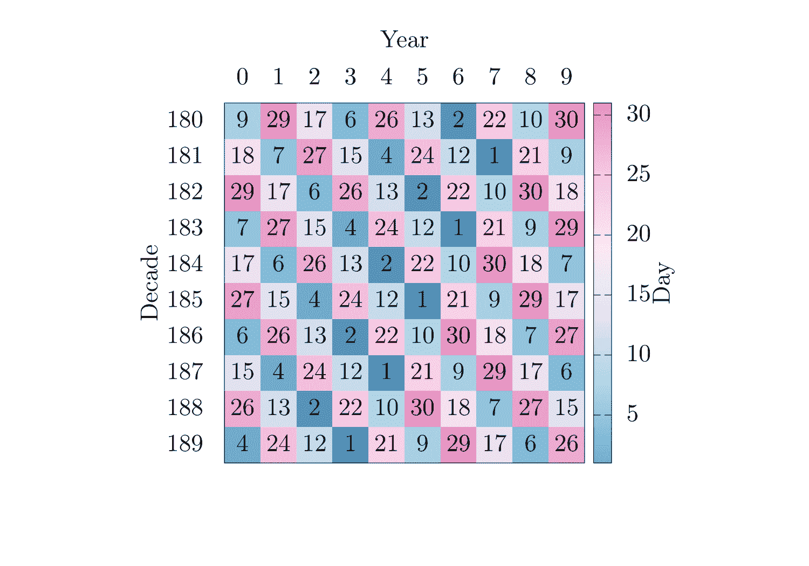
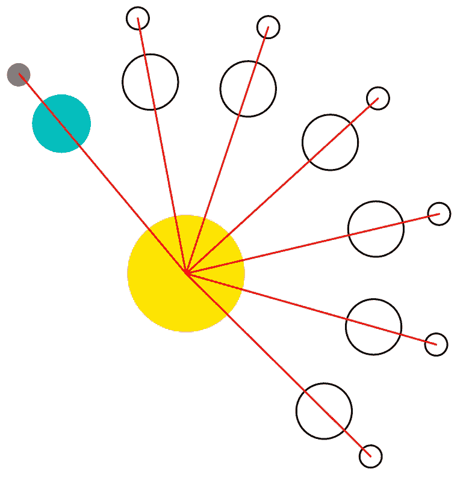
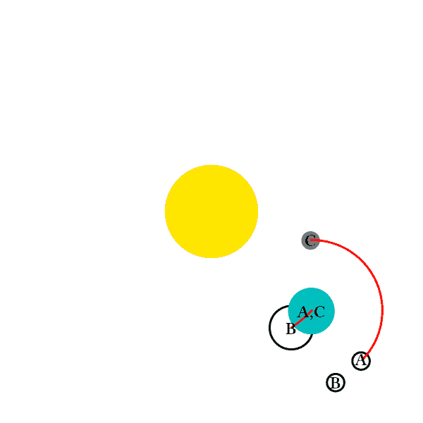
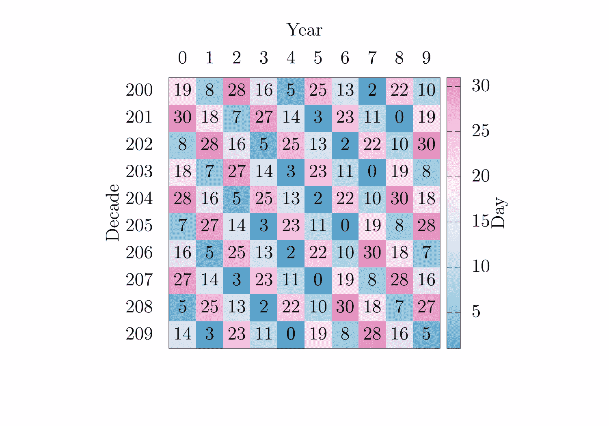

# 复活节算法（Computus）

> 原文：[`www.algorithm-archive.org/contents/computus/computus.html`](https://www.algorithm-archive.org/contents/computus/computus.html)

虽然“Computus”这个词在技术上可以描述任何类型的计算 [[1]](#cite-1) 或者是一套用于计算各种占星事件的古代表格 [[2]](#cite-2)，但它也是每年计算基督教节日复活节最常见的名称之一。名义上，复活节发生在春分后的第一个满月之后的星期日（大约是 3 月 21 日）。这个特别的满月有多个名称，如粉红（草莓）月、猎人月或雪月，以及其他几个名称。其中最常见的是复活节满月，它在希腊语中意为“逾越节”，象征着重要的犹太节日。

在最初的几个世纪里，复活节的日期每年都是由教皇决定的；然而，随着教会的扩张，将这个日期传达给整个基督教世界变得不再简单。因此，教会尽可能地算法化地生成表格，供神职人员确定每年的复活节日期。时至今日，复活节的计算仍然是一个问题，西方和东方（正教）教会大约有 50%的时间会在不同的日期庆祝。

我得坦白，围绕这个事件的计算有很多很好的基督教戏剧，读起来非常有趣 [[3]](#cite-3)。简而言之，复活节的日期让许多历史学者感到困惑，至少有一个算法出现在现在著名的科学期刊《自然》的早期档案中 [[4]](#cite-4)。这个计算如此复杂，以至于连弗雷德里克·高斯也尝试过（并在被他的一个学生纠正之前失败了）。

实质上，复活节的日期取决于月和太阳的周期。例如，复活节满月的日期在农历中是固定的，但在阳历中则不是。因此，计算复活节就是将一个农历周期映射到大家所熟知和喜爱的格里高利（阳历）日历上的行为。由于历史上存在过许多不同的日历系统，自然会有人问起应该使用哪种日历系统来计算复活节的精确日期。西方教会选择了格里高利历，而东方教会选择了儒略历，这也是为什么西方和东方教会有时会在不同日期庆祝的原因之一。尽管如此，格里高利历更准确地代表了复活节满月的真实日期，因此西方教会的做法最终更加精确。

尽管计算复活节的有很多方法，但现在我们只关注高斯算法；然而，如果需求的话，我们当然会在后续年份中回头加入其他复活节算法。这些算法是算法设计史上我最喜欢的瑰宝之一，因为它们围绕计算看似微不足道的事情所引发的种种戏剧性事件！毕竟，计算复活节能有多难呢？

## 高斯复活节算法的历史

高斯因许多事物而闻名：高斯消元法、在库利和图基之前就存在的库利-图基方法、电磁学的高斯定律等。但他并不特别知名的是他在 1800 年设计的一个算法，该算法后来在 1816 年由他的学生彼得·保罗·蒂特纠正。实际上，在这个时期，高斯发表了一系列与复活节确切日期相关的出版物。传说高斯实际上不知道自己公历的生日，并使用这个相同的算法来确定它。显然，他的母亲只告诉他，他在 1777 年升天节前 8 天出生，那天是星期三，对应 4 月 30 日 [[3]](#cite-3)。

实际上，高斯的复活节算法是 19 世纪的未文档化代码。我可以想象高斯不高兴地“修补”他的方法，当用户抱怨它无法处理 4200 年之后的日期，甚至是他自己时代的某些日期时！当一些他的同胞（如约翰·拉姆伯特和让·约瑟夫·德朗布尔）对这种方法的表现表示担忧时，高斯回答说，

> 找到公式 [...] 的调查基于高等算术，我可能无法引用任何出版物。

这在 19 世纪相当于说，“你太笨了，理解不了我的天才。”我确实遇到过一些初出茅庐的程序员有同样的感觉，但他们都没有像高斯那样多产。

高斯工作的最重要粉丝之一是塞尔沃斯，他根据高斯 1800 年的出版物创建了一个日历，如下所示：



这个日历显示了复活节满月的日子，表明复活节将在下一个星期日 [[5]](#cite-5)。在这个表中，大于 22 的值表示满月将在 3 月份的显示日期（日期），小于 22 的值表示满月将在 4 月份的该日期。这个表的-x 轴表示十年，y 轴表示精确的年份。诚然，这种表示法有点古怪，但那是 1813 年。那时的情况不同。

本章的任务将是（尽我所能）解释如何使用高斯的复活节算法来计算任何给定年份的复活节日期（在算法的限制范围内）。

## 背景

因为复活节是春分满月的下一个星期日，而春分满月是春季的第一个满月，高斯算法的任务就是找到一种将农历映射到公历（太阳历）的方法。因此，在讨论算法本身之前，我们首先必须介绍这两种日历系统。公历（太阳历）是为了标记地球围绕太阳的完整公转而创建的，大约是 365.2425 天。不幸的是，天数是基于地球围绕其轴的旋转，而不是围绕太阳的公转，所以一年中的天数不是一个整数（例如 365）。这种差异实际上导致了大量日历系统的出现，包括高斯本人发明的一个 [[6]](#cite-6)。在公历之前，还有一个从古老的罗马历法中进行的修正，将一年中的天数设定为 365.25 天。这被称为儒略历。从那里，儒略历被进一步修正为 365.2425 天的公历。尽管使用高斯的复活节算法对儒略历进行修正只需要做很小的改变，但这在这里不会涉及；然而，如果你想看到这一点，我们可以根据要求添加。

为了解决公历年的非整数性质，每 4 年庆祝一次闰日，2 月 29 日，除非年份是 100 的倍数，这种情况下不观察闰日；然而，如果年份能被 400 整除，则仍然观察闰日。这意味着每 400 年就有 97 个闰日。这就是为什么在 2020 年和 2000 年庆祝了闰日，但在 1900 年没有庆祝。如果此时你觉得你最喜欢的日历系统就像是用胶带和线粘合在一起，那么你就对了。

除了太阳年之外，高斯的复活节算法还需要考虑农历年。一个朔望月对应于月亮完成一次围绕地球的完整公转所需的时间。在大多数情况下，这大约是 27.5 天 [[7]](#cite-7)。也就是说，空间是复杂的，月亮不是唯一旋转的天体。月相与月亮返回到与太阳和地球连接的线相关的位置所需的时间有关，如下所示：


这被称为会合月，并将被用于本章的近似值。下面，我们还展示了这个模拟经过 6 个会合月后的快照：



在这里，我们以任意初始位置展示地球和月球的轮廓，每个都与水平轴形成一个角度。此外，我们还展示了月球和地球在 6 个太阴月后的位置，以及每个中间太阴月的轮廓。红色线条从太阳中心延伸到月亮，以指示月亮相对于太阳和地球的位置。在所有位置，月亮都隐藏在地球后面，形成满月相位。这样，太阴月是两个连续相位之间的时间，这比围绕地球旋转并返回到相同角度的时间略长（这里）。每个太阴月大约是 29.5 天，因此 12 个月亮的太阴年大约是 354 天，这比格里历年 365 天短 11 天。以下是一个阳历和阴历之间偏移的图示：



在这里，我们看到太阳位于中心，地球和月球在起始时与水平轴形成一个角度。地球和月球的初始位置以字母“A”为中心的轮廓表示。经过一个完整的太阴月（12 个月亮月），地球和月球的另一个轮廓在位置 B 处显示，而在一个完整的格里历年后，它们在位置 C 处显示。接着画出一个弧线，显示地球在太阴年后位置的变化为 11 天，然后又画出一个弧线，显示月球在格里历年后的位置变化。

由于太阴月和太阳年没有同步，同一天格里历年中月亮的相位将不同。话虽如此，阴历和阳历大约每 19 年会重新同步。例如，如果 2020 年 1 月 1 日有新月，那么 2021 年 1 月 1 日将不会有新月；然而，2039 年 1 月 1 日*将会有*新月。这个月亮和太阳等待重新同步的 19 年周期被称为梅冬周期，并且已经研究了几百年。

这个周期使我们能够相对容易地在阳历和阴历之间转换。如果我们想象任何格里历日期（为了清晰起见，让我们再次假设是 1 月 1 日），月亮可能处于 19 种不同相位之一，如下所示：


在这里，我们以轮廓的形式展示月亮的每个可能相位，但实际相位以灰色圆圈表示。基本上，通过知道我们在梅冬周期的哪一年，我们可以确定在给定日期将看到月亮的哪个相位。这是强大的，并允许我们通过向前看几天来找到下一个满月。

最后一点，梅冬历每 19 年有一个 1 小时 45 分钟的微小偏移，所以在 2500 年后，它将偏离 8 天，但这将是 2500 年后人们的问题。现在，我们应该能够开始讨论算法本身了。

## 算法

如高斯上述引言中所述，复活节算法更接近于一套公式，而不是用于在现代计算机上计算任何东西的方法。这部分是因为高斯在软件工程上的不足，部分是因为当时计算机实际上并不存在。考虑到这种方法实际上被称为*计算法*，当时可能根本没有什么需要计算的。如今，你可以通过循环和条件更容易地找到复活节的日期，但这是*神秘算法档案*，这绝对是一个神秘的算法，所以让我们开始吧！

在本节中，我们将遵循高斯 1800 年原始工作的类似符号，这有点简略且难以理解；然而，每个项都非常有意义。如果你在阅读此内容并认为有更好的方式来展示任何内容，请告诉我们（通过 github 上的问题或拉取请求），我们可以纠正文本！

此方法可以分为两部分：

1.  计算从 3 月 21 日到下一个满月的天数

1.  计算从满月到下一个星期日的天数

在接下来的章节中，我们将分别讨论。

### 计算下一个满月的日期

首先，我们将计算从 3 月 21 日（教皇根据的春季第一天）到下一个满月的日期，即。为了计算这个，我们首先需要计算一些辅助变量，从当前年份在梅冬历上的位置开始，其中是取模运算符，19 是梅冬历的年数。从这里，我们还需要计算一个偏移量，为此我们需要世纪索引，其中是向下取整运算，即向下取最接近的整数。有了这个，我们可以计算出梅冬历的位移，

这个表达式表示梅冬历每 2500 年将偏离 8 天，并额外增加 13 天的偏移量，以确保梅冬历与经验观察相吻合。

到目前为止，我们知道我们在梅冬历上的年份以及相应的偏移量；然而，我们还没有考虑到闰年。如上所述，每 400 年有 97 个闰日，上述的计算需要纠正 3 个未计算的闰日。如果每世纪增加 25 个闰日并减去，那么他们将会发现每 400 年有 96 个闰日，这是一个接近的近似值，但差了一个。这解释了为什么闰日不会在 100 的倍数年份庆祝。然而，对于 400 的倍数年份有一个例外，这就是高斯计算额外变量的原因，

这意味着每 400 年，将提供适当的闰日数。找到这个之后，我们然后计算一个朔望月内所有偏移的总和。

其中 15 是一个偏移量，表示 0 年时的满月距离 3 月 21 日 15 天，是偏离梅冬周期的天数，而是非闰日。、和的值都提供*世纪*偏移量，这意味着的值将为每个世纪提供正确的起点。将（模 30 算术）将我们的计算限制在约 30 天的单次朔望月内。

拥有所有这些信息，我们终于可以计算出从 3 月 21 日到第一个满月的总天数，如下所示

再次，这里的操作是有意义的，因为没有下一个满月可能超过 30 天（一个朔望月）从 3 月 21 日开始。乍一看，这似乎只是一个加上一些偏移量（我们在梅冬周期中的位置）的计算。这是真的，但还有一个额外的乘法因子 19。有人可能会试图忽略这个 19，说，“19 是梅冬周期的年数，所以这很合理！”但事实是，19 要复杂得多。这个计算是*天数*的计算，而不是年数。

每 12 个朔望月大约是 354 天，比 365 天少 11 天。这意味着在梅冬周期中，每年月亮相位将落后 11 天。恰好，。因此，是 11 天偏移和我们在计算中使用模 30 算术的结合。经过 19 年后，月亮历将在太阳历中落后整整 365 天，但再次强调，我们只关心这个计算中的*日*偏移。没有人真正跟踪月亮年，只有太阳年。

不论如何，我们现在有了，直到下一个满月的总天数。有趣的是，这些都是复制 Servois 表格所需的所有信息。从这里，我们只需要创建一个二维数组，以十年为 x 轴，以年份为 y 轴，并在其中设置值为，其中 21 代表 3 月 21 日，而 31 来自 3 月有 31 天的事实。例如，如果我们对 2000 年至 2099 年的年份进行此计算，我们会得到以下表格：



这表明 2020 年复活节满月的日期是 4 月 9 日。现在我们可以继续寻找复活节的精确日期，它应该是下一个星期日

### 计算下一个星期日

此计算将需要来自上一节的一些变量，即  （未观察到的闰日数量），和  （从 3 月 21 日到下一个满月的日数）。对于最后的计算，我们将一个月的日数与格里高利（太阳）历同步。对于这个计算，我们执行类似的操作，但针对 7 天的周历，这个值将存储在 . 第一步是根据 1 月 1 日在公元 1 年是星期五的事实来计算每个世纪的正确偏移量，并考虑到所有未观察到的闰日 （），

从这里开始，事情变得有些棘手。一年中有 52 周，但 ，这意味着我们每年实际上会差一天，除了闰年，我们会差两天。作为一个例子，看看下面的表格

| 1 月 1 日 | 星期 | 特殊考虑 |
| --- | --- | --- |
| 2017 | 星期日 | 无 |
| 2018 | 星期一 | 无 |
| 2019 | 星期二 | 无 |
| 2020 | 星期三 | 闰年 |
| 2021 | 星期五 | 无 |

简而言之，每年我们应该减去一周的一天，但在闰年，我们应该减去两天。为了跟踪这一点，我们需要两个单独的计数，

以及  其中  跟踪闰年，而  每年简单地增加 1。通过一点数学魔法，我们可以找到表达式 ，在模 7 算术中对于每一年将是 -1，除了闰年，它将是 -2。

将所有这些项放在一起，我们最终可以计算出从满月到复活节星期天的偏移量为

这里，所有项都如上所述描述，而 6 到  的乘法因子将为星期日提供一个偏移量，而不需要校正闰日。

### 总结

到目前为止，我们可以计算出从 3 月 21 日到复活节星期天的天数是 . 特别地

记住，3 月 22 日将是庆祝复活节的第一可能日期，因为 3 月 21 日将是春季的第一个可能满月。总的来说，有几个例外相当难以理解，即：

这些条件被放置在  的输出上，对应于复活节在 4 月 26 日（如果 ）或 4 月 25 日（如果 ）的情况。在这两种情况下，我们都在设置 ，这相当于从复活节日期中减去一周。例如，原本应该在 26 日庆祝的复活节将改为在 19 日庆祝。

许多人说，这些条件被放置在输出上是为了历史原因，但据我所知，我认为有一个更数学的原因，我并不完全理解。毕竟，为什么对  的校正只放在梅森周期后半段的复活节日期输出上（如果 ）？如果你认为你对为什么这些日期以这种方式进行校正有更好的想法，请告诉我们！

如前所述，这个特定的算法并没有使用任何标准的计算技术。没有循环、条件、栈或队列。然而，毫无疑问，高斯是他的工艺大师。这种计算的纯粹复杂性既让我困惑又让我惊叹——尤其是在计算思维变得普遍之前数百年的情况下。

当然，这可以用计算器直接完成，但毫无疑问，这是一个值得讨论和庆祝的算法，因为它在创造时的独创性。

## 视频说明

这里有一个视频描述高斯复活节算法的关键要素：

[`www.youtube-nocookie.com/embed/x6Yud882QKE`](https://www.youtube-nocookie.com/embed/x6Yud882QKE)

## 示例代码

与算法档案中的许多其他章节不同，这个特定的方法几乎完全可以用数学表达式来描述。因此，它应该相对容易地在多种不同的语言中实现，我强烈鼓励你们这样做！目前，我们有代码输出一个元组，用户可以使用它来计算复活节的日期或 Servois 的表格，具体取决于他们的用例；然而，请随意修改代码！

```
function computus(year; servois=false)

    # Year's position on the 19 year metonic cycle
    a = mod(year, 19)

    # Century index
    k = fld(year, 100)

    # Shift of metonic cycle, add a day offset every 300 years
    p = fld(13 + 8 * k, 25)

    # Correction for non-observed leap days
    q = fld(k, 4)

    # Correction to starting point of calculation each century
    M = mod(15 - p + k - q, 30)

    # Number of days from March 21st until the full moon
    d = mod(19 * a + M, 30)

    # Returning if user wants value for Servois' table
    if servois
        return string(mod(21 + d,31))
    end

    # Finding the next Sunday
    # Century-based offset in weekly calculation
    N = mod(4 + k - q, 7)

    # Correction for leap days
    b = mod(year, 4)
    c = mod(year, 7)

    # Days from d to next Sunday
    e = mod(2 * b + 4 * c + 6 * d + N, 7)

    # Historical corrections for April 26 and 25
    if (d == 29 && e == 6) || (d == 28 && e == 6 && a > 10)
        e = -1
    end

    # Determination of the correct month for Easter
    if(22 + d + e > 31)
        return "April " * string(d + e - 9)
    else
        return "March " * string(22 + d + e)
    end
end

# Here, we will output the date of the Paschal full moon
# (using Servois notation), and Easter for 2020-2030

a = collect(2020:2030)
servois_numbers = computus.(a; servois=true)
easter_dates = computus.(a)

println("The following are the dates of the Paschal full moon (using Servois " *
        "notation) and the date of Easter for 2020-2030 AD:")
println("Year\tServois number\tEaster")
for i = 1:length(a)
    println("$(a[i])\t$(servois_numbers[i])\t\t$(easter_dates[i])")
end 
```

```
data Mode = Servois | Easter

computus :: Mode -> Int -> String
computus mode year =
  case mode of
    Servois ->
      -- Value for Servois' table
      show $ (21 + d) `mod` 31
    Easter ->
      -- Determination of the correct month for Easter
      if 22 + d + f > 31
        then "April " ++ show (d + f - 9)
        else "March " ++ show (22 + d + f)
  where
    a, b, c, d, e, f, k, m, n, p, q :: Int
    -- Year's position on the 19 year metonic cycle
    a = year `mod` 19
    -- Century index
    k = year `div` 100
    -- Shift of metonic cycle, add a day offset every 300 years
    p = (13 + 8 * k) `div` 25
    -- Correction for non-observed leap days
    q = k `div` 4
    -- Correction to starting point of calculation each century
    m = (15 - p + k - q) `mod` 30
    -- Number of days from March 21st until the full moon
    d = (19 * a + m) `mod` 30
    -- Finding the next Sunday
    -- Century-based offset in weekly calculation
    n = (4 + k - q) `mod` 7
    -- Correction for leap days
    b = year `mod` 4
    c = year `mod` 7
    -- Days from d to next Sunday
    e = (2 * b + 4 * c + 6 * d + n) `mod` 7
    -- Historical corrections for April 26 and 25
    f =
      if (d == 29 && e == 6) || (d == 28 && e == 6 && a > 10)
        then -1
        else e

-- Here, we will output the date of the Paschal full moon
-- (using Servois notation), and Easter for 2020-2030
main :: IO ()
main = do
  let years :: [Int]
      years = [2020 .. 2030]
      servoisNumbers, easterDates :: [String]
      servoisNumbers = map (computus Servois) years
      easterDates = map (computus Easter) years
  putStrLn "The following are the dates of the Paschal full moon (using Servois notation) and the date of Easter for 2020-2030 AD:"
  putStrLn "Year\tServois number\tEaster"
  let conc :: Int -> String -> String -> String
      conc y s e = show y ++ "\t" ++ s ++ "\t\t" ++ e
  mapM_ putStrLn $ zipWith3 conc years servoisNumbers easterDates 
```

```
def computus(year, servois=False):
    # Year's position on the 19-year metonic cycle
    a = year % 19

    # Century index
    k = year // 100

    # Shift of metonic cycle, add a day offset every 300 years
    p = (13 + 8 * k) // 25

    # Correction for non-observed leap days
    q = k // 4

    # Correction to starting point of calculation each century
    M = (15 - p + k - q) % 30

    # Number of days from March 21st until the full moon
    d = (19 * a + M) % 30

    # Returning if user wants value for Servois' table
    if servois:
        return str((21 + d) % 31)

    # Finding the next Sunday
    # Century-based offset in weekly calculation
    N = (4 + k - q) % 7

    # Correction for leap days
    b = year % 4
    c = year % 7

    # Days from d to next Sunday
    e = (2 * b + 4 * c + 6 * d + N) % 7

    # Historical corrections for April 26 and 25
    if (d == 29 and e == 6) or (d == 28 and e == 6 and a > 10):
        e = -1

    # Determination of the correct month for Easter
    if 22 + d + e > 31:
        return "April " + str(d + e - 9)
    else:
        return "March " + str(22 + d + e)

# Here, we will output the date of the Paschal full moon
# (using Servois notation), and Easter for 2020-2030

print(
    "The following are the dates of the Paschal full moon (using Servois",
    "notation) and the date of Easter for 2020-2030 AD:",
)
print("Year\tServois number\tEaster")
for year in range(2020, 2031):
    print(f"{year}\t{computus(year, servois=True)}\t\t{computus(year)}") 
```

```
def computus(year, servois = false)
  # Year's position on the 19 year metonic cycle
  a = year % 19

  # Century index
  k = year // 100

  # Shift of metonic cycle, add a day offset every 300 years
  p = (13 + 8 * k) // 25

  # Correction for non-observed leap days
  q = k // 4

  # Correction to starting point of calculation each century
  m = (15 - p + k - q) % 30

  # Number of days from March 21st until the full moon
  d = (19 * a + m) % 30

  # Returning if user wants value for Servois' table
  if servois
    return ((21 + d) % 31).to_s
  end

  # Finding the next Sunday
  # Century-based offset in weekly calculation
  n = (4 + k - q) % 7

  # Correction for leap days
  b = year % 4
  c = year % 7

  # Days from d to next Sunday
  e = (2 * b + 4 * c + 6 * d + n) % 7

  # Historical corrections for April 26 and 25
  if (d == 29 && e == 6) || (d == 28 && e == 6 && a > 10)
    e = -1
  end

  # Determination of the correct month for Easter
  if (22 + d + e > 31)
    return "April " + (d + e - 9).to_s
  else
    return "March " + (22 + d + e).to_s
  end
end

# Here, we will output the date of the Paschal full moon
# (using Servois notation), and Easter for 2020-2030
def main
  a = (2020..2030).to_a
  servois_numbers = a.map { |y| computus(y, servois = true) }
  easter_dates = a.map { |y| computus(y) }

  puts "The following are the dates of the Paschal full moon (using Servois " +
       "notation) and the date of Easter for 2020-2030 AD:"
  puts "Year\tServois number\tEaster"
  a.each_index { |i|
    puts "#{a[i]}\t#{servois_numbers[i]}\t\t#{easter_dates[i]}"
  }
end

main 
```

```
fn computus(year: usize, servois: bool) -> String {
    // Year's position on the 19 year metonic cycle
    let a = year % 19;

    // Century index
    let k = year / 100; // NOTE: dividing integers always truncates the result

    // Shift of metonic cycle, add a day offset every 300 years
    let p = (13 + 8 * k) / 25;

    // Correction for non-observed leap days
    let q = k / 4;

    // Correction to starting point of calculation each century
    let m = (15 - p + k - q) % 30;

    // Number of days from March 21st until the full moon
    let d = (19 * a + m) % 30;

    if servois {
        return ((21 + d) % 31).to_string();
    }

    // Finding the next Sunday
    // Century-based offset in weekly calculation
    let n = (4 + k - q) % 7;

    // Correction for leap days
    let b = year % 4;
    let c = year % 7;

    // Days from d to next Sunday
    let temp_e = ((2 * b + 4 * c + 6 * d + n) % 7) as isize;

    // Historical corrections for April 26 and 25
    let e = if (d == 29 && temp_e == 6) || (d == 28 && temp_e == 6 && a > 10) {
        -1
    } else {
        temp_e
    };

    // Determination of the correct month for Easter
    if (22 + d) as isize + e > 31 {
        format!("April {}", d as isize + e - 9)
    } else {
        format!("March {}", 22 + d as isize + e)
    }
}

fn main() {
    // Here, we will output the date of the Paschal full moon
    // (using Servois notation), and Easter for 2020-2030

    let years = 2020..=2030;

    println!(
        "The following are the dates of the Paschal full moon (using \
            Servois notation) and the date of Easter for 2020-2030 AD:"
    );
    println!("Year\tServois number\tEaster");
    years.for_each(|year| {
        println!(
            "{}\t{:<14}\t{}",
            year,
            computus(year, true),
            computus(year, false),
        )
    });
} 
```

```
function Calculate-Computus([int]$Year, [switch]$Servois) {

    # Year's position on the 19 year metonic cycle
    $a = $Year % 19

    # Century index
    $k = [Math]::Floor($Year / 100)

    # Shift of metonic cycle, add a day offset every 300 years
    $p = [Math]::Floor((13 + 8 * $k) / 25)

    # Correction for non-observed leap days
    $q = [Math]::Floor($k / 4)

    # Correction to starting point of calculation each century
    $M = (15 - $p + $k - $q) % 30

    # Number of days from March 21st until the full moon
    $d = (19 * $a + $M) % 30

    # Returning if user wants value for Servois' table
    if($Servois) {
        return ((21 + $d) % 31).ToString()
    }

    # Finding the next Sunday
    # Century-based offset in weekly calculation
    $N = (4 + $k - $q) % 7

    # Correction for leap days
    $b = $Year % 4
    $c = $Year % 7

    # Days from d to next Sunday
    $e = (2 * $b + 4 * $c + 6 * $d + $N) % 7

    # Historical corrections for April 26 and 25
    if(($d -eq 29 -and $e -eq 6) -or ($d -eq 28 -and $e -eq 6 -and $a -gt 10)) {
        $e = -1
    }

    # Determination of the correct month for Easter
    if(22 + $d + $e -gt 31) {
        return "April " + ($d + $e - 9)
    }
    else {
        return "March " + (22 + $d + $e)
    }
}

# Here, we will output the date of the Paschal full moon
# (using Servois notation), and Easter for 2020-2030

Write-Host "The following are the dates of the Paschal full moon (using Servois",
           "notation) and the date of Easter for 2020-2030 AD:"
Write-Host "Year`tServois number`tEaster"
foreach($year in 2020..2030) {
    Write-Host "$year`t$(Calculate-Computus $year -Servois)`t`t$(Calculate-Computus $year)"
} 
```

```
#include <stdio.h>

char *computus(int year, int servois, char *out, size_t out_size) {
    // Year's position on the 19 year metonic cycle
    int a = year % 19;

    // Century index
    int k = year / 100;

    //Shift of metonic cycle, add a day offset every 300 years
    int p = (13 + 8 * k) / 25;

    // Correction for non-observed leap days
    int q = k / 4;

    // Correction to starting point of calculation each century
    int M = (15 - p + k - q) % 30;

    // Number of days from March 21st until the full moon
    int d = (19 * a + M) % 30;

    // Returning if user wants value for Servois' table
    if (servois) {
        snprintf(out, out_size, "%d",(21 + d) % 31);
        return out;
    }

    // Finding the next Sunday
    // Century-based offset in weekly calculation
    int N = (4 + k - q) % 7;

    // Correction for leap days
    int b = year % 4;
    int c = year % 7;

    // Days from d to next Sunday
    int e = (2 * b + 4 * c + 6 * d + N) % 7;

    // Historical corrections for April 26 and 25
    if ((d == 29 && e == 6) || (d == 28 && e == 6 && a > 10)) {
        e = -1;
    }

    if ((22 + d + e) > 31) {
        snprintf(out, out_size, "April %d", d + e - 9);
    } else {
        snprintf(out, out_size, "March %d", 22 + d + e);
    }

    return out;
}

int main() {
    char tmp1[9], tmp2[9];

    printf("The following are the dates of the Paschal full moon (using "
           "Servois notation) and the date of Easter for 2020-2030 AD:\n");

    printf("Year\tServois number\tEaster\n");

    for (int year = 2020; year <= 2030; year++) {
        printf("%d\t\t%s\t%s\n", year, computus(year, 1, tmp1, 9),
               computus(year, 0, tmp2, 9));
    }

    return 0;
} 
```

```
#include <iostream>
#include <string>

std::string computus(int year, bool servois = false) {
  // Year's position on the 19 year metonic cycle
  int a = year % 19;

  // Century index
  int k = year / 100;

  // Shift of metonic cycle, add a day offset every 300 years
  int p = (13 + 8 * k) / 25;

  // Correction for non-observed leap days
  int q = k / 4;

  // Correction to starting point of calculation each century
  int M = (15 - p + k - q) % 30;

  // Number of days from March 21st until the full moon
  int d = (19 * a + M) % 30;

  // Returning if user wants value for Servois' table
  if (servois) {
    return std::to_string((21 + d) % 31);
  }

  // Finding the next Sunday
  // Century-based offset in weekly calculation
  int N = (4 + k - q) % 7;

  // Correction for leap days
  int b = year % 4;
  int c = year % 7;

  // Days from d to next Sunday
  int e = (2 * b + 4 * c + 6 * d + N) % 7;

  // Historical corrections for April 26 and 25
  if ((d == 29 && e == 6) || (d == 28 && e == 6 && a > 10)) {
    e = -1;
  }

  // Determination of the correct month for Easter
  return 22 + d + e > 31 ? "April " + std::to_string(d + e - 9)
                         : "March " + std::to_string(22 + d + e);
}

// Here, we will output the date of the Paschal full moon (using Servois
// notation), and Easter for 2020-2030
int main() {
  std::cout << "The following are the dates of the Paschal full moon (using "
               "Servois notation) and the date of Easter for 2020-2030 AD:\n"
               "Year\tServois number\tEaster\n";

  for (int year = 2020; year <= 2030; year++) {
    std::cout << year << "\t\t" << computus(year, true) << '\t'
              << computus(year) << std::endl;
  }
} 
```

```
;;;; Gauss's Easter algorithm implementation

(defun computus (year &optional (servois nil))
  "Calculates the day of Easter for a given year and optionally its Servois number"
  (let*
    ((a (mod year 19))                  ; year's position on the 19 year metonic cycle
      (k (floor year 100))              ; century index
      (p (floor (+ 13 (* 8 k)) 25))     ; shift of metonic cycle, add a day offset every 300 years
      (q (floor k 4))                   ; correction for non-observed leap days
      (m (mod (+ 15 (- p) k (- q)) 30)) ; correction to starting point of calculation each century
      (d (mod (+ (* 19 a) m) 30))       ; number of days from March 21st until the full moon
      (n (mod (+ 4 k (- q)) 7))         ; century-based offset in weekly calculation
      (b (mod year 4))                  ; correction for leap days
      (c (mod year 7))                  ; also a correction for leap days
      ;; days from d to next Sunday
      (e (mod (+ (* 2 b) (* 4 c) (* 6 d) n) 7)))
    ;; historical corrections for April 26 and 25
    (when (or (and (eql d 29) (eql e 6)) (and (eql d 28) (eql e 6) (> a 10)))
      (setf e -1))
    (values
      ;; determination of the correct month for Easter
      (if (> (+ 22 d e) 31)
          (format nil "April ~a" (+ d e -9))
          (format nil "March ~a" (+ 22 d e)))
      ;; optionally return a value for the Servois' table
      (if servois (mod (+ 21 d) 31)))))

(format t "~{~a~%~}"
  '("The following are the dates of the Paschal full moon (using Servois"
     "notation) and the date of Easter for 2020-2030 AD:~%"
     "Year    Servois number    Easter"))
(loop for year from 2020 to 2030 do
  (multiple-value-bind (easter servois) (computus year t)
    (format t "~8a~18a~a~%" year servois easter))) 
```

```
import strformat

func computus(year: int, servois: bool = false): string =
  let
    # Year's position on the 19 year metonic cycle
    a = year mod 19
    # Century index
    k = year div 100
    # Shift of metonic cycle, add a day offset every 300 years
    p = (13 + 8 * k) div 25
    # Correction for non-observed leap days
    q = k div 4
    # Correction to starting point of calculation each century
    m = (15 - p + k - q) mod 30
    # Number of days from March 21st until the full moon
    d = (19 * a + m) mod 30
  # Returning of user wants value for Servois' table
  if servois:
    return $((21 + d) mod 31)
  let
    # Find the next Sunday
    # Century-based offset in weekly calculation
    n = (4 + k - q) mod 7
    # Correction for leap days
    b = year mod 4
    c = year mod 7
    # Days from d to next Sunday
    temp_e = (2 * b + 4 * c + 6 * d + n) mod 7
    # Historical corrections for April 26 and 25
    e = if (d == 29 and temp_e == 6) or (d == 28 and temp_e == 6 and a > 10):
          -1
        else:
          temp_e
  # Determination of the correct month for Easter
  if (22 + d + e) > 31:
    result = "April {d + e - 9}".fmt
  else:
    result = "March {22 + d + e}".fmt

when isMainModule:
  echo "The following are the dates of the Paschal full moon (using Servois "
  echo "notation) and the date of Easter for 2020-2030 AD:"
  echo "Year Servois number Easter"
  for year in 2020..2030:
    echo "{year} {computus(year, true):14} {computus(year, false):6}".fmt 
```

```
object GaussEaster {
  def computus(year : Int, servois: Boolean = false): String = {

    // Year's position on the 19 year metonic cycle
    val a = year % 19

    // Century index
    val k = (year / 100).toInt

    // Shift of metonic cycle, add a day offset every 300 years
    val p = ((13 + 8 * k) / 25).toInt

    // Correction for non-observed leap days
    val q = (k / 4).toInt

    // Correction to starting point of calculation each century
    val M = (15 - p + k - q) % 30

    // Number of days from March 21st until the full moon
    val d = (19 * a + M) % 30

    // Returning if user wants value for Servois' table
    if (servois) 
      return s"${(21 + d) % 31}"

    // Finding the next Sunday
    // Century-based offset in weekly calculation
    val N = (4 + k - q) % 7

    // Correction for leap days
    val b = year % 4
    val c = year % 7

    // Days from d to next Sunday
    var e = (2 * b + 4 * c + 6 * d + N) % 7

    // Historical corrections for April 26 and 25
    if ((d == 29 && e == 6) || (d == 28 && e == 6 && a > 10)) {
      e = -1
    }

    // Determination of the correct month for Easter
    if (22 + d + e > 31) 
      s"April ${d + e - 9}"
    else                 
      s"March ${22 + d + e}"
  }

  def main(args: Array[String]): Unit = {
    println("The following are the dates of the Paschal full moon (using " + 
            "Servois notation) and the date of Easter for 2020-2030 AD:\n" +
            "Year\tServois number\tEaster\n")

    for( year <- 2020 to 2030){
      println(s"$year \t\t ${computus(year, true)} \t${computus(year)}") 
    }
  }
} 
```

```
String computus(int year, {bool servois = false}) {
  // Year's position in metonic cycle
  final a = year % 19;

  // Century index
  final k = (year / 100).floor();

  // Shift of metonic cycle, add a day offset every 300 years
  final p = ((13 + 8 * k) / 25).floor();

  // Correction for non-observed leap days
  final q = (k / 4).floor();

  // Correction to starting point of calculation each century
  final M = (15 - p + k - q) % 30;

  // Number of days from March 21st until the full moon
  final d = (19 * a + M) % 30;

  // Returning if user wants value for Servois' table
  if (servois) {
    return ((21 + d) % 31).toString();
  }

  // Finding the next Sunday
  // Century-based offset in weekly calculation
  final N = (4 + k - q) % 7;

  // Correction for leap days
  final b = year % 4;
  final c = year % 7;

  // Days from d to next Sunday
  var e = (2 * b + 4 * c + 6 * d + N) % 7;

  // Historical corrections for April 26 and 25
  if (e == 6) {
    if (d == 29 || (d == 28 && a > 10)) {
      e = -1;
    }
  }

  // Determination of the correct month for Easter
  if (22 + d + e > 31) {
    return 'April ${d + e - 9}';
  } else {
    return 'March ${22 + d + e}';
  }
}

void main() {
  print("The following are the dates of the Paschal full moon (using Servois " +
      "notation) and the date of Easter for 2020-2030 AD:");

  print("Year\tServois number\tEaster");

  for (var year = 2020; year <= 2030; year++) {
    final servoisNumber = computus(year, servois: true);
    final easterDate = computus(year);

    print('$year\t$servoisNumber\t\t$easterDate');
  }
} 
```

```
/**
 * In this code, the modulus operator is used.
 * However, this operator in javascript/typescript doesn't support negative numbers.
 * So, where there may be negative numbers, the function mod is used.
 * This function gives the modulo of any relative number a
 */

/**
 * @param {number} a
 * @param {number} b
 * @returns {number}
 */
function mod(a, b) {
  if (a < 0) return mod(a + b, b);
  else return a % b;
}

/**
 * @param {number} year
 * @param {boolean} [servois=false]
 * @returns {string}
 */
function computus(year, servois = false) {
  // Year's position in metonic cycle
  const a = year % 19;

  // Century index
  const k = Math.floor(year / 100);

  // Shift of metonic cycle, add a day offset every 300 years
  const p = Math.floor((13 + 8 * k) / 25);

  // Correction for non-observed leap days
  const q = Math.floor(k / 4);

  // Correction to starting point of calculation each century
  const M = mod(15 - p + k - q, 30);

  // Number of days from March 21st until the full moon
  const d = (19 * a + M) % 30;

  // Returning if user wants value for Servois' table
  if (servois) {
    return ((21 + d) % 31).toString();
  }

  // Finding the next Sunday
  // Century-based offset in weekly calculation
  const N = mod(4 + k - q, 7);

  // Correction for leap days
  const b = year % 4;
  const c = year % 7;

  // Days from d to next Sunday
  let e = (2 * b + 4 * c + 6 * d + N) % 7;

  // Historical corrections for April 26 and 25
  if (e === 6) {
    if (d === 29 || (d === 28 && a > 10)) {
      e = -1;
    }
  }

  // Determination of the correct month for Easter
  if (22 + d + e > 31) {
    return `April ${d + e - 9}`;
  } else {
    return `March ${22 + d + e}`;
  }
}

console.log(
  "The following are the dates of the Paschal full moon (using Servois " +
    "notation) and the date of Easter for 2020-2030 AD:"
);

const values = [];

for (let year = 2020; year <= 2030; year++) {
  const servoisNumber = computus(year, true);
  const easterDate = computus(year);

  // Creation of an object to be displayed as a line in the output table
  values[year] = {
    "servois number": +servoisNumber,
    easter: easterDate,
  };
}

console.table(values); 
```

```
/**
 * In this code, the modulus operator is used.
 * However, this operator in javascript/typescript doesn't support negative numbers.
 * So, where there may be negative numbers, the function mod is used.
 * This function gives the modulo of any relative number a
 */

function mod(a: number, b: number): number {
  if (a < 0) {
    return mod(a + b, b);
  } else {
    return a % b;
  }
}
function computus(year: number, servois: boolean = false): string {
  // Year's position in metonic cycle
  const a: number = year % 19;

  // Century index
  const k: number = Math.floor(year / 100);

  // Shift of metonic cycle, add a day offset every 300 years
  const p: number = Math.floor((13 + 8 * k) / 25);

  // Correction for non-observed leap days
  const q: number = Math.floor(k / 4);

  // Correction to starting point of calculation each century
  const M: number = mod(15 - p + k - q, 30);

  // Number of days from March 21st until the full moon
  const d: number = (19 * a + M) % 30;

  // Returning if user wants value for Servois' table
  if (servois) {
    return ((21 + d) % 31).toString();
  }

  // Finding the next Sunday
  // Century-based offset in weekly calculation
  const N: number = mod(4 + k - q, 7);

  // Correction for leap days
  const b: number = year % 4;
  const c: number = year % 7;

  // Days from d to next Sunday
  let e: number = (2 * b + 4 * c + 6 * d + N) % 7;

  // Historical corrections for April 26 and 25
  if (e === 6) {
    if (d === 29 || (d === 28 && a > 10)) {
      e = -1;
    }
  }

  // Determination of the correct month for Easter
  if (22 + d + e > 31) {
    return `April ${d + e - 9}`;
  } else {
    return `March ${22 + d + e}`;
  }
}

console.log(
  "The following are the dates of the Paschal full moon (using Servois " +
    "notation) and the date of Easter for 2020-2030 AD:"
);

// Type of a line in the output table
interface IOutputLine {
  "servois number": number;
  easter: string;
}

const values: IOutputLine[] = [];

for (let year = 2020; year <= 2030; year++) {
  const servoisNumber: string = computus(year, true);
  const easterDate: string = computus(year);

  // Creation of an object to be displayed as a line in the output table
  const line: IOutputLine = {
    "servois number": +servoisNumber,
    easter: easterDate,
  };

  values[year] = line;
}

console.table(values); 
```

### 参考文献列表

1. Venerabilis, Beda 和其他人，贝达，《时间的计算》，*利物浦大学出版社*，1999 年。2.[Dictionary.com 对计算的定义](https://www.merriam-webster.com/dictionary/computus)，2020 年。3.Bien, Reinhold，高斯及其之后：复活节算法的创造，*斯普林格出版社*，2004 年。4.未知，寻找复活节：一位纽约记者发来以下内容，1876 年。5.Servois，M，84 Calendrier，*纯与应用数学年鉴*。6.Standish，EM，《现在的天文单位》，*剑桥大学出版社*，2004 年。7.[维基百科：月相](https://en.wikipedia.org/wiki/Lunar_month)，2020 年。

## 许可证

##### 代码示例

代码示例许可在 MIT 许可下（可在[LICENSE.md](https://github.com/algorithm-archivists/algorithm-archive/blob/main/LICENSE.md)中找到）。

##### 文本

本章的文本由[James Schloss](https://github.com/leios)编写，并许可在[Creative Commons Attribution-ShareAlike 4.0 国际许可协议](https://creativecommons.org/licenses/by-sa/4.0/legalcode)下。

[](https://creativecommons.org/licenses/by-sa/4.0/)

(https://creativecommons.org/licenses/by-sa/4.0/)

##### 图片/图形

+   图片"Servois 1800 彩色表格"由[James Schloss](https://github.com/leios)创建，并许可在[Creative Commons Attribution-ShareAlike 4.0 国际许可协议](https://creativecommons.org/licenses/by-sa/4.0/legalcode)下。

+   图片“相对轨道”由[Xadisten](https://github.com/lockcmpxchg8beax)创作，并在 Twitch 上的讨论中提供。它授权于[Creative Commons Attribution 4.0 国际许可协议](https://creativecommons.org/licenses/by/4.0/legalcode)。

+   图片“太阴半年的周期”由[James Schloss](https://github.com/leios)创作，并授权于[Creative Commons Attribution-ShareAlike 4.0 国际许可协议](https://creativecommons.org/licenses/by-sa/4.0/legalcode)。

+   图片“梅冬阴影”由[James Schloss](https://github.com/leios)创作，并授权于[Creative Commons Attribution-ShareAlike 4.0 国际许可协议](https://creativecommons.org/licenses/by-sa/4.0/legalcode)。

+   图片“全年轨道”由[James Schloss](https://github.com/leios)创作，并授权于[Creative Commons Attribution-ShareAlike 4.0 国际许可协议](https://creativecommons.org/licenses/by-sa/4.0/legalcode)。

+   图片“Servois 2000 彩色表格”由[James Schloss](https://github.com/leios)创作，并授权于[Creative Commons Attribution-ShareAlike 4.0 国际许可协议](https://creativecommons.org/licenses/by-sa/4.0/legalcode)。
