# 近似计数算法

> 原文：[`www.algorithm-archive.org/contents/approximate_counting/approximate_counting.html`](https://www.algorithm-archive.org/contents/approximate_counting/approximate_counting.html)

这可能看起来是一个简单的问题，但你用手指能数多高？这取决于你有多少手指，但一般来说，答案必须是 10，对吧？

嗯，实际上，通过一些简单的抽象，它可以数得更高，更高。

第一种策略是将你的手指视为二进制寄存器，如下所示 [[1]](#cite-1)：

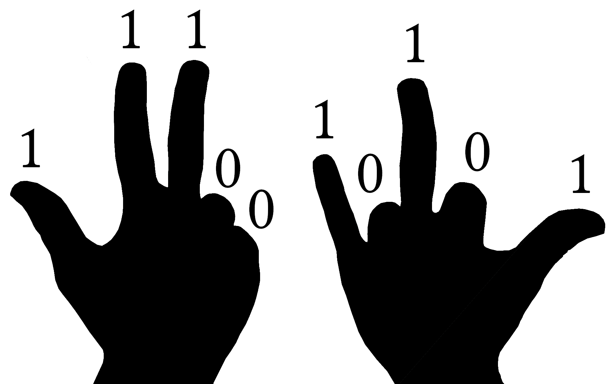

如果你把手伸出来，它们在这个寄存器中计为 1。如果没有伸出来，它们计为 0。这意味着在你决定适当的指配置后，你就创建了一个可以从左到右读取的比特串，其中每个数字代表 2 的幂。在这个例子中，我们会有一个比特串 1110010101，它读作 917：

因为你有 10 个手指，每个手指代表 2 的幂，所以你可以数到最大值或 1023，这大约是简单手指计数的 100 倍！对于那些可能想知道为什么你能数到而不是精确的，记住每个手指代表 2 的幂。右拇指计为 2 的 3 次幂，左拇指是 2 的 2 次幂。当所有手指都伸出来时，我们已经数到了 2 的 10 次幂。

那么，如果我们想超越 1023 呢？嗯，我们可以从三进制（trits）开始用手指计数，其中 0 是闭合的，1 是半立起的，2 是完全立起的。实际上，我们有很多不同的方式可以移动我们的手来以奇数方式计数，但我们感兴趣的是一个更具体的问题：我们只用 10 个比特能数多高？

这几乎正是莫里斯在 1977 年左右在贝尔实验室遇到的问题 [[2]](#cite-2)。在那里，他被给了一个 8 位寄存器，并要求计数远高于。他的解决方案是发明一种新的方法，称为近似计数算法。使用这种方法，他可以以相对较低的错误率（标准差）数到大约。使用 10 个寄存器（手指），他可以用类似的参数数到大约，这无疑是令人印象深刻的！

近似计数算法是流式算法的早期前身，在这种算法中，信息必须在大约实时处理。当我们稍后深入研究这些方法时，这一章肯定会更新。目前，我们不会展示任何证明（尽管这些证明也可能稍后出现），但这种方法的一个严格的数学描述可以在菲利普·弗洛热特（Philippe Flajolet）的后续论文中找到 [[3]](#cite-3)。此外，还有几个博客和在线资源，以不同的可访问程度涵盖了这种方法 [[4]](#cite-4) [[5]](#cite-5)。

在这里，我们希望提供一个对方法的基本理解，并为那些可能希望在将来尝试类似事情的人提供代码实现。

## 一个简单的例子

如果我们需要用 8 位计数超过 255 个项目，有一个相对简单的策略：每数一个项目。这意味着我们将计数器增加 2、4、6、8...个项目，实际上将可计数的项目数量加倍到 511！（注意：感叹号是出于兴奋，并不是阶乘。）同样，如果我们需要计数超过 511，我们可以每 3 或 4 个项目增加一次计数器；然而，这种方法的一个明显缺点是，如果我们只数每个项目，就无法表示奇数。同样，如果我们每数第 3 或第 4 个项目，就会错过任何不是增量数倍数的数字。

从这一推理过程中提炼出的最重要的东西是，计数可以通过将过程分为两个不同的动作来进行某种程度的近似：增加计数器和存储计数。例如，每次有羊经过时，你可以举起手指。在这种情况下，看到羊的动作是增加你的计数器的触发器，这个计数器存储在你的手上。正如提到的，你也可以每次有 2 或 3 只羊经过时举起手指，以在你的手上进行更高位的计数。在代码中，位显然比手更适合长期存储。

将这个例子进一步扩展，想象一下计数 1,000,000 只羊。如果我们想在 8 位（最大值为 255）上保存所有这些羊，我们可以每只羊增加一次计数器。通过这种方式计数，我们首先需要数大约 4000 只羊，然后才能将主计数器增加 1。当所有羊都经过后，我们的计数器会数到 250，并且在一个单独的计数器上数到 250 次。这有几个重要的后果：

1.  如果最终的羊数不是 4000 的倍数，那么我们将有一个与总计数最多 4000（0.4%）相关的误差。

1.  如果羊的数量不是 4000 的倍数，那么就无法确定最终的羊数。

1.  现在，我们需要一种方法在增加主计数器之前数到 4000。这意味着我们需要第二个计数器！

在某种意义上，4000 将是我们的系统的一种“计数分辨率”。总的来说，0.4%的误差并不坏，但我们可以通过利用随机性来确保近似计数更加准确（但可能不太精确）。

也就是说，我们不是每 4000 只羊增加一次计数器，而是可以给每个项目一个增加主计数器的机会。这平均下来大约是每 4000 只羊增加一次计数，但大量计数实验的期望值应该是正确的数字。这意味着尽管我们需要多次计数羊以获得正确的期望值，但我们不再需要为 4000 的计数分辨率保持一个单独的计数器。

由于需要多次计数试验以确保正确的结果，每次计数实验都会有一些相关的误差（有时误差可能远高于 0.4%）。为了量化这个误差，让我们实际进行多次实验，如下所示：

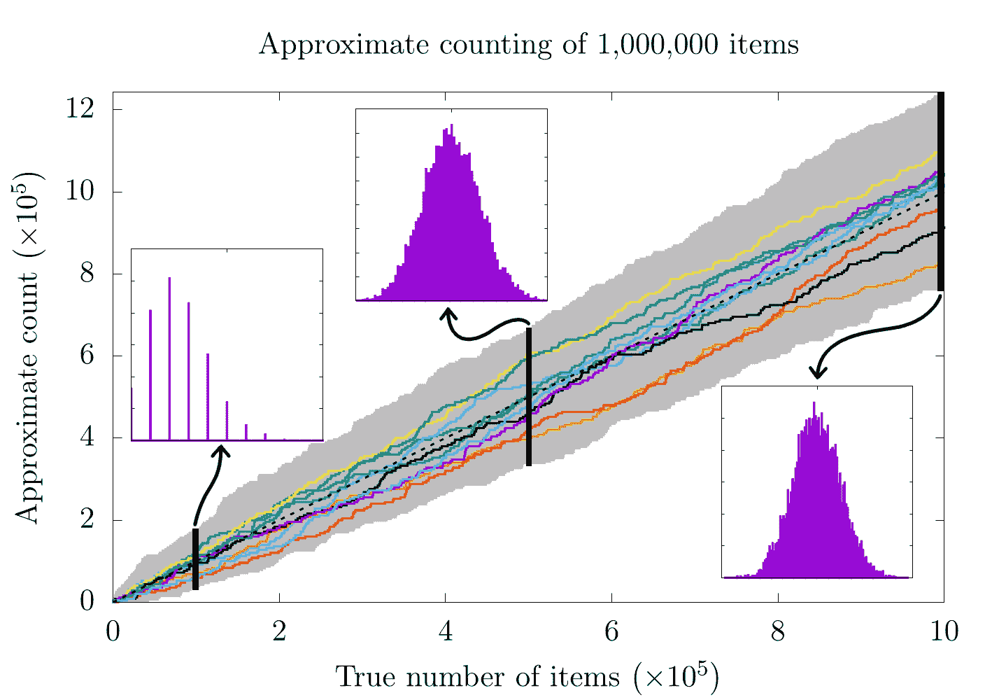

在这张图像中，我们计数了 1,000,000 只羊（项目）10,000 次。在每次运行中，我们给每个项目 0.025%的机会翻转我们的主要计数器，并给我们的主要计数器的每次增加分配了 4000 个项目的权重。我们绘制了 10,000 次运行中的 10 次（随机选择），线条的每次向上跳动代表一个项目赢得一次机会游戏，并将 1 添加到主要计数器中，从而将 4000 添加到近似计数中。我们还用灰色阴影表示了 10,000 次试验中每个真实计数的最大和最小近似计数，从而突出了可能的输出范围。在图表上方，我们显示了在 10,000、500,000 和 1,000,000 个项目时近似计数的分布。

这里有很多东西需要解释，所以让我们从向上的趋势线开始。在这里，看起来大约的计数大致遵循（虚线黑色线），这表明简单的计数（没有任何随机性或近似）。这在理想世界中是有意义的，因为在大约的计数总是完全等于被计数的真实项目数量。不幸的是，这里显示的任何线条都没有完全遵循。事实上，由于我们总是在 4000 的步长中增加近似值，而真实计数随着每个新项目的增加而增加 1，所以任何近似都不可能做到这一点。尽管如此，所有这些计数值的*平均*对于真实项目数量来说是一个非常好的近似。

这就是 3 个额外图表的作用所在：

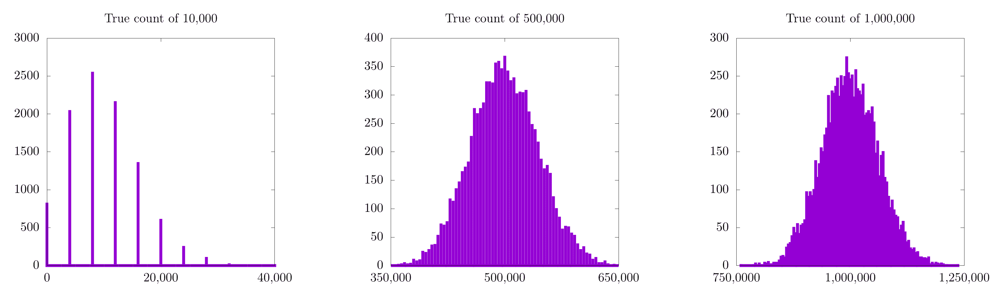

这些都是 10,000 次运行在 10,000（左）、500,000（中）和 1,000,000（右）个项目时近似计数的直方图。所有三个（尤其是 1,000,000 的近似）看起来都是高斯分布，高斯曲线的峰值似乎就是正确的计数。事实上，我们近似计数方案的期望值总是正确的。在实践中，这意味着我们可以通过进行大量计数试验并平均其结果来近似任何小数位的计数。

当我们查看 10,000 个项目的近似值时，还有一些小问题变得更为明显。在这种情况下，尽管高斯分布的期望值看起来是正确的，但很难确切知道，因为每个单独实验只有 8（或如此）个可能值。本质上，我们正在尝试以 4,000 的步长计数到 10,000。显然，在任何单独运行中，我们最接近的值要么是 8,000，要么是 12,000，因为这些都是 4,000 的倍数。简单来说：我们无法用这种方法分辨出 10,000 个物品！

这是否意味着这种计数方法对于少量物品来说不太有用？从某种意义上说，是的。以下是 10,000、500,000 和 1,000,000 的真实计数、近似计数和百分误差的表格，其中我们进行了 10,000 次计数实验：

| 真实计数 | 近似计数 | 百分误差 |
| --- | --- | --- |
| 10,000 | 9,958.0 | 0.42 |
| 500,000 | 499,813.2 | 0.037 |
| 1,000,000 | 999,466.0 | 0.053 |

在这里，当我们计数 10,000 个项目时，百分比误差似乎高出了 10 倍；然而，有了这些数字，我想有些人读到这里可能会想，我们是不是在吹毛求疵。0.42%的误差仍然是非常好的，对吧？对。这绝对不算差，但这是在 10,000 次计数实验中得到的。这里有一个新的表格，我们只做了 10 次：

| 真实计数 | 近似计数 | 百分误差 |
| --- | --- | --- |
| 10,000 | 8,000.0 | 20.0 |
| 500,000 | 483,200.0 | 3.36 |
| 1,000,000 | 961,600.0 | 3.84 |

这次，在计数到 10,000 时出现了 20%的误差，这实在是太高了！

为了解决这个问题，我们需要找到一种方法，让实际计数器上每个增量值对于较低计数更有意义。这正是对数的工作，我们将在下一节中探讨。现在，重要的是要看看另一个异常：为什么 500,000 和 1,000,000 案例的百分比误差如此接近？

我必须说实话，我不知道正确的答案，但我猜测这可能与 500,000 和 1,000,000 都是 4,000 的倍数有关，因此我们的计数方案可以以大致相同的精度解决它们。除此之外，这两个值都显著高于 4,000，因此计数分辨率对测量计数的影响并不那么显著。简单来说，4,000 是计数到 10,000 时的一大步，但在计数到 500,000 或 1,000,000 时则小得多。

作为一个重要的注意事项，上述表格中显示的每个近似计数都是不同计数实验高斯概率分布的期望值，所有这些实验都提供了一个关于计数可能性的猜测。因为我们不再使用整数增量计数，而是使用概率分布，我们现在需要用概率的工具来量化我们的误差，即标准差。

在下一节中，我们将解决这里提出的两个问题：

1.  为了更好地近似不同的计数尺度，使用对数尺度是有意义的。

1.  由于我们是通过对一组计数实验的高斯概率分布的期望值进行计数，因此使用概率和统计学中学习的工具来量化误差是有意义的。

所以我想我们应该赶快行动起来！

## 添加对数

在这个阶段，我认为使用与 Morris 原始论文 [[2]](#cite-2) 更接近的术语很重要，因此我们将开始谈论事件，这是对之前的项目/羊的类比的一般抽象。我们还将介绍三个不同的值：

+   : 发生的事件数量。

+   : 我们存储在位串中的数字。

+   : 发生事件的近似数量。

在这里停下来思考实际发生的事情是很重要的。我们有一定数量的事件 () 已经发生，并将该数字存储在二进制寄存器上作为 。传统上，存储在二进制寄存器上的数字将正好等于事件数量，但由于寄存器空间不足，我们最终只能满足于事件数量的近似值， 。这正是我们在前面的例子中所做的，其中  和 。

如前所述，使用常数缩放值（4000）作为我们的近似计数方案意味着对于较少的事件数，这种近似并不理想。因此，可能更合适的是创建一种新的方法来存储事件数量，使用对数尺度，使得

这意味着近似计数将是

在这种情况下，我们向对数函数的参数添加 1，因为  和我们是从 1 开始计数的；因此，我们需要某种方式来表示 0 的值。为此，我们可以使用任何底数的对数（如 ），但由于我们处理的是位，使用底数 2 是有意义的。我们将在下一节讨论不同的底数。为了清楚起见，以下是位串中可以存储的几个值及其相应的近似计数表：

|  |  |
| --- | --- |
|  | 0 |
|  |  |
|  |  |
|  |  |
|  |  |
|  |  |
|  |  |
|  |  |

这意味着我们可以使用这种方法用 8 位存储从  到  的值。

现在我们来思考每次新事件发生时会发生什么。为此，Morris 计算了一个新的值：

在寄存器中存储的是下一个可能值的近似计数。在这种情况下，将始终介于 0 和 1 之间，因此我们可以将其视为是否增加存储计数的概率。例如，如果我们有一个存储值为 2（），那么

这表明从 2 增加到 3 的概率将是 25%。在实践中，这意味着我们需要创建另一个随机变量  并设置计数器，使得

再次，  实质上是我们在每个对象上增加计数器的概率，随着计数的增加，这个概率呈指数下降。


注意：此图的-y 轴使用对数刻度，这就是为什么它看起来像一条直线。

在离开这一节之前，重要的是要注意，使用 8 位寄存器，任何人都可以使用这种方法在 2 的底数下计数到。这太棒了！远远超过 255，但我们还可以使用不同的对数底数来提高计数。例如，如果我们使用作为我们的底数，我们可以达到。此外，通过选择较小的底数，我们还可以为较低的值找到更精确的近似计数。在实践中，我们希望选择一个底数，使我们能够计数到与预期事件数量相同（或高一个数量级）的值。

在下一节中，我们将考虑如何将这种对数方法推广到考虑任意底数。

## 一个稍微更一般的对数

让我们先考虑底数和底数之间的差异。对于底数，

如果我们要更新我们的计数并希望尽可能保持计数器中的值准确，那么每次新事件发生时寄存器中的新值将是

这通常不是一个整数，但*必须*是一个整数（除非我们想要尝试存储浮点值（我们肯定没有空间）），那么在这种情况下我们该怎么办？

好吧，让我们看看第一个事件，我们需要将计数从 0 增加到 1。以底数为，只有 58%的概率会计数第一个事件（），如果事件被计数，寄存器中的值将是。再次，大量试验的期望值是正确的，但我们没有在底数为 2 时遇到这个问题，因为

当。作为提醒，上述公式是将任何给定底数（在这种情况下）的对数转换为另一个底数（在这种情况下为 2）的方法。

再进一步，我们需要选择一个特定的底数，以确保对数的第一次计数是正确的，因此，Morris 研究了特定的解决方案：

在这里，是一个有效的调整参数，它设置了由位串允许的最大计数和预期误差。表达式作为对数和指数的底数，并确保第一次计数将也将设置。例如，如果位串的最大值可以是 255（对于 8 位），我们任意设置，那么使用这种方法可能的最大计数将是，这是 Morris 论文中报告的数字。如果我们进行一些计数实验，我们会发现这个公式比以前（当我们没有使用对数时）更接近较小的数字：

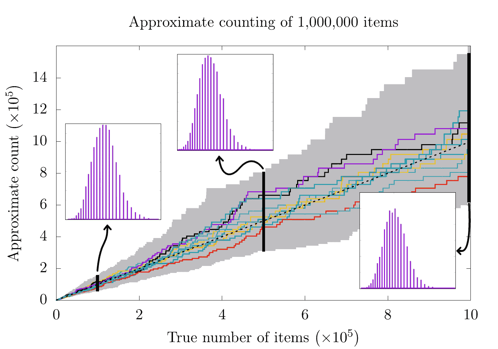

现在，让我们暂停一下，回顾一下我们的计数分辨率是常数 4000 的情况：


对于更高的计数，似乎之前的方法（具有恒定的计数分辨率）实际上更好！记住，在恒定计数分辨率的情况下，对于更高的计数，步长非常小，因此当我们计数 500,000 和 1,000,000 个项目时，我们得到了更高的分辨率概率分布。对于对数刻度，情况并非如此，因为计数分辨率现在随着计数本身而变化。这也是为什么对数缩放的所有三个概率分布之间每个条形之间的距离都相似。实际上，更具体地查看每个案例可能是有益的：

| 恒定计数分辨率 | 对数计数分辨率 |
| --- | --- |
| 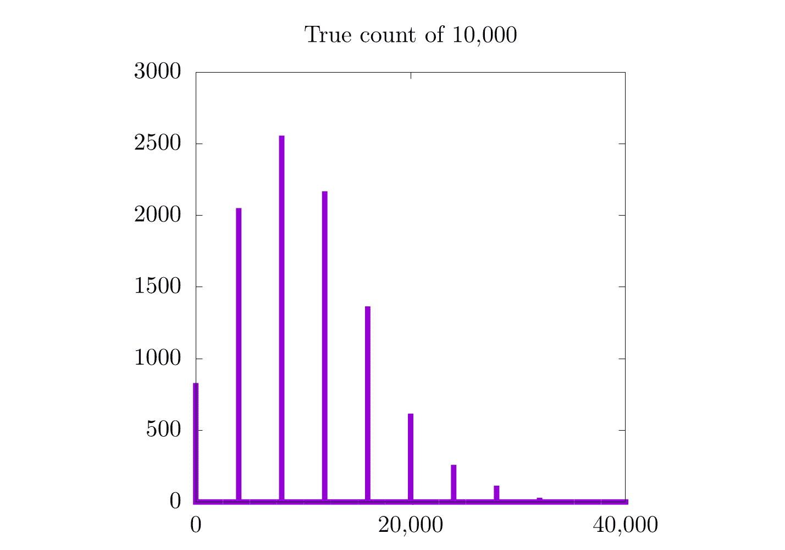 | 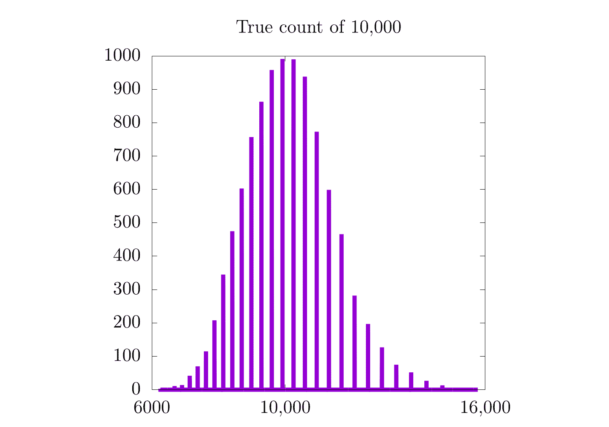 |
| 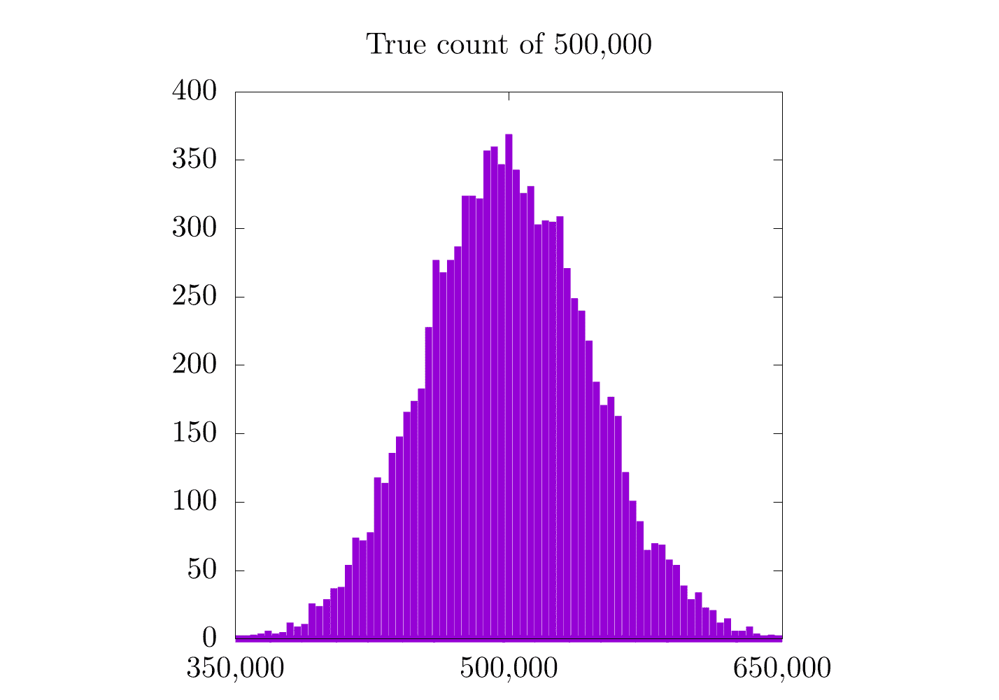 | 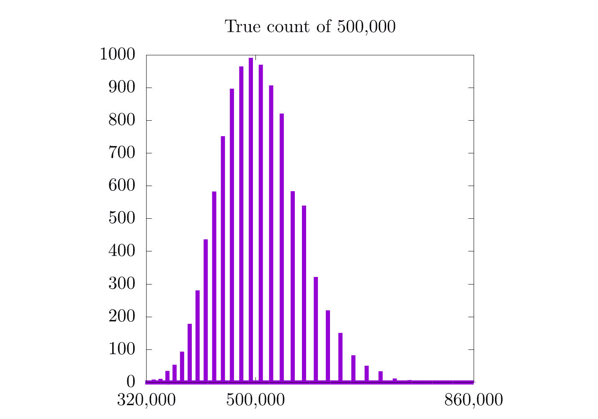 |
| 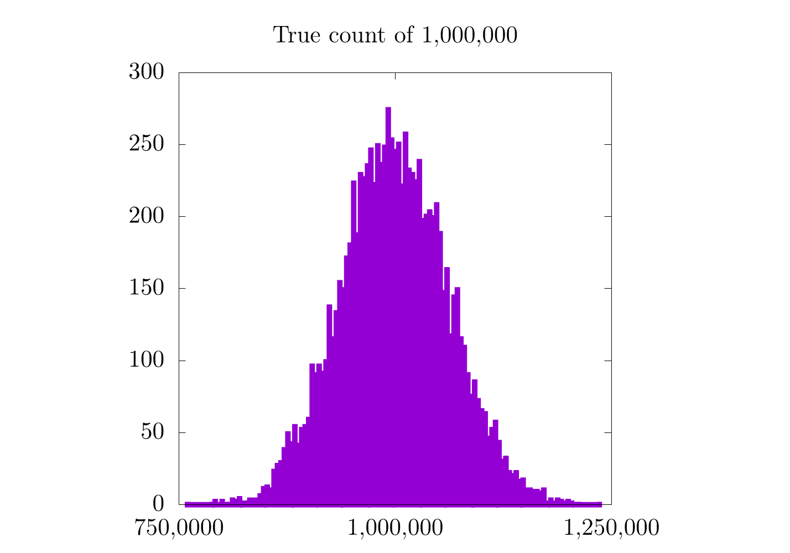 | 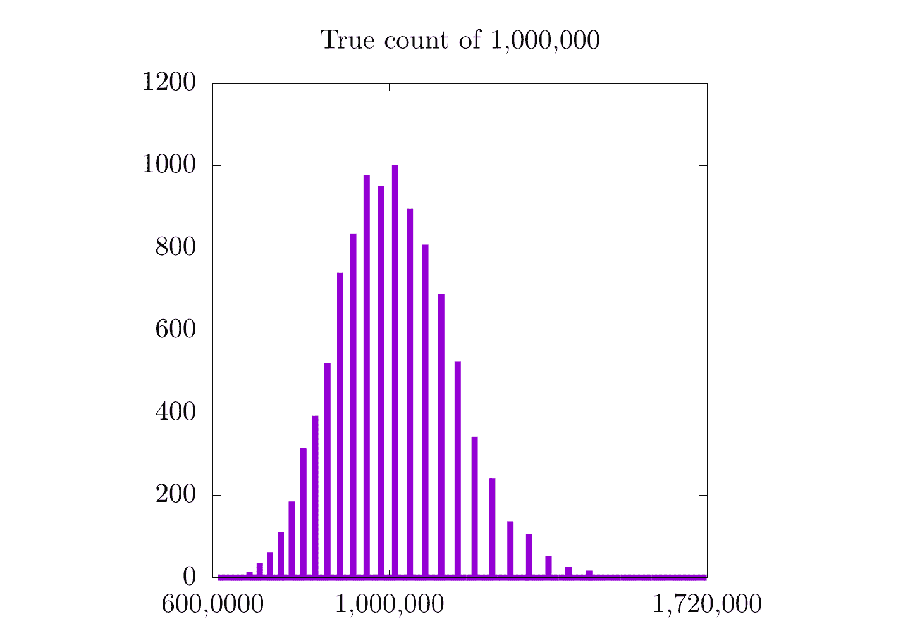 |

在我们只计数到 10,000 的情况下，我们看到概率分布的分辨率有所增加，但在 500,000 和 1,000,000 的情况下并没有。同样重要的是要注意，对数图略微偏向左侧，并且在 . 上沿对数尺度上是高斯分布。一方面，对数图很好，因为它们在所有尺度上都有相同的相对误差，但另一方面，误差相对较高。

我们如何解决这个问题？通过修改对数底数：

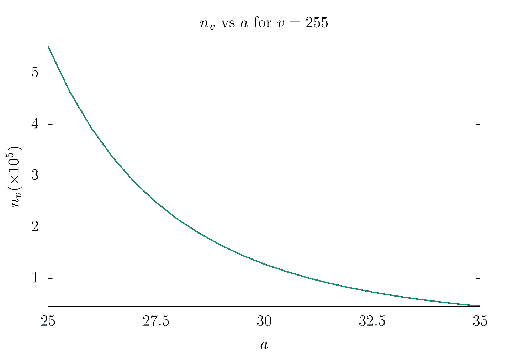

在这里，我们展示了当 . 时，对于 . 的差异。根据每个实验预期的最大计数来调整是很重要的。作为重要提示，每个计数的预期误差估计（方差）将是

最后，在结束论文之前，Morris 提到，对于所有可能的整数，即该位串可能的最大值（例如，8 位为 255），可以预先计算所有值。这可能比现在更有用，但如果你发现自己正在使用计算受限的机器上工作，这仍然值得记住。

## 视频解释

这里有一个描述近似计数算法的视频：

[`www.youtube-nocookie.com/embed/c4RJhPsc14s`](https://www.youtube-nocookie.com/embed/c4RJhPsc14s)

## 示例代码

对于这个例子，我们回到了上面提出的问题：使用近似计数算法，一个人可以用手指计数多高？我们知道，根据公式，使用 和 10 位，我们应该能够计数到 ，但当我们实际进行实验时会发生什么呢？

由于我们没有要计数的对象，我们将使用一个`while`循环来模拟计数，直到我们的位串是 1023（）。

```
using Test 

# This function takes 
#     - v: value in register
#     - a: a  scaling value for the logarithm based on Morris's paper
# It returns n(v,a), the approximate count
function n(v, a)
    a*((1+1/a)^v-1)  
end

# This function takes
#    - v: value in register
#    - a: a scaling value for the logarithm based on Morris's paper
# It returns a new value for v
function increment(v, a)
    # delta is the probability of incrementing our counter
    delta = 1/(n(v+1, a)-n(v, a))

    if rand() <= delta
        return v + 1
    else
        return v
    end
end

# This simulates counting and takes
#     - n_items: number of items to count and loop over
#     - a: a scaling value for the logarithm based on Morris's paper
# It returns n(v,a), the approximate count
function approximate_count(n_items, a)
    v = 0
    for i = 1:n_items
        v = increment(v, a)
    end

    return n(v, a)
end

# This function takes
#     - n_trials: the number of counting trials
#     - n_items: the number of items to count to
#     - a: a scaling value for the logarithm based on Morris's paper
#     - threshold: the maximum percent error allowed
# It returns a true / false test value
function test_approximate_count(n_trials, n_items, a, threshold)
    samples = [approximate_count(n_items, a) for i = 1:n_trials]

    avg = sum(samples)/n_trials

    if (abs((avg - n_items) / n_items) < threshold)
        println("passed")
    else
        println("failed")
    end
end

println("[#]\nCounting Tests, 100 trials")

println("[#]\ntesting 1,000, a = 30, 10% error")
test_approximate_count(100, 1000, 30, 0.1)

println("[#]\ntesting 12,345, a = 10, 10% error")
test_approximate_count(100, 12345, 10, 0.1)

# Note: with a lower a, we need more trials, so a higher % error here.
println("[#]\ntesting 222,222, a = 0.5, 20% error")
test_approximate_count(100, 222222, 0.5, 0.2) 
```

```
#include <assert.h>
#include <math.h>
#include <stdio.h>
#include <stdlib.h>
#include <time.h>

// This function returns a pseudo-random number between 0 and 1
double drand()
{
    return (double)rand() / RAND_MAX;
}

// This function takes
//  - v: value in register
//  - a: a scaling value for the logarithm based on Morris's paper
// It returns the approximate count
double n(double v, double a)
{
    return a * (pow(1 + 1 / a, v) - 1);
}

// This function takes
//  - v: value in register
//  - a: a scaling value for the logarithm based on Morris's paper
// It returns a new value for v
double increment(double v, double a)
{
    // delta is the probability of incrementing our counter
    double delta = 1 / (n(v + 1, a) - n(v, a));

    if (drand() <= delta) {
        return v + 1;
    }
    return v;
}

// This function simulates counting and takes
//  - n_items: number of items to count and loop over
//  - a: a scaling value for the logarithm based on Morris's paper
// It returns n(v, a), the approximate count
double approximate_count(size_t n_items, double a)
{
    double v = 0;
    for (size_t i = 0; i < n_items; ++i) {
        v = increment(v, a);
    }

    return n(v, a);
}

// This function takes
//  - n_trials: the number of counting trials
//  - n_items: the number off items to count
//  - a: a scaling value for the logarithm based on Morris's paper
//  - threshold: the maximum percent error allowed
// It terminates the program on failure
void test_approximation_count(size_t n_trials, size_t n_items, double a,
                              double threshold)
{
    double sum = 0.0;
    for (size_t i = 0; i < n_trials; ++i) {
        sum += approximate_count(n_items, a);
    }
    double avg = sum / (double)n_trials;

    double items = (double)n_items;
    if (fabs((avg - items) / items) < threshold){
        printf("passed\n");
    }
    else{
        printf("failed\n");
    }
}

int main()
{
    srand((unsigned int)time(NULL));

    printf("[#]\nCounting Tests, 100 trials\n");
    printf("[#]\ntesting 1,000, a = 30, 10%% error\n");
    test_approximation_count(100, 1000, 30, 0.1);
    printf("[#]\ntesting 12,345, a = 10, 10%% error\n");
    test_approximation_count(100, 12345, 10, 0.1);
    printf("[#]\ntesting 222,222, a = 0.5, 20%% error\n");
    test_approximation_count(100, 222222, 0.5, 0.2);

    return 0;
} 
```

```
#include <cmath>
#include <iostream>
#include <numeric>
#include <random>

// Returns a pseudo-random number generator
std::default_random_engine& rng() {
  // Initialize static pseudo-random engine with non-deterministic random seed
  static std::default_random_engine randEngine(std::random_device{}());
  return randEngine;
}

// Returns a random double in [0, 1)
double drand() {
  return std::uniform_real_distribution<double>(0.0, 1.0)(rng());
}

// This function takes
//     - v: value in register
//     - a: a  scaling value for the logarithm based on Morris's paper
// It returns n(v,a), the approximate count
auto n(double v, double a) { return a * (pow((1 + 1 / a), v) - 1); }

// This function takes
//    - v: value in register
//    - a: a scaling value for the logarithm based on Morris's paper
// It returns a new value for v
auto increment(int v, double a) {
  // delta is the probability of incrementing our counter
  const auto delta = 1 / (n(v + 1, a) - n(v, a));
  return (drand() <= delta) ? v + 1 : v;
}

// This simulates counting and takes
//     - n_items: number of items to count and loop over
//     - a: a scaling value for the logarithm based on Morris's paper
// It returns n(v,a), the approximate count
auto approximate_count(int n_items, double a) {
  auto v = 0;
  for (auto i = 0; i < n_items; ++i)
    v = increment(v, a);

  return n(v, a);
}

// This function takes
//     - n_trials: the number of counting trials
//     - n_items: the number of items to count to
//     - a: a scaling value for the logarithm based on Morris's paper
//     - threshold: the maximum percent error allowed
// It returns a "pass" / "fail" test value
auto test_approximate_count(
    int n_trials, int n_items, double a, double threshold) {
  auto sum = 0.0;
  for (auto i = 0; i < n_trials; ++i)
    sum += approximate_count(n_items, a);
  const auto avg = sum / n_trials;
  return std::abs((avg - n_items) / n_items) < threshold ? "passed" : "failed";
}

int main() {
  std::cout << "[#]\nCounting Tests, 100 trials\n";

  std::cout << "[#]\ntesting 1,000, a = 30, 10% error \n"
            << test_approximate_count(100, 1000, 30, 0.1) << "\n";
  std::cout << "[#]\ntesting 12,345, a = 10, 10% error \n"
            << test_approximate_count(100, 12345, 10, 0.1) << "\n";
  // Note : with a lower a, we need more trials, so a higher % error here.
  std::cout << "[#]\ntesting 222,222, a = 0.5, 20% error \n"
            << test_approximate_count(100, 222222, 0.5, 0.2) << "\n";
} 
```

```
from random import random

# This function takes
#   - v: value in register
#   - a: a scaling value for the logarithm based on Morris's paper
# It returns n(v,a), the approximate_count
def n(v, a):
    return a*((1 + 1/a)**v - 1)

# This function takes
#    - v: value in register
#    - a: a scaling value for the logarithm based on Morris's paper
# It returns a new value for v
def increment(v, a):
    delta = 1/(n(v + 1, a) - n(v, a))
    if random() <= delta:
        return v + 1
    else:
        return v

#This simulates counting and takes
#     - n_items: number of items to count and loop over
#     - a: a scaling value for the logarithm based on Morris's paper
# It returns n(v,a), the approximate count
def approximate_count(n_items, a):
    v = 0
    for i in range(1, n_items + 1):
        v = increment(v, a)
    return n(v, a)

# This function takes
#     - n_trials: the number of counting trials
#     - n_items: the number of items to count to
#     - a: a scaling value for the logarithm based on Morris's paper
#     - threshold: the maximum percent error allowed
# It returns a true / false test value
def test_approximate_count(n_trials, n_items, a, threshold):
    samples = [approximate_count(n_items, a) for i in range(1, n_trials + 1)]
    avg = sum(samples)/n_trials

    if abs((avg - n_items)/n_items) < threshold:
        print("passed")
    else:
        print("failed")

print("[#]\nCounting Tests, 100 trials")
print("[#]\ntesting 1,000, a = 30, 10% error")
test_approximate_count(100, 1000, 30, 0.1)
print("[#]\ntesting 12,345, a = 10, 10% error")
test_approximate_count(100, 12345, 10, 0.1)
print("[#]\ntesting 222,222, a = 0.5, 20% error")
test_approximate_count(100, 222222, 0.5, 0.2) 
```

```
// This function takes
//     - v: value in register
//     - a: a  scaling value for the logarithm based on Morris's paper
// It returns n(v,a), the approximate count
fn n(v: f64, a: f64) -> f64 {
    a * ((1_f64 + 1_f64 / a).powf(v) - 1_f64)
}

// This function takes
//    - v: value in register
//    - a: a scaling value for the logarithm based on Morris's paper
// It returns a new value for v
fn increment(v: f64, a: f64) -> f64 {
    // delta is the probability of incrementing our counter
    let delta = 1_f64 / (n(v + 1_f64, a) - n(v, a));

    if rand::random::<f64>() <= delta {
        v + 1_f64
    } else {
        v
    }
}

// This simulates counting and takes
//     - n_items: number of items to count and loop over
//     - a: a scaling value for the logarithm based on Morris's paper
// It returns n(v,a), the approximate count
fn approximate_count(n_items: usize, a: f64) -> f64 {
    let mut v = 0_f64;

    for _ in 0..n_items {
        v = increment(v, a);
    }

    v
}

// This function takes
//     - n_trials: the number of counting trials
//     - n_items: the number of items to count to
//     - a: a scaling value for the logarithm based on Morris's paper
//     - threshold: the maximum percent error allowed
// It returns a "passed" / "failed" test value
fn test_approximate_count(n_trials: usize, n_items: usize, a: f64, threshold: f64) {
    let avg = std::iter::from_fn(|| Some(approximate_count(n_items, a)))
                        .take(n_trials)
                        .sum::<f64>() / n_trials as f64;

    let n_items_float = n_items as f64;

    if ((avg - n_items_float) / n_items_float) < threshold {
        println!("passed");
    } else {
        println!("failed");
    }

}

fn main() {
    println!("testing 1,000, a = 30, 10% error");
    test_approximate_count(100, 1000, 30_f64, 0.1);
    println!("testing 12,345, a = 10, 10% error");
    test_approximate_count(100, 12345, 10_f64, 0.1);
    println!("testing 222,222, a = 0.5, 20% error");
    test_approximate_count(100, 222222, 0.5, 0.2);
} 
```

```
import java.lang.Math;
import java.util.stream.DoubleStream;

public class ApproximateCounting {

    /*
     * This function taks
     *   - v: value in register
     *   - a: a scaling value for the logarithm based on Morris's paper
     * It returns the approximate count
     */
    static double n(double v, double a) {
        return a * (Math.pow(1 + 1 / a, v) - 1);
    }

    /*
     * This function takes
     *   - v: value in register
     *   - a: a scaling value for the logarithm based on Morris's paper
     * It returns the new value for v
     */
    static double increment(double v, double a) {
        double delta = 1 / (n(v + 1, a) - n(v, a));

        if (Math.random() <= delta) {
            return v + 1;
        } else {
            return v;
        }
    }

    /*
     * This function takes
     *   - v: value in register
     *   - a: a scaling value for the logarithm based on Morris's paper
     * It returns the new value for v
     */
    static double approximateCount(int nItems, double a) {
        double v = 0;

        for (int i = 0; i < nItems; i++) {
            v = increment(v, a);
        }

        return n(v, a);
    }

    /*
     * This function takes
     *   - nTrials: the number of counting trails
     *   - nItems: the number of items to count
     *   - a: a scaling value for the logarithm based on Morris's paper
     *   - threshold: the maximum percent error allowed
     * It terminates the program on failure
     */
    static void testApproximateCount(int nTrials, int nItems, double a, double threshold) {
        double avg = DoubleStream.generate(() -> approximateCount(nItems, a))
                     .limit(nTrials)
                     .average()
                     .getAsDouble();

        if (Math.abs((avg - nItems) / nItems) < threshold) {
            System.out.println("passed");
        } else {
            System.out.println("failed");
        }
    }

    public static void main(String args[]) {
        System.out.println("[#]\nCounting Tests, 100 trials");
        System.out.println("[#]\ntesting 1,000, a = 30, 10% error");
        testApproximateCount(100, 1_000, 30, 0.1);

        System.out.println("[#]\ntesting 12,345, a = 10, 10% error");
        testApproximateCount(100, 12_345, 10, 0.1);

        System.out.println("[#]\ntesting 222,222, a = 0.5, 20% error");
        testApproximateCount(100, 222_222, 0.5, 0.2);
    }

} 
```

### 参考文献

1. Sanderson, G, [如何用两只手数到 1000](https://youtu.be/1SMmc9gQmHQ), 2015. 2. Morris, R, 在小寄存器中计数大量事件，*ACM New York, NY, USA*, 1978. 3. Flajolet, P, 近似计数：详细分析，*Springer*, 1985. 4. Bhayani, A, [Morris 的近似计数算法](https://arpitbhayani.me/blogs/morris-counter), 2020. 5. Gundersen, G, [使用 Morris 算法进行近似计数](http://gregorygundersen.com/blog/2019/11/11/morris-algorithm/), 2019.

## 许可证

##### 代码示例

代码示例授权于 MIT 许可（可在[LICENSE.md](https://github.com/algorithm-archivists/algorithm-archive/blob/main/LICENSE.md)中找到）。

##### 文本

本章的文本由[James Schloss](https://github.com/leios)编写，并授权于[Creative Commons Attribution-ShareAlike 4.0 国际许可协议](https://creativecommons.org/licenses/by-sa/4.0/legalcode)。

[](https://creativecommons.org/licenses/by-sa/4.0/)


#### 图片/图形

+   图片“手指计数”由[James Schloss](https://github.com/leios)创建，并授权于[Creative Commons Attribution-ShareAlike 4.0 国际许可协议](https://creativecommons.org/licenses/by-sa/4.0/legalcode)。

+   图片“近似试验”由[James Schloss](https://github.com/leios)创建，并授权于[Creative Commons Attribution-ShareAlike 4.0 国际许可协议](https://creativecommons.org/licenses/by-sa/4.0/legalcode)。

+   图片“直方图”由[James Schloss](https://github.com/leios)创建，并授权于[Creative Commons Attribution-ShareAlike 4.0 国际许可协议](https://creativecommons.org/licenses/by-sa/4.0/legalcode)。

+   图片“Δv v”由[James Schloss](https://github.com/leios)创建，并授权于[Creative Commons Attribution-ShareAlike 4.0 国际许可协议](https://creativecommons.org/licenses/by-sa/4.0/legalcode)。

+   图片“近似试验对数”由[James Schloss](https://github.com/leios)创建，并授权于[Creative Commons Attribution-ShareAlike 4.0 国际许可协议](https://creativecommons.org/licenses/by-sa/4.0/legalcode)。

+   图片“直方图 10,000”由[James Schloss](https://github.com/leios)创建，并授权于[Creative Commons Attribution-ShareAlike 4.0 国际许可协议](https://creativecommons.org/licenses/by-sa/4.0/legalcode)。

+   图片“直方图实验 10,000”由[James Schloss](https://github.com/leios)创建，并授权于[Creative Commons Attribution-ShareAlike 4.0 国际许可协议](https://creativecommons.org/licenses/by-sa/4.0/legalcode)。

+   图片“直方图 500,000”由[James Schloss](https://github.com/leios)创作，并授权于[Creative Commons Attribution-ShareAlike 4.0 国际许可协议](https://creativecommons.org/licenses/by-sa/4.0/legalcode)。

+   图片“直方图实验 500,000”由[James Schloss](https://github.com/leios)创作，并授权于[Creative Commons Attribution-ShareAlike 4.0 国际许可协议](https://creativecommons.org/licenses/by-sa/4.0/legalcode)。

+   图片“直方图 1,000,000”由[James Schloss](https://github.com/leios)创作，并授权于[Creative Commons Attribution-ShareAlike 4.0 国际许可协议](https://creativecommons.org/licenses/by-sa/4.0/legalcode)。

+   图片“直方图实验 1,000,000”由[James Schloss](https://github.com/leios)创作，并授权于[Creative Commons Attribution-ShareAlike 4.0 国际许可协议](https://creativecommons.org/licenses/by-sa/4.0/legalcode)。

+   图片“从 25 到 35 的 A”由[James Schloss](https://github.com/leios)创作，并授权于[Creative Commons Attribution-ShareAlike 4.0 国际许可协议](https://creativecommons.org/licenses/by-sa/4.0/legalcode)。
