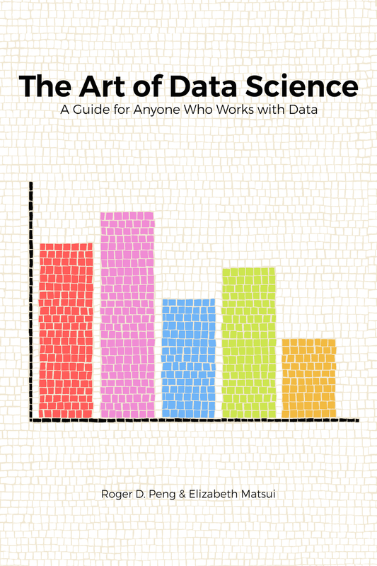

## 数据科学的艺术

### 为所有与数据打交道的人提供指南

#### 罗杰·D·彭（Roger D. Peng）和伊丽莎白·松井（Elizabeth Matsui）

本书在 [`leanpub.com/artofdatascience`](http://leanpub.com/artofdatascience) 上有售

本版本发布于 2017-01-13

*   *   *   *   *

这是一本 [Leanpub](http://leanpub.com) 的书。Leanpub 使用精益出版流程赋予作者和出版商权力。[精益出版](http://leanpub.com/manifesto) 是使用轻量级工具和多次迭代来发布正在进行中的电子书的行为，以获得读者反馈，直到你有了合适的书，并且在获得反馈后建立起动力。 

*   *   *   *   *

© 2015 - 2017 Skybrude Consulting, LLC

特别感谢玛吉·松井（Maggie Matsui），她为本书创作了所有的艺术品。
