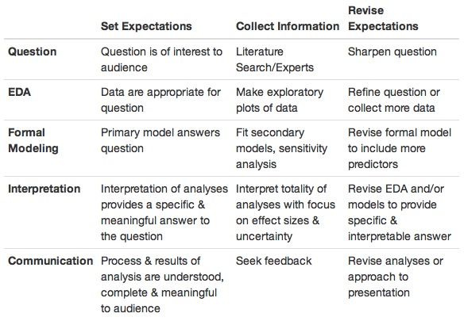

## 2\. 分析的小圈

对于初学者来说，数据分析可能看起来像是一个线性的、一步接一步的过程，在最后，得到一个包装精美、连贯的结果。实际上，数据分析是一个高度迭代和非线性的过程，更好地反映在一系列小圈中（见图），在每一步都学到信息，然后根据学到的信息决定是否（以及如何）完善和重做刚刚执行的步骤，或者是否（以及如何）继续进行下一步。

小圈是一个小圆，其圆心在较大圆的周长上移动。在数据分析中，应用于数据分析各个步骤的迭代过程可以被构想为一个小圈，该小圈沿着整个数据分析过程的周长重复出现。一些数据分析似乎是固定的和线性的，例如嵌入到各种软件平台中的算法，包括应用程序。然而，这些算法是作为最终数据分析产品出现的，这些产品是从开发和完善数据分析的非线性工作中产生的，使其可以被“算法化”。

分析的小圈

### 2.1 布景

在深入讨论“分析的小圈”之前，停下来考虑一下我们所说的“数据分析”是什么意思会很有帮助。虽然本书中讨论的许多概念适用于进行*研究*，但本章和后续章节中的框架和概念专门针对进行*数据分析*。虽然研究包括制定和执行收集数据的计划，但数据分析的框架和概念假定数据已经收集完毕。更具体地说，研究包括发展假设或问题、设计数据收集过程（或研究方案）、收集数据以及分析和解释数据。因为数据分析假设数据已经收集完毕，所以它包括发展和完善问题以及分析和解释数据的过程。值得注意的是，尽管数据分析通常是在不进行研究的情况下执行的，但它也可以作为研究的组成部分来执行。

### 2.2 分析的小圈

数据分析有 5 个核心活动：

1.  提出和完善问题

1.  探索数据

1.  建立正式的统计模型

1.  解释结果

1.  传达结果

这 5 个活动可以在不同的时间尺度上发生：例如，你可能会在一天内经历所有 5 个活动，但对于一个大项目，可能会在许多个月的时间里处理每一个活动。在讨论这些核心活动之前，这些活动将在后面的章节中发生，首先要了解用于处理每个活动的整体框架是很重要的。

尽管在进行数据分析时可能会参与许多不同类型的活动，但整个过程的每个方面都可以通过我们称之为“数据分析的小周期”的迭代过程来处理。 更具体地说，对于五个核心活动中的每一个，重要的是您执行以下步骤：

1.  设置期望，

1.  收集信息（数据），将数据与您的期望进行比较，如果期望不符合，

1.  修订您的期望或修复数据，使您的数据与您的期望相匹配。

通过这个三步骤的过程进行迭代是我们称之为“数据分析的小周期”的。 在进行分析的每个阶段时，您都需要通过小周期不断完善您的问题，您的探索性数据分析，您的正式模型，您的解释以及您的沟通。

通过完成数据分析的每个核心活动的重复循环，形成了数据分析的更大循环（见图）。 在本章中，我们将详细介绍这个三步骤的小周期过程，并举例说明如何将其应用到您的数据分析中。

分析的小周期

### 2.3 设置期望

制定期望是在您做任何事情之前有意识地思考您的期望的过程，比如检查您的数据，执行程序或输入命令。 对于经验丰富的数据分析师，在某些情况下，制定期望可能是一种自动的，几乎是下意识的过程，但这是一个重要的活动，需要培养和有意识地进行。

例如，您可能要和朋友一起去一家只收现金的餐厅吃饭，需要先去取钱。 要决定要取多少钱，您必须对晚餐的费用有所期望。 这可能是一种自动的期望，因为您经常在这家餐厅用餐，所以您知道那里一顿饭的典型费用是多少，这将是一个先验知识的例子。 先验知识的另一个例子可能是知道您所在城市的餐厅的典型餐费，或者知道您所在城市最昂贵的餐厅的餐费。 使用这些信息，您也许可以给出一顿饭的费用的上限和下限。

您可能还会寻求外部信息来制定您的期望，这可能包括询问您将要一起用餐的朋友，或者之前在餐厅吃过饭的朋友和/或在网上搜索餐厅以获取一般成本信息或带有价格的菜单。 当您检查数据或执行分析程序时，您使用任何先验信息和/或外部来源来确定您的期望的这一过程，适用于数据分析过程的每个核心活动。

### 2.4 收集信息

这一步涉及收集有关你的问题或你的数据的信息。对于你的问题，你通过进行文献搜索或询问专家来收集信息，以确保你的问题是一个好问题。在下一章中，我们将讨论一个好问题的特征。对于你的数据，在你对你的数据进行检查或执行分析程序时，如果你对结果有一些期望，那么你就执行操作。那个操作的结果就是你需要收集的数据，然后你确定你收集的数据是否与你的期望相匹配。延伸到餐厅的比喻，当你去餐厅时，拿到账单就是收集数据。

### 2.5 将期望与数据进行比较

现在你手头有了数据（在餐厅的账单），下一步是将你的期望与数据进行比较。有两种可能的结果：你的花费预期与账单上的金额相匹配，或者不匹配。如果你的期望和数据匹配，太棒了，你可以继续下一个活动。另一方面，如果你的期望是 30 美元，但账单是 40 美元，你的期望和数据就不匹配。对于不一致有两种可能的解释：首先，你的期望是错误的，需要修订，或者，账单是错误的，包含了一个错误。你查看账单发现，你被收了两份甜点，而不是你点的一份，于是得出结论，数据有错误，要求更正账单。

你的数据分析进行得有多顺利的一个关键指标是将你收集到的数据与你最初的期望相匹配的容易程度。你希望设置你的期望和你的数据，使得将两者对应起来变得容易。在餐厅的例子中，你的期望是$30，而数据显示餐费是$40，所以很容易看出(a) 你的期望偏差了$10，(b) 这顿饭比你想象的要贵。当你再次来到这个地方时，你可能会多带$10。如果我们最初的期望是这顿饭的价格在$0 到$1,000 之间，那么我们的数据确实落入了这个范围，但我们学到了多少并不清楚。例如，下次你再来时会改变你的行为吗？期望一顿$30 的餐费有时被称为尖锐的假设，因为它陈述了一些非常具体的内容，可以用数据来验证。

### 2.6 应用分析过程的周转轮

在我们讨论几个例子之前，让我们回顾一下每个核心数据分析活动要使用的三个步骤。这些是：

1.  设置期望，

1.  收集信息（数据），将数据与你的期望进行比较，如果期望不匹配，

1.  修订你的期望或修正数据，使你的期望与数据相匹配。

#### 例子：美国的哮喘患病率

让我们将“数据分析周期”应用到一个非常基本的例子中。假设你最初的问题是确定成人哮喘的患病率，因为你的公司想要了解一种新的哮喘药物可能的市场规模。你有一个由你的老板确定的一般问题，但需要：（1）明确问题，（2）探索数据，（3）建立统计模型，（4）解释结果，和（5）传达结果。我们将把“周期”应用到这五个核心活动中的每一个上。

对于第一个活动，细化问题，你首先会发展出你对问题的期望，然后收集关于问题的信息，并确定你收集到的信息是否符合你的期望，如果不符合，你将修改问题。你的期望是这个问题的答案是未知的，而且这个问题是可回答的。然而，文献和互联网搜索显示，这个问题已经得到了答案（并且由疾病控制中心（CDC）持续回答），所以你重新考虑了问题，因为你可以简单地去 CDC 网站获取最近的哮喘患病率数据。

你告诉了你的老板，并开始一次对话，揭示了任何开发的新药物将针对那些目前无法控制的哮喘的人，所以你确定了一个更好的问题，即“在美国有多少人患有目前无法控制的哮喘，以及无法控制的哮喘的人口统计学预测因素是什么？”你重复收集信息的过程来确定你的问题是否可回答并且是否是一个好问题，并继续这个过程，直到你满意地精炼了你的问题，以便你有一个可以用现有数据回答的好问题。

让我们假设你已经确定了一个数据来源，可以从一个网站下载，并且是代表美国成年人口的样本，年龄在 18 岁及以上。下一个活动是探索性数据分析，你开始期望当你检查你的数据时，会有 10,123 行（或记录），每行代表美国的一个个体，因为这是文档或数据集附带的信息，或代码手册。代码手册还告诉你，数据集中将会有一个变量指示每个个体的年龄。

当你检查数据时，你会注意到只有 4,803 行，所以回到代码手册确认你对行数的预期是否正确，当你确认你的预期是正确的时候，你回到下载文件的网站发现有两个文件包含你所需的数据，一个文件包含 4,803 条记录，第二个文件包含剩下的 5,320 条记录。你下载了第二个文件，并将其读入你的统计软件包中，并将第二个文件附加到第一个文件上。

现在你有了正确的行数，所以你要继续确定人口年龄是否符合你的期望，即每个人都是 18 岁或以上。你总结了年龄变量，以便查看最小值和最大值，并发现所有个体都是 18 岁或以上，这与你的期望相符。虽然你会做更多的工作来检查和探索你的数据，但这两项任务是你要采取的方法的示例。最终，你将使用这个数据集来估计美国成年人中未控制的哮喘的患病率。

第三个活动是构建统计模型，这是为了确定最能预测某人是否患有未控制的哮喘的人口特征。统计模型用于精确制定你的问题，以便你能够准确地看到你想要如何使用你的数据，无论是估计特定的参数还是进行预测。统计模型还提供了一个正式的框架，你可以在其中挑战你的发现并测试你的假设。

现在你已经估计了美国成年人未控制的哮喘的患病率，并确定了年龄、性别、种族、体重指数、吸烟状况和收入是可用于预测未控制的哮喘的最佳预测因子，你转向第四个核心活动，即解释结果。实际上，在建立模型的过程中和在完成模型构建之后，解释结果是同时进行的，但从概念上讲，它们是不同的活动。

假设你已经构建了最终模型，所以你要开始解释你模型的发现。当你检查你的最终预测模型时，最初你的期望得到了匹配，因为年龄、非洲裔美国人/黑人种族、体重指数、吸烟状况和低收入都与未控制的哮喘呈正相关。

但是，当你的研究和专家讨论表明，在成年人中，女性性别应该与未控制的哮喘呈正相关时，你注意到女性性别与未控制的哮喘呈*反向*关联。预期与结果之间的这种不匹配使你停下来进行一些探索，以确定你的结果是否确实正确，你需要调整你的期望，还是你的结果而不是你的期望有问题。经过一番挖掘，你发现你曾认为性别变量是以 1 表示女性，0 表示男性，但实际上代码手册表明性别变量是以 1 表示男性，0 表示女性。因此，你对结果的解释是不正确的，而不是你的期望。现在你了解了性别变量的编码是什么，你对模型结果的解释与你的期望相符，所以你可以开始传达你的发现。

最后，你传达你的发现，是的，这个天体运动也适用于沟通。对于这个例子，让我们假设你已经准备了一个非正式报告，其中包括对你的发现的简要总结。你期望你的报告能传达你老板感兴趣的信息。你和老板一起审查发现，她提出了两个问题：（1）数据集中的数据最近是何时收集的，以及（2）未来 5-10 年内人口结构变化的预期将如何影响控制不住的哮喘的患病率。尽管你的报告并没有完全满足老板的需求可能会令人失望，但获得反馈是进行数据分析的关键部分，事实上，我们会认为一个好的数据分析需要沟通、反馈，然后对反馈做出反应。

尽管你知道数据收集的年份的答案，但你意识到你没有在报告中包含这些信息，所以你修改了报告以包含它。你还意识到你老板关于人口结构变化对控制不住的哮喘患病率的影响的问题是一个很好的问题，因为你的公司希望预测未来市场的规模，所以现在你有一个新的数据分析要处理。你应该感到高兴，你的数据分析提出了额外的问题，因为这是成功数据分析的一个特点。

在接下来的章节中，我们将大量使用这个框架来讨论数据分析过程中的每个活动如何需要不断地进行迭代。虽然一开始执行这三个步骤可能会感到乏味，但最终你会掌握技巧，整个过程的循环将自然而然地进行并在潜意识中发生。事实上，我们会认为大多数优秀的数据分析师甚至都没有意识到他们正在这样做！
