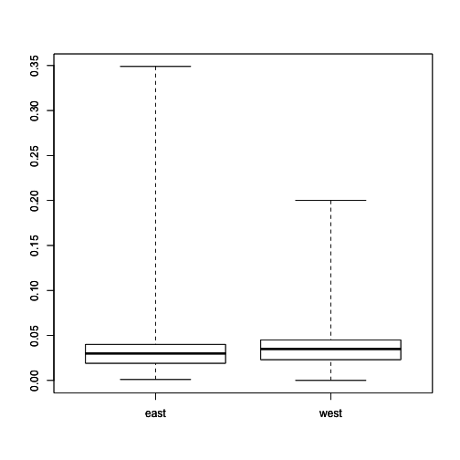

## 4\. 探索性数据分析

探索性数据分析是探索数据的过程，通常包括检查数据集的结构和组成部分，个体变量的分布以及两个或多个变量之间的关系。在探索性数据分析中最常依赖的工具是使用数据的图形表示进行可视化。数据可视化可以说是探索性数据分析中最重要的工具，因为图形显示传达的信息可以被很快地吸收，并且通常很容易在图形显示中识别出模式。

探索性数据分析有几个目标，包括：

1.  确定数据集是否存在任何问题。

1.  确定你正在问的问题是否可以由你拥有的数据来回答。

1.  开发问题答案的草图。

你的探索性数据分析应该由你的问题来指导。本章中使用的示例问题是：“东部美国的县是否比西部美国的县具有更高的臭氧水平？”在这种情况下，你将探索数据以确定数据集是否存在问题，并确定你是否可以使用这个数据集来回答你的问题。

当然，要回答这个问题，你需要臭氧、县和美国地区的数据。下一步是使用探索性数据分析开始回答你的问题，这可能包括显示美国地区的臭氧的箱线图。在探索性数据分析结束时，你应该对你的问题有一个很好的了解，并且具备足够的信息来继续进行数据分析的下一步。

在这里需要注意的是，再次强调了分析的外圈概念。你应该对数据集的情况有一个预期，以及你的问题是否可以通过你拥有的数据来回答。如果数据集的内容和结构与你的预期不符，那么你需要回过头去弄清楚你的预期是否正确（但数据存在问题）或者，你的预期是错误的，因此你不能使用数据集来回答问题，将需要找到另一个数据集。

您还应该对臭氧水平有一些期望，以及一个地区的臭氧是否应该高于（或低于）另一个地区的。当您转到开始回答问题的第 3 步时，您将再次应用分析的圆轨道，这样，例如，如果数据集中的臭氧水平低于您从以前发布的数据中看到的预期值，则您需要暂停并弄清楚您的数据是否有问题，或者您的预期是否不正确。例如，如果您设置有关臭氧水平的期望值的信息源于 20 年前收集的数据（当时水平可能较高）或仅来自美国的一个城市，您的期望可能不正确。我们将在下面的案例研究中详细介绍，但这应该给您一个关于探索性数据分析方法和目标的概述。

### 4.1 探索性数据分析检查表：案例研究

在本节中，我们将运行一个非正式的“检查表”，当进行探索性数据分析时要做的事情。作为一个运行示例，我将使用美国 2014 年的小时臭氧水平数据集。检查表的元素是

1.  构思您的问题

1.  读取您的数据

1.  检查包装

1.  查看您数据的顶部和底部

1.  检查您的“n”

1.  至少使用一个外部数据源进行验证

1.  制作绘图

1.  首先尝试简单的解决方案

1.  后续步骤

在本例中，我们将使用 R 代码和真实数据来描述正在进行的分析。这里的一些示例和建议将是针对 R 统计分析环境的特定的，但大多数应该适用于任何软件系统。精通 R 对于理解例子的主要思想并不是必需的。可以跳过代码部分。

### 4.2 构思您的问题

本书之前我们已经讨论了正确制定问题的重要性。构思一个问题可以是引导探索性数据分析过程并限制可以采用的任何大小的数据集的指数级路径数量的有用方法。特别是，一个*明确*的问题或假设可以作为一种维度减少工具，可以消除与问题不直接相关的变量。

例如，在本章中，我们将查看美国环境保护局（EPA）的空气污染数据集。一个普遍的问题可能是

> 东海岸的空气污染水平是否高于西海岸？

但一个更具体的问题可能是

> 纽约市的小时臭氧平均水平是否比洛杉矶高？

注意，这两个问题都可能是有趣的，没有对错之分。但第一个问题需要查看整个东西海岸的所有污染物，而第二个问题只需要查看两个城市中的单个污染物。

通常，花几分钟的时间弄清楚你真正感兴趣的问题，并尽可能地缩小范围（而不变得无聊）是一个好主意。

对于本章，我们将考虑以下问题：

> 东部美国的县是否比西部美国的县具有更高的臭氧水平？

作为一个旁注，你可以通过探索性数据分析回答的最重要的问题之一是“我是否有合适的数据来回答这个问题？”通常这个问题一开始很难回答，但随着我们的整理和查看数据，它会变得更加清晰。

### 4.3 读取你的数据

在任何探索性数据分析中的下一项任务是读取一些数据。有时数据的格式会非常凌乱，你需要进行一些清理。其他时候，别人可能已经为你清理了数据，这样你就不必费心去清理了。

我们不会在这里费力清理数据集，不是因为它不重要，而是因为通常从中获得的可推广的知识并不多。每个数据集都有其独特的特点，所以现在最好不要陷入细节中。

这里我们有来自美国环保局（U.S. EPA）的一个相对清洁的数据集，记录了 2014 年美国整个地区每小时臭氧浓度。这些数据可以从 EPA 的[空气质量系统网页](http://aqsdr1.epa.gov/aqsweb/aqstmp/airdata/download_files.html)获取。我只是从网站上下载了压缩文件，解压了文件，并将结果文件放在了一个名为“data”的目录中。如果你想运行这段代码，你将需要使用相同的目录结构。

数据集是一个逗号分隔值（CSV）文件，其中文件的每一行包含国家某个地区每小时臭氧的一个测量值。

**注意**：运行下面的代码可能需要几分钟时间。CSV 文件中有 7,147,884 行。如果时间太长，你可以通过为`read_csv()`的`n_max`参数指定大于 0 的值来读取一个子集。

```
`>` `library``(`readr`)`
`>` ozone `<-` read_csv`(``"data/hourly_44201_2014.csv"``,` 
`+`                   col_types `=` `"ccccinnccccccncnncccccc"``)` 
```

`readr`包由 Hadley Wickham 编写，是一个用于快速读取平面文件（如 CSV 文件）的好包，或者至少比 R 的内置函数快得多。它进行了一些折衷来获得这种速度，因此这些函数并不总是适合，但在这里它们能够满足我们的需求。

提供给`col_types`参数的字符字符串指定了数据集中每列的类别。每个字母代表一个列的类别：“c”代表字符，“n”代表数值”，“i”代表整数。不，我并没有神奇地知道每列的类别——我只是快速查看了文件，看看每列的类别是什么。如果列太多，你可以不指定`col_types`，`read_csv()`将尝试为你解决这个问题。

为了方便以后，我们可以重新编写列的名称，以消除任何空格。

```
`>` `names``(`ozone`)` `<-` `make.names``(``names``(`ozone`))` 
```

`### 4.4 检查包装

你有没有在被允许打开之前收到过礼物？当然，我们都有过。问题是礼物被包装起来，但你迫切想知道里面是什么。在这种情况下，一个人该怎么办呢？嗯，你可以轻轻摇晃盒子，也许用手指敲击一下看看是否发出空心的声音，甚至可以称量一下它有多重。在真正开始分析数据之前，你应该这样考虑你的数据集。

假设在读取数据集时没有收到任何警告或错误，那么你现在应该在你的工作空间中有一个名为 `ozone` 的对象。在我们拆开包装之前，最好稍微查看一下该对象。

例如，你应该检查行数。

```
`>` `nrow``(`ozone`)`
`[``1``]` `7147884` 
```

`和列。

```
`>` `ncol``(`ozone`)`
`[``1``]` `23` 
```

`还记得我们说文件中有 7,147,884 行吗？这与我们读取的情况相符吗？这个数据集的列数也比较少，所以你可能可以检查原始文本文件，看看这里打印出的列数（23）是否与原始文件中的列数相匹配。

在 R 中，你可以运行 `str()` 函数查看数据集的结构。通常情况下，即使是对于非常大的数据集，运行 `str()` 也不会花费太长时间。

```
`>` str`(`ozone`)`
Classes `'tbl_df'``,` `'tbl'` and `'data.frame'``:`	`7147884` obs. of  `23` variab\
les`:`
 `$` State.Code         `:` chr  `"01"` `"01"` `"01"` `"01"` `...`
 `$` County.Code        `:` chr  `"003"` `"003"` `"003"` `"003"` `...`
 `$` Site.Num           `:` chr  `"0010"` `"0010"` `"0010"` `"0010"` `...`
 `$` Parameter.Code     `:` chr  `"44201"` `"44201"` `"44201"` `"44201"` `...`
 `$` POC                `:` int  `1` `1` `1` `1` `1` `1` `1` `1` `1` `1` `...`
 `$` Latitude           `:` num  `30.5` `30.5` `30.5` `30.5` `30.5` `...`
 `$` Longitude          `:` num  `-87.9` `-87.9` `-87.9` `-87.9` `-87.9` `...`
 `$` Datum              `:` chr  `"NAD83"` `"NAD83"` `"NAD83"` `"NAD83"` `...`
 `$` Parameter.Name     `:` chr  `"Ozone"` `"Ozone"` `"Ozone"` `"Ozone"` `...`
 `$` Date.Local         `:` chr  `"2014-03-01"` `"2014-03-01"` `"2014-03-01"` \
`"2014-03-01"` `...`
 `$` Time.Local         `:` chr  `"01:00"` `"02:00"` `"03:00"` `"04:00"` `...`
 `$` Date.GMT           `:` chr  `"2014-03-01"` `"2014-03-01"` `"2014-03-01"` \
`"2014-03-01"` `...`
 `$` Time.GMT           `:` chr  `"07:00"` `"08:00"` `"09:00"` `"10:00"` `...`
 `$` Sample.Measurement `:` num  `0.047` `0.047` `0.043` `0.038` `0.035` `0.035` `0.0`\
`34` `0.037` `0.044` `0.046` `...`
 `$` Units.of.Measure   `:` chr  `"Parts per million"` `"Parts per million"`\
 `"Parts per million"` `"Parts per million"` `...`
 `$` MDL                `:` num  `0.005` `0.005` `0.005` `0.005` `0.005` `0.005` `0.0`\
`05` `0.005` `0.005` `0.005` `...`
 `$` Uncertainty        `:` num  `NA` `NA` `NA` `NA` `NA` `NA` `NA` `NA` `NA` `NA` `...`
 `$` Qualifier          `:` chr  `""` `""` `""` `""` `...`
 `$` Method.Type        `:` chr  `"FEM"` `"FEM"` `"FEM"` `"FEM"` `...`
 `$` Method.Name        `:` chr  `"INSTRUMENTAL - ULTRA VIOLET"` `"``INSTRUME\` ``NTAL - ULTRA VIOLET"` `"INSTRUMENTAL - ULTRA VIOLET"` `"``INSTRUMENTAL - U\` ``LTRA VIOLET"` `...`
 `$` State.Name         `:` chr  `"Alabama"` `"Alabama"` `"Alabama"` `"Alabama"`\
 `...`
 `$` County.Name        `:` chr  `"Baldwin"` `"Baldwin"` `"Baldwin"` `"Baldwin"`\
 `...`
 `$` Date.of.Last.Change`:` chr  `"2014-06-30"` `"2014-06-30"` `"2014-06-30"` \
`"2014-06-30"` `...```

```

 ````str()` 函数的输出重复了一些我们已经有的信息，比如行数和列数。更重要的是，你可以检查每列的*类别*，以确保它们被正确指定（即数字是 `numeric`，字符串是 `character`，等等）。因为我们在 `read_csv()` 中预先指定了所有的列类别，它们应该都与我们指定的相匹配。

通常，只需进行这些简单的操作，你就可以在深入进行复杂的数据分析之前识别出数据可能存在的问题。

### 4.5 查看数据的前几行和后几行

在检查包装后，查看数据集的“开始”和“结尾”通常是很有用的。这样可以确保数据是否被正确读入，格式是否正确，并且一切是否齐全。如果你的数据是时间序列数据，请确保数据集的开始和结束日期与你预期的时间段相匹配。

在 R 中，你可以使用 `head()` 和 `tail()` 函数查看数据的前几行和后几行。

这是顶部。

```
`>` `head``(`ozone`[,` `c``(``6``:``7``,` `10``)])`
  Latitude Longitude Date.Local
`1`   `30.498` `-87.88141` `2014-03-01`
`2`   `30.498` `-87.88141` `2014-03-01`
`3`   `30.498` `-87.88141` `2014-03-01`
`4`   `30.498` `-87.88141` `2014-03-01`
`5`   `30.498` `-87.88141` `2014-03-01`
`6`   `30.498` `-87.88141` `2014-03-01` 
```

`为了简洁起见，我只取了几列。这是底部。

```
`>` `tail``(`ozone`[,` `c``(``6``:``7``,` `10``)])`
        Latitude Longitude Date.Local
`7147879` `18.17794` `-65.91548` `2014-09-30`
`7147880` `18.17794` `-65.91548` `2014-09-30`
`7147881` `18.17794` `-65.91548` `2014-09-30`
`7147882` `18.17794` `-65.91548` `2014-09-30`
`7147883` `18.17794` `-65.91548` `2014-09-30`
`7147884` `18.17794` `-65.91548` `2014-09-30` 
```

`尾部的 `tail()` 函数特别有用，因为通常在读取数据集的末尾会出现一些问题，如果你不专门检查的话就不会知道。有时末尾会有奇怪的格式或者一些额外的注释行被放在那里。这在从 Microsoft Excel 电子表格导出的数据中特别常见。

一定要检查所有的列，并验证每列的数据是否符合预期。这不是一个绝对可靠的方法，因为我们只看了一些行，但这是一个不错的起点。

### 4.6 ABC：始终检查你的“n”

一般来说，计数通常是弄清楚是否有问题的好方法。在最简单的情况下，如果你期望有 1,000 个观测值，结果只有 20 个，那么你就知道某个地方肯定出了问题。但根据你的应用程序，还有其他可以检查的地方。要正确地做这件事，你需要确定一些*里程碑*，可以用来与你的数据进行比较。例如，如果你在调查或临床试验中收集人员的数据，那么你应该知道你的研究中有多少人。这是你应该在数据集中检查的事情，以确保你拥有你认为应该拥有数据的所有人的数据。

在这个例子中，我们将利用数据集据称包含整个国家的*每小时*数据这一事实。这些将是我们用来比较的两个里程碑。

在这里，我们有来自全国各地监测器的每小时臭氧数据。监测器应该在白天持续监测，所以所有小时都应该有数据。我们可以查看`Time.Local`变量，看看记录了哪些时间测量值。

```
`>` `head``(``table``(`ozone`$`Time.Local`))`

 `00``:``00`  `00``:``01`  `01``:``00`  `01``:``02`  `02``:``00`  `02``:``03` 
`288698`      `2` `290871`      `2` `283709`      `2` 
```

我们在这里注意到的一件事是，虽然数据集中几乎所有的测量值都记录为在整点时进行，但有些测量值在稍微不同的时间进行。这些离奇时间测量的读数数量很少，我们可能不想在意。但这似乎有点奇怪，所以值得快速检查一下。

我们可以查看哪些观测值是在“00:01”时测量的。

```
`>` `library``(`dplyr`)`
`>` filter`(`ozone`,` Time.Local `==` `"13:14"``)` `%>%` 
`+`         select`(`State.Name`,` County.Name`,` Date.Local`,` 
`+`                Time.Local`,` Sample.Measurement`)`
`# A tibble: 2 × 5`
  State.Name County.Name Date.Local Time.Local
       `<`chr`>`       `<`chr`>`      `<`chr`>`      `<`chr`>`
`1`   New York    Franklin `2014-09-30`      `13``:``14`
`2`   New York    Franklin `2014-09-30`      `13``:``14`
`# ... with 1 more variables:`
`#   Sample.Measurement <dbl>` 
```

我们可以看到这是纽约州富兰克林县的一个监测器，并且测量是在 2014 年 9 月 30 日进行的。如果我们只提取在这个日期在这个监测器上采取的所有测量值呢？

```
`>` filter`(`ozone`,` State.Code `==` `"36"` 
`+`        `&` County.Code `==` `"033"` 
`+`        `&` Date.Local `==` `"2014-09-30"``)` `%>%`
`+`         select`(`Date.Local`,` Time.Local`,` 
`+`                Sample.Measurement`)` `%>%` 
`+`         `as.data.frame`
   Date.Local Time.Local Sample.Measurement
`1`  `2014-09-30`      `00``:``01`              `0.011`
`2`  `2014-09-30`      `01``:``02`              `0.012`
`3`  `2014-09-30`      `02``:``03`              `0.012`
`4`  `2014-09-30`      `03``:``04`              `0.011`
`5`  `2014-09-30`      `04``:``05`              `0.011`
`6`  `2014-09-30`      `05``:``06`              `0.011`
`7`  `2014-09-30`      `06``:``07`              `0.010`
`8`  `2014-09-30`      `07``:``08`              `0.010`
`9`  `2014-09-30`      `08``:``09`              `0.010`
`10` `2014-09-30`      `09``:``10`              `0.010`
`11` `2014-09-30`      `10``:``11`              `0.010`
`12` `2014-09-30`      `11``:``12`              `0.012`
`13` `2014-09-30`      `12``:``13`              `0.011`
`14` `2014-09-30`      `13``:``14`              `0.013`
`15` `2014-09-30`      `14``:``15`              `0.016`
`16` `2014-09-30`      `15``:``16`              `0.017`
`17` `2014-09-30`      `16``:``17`              `0.017`
`18` `2014-09-30`      `17``:``18`              `0.015`
`19` `2014-09-30`      `18``:``19`              `0.017`
`20` `2014-09-30`      `19``:``20`              `0.014`
`21` `2014-09-30`      `20``:``21`              `0.014`
`22` `2014-09-30`      `21``:``22`              `0.011`
`23` `2014-09-30`      `22``:``23`              `0.010`
`24` `2014-09-30`      `23``:``24`              `0.010`
`25` `2014-09-30`      `00``:``01`              `0.010`
`26` `2014-09-30`      `01``:``02`              `0.011`
`27` `2014-09-30`      `02``:``03`              `0.011`
`28` `2014-09-30`      `03``:``04`              `0.010`
`29` `2014-09-30`      `04``:``05`              `0.010`
`30` `2014-09-30`      `05``:``06`              `0.010`
`31` `2014-09-30`      `06``:``07`              `0.009`
`32` `2014-09-30`      `07``:``08`              `0.008`
`33` `2014-09-30`      `08``:``09`              `0.009`
`34` `2014-09-30`      `09``:``10`              `0.009`
`35` `2014-09-30`      `10``:``11`              `0.009`
`36` `2014-09-30`      `11``:``12`              `0.011`
`37` `2014-09-30`      `12``:``13`              `0.010`
`38` `2014-09-30`      `13``:``14`              `0.012`
`39` `2014-09-30`      `14``:``15`              `0.015`
`40` `2014-09-30`      `15``:``16`              `0.016`
`41` `2014-09-30`      `16``:``17`              `0.016`
`42` `2014-09-30`      `17``:``18`              `0.014`
`43` `2014-09-30`      `18``:``19`              `0.016`
`44` `2014-09-30`      `19``:``20`              `0.013`
`45` `2014-09-30`      `20``:``21`              `0.013`
`46` `2014-09-30`      `21``:``22`              `0.010`
`47` `2014-09-30`      `22``:``23`              `0.009`
`48` `2014-09-30`      `23``:``24`              `0.009` 
```

现在我们可以看到，这个监测器只在奇怪的时间记录其值，而不是在整点时记录。从之前的输出来看，似乎这是全国唯一一个这样做的监测器，所以可能不是我们应该担心的事情。

因为 EPA 监测全国的污染，所以应该有各州的良好代表性。也许我们应该确切地看看这个数据集中有多少个州。

```
`>` select`(`ozone`,` State.Name`)` `%>%` unique `%>%` `nrow`
`[``1``]` `52` 
```

看起来数据表示有点过于完美了——数据集中有 52 个州，但美国只有 50 个州！

我们可以查看`State.Name`变量的唯一元素，看看发生了什么。

```
`>` `unique``(`ozone`$`State.Name`)`
 `[``1``]` `"Alabama"`              `"Alaska"`              
 `[``3``]` `"Arizona"`              `"Arkansas"`            
 `[``5``]` `"California"`           `"Colorado"`            
 `[``7``]` `"Connecticut"`          `"Delaware"`            
 `[``9``]` `"District Of Columbia"` `"Florida"`             
`[``11``]` `"Georgia"`              `"Hawaii"`              
`[``13``]` `"Idaho"`                `"Illinois"`            
`[``15``]` `"Indiana"`              `"Iowa"`                
`[``17``]` `"Kansas"`               `"Kentucky"`            
`[``19``]` `"Louisiana"`            `"Maine"`               
`[``21``]` `"Maryland"`             `"Massachusetts"`       
`[``23``]` `"Michigan"`             `"Minnesota"`           
`[``25``]` `"Mississippi"`          `"Missouri"`            
`[``27``]` `"Montana"`              `"Nebraska"`            
`[``29``]` `"Nevada"`               `"New Hampshire"`       
`[``31``]` `"New Jersey"`           `"New Mexico"`          
`[``33``]` `"New York"`             `"North Carolina"`      
`[``35``]` `"North Dakota"`         `"Ohio"`                
`[``37``]` `"Oklahoma"`             `"Oregon"`              
`[``39``]` `"Pennsylvania"`         `"Rhode Island"`        
`[``41``]` `"South Carolina"`       `"South Dakota"`        
`[``43``]` `"Tennessee"`            `"Texas"`               
`[``45``]` `"Utah"`                 `"Vermont"`             
`[``47``]` `"Virginia"`             `"Washington"`          
`[``49``]` `"West Virginia"`        `"Wisconsin"`           
`[``51``]` `"Wyoming"`              `"Puerto Rico"` 
```

现在我们可以看到华盛顿特区（哥伦比亚特区）和波多黎各是数据集中包含的“额外”州。由于它们显然是美国的一部分（但不是联盟的正式州），这一切看起来都还好。

最后一部分分析利用了我们将在下一节讨论的内容：外部数据。我们知道美国只有 50 个州，所以看到 52 个州名字立即触发了一些问题可能出在哪里。在这种情况下，一切都很顺利，但是使用外部数据源验证数据可能非常有用。这就引出了……。

### 4.7 至少通过一个外部数据源验证

确保你的数据与数据集外的某些内容匹配非常重要。这样可以确保测量大致符合预期，并且可以检查数据集中可能存在的*其他*问题。外部验证通常可以简单地通过将数据与单个数字进行对比来进行，就像我们在这里要做的那样。

在美国，我们有国家环境空气质量标准，对于臭氧，2008 年制定的[当前标准](http://www.epa.gov/ttn/naaqs/standards/ozone/s_o3_history.html)是“年度最高日最大 8 小时浓度，平均 3 年”，不应超过 0.075 百万分之一（ppm）。如何计算这一点的具体细节对于此分析并不重要，但粗略地说，8 小时平均浓度不应太高于 0.075 ppm（由于标准措辞的方式，它可能会更高）。

让我们来看看臭氧的小时测量数据。

```
`>` `summary``(`ozone`$`Sample.Measurement`)`
   Min. `1`st Qu.  Median    Mean `3`rd Qu.    Max. 
`0.00000` `0.02000` `0.03200` `0.03123` `0.04200` `0.34900` 
```

`从总结中我们可以看出最大的小时浓度非常高（0.349 ppm），但一般来说，大部分分布都远低于 0.075。`

通过查看数据的十分位数，我们可以更详细地了解分布。

```
`>` quantile`(`ozone`$`Sample.Measurement`,` `seq``(``0``,` `1``,` `0.1``))`
   `0``%   10%`   `20``%   30%`   `40``%   50%`   `60``%   70%` 
`0.000` `0.010` `0.018` `0.023` `0.028` `0.032` `0.036` `0.040` 
  `80``%   90%`  `100`% 
`0.044` `0.051` `0.349` 
```

`知道臭氧的国家标准大约是 0.075，我们可以从数据中看出

+   数据至少在正确数量级上（即单位正确）

+   分布的范围大致符合我们预期的范围，考虑到环境污染水平的规定

+   一些小时级别的水平（不到 10%）高于 0.075，但考虑到标准的措辞和平均值的涉及，这可能是合理的。

### 4.8 制作图表

制作图表以可视化你的数据是进一步了解你的问题和数据的好方法。制图可以在数据分析的不同阶段进行。例如，制图可能在探索阶段进行，也可能在展示/沟通阶段的后期进行。

制作数据图表的两个关键原因是*制定期望*和*检查与期望的偏差*。

在分析的早期阶段，你可能已经有了一个问题/假设，但你可能对数据的情况一无所知。你可能已经偷偷看了一些数据以进行一些健全性检查，但是如果你的数据集足够大，简单地查看所有数据将会很困难。因此，制作一些作为摘要的图表将是一个有用的工具，用于*设定数据应该如何看起来的期望*。

一旦您对数据有了良好的理解，有了一个好的问题/假设，并对数据应该如何回答您的问题有了一套期望，制作图表就成为了一个有用的工具，可以帮助您看到数据与您的期望的匹配程度。图表特别擅长让您看到与您预期不同的*偏差*。表格通常通过呈现诸如平均值、中位数或其他统计数据之类的内容来*总结*数据。然而，图表不仅可以显示这些内容，还可以显示远离平均值或中位数的内容，因此您可以检查是否有*预期*距离那么远的东西。通常，在图表中显而易见的东西可能在表格中隐藏起来。

这里是臭氧数据的简单[箱线图](https://en.wikipedia.org/wiki/Box_plot)，每个州都有一个箱线图。

```
`>` par`(`las `=` `2``,` mar `=` `c``(``10``,` `4``,` `2``,` `2``),` cex.axis `=` `0.8``)`
`>` boxplot`(`Sample.Measurement `~` State.Name`,` ozone`,` range `=` `0``,` ylab `=` \
`"Ozone level (ppm)"``)` 
```

`

按州分的臭氧值箱线图

从图中，我们可以看到大多数州的数据在 0.05 ppm 以下的范围内。然而，对于波多黎各，我们看到典型值非常低，除了一些极高的值。类似地，乔治亚州和夏威夷州似乎偶尔会出现非常高的值。根据您的问题，这些可能值得进一步探究。

### 4.9 先尝试简单的解决方案

我们最初的问题是回想起

> 美国东部的县是否比美国西部的县臭氧水平更高？

对于这个问题，我们能提供的最简单答案是什么？暂时不用担心答案是否正确，关键是你如何能为你的假设或问题提供*prima facie*证据。您以后可以通过更深入的分析来反驳这些证据，但这是第一次尝试。重要的是，如果您仅仅使用简单的图表或分析就找不到数据信号的证据，那么通常使用更复杂的分析也不太可能找到一些东西。

首先，我们需要定义“东部”和“西部”的含义。在这里最简单的做法是使用特定的经度值将国家分为东部和西部。目前，我们将使用-100 作为分界线。任何经度小于-100 的监测点将被认为是“西部”，任何经度大于或等于-100 的监测点将被认为是“东部”。

```
`>` `library``(`maps`)`
`>` map`(``"state"``)`
`>` abline`(`v `=` `-100``,` lwd `=` `3``)`
`>` text`(``-120``,` `30``,` `"West"``)`
`>` text`(``-75``,` `30``,` `"East"``)` 
```

`

东部和西部地区地图

在这里，我们创建了一个名为`region`的新变量，用于指示数据集中的给定测量是否记录在“东部”还是“西部”。

```
`>` ozone`$`region `<-` `factor``(``ifelse``(`ozone`$`Longitude `<` `-100``,` `"west"``,` `"``eas\` ``t"``))`` 
```

``现在，我们可以简单总结一下美国东部和西部的臭氧水平，看看哪里的水平倾向更高。

```
`>` group_by`(`ozone`,` region`)` `%>%`
`+`         summarize`(`mean `=` `mean``(`Sample.Measurement`,` na.rm `=` `TRUE``),`
`+`                   median `=` median`(`Sample.Measurement`,` na.rm `=` `TRUE`\
`))`
`# A tibble: 2 × 3`
  region       mean median
  `<`fctr`>`      `<`dbl`>`  `<`dbl`>`
`1`   east `0.02995250`  `0.030`
`2`   west `0.03400735`  `0.035` 
```

`西部美国的臭氧平均水平和中位数均高于东部美国，约高出 0.004 ppm。

我们还可以制作两个地区臭氧的箱线图，以查看它们的比较情况。

```
`>` boxplot`(`Sample.Measurement `~` region`,` ozone`,` range `=` `0``)` 
```

`

东部和西部地区臭氧的箱线图

我们可以从箱线图中看出，东部臭氧的变异性往往比西部的变异性高得多。

#### 挑战你的解决方案

简单的解决方案很好，因为它很简单，但你不应该让这些结果左右你的决定。你应该一直在考虑挑战结果的方法，特别是如果这些结果与你的先前期望相符的话。

请回忆之前我们注意到三个州的臭氧值有些异常高。我们不知道这些值是真实的还是虚假的（现在，让我们假设它们是真实的），但如果我们删除这些具有异常活动的州，看看东西部是否仍然存在相同的模式可能会很有趣。

```
`>` filter`(`ozone`,` State.Name `!=` `"Puerto Rico"` 
`+`        `&` State.Name `!=` `"Georgia"` 
`+`        `&` State.Name `!=` `"Hawaii"``)` `%>%`
`+`         group_by`(`region`)` `%>%`
`+`         summarize`(`mean `=` `mean``(`Sample.Measurement`,` na.rm `=` `TRUE``),`
`+`                   median `=` median`(`Sample.Measurement`,` na.rm `=` `TRUE`\
`))`
`# A tibble: 2 × 3`
  region       mean median
  `<`fctr`>`      `<`dbl`>`  `<`dbl`>`
`1`   east `0.03003692`  `0.030`
`2`   west `0.03406880`  `0.035` 
```

`实际上，即使移除了那 3 个州，模式似乎仍然是一样的。

### 4.10 后续问题

在本章中，我们介绍了一些在开始探索性分析时要采取的简单步骤。本章中进行的示例分析远非完美，但它让我们思考了数据和感兴趣的问题。它还为我们提供了一些后续事项，以便在我们继续对这个问题感兴趣时进行跟进。

在这一点上，考虑一些后续问题是有用的。

1.  **你有正确的数据吗？** 有时，在进行探索性数据分析的结论时，结论是数据集实际上并不适用于这个问题。在这种情况下，这个数据集似乎完全适合回答东部和西部地区的臭氧水平是否更高的问题。

1.  **你需要其他数据吗？** 虽然数据似乎足以回答提出的问题，但值得注意的是，数据集只涵盖了一年（2014 年）。值得考虑的是，东西方模式是否适用于其他年份，如果是的话，我们需要获取其他数据。

1.  **你有正确的问题吗？** 在这种情况下，我们试图回答的问题是否具有直接的相关性并不清楚，而且数据也并没有显示出任何增加问题相关性的信息。例如，评估哪些县违反了国家环境空气质量标准可能更有趣，因为确定这一点可能会有监管意义。然而，这是一个更加复杂的计算，需要至少 3 年前的数据。

探索性数据分析的目标是让你思考你的数据，并思考你的问题。在这一点上，我们可以修改我们的问题或收集新数据，所有这些都是一个迭代过程，以达到真相。
