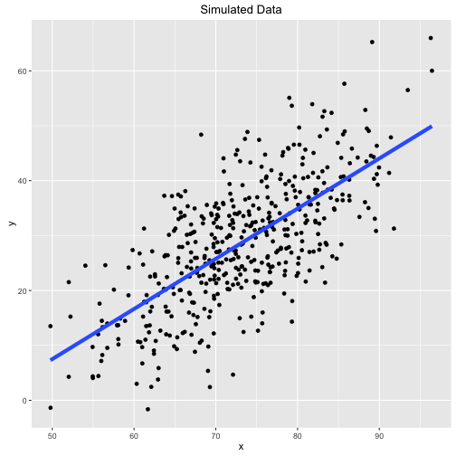

## 5\. 使用模型探索您的数据

本章的目标是更广泛地描述模型的概念，解释与数据集相关的模型的目的，并最后描述数据分析师创建、评估和完善模型的过程。从非常一般的意义上说，模型是我们构建的东西，帮助我们理解现实世界。一个常见的例子是使用模仿人类疾病的动物来帮助我们理解，并有望预防和/或治疗该疾病。同样的概念适用于一组数据 - 据推测，你正在使用数据来理解现实世界。

在政治世界中，一位民意调查员拥有一组关于可能选民的样本数据，民意调查员的工作是利用这个样本来预测选举结果。数据分析师使用民意调查数据构建模型，以预测选举日的情况。建立模型的过程涉及对数据施加特定结构并创建数据摘要。以民意调查数据为例，你可能有数千个观测结果，因此模型是一个反映数据形状或模式的数学方程，并且该方程允许你用一个数字来总结数千个观测结果，例如，可能是将投票给你候选人的选民的百分比。现在，这些最后的概念可能有点模糊，但随着你继续阅读，它们会变得更加清晰。

统计模型在数据分析中起着两个关键作用，即提供对数据的数量化摘要，并对抽样自数据的人群施加特定结构。通过极端例子的说明，有时可以更好地理解模型是什么以及为什么它有用。微不足道的“模型”简单地是**没有模型**。

想象一下，你想要对 20 个人进行调查，询问他们愿意为你正在开发的产品支付多少钱。这项调查的目标是什么？可以推测，如果你花时间和金钱开发一种新产品，那么你相信存在着一大群愿意购买该产品的人群。然而，询问每个人愿意支付多少显然太昂贵且复杂。因此，你从该人群中抽取一个样本，以了解人群愿意支付的大致金额。

我们（罗杰）最近出版了一本名为[*数据科学的 R 编程*](https://leanpub.com/rprogramming)的书。在该书出版之前，感兴趣的读者可以将他们的姓名和电子邮件地址提交到该书的网站，以便得到有关该书出版的通知。此外，还有一个选项可以指定他们愿意为该书支付多少钱。以下是从自愿提供此信息的人中随机抽取的 20 个回复的样本。

```
`25` `20` `15` `5` `30` `7` `5` `10` `12` `40` `30` `30` `10` `25` `10` `20` `10` `10` `25` `5` 
```

`现在假设有人问你：“数据告诉我们什么？”你可以做的一件事就是简单地交出数据——所有 20 个数字。由于数据集并不是那么庞大，所以这不会是一个巨大的负担。最终，他们问题的答案在于数据集中，但拥有所有数据并不是任何一种摘要。拥有所有数据很重要，但通常并不是非常有用。这是因为琐碎的模型没有对数据进行任何缩减。

统计模型的第一个关键要素是*数据缩减*。基本思想是，你想把原始的数据集合中的一组数字转换成一个更小的数字集合。如果你最初有 20 个数字，你的模型应该产生比 20 个数字更少的摘要。数据缩减的过程通常会得到一个*统计量*。一般来说，统计量是数据的任何摘要。样本均值，或平均值，是一种统计量。中位数，标准偏差，最大值，最小值和范围也是如此。一些统计量比其他的更有用，但它们都是数据的摘要。

也许你能得到的最简单的数据缩减就是平均值，或者数据的简单算术平均值，在这种情况下是$17.2。在这种情况下，从 20 个数字到 1 个数字的转换是你可以做的最大程度的缩减，所以它绝对满足了模型的摘要元素。

### 5.1 模型作为期望

但是，简单的摘要统计量，比如一组数字的平均值，是不足以构建模型的。统计模型还必须对数据施加一些结构。在其核心，**统计模型提供了世界运作方式以及数据是如何生成的描述**。模型本质上是对现实世界中各种因素之间关系的*期望*，以及数据集中的关系。使得模型成为*统计模型*的是它允许在生成数据时存在一些随机性。

#### 应用正态模型

或许世界上最流行的统计模型就是正态模型。这个模型表明，一组数据中的随机性可以用正态分布或钟形曲线来解释。正态分布由两个参数完全确定——平均值和标准偏差。

拿我们在前一节描述的数据——20 个人愿意为一个假想的新产品支付的金额来说。希望这 20 个人是可能购买这个新产品的整个人群的代表样本。如果是这样的话，那么数据集中包含的信息可以告诉你一些关于整个人群的情况。

要将正态模型应用于这个数据集，我们只需要计算平均值和标准偏差。在这种情况下，平均值是$17.2，标准偏差是$10.39。给定这些参数，我们在正态模型下的期望是人们愿意支付的价格分布看起来像这样。


价格的正态模型

根据模型，大约有 68%的人口愿意为这种新产品支付介于$6.81 和$27.59 之间的价格。这是否是有用的信息取决于具体情况，暂时我们将忽略这一点。

如果你愿意，你可以使用统计模型来回答更复杂的问题。例如，假设你想知道“有多少比例的人口愿意为这本书支付超过$30？”利用正态分布的特性（以及 R 的一点计算帮助），我们可以轻松地进行这个计算。

```
pnorm`(``30``,` mean `=` `mean``(`x`),` sd `=` sd`(`x`),` lower.tail `=` `FALSE``)` 
```

````
`[``1``]` `0.1089893` 
```

 `So about 11% of the population would be willing to pay more than $30 for the product. Again, whether this is useful to you depends on your specific goals.

Note that in the picture above there is one crucial thing that is missing—the data! That’s not exactly true, because we used the data to draw the picture (to calculate the mean and standard deviation of the Normal distribution), but ultimately the data do not appear directly in the plot. In this case **we are using the Normal distribution to tell us what the population looks like**, not what the data look like.

The key point here is that we used the Normal distribution to setup the shape of the distribution that we *expect* the data to follow. The Normal distribution is our expectation for what the data should look like.

### 5.2 Comparing Model Expectations to Reality

We may be very proud of developing our statistical model, but ultimately its usefulness will depend on how closely it mirrors the data we collect in the real world. How do we know if our expectations match with reality?

#### Drawing a fake picture

To begin with we can make some pictures, like a histogram of the data. But before we get to the data, let’s figure out what we *expect* to see from the data. If the population followed roughly a Normal distribution, and the data were a random sample from that population, then the distribution estimated by the histogram should look like the theoretical model provided by the Normal distribution.

In the picture below, I’ve simulated 20 data points from a Normal distribution and overlaid the theoretical Normal curve on top of the histogram.


Histogram of Simulated Normal Data

Notice how closely the histogram bars and the blue curve match. This is what we want to see with the data. If we see this, then we might conclude that the Normal distribution is a **good statistical model for the data**.

Simulating data from a hypothesized model, if possible, is a good way to setup expectations *before* you look at the data. Drawing a fake picture (even by hand, if you have to) can be a very useful tool for initiating discussions about the model and what we expect from reality.

For example, before we even look at the data, we might suspect the Normal model may not provide a perfect representation of the population. In particular, the Normal distribution allows for *negative* values, but we don’t really expect that people will say that they’d be willing to pay negative dollars for a book.

So we have some evidence already that the Normal model may not be a *perfect* model, but no model is perfect. The question is does the statistical model provide a reasonable approximation that can be useful in some way?

#### The real picture

Here is a histogram of the data from the sample of 20 respondents. On top of the histogram, I’ve overlaid the Normal curve on top of the histogram of the 20 data points of the amount people say they are willing to pay for the book.


Histogram of Price Survey Data

What we would *expect* is that the histogram and the blue line should roughly follow each other. How do the model and reality compare?

At first glance, it looks like the histogram and the Normal distribution don’t match very well. The histogram has a large spike around $10, a feature that is not present with the blue curve. Also, the Normal distribution allows for negative values on the left-hand side of the plot, but there are no data points in that region of the plot.

So far the data suggest that the Normal model isn’t really a very good representation of the population, given the data that we sampled from the population. It seems that the 20 people surveyed have strong preference for paying a price in the neighborhood of $10, while there are a few people willing to pay more than that. These features of the data are not well characterized by a Normal distribution.

### 5.3 Reacting to Data: Refining Our Expectations

Okay, so the model and the data don’t match very well, as was indicated by the histogram above. So what to do? Well, we can either

1.  Get a different model; or
2.  Get different data

Or we could do both. What we do in response depends a little on our beliefs about the model and our understanding of the data collection process. If we felt strongly that the population of prices people would be willing to pay should follow a Normal distribution, then we might be less likely to make major modifications to the model. We might examine the data collection process to see if it perhaps led to some bias in the data. However, if the data collection process is sound, then we might be forced to re-examine our model for the population and see what could be changed. In this case, it’s likely that our model is inappropriate, especially given that it’s difficult to imagine a valid data collection process that might lead to negative values in the data (as the Normal distribution allows).

To close the loop here, we will choose a different statistical model to represent the population, the *Gamma distribution*. This distribution has the feature that it only allows positive values, so it eliminates the problem we had with negative values with the Normal distribution.

Now, we should go back to the top of our iteration and do the following:

1.  Develop expectations: Draw a fake picture—what do we expect to see before looking at the data?
2.  Compare our expectations to the data
3.  Refine our expectations, given what the data show

For your reference, here is a histogram of the same data with the Gamma distribution (estimated using the data) overlaid.


Price Survey Data with Gamma Distribution

How do the data match your expectations now?

You might ask what difference does it make which model I use to represent the population from which the data were generated? Well, for starters it might affect the kinds of predictions that you might make using the model. For example, recall before that were interested in what proportion of the population might be willing to pay at least $30 dollars for the book. Our new model says that only about 7% of the population would be willing to pay at least this amount (the Normal model claimed 11% would pay $30 or more). So different models can yield different predictions based on the same data, which may impact decisions made down the road.

### 5.4 Examining Linear Relationships

It’s common to look at data and try to understand linear relationships between variables of interest. The most common statistical technique to help with this task is *linear regression*. We can apply the principles discussed above—developing expectations, comparing our expectations to data, refining our expectations—to the application of linear regression as well.

For this example we’ll look at a simple air quality dataset containing information about tropospheric ozone levels in New York City in the year 1999 for months of May through 1999\. Here are the first few rows of the dataset.

```
 ozone     temp month
`1` `25.37262` `55.33333`     `5`
`2` `32.83333` `57.66667`     `5`
`3` `28.88667` `56.66667`     `5`
`4` `12.06854` `56.66667`     `5`
`5` `11.21920` `63.66667`     `5`
`6` `13.19110` `60.00000`     `5` 
```

 `The data contain daily average levels of ozone (in parts per billion [pbb]) and temperature (in degrees Fahrenheit). One question of interest that might motivate the collection of this dataset is “How is ambient temperature related to ambient ozone levels in New York?”

#### Expectations

After reading a little about [ozone formation in the atmosphere](https://en.wikipedia.org/wiki/Tropospheric_ozone), we know that the formation of ozone depends critically on the presence of sunlight. Sunlight is also related to temperature in the sense that on days where there is a lot of sunlight, we would expect the average temperature for that day to be higher. Cloudy days have both lower temperatures on average and less ozone. So there’s reason to believe that on days with higher temperatures we would expect there to be higher ozone levels. This is an indirect relationship—we are using temperature here as essentially a proxy for the amount of sunlight.

The simplest model that we might formulate for characterizing the relationship between temperature and ozone is a *linear model*. This model says that as temperature increases, the amount of ozone in the atmosphere increases linearly with it. What do we expect this to look like?

We can simulate some data to make a *fake picture* of what the relationship between ozone and temperature should look like under a linear model. Here’s a simple linear relationship along with the simulated data in a scatterplot.



Simulated Data with a Linear Model

Note that if you choose any point on the blue line, there is roughly the same number of points above the line as there are below the line (this is also referred to as unbiased errors). Also, the points on the scatterplot appear to increase linearly as you move towards the right on the x-axis, even if there is a quite a bit of noise/scatter along the line.

If we are right about our linear model, and that is the model that characterizes the data and the relationship between ozone and temperature, then roughly speaking, this is the picture we should see when we plot the data.

#### Comparing expectations to data

Here is the picture of the actual ozone and temperature data in New York City for the year 1999\. On top of the scatterplot of the data, we’ve plotted the fitted linear regression line estimated using the data.


Linear Model for Ozone and Temperature

How does this picture compare to the picture that you were expecting to see?

One thing is clear: There does appear to be an increasing trend in ozone as temperature increases, as we hypothesized. However, there are a few deviations from the nice fake picture that we made above. The points don’t appear to be evenly balanced around the blue regression line.

If you draw a vertical line around a temperature of 85 degrees, you notice that most of the points are above the line. Drawing a vertical line around 70 degrees shows that most of the points are below the line. This implies that at higher temperatures, our model is biased downward (it underestimates ozone) and at moderate temperatures our model is biased upwards. This isn’t a great feature–in this situation we might prefer that our model is not biased anywhere.

Our simple linear regression model appears to capture the general increasing relationship between temperature and ozone, but it appears to be biased in certain ranges of temperature. It seems that there is room for improvement with this model if we want to better characterize the relationship between temperature and ozone in this dataset.

#### Refining expectations

From the picture above, it appears that the relationship between temperature and ozone may not be linear. Indeed, the data points suggest that maybe the relationship is flat up until about 70 degrees and then ozone levels increase rapidly with temperature after that. This suggest a *nonlinear* relationship between temperature and ozone.

The easiest way we can capture this revised expectation is with a smoother, in this case, a loess smoother.


Loess Smoother for Ozone and Temperature

This plot shows a different picture–the relationship is slowly increasing up until about 75 degrees, and then sharply increases afterwards. Around 90 degrees, there’s a suggestion that the relationship levels off again.

Smoothers (like loess) are useful tools because they quickly capture trends in a dataset without making any structural assumptions about the data. Essentially, they are an automated or computerized way to sketch a curve on to some data. However, smoothers rarely tell you anything about the mechanism of the relationship and so may be limited in that sense. In order to learn more about the relationship between temperature and ozone, we may need to resort to a more detailed model than the simple linear model we had before.

### 5.5 When Do We Stop?

In the examples above, we completed one iteration of the data analysis process. In some cases, a single iteration may be sufficient, but in most real-life cases, you’ll need to iterate at least a few times. From the examples above, there are still some things left to do:

*   **Price Survey Data**: We ended the example by fitting a Gamma distribution model. But how does that fit the data? What would we expect from the data if they truly followed a Gamma distribution (we never made that plot)? Is there a better way to capture that spike in the distribution right around $10?
*   **Ozone and Temperature**: The smoother suggested a nonlinear relationship between temperature and ozone, but what is the reason for this? Is the nonlinearity real or just a chance occurrence in the data? Is there a known physical process that explains the dramatic increase in ozone levels beyond a certain temperature and can we model that process?

Ultimately, you might be able to iterate over and over again. Every answer will usually raise more questions and require further digging into the data. When exactly do you stop the process then? Statistical theory suggests a number of different approaches to determining when a statistical model is “good enough” and fits the data well. This is not what we will discuss here, but rather we will discuss a few high-level criteria to determine when you might consider stopping the data analysis iteration.

#### Are you out of data?

Iterative data analysis will eventually begin to raise questions that simply cannot be answered with the data at hand. For example, in the ozone/temperature analysis, the modeling suggested that there isn’t just a simple relationship between the two variables, that it may be nonlinear. But the data can’t explain precisely why such a nonlinear relationship might exist (although they can suggest certain hypotheses). Also, you may need to collect additional data to determine whether what you observe is real or simply a fluke or statistical accident. Either way, you need to go back out into the world and collect new data. More data analysis is unlikely to bring these answers.

Another situation in which you may find yourself seeking out more data is when you’ve actually completed the data analysis and come to satisfactory results, usually some interesting finding. Then, it can be very important to try to *replicate* whatever you’ve found using a different, possibly independent, dataset. In the ozone/temperature example, if we concluded that there were a nonlinear relationship between temperature and ozone, our conclusion might be made more powerful if we could show that this relationship were present in other cities besides New York. Such independent confirmation can increase the strength of evidence and can play a powerful role in decision-making.

#### Do you have enough evidence to make a decision?

Data analysis is often conducted in support of decision-making, whether in business, academia, government, or elsewhere, we often collect an analyze data to inform some sort of decision. It’s important to realize that the analysis that you perform to get yourself to the point where you can make a decision about something may be very different from the analysis you perform to achieve other goals, such as writing a report, publishing a paper, or putting out a finished product.

That’s why it’s important to always keep in mind the *purpose* of the data analysis as you go along because you may over- or under-invest resources in the analysis if the analysis is not attuned to the ultimate goal. The purpose of a data analysis may change over time and there may in fact be multiple parallel purposes. The question of whether you have enough evidence depends on factors specific to the application at hand and your personal situation with respect to costs and benefits. If you feel you do not have enough evidence to make a decision, it may be because you are out of data, or because you need to conduct more analysis.

#### Can you place your results in any larger context?

Another way to ask this question is “Do the results make some sort of sense?” Often, you can answer this question by searching available literature in your area or see if other people inside or outside your organization have come to a similar conclusion. If your analysis findings hew closely to what others have found, that may be a good thing, but it’s not the only desirable outcome. Findings that are at odds with past results may lead down a path of new discovery. In either case, it’s often difficult to come to the right answer without further investigation.

You have to be a bit careful with how you answer this question. Often, especially with very large and complex datasets, it’s easy to come to a result that “makes sense” and conforms to our understanding of how a given process *should* work. In this situation, it’s important to be hypercritical of our findings and to challenge them as much as possible. In our experience, when the data very closely match our expectation, it can be a result of either mistakes or misunderstandings in the analysis or in the data collection process. It is critical to question every aspect of the analysis process to make sure everything was done appropriately.

If your results do *not* make sense, or the data do not match your expectation, then this is where things get interesting. You may simply have done something incorrectly in the analysis or the data collection. Chances are, that’s exactly what happened. For every diamond in the rough, there are 99 pieces of coal. However, on the off-chance that you’ve discovered something unusual that others have not yet seen, you’ll need to (a) make sure that the analysis was done properly and (b) replicate your findings in another dataset. Surprising results are usually met with much scrutiny and you’ll need to be prepared to rigorously defend your work.

Ultimately, if your analysis leads you to a place where you can definitively answer the question “Do the results make sense?” then regardless of how you answer that question, you likely need to **stop your analysis and carefully check every part of it**.

#### Are you out of time?

This criterion seems arbitrary but nevertheless plays a big role in determining when to stop an analysis in practice. A related question might be “Are you out of money?” Ultimately, there will be both a time budget and a monetary budget that determines how many resources can be committed to a given analysis. Being aware of what these budgets are, even if you are not necessarily in control of them, can be important to managing a data analysis. In particular, you may need to argue for more resources and to persuade others to given them to you. In such a situation, it’s useful to know when to stop the data analysis iteration and prepare whatever results you may have obtained to date in order to present a coherent argument for continuation of the analysis.

### 5.6 Summary

Model building, like the entire process of data analysis itself, is an iterative process. Models are used to provide data reduction and to give you some insight into the population about which you are trying to make inference. It’s important to first set your expectations for a how a model should characterize a dataset before you actually apply a model to data. Then you can check to see how your model conforms to your expectation. Often, there will be features of the dataset that do not conform to your model and you will have to either refine your model or examine the data collection process.````
